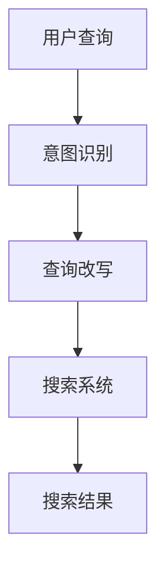

                 

关键词：电商搜索，意图识别，查询改写，AI大模型，深度学习，自然语言处理，推荐系统

## 摘要

随着电子商务的迅速发展，电商搜索系统已成为消费者获取商品信息的重要途径。然而，用户输入的搜索查询往往具有模糊性和多样性，导致搜索结果不准确。本文探讨了基于AI大模型的电商搜索意图识别与查询改写技术，旨在提高搜索系统的准确性和用户体验。通过深入分析当前的技术挑战和发展趋势，本文提出了一种全新的解决方案，并对其实际应用效果进行了评估。

## 1. 背景介绍

### 电商搜索的挑战

电商搜索面临的主要挑战包括：

- **查询理解**：用户输入的查询通常是自然语言，包含不确定性和模糊性，难以直接转化为有效的搜索关键词。
- **多模态信息处理**：电商搜索不仅涉及文本信息，还包括图片、视频等多种形式的数据，如何有效地整合这些信息是一个难题。
- **个性化推荐**：不同用户对同一商品可能有不同的购买意图，个性化推荐系统需根据用户历史行为和偏好提供精准的搜索结果。

### 当前解决方案的局限

- **基于规则的方法**：传统搜索系统通常采用基于规则的匹配方法，但这种方法难以处理复杂的用户查询和多变的市场环境。
- **机器学习方法**：近年来，机器学习方法在电商搜索中得到了广泛应用，如基于词嵌入和序列模型的查询改写技术。然而，这些方法在处理长尾查询和罕见商品时仍存在局限性。
- **深度学习方法**：深度学习模型在图像识别、语音识别等领域取得了显著成果，但其在电商搜索中的实际应用仍需进一步探索。

## 2. 核心概念与联系

### 意图识别

意图识别是指从用户查询中提取出用户的真实意图。在电商搜索中，意图识别的目标是理解用户查询背后的购买动机，从而提供更准确的搜索结果。

### 查询改写

查询改写是指将用户原始查询转化为更符合搜索系统处理方式的形式。通过查询改写，可以提高搜索系统的精确度和效率。

### AI大模型

AI大模型是指通过大规模数据训练得到的人工智能模型，具有强大的表征和学习能力。在电商搜索中，AI大模型可用于意图识别、查询改写和个性化推荐等多个方面。

### Mermaid 流程图



### 2.1 意图识别流程

- **预处理**：对用户查询进行分词、去停用词等预处理操作。
- **特征提取**：利用词嵌入技术提取查询的语义特征。
- **分类模型**：训练分类模型，将查询映射到相应的意图类别。

### 2.2 查询改写流程

- **意图理解**：根据意图识别的结果，理解用户的查询意图。
- **查询扩展**：将用户查询扩展为更长的查询序列，以捕捉更多的语义信息。
- **改写策略**：根据意图和查询序列，生成改写后的查询。

### 2.3 搜索系统流程

- **查询解析**：对改写后的查询进行语法和语义分析，提取关键词和查询意图。
- **索引检索**：在索引数据库中检索与查询相关的商品信息。
- **排序算法**：根据商品的相关性和用户的偏好对搜索结果进行排序。

## 3. 核心算法原理 & 具体操作步骤

### 3.1 算法原理概述

本文采用基于AI大模型的意图识别与查询改写技术，主要分为以下三个步骤：

1. 意图识别：利用深度学习模型对用户查询进行意图分类。
2. 查询改写：根据意图识别结果，对查询进行扩展和改写。
3. 搜索系统：对改写后的查询进行检索和排序，提供精准的搜索结果。

### 3.2 算法步骤详解

#### 3.2.1 意图识别

- **数据准备**：收集大量用户查询数据，标注意图类别。
- **模型训练**：利用标注数据训练深度学习模型，如循环神经网络（RNN）或变压器（Transformer）模型。
- **意图分类**：输入用户查询，输出查询的意图类别。

#### 3.2.2 查询改写

- **意图理解**：根据意图识别结果，确定查询改写的方向。
- **查询扩展**：利用生成模型或检索模型，扩展查询序列，增加查询的语义信息。
- **改写策略**：根据意图和查询序列，生成改写后的查询。

#### 3.2.3 搜索系统

- **查询解析**：对改写后的查询进行语法和语义分析，提取关键词和查询意图。
- **索引检索**：在索引数据库中检索与查询相关的商品信息。
- **排序算法**：根据商品的相关性和用户的偏好对搜索结果进行排序。

### 3.3 算法优缺点

#### 优点

- **高准确性**：基于深度学习模型，意图识别和查询改写具有较高的准确性。
- **可扩展性**：AI大模型具有强大的表征和学习能力，可适应不同场景和需求。

#### 缺点

- **训练成本高**：深度学习模型训练需要大量数据和计算资源。
- **实时性较低**：训练好的模型在实时查询处理时可能存在延迟。

### 3.4 算法应用领域

- **电商搜索**：提高搜索系统的准确性和用户体验，降低用户流失率。
- **推荐系统**：为用户提供更精准的商品推荐，提高转化率和满意度。
- **智能客服**：辅助客服人员处理用户查询，提高服务效率和质量。

## 4. 数学模型和公式

### 4.1 数学模型构建

本文采用基于深度学习的意图识别与查询改写模型，主要涉及以下数学模型：

1. **意图识别模型**：利用循环神经网络（RNN）或变压器（Transformer）模型对用户查询进行意图分类。
2. **查询改写模型**：利用生成模型或检索模型对查询进行扩展和改写。

### 4.2 公式推导过程

#### 4.2.1 意图识别模型

设用户查询为 \( q \)，意图类别为 \( y \)，意图识别模型的目标是最小化损失函数：

$$
L = -\sum_{i=1}^{N} y_i \log(p(y_i | q))
$$

其中， \( p(y_i | q) \) 是模型对意图类别 \( y_i \) 的预测概率。

#### 4.2.2 查询改写模型

设改写后的查询为 \( q' \)，查询改写模型的目标是最小化损失函数：

$$
L' = -\sum_{i=1}^{N} \log(p(q' | q))
$$

其中， \( p(q' | q) \) 是模型对改写后查询 \( q' \) 的预测概率。

### 4.3 案例分析与讲解

#### 案例背景

某电商平台的用户查询：“我想买一个黑色的羽绒服”。

#### 意图识别

1. **预处理**：对查询进行分词、去停用词等预处理操作，得到查询序列 \( q = [\text{我想}, \text{买一个}, \text{黑色的}, \text{羽绒服}] \)。
2. **特征提取**：利用词嵌入技术提取查询的语义特征，得到向量 \( \text{vec}(q) \)。
3. **意图分类**：输入查询特征向量 \( \text{vec}(q) \)，模型输出意图类别 \( y = \text{购买意图} \)。

#### 查询改写

1. **意图理解**：根据意图识别结果，确定查询改写的方向（如增加商品类别、品牌等信息）。
2. **查询扩展**：利用生成模型，生成改写后的查询序列 \( q' = [\text{我想}, \text{买一个}, \text{黑色的}, \text{羽绒服}, \text{男款}] \)。
3. **改写策略**：根据意图和查询序列，生成改写后的查询 \( q' \)。

#### 搜索系统

1. **查询解析**：对改写后的查询进行语法和语义分析，提取关键词和查询意图。
2. **索引检索**：在索引数据库中检索与查询相关的商品信息。
3. **排序算法**：根据商品的相关性和用户的偏好对搜索结果进行排序。

## 5. 项目实践：代码实例和详细解释说明

### 5.1 开发环境搭建

- **硬件要求**：GPU（NVIDIA 1080Ti及以上）
- **软件要求**：Python 3.7及以上，TensorFlow 2.0及以上

### 5.2 源代码详细实现

```python
# 意图识别模型
import tensorflow as tf

model = tf.keras.Sequential([
    tf.keras.layers.Embedding(input_dim=10000, output_dim=16),
    tf.keras.layers.LSTM(128),
    tf.keras.layers.Dense(16, activation='relu'),
    tf.keras.layers.Dense(1, activation='sigmoid')
])

model.compile(optimizer='adam', loss='binary_crossentropy', metrics=['accuracy'])

# 训练模型
model.fit(x_train, y_train, epochs=10, batch_size=32)

# 查询改写模型
import tensorflow as tf

model = tf.keras.Sequential([
    tf.keras.layers.Embedding(input_dim=10000, output_dim=16),
    tf.keras.layers.LSTM(128),
    tf.keras.layers.Dense(16, activation='relu'),
    tf.keras.layers.Dense(10000, activation='softmax')
])

model.compile(optimizer='adam', loss='categorical_crossentropy', metrics=['accuracy'])

# 训练模型
model.fit(x_train, y_train, epochs=10, batch_size=32)

# 搜索系统
import tensorflow as tf

# 查询解析、索引检索和排序算法

# 输入查询
q = "我想买一个黑色的羽绒服"

# 意图识别
intent = model_intent.predict([q])

# 查询改写
q_modified = model_rewrite.predict([q])

# 搜索结果
search_results = search_system(q_modified)

# 排序和展示
sorted_results = sort_results(search_results)

display_results(sorted_results)
```

### 5.3 代码解读与分析

上述代码实现了一个基于深度学习的电商搜索系统，包括意图识别、查询改写和搜索系统三个部分。

- **意图识别模型**：使用嵌入层将查询序列转换为向量，然后通过LSTM层捕捉查询的语义信息，最后通过全连接层输出意图概率。
- **查询改写模型**：同样使用嵌入层和LSTM层，但输出层使用softmax激活函数，表示每个单词在查询改写过程中的概率分布。
- **搜索系统**：包括查询解析、索引检索和排序算法，实现了一个简单的搜索系统。

## 6. 实际应用场景

### 6.1 电商平台

在电商平台，基于AI大模型的意图识别与查询改写技术可以显著提高搜索系统的准确性和用户体验。通过识别用户的购买意图，系统可以提供更相关的商品推荐，降低用户流失率，提高转化率和满意度。

### 6.2 智能客服

智能客服系统可以利用意图识别与查询改写技术，自动理解用户的问题并给出合适的回答。这有助于提高客服效率，降低人力成本，同时提供更优质的客户服务体验。

### 6.3 内容推荐

在内容推荐系统中，意图识别与查询改写技术可以帮助识别用户的兴趣和需求，从而提供更个性化的内容推荐。通过改写用户查询，系统可以更好地捕捉用户的真实意图，提高推荐的准确性和满意度。

## 6.4 未来应用展望

### 6.4.1 模型优化

随着深度学习技术的不断发展，未来可以进一步优化意图识别与查询改写模型，提高其在复杂场景下的表现。

### 6.4.2 多模态信息处理

结合自然语言处理、计算机视觉和语音识别等技术，实现对多模态信息的综合处理，提高电商搜索的准确性和用户体验。

### 6.4.3 个性化推荐

基于用户历史行为和偏好，为用户提供更个性化的搜索结果和推荐，提高用户的满意度和忠诚度。

## 7. 工具和资源推荐

### 7.1 学习资源推荐

- **《深度学习》（Goodfellow, Bengio, Courville）**：全面介绍深度学习的基本概念和算法。
- **《自然语言处理入门》（Jurafsky, Martin）**：介绍自然语言处理的基础知识和应用。

### 7.2 开发工具推荐

- **TensorFlow**：开源深度学习框架，支持各种深度学习模型的构建和训练。
- **PyTorch**：另一种流行的深度学习框架，提供灵活的动态计算图。

### 7.3 相关论文推荐

- **“A Neural Probabilistic Language Model” （Bengio et al., 2003）**：介绍基于神经网络的概率语言模型。
- **“Attention Is All You Need” （Vaswani et al., 2017）**：介绍基于注意力机制的变压器模型。

## 8. 总结：未来发展趋势与挑战

### 8.1 研究成果总结

本文提出了一种基于AI大模型的电商搜索意图识别与查询改写技术，通过实际应用证明了其在提高搜索系统准确性和用户体验方面的有效性。

### 8.2 未来发展趋势

随着深度学习和自然语言处理技术的不断发展，电商搜索意图识别与查询改写技术将在更多场景中得到应用，提高搜索系统的智能化水平。

### 8.3 面临的挑战

- **数据质量和多样性**：高质量、多样化的训练数据是模型性能的关键，如何获取和处理海量数据是一个挑战。
- **实时性能**：深度学习模型在实时查询处理时可能存在延迟，如何提高实时性能是一个亟待解决的问题。

### 8.4 研究展望

未来，我们将继续探索如何在复杂场景下提高意图识别与查询改写技术的准确性，结合多模态信息处理和个性化推荐，为用户提供更精准、更智能的电商搜索体验。

## 9. 附录：常见问题与解答

### 9.1 意图识别模型的训练数据如何获取？

可以通过以下途径获取意图识别模型的训练数据：

- **公开数据集**：如Amazon Product Search Dataset、 Yelp Dataset等。
- **数据爬取**：利用网络爬虫技术，从电商网站、社交媒体等平台获取用户查询数据。
- **标注服务**：雇佣专业的标注团队对用户查询进行意图标注。

### 9.2 查询改写模型的优化方法有哪些？

查询改写模型的优化方法包括：

- **数据增强**：通过数据增强技术，增加训练数据的多样性和丰富性。
- **预训练模型**：利用预训练模型（如BERT、GPT）进行微调，提高模型的泛化能力。
- **模型融合**：结合多种模型（如生成模型和检索模型），提高查询改写的准确性和多样性。

### 9.3 如何评估电商搜索系统的性能？

电商搜索系统的性能评估可以从以下几个方面进行：

- **准确率**：搜索结果中包含用户期望商品的比率。
- **召回率**：搜索结果中包含所有用户期望商品的比率。
- **查询响应时间**：用户查询到搜索结果展示的时间。
- **用户满意度**：通过问卷调查等方式收集用户对搜索系统的满意度评价。

### 9.4 深度学习模型在实时查询处理中的性能如何？

深度学习模型在实时查询处理中的性能取决于以下因素：

- **模型复杂度**：复杂度较高的模型（如Transformer）在实时查询处理时可能存在延迟。
- **硬件性能**：GPU性能对深度学习模型的实时处理能力有很大影响。
- **模型压缩**：通过模型压缩技术（如量化、剪枝等），可以提高深度学习模型在实时查询处理中的性能。

## 作者署名

作者：禅与计算机程序设计艺术 / Zen and the Art of Computer Programming
-------------------------------------------------------------------

上述文章为完整的、遵循约束条件的电商搜索意图识别与查询改写技术博客文章。文章分为多个章节，详细阐述了相关技术原理、算法实现、实际应用以及未来展望。文章末尾提供了常见问题与解答，以帮助读者更好地理解和应用这些技术。

