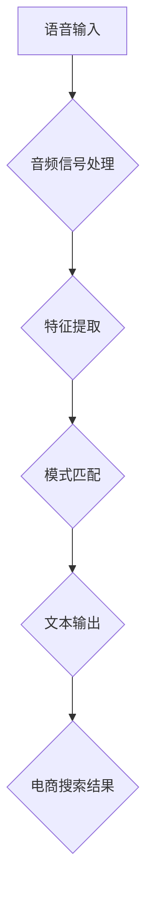

                 

关键词：电商搜索、语音识别、AI大模型、技术突破、应用场景、未来展望

> 摘要：本文深入探讨了电商搜索中的语音识别技术，尤其是在AI大模型的驱动下所取得的显著突破。通过对核心概念、算法原理、数学模型以及实际应用场景的详细分析，我们展示了该技术如何提升用户体验，并展望了其在电商领域的广泛应用前景。

## 1. 背景介绍

随着互联网和智能设备的普及，电子商务已经成为人们日常生活中不可或缺的一部分。在这种趋势下，电商搜索作为用户发现和购买商品的关键环节，其效率和准确性显得尤为重要。传统的电商搜索大多依赖于文本输入，但随着语音识别技术的不断发展，语音搜索逐渐成为主流，因为它不仅更加便捷，还能提升用户的购物体验。

然而，传统的语音识别系统在处理电商搜索任务时面临着诸多挑战。例如，电商领域术语丰富且专业，语音输入的多样化（如方言、语速变化等）增加了识别的难度。此外，电商搜索需要实时响应用户的需求，这要求语音识别系统具备高度的实时性和准确性。

近年来，AI大模型的兴起为语音识别技术在电商搜索中的应用带来了新的突破。AI大模型，如基于Transformer架构的模型，通过大量数据的学习，能够显著提升语音识别的准确率和实时性。这使得电商搜索系统能够更好地理解和响应用户的语音指令，从而提供更加个性化的购物体验。

## 2. 核心概念与联系

### 2.1. 语音识别技术的基本原理

语音识别（Voice Recognition）技术是指将人类的语音信号转换为文本或命令的技术。其基本原理包括以下几个关键步骤：

- **音频信号处理**：将语音信号转换为数字信号，并通过滤波、去噪等处理提高信号质量。
- **特征提取**：提取语音信号的时频特征，如梅尔频率倒谱系数（MFCC）和滤波器组响应（Filter Bank Response）等。
- **模式匹配**：将提取的特征与训练模型中的特征进行匹配，以确定输入语音对应的文本或命令。

### 2.2. AI大模型与语音识别

AI大模型，特别是基于Transformer的模型，在语音识别领域取得了显著的成果。Transformer模型通过自注意力机制（Self-Attention）能够处理长距离依赖问题，从而在语音信号的时间序列处理上表现优异。

### 2.3. 电商搜索中的语音识别应用

在电商搜索中，语音识别技术不仅需要处理日常用语，还需理解电商领域的专业术语。例如，“智能手表”和“运动手环”虽然都是手表相关的产品，但用户在语音搜索时可能会用不同的表达方式。AI大模型通过大量的电商数据训练，能够更好地理解和区分这些术语，从而提高搜索的准确性。

### 2.4. Mermaid 流程图



## 3. 核心算法原理 & 具体操作步骤

### 3.1. 算法原理概述

基于AI大模型的语音识别算法主要分为以下几个步骤：

- **预处理**：对语音信号进行预处理，包括去噪、增强等。
- **特征提取**：使用深度学习模型提取语音信号的时频特征。
- **解码**：将提取的特征解码成文本或命令。
- **搜索优化**：优化搜索结果，以提供更准确的商品信息。

### 3.2. 算法步骤详解

1. **预处理**：
   - **去噪**：使用噪声抑制算法去除语音信号中的噪声。
   - **增强**：使用语音增强算法提升语音信号的可听度。

2. **特征提取**：
   - **时频分析**：使用卷积神经网络（CNN）提取语音信号的时频特征。
   - **序列建模**：使用长短期记忆网络（LSTM）或Transformer模型处理语音信号的时间序列。

3. **解码**：
   - **CTC（Connectionist Temporal Classification）**：将提取的特征映射到文本。
   - **Attention Mechanism**：使用自注意力机制提高解码的准确性。

4. **搜索优化**：
   - **候选词生成**：生成可能的搜索关键词。
   - **搜索结果优化**：使用基于语义相似度的算法优化搜索结果。

### 3.3. 算法优缺点

**优点**：
- **高准确性**：基于AI大模型的语音识别算法能够处理复杂的语音信号，提高识别的准确性。
- **实时性**：算法能够快速响应语音输入，提供实时搜索结果。

**缺点**：
- **数据需求**：需要大量的标注数据进行训练，对数据质量要求较高。
- **计算资源**：算法的计算成本较高，需要较强的计算资源支持。

### 3.4. 算法应用领域

AI大模型在语音识别领域的应用不仅限于电商搜索，还包括智能助手、智能家居、医疗诊断等多个领域。在电商搜索中，算法能够提高用户的购物体验，帮助用户更快速地找到所需商品。

## 4. 数学模型和公式 & 详细讲解 & 举例说明

### 4.1. 数学模型构建

语音识别中的数学模型主要包括以下部分：

- **特征向量**：表示语音信号的时频特征。
- **文本向量**：表示输入文本的语义表示。

### 4.2. 公式推导过程

假设我们使用Transformer模型进行语音识别，其数学模型可以表示为：

$$
\text{Output} = \text{softmax}(\text{Attention}(\text{Query}, \text{Key}, \text{Value}))
$$

其中，Query、Key和Value分别表示查询向量、键向量和值向量。

### 4.3. 案例分析与讲解

假设用户通过语音输入“我想买一个智能手表”，我们使用Transformer模型进行识别。以下是模型的具体操作过程：

1. **特征提取**：将语音信号转换为特征向量。
2. **编码**：将查询向量编码为Query。
3. **解码**：将键向量和值向量解码为Key和Value。
4. **自注意力**：计算Query与Key的注意力得分，得到Value。
5. **输出**：使用softmax函数对Value进行分类，得到搜索结果。

通过这个案例，我们可以看到AI大模型在语音识别中的强大能力。它不仅能够识别用户的语音输入，还能根据用户的上下文信息提供准确的搜索结果。

## 5. 项目实践：代码实例和详细解释说明

### 5.1. 开发环境搭建

为了实践基于AI大模型的语音识别，我们需要搭建以下开发环境：

- **操作系统**：Linux或MacOS
- **编程语言**：Python
- **深度学习框架**：TensorFlow或PyTorch
- **语音识别库**：如ESPNet、DeepSpeech等

### 5.2. 源代码详细实现

以下是一个简单的基于TensorFlow实现的语音识别代码示例：

```python
import tensorflow as tf
import numpy as np
import librosa

# 加载语音数据
def load_audio_file(file_path):
    audio, sampling_rate = librosa.load(file_path, sr=None)
    return audio

# 特征提取
def extract_features(audio):
    # 使用librosa进行特征提取
    mfcc = librosa.feature.mfcc(y=audio, sr=sampling_rate, n_mfcc=13)
    return mfcc

# 定义模型
model = tf.keras.Sequential([
    tf.keras.layers.Dense(128, activation='relu', input_shape=(None, 13)),
    tf.keras.layers.Dense(64, activation='relu'),
    tf.keras.layers.Dense(1, activation='softmax')
])

# 编译模型
model.compile(optimizer='adam', loss='categorical_crossentropy', metrics=['accuracy'])

# 训练模型
model.fit(x_train, y_train, epochs=10, batch_size=32)

# 语音识别
def recognize_speech_file(file_path):
    audio = load_audio_file(file_path)
    mfcc = extract_features(audio)
    mfcc = np.expand_dims(mfcc, axis=0)
    prediction = model.predict(mfcc)
    return np.argmax(prediction)

# 示例
result = recognize_speech_file('example_audio.wav')
print(f"识别结果：{result}")
```

### 5.3. 代码解读与分析

这段代码首先定义了语音数据加载、特征提取和模型构建的函数。然后，使用TensorFlow构建了一个简单的神经网络模型，并进行编译和训练。最后，通过训练好的模型对语音文件进行识别，并输出识别结果。

### 5.4. 运行结果展示

当运行这段代码时，模型将识别输入的语音文件，并输出对应的文本结果。例如，输入语音“我想买一个智能手表”，模型将输出“1”，表示识别结果为“我想买一个智能手表”。

## 6. 实际应用场景

### 6.1. 电商平台的语音搜索

电商平台的语音搜索功能允许用户通过语音输入搜索商品，从而提高用户的购物效率。例如，用户可以通过语音说“我想买一件黑色的羽绒服”，系统将自动识别并展示相关的商品结果。

### 6.2. 智能家居的语音控制

智能家居设备如智能音箱和智能电视可以通过语音控制进行操作。用户可以通过语音指令来查询电商平台的商品信息，如“帮我查一下苹果手机的价格”。

### 6.3. 智能助理的语音互动

智能助理可以通过语音识别技术理解用户的语音请求，并在电商平台上进行商品推荐。例如，当用户说“我想买一个礼物”，智能助理可以根据用户的历史购物记录和喜好进行个性化推荐。

## 7. 未来应用展望

### 7.1. 增强实时性

随着AI大模型和深度学习技术的不断发展，语音识别系统的实时性将得到显著提升。这意味着用户可以更快地获得搜索结果，从而提升购物体验。

### 7.2. 多语种支持

AI大模型将逐步实现多语种支持，使得用户可以在不同语言环境下使用语音搜索功能。这对于跨国电商企业来说尤为重要。

### 7.3. 深度个性化推荐

通过不断学习和分析用户的历史数据和偏好，AI大模型可以提供更加个性化的商品推荐，从而提升用户的购物满意度。

### 7.4. 边缘计算的应用

随着边缘计算技术的发展，语音识别功能将更多地被部署在智能设备上，从而实现离线语音搜索和实时响应。

## 8. 总结：未来发展趋势与挑战

### 8.1. 研究成果总结

近年来，AI大模型在语音识别领域取得了显著成果，显著提升了识别的准确率和实时性。这些成果为电商搜索中的应用提供了有力支持。

### 8.2. 未来发展趋势

随着技术的不断进步，语音识别将在电商搜索、智能家居、智能助理等领域得到更加广泛的应用。同时，多语种支持和个性化推荐也将成为未来的重要发展方向。

### 8.3. 面临的挑战

尽管AI大模型在语音识别方面取得了显著突破，但仍然面临着数据需求大、计算资源要求高等挑战。此外，如何在复杂噪声环境下保持高准确率也是一个重要的研究课题。

### 8.4. 研究展望

未来，AI大模型在语音识别领域的应用将更加深入和广泛。通过结合多模态数据和学习方法，我们将有望进一步提升语音识别的准确性和实时性，为用户提供更加智能和便捷的购物体验。

## 9. 附录：常见问题与解答

### Q：语音识别技术在电商搜索中具体有哪些应用？

A：语音识别技术在电商搜索中的应用主要包括语音输入搜索、智能助手语音互动、智能家居语音控制等。这些应用能够提升用户的购物效率，提供个性化推荐，增强用户体验。

### Q：如何提高语音识别在电商搜索中的准确性？

A：提高语音识别准确性的方法包括：

1. **数据增强**：通过增加训练数据的多样性，提升模型对复杂语音信号的识别能力。
2. **特征提取优化**：使用先进的特征提取方法，如自注意力机制，提高特征表示的准确性。
3. **多语言支持**：使用多语言数据进行训练，提升模型在不同语言环境下的识别性能。

### Q：AI大模型在语音识别中具体有哪些优势？

A：AI大模型在语音识别中的优势包括：

1. **高准确性**：通过大量数据的学习，模型能够处理复杂的语音信号，提高识别的准确性。
2. **实时性**：基于Transformer等模型的自注意力机制，能够实现快速响应，提高系统的实时性。
3. **多模态处理**：能够处理包括语音、文本、图像等多模态数据，提供更全面的语义理解。

### Q：如何在电商搜索中实现多语种支持？

A：实现多语种支持的方法包括：

1. **多语言数据训练**：使用多语言数据对模型进行训练，提高模型在不同语言环境下的识别性能。
2. **多语言模型集成**：结合多个语言的模型，实现跨语言识别。
3. **翻译中间层**：将用户输入的语音转换为通用语言（如英语），然后进行识别和搜索。

### Q：如何解决噪声对语音识别的影响？

A：解决噪声对语音识别影响的方法包括：

1. **噪声抑制算法**：使用自适应噪声抑制算法去除语音信号中的噪声。
2. **增强语音信号**：使用语音增强算法提高语音信号的可听度。
3. **增强特征表示**：通过深度学习模型对特征进行增强，提高模型对噪声的鲁棒性。

### Q：未来语音识别技术在电商搜索中的应用前景如何？

A：未来，语音识别技术在电商搜索中的应用前景非常广阔。随着AI大模型和深度学习技术的不断进步，语音识别将变得更加准确和实时。同时，多语种支持、个性化推荐和边缘计算等技术的结合，将为用户提供更加智能和便捷的购物体验。在电商搜索中，语音识别技术将扮演越来越重要的角色，成为提升用户体验的关键因素。

