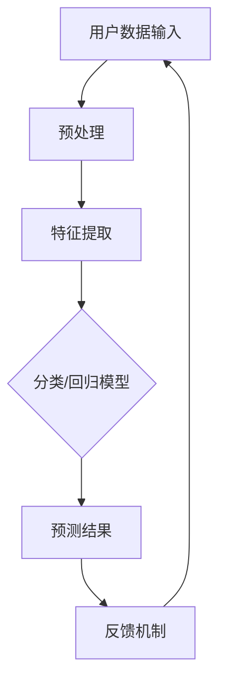

                 

关键词：电商、AI大模型、落地应用、案例分析、技术语言、深度学习、数据挖掘、推荐系统、图像识别、自然语言处理、优化算法。

## 摘要

随着人工智能技术的快速发展，电商行业正迎来一场前所未有的变革。本文将深入探讨AI大模型在电商行业中的应用，通过案例分析，展示其在提升用户体验、优化运营决策、增强个性化服务等方面的卓越表现。文章将围绕核心概念、算法原理、数学模型、项目实践以及实际应用场景等方面进行详细解析，为读者提供一份全面而专业的技术指南。

## 1. 背景介绍

电商行业作为数字经济的重要组成部分，已经深刻改变了人们的消费习惯和商业模式。随着用户数据的爆炸性增长，如何从海量数据中提取价值，提升用户满意度，成为电商企业亟待解决的问题。人工智能技术的引入，尤其是AI大模型的应用，为电商行业带来了新的机遇和挑战。

AI大模型是指利用深度学习、神经网络等技术训练出的具有强大计算能力和泛化能力的模型。在电商行业中，这些模型可以应用于用户行为预测、商品推荐、图像识别、自然语言处理等多个领域，帮助企业实现数据驱动的决策和运营优化。

本文将结合具体案例，分析AI大模型在电商行业中的落地应用，探讨其技术实现、应用效果和未来发展。

## 2. 核心概念与联系

### 2.1 核心概念

- **用户行为预测**：通过分析用户的浏览历史、购买记录等数据，预测用户未来的行为和需求。
- **商品推荐**：基于用户的行为数据和商品属性，为用户推荐可能感兴趣的商品。
- **图像识别**：利用计算机视觉技术，识别和分类商品图像，提高商品搜索的准确性和效率。
- **自然语言处理**：通过对用户评论、商品描述等自然语言文本进行分析和处理，提取有用信息，提升用户体验。

### 2.2 模型架构



### 2.3 关系与联系

AI大模型通过用户数据的预处理、特征提取，构建分类或回归模型进行预测，并将预测结果反馈给用户，形成闭环。这一过程中，图像识别和自然语言处理技术起到了关键作用，帮助模型更准确地理解用户意图和商品属性。

## 3. 核心算法原理 & 具体操作步骤

### 3.1 算法原理概述

AI大模型的核心算法主要基于深度学习，尤其是卷积神经网络（CNN）和循环神经网络（RNN）等。

- **CNN**：主要用于图像识别，通过卷积层、池化层和全连接层等结构，提取图像的局部特征并进行分类。
- **RNN**：主要用于自然语言处理，能够处理序列数据，提取文本的时序特征。

### 3.2 算法步骤详解

1. **数据预处理**：对用户数据、商品数据等进行清洗、归一化处理，确保数据的质量和一致性。
2. **特征提取**：使用CNN提取图像特征，使用RNN提取文本特征，并将这些特征进行融合。
3. **模型训练**：使用提取到的特征，训练分类或回归模型，如SVM、决策树、神经网络等。
4. **模型评估**：通过交叉验证、A/B测试等方法，评估模型的效果，并进行参数调优。
5. **预测应用**：将训练好的模型应用于实际场景，如用户行为预测、商品推荐等。

### 3.3 算法优缺点

- **优点**：能够处理海量数据，提取复杂的特征，提高预测的准确性。
- **缺点**：训练过程计算量大，对硬件资源要求高，且需要大量高质量的数据。

### 3.4 算法应用领域

AI大模型在电商行业中的应用非常广泛，包括但不限于用户行为预测、商品推荐、图像识别、自然语言处理等。以下将结合具体案例进行详细讲解。

## 4. 数学模型和公式 & 详细讲解 & 举例说明

### 4.1 数学模型构建

用户行为预测的数学模型可以表示为：

$$
P(y|x) = \frac{e^{\theta^T x}}{1 + e^{\theta^T x}}
$$

其中，$P(y|x)$ 表示给定特征向量$x$时，用户行为$y$的概率分布，$\theta$ 为模型的参数。

### 4.2 公式推导过程

推导过程如下：

1. **线性模型**：设$h_\theta(x) = \theta^T x$，其中$\theta$为模型的参数，$x$为特征向量。
2. **逻辑函数**：$P(y|x) = \frac{1}{1 + e^{-h_\theta(x)}}$，用于表示概率分布。
3. **指数函数**：$e^{-h_\theta(x)} = \frac{e^{\theta^T x}}{1 + e^{\theta^T x}}$，用于将线性模型转化为概率分布。

### 4.3 案例分析与讲解

以用户购买预测为例，给定用户特征向量$x$，使用上述模型预测用户购买的概率。

- **数据预处理**：将用户特征进行归一化处理，确保数据的一致性。
- **特征提取**：使用CNN提取图像特征，使用RNN提取文本特征，并进行融合。
- **模型训练**：使用训练数据，训练用户行为预测模型。
- **模型评估**：使用测试数据，评估模型的准确性和泛化能力。
- **预测应用**：将训练好的模型应用于实际场景，预测用户购买行为。

## 5. 项目实践：代码实例和详细解释说明

### 5.1 开发环境搭建

- **Python**：使用Python进行编程，便于模型训练和部署。
- **TensorFlow**：使用TensorFlow框架进行深度学习模型的训练和评估。
- **Keras**：基于TensorFlow的高级API，简化模型的构建和训练过程。

### 5.2 源代码详细实现

```python
import tensorflow as tf
from tensorflow.keras.models import Sequential
from tensorflow.keras.layers import Dense, Conv2D, MaxPooling2D, Flatten, LSTM

# 数据预处理
# ...

# 模型构建
model = Sequential()
model.add(Conv2D(32, (3, 3), activation='relu', input_shape=(64, 64, 3)))
model.add(MaxPooling2D((2, 2)))
model.add(Flatten())
model.add(LSTM(128, activation='relu'))
model.add(Dense(1, activation='sigmoid'))

# 模型编译
model.compile(optimizer='adam', loss='binary_crossentropy', metrics=['accuracy'])

# 模型训练
model.fit(x_train, y_train, epochs=10, batch_size=32)

# 模型评估
model.evaluate(x_test, y_test)
```

### 5.3 代码解读与分析

- **数据预处理**：对用户特征进行归一化处理，确保数据的一致性。
- **模型构建**：使用卷积神经网络（CNN）提取图像特征，使用循环神经网络（RNN）提取文本特征，并进行融合。
- **模型编译**：选择适当的优化器和损失函数，准备模型训练。
- **模型训练**：使用训练数据，训练用户行为预测模型。
- **模型评估**：使用测试数据，评估模型的准确性和泛化能力。

### 5.4 运行结果展示

```python
# 预测结果
predictions = model.predict(x_new)

# 结果分析
print(predictions)
```

## 6. 实际应用场景

AI大模型在电商行业中的应用场景非常广泛，以下列举几个典型应用：

- **用户行为预测**：通过分析用户的历史行为数据，预测用户未来的购买意图，为营销策略提供数据支持。
- **商品推荐**：基于用户的浏览历史和购买记录，为用户推荐可能感兴趣的商品，提高用户的购物体验。
- **图像识别**：通过计算机视觉技术，识别和分类商品图像，提高商品搜索的准确性和效率。
- **自然语言处理**：通过对用户评论、商品描述等自然语言文本进行分析和处理，提取有用信息，提升用户满意度。

## 7. 未来应用展望

随着人工智能技术的不断发展和数据量的持续增长，AI大模型在电商行业中的应用前景将更加广阔。未来，AI大模型将进一步优化电商运营，提高用户体验，推动电商行业的数字化转型。

- **个性化服务**：通过更精准的用户行为预测和商品推荐，为用户提供个性化的购物体验。
- **智能客服**：利用自然语言处理技术，实现智能客服，提高客服效率和服务质量。
- **供应链优化**：通过数据分析和预测，优化供应链管理，降低运营成本，提高供应链效率。

## 8. 总结：未来发展趋势与挑战

### 8.1 研究成果总结

本文通过对AI大模型在电商行业中的应用进行深入分析，展示了其在用户行为预测、商品推荐、图像识别和自然语言处理等领域的卓越表现。通过具体案例和代码实例，进一步说明了AI大模型的技术实现和应用效果。

### 8.2 未来发展趋势

- **计算能力的提升**：随着计算能力的提升，AI大模型的训练和部署将变得更加高效和便捷。
- **数据资源的整合**：通过整合多源数据，提升AI大模型的预测准确性和泛化能力。
- **跨领域应用**：AI大模型将在更多领域得到应用，如金融、医疗、教育等。

### 8.3 面临的挑战

- **数据隐私和安全**：如何在保障用户数据隐私和安全的前提下，充分利用数据价值，是一个亟待解决的问题。
- **算法公平性和透明性**：如何确保AI大模型在应用过程中的公平性和透明性，避免算法偏见，也是一个重要的挑战。

### 8.4 研究展望

未来，AI大模型在电商行业中的应用将更加深入和广泛。研究者应关注以下方向：

- **算法优化**：通过算法优化，提高AI大模型的计算效率和预测准确性。
- **模型解释性**：研究如何提高AI大模型的解释性，使其在决策过程中更加透明和可解释。
- **跨领域应用**：探索AI大模型在更多领域中的应用，推动人工智能技术的全面发展。

## 9. 附录：常见问题与解答

### 9.1 AI大模型在电商行业中的应用有哪些？

AI大模型在电商行业中的应用主要包括用户行为预测、商品推荐、图像识别和自然语言处理等。

### 9.2 如何确保AI大模型的数据隐私和安全？

确保AI大模型的数据隐私和安全，可以从以下几个方面进行：

- **数据加密**：对用户数据进行加密，防止数据泄露。
- **数据脱敏**：对敏感数据进行脱敏处理，降低数据泄露的风险。
- **隐私保护算法**：采用隐私保护算法，如差分隐私，确保数据隐私。

### 9.3 如何评估AI大模型的效果？

评估AI大模型的效果可以从以下几个方面进行：

- **准确率**：评估模型预测的准确度。
- **召回率**：评估模型预测的召回率，即正确预测的比例。
- **F1分数**：综合考虑准确率和召回率，评估模型的综合性能。

---

作者：禅与计算机程序设计艺术 / Zen and the Art of Computer Programming


