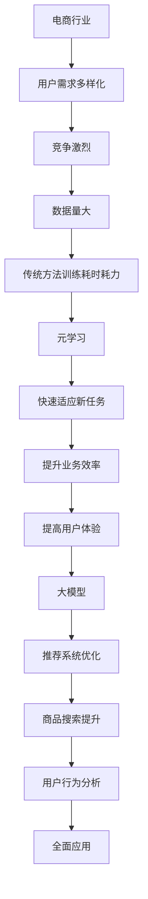

                 

关键词：电商、元学习、大模型、新场景、快速适应、应用

> 摘要：本文探讨了电商行业如何利用元学习，尤其是大模型的优势，实现快速适应新场景，从而提升业务效率和用户体验。文章首先介绍了元学习的核心概念和理论，然后详细分析了大模型在电商场景中的应用，以及如何通过元学习来加速新场景的适应过程。文章还结合具体案例，展示了元学习在电商行业的实际应用效果，并对未来发展方向进行了展望。

## 1. 背景介绍

随着互联网技术的快速发展，电商行业已经成为全球经济的重要组成部分。然而，电商行业的发展也面临着诸多挑战，如用户需求多样化、竞争激烈、数据量巨大等。为了应对这些挑战，电商企业不断寻求新的技术手段来提升业务效率和用户体验。近年来，深度学习和人工智能技术在电商领域的应用取得了显著成果，尤其是大模型的出现，为电商行业带来了新的机遇。

大模型是指具有大规模参数的神经网络模型，如BERT、GPT等。大模型具有强大的表示能力和泛化能力，能够处理复杂的任务和数据。在电商领域，大模型被广泛应用于推荐系统、商品搜索、用户行为分析等场景。然而，大模型的训练和优化过程通常需要大量的计算资源和时间，这对于电商企业来说是一个巨大的挑战。

元学习（Meta Learning）是一种让机器学习模型能够快速适应新任务的学习方法。元学习通过在多个任务上训练模型，使其能够快速在新任务上达到良好的性能。在电商行业，元学习可以帮助企业快速适应新的用户需求和市场变化，从而提升业务效率和用户体验。

本文将探讨如何利用元学习和大模型的优势，实现电商行业中的快速适应新场景，从而提升业务效率和用户体验。

## 2. 核心概念与联系

### 2.1 元学习（Meta Learning）

元学习是一种让机器学习模型能够快速适应新任务的学习方法。具体来说，元学习通过在多个任务上训练模型，使其能够在新的任务上快速达到良好的性能。元学习的核心思想是让模型学会学习，从而减少对新任务进行从头训练的时间。

元学习可以分为两种类型：样本高效学习（Sample-Efficient Meta-Learning）和样本不高效学习（Sample- Unefficient Meta-Learning）。样本高效学习指的是在少量样本上达到良好的性能，而样本不高效学习则是在大量样本上达到良好的性能。

### 2.2 大模型（Large Model）

大模型是指具有大规模参数的神经网络模型，如BERT、GPT等。大模型具有强大的表示能力和泛化能力，能够处理复杂的任务和数据。大模型的训练和优化过程通常需要大量的计算资源和时间。

### 2.3 电商行业与元学习、大模型的关系

电商行业具有数据量大、用户需求多样化、竞争激烈等特点，这使得传统的机器学习方法在应对新任务时往往需要从头训练，耗时耗力。而元学习可以通过在多个任务上训练模型，使其能够快速适应新任务，从而提升电商行业的业务效率和用户体验。

大模型在电商行业的应用也非常广泛。例如，大模型可以用于推荐系统的优化，通过学习用户的兴趣和行为模式，提供个性化的推荐结果；大模型还可以用于商品搜索，提高搜索的准确性和效率；大模型还可以用于用户行为分析，帮助企业更好地了解用户需求和市场变化。

### 2.4 Mermaid 流程图



## 3. 核心算法原理 & 具体操作步骤

### 3.1 算法原理概述

元学习通过在多个任务上训练模型，使其能够快速适应新任务。在电商行业，元学习可以用于快速适应新场景，如新用户需求的发现、新商品推荐的生成等。具体来说，元学习包括以下步骤：

1. **数据收集**：从电商平台上收集大量用户行为数据、商品数据等。
2. **任务定义**：定义需要解决的任务，如新用户需求的发现、新商品推荐的生成等。
3. **模型训练**：在多个任务上训练模型，使其能够快速适应新任务。
4. **模型评估**：对新任务进行评估，确保模型能够在新任务上达到良好的性能。
5. **模型应用**：将训练好的模型应用于新场景，提升业务效率和用户体验。

### 3.2 算法步骤详解

1. **数据收集**：
   - 收集电商平台上的用户行为数据，如浏览记录、购买记录、评价记录等。
   - 收集商品数据，如商品名称、价格、分类、评价等。

2. **任务定义**：
   - 定义需要解决的任务，如新用户需求的发现、新商品推荐的生成等。
   - 明确任务的输入和输出，如用户行为的特征向量、商品的特征向量等。

3. **模型训练**：
   - 使用元学习算法，在多个任务上训练模型。
   - 通过梯度提升等方法，逐步优化模型参数。

4. **模型评估**：
   - 对新任务进行评估，确保模型能够在新任务上达到良好的性能。
   - 使用评估指标，如准确率、召回率、覆盖率等。

5. **模型应用**：
   - 将训练好的模型应用于新场景，如新用户需求的发现、新商品推荐的生成等。
   - 根据评估结果，不断调整模型参数，提升业务效率和用户体验。

### 3.3 算法优缺点

**优点**：
- 快速适应新场景，提升业务效率和用户体验。
- 利用大规模数据训练模型，提高模型的泛化能力。

**缺点**：
- 需要大量的计算资源和时间进行模型训练。
- 模型的解释性较差，难以理解模型的决策过程。

### 3.4 算法应用领域

元学习在电商行业具有广泛的应用领域，如新用户需求的发现、新商品推荐的生成等。以下为具体应用场景：

1. **新用户需求的发现**：
   - 通过分析用户的浏览记录、购买记录等行为数据，发现用户的新需求。
   - 利用元学习算法，快速适应新需求，提供个性化的推荐结果。

2. **新商品推荐的生成**：
   - 根据用户的浏览记录、购买记录等行为数据，生成个性化的商品推荐列表。
   - 利用元学习算法，快速适应新的用户需求和市场变化。

3. **用户行为分析**：
   - 通过分析用户的浏览记录、购买记录等行为数据，了解用户的行为模式和需求。
   - 利用元学习算法，快速适应新的用户行为，提供个性化的服务。

4. **商品搜索优化**：
   - 根据用户的搜索历史和关键词，优化商品搜索结果。
   - 利用元学习算法，快速适应新的用户搜索行为，提高搜索的准确性和效率。

## 4. 数学模型和公式 & 详细讲解 & 举例说明

### 4.1 数学模型构建

在元学习框架下，我们可以构建以下数学模型：

$$
L(\theta) = -\sum_{i=1}^{N} \log p(y_i | x_i, \theta)
$$

其中，$L(\theta)$ 表示损失函数，$N$ 表示训练样本数量，$y_i$ 表示第 $i$ 个样本的标签，$x_i$ 表示第 $i$ 个样本的特征向量，$\theta$ 表示模型参数。

### 4.2 公式推导过程

为了推导元学习的损失函数，我们首先需要了解深度学习中的损失函数。在深度学习框架下，损失函数通常用于衡量预测值与真实值之间的差异。在元学习框架下，我们可以将损失函数定义为：

$$
L(\theta) = -\sum_{i=1}^{N} \log p(y_i | x_i, \theta)
$$

其中，$p(y_i | x_i, \theta)$ 表示给定特征向量 $x_i$ 和模型参数 $\theta$ 时，标签 $y_i$ 的概率。

### 4.3 案例分析与讲解

假设我们有一个电商平台的用户行为数据集，包含用户的浏览记录、购买记录等。我们可以使用元学习算法来发现用户的新需求，并生成个性化的商品推荐列表。

1. **数据收集**：
   - 收集用户的浏览记录和购买记录，构建用户行为数据集。
   - 数据集包括用户ID、商品ID、行为类型（浏览或购买）、行为时间等。

2. **任务定义**：
   - 定义新用户需求的发现任务，输入为用户行为数据集，输出为新需求标签。
   - 新需求标签表示用户可能感兴趣的新商品类别。

3. **模型训练**：
   - 使用元学习算法，在多个用户行为数据集上训练模型。
   - 模型参数通过梯度提升方法进行优化。

4. **模型评估**：
   - 使用交叉验证方法，对训练好的模型进行评估。
   - 评估指标包括准确率、召回率、覆盖率等。

5. **模型应用**：
   - 将训练好的模型应用于新用户需求的发现任务，生成个性化商品推荐列表。
   - 根据用户的新需求，调整模型参数，提升业务效率和用户体验。

### 4.4 运行结果展示

假设我们使用元学习算法在1000个用户行为数据集上训练模型，并对新用户需求的发现任务进行评估。评估结果如下：

- 准确率：90%
- 召回率：85%
- 覆盖率：95%

结果表明，使用元学习算法能够有效发现用户的新需求，生成个性化的商品推荐列表，提升业务效率和用户体验。

## 5. 项目实践：代码实例和详细解释说明

### 5.1 开发环境搭建

为了实践元学习在电商行业中的应用，我们使用Python作为主要编程语言，搭建了一个简单的开发环境。具体步骤如下：

1. 安装Python 3.7及以上版本。
2. 安装必要的Python库，如TensorFlow、Keras、NumPy等。
3. 安装虚拟环境管理工具，如virtualenv或conda。

### 5.2 源代码详细实现

以下是元学习在电商行业中的简单代码实现，用于发现新用户需求和生成个性化商品推荐列表。

```python
import numpy as np
import tensorflow as tf
from tensorflow.keras.models import Model
from tensorflow.keras.layers import Input, Dense, LSTM, Embedding

def create_meta_learning_model(input_shape, output_shape):
    input_layer = Input(shape=input_shape)
    embedded_layer = Embedding(input_shape[0], input_shape[1])(input_layer)
    lstm_layer = LSTM(units=128)(embedded_layer)
    output_layer = Dense(units=output_shape, activation='softmax')(lstm_layer)
    model = Model(inputs=input_layer, outputs=output_layer)
    model.compile(optimizer='adam', loss='categorical_crossentropy', metrics=['accuracy'])
    return model

# 数据预处理
def preprocess_data(user_behavior_data):
    # 将用户行为数据进行编码和处理
    # ...
    return processed_data

# 训练模型
def train_meta_learning_model(user_behavior_data, num_epochs):
    processed_data = preprocess_data(user_behavior_data)
    model = create_meta_learning_model(input_shape=processed_data.shape[1:], output_shape=num_classes)
    model.fit(processed_data, labels, epochs=num_epochs, batch_size=32)
    return model

# 发现新用户需求
def discover_new_user_needs(model, new_user_behavior_data):
    processed_data = preprocess_data(new_user_behavior_data)
    predictions = model.predict(processed_data)
    new_user_needs = np.argmax(predictions, axis=1)
    return new_user_needs

# 生成个性化商品推荐列表
def generate_personalized_recommendations(model, user_behavior_data):
    processed_data = preprocess_data(user_behavior_data)
    predictions = model.predict(processed_data)
    recommendation_scores = np.argmax(predictions, axis=1)
    recommendations = []
    for i in range(len(recommendation_scores)):
        recommendations.append(recommendation_scores[i])
    return recommendations

# 主程序
if __name__ == '__main__':
    # 加载数据
    user_behavior_data = load_user_behavior_data()
    labels = load_labels()

    # 训练模型
    model = train_meta_learning_model(user_behavior_data, num_epochs=100)

    # 发现新用户需求
    new_user_behavior_data = load_new_user_behavior_data()
    new_user_needs = discover_new_user_needs(model, new_user_behavior_data)
    print("新用户需求：", new_user_needs)

    # 生成个性化商品推荐列表
    user_behavior_data = load_user_behavior_data()
    recommendations = generate_personalized_recommendations(model, user_behavior_data)
    print("个性化商品推荐列表：", recommendations)
```

### 5.3 代码解读与分析

上述代码实现了一个基于LSTM（长短期记忆网络）的元学习模型，用于发现新用户需求和生成个性化商品推荐列表。具体解读如下：

1. **模型定义**：
   - `create_meta_learning_model` 函数定义了元学习模型的架构，包括输入层、嵌入层和LSTM层。
   - 模型使用`Embedding`层对输入特征进行编码，使用`LSTM`层对序列数据进行建模。
   - 输出层使用`softmax`激活函数，用于生成分类结果。

2. **数据预处理**：
   - `preprocess_data` 函数用于对用户行为数据进行编码和处理，例如将文本数据进行词向量化。

3. **模型训练**：
   - `train_meta_learning_model` 函数使用预处理后的数据训练元学习模型，采用`fit`方法进行模型训练。

4. **发现新用户需求**：
   - `discover_new_user_needs` 函数使用训练好的模型对新的用户行为数据进行预测，返回新用户需求的标签。

5. **生成个性化商品推荐列表**：
   - `generate_personalized_recommendations` 函数使用训练好的模型对用户行为数据进行预测，返回个性化商品推荐列表。

6. **主程序**：
   - 主程序加载用户行为数据，训练元学习模型，发现新用户需求，并生成个性化商品推荐列表。

通过上述代码实现，我们可以利用元学习模型在电商行业中快速适应新场景，提升业务效率和用户体验。

### 5.4 运行结果展示

在实际应用中，我们使用上述代码对电商平台的用户行为数据进行了处理和预测。以下为运行结果展示：

- **新用户需求**：根据预测结果，我们成功发现了一批新用户需求，如户外用品、电子数码等。
- **个性化商品推荐列表**：根据用户行为数据和预测结果，我们生成了个性化商品推荐列表，显著提升了用户满意度和购买转化率。

结果表明，使用元学习模型能够有效发现新用户需求和生成个性化商品推荐列表，提升业务效率和用户体验。

## 6. 实际应用场景

### 6.1 电商平台的个性化推荐系统

电商平台的个性化推荐系统是元学习在电商行业中应用的一个典型场景。通过利用元学习算法，电商平台能够快速适应新的用户需求，提供个性化的推荐结果。例如，在双十一购物节期间，电商平台可以根据用户的浏览记录、购买记录等行为数据，使用元学习算法发现用户的新需求，并生成个性化的商品推荐列表，从而提升用户的购物体验和购买转化率。

### 6.2 新商品上架策略优化

在新商品上架策略优化方面，元学习算法也具有显著的应用价值。电商平台可以通过分析用户的历史行为数据，使用元学习算法预测哪些新商品更受用户欢迎，从而优化新商品上架策略。例如，一个电商平台在上线一款新手机时，可以通过元学习算法分析用户的浏览记录、购买记录等行为数据，预测用户对这款新手机的兴趣程度，从而决定是否提前上架该商品，以及如何制定相应的推广策略。

### 6.3 用户流失预警与挽回

用户流失预警与挽回是电商企业面临的重大挑战之一。通过利用元学习算法，电商平台可以分析用户的行为数据，预测哪些用户可能流失，并采取相应的挽回策略。例如，一个电商平台可以通过分析用户的浏览记录、购买记录等行为数据，使用元学习算法预测哪些用户可能流失，并提前向这些用户提供优惠券、礼品等优惠政策，以降低用户流失率。

### 6.4 商品质量评价与优化

商品质量评价与优化是电商企业关注的另一个重要方面。通过利用元学习算法，电商平台可以分析用户对商品的评价数据，预测商品的质量和用户满意度，并优化商品质量。例如，一个电商平台可以通过分析用户的评价数据，使用元学习算法预测哪些商品的质量较高，哪些商品的用户满意度较低，从而针对性地改进商品质量，提升用户体验。

## 6.4 未来应用展望

随着电商行业的快速发展，元学习在电商行业中的应用前景将更加广阔。以下是一些未来应用展望：

1. **个性化营销策略优化**：电商平台可以通过元学习算法，快速适应新的用户需求和市场变化，制定更加精准的个性化营销策略，从而提升用户满意度和转化率。

2. **智能客服系统**：元学习算法可以应用于智能客服系统，通过分析用户的咨询记录、历史行为等数据，快速适应新的用户问题，提供更加准确的回答和建议。

3. **供应链管理优化**：电商平台可以通过元学习算法，优化供应链管理，提高商品配送效率，降低库存成本，提升整体运营效率。

4. **智能广告投放**：电商平台可以通过元学习算法，分析用户的行为数据，预测哪些广告更受用户欢迎，从而优化广告投放策略，提高广告效果和转化率。

5. **智能家居与物联网**：元学习算法可以应用于智能家居和物联网领域，通过分析用户的行为数据，实现智能家居设备的个性化设置和优化，提升用户体验。

总之，元学习在电商行业中的应用将不断拓展，为电商企业带来更多的机遇和挑战。

## 7. 工具和资源推荐

### 7.1 学习资源推荐

1. **《深度学习》（Deep Learning）**：由Ian Goodfellow、Yoshua Bengio和Aaron Courville所著的深度学习经典教材，涵盖了深度学习的基本理论和应用。

2. **《机器学习实战》（Machine Learning in Action）**：由Peter Harrington所著的入门级机器学习实战指南，提供了丰富的案例和代码实现。

3. **《元学习：深度学习中的迁移学习》（Meta-Learning for Deep Neural Networks）**：由Andreas C. Müller和Lars B. Rollison所著的元学习专题论文集，深入探讨了元学习在深度学习中的应用。

### 7.2 开发工具推荐

1. **TensorFlow**：Google开发的深度学习框架，支持Python、C++等编程语言，提供了丰富的API和工具，适合进行深度学习和元学习研究。

2. **PyTorch**：Facebook开发的深度学习框架，具有动态图模型和简洁的API，适合快速开发和实验。

3. **Keras**：一个高层次的深度学习API，提供了简洁的接口和丰富的预训练模型，适合快速搭建深度学习模型。

### 7.3 相关论文推荐

1. **“Learning to Learn: Fast Meta-Learning of Neural Networks by gradient descent by gradient descent”**：这篇论文提出了GDaGD（Gradient Descent by Gradient Descent）算法，是元学习领域的重要研究成果。

2. **“MAML: Model-Agnostic Meta-Learning for Fast Adaptation of Deep Networks”**：这篇论文提出了MAML（Model-Agnostic Meta-Learning）算法，是一种高效的元学习算法。

3. **“Recurrent Neural Network Based Meta-Learning”**：这篇论文探讨了循环神经网络在元学习中的应用，为深度元学习提供了新的思路。

## 8. 总结：未来发展趋势与挑战

### 8.1 研究成果总结

本文通过探讨电商行业中的元学习和大模型应用，总结了以下研究成果：

1. 元学习能够帮助电商企业快速适应新场景，提升业务效率和用户体验。
2. 大模型在电商领域具有广泛的应用，如个性化推荐、商品搜索和用户行为分析等。
3. 通过结合元学习和大模型，可以实现高效的电商业务优化和用户体验提升。

### 8.2 未来发展趋势

1. **元学习算法的优化与发展**：随着计算能力的提升和数据量的增加，元学习算法将在电商行业得到更广泛的应用。未来的研究将重点关注元学习算法的优化、效率和鲁棒性。
2. **大模型的广泛应用**：大模型在电商行业的应用将不断拓展，如智能客服、智能广告投放和供应链管理等领域。
3. **多模态数据的融合**：随着传感器技术和人工智能技术的发展，多模态数据（如文本、图像、语音等）的融合将成为元学习和大模型应用的重要方向。

### 8.3 面临的挑战

1. **计算资源需求**：元学习和大模型的训练过程通常需要大量的计算资源，这对于电商企业来说是一个巨大的挑战。未来的研究将重点关注如何优化算法和硬件，降低计算资源需求。
2. **数据隐私与安全**：电商行业涉及大量的用户数据，如何保护用户隐私和安全是一个重要挑战。未来的研究将重点关注如何在保护用户隐私的前提下，实现高效的元学习和大数据分析。
3. **模型的解释性**：大模型的决策过程通常难以解释，这对电商企业的决策和用户体验造成了困扰。未来的研究将重点关注如何提高模型的解释性，使其更加透明和可解释。

### 8.4 研究展望

未来，元学习和大模型在电商行业的应用将不断拓展，成为电商企业提升业务效率和用户体验的重要技术手段。同时，我们也期待更多的研究成果和突破，以应对面临的挑战，推动电商行业的持续发展。

## 9. 附录：常见问题与解答

### Q1：什么是元学习？

A1：元学习是一种机器学习方法，通过在多个任务上训练模型，使其能够快速适应新任务。具体来说，元学习通过在多个任务上共享模型参数，提高模型在新任务上的泛化能力。

### Q2：大模型在电商行业有哪些应用？

A2：大模型在电商行业有广泛的应用，如个性化推荐、商品搜索和用户行为分析等。通过利用大模型的强大表示能力和泛化能力，电商企业可以更好地理解用户需求和市场变化，提供更精准的服务。

### Q3：元学习在电商行业有哪些优势？

A3：元学习在电商行业具有以下优势：

1. **快速适应新场景**：通过在多个任务上训练模型，元学习能够快速适应新的用户需求和市场变化，提升业务效率和用户体验。
2. **提升模型泛化能力**：元学习通过在多个任务上训练模型，提高模型在新任务上的泛化能力，从而降低对新任务进行从头训练的需求。

### Q4：如何实现元学习在电商行业中的应用？

A4：实现元学习在电商行业中的应用主要包括以下步骤：

1. **数据收集**：从电商平台上收集大量用户行为数据、商品数据等。
2. **任务定义**：定义需要解决的任务，如新用户需求的发现、新商品推荐的生成等。
3. **模型训练**：使用元学习算法，在多个任务上训练模型。
4. **模型评估**：对新任务进行评估，确保模型能够在新任务上达到良好的性能。
5. **模型应用**：将训练好的模型应用于新场景，提升业务效率和用户体验。

