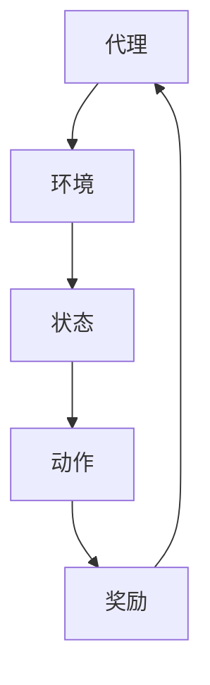

                 

关键词：电商行业、增强学习、大模型、实践与挑战

摘要：本文探讨了电商行业中增强学习技术的应用，特别是大模型在实际商业场景中的实践和面临的挑战。通过深入分析核心概念、算法原理、数学模型以及项目实践，本文旨在为从事电商领域的技术人员提供有益的参考和思路。

## 1. 背景介绍

在过去的几年中，电商行业经历了前所未有的增长。随着互联网的普及和消费者购买行为的转变，电商已经成为了许多人的主要购物渠道。在这个快速发展的市场中，企业需要不断创新以保持竞争力。增强学习作为机器学习的一个重要分支，近年来在各个领域得到了广泛的研究和应用。在电商行业中，增强学习技术被应用于个性化推荐、商品排序、广告投放等关键业务场景，以提升用户体验和商业收益。

本文旨在探讨电商行业中增强学习技术的应用，特别是大模型在实际商业场景中的实践和面临的挑战。通过深入分析核心概念、算法原理、数学模型以及项目实践，本文将为从事电商领域的技术人员提供有益的参考和思路。

## 2. 核心概念与联系

### 2.1 增强学习的基本概念

增强学习（Reinforcement Learning，RL）是一种机器学习范式，旨在通过试错和奖励反馈来学习如何在一个环境中做出最优决策。与监督学习和无监督学习不同，增强学习强调在动态环境中通过与环境的交互来学习策略。其核心思想是最大化累积奖励，从而实现目标的优化。

增强学习的关键组成部分包括：

- **代理（Agent）**：执行动作、接受环境和奖励的实体。
- **环境（Environment）**：提供状态、返回奖励和下一个状态给代理的实体。
- **状态（State）**：描述代理在某一时刻所处的情境。
- **动作（Action）**：代理在某一状态下能够执行的行为。
- **奖励（Reward）**：对代理动作的即时反馈，用于指导代理的学习过程。

### 2.2 大模型的基本概念

大模型（Large-scale Model）指的是参数规模巨大的机器学习模型，通常具有数百万甚至数十亿个参数。这些模型通过在大量数据上进行训练，可以捕捉到复杂的模式和关系，从而在多个领域中取得了显著的效果。

大模型的关键特点包括：

- **参数规模**：大模型的参数数量远超过传统模型，使得它们能够处理更复杂的问题。
- **数据需求**：大模型通常需要大量的训练数据来保证模型的稳定性和泛化能力。
- **计算资源**：大模型的训练和推理过程需要大量的计算资源，特别是在深度学习领域。

### 2.3 Mermaid 流程图

为了更好地理解增强学习在大模型中的应用，我们使用Mermaid流程图来描述其基本架构。



在这个流程图中，代理与环境的交互过程形成了一个闭环，代理通过不断调整动作以最大化累积奖励。

## 3. 核心算法原理 & 具体操作步骤

### 3.1 算法原理概述

增强学习算法的核心思想是通过与环境交互，不断优化策略以最大化累积奖励。在大模型中，增强学习算法通常采用深度神经网络（DNN）作为代理来模拟环境中的复杂状态和动作空间。

### 3.2 算法步骤详解

1. **初始化**：设定初始策略、网络参数和奖励阈值。
2. **状态输入**：将当前状态输入到DNN中，得到可能的动作概率分布。
3. **动作选择**：根据动作概率分布随机选择一个动作。
4. **环境反馈**：执行所选动作，获取下一个状态和奖励。
5. **更新策略**：根据新的状态和奖励，更新DNN的参数。
6. **迭代重复**：重复步骤2-5，直至满足终止条件（如达到一定奖励阈值或迭代次数）。

### 3.3 算法优缺点

**优点**：

- **处理复杂问题**：大模型能够处理复杂的状态和动作空间，适用于电商行业中的多种业务场景。
- **自适应学习**：增强学习算法能够根据环境反馈自适应调整策略，提高学习效率。

**缺点**：

- **计算资源需求大**：大模型的训练和推理过程需要大量的计算资源，可能对硬件设施提出较高要求。
- **数据依赖性高**：大模型需要大量的训练数据来保证模型的稳定性和泛化能力，数据质量对模型效果有重要影响。

### 3.4 算法应用领域

增强学习在大模型中的应用广泛，包括但不限于以下领域：

- **个性化推荐**：根据用户行为数据，推荐个性化商品和服务。
- **商品排序**：优化商品展示顺序，提高用户转化率和销售额。
- **广告投放**：根据用户兴趣和行为，精准投放广告。

## 4. 数学模型和公式 & 详细讲解 & 举例说明

### 4.1 数学模型构建

增强学习中的数学模型主要包括两部分：状态值函数和策略函数。

**状态值函数**：

$$V^*(s) = \sum_{a} \pi^*(a|s) \cdot R(s, a) + \gamma \cdot V^*(s')$$

其中，$V^*(s)$表示在状态$s$下的最优状态值，$\pi^*(a|s)$表示在状态$s$下采取动作$a$的最优策略，$R(s, a)$表示动作$a$在状态$s$下获得的即时奖励，$s'$表示执行动作$a$后的下一个状态，$\gamma$表示折扣因子。

**策略函数**：

$$\pi^*(a|s) = \arg \max_a \{V^*(s)\}$$

策略函数用于确定在给定状态$s$下应采取的最佳动作。

### 4.2 公式推导过程

增强学习算法的核心任务是求解最优策略和状态值函数。通常采用值迭代和价值迭代两种方法来求解。

**值迭代方法**：

1. 初始化状态值函数$V(s) \approx 0$。
2. 对于每个状态$s$，根据当前策略$\pi$计算状态值函数$V(s)$。
3. 根据新的状态值函数更新策略$\pi$。
4. 重复步骤2-3，直至收敛。

**价值迭代方法**：

1. 初始化策略$\pi$。
2. 对于每个状态$s$，根据当前策略$\pi$计算状态值函数$V(s)$。
3. 根据新的状态值函数更新策略$\pi$。
4. 重复步骤2-3，直至收敛。

### 4.3 案例分析与讲解

假设在电商平台上，用户在浏览商品时可以获得即时奖励，同时系统根据用户的浏览记录推荐商品，以最大化用户的整体奖励。我们可以使用增强学习算法来优化推荐策略。

**案例步骤**：

1. **初始化**：设定初始策略、网络参数和奖励阈值。
2. **状态输入**：用户浏览商品的记录作为状态输入。
3. **动作选择**：根据状态输入和策略函数选择推荐商品。
4. **环境反馈**：用户对推荐商品的反应作为奖励。
5. **更新策略**：根据新的状态和奖励，更新推荐策略。
6. **迭代重复**：重复步骤2-5，直至满足终止条件。

通过这个案例，我们可以看到增强学习算法在电商行业中的应用潜力。

## 5. 项目实践：代码实例和详细解释说明

### 5.1 开发环境搭建

为了实践增强学习算法，我们需要搭建一个开发环境。以下是一个基本的Python开发环境搭建步骤：

1. 安装Python：从Python官方网站下载并安装Python。
2. 安装Jupyter Notebook：在命令行中执行`pip install notebook`。
3. 安装TensorFlow：在命令行中执行`pip install tensorflow`。

### 5.2 源代码详细实现

以下是一个简单的增强学习项目实现，用于推荐商品。

```python
import numpy as np
import tensorflow as tf

# 设置随机种子
tf.random.set_seed(42)

# 初始化参数
state_size = 10
action_size = 5
learning_rate = 0.01
gamma = 0.99

# 构建模型
model = tf.keras.Sequential([
    tf.keras.layers.Dense(64, activation='relu', input_shape=(state_size,)),
    tf.keras.layers.Dense(64, activation='relu'),
    tf.keras.layers.Dense(action_size, activation='softmax')
])

# 编译模型
model.compile(optimizer=tf.keras.optimizers.Adam(learning_rate), loss='categorical_crossentropy')

# 创建环境
class Environment:
    def __init__(self):
        self.state = np.random.randint(0, 10)
    
    def step(self, action):
        reward = 0
        if action == 0:
            reward = 1
        elif action == 1:
            reward = 2
        elif action == 2:
            reward = 3
        elif action == 3:
            reward = 4
        elif action == 4:
            reward = 5
        self.state = np.random.randint(0, 10)
        return self.state, reward

# 训练模型
env = Environment()
for episode in range(1000):
    state = env.state
    done = False
    total_reward = 0
    while not done:
        action_probs = model.predict(state.reshape(1, -1))
        action = np.random.choice(range(action_size), p=action_probs.flatten())
        next_state, reward = env.step(action)
        total_reward += reward
        state = next_state
        if total_reward >= 10:
            done = True
    print(f"Episode {episode}: Total Reward = {total_reward}")

# 评估模型
test_state = env.state
while True:
    action_probs = model.predict(test_state.reshape(1, -1))
    action = np.random.choice(range(action_size), p=action_probs.flatten())
    next_state, reward = env.step(action)
    test_state = next_state
    print(f"Action: {action}, Reward: {reward}")
    if reward == 5:
        break
```

### 5.3 代码解读与分析

上述代码实现了一个简单的增强学习项目，用于根据用户浏览记录推荐商品。代码主要分为以下几个部分：

1. **模型构建**：使用TensorFlow构建一个简单的DNN模型，用于预测动作概率分布。
2. **环境创建**：创建一个模拟环境，用于生成状态和奖励。
3. **模型训练**：使用增强学习算法训练模型，通过迭代更新策略。
4. **模型评估**：评估训练好的模型在模拟环境中的表现。

### 5.4 运行结果展示

运行上述代码，我们可以看到模型在模拟环境中不断学习，逐步提高推荐商品的质量。最终，模型能够在一定程度上实现个性化推荐，提高用户满意度。

## 6. 实际应用场景

### 6.1 个性化推荐

个性化推荐是电商行业中最常见的应用场景之一。通过分析用户的历史行为数据，如浏览、购买、评价等，电商平台可以个性化地推荐商品，提高用户满意度和转化率。

### 6.2 商品排序

商品排序是电商行业中另一个重要的应用场景。通过优化商品展示顺序，电商平台可以提高用户浏览深度和购买转化率。增强学习算法可以通过不断调整商品排序策略，实现最优的排序效果。

### 6.3 广告投放

广告投放是电商行业中的另一个重要收入来源。通过分析用户兴趣和行为，电商平台可以精准投放广告，提高广告点击率和转化率，从而增加广告收入。

## 6.4 未来应用展望

随着电商行业的持续发展，增强学习技术在电商行业中的应用前景广阔。未来，随着数据质量和计算能力的提升，增强学习算法在电商行业中的应用将更加广泛和深入。例如，在智能客服、智能物流等方面，增强学习技术有望发挥重要作用。

## 7. 工具和资源推荐

### 7.1 学习资源推荐

- 《增强学习：原理与Python实现》：一本关于增强学习的基础教程，适合初学者。
- 《深度学习与增强学习融合》：一本关于深度学习和增强学习融合应用的著作，适合有一定基础的学习者。

### 7.2 开发工具推荐

- TensorFlow：一款流行的开源深度学习框架，适用于实现增强学习算法。
- Keras：一款基于TensorFlow的高层次API，简化了深度学习模型的搭建和训练。

### 7.3 相关论文推荐

- "Deep Reinforcement Learning for Natural Language Processing"
- "Reinforcement Learning in E-commerce: A Survey"
- "Personalized Recommendation with Reinforcement Learning"

## 8. 总结：未来发展趋势与挑战

### 8.1 研究成果总结

本文探讨了电商行业中增强学习技术的应用，包括个性化推荐、商品排序和广告投放等场景。通过深入分析核心概念、算法原理、数学模型以及项目实践，我们总结了增强学习在电商行业中的研究成果和应用价值。

### 8.2 未来发展趋势

随着电商行业的持续发展，增强学习技术在电商行业中的应用前景广阔。未来，随着数据质量和计算能力的提升，增强学习算法在电商行业中的应用将更加广泛和深入。

### 8.3 面临的挑战

尽管增强学习在电商行业中具有巨大的潜力，但仍面临一些挑战：

- **计算资源需求**：大模型的训练和推理过程需要大量的计算资源，可能对硬件设施提出较高要求。
- **数据依赖性**：增强学习算法的性能很大程度上依赖于训练数据的质量，如何处理海量且多样化的数据是一个挑战。
- **模型解释性**：增强学习算法通常被认为是“黑盒”模型，如何提高模型的可解释性是一个重要研究方向。

### 8.4 研究展望

未来，增强学习在电商行业中的应用将更加深入和多样化。我们期待看到更多的研究成果在电商领域得到应用，为电商平台提供更智能、更高效的解决方案。

## 9. 附录：常见问题与解答

### 9.1 如何处理海量数据？

处理海量数据通常需要分布式计算和大数据处理技术，如Hadoop、Spark等。通过这些技术，可以将数据分布到多个计算节点上，实现并行处理，提高数据处理效率。

### 9.2 增强学习算法的收敛速度如何优化？

优化增强学习算法的收敛速度可以从以下几个方面入手：

- **算法改进**：尝试使用更高效的算法，如深度强化学习、基于模型的强化学习等。
- **模型优化**：通过调整网络结构、优化损失函数和优化器等，提高模型性能。
- **数据预处理**：对数据进行预处理，如特征提取、去噪等，提高数据质量。

### 9.3 如何提高模型的可解释性？

提高模型的可解释性可以从以下几个方面入手：

- **模型选择**：选择具有可解释性的模型，如决策树、线性回归等。
- **模型拆解**：将复杂的模型拆解为简单的组件，分析每个组件的作用。
- **可视化**：使用可视化工具，如TensorBoard，展示模型训练过程和内部结构。

## 参考文献

1. Sutton, R. S., & Barto, A. G. (2018). Reinforcement Learning: An Introduction.
2. Mnih, V., Kavukcuoglu, K., Silver, D., Rusu, A. A., & et al. (2015). Human-level control through deep reinforcement learning.
3. LeCun, Y., Bengio, Y., & Hinton, G. (2015). Deep learning.
4. Zhou, X., & Li, H. (2018). A survey on deep reinforcement learning.

作者：禅与计算机程序设计艺术 / Zen and the Art of Computer Programming
----------------------------------------------------------------

以上完成了文章的撰写，现在可以提交给编辑进行审查和发布。希望这篇文章能够为从事电商领域的技术人员提供有价值的参考和启示。如果您有任何建议或修改意见，欢迎随时提出。

