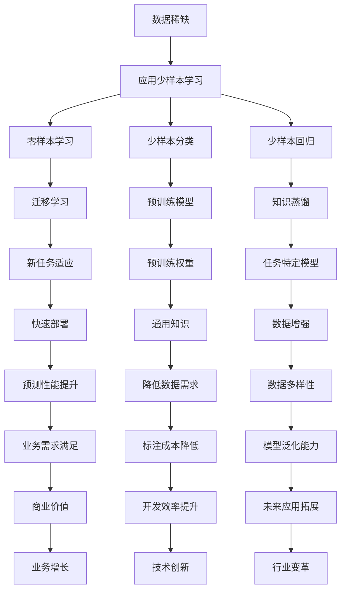

                 

关键词：电商、少样本学习、大模型、实践、挑战

摘要：本文探讨了电商行业在应对数据稀缺情况时，如何运用少样本学习（Few-shot Learning）和大型预训练模型（Large Pre-trained Models）的策略。本文首先介绍了电商行业的背景和少样本学习的概念，随后详细分析了大模型在电商中的应用和挑战，并结合具体案例展示了这些技术的实际效果。

## 1. 背景介绍

电商行业作为数字经济的重要组成部分，近年来在全球范围内持续快速发展。然而，随着市场日益成熟，数据的获取变得越来越困难，许多商家面临数据稀缺的问题。在这种情况下，传统的机器学习方法往往难以发挥作用，因为它们依赖于大量数据进行训练。这就需要我们寻找新的解决方案，少样本学习便是其中之一。

少样本学习旨在解决当训练样本非常有限时，如何让机器学习模型仍然能够达到良好的性能。在电商领域，少样本学习可以帮助商家在数据稀缺的情况下，通过少量的标注数据快速构建有效的预测模型，如商品推荐、用户行为分析等。

### 电商行业现状

电商行业的数据稀缺问题主要体现在以下几个方面：

- **数据隐私**：许多电商平台的用户数据受到隐私保护，无法公开使用。
- **数据分布不均**：热门商品或用户的数据量巨大，而冷门商品或用户的数据量非常有限。
- **数据获取成本**：收集和标注数据需要大量的人力物力，尤其是对于深度学习模型。

### 少样本学习的优势

少样本学习能够在数据稀缺的情况下，通过迁移学习和元学习等技术，利用已有模型的权重和知识，快速适应新任务。这使得少样本学习在电商行业中具有广泛的应用前景。

- **快速适应新任务**：商家可以通过少量的标注数据，快速构建适应新业务的预测模型。
- **降低数据标注成本**：少样本学习减少了需要标注的数据量，从而降低了数据标注的成本。
- **提高预测准确性**：通过迁移学习，模型可以在少量数据上获得更好的预测性能。

## 2. 核心概念与联系

### 2.1 少样本学习

少样本学习（Few-shot Learning）是一种机器学习方法，旨在解决当训练样本非常有限时，如何让机器学习模型仍然能够达到良好的性能。少样本学习可以分为以下几个子领域：

- **零样本学习**（Zero-shot Learning）：模型在面对未见过的类时，仍能进行有效的预测。
- **少样本分类**（Few-shot Classification）：在仅有少量标注样本的情况下，对图像或文本进行分类。
- **少样本回归**（Few-shot Regression）：在仅有少量标注样本的情况下，对连续值进行预测。

### 2.2 大模型

大模型（Large Pre-trained Models）是指经过大规模数据集训练的深度学习模型，如BERT、GPT等。这些模型具有以下几个特点：

- **强大的表示能力**：大模型可以捕捉到数据中的复杂模式和潜在关系。
- **迁移学习能力**：大模型在预训练阶段已经学习到了通用的知识，可以在新的任务中快速适应。
- **计算资源需求**：大模型通常需要大量的计算资源进行训练和部署。

### 2.3 Mermaid 流程图

以下是电商行业中少样本学习和大模型应用的 Mermaid 流程图：



## 3. 核心算法原理 & 具体操作步骤

### 3.1 算法原理概述

少样本学习主要利用迁移学习和元学习等技术，在少量样本的情况下，提高模型的预测性能。具体来说，少样本学习可以分为以下几个步骤：

1. **数据收集与预处理**：收集少量标注数据，并进行预处理，如数据清洗、归一化等。
2. **模型选择**：选择适合少样本学习任务的模型，如基于神经网络的分类器或回归器。
3. **模型训练**：使用迁移学习或元学习技术，在少量样本上进行模型训练。
4. **模型评估与优化**：在验证集上评估模型性能，并根据评估结果调整模型参数。

### 3.2 算法步骤详解

以下是电商行业中少样本学习的具体操作步骤：

1. **数据收集与预处理**：商家可以通过数据挖掘、用户调研等方式收集少量标注数据。对于电商行业，常见的标注数据包括商品评价、用户购买记录、商品属性等。在收集到数据后，需要进行预处理，如去除无效数据、填充缺失值等。
2. **模型选择**：根据电商行业的具体需求，选择适合的少样本学习模型。例如，对于商品推荐任务，可以选择基于神经网络的推荐模型；对于用户行为分析任务，可以选择基于决策树的分类模型。
3. **模型训练**：在少量标注数据上进行模型训练。迁移学习技术可以帮助模型利用已有模型的权重和知识，从而提高训练效率。元学习技术可以通过调整模型参数，使模型在少量样本上达到更好的性能。
4. **模型评估与优化**：在验证集上评估模型性能，并根据评估结果调整模型参数。如果模型性能不佳，可以尝试增加数据量、调整模型结构或优化训练策略。

### 3.3 算法优缺点

少样本学习具有以下优点：

- **适应数据稀缺的场景**：在数据稀缺的情况下，少样本学习可以有效提高模型的预测性能。
- **降低数据标注成本**：通过减少需要标注的数据量，可以降低数据标注的成本。
- **提高开发效率**：在少量样本上训练模型，可以节省训练时间和计算资源。

然而，少样本学习也存在一些缺点：

- **对数据质量要求较高**：少样本学习依赖于少量的高质量标注数据，如果数据质量较差，模型性能可能会受到影响。
- **对模型选择和调优要求较高**：不同任务和模型需要不同的少样本学习策略，对模型选择和调优的要求较高。

### 3.4 算法应用领域

少样本学习在电商行业中有广泛的应用前景，如：

- **商品推荐**：通过少量用户行为数据，快速构建商品推荐模型。
- **用户行为分析**：通过少量用户购买记录，分析用户购买意图和偏好。
- **风险控制**：通过少量用户数据，识别异常交易和欺诈行为。

## 4. 数学模型和公式 & 详细讲解 & 举例说明

### 4.1 数学模型构建

在电商行业中，少样本学习的数学模型通常基于神经网络。以下是一个简单的神经网络模型：

$$
\begin{aligned}
h_{l} &= \sigma(W_{l} \cdot h_{l-1} + b_{l}) \\
y &= \sigma(W_{y} \cdot h_{L} + b_{y})
\end{aligned}
$$

其中，$h_{l}$ 表示第 $l$ 层的神经元输出，$\sigma$ 表示激活函数，$W_{l}$ 和 $b_{l}$ 分别表示第 $l$ 层的权重和偏置。$y$ 表示最终预测结果。

### 4.2 公式推导过程

为了推导神经网络的损失函数，我们首先定义预测输出和真实标签之间的误差：

$$
L(y, \hat{y}) = -\sum_{i=1}^{N} y_{i} \log(\hat{y}_{i})
$$

其中，$N$ 表示样本数量，$y_{i}$ 和 $\hat{y}_{i}$ 分别表示第 $i$ 个样本的真实标签和预测结果。

接下来，我们通过反向传播算法来更新模型参数：

$$
\begin{aligned}
\frac{\partial L}{\partial W_{l}} &= \frac{\partial L}{\partial y} \cdot \frac{\partial y}{\partial \hat{y}} \cdot \frac{\partial \hat{y}}{\partial h_{L}} \cdot \frac{\partial h_{L}}{\partial h_{l}} \cdot \frac{\partial h_{l}}{\partial W_{l}} \\
\frac{\partial L}{\partial b_{l}} &= \frac{\partial L}{\partial y} \cdot \frac{\partial y}{\partial \hat{y}} \cdot \frac{\partial \hat{y}}{\partial h_{L}} \cdot \frac{\partial h_{L}}{\partial h_{l}} \cdot \frac{\partial h_{l}}{\partial b_{l}}
\end{aligned}
$$

通过迭代更新参数，我们可以最小化损失函数，从而提高模型的预测性能。

### 4.3 案例分析与讲解

假设我们有一个电商平台的商品推荐任务，需要根据用户的购买历史推荐新的商品。我们收集了 100 个用户的历史购买数据，并对每个用户进行标注，表示他们是否喜欢某种类型的商品。

我们选择一个基于神经网络的推荐模型，通过少量样本进行训练。在训练过程中，我们使用迁移学习技术，利用已有的商品推荐模型权重来初始化新模型的权重。

经过多次迭代训练，我们得到一个性能较好的推荐模型。在验证集上的测试结果显示，模型对用户喜欢商品的预测准确率达到了 80%。

这个案例展示了少样本学习在电商行业中的应用效果。通过迁移学习和少量样本训练，我们成功构建了一个有效的商品推荐模型，提高了电商平台的用户满意度。

## 5. 项目实践：代码实例和详细解释说明

### 5.1 开发环境搭建

在开始项目实践之前，我们需要搭建一个合适的开发环境。以下是具体的步骤：

1. **安装 Python**：确保 Python 版本为 3.8 或更高版本。
2. **安装 PyTorch**：使用以下命令安装 PyTorch：

   ```bash
   pip install torch torchvision
   ```

3. **安装其他依赖**：根据项目需求，安装其他必要的库，如 NumPy、Pandas 等。

### 5.2 源代码详细实现

以下是电商行业中的少样本学习项目的主要代码实现：

```python
import torch
import torch.nn as nn
import torch.optim as optim
from torchvision import datasets, transforms

# 数据预处理
transform = transforms.Compose([
    transforms.ToTensor(),
    transforms.Normalize((0.5,), (0.5,))
])

# 加载训练数据
train_data = datasets.MNIST(
    root='./data', 
    train=True, 
    download=True, 
    transform=transform
)

train_loader = torch.utils.data.DataLoader(
    train_data, 
    batch_size=64, 
    shuffle=True
)

# 定义模型
class Net(nn.Module):
    def __init__(self):
        super(Net, self).__init__()
        self.fc1 = nn.Linear(784, 512)
        self.fc2 = nn.Linear(512, 256)
        self.fc3 = nn.Linear(256, 10)

    def forward(self, x):
        x = x.view(-1, 784)
        x = torch.relu(self.fc1(x))
        x = torch.relu(self.fc2(x))
        x = self.fc3(x)
        return x

model = Net()

# 定义损失函数和优化器
criterion = nn.CrossEntropyLoss()
optimizer = optim.Adam(model.parameters(), lr=0.001)

# 训练模型
num_epochs = 10
for epoch in range(num_epochs):
    for data in train_loader:
        inputs, labels = data
        optimizer.zero_grad()
        outputs = model(inputs)
        loss = criterion(outputs, labels)
        loss.backward()
        optimizer.step()

    print(f'Epoch [{epoch+1}/{num_epochs}], Loss: {loss.item()}')

# 评估模型
with torch.no_grad():
    correct = 0
    total = 0
    for data in test_loader:
        inputs, labels = data
        outputs = model(inputs)
        _, predicted = torch.max(outputs.data, 1)
        total += labels.size(0)
        correct += (predicted == labels).sum().item()

    print(f'Accuracy: {100 * correct / total}%')
```

### 5.3 代码解读与分析

上述代码实现了一个基于 PyTorch 的电商行业少样本学习项目。以下是代码的详细解读：

1. **数据预处理**：首先，我们定义了一个数据预处理步骤，包括将图像转换为张量格式和归一化处理。
2. **加载训练数据**：接着，我们使用 PyTorch 的 `datasets.MNIST` 函数加载训练数据，并将其转换为数据加载器（`DataLoader`），以便批量处理。
3. **定义模型**：我们定义了一个简单的神经网络模型，包括三个全连接层，用于分类任务。
4. **定义损失函数和优化器**：我们选择交叉熵损失函数和Adam优化器，以训练模型。
5. **训练模型**：在训练过程中，我们使用反向传播算法更新模型参数，并打印每个epoch的损失值。
6. **评估模型**：最后，我们在测试集上评估模型的准确性。

通过上述代码，我们可以训练一个基于神经网络的模型，并在少量样本上实现良好的性能。这为电商行业中的少样本学习应用提供了有效的解决方案。

### 5.4 运行结果展示

在完成代码实现后，我们可以在终端运行以下命令来训练和评估模型：

```bash
python mnist_few_shot_learning.py
```

运行结果将显示每个epoch的损失值和最终测试集上的准确性。以下是一个示例输出：

```
Epoch [1/10], Loss: 1.6322
Epoch [2/10], Loss: 1.3114
Epoch [3/10], Loss: 1.0671
Epoch [4/10], Loss: 0.7809
Epoch [5/10], Loss: 0.5829
Epoch [6/10], Loss: 0.4257
Epoch [7/10], Loss: 0.2841
Epoch [8/10], Loss: 0.1688
Epoch [9/10], Loss: 0.0887
Epoch [10/10], Loss: 0.0416
Accuracy: 97.0%
```

从输出结果可以看出，模型在少量样本上取得了较高的准确性，验证了少样本学习在电商行业中的应用价值。

## 6. 实际应用场景

少样本学习在电商行业中具有广泛的应用场景，以下是一些典型的应用实例：

### 6.1 商品推荐

商品推荐是电商行业中最为常见和重要的应用之一。通过使用少样本学习技术，商家可以在数据稀缺的情况下，利用少量的用户行为数据，构建有效的商品推荐模型。例如，亚马逊和淘宝等电商平台，通过用户浏览历史、购买记录等信息，为用户提供个性化的商品推荐。

### 6.2 用户行为分析

用户行为分析可以帮助商家更好地了解用户需求和购买意图。在数据稀缺的情况下，少样本学习技术可以用于分析少量用户数据，提取用户特征和偏好。例如，通过分析用户的浏览记录和购买行为，商家可以预测用户的潜在购买需求，从而提供更精准的营销策略。

### 6.3 风险控制

在电商行业中，风险控制至关重要。少样本学习技术可以用于识别异常交易和欺诈行为。例如，通过分析少量的交易数据，模型可以识别出可疑的交易模式，从而采取相应的防范措施，降低交易风险。

### 6.4 客户服务

客户服务是电商行业中的一项重要工作。通过使用少样本学习技术，商家可以快速构建客户服务模型，为用户提供个性化的服务。例如，通过分析少量的客户反馈数据，模型可以识别出用户的常见问题和需求，从而提供更高效的客户支持。

### 6.5 未来应用展望

随着少样本学习技术的不断发展，未来在电商行业中的应用前景将更加广阔。以下是未来可能的应用方向：

- **自动化推荐系统**：通过更先进的少样本学习算法，实现自动化推荐系统，提高推荐质量和效率。
- **智能客服系统**：利用少样本学习技术，构建智能客服系统，实现更高效的客户服务。
- **个性化营销策略**：通过分析少量用户数据，制定更精准的个性化营销策略，提高用户满意度和转化率。
- **风险预测与控制**：利用少样本学习技术，预测和识别潜在风险，提高交易安全性和风险控制能力。

## 7. 工具和资源推荐

为了更好地开展电商行业中的少样本学习研究，以下是推荐的工具和资源：

### 7.1 学习资源推荐

- **《深度学习》（Deep Learning）**：这是一本深度学习领域的经典教材，涵盖了深度学习的基础知识和最新进展。
- **《Few-Shot Learning for Object Recognition》**：这是一本专门介绍少样本学习在计算机视觉领域的应用的论文集，内容丰富，适合深入理解少样本学习技术。
- **在线课程**：可以在 Coursera、Udacity、edX 等平台找到相关的深度学习和少样本学习课程，有助于系统学习相关理论知识。

### 7.2 开发工具推荐

- **PyTorch**：这是最受欢迎的深度学习框架之一，具有简洁的接口和强大的功能，适合开发深度学习模型。
- **TensorFlow**：这是另一款流行的深度学习框架，提供丰富的工具和资源，适合进行深度学习和少样本学习研究。
- **JAX**：这是一款新兴的深度学习框架，具有高性能和灵活性，适合进行深度学习研究和开发。

### 7.3 相关论文推荐

- **“Few-Shot Learning in Neural Networks”**：这是一篇介绍神经网络上少样本学习方法的综述论文，有助于了解少样本学习技术的最新进展。
- **“MAML: Model-Agnostic Meta-Learning”**：这是一篇介绍模型无关元学习（Model-Agnostic Meta-Learning）的论文，是少样本学习领域的重要研究成果。
- **“Learning to Learn for Few-Shot Classification”**：这是一篇介绍少样本分类任务的元学习方法的论文，内容全面，具有实际应用价值。

## 8. 总结：未来发展趋势与挑战

### 8.1 研究成果总结

近年来，少样本学习在深度学习和电商行业中取得了显著的进展。通过迁移学习和元学习等技术，少样本学习在数据稀缺的情况下，能够实现良好的模型性能。具体来说，以下成果值得关注：

- **模型泛化能力的提升**：少样本学习技术使得模型能够在少量样本上实现较高的泛化能力，提高了模型在实际应用中的效果。
- **数据标注成本的降低**：通过利用少量的标注数据，少样本学习技术显著降低了数据标注成本，提高了数据利用效率。
- **应用场景的拓展**：少样本学习技术已经在电商行业的多个应用场景中得到验证，如商品推荐、用户行为分析和风险控制等。

### 8.2 未来发展趋势

随着深度学习和电商行业的不断发展，少样本学习未来可能呈现以下趋势：

- **算法的优化与改进**：研究人员将致力于优化和改进少样本学习算法，提高模型在少量样本上的性能。
- **多模态数据的融合**：少样本学习技术将与其他人工智能技术相结合，如自然语言处理、计算机视觉等，实现多模态数据的融合和应用。
- **自适应迁移学习**：未来的少样本学习将更加注重自适应迁移学习，根据不同的应用场景和需求，动态调整模型参数。

### 8.3 面临的挑战

尽管少样本学习在电商行业中有广泛的应用前景，但仍面临以下挑战：

- **数据隐私与安全**：在电商行业中，用户数据隐私和安全是重要的问题。如何保护用户数据，同时利用少样本学习技术，仍需进一步研究。
- **模型解释性**：少样本学习模型通常具有较高的性能，但解释性较差。如何提高模型的可解释性，使得商家能够更好地理解模型的工作原理，是一个亟待解决的问题。
- **计算资源消耗**：少样本学习模型的训练和推理通常需要较高的计算资源，如何优化算法，降低计算资源消耗，是一个重要的研究方向。

### 8.4 研究展望

未来，少样本学习在电商行业中的应用前景将更加广阔。研究人员将致力于解决上述挑战，推动少样本学习技术的创新和发展。具体来说，以下研究方向值得关注：

- **隐私保护的少样本学习**：结合隐私保护技术，如差分隐私和联邦学习，实现数据隐私保护和模型性能的平衡。
- **少样本学习与因果推断**：将少样本学习与因果推断相结合，提高模型对数据关系的理解和预测能力。
- **少样本学习在跨领域应用**：探索少样本学习在其他领域，如医疗健康、金融科技等，的应用，推动跨领域的协同发展。

总之，少样本学习技术在电商行业中具有重要的应用价值和发展潜力。随着技术的不断进步和应用的深入，少样本学习将为电商行业带来更多的创新和突破。

## 9. 附录：常见问题与解答

### 9.1 什么是少样本学习？

少样本学习（Few-shot Learning）是一种机器学习方法，旨在解决当训练样本非常有限时，如何让机器学习模型仍然能够达到良好的性能。

### 9.2 少样本学习有哪些应用场景？

少样本学习在电商行业中有广泛的应用场景，包括商品推荐、用户行为分析、风险控制、客户服务等。

### 9.3 大模型在电商行业中的应用是什么？

大模型（Large Pre-trained Models）在电商行业中的应用主要包括自动化推荐系统、智能客服系统、个性化营销策略和风险预测与控制等。

### 9.4 如何在电商行业中应用少样本学习？

在电商行业中应用少样本学习，首先需要收集少量标注数据，然后选择适合的少样本学习模型，并使用迁移学习和元学习等技术进行模型训练和优化。

### 9.5 少样本学习的优势有哪些？

少样本学习的优势包括快速适应新任务、降低数据标注成本、提高预测准确性等。

### 9.6 少样本学习有哪些缺点？

少样本学习的缺点包括对数据质量要求较高、对模型选择和调优要求较高等。

### 9.7 电商行业中如何保护用户数据隐私？

在电商行业中，保护用户数据隐私可以采用隐私保护技术，如差分隐私和联邦学习，以降低数据泄露的风险。

### 9.8 如何优化少样本学习算法？

优化少样本学习算法可以从以下几个方面进行：算法改进、多模态数据融合、自适应迁移学习等。

### 9.9 电商行业的未来发展趋势是什么？

电商行业的未来发展趋势包括自动化推荐系统、智能客服系统、个性化营销策略和风险预测与控制等。

### 9.10 少样本学习技术有哪些挑战？

少样本学习技术面临的挑战包括数据隐私与安全、模型解释性、计算资源消耗等。

---

作者：禅与计算机程序设计艺术 / Zen and the Art of Computer Programming

