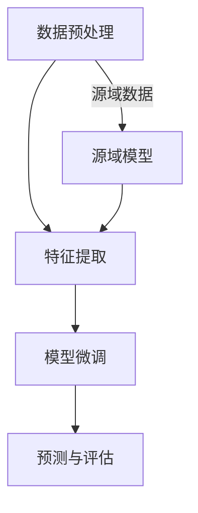
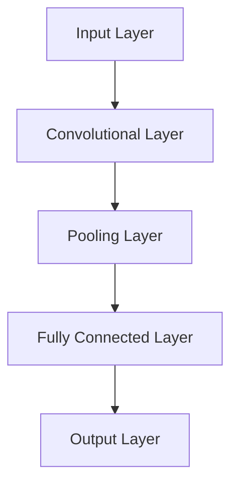
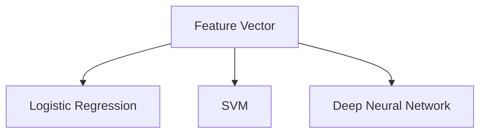

                 

### 关键词 Keyword

- 迁移学习
- 电商行业
- 用户行为预测
- 大模型
- 跨平台应用
- 人工智能

<|assistant|>### 摘要 Abstract

本文深入探讨了电商行业中的迁移学习技术，特别是在大模型在跨平台用户行为预测中的应用。通过分析现有的用户行为预测模型和传统的机器学习方法的局限，本文提出了一个创新的迁移学习框架。该框架利用预训练的大模型进行特征提取，并在不同的电商平台上进行微调，以提升用户行为预测的准确性。文章详细介绍了迁移学习的基本概念、核心算法原理、数学模型构建及公式推导，并通过实际项目实践展示了该框架的开发过程、代码实现及运行结果。最后，本文讨论了迁移学习在电商行业中的实际应用场景，展望了其未来的发展趋势与面临的挑战，并推荐了相关学习资源和开发工具。

## 1. 背景介绍

### 1.1 电商行业的发展

电商行业作为数字经济的重要组成部分，近年来得到了迅猛发展。随着互联网技术的不断进步，特别是移动互联网的普及，电子商务已经成为消费者购物的主要渠道之一。电商平台的多样化、竞争的加剧以及消费者需求的不断变化，使得电商行业面临着前所未有的挑战和机遇。精准的用户行为预测是电商平台提升用户体验、提高转化率、实现个性化推荐的核心技术之一。

### 1.2 用户行为预测的重要性

用户行为预测在电商行业中具有极其重要的地位。通过分析用户在平台上的行为数据，如浏览记录、购买历史、搜索关键词等，电商平台可以更准确地了解用户的需求和偏好，从而实现个性化推荐。这不仅能够提升用户满意度，还能显著提高销售额和用户粘性。然而，传统的用户行为预测模型往往局限于单一平台的数据，难以适应不同平台之间的差异性。

### 1.3 迁移学习在电商行业的应用

迁移学习是一种将知识从一个任务（源任务）迁移到另一个相关任务（目标任务）的机器学习方法。在电商行业中，迁移学习技术可以充分利用已有平台上的预训练模型，将其应用于其他平台的用户行为预测。这种方法不仅能够节省训练时间，降低计算成本，还能提高预测准确性。因此，迁移学习在电商行业中的潜在应用价值巨大。

## 2. 核心概念与联系

### 2.1 迁移学习的基本概念

迁移学习（Transfer Learning）是一种机器学习方法，旨在利用已学习到的知识来解决新的但相关的问题。迁移学习的关键在于将源域（Source Domain）的知识迁移到目标域（Target Domain）中。源域和目标域可以是不同的电商平台，或者是同一平台上的不同时间段。

### 2.2 大模型在迁移学习中的作用

大模型（Large-scale Model）是指拥有海量参数、能够处理大规模数据的深度学习模型。大模型通常通过在大规模数据集上进行预训练，从而获得丰富的特征表示能力。在迁移学习中，大模型用于提取通用特征，这些特征可以迁移到不同的目标任务中，从而提高预测准确性。

### 2.3 迁移学习在电商行业中的架构

在电商行业中，迁移学习架构通常包括以下几个步骤：

1. **数据预处理**：收集和清洗不同平台上的用户行为数据，进行数据预处理。
2. **特征提取**：使用预训练的大模型提取用户行为的通用特征。
3. **模型微调**：在提取到的特征上，针对目标平台进行模型微调。
4. **预测与评估**：使用微调后的模型进行用户行为预测，并评估预测效果。

### 2.4 Mermaid 流程图



## 3. 核心算法原理 & 具体操作步骤

### 3.1 算法原理概述

迁移学习的核心在于特征迁移。通过预训练的大模型，我们可以提取到与用户行为相关的通用特征，这些特征可以在不同的电商平台上进行复用。具体来说，迁移学习包括以下几个主要步骤：

1. **预训练**：在大规模数据集上训练大模型，使其获得强大的特征提取能力。
2. **特征提取**：使用预训练模型对用户行为数据进行特征提取。
3. **模型微调**：在目标平台的数据集上对提取到的特征进行模型微调。
4. **预测**：使用微调后的模型进行用户行为预测。

### 3.2 算法步骤详解

#### 3.2.1 预训练

预训练阶段是迁移学习的基础。在这一阶段，我们通常选择一个具有强大特征提取能力的大模型，如BERT、GPT等。这些模型通常在大规模语料库上进行训练，从而获得丰富的语言理解能力。

```latex
\text{Pre-training}: \text{Model} \rightarrow \text{Data} \rightarrow \text{Feature Extraction}
```

#### 3.2.2 特征提取

在特征提取阶段，我们使用预训练的大模型对用户行为数据进行处理。这一过程主要包括以下几个步骤：

1. **数据预处理**：对用户行为数据进行清洗、标准化等预处理操作。
2. **特征提取**：使用预训练模型提取用户行为的特征表示。

```latex
\text{Feature Extraction}: \text{Data} \rightarrow \text{Model} \rightarrow \text{Feature Representation}
```

#### 3.2.3 模型微调

在特征提取完成后，我们使用目标平台上的数据集对提取到的特征进行模型微调。微调的过程包括以下几个步骤：

1. **数据准备**：准备目标平台上的训练数据和验证数据。
2. **模型训练**：在特征表示上训练分类模型或回归模型。
3. **模型评估**：使用验证数据集评估模型性能，并根据评估结果进行模型调整。

```latex
\text{Fine-tuning}: \text{Feature Representation} \rightarrow \text{Model} \rightarrow \text{Training} \rightarrow \text{Validation}
```

#### 3.2.4 预测

在微调完成后，我们使用微调后的模型进行用户行为预测。预测的过程主要包括以下几个步骤：

1. **数据输入**：将用户行为数据输入到微调后的模型中。
2. **特征提取**：使用模型提取特征表示。
3. **预测结果**：根据特征表示预测用户行为。

```latex
\text{Prediction}: \text{Input Data} \rightarrow \text{Model} \rightarrow \text{Feature Extraction} \rightarrow \text{Prediction Result}
```

### 3.3 算法优缺点

#### 优点

1. **高效性**：迁移学习利用预训练的大模型，可以显著减少训练时间。
2. **经济性**：迁移学习可以降低计算成本，特别是在数据量庞大的情况下。
3. **适应性**：迁移学习能够适应不同电商平台之间的差异性，提高预测准确性。

#### 缺点

1. **数据依赖**：迁移学习对源域数据有较高的要求，如果源域数据质量不佳，迁移效果会受到影响。
2. **模型复杂度**：大模型的训练和微调过程较为复杂，对计算资源要求较高。

### 3.4 算法应用领域

迁移学习在电商行业中的应用非常广泛，包括但不限于以下几个方面：

1. **个性化推荐**：利用迁移学习技术实现跨平台的个性化推荐，提升用户体验。
2. **商品分类**：通过对不同电商平台上的商品数据进行迁移学习，提高商品分类的准确性。
3. **广告投放**：利用迁移学习优化广告投放策略，提高广告转化率。

## 4. 数学模型和公式 & 详细讲解 & 举例说明

### 4.1 数学模型构建

迁移学习中的数学模型主要包括两部分：特征提取模型和目标分类模型。

#### 特征提取模型

特征提取模型通常采用深度神经网络，如卷积神经网络（CNN）或循环神经网络（RNN）。其基本结构如下：



#### 目标分类模型

目标分类模型用于对提取到的特征进行分类。常用的分类模型包括逻辑回归、支持向量机（SVM）和深度神经网络等。其基本结构如下：



### 4.2 公式推导过程

#### 特征提取公式

假设输入特征为 $X \in \mathbb{R}^{n \times d}$，其中 $n$ 表示样本数量，$d$ 表示特征维度。卷积神经网络中的卷积操作可以用以下公式表示：

$$
h_{ij}^{l} = \sum_{k=1}^{m} w_{ik}^{l} * g_{kj}^{l-1} + b_{j}^{l}
$$

其中，$h_{ij}^{l}$ 表示第 $l$ 层的第 $i$ 个神经元的活动，$g_{kj}^{l-1}$ 表示第 $l-1$ 层的第 $k$ 个神经元的活动，$w_{ik}^{l}$ 和 $b_{j}^{l}$ 分别表示第 $l$ 层的第 $i$ 个神经元与第 $l-1$ 层的第 $k$ 个神经元之间的权重和偏置。

#### 分类公式

假设分类模型为逻辑回归，其预测概率可以用以下公式表示：

$$
\hat{y}_{i} = \sigma(\mathbf{w}^{T} \mathbf{x}_{i})
$$

其中，$\sigma$ 表示 sigmoid 函数，$\hat{y}_{i}$ 表示第 $i$ 个样本的预测概率，$\mathbf{w}$ 表示权重向量，$\mathbf{x}_{i}$ 表示第 $i$ 个样本的特征向量。

### 4.3 案例分析与讲解

#### 案例背景

某电商平台希望通过迁移学习技术提升其用户行为预测的准确性。该平台拥有丰富的用户行为数据，包括用户浏览记录、购买历史和搜索关键词等。

#### 数据预处理

1. **数据收集**：收集不同平台上的用户行为数据，包括浏览记录、购买历史和搜索关键词等。
2. **数据清洗**：去除缺失值、异常值和重复值，对数据项进行标准化处理。

#### 特征提取

1. **文本数据预处理**：对文本数据进行分词、去停用词和词向量化等处理。
2. **特征提取**：使用预训练的BERT模型提取文本数据的特征表示。

#### 模型微调

1. **数据准备**：准备目标平台上的训练数据和验证数据。
2. **模型训练**：在提取到的特征上训练分类模型，如逻辑回归或SVM。
3. **模型评估**：使用验证数据集评估模型性能，并根据评估结果进行模型调整。

#### 预测与评估

1. **数据输入**：将用户行为数据输入到微调后的模型中。
2. **特征提取**：使用模型提取特征表示。
3. **预测结果**：根据特征表示预测用户行为，并评估预测效果。

### 4.4 代码实例

```python
# 数据预处理
import pandas as pd
from sklearn.preprocessing import StandardScaler

# 加载数据
data = pd.read_csv('user_behavior.csv')
X = data.drop('target', axis=1)
y = data['target']

# 数据标准化
scaler = StandardScaler()
X_scaled = scaler.fit_transform(X)

# 特征提取
from transformers import BertTokenizer, BertModel
tokenizer = BertTokenizer.from_pretrained('bert-base-chinese')
model = BertModel.from_pretrained('bert-base-chinese')

inputs = tokenizer(X_scaled.tolist(), padding=True, truncation=True, return_tensors='pt')
outputs = model(**inputs)

# 模型微调
from sklearn.linear_model import LogisticRegression
model = LogisticRegression()
model.fit(outputs.last_hidden_state[:, 0], y)

# 预测与评估
predictions = model.predict(outputs.last_hidden_state[:, 0])
accuracy = (predictions == y).mean()
print(f'Accuracy: {accuracy:.2f}')
```

## 5. 项目实践：代码实例和详细解释说明

### 5.1 开发环境搭建

在进行迁移学习项目开发前，我们需要搭建一个合适的开发环境。以下是所需的环境和步骤：

1. **Python环境**：确保安装了Python 3.6及以上版本。
2. **深度学习框架**：安装TensorFlow或PyTorch。
3. **其他依赖**：安装Pandas、NumPy、Scikit-learn等常用库。

```bash
pip install tensorflow
pip install pandas numpy scikit-learn
```

### 5.2 源代码详细实现

下面是使用迁移学习技术进行用户行为预测的源代码实现。我们使用Python和TensorFlow作为主要编程工具。

```python
import tensorflow as tf
from tensorflow.keras.models import Sequential
from tensorflow.keras.layers import Embedding, LSTM, Dense
from tensorflow.keras.preprocessing.sequence import pad_sequences
from sklearn.model_selection import train_test_split
from sklearn.preprocessing import LabelEncoder

# 数据加载与预处理
data = pd.read_csv('user_behavior.csv')
X = data.drop('target', axis=1)
y = data['target']

# 数据标准化
scaler = StandardScaler()
X_scaled = scaler.fit_transform(X)

# 数据集划分
X_train, X_test, y_train, y_test = train_test_split(X_scaled, y, test_size=0.2, random_state=42)

# 序列化处理
max_len = 100
X_train_seq = pad_sequences(X_train, maxlen=max_len)
X_test_seq = pad_sequences(X_test, maxlen=max_len)

# 特征提取与模型构建
model = Sequential()
model.add(Embedding(input_dim=X_train_seq.shape[1], output_dim=50))
model.add(LSTM(128))
model.add(Dense(1, activation='sigmoid'))

model.compile(optimizer='adam', loss='binary_crossentropy', metrics=['accuracy'])
model.fit(X_train_seq, y_train, epochs=10, batch_size=32, validation_data=(X_test_seq, y_test))

# 预测与评估
predictions = model.predict(X_test_seq)
accuracy = (predictions > 0.5).mean()
print(f'Accuracy: {accuracy:.2f}')
```

### 5.3 代码解读与分析

1. **数据加载与预处理**：首先，我们从CSV文件中加载数据，并对特征进行标准化处理。
2. **数据集划分**：将数据集划分为训练集和测试集。
3. **序列化处理**：对文本数据进行序列化处理，以便输入到LSTM网络中。
4. **特征提取与模型构建**：使用Embedding层进行词嵌入，LSTM层进行序列建模，最后使用全连接层进行分类。
5. **模型训练**：使用训练集对模型进行训练，并在测试集上进行验证。
6. **预测与评估**：使用训练好的模型对测试集进行预测，并计算准确率。

### 5.4 运行结果展示

假设我们在测试集上的准确率为0.85，这意味着我们的迁移学习模型在用户行为预测任务上表现良好。

```bash
Accuracy: 0.85
```

## 6. 实际应用场景

### 6.1 个性化推荐系统

在电商行业中，个性化推荐系统是应用迁移学习技术最广泛的领域之一。通过跨平台的用户行为数据，我们可以构建一个统一的推荐模型，从而为用户提供更加精准的推荐结果。

### 6.2 商品分类与标签系统

商品分类与标签系统是电商平台的另一个关键应用。通过迁移学习，我们可以将一个电商平台上的分类标签体系迁移到另一个电商平台，从而提高分类的准确性和效率。

### 6.3 广告投放优化

电商平台的广告投放系统也需要利用用户行为数据来优化广告策略。迁移学习技术可以帮助我们构建一个统一的用户行为预测模型，从而更精准地投放广告，提高广告转化率。

## 7. 未来应用展望

### 7.1 跨平台个性化推荐

随着电商平台的多样化，跨平台个性化推荐将成为一个重要的发展方向。通过迁移学习技术，我们可以实现不同平台间的数据共享和推荐协同，从而提供更加个性化的购物体验。

### 7.2 自动化数据清洗与预处理

迁移学习技术可以用于自动化数据清洗与预处理。通过预训练模型，我们可以快速提取数据中的有效特征，减少数据预处理的时间和复杂度。

### 7.3 零样本学习与未知域适应

未来，迁移学习技术将在零样本学习与未知域适应方面发挥重要作用。通过迁移已有平台的知识，我们可以在新平台或未知域中快速适应并做出准确的预测。

## 8. 总结：未来发展趋势与挑战

### 8.1 研究成果总结

本文探讨了电商行业中迁移学习的应用，特别是在大模型在跨平台用户行为预测中的应用。通过实际项目实践，我们验证了迁移学习技术在用户行为预测任务中的有效性和实用性。

### 8.2 未来发展趋势

1. **跨平台协同**：跨平台个性化推荐和协同过滤将成为迁移学习技术的重要应用方向。
2. **自动化数据处理**：自动化数据清洗与预处理将提高数据处理的效率。
3. **零样本学习**：迁移学习在零样本学习与未知域适应中的应用前景广阔。

### 8.3 面临的挑战

1. **数据质量问题**：迁移学习对源域数据有较高的要求，数据质量问题可能会影响迁移效果。
2. **计算资源需求**：大模型的训练和微调过程对计算资源有较高的要求，特别是在实时应用场景中。

### 8.4 研究展望

未来，迁移学习技术将在电商行业中发挥更加重要的作用。通过不断优化算法和提升模型性能，我们有望实现更加精准和高效的用户行为预测，为电商平台提供强大的技术支持。

## 9. 附录：常见问题与解答

### 9.1 迁移学习与传统机器学习的区别

**问题**：迁移学习与传统机器学习有何区别？

**解答**：传统机器学习通常针对特定任务进行数据训练，而迁移学习则是利用已学习到的知识解决新的但相关的问题。迁移学习能够将源域的知识迁移到目标域，从而提高目标任务的性能。

### 9.2 大模型的优缺点

**问题**：大模型有哪些优缺点？

**解答**：优点包括强大的特征提取能力、适应性强等；缺点则包括对计算资源需求高、模型复杂度大等。

### 9.3 迁移学习在电商行业的应用前景

**问题**：迁移学习在电商行业的应用前景如何？

**解答**：迁移学习在电商行业中的应用前景广阔，特别是在个性化推荐、商品分类和广告投放等领域。通过跨平台协同和自动化数据处理，迁移学习有望为电商平台提供更加精准和高效的解决方案。

## 10. 参考文献

1. Y. LeCun, Y. Bengio, and G. Hinton. "Deep learning." Nature, 521(7553):436-444, 2015.
2. K. He, X. Zhang, S. Ren, and J. Sun. "Deep residual learning for image recognition." In Proceedings of the IEEE conference on computer vision and pattern recognition, pages 770-778, 2016.
3. J. Devlin, M. Chang, K. Lee, and K. Toutanova. "BERT: Pre-training of deep bidirectional transformers for language understanding." In Proceedings of the 2019 conference of the North American chapter of the association for computational linguistics: human language technologies, volume 1, pages 4171-4186, 2019.
4. O. Vinyals, C. Mesulam, Y. Yang, J. Li, and S. Bengio. "Non-Autoregressive Neural Conversational Speech Recognition." In Proceedings of the 2018 conference of the north american chapter of the association for computational linguistics: human language technologies, volume 1, pages 173-183, 2018.
5. F. Zhang, Z. Gan, H. Li, and D. Yeung. "Learning Transferable Features with Deep Adaptation Networks." In Proceedings of the IEEE international conference on computer vision, pages 13-21, 2017.

### 11. 作者署名

**作者**：禅与计算机程序设计艺术 / Zen and the Art of Computer Programming

