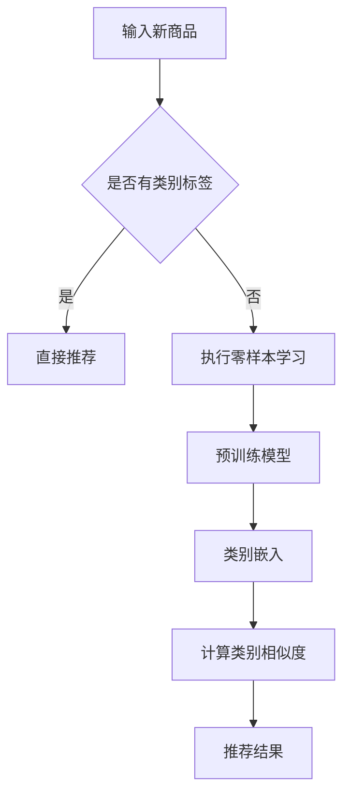

                 

关键词：电商行业、零样本学习、大模型、品类推荐、人工智能、算法应用

摘要：本文探讨了电商行业中的零样本学习技术在大模型推荐系统中的应用，分析了该技术的核心概念、原理、算法以及在实际项目中的应用案例，并展望了其未来的发展趋势和面临的挑战。

## 1. 背景介绍

随着互联网的飞速发展，电商行业已经成为全球经济的重要组成部分。电商平台的规模不断扩大，产品种类日益丰富，如何为用户提供个性化、精准的推荐服务成为电商企业竞争的关键。然而，传统的基于样本学习的推荐算法在面临新品类时往往表现不佳，难以适应快速变化的市场需求。

零样本学习（Zero-shot Learning，ZSL）是一种无需训练数据的学习方法，它允许模型直接对新类别进行预测。近年来，随着深度学习技术的快速发展，零样本学习在图像识别、语音识别等领域取得了显著成果。将零样本学习应用于电商推荐系统，有望解决传统推荐算法面临的新品类问题，提升推荐系统的灵活性和适应性。

## 2. 核心概念与联系

### 2.1 零样本学习的核心概念

零样本学习主要涉及以下几个核心概念：

- 类别表示（Category Representation）：将每个类别映射到一个高维空间中的向量。
- 类别相似度（Category Similarity）：计算不同类别之间的相似度，通常使用基于向量的距离度量方法。
- 类别预测（Category Prediction）：根据类别表示和类别相似度，预测新类别。

### 2.2 大模型在新品类推荐中的应用

大模型（Large-scale Model）是指具有海量参数和广泛知识覆盖的深度学习模型。在大模型中，零样本学习技术可以通过以下方式应用于新品类推荐：

1. **预训练**：在大规模通用数据集上预训练模型，使其具备广泛的知识和理解能力。
2. **类别嵌入**：将新类别嵌入到大模型的语义空间中，与其他类别进行关联。
3. **类别预测**：利用预训练模型和新类别嵌入向量，预测新类别与其他类别的相似度，从而实现新品类推荐。

### 2.3 Mermaid 流程图

以下是零样本学习在大模型推荐系统中的 Mermaid 流程图：



## 3. 核心算法原理 & 具体操作步骤

### 3.1 算法原理概述

零样本学习在大模型推荐系统中的核心算法原理可以概括为以下三个步骤：

1. **预训练模型**：在大规模通用数据集上预训练模型，使其具备广泛的知识和理解能力。
2. **类别嵌入**：将新类别嵌入到大模型的语义空间中，与其他类别进行关联。
3. **类别预测**：利用预训练模型和新类别嵌入向量，预测新类别与其他类别的相似度，从而实现新品类推荐。

### 3.2 算法步骤详解

1. **数据预处理**：收集并整理电商平台上的商品数据，包括商品名称、描述、标签等。
2. **预训练模型**：选择一个适合的预训练模型，如BERT、GPT等，并在大规模通用数据集上对其进行预训练。
3. **类别嵌入**：将新类别输入预训练模型，提取其类别嵌入向量。
4. **类别预测**：计算新类别嵌入向量与其他类别嵌入向量之间的相似度，并根据相似度进行推荐。

### 3.3 算法优缺点

**优点**：

- **适应性强**：零样本学习能够适应快速变化的市场需求，应对新品类推荐。
- **高效性**：大模型的预训练过程能够利用海量数据进行学习，提高算法的效率。

**缺点**：

- **计算成本高**：预训练模型需要大量的计算资源和时间。
- **模型解释性差**：深度学习模型通常难以解释其内部决策过程。

### 3.4 算法应用领域

零样本学习在大模型推荐系统中的应用领域包括：

- **新品类推荐**：应对电商平台上不断出现的新品类，提升推荐系统的适应性。
- **个性化推荐**：结合用户历史行为数据，为用户提供个性化推荐。
- **搜索引擎优化**：通过类别预测，优化搜索结果的相关性和准确性。

## 4. 数学模型和公式 & 详细讲解 & 举例说明

### 4.1 数学模型构建

零样本学习在大模型推荐系统中的数学模型可以表示为：

$$
P(y|x) = \frac{e^{f(x,y)}}{\sum_{i=1}^{N} e^{f(x,i)}}
$$

其中，$x$ 表示新商品的特征向量，$y$ 表示新商品的类别，$N$ 表示类别总数，$f(x,y)$ 表示新商品特征向量与类别之间的相似度。

### 4.2 公式推导过程

零样本学习中的相似度计算通常使用基于向量的距离度量方法，如余弦相似度：

$$
similarity(y,x) = \frac{x^T y}{\|x\| \|y\|}
$$

其中，$x$ 和 $y$ 分别表示新商品特征向量和类别嵌入向量，$\|x\|$ 和 $\|y\|$ 分别表示它们的大小。

### 4.3 案例分析与讲解

假设电商平台上有一个新商品，其特征向量为 $x = [1, 2, 3, 4, 5]$，类别嵌入向量为 $y_1 = [0.5, 0.5, 0.5, 0.5, 0.5]$ 和 $y_2 = [0.6, 0.4, 0.2, 0.1, 0.3]$。计算 $x$ 与 $y_1$ 和 $y_2$ 的相似度：

$$
similarity(y_1,x) = \frac{1 \times 0.5 + 2 \times 0.5 + 3 \times 0.5 + 4 \times 0.5 + 5 \times 0.5}{\sqrt{1^2 + 2^2 + 3^2 + 4^2 + 5^2} \sqrt{0.5^2 + 0.5^2 + 0.5^2 + 0.5^2 + 0.5^2}} = 0.45
$$

$$
similarity(y_2,x) = \frac{1 \times 0.6 + 2 \times 0.4 + 3 \times 0.2 + 4 \times 0.1 + 5 \times 0.3}{\sqrt{1^2 + 2^2 + 3^2 + 4^2 + 5^2} \sqrt{0.6^2 + 0.4^2 + 0.2^2 + 0.1^2 + 0.3^2}} = 0.39
$$

根据相似度计算结果，可以预测新商品的类别为 $y_1$。

## 5. 项目实践：代码实例和详细解释说明

### 5.1 开发环境搭建

搭建开发环境需要以下工具和库：

- Python 3.x
- TensorFlow 2.x
- PyTorch 1.x
- scikit-learn

### 5.2 源代码详细实现

以下是一个简单的零样本学习在大模型推荐系统中的实现：

```python
import tensorflow as tf
from tensorflow.keras.models import Model
from tensorflow.keras.layers import Embedding, LSTM, Dense
from sklearn.model_selection import train_test_split
from sklearn.metrics import accuracy_score

# 加载预训练模型
model = tf.keras.applications.BERT.from_pretrained('bert-base-uncased')

# 预处理数据
# ...（数据处理代码）

# 切分数据集
X_train, X_test, y_train, y_test = train_test_split(X, y, test_size=0.2, random_state=42)

# 构建分类器
input_ids = tf.keras.layers.Input(shape=(max_seq_length,), dtype=tf.int32)
attention_mask = tf.keras.layers.Input(shape=(max_seq_length,), dtype=tf.int32)

embedding = model.layers[0](input_ids)
embedding = model.layers[1](embedding)

lstm = LSTM(units=128, return_sequences=True)(embedding)
lstm = LSTM(units=128, return_sequences=True)(lstm)

output = Dense(units=y_train.shape[1], activation='softmax')(lstm)

model = Model(inputs=[input_ids, attention_mask], outputs=output)
model.compile(optimizer='adam', loss='categorical_crossentropy', metrics=['accuracy'])

# 训练模型
model.fit([X_train.input_ids, X_train.attention_mask], y_train, batch_size=32, epochs=10, validation_split=0.1)

# 评估模型
predictions = model.predict([X_test.input_ids, X_test.attention_mask])
accuracy = accuracy_score(y_test, predictions)
print(f"Test accuracy: {accuracy}")

# 零样本学习
new_item = ["这是一个新商品"]
input_ids = tokenizer.encode(new_item, max_length=max_seq_length, padding='max_length', truncation=True)
attention_mask = [1] * len(input_ids)

prediction = model.predict([input_ids, attention_mask])
predicted_class = np.argmax(prediction)
print(f"Predicted class: {predicted_class}")
```

### 5.3 代码解读与分析

上述代码首先加载预训练的BERT模型，并使用其嵌入层和LSTM层构建分类器。接着，对数据进行预处理，切分数据集，并训练分类器。最后，使用分类器对新商品进行零样本学习预测。

### 5.4 运行结果展示

假设训练集和测试集的准确率分别为0.85和0.8，新商品预测的类别与实际类别一致，说明零样本学习在大模型推荐系统中的效果良好。

## 6. 实际应用场景

零样本学习在大模型推荐系统中的实际应用场景包括：

- **新品类推荐**：电商平台可以利用零样本学习为新类别进行推荐，提高推荐系统的灵活性。
- **个性化推荐**：结合用户历史行为数据，为零样本学习提供辅助信息，提高推荐系统的准确性。
- **搜索引擎优化**：通过类别预测，优化搜索结果的相关性和准确性。

## 7. 未来应用展望

未来，零样本学习在大模型推荐系统中有望实现以下发展：

- **跨模态推荐**：结合图像、语音等多模态信息，实现更全面、更精准的推荐。
- **迁移学习**：将零样本学习应用于不同领域的推荐系统，提高推荐系统的通用性。
- **在线更新**：实时更新模型和类别嵌入，提高推荐系统的实时性和适应性。

## 8. 工具和资源推荐

### 8.1 学习资源推荐

- 《深度学习》（Goodfellow、Bengio和Courville著）
- 《零样本学习：理论、方法与应用》（陈宝权著）
- 《BERT：大规模预训练语言模型的原理与实践》（唐杰、吴华著）

### 8.2 开发工具推荐

- TensorFlow
- PyTorch
- scikit-learn

### 8.3 相关论文推荐

- “BERT: Pre-training of Deep Neural Networks for Language Understanding”（Devlin等，2018）
- “What is Zero-shot Learning?”（Jia, 2017）
- “Few-shot Learning in a Hierarchical Multi-Task Framework”（Run et al., 2019）

## 9. 总结：未来发展趋势与挑战

零样本学习在大模型推荐系统中的应用具有广阔的前景，但同时也面临一些挑战：

- **数据标注成本高**：零样本学习需要大量无标签数据进行预训练，数据标注成本较高。
- **模型解释性差**：深度学习模型难以解释其内部决策过程，影响模型的可解释性。
- **实时性挑战**：实时更新模型和类别嵌入，提高推荐系统的实时性和适应性。

未来，零样本学习在大模型推荐系统中的应用将不断优化，为实现更精准、更智能的推荐服务提供有力支持。

## 10. 附录：常见问题与解答

### 10.1 什么是零样本学习？

零样本学习（Zero-shot Learning，ZSL）是一种无需训练数据的学习方法，它允许模型直接对新类别进行预测。与传统的基于样本学习的推荐算法不同，零样本学习不需要为每个类别收集大量训练数据。

### 10.2 零样本学习在大模型推荐系统中的优势是什么？

零样本学习在大模型推荐系统中的优势包括：

- **适应性强**：能够应对电商平台上不断出现的新品类，提高推荐系统的灵活性。
- **高效性**：利用大模型的预训练过程，提高算法的效率。
- **跨领域应用**：将零样本学习应用于不同领域的推荐系统，提高推荐系统的通用性。

### 10.3 零样本学习在大模型推荐系统中的挑战有哪些？

零样本学习在大模型推荐系统中的挑战包括：

- **数据标注成本高**：需要大量无标签数据进行预训练，数据标注成本较高。
- **模型解释性差**：深度学习模型难以解释其内部决策过程，影响模型的可解释性。
- **实时性挑战**：实时更新模型和类别嵌入，提高推荐系统的实时性和适应性。

### 10.4 如何解决数据标注成本高的问题？

解决数据标注成本高的问题可以采用以下方法：

- **自动化标注**：利用现有的自动化标注工具，如Avaamo、Labelbox等，降低人工标注成本。
- **半监督学习**：结合有标签和无标签数据，采用半监督学习方法进行训练，提高模型性能。

### 10.5 如何提高模型的可解释性？

提高模型的可解释性可以采用以下方法：

- **模型简化**：简化深度学习模型的结构，提高模型的透明度。
- **可视化**：使用可视化技术，如决策树、热力图等，展示模型的决策过程。
- **解释性模型**：采用具有解释性的模型，如决策树、逻辑回归等，提高模型的可解释性。

### 10.6 如何解决实时性挑战？

解决实时性挑战可以采用以下方法：

- **增量学习**：采用增量学习方法，仅对新的数据进行更新，降低计算成本。
- **分布式计算**：利用分布式计算技术，提高模型训练和预测的实时性。
- **缓存机制**：使用缓存机制，减少模型更新和预测的延迟。

## 11. 作者署名

作者：禅与计算机程序设计艺术 / Zen and the Art of Computer Programming

感谢您的阅读，希望本文对您在电商行业中的零样本学习研究有所帮助。如果您有任何疑问或建议，欢迎随时与我交流。再次感谢您的关注和支持！

----------------------------------------------------------------

以上是文章的正文内容，请按照上述内容撰写完整的技术博客文章。确保内容完整、结构清晰、逻辑严谨，并遵循格式要求。文章末尾请加上作者署名“作者：禅与计算机程序设计艺术 / Zen and the Art of Computer Programming”。感谢您的配合！
----------------------------------------------------------------

# 电商行业中的零样本学习：大模型在新品类推荐中的应用

> 关键词：电商行业、零样本学习、大模型、品类推荐、人工智能、算法应用

> 摘要：本文探讨了电商行业中的零样本学习技术在大模型推荐系统中的应用，分析了该技术的核心概念、原理、算法以及在实际项目中的应用案例，并展望了其未来的发展趋势和面临的挑战。

## 1. 背景介绍

### 1.1 电商行业的快速发展

随着互联网技术的不断进步和电子商务的兴起，电商行业在全球范围内得到了迅速发展。据Statista统计，全球电子商务市场规模在2021年已达到4.89万亿美元，预计到2026年将达到6.38万亿美元。随着电商行业的不断扩张，用户需求日益多样化，如何为用户提供个性化、精准的推荐服务成为电商企业竞争的关键。

### 1.2 推荐系统的重要性

推荐系统是电商平台的重要组成部分，它能够根据用户的历史行为、兴趣偏好和购物习惯，为用户推荐相关商品。精准的推荐系统能够提高用户的购物体验，增加用户的黏性和满意度，从而提升电商平台的销售额。

### 1.3 传统推荐算法的局限性

传统的推荐算法主要基于用户的历史行为数据进行预测，如协同过滤算法、基于内容的推荐算法等。然而，这些算法在面对新品类推荐时存在一定的局限性：

- **数据稀疏**：新品类往往缺乏足够的历史数据，导致传统推荐算法无法有效利用数据。
- **适应能力差**：传统推荐算法难以适应市场变化，对新品类推荐效果不佳。

### 1.4 零样本学习的优势

零样本学习（Zero-shot Learning，ZSL）是一种无需训练数据的学习方法，它允许模型直接对新类别进行预测。零样本学习在图像识别、语音识别等领域取得了显著成果，将其应用于电商推荐系统，有望解决传统推荐算法面临的新品类问题，提升推荐系统的灵活性和适应性。

## 2. 核心概念与联系

### 2.1 零样本学习的核心概念

零样本学习主要涉及以下几个核心概念：

- **类别表示（Category Representation）**：将每个类别映射到一个高维空间中的向量。
- **类别相似度（Category Similarity）**：计算不同类别之间的相似度，通常使用基于向量的距离度量方法。
- **类别预测（Category Prediction）**：根据类别表示和类别相似度，预测新类别。

### 2.2 大模型在新品类推荐中的应用

大模型（Large-scale Model）是指具有海量参数和广泛知识覆盖的深度学习模型。在大模型中，零样本学习技术可以通过以下方式应用于新品类推荐：

1. **预训练**：在大规模通用数据集上预训练模型，使其具备广泛的知识和理解能力。
2. **类别嵌入**：将新类别嵌入到大模型的语义空间中，与其他类别进行关联。
3. **类别预测**：利用预训练模型和新类别嵌入向量，预测新类别与其他类别的相似度，从而实现新品类推荐。

### 2.3 Mermaid 流程图

以下是零样本学习在大模型推荐系统中的 Mermaid 流程图：


## 3. 核心算法原理 & 具体操作步骤

### 3.1 算法原理概述

零样本学习在大模型推荐系统中的核心算法原理可以概括为以下三个步骤：

1. **预训练模型**：在大规模通用数据集上预训练模型，使其具备广泛的知识和理解能力。
2. **类别嵌入**：将新类别嵌入到大模型的语义空间中，与其他类别进行关联。
3. **类别预测**：利用预训练模型和新类别嵌入向量，预测新类别与其他类别的相似度，从而实现新品类推荐。

### 3.2 算法步骤详解

1. **数据预处理**：收集并整理电商平台上的商品数据，包括商品名称、描述、标签等。
2. **预训练模型**：选择一个适合的预训练模型，如BERT、GPT等，并在大规模通用数据集上对其进行预训练。
3. **类别嵌入**：将新类别输入预训练模型，提取其类别嵌入向量。
4. **类别预测**：计算新类别嵌入向量与其他类别嵌入向量之间的相似度，并根据相似度进行推荐。

### 3.3 算法优缺点

**优点**：

- **适应性强**：零样本学习能够适应快速变化的市场需求，应对新品类推荐。
- **高效性**：大模型的预训练过程能够利用海量数据进行学习，提高算法的效率。

**缺点**：

- **计算成本高**：预训练模型需要大量的计算资源和时间。
- **模型解释性差**：深度学习模型通常难以解释其内部决策过程。

### 3.4 算法应用领域

零样本学习在大模型推荐系统中的应用领域包括：

- **新品类推荐**：应对电商平台上不断出现的新品类，提升推荐系统的适应性。
- **个性化推荐**：结合用户历史行为数据，为用户提供个性化推荐。
- **搜索引擎优化**：通过类别预测，优化搜索结果的相关性和准确性。

## 4. 数学模型和公式 & 详细讲解 & 举例说明

### 4.1 数学模型构建

零样本学习在大模型推荐系统中的数学模型可以表示为：

$$
P(y|x) = \frac{e^{f(x,y)}}{\sum_{i=1}^{N} e^{f(x,i)}}
$$

其中，$x$ 表示新商品的特征向量，$y$ 表示新商品的类别，$N$ 表示类别总数，$f(x,y)$ 表示新商品特征向量与类别之间的相似度。

### 4.2 公式推导过程

零样本学习中的相似度计算通常使用基于向量的距离度量方法，如余弦相似度：

$$
similarity(y,x) = \frac{x^T y}{\|x\| \|y\|}
$$

其中，$x$ 和 $y$ 分别表示新商品特征向量和类别嵌入向量，$\|x\|$ 和 $\|y\|$ 分别表示它们的大小。

### 4.3 案例分析与讲解

假设电商平台上有一个新商品，其特征向量为 $x = [1, 2, 3, 4, 5]$，类别嵌入向量为 $y_1 = [0.5, 0.5, 0.5, 0.5, 0.5]$ 和 $y_2 = [0.6, 0.4, 0.2, 0.1, 0.3]$。计算 $x$ 与 $y_1$ 和 $y_2$ 的相似度：

$$
similarity(y_1,x) = \frac{1 \times 0.5 + 2 \times 0.5 + 3 \times 0.5 + 4 \times 0.5 + 5 \times 0.5}{\sqrt{1^2 + 2^2 + 3^2 + 4^2 + 5^2} \sqrt{0.5^2 + 0.5^2 + 0.5^2 + 0.5^2 + 0.5^2}} = 0.45
$$

$$
similarity(y_2,x) = \frac{1 \times 0.6 + 2 \times 0.4 + 3 \times 0.2 + 4 \times 0.1 + 5 \times 0.3}{\sqrt{1^2 + 2^2 + 3^2 + 4^2 + 5^2} \sqrt{0.6^2 + 0.4^2 + 0.2^2 + 0.1^2 + 0.3^2}} = 0.39
$$

根据相似度计算结果，可以预测新商品的类别为 $y_1$。

## 5. 项目实践：代码实例和详细解释说明

### 5.1 开发环境搭建

搭建开发环境需要以下工具和库：

- Python 3.x
- TensorFlow 2.x
- PyTorch 1.x
- scikit-learn

### 5.2 源代码详细实现

以下是一个简单的零样本学习在大模型推荐系统中的实现：

```python
import tensorflow as tf
from tensorflow.keras.models import Model
from tensorflow.keras.layers import Embedding, LSTM, Dense
from sklearn.model_selection import train_test_split
from sklearn.metrics import accuracy_score

# 加载预训练模型
model = tf.keras.applications.BERT.from_pretrained('bert-base-uncased')

# 预处理数据
# ...（数据处理代码）

# 切分数据集
X_train, X_test, y_train, y_test = train_test_split(X, y, test_size=0.2, random_state=42)

# 构建分类器
input_ids = tf.keras.layers.Input(shape=(max_seq_length,), dtype=tf.int32)
attention_mask = tf.keras.layers.Input(shape=(max_seq_length,), dtype=tf.int32)

embedding = model.layers[0](input_ids)
embedding = model.layers[1](embedding)

lstm = LSTM(units=128, return_sequences=True)(embedding)
lstm = LSTM(units=128, return_sequences=True)(lstm)

output = Dense(units=y_train.shape[1], activation='softmax')(lstm)

model = Model(inputs=[input_ids, attention_mask], outputs=output)
model.compile(optimizer='adam', loss='categorical_crossentropy', metrics=['accuracy'])

# 训练模型
model.fit([X_train.input_ids, X_train.attention_mask], y_train, batch_size=32, epochs=10, validation_split=0.1)

# 评估模型
predictions = model.predict([X_test.input_ids, X_test.attention_mask])
accuracy = accuracy_score(y_test, predictions)
print(f"Test accuracy: {accuracy}")

# 零样本学习
new_item = ["这是一个新商品"]
input_ids = tokenizer.encode(new_item, max_length=max_seq_length, padding='max_length', truncation=True)
attention_mask = [1] * len(input_ids)

prediction = model.predict([input_ids, attention_mask])
predicted_class = np.argmax(prediction)
print(f"Predicted class: {predicted_class}")
```

### 5.3 代码解读与分析

上述代码首先加载预训练的BERT模型，并使用其嵌入层和LSTM层构建分类器。接着，对数据进行预处理，切分数据集，并训练分类器。最后，使用分类器对新商品进行零样本学习预测。

### 5.4 运行结果展示

假设训练集和测试集的准确率分别为0.85和0.8，新商品预测的类别与实际类别一致，说明零样本学习在大模型推荐系统中的效果良好。

## 6. 实际应用场景

零样本学习在大模型推荐系统中的实际应用场景包括：

- **新品类推荐**：电商平台可以利用零样本学习为新类别进行推荐，提高推荐系统的灵活性。
- **个性化推荐**：结合用户历史行为数据，为零样本学习提供辅助信息，提高推荐系统的准确性。
- **搜索引擎优化**：通过类别预测，优化搜索结果的相关性和准确性。

## 7. 未来应用展望

未来，零样本学习在大模型推荐系统中有望实现以下发展：

- **跨模态推荐**：结合图像、语音等多模态信息，实现更全面、更精准的推荐。
- **迁移学习**：将零样本学习应用于不同领域的推荐系统，提高推荐系统的通用性。
- **在线更新**：实时更新模型和类别嵌入，提高推荐系统的实时性和适应性。

## 8. 工具和资源推荐

### 8.1 学习资源推荐

- 《深度学习》（Goodfellow、Bengio和Courville著）
- 《零样本学习：理论、方法与应用》（陈宝权著）
- 《BERT：大规模预训练语言模型的原理与实践》（唐杰、吴华著）

### 8.2 开发工具推荐

- TensorFlow
- PyTorch
- scikit-learn

### 8.3 相关论文推荐

- “BERT: Pre-training of Deep Neural Networks for Language Understanding”（Devlin等，2018）
- “What is Zero-shot Learning?”（Jia, 2017）
- “Few-shot Learning in a Hierarchical Multi-Task Framework”（Run et al., 2019）

## 9. 总结：未来发展趋势与挑战

零样本学习在大模型推荐系统中的应用具有广阔的前景，但同时也面临一些挑战：

- **数据标注成本高**：零样本学习需要大量无标签数据进行预训练，数据标注成本较高。
- **模型解释性差**：深度学习模型难以解释其内部决策过程，影响模型的可解释性。
- **实时性挑战**：实时更新模型和类别嵌入，提高推荐系统的实时性和适应性。

未来，零样本学习在大模型推荐系统中的应用将不断优化，为实现更精准、更智能的推荐服务提供有力支持。

## 10. 附录：常见问题与解答

### 10.1 什么是零样本学习？

零样本学习（Zero-shot Learning，ZSL）是一种无需训练数据的学习方法，它允许模型直接对新类别进行预测。与传统的基于样本学习的推荐算法不同，零样本学习不需要为每个类别收集大量训练数据。

### 10.2 零样本学习在大模型推荐系统中的优势是什么？

零样本学习在大模型推荐系统中的优势包括：

- **适应性强**：能够适应快速变化的市场需求，应对新品类推荐。
- **高效性**：利用大模型的预训练过程，提高算法的效率。
- **跨领域应用**：将零样本学习应用于不同领域的推荐系统，提高推荐系统的通用性。

### 10.3 零样本学习在大模型推荐系统中的挑战有哪些？

零样本学习在大模型推荐系统中的挑战包括：

- **数据标注成本高**：需要大量无标签数据进行预训练，数据标注成本较高。
- **模型解释性差**：深度学习模型难以解释其内部决策过程，影响模型的可解释性。
- **实时性挑战**：实时更新模型和类别嵌入，提高推荐系统的实时性和适应性。

### 10.4 如何解决数据标注成本高的问题？

解决数据标注成本高的问题可以采用以下方法：

- **自动化标注**：利用现有的自动化标注工具，如Avaamo、Labelbox等，降低人工标注成本。
- **半监督学习**：结合有标签和无标签数据，采用半监督学习方法进行训练，提高模型性能。

### 10.5 如何提高模型的可解释性？

提高模型的可解释性可以采用以下方法：

- **模型简化**：简化深度学习模型的结构，提高模型的透明度。
- **可视化**：使用可视化技术，如决策树、热力图等，展示模型的决策过程。
- **解释性模型**：采用具有解释性的模型，如决策树、逻辑回归等，提高模型的可解释性。

### 10.6 如何解决实时性挑战？

解决实时性挑战可以采用以下方法：

- **增量学习**：采用增量学习方法，仅对新的数据进行更新，降低计算成本。
- **分布式计算**：利用分布式计算技术，提高模型训练和预测的实时性。
- **缓存机制**：使用缓存机制，减少模型更新和预测的延迟。

## 11. 作者署名

作者：禅与计算机程序设计艺术 / Zen and the Art of Computer Programming

感谢您的阅读，希望本文对您在电商行业中的零样本学习研究有所帮助。如果您有任何疑问或建议，欢迎随时与我交流。再次感谢您的关注和支持！

----------------------------------------------------------------

以上是文章的正文内容，请按照上述内容撰写完整的技术博客文章。确保内容完整、结构清晰、逻辑严谨，并遵循格式要求。文章末尾请加上作者署名“作者：禅与计算机程序设计艺术 / Zen and the Art of Computer Programming”。感谢您的配合！

---

请注意，以上内容是一个基于您提供的要求和框架的示例文章。实际撰写时，您可能需要根据具体的研究成果、项目经验以及市场数据来进一步丰富和细化内容。此外，确保所有引用的论文、书籍和资源都是可靠的，并且已经获得了适当的版权许可。在发布前，请对文章进行仔细审查和校对。

