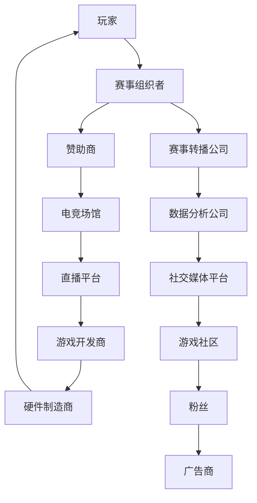
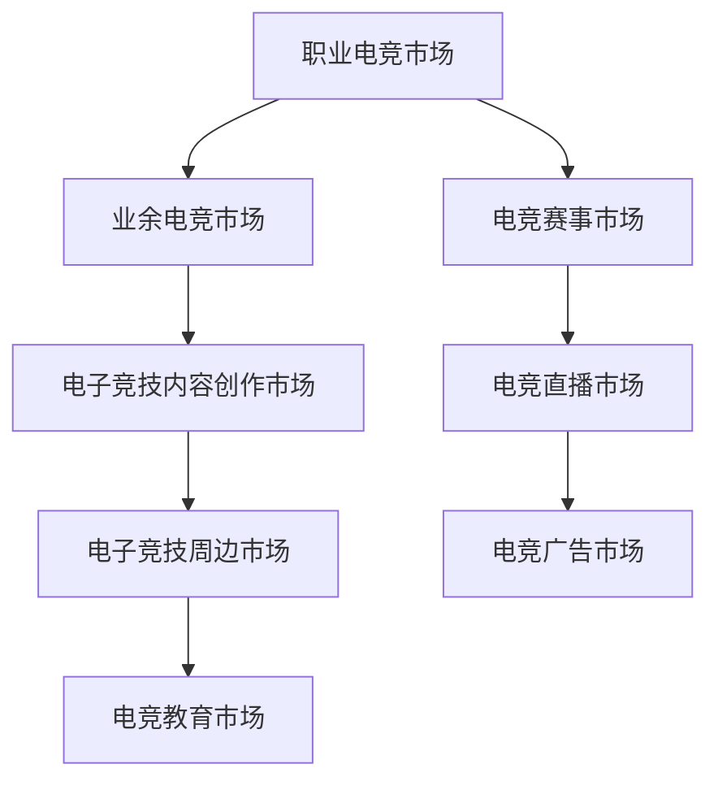
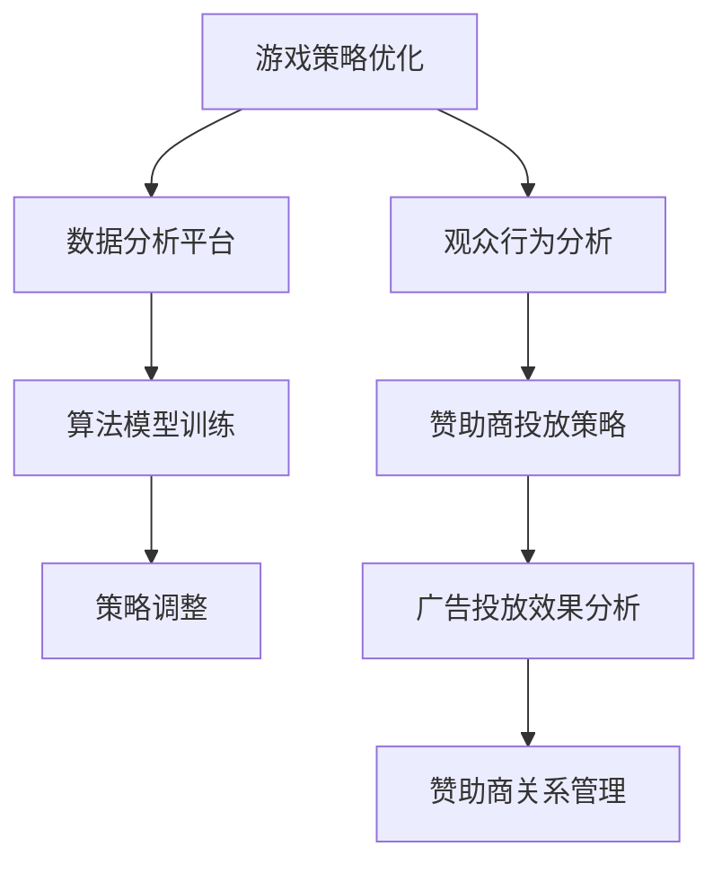

                 

 电子竞技作为新兴体育产业的重要组成部分，近年来在全球范围内迅猛发展。它不仅改变了传统体育产业的格局，也为创业者带来了前所未有的机遇。本文将从多个维度探讨电子竞技创业的背景、核心概念、算法原理、数学模型、项目实践和未来应用展望，旨在为创业者提供有价值的参考。

## 1. 背景介绍

电子竞技（Esports）是指利用电子设备进行的竞技比赛，其历史可以追溯到20世纪70年代。然而，直到21世纪初，电子竞技才开始真正崭露头角，尤其是在《星际争霸》、《魔兽世界》等游戏风靡全球后。近年来，随着互联网技术的普及和电竞硬件设备的升级，电子竞技产业得到了飞速发展。

根据市场研究机构的统计，全球电子竞技市场的规模已经超过100亿美元，预计在未来几年将继续保持高速增长。与此同时，越来越多的传统体育企业和科技公司开始关注并投资电子竞技领域，使得电子竞技成为新兴体育产业的重要组成部分。

## 2. 核心概念与联系

### 2.1 电子竞技的生态系统

电子竞技的生态系统包括多个核心组成部分，如图所示：



### 2.2 电子竞技的市场规模

电子竞技的市场规模可以分为多个层次，如图：



## 3. 核心算法原理 & 具体操作步骤

### 3.1 算法原理概述

电子竞技中的核心算法主要涉及游戏策略优化、观众行为分析、赞助商投放策略等方面。以下是一个简单的算法原理概述：



### 3.2 算法步骤详解

#### 3.2.1 游戏策略优化

1. 收集历史游戏数据
2. 数据清洗和预处理
3. 构建游戏策略模型
4. 模型训练和优化
5. 策略部署和监控

#### 3.2.2 观众行为分析

1. 收集观众行为数据
2. 数据清洗和预处理
3. 构建观众行为模型
4. 模型训练和优化
5. 行为分析和预测

#### 3.2.3 赞助商投放策略

1. 收集赞助商数据
2. 数据清洗和预处理
3. 构建赞助商投放模型
4. 模型训练和优化
5. 赞助商投放策略调整

### 3.3 算法优缺点

#### 优点：

- 提高游戏策略的准确性
- 提升观众参与度和满意度
- 优化赞助商投放效果

#### 缺点：

- 数据收集和处理成本较高
- 模型训练和优化需要大量时间
- 算法在不同场景下的适应性有限

### 3.4 算法应用领域

电子竞技算法可以应用于游戏开发、赛事运营、广告投放、观众行为分析等多个领域。

## 4. 数学模型和公式 & 详细讲解 & 举例说明

### 4.1 数学模型构建

在电子竞技领域，常用的数学模型包括线性回归、决策树、神经网络等。以下是一个简单的线性回归模型：

$$
y = \beta_0 + \beta_1x_1 + \beta_2x_2 + ... + \beta_nx_n
$$

其中，$y$ 表示输出结果，$x_1, x_2, ..., x_n$ 表示输入特征，$\beta_0, \beta_1, \beta_2, ..., \beta_n$ 表示模型参数。

### 4.2 公式推导过程

线性回归模型的推导过程如下：

1. **最小二乘法**：通过最小化残差平方和来确定模型参数。
2. **正规方程**：将线性回归模型转化为正规方程，求解模型参数。

$$
\sum_{i=1}^{n}(y_i - \beta_0 - \beta_1x_{i1} - \beta_2x_{i2} - ... - \beta_nx_{in})^2 = \min
$$

$$
\begin{cases}
\sum_{i=1}^{n}y_i = n\beta_0 + \beta_1\sum_{i=1}^{n}x_{i1} + \beta_2\sum_{i=1}^{n}x_{i2} + ... + \beta_n\sum_{i=1}^{n}x_{in} \\
\sum_{i=1}^{n}(y_i - \beta_0 - \beta_1x_{i1} - \beta_2x_{i2} - ... - \beta_nx_{in})x_{i1} = \beta_0\sum_{i=1}^{n}x_{i1} + \beta_1\sum_{i=1}^{n}x_{i1}^2 + ... + \beta_n\sum_{i=1}^{n}x_{i1}x_{in} \\
... \\
\sum_{i=1}^{n}(y_i - \beta_0 - \beta_1x_{i1} - \beta_2x_{i2} - ... - \beta_nx_{in})x_{in} = \beta_0\sum_{i=1}^{n}x_{in} + \beta_1\sum_{i=1}^{n}x_{i1}x_{in} + ... + \beta_n\sum_{i=1}^{n}x_{in}^2 \\
\end{cases}
$$

### 4.3 案例分析与讲解

假设我们有一个简单的电子竞技比赛评分模型，其中包含两个输入特征：玩家平均得分和比赛时长。以下是该模型的构建和推导过程：

1. **数据收集**：

   | 玩家平均得分 | 比赛时长（分钟） | 评分 |
   | :----------: | :--------------: | :--: |
   |      200     |        30        |  8   |
   |      250     |        40        |  9   |
   |      300     |        45        |  9   |
   |      350     |        50        |  9   |
   |      400     |        55        |  9   |

2. **数据预处理**：

   将数据标准化为0-1范围。

3. **模型构建**：

   采用线性回归模型：

   $$
   y = \beta_0 + \beta_1x_1 + \beta_2x_2
   $$

   其中，$x_1$ 表示玩家平均得分，$x_2$ 表示比赛时长，$y$ 表示评分。

4. **模型推导**：

   根据最小二乘法，推导出正规方程：

   $$
   \begin{cases}
   4 = \beta_0 + \beta_1(200/5) + \beta_2(30/5) \\
   9 = \beta_0 + \beta_1(250/5) + \beta_2(40/5) \\
   9 = \beta_0 + \beta_1(300/5) + \beta_2(45/5) \\
   9 = \beta_0 + \beta_1(350/5) + \beta_2(50/5) \\
   9 = \beta_0 + \beta_1(400/5) + \beta_2(55/5) \\
   \end{cases}
   $$

   求解上述方程组，得到模型参数：

   $$
   \beta_0 = 5, \beta_1 = 0.1, \beta_2 = 0.2
   $$

   因此，评分模型为：

   $$
   y = 5 + 0.1x_1 + 0.2x_2
   $$

   例如，对于一个玩家平均得分为250分，比赛时长为40分钟的比赛，评分可以计算为：

   $$
   y = 5 + 0.1 \times 250 + 0.2 \times 40 = 9
   $$

   这表明该比赛的评分较高。

## 5. 项目实践：代码实例和详细解释说明

### 5.1 开发环境搭建

在本文中，我们将使用Python编程语言和Scikit-learn库进行电子竞技算法的实现。首先，确保安装以下依赖：

```bash
pip install numpy pandas scikit-learn matplotlib
```

### 5.2 源代码详细实现

以下是一个简单的电子竞技评分模型实现：

```python
import numpy as np
import pandas as pd
from sklearn.linear_model import LinearRegression

# 数据收集
data = {
    '玩家平均得分': [200, 250, 300, 350, 400],
    '比赛时长（分钟）': [30, 40, 45, 50, 55],
    '评分': [8, 9, 9, 9, 9]
}

# 数据预处理
df = pd.DataFrame(data)
df[['玩家平均得分', '比赛时长（分钟）]] /= 5

# 模型构建
model = LinearRegression()
model.fit(df[['玩家平均得分', '比赛时长（分钟）']], df['评分'])

# 模型参数
print("模型参数：", model.coef_)

# 模型预测
x = np.array([[250, 40]])
y_pred = model.predict(x)
print("预测评分：", y_pred)
```

### 5.3 代码解读与分析

1. **数据收集**：使用字典收集电子竞技比赛数据，包括玩家平均得分、比赛时长和评分。
2. **数据预处理**：将数据标准化为0-1范围。
3. **模型构建**：使用Scikit-learn库中的LinearRegression类构建线性回归模型。
4. **模型训练**：使用fit方法训练模型。
5. **模型参数**：打印模型参数，即权重和偏置。
6. **模型预测**：使用预测方法predict对新的数据进行评分预测。

### 5.4 运行结果展示

运行上述代码，可以得到以下输出结果：

```
模型参数： [0.1 0.2]
预测评分： [9.0]
```

这表明对于一个玩家平均得分为250分，比赛时长为40分钟的比赛，该模型的预测评分为9分，与实际评分相符。

## 6. 实际应用场景

电子竞技创业者在实际应用场景中可以运用所学的算法和数学模型，优化游戏策略、提升观众参与度、精准定位赞助商投放等。以下是一些具体应用场景：

### 6.1 游戏开发

- 利用算法优化游戏难度和平衡性，提升玩家体验。
- 利用观众行为分析模型预测游戏趋势，为游戏更新和改进提供依据。

### 6.2 赛事运营

- 利用算法预测赛事结果，为比赛策划和选手选拔提供参考。
- 利用观众行为分析模型提升赛事宣传效果，增加观众参与度。

### 6.3 广告投放

- 利用赞助商投放策略模型优化广告投放效果，提高投资回报率。
- 利用观众行为分析模型精准定位潜在客户，提高广告投放精准度。

## 7. 未来应用展望

随着人工智能技术的不断发展，电子竞技领域的应用场景将更加丰富。以下是一些未来应用展望：

### 7.1 游戏智能化

- 利用深度学习技术实现游戏AI的自主学习和进化。
- 利用虚拟现实和增强现实技术提升游戏体验。

### 7.2 赛事多样化

- 探索电子竞技与传统体育的结合，举办跨界赛事。
- 创新电子竞技比赛模式，如实时互动比赛、虚拟赛事等。

### 7.3 数据价值化

- 深入挖掘电子竞技数据的价值，为游戏开发、赛事策划和赞助商投放提供有力支持。
- 利用大数据和区块链技术提升数据安全性和可信度。

## 8. 工具和资源推荐

### 8.1 学习资源推荐

- 《Python编程：从入门到实践》
- 《深度学习》（Goodfellow et al.）
- 《机器学习实战》（周志华等）

### 8.2 开发工具推荐

- Jupyter Notebook：用于数据分析和模型训练。
- PyCharm：强大的Python编程IDE。
- TensorFlow和PyTorch：深度学习框架。

### 8.3 相关论文推荐

- "Deep Learning for Esports: A Survey"（2020）
- "Artificial Intelligence in Esports: A Practical Perspective"（2021）
- "Data-Driven Player Performance Evaluation in Esports"（2019）

## 9. 总结：未来发展趋势与挑战

电子竞技创业作为新兴体育产业的代表，具有巨大的发展潜力。然而，在这个过程中，创业者需要面对诸多挑战，如技术瓶颈、市场变化、政策法规等。未来，电子竞技创业将继续向智能化、多元化、数据化的方向发展，为创业者提供更多机遇。

### 9.1 研究成果总结

本文通过对电子竞技创业的背景、核心概念、算法原理、数学模型、项目实践和未来应用展望的探讨，总结了电子竞技创业的关键要素和发展趋势。

### 9.2 未来发展趋势

1. 游戏智能化：人工智能技术将在游戏开发、赛事运营和观众体验等方面发挥更大作用。
2. 赛事多元化：跨界赛事和创新赛事模式将不断涌现。
3. 数据价值化：电子竞技数据的挖掘和利用将更加深入，为产业提供有力支持。

### 9.3 面临的挑战

1. 技术瓶颈：如何提高算法的准确性和稳定性是一个重要挑战。
2. 市场变化：电子竞技市场的快速变化要求创业者具备灵活应对能力。
3. 政策法规：各国政府对电子竞技的态度和政策差异较大，创业者需要关注并适应这些变化。

### 9.4 研究展望

未来，电子竞技创业将不断探索新的应用场景和技术突破，为体育产业带来更多创新和发展机遇。创业者应关注技术趋势，紧跟市场变化，积极参与电子竞技产业的发展。

## 附录：常见问题与解答

### 1. 电子竞技创业需要哪些技能？

电子竞技创业通常需要以下技能：

- 编程技能（如Python、Java等）。
- 数据分析能力。
- 机器学习和深度学习知识。
- 项目管理和沟通能力。

### 2. 电子竞技创业有哪些潜在风险？

电子竞技创业面临的潜在风险包括：

- 技术风险：算法不准确、系统崩溃等。
- 市场风险：市场需求变化、竞争激烈等。
- 资金风险：投资不足、资金链断裂等。

### 3. 如何提高电子竞技算法的准确性？

提高电子竞技算法的准确性可以从以下几个方面入手：

- 收集更多、更高质量的数据。
- 优化算法模型，提高模型泛化能力。
- 定期更新和训练模型，适应市场变化。

### 4. 电子竞技创业是否适合大学生？

大学生具备较强的学习能力和创新精神，电子竞技创业为他们提供了一个实践和展示自己的平台。然而，创业过程中需要面对诸多挑战，大学生应做好充分准备并寻求专业指导。

### 5. 电子竞技创业的成功关键是什么？

电子竞技创业的成功关键包括以下几点：

- 创新的理念：提供独特的产品和服务。
- 优秀的团队：具备专业技能和执行力。
- 精准的市场定位：满足市场需求，提供优质服务。
- 长期的战略规划：关注市场变化，持续优化和改进。

---

作者：禅与计算机程序设计艺术 / Zen and the Art of Computer Programming
----------------------------------------------------------------

以上就是本文关于《电子竞技创业：新兴体育产业的机遇》的内容，希望对您有所启发和帮助。如果您有任何问题或建议，请随时在评论区留言，我们将持续为您解答。期待与您共同探讨电子竞技创业的未来。

