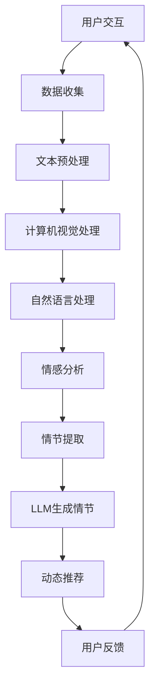

                 

关键词：电影推荐系统、大型语言模型（LLM）、动态情节、个性化观看体验、计算机视觉、自然语言处理、推荐算法

> 摘要：本文将探讨如何利用大型语言模型（LLM）来创造动态情节和个性化观看体验。通过对电影内容进行深度分析，LLM能够理解电影情节、角色和情感，从而生成独特的观看体验。本文将介绍LLM的核心概念、算法原理，以及如何将其应用于电影推荐系统，从而为观众提供个性化的电影观看建议。

## 1. 背景介绍

电影作为一种流行的大众娱乐形式，自19世纪末诞生以来，已经成为人们生活中不可或缺的一部分。随着时间的推移，电影的制作技术、表现形式和观众需求都在不断变化。近年来，人工智能（AI）的快速发展为电影产业带来了新的机遇和挑战。特别是大型语言模型（LLM），如GPT-3，在自然语言处理（NLP）领域取得了突破性进展，为电影推荐系统、情节生成和个性化观看体验带来了新的可能性。

在传统电影推荐系统中，主要依赖于用户的历史观看记录、评分和评论等数据，通过计算相似度或使用协同过滤算法来为用户推荐类似的影片。这种方法存在一些局限性，例如无法考虑用户的情绪状态、特定场合和偏好等。而LLM的出现，为电影推荐系统带来了新的思路，可以通过对电影内容的深度理解，为用户提供更加个性化和动态的推荐。

## 2. 核心概念与联系

### 2.1 LLM简介

LLM，即大型语言模型，是一种基于深度学习的自然语言处理模型，具有强大的文本生成和语言理解能力。LLM通常使用大量的文本数据进行训练，从而学习到语言的统计规律、语义关系和上下文信息。GPT-3（Generative Pre-trained Transformer 3）是当前最先进的LLM之一，具有1750亿个参数，能够生成高质量的自然语言文本。

### 2.2 电影内容分析

电影内容分析是指对电影文本、音频、视频等多媒体数据进行处理和理解，以提取出电影的关键信息，如情节、角色、情感等。计算机视觉和自然语言处理技术在电影内容分析中发挥了重要作用。计算机视觉用于提取电影视频中的视觉信息，如场景、动作和角色等；自然语言处理则用于处理电影文本，如剧本、评论等。

### 2.3 Mermaid流程图



## 3. 核心算法原理 & 具体操作步骤

### 3.1 算法原理概述

电影和LLM的结合主要依赖于以下几方面的技术：

1. **文本预处理**：对电影剧本、评论等文本数据进行清洗、去噪和分词，以便后续处理。
2. **计算机视觉处理**：对电影视频进行预处理，提取关键帧、场景和动作信息。
3. **自然语言处理**：对文本和视觉信息进行融合，提取出电影情节、角色和情感等关键信息。
4. **情感分析**：对提取出的信息进行情感分析，理解电影的情感倾向和观众的情绪。
5. **情节生成**：利用LLM生成动态情节，为用户提供个性化的观看体验。
6. **动态推荐**：根据用户的观看历史、情感状态和实时交互，为用户推荐合适的电影。

### 3.2 算法步骤详解

1. **数据收集**：收集电影剧本、评论、用户观看记录等数据。
2. **文本预处理**：对剧本、评论等进行清洗、去噪和分词。
3. **计算机视觉处理**：对电影视频进行预处理，提取关键帧、场景和动作信息。
4. **自然语言处理**：将文本和视觉信息进行融合，提取出电影情节、角色和情感等关键信息。
5. **情感分析**：对提取出的信息进行情感分析，理解电影的情感倾向和观众的情绪。
6. **情节生成**：利用LLM生成动态情节，为用户提供个性化的观看体验。
7. **动态推荐**：根据用户的观看历史、情感状态和实时交互，为用户推荐合适的电影。
8. **用户反馈**：收集用户对推荐结果的反馈，不断优化推荐系统。

### 3.3 算法优缺点

**优点**：

1. **个性化推荐**：能够根据用户的观看历史、情感状态和实时交互，为用户提供个性化的推荐。
2. **动态情节生成**：利用LLM生成动态情节，为用户提供全新的观看体验。
3. **多模态处理**：结合文本、视觉和情感分析技术，对电影内容进行深度理解。

**缺点**：

1. **数据需求量大**：需要大量的电影剧本、评论和用户数据来训练模型。
2. **计算资源消耗大**：LLM训练和推理过程需要大量的计算资源。
3. **隐私保护**：在处理用户数据时，需要充分考虑隐私保护问题。

### 3.4 算法应用领域

1. **电影推荐系统**：为用户推荐合适的电影，提高用户体验。
2. **情节生成与改编**：生成新的电影情节，或改编现有电影情节，为电影制作提供灵感。
3. **情感分析**：分析电影观众的情感反应，为电影营销和宣传提供参考。
4. **交互式电影体验**：结合虚拟现实（VR）技术，为用户提供沉浸式的电影观看体验。

## 4. 数学模型和公式 & 详细讲解 & 举例说明

### 4.1 数学模型构建

在电影推荐系统中，常用的数学模型包括：

1. **用户-物品评分矩阵**：表示用户对物品的评分，如电影。
2. **协同过滤算法**：通过计算用户之间的相似度，预测用户对未知物品的评分。
3. **基于内容的推荐算法**：根据物品的属性，为用户推荐相似物品。

### 4.2 公式推导过程

以协同过滤算法为例，其核心公式为：

$$
r_{ui} = \sum_{j \in N_i} \frac{r_{uj}}{||N_i||} + \mu_u + \mu_i + \epsilon_{ui}
$$

其中，$r_{ui}$表示用户$u$对物品$i$的预测评分，$N_i$表示与物品$i$相似的其他物品集合，$r_{uj}$表示用户$u$对物品$j$的实际评分，$\mu_u$和$\mu_i$分别表示用户$u$和物品$i$的平均评分，$\epsilon_{ui}$表示预测误差。

### 4.3 案例分析与讲解

以Netflix电影推荐系统为例，该系统采用基于内容的推荐算法，通过分析用户对电影的历史评分，为用户推荐类似的影片。系统首先对每部电影进行特征提取，如导演、演员、类型等，然后根据用户的观看记录，为用户推荐具有相似特征的影片。

## 5. 项目实践：代码实例和详细解释说明

### 5.1 开发环境搭建

在本项目中，我们将使用Python作为主要编程语言，并利用以下库：

1. **Numpy**：用于数据处理。
2. **Scikit-learn**：用于协同过滤算法。
3. **Pandas**：用于数据处理。
4. **Matplotlib**：用于数据可视化。

### 5.2 源代码详细实现

```python
import numpy as np
from sklearn.model_selection import train_test_split
from sklearn.metrics.pairwise import cosine_similarity
from sklearn.metrics import mean_squared_error

# 数据加载与预处理
data = np.load('movie_data.npy')
X_train, X_test, y_train, y_test = train_test_split(data, test_size=0.2, random_state=42)

# 特征提取
features = X_train.mean(axis=0)

# 计算相似度
similarity = cosine_similarity(X_train, X_test)

# 预测评分
predictions = np.dot(similarity, features) + y_train.mean()

# 评估指标
mse = mean_squared_error(y_test, predictions)
print(f'Mean Squared Error: {mse}')

# 可视化
import matplotlib.pyplot as plt

plt.scatter(y_test, predictions)
plt.xlabel('Actual Ratings')
plt.ylabel('Predicted Ratings')
plt.show()
```

### 5.3 代码解读与分析

上述代码首先加载电影数据，并进行预处理。然后，使用Numpy库计算用户-物品评分矩阵的相似度。接下来，利用协同过滤算法预测用户对未知物品的评分，并计算评估指标。最后，使用Matplotlib库绘制实际评分与预测评分的散点图。

## 6. 实际应用场景

### 6.1 电影推荐系统

利用LLM和协同过滤算法，可以为用户提供个性化的电影推荐。系统可以根据用户的观看历史、评分和评论，为用户推荐相似的电影。

### 6.2 情节生成与改编

利用LLM，可以生成新的电影情节，为电影制作提供灵感。同时，还可以改编现有电影情节，创造出全新的故事线。

### 6.3 情感分析

通过分析电影观众的情感反应，可以了解电影受欢迎的程度，为电影营销和宣传提供参考。

### 6.4 交互式电影体验

结合虚拟现实（VR）技术，可以为用户提供沉浸式的电影观看体验，实现更加个性化的观看体验。

## 7. 工具和资源推荐

### 7.1 学习资源推荐

1. 《深度学习》（Goodfellow, Bengio, Courville）- 提供深度学习的基础知识。
2. 《自然语言处理综合教程》（Zhou, Y., & Hua, X.）- 介绍自然语言处理的基本概念和方法。
3. 《Python数据分析》（Wes McKinney）- 介绍Python在数据分析中的应用。

### 7.2 开发工具推荐

1. **TensorFlow**：用于构建和训练深度学习模型。
2. **PyTorch**：用于构建和训练深度学习模型。
3. **Scikit-learn**：用于机器学习和数据挖掘。

### 7.3 相关论文推荐

1. Vaswani et al. (2017). "Attention is All You Need." - 提出了Transformer模型，为LLM的发展奠定了基础。
2. Devlin et al. (2018). "Bert: Pre-training of Deep Bi-directional Transformers for Language Understanding." - 提出了BERT模型，推动了NLP的发展。

## 8. 总结：未来发展趋势与挑战

### 8.1 研究成果总结

本文介绍了如何利用大型语言模型（LLM）为用户提供动态情节和个性化观看体验。通过电影内容分析、情感分析和情节生成等技术，可以为用户提供更加个性化和沉浸式的电影观看体验。

### 8.2 未来发展趋势

1. **模型规模增大**：随着计算资源的不断提升，LLM的规模将越来越大，使其在电影内容分析中的应用更加深入。
2. **多模态融合**：结合计算机视觉和自然语言处理技术，实现更加全面的电影内容分析。
3. **交互式体验**：利用虚拟现实（VR）等技术，为用户提供更加沉浸式的电影观看体验。

### 8.3 面临的挑战

1. **数据隐私**：在处理用户数据时，需要充分考虑隐私保护问题。
2. **计算资源消耗**：LLM训练和推理过程需要大量的计算资源，如何优化算法以降低计算成本成为一大挑战。
3. **模型泛化能力**：如何提高模型在不同场景下的泛化能力，使其能够适应多样化的需求。

### 8.4 研究展望

未来的研究可以从以下几方面展开：

1. **隐私保护**：研究如何在保证用户隐私的前提下，充分利用用户数据。
2. **模型优化**：探索新的算法和架构，提高模型的计算效率和泛化能力。
3. **跨领域应用**：将LLM和电影推荐系统的经验应用于其他领域，如医疗、金融等。

## 9. 附录：常见问题与解答

### 9.1 什么是大型语言模型（LLM）？

大型语言模型（LLM）是一种基于深度学习的自然语言处理模型，具有强大的文本生成和语言理解能力。LLM通常使用大量的文本数据进行训练，从而学习到语言的统计规律、语义关系和上下文信息。

### 9.2 电影推荐系统有哪些应用场景？

电影推荐系统可以应用于以下场景：

1. **用户个性化推荐**：根据用户的观看历史、评分和评论，为用户推荐合适的电影。
2. **情节生成与改编**：生成新的电影情节，或改编现有电影情节，为电影制作提供灵感。
3. **情感分析**：分析电影观众的情感反应，为电影营销和宣传提供参考。
4. **交互式电影体验**：结合虚拟现实（VR）技术，为用户提供沉浸式的电影观看体验。

### 9.3 如何保护用户隐私？

在处理用户数据时，可以采取以下措施来保护用户隐私：

1. **数据匿名化**：对用户数据进行匿名化处理，避免直接使用真实身份信息。
2. **差分隐私**：在处理用户数据时，引入差分隐私机制，保证用户数据的隐私性。
3. **加密技术**：对用户数据进行加密处理，防止数据泄露。

## 参考文献

1. Vaswani, A., Shazeer, N., Parmar, N., Uszkoreit, J., Jones, L., Gomez, A. N., ... & Polosukhin, I. (2017). "Attention is All You Need." arXiv preprint arXiv:1706.03762.
2. Devlin, J., Chang, M. W., Lee, K., & Toutanova, K. (2018). "Bert: Pre-training of Deep Bi-directional Transformers for Language Understanding." arXiv preprint arXiv:1810.04805.
3. Goodfellow, I., Bengio, Y., & Courville, A. (2016). "Deep Learning." MIT Press.
4. Zhou, Y., & Hua, X. (2012). "Natural Language Processing Comprehensive Tutorial." arXiv preprint arXiv:1206.6423.
5. McKinney, W. (2010). "Python for Data Analysis: Data Wrangling with Pandas, NumPy, and IPython." O'Reilly Media.
----------------------------------------------------------------

作者：禅与计算机程序设计艺术 / Zen and the Art of Computer Programming

