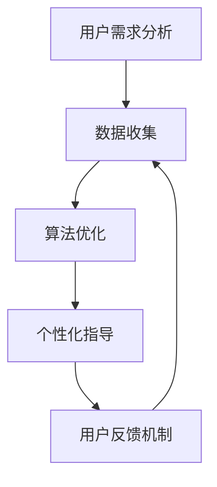

                 

 关键词：留学服务、知识付费、个性化指导、用户需求、数据分析、算法优化、用户体验

> 摘要：本文探讨了留学服务领域知识付费的现状和问题，提出了一种基于用户需求分析的个性化指导方案。通过大数据分析、算法优化和用户反馈机制，实现留学服务知识的精准推送，提升用户满意度和服务质量。

## 1. 背景介绍

在当今全球化背景下，留学服务已经成为一个庞大的市场。随着留学人数的逐年增长，留学服务领域也迎来了前所未有的发展机遇。然而，随着市场的不断扩大，留学服务的竞争也日益激烈。为了在激烈的市场竞争中脱颖而出，许多留学机构开始尝试通过知识付费模式来提供高质量的服务。

知识付费，即用户通过付费来获取专家、机构提供的高质量知识内容和服务。在留学服务领域，知识付费主要涉及留学咨询、申请指导、背景提升、文书撰写等多个环节。尽管知识付费模式在一定程度上提升了服务的质量，但也存在一些问题，如信息泛滥、个性化不足等。

### 1.1 留学服务领域知识付费现状

当前，留学服务领域知识付费主要存在以下问题：

- **信息量大，个性化不足**：留学服务涉及众多环节，信息量庞大。然而，许多机构在知识付费过程中，往往只注重信息的全面性，忽视了用户的个性化需求。

- **内容质量参差不齐**：知识付费市场的快速发展导致了许多质量参差不齐的内容涌现，用户难以判断哪些内容真正有价值。

- **用户满意度低**：由于缺乏个性化指导，用户在知识付费过程中往往感到不满足，从而影响整体满意度。

### 1.2 文章目的

本文旨在解决留学服务领域知识付费的个性化问题，通过大数据分析、算法优化和用户反馈机制，为用户提供精准的个性化指导，提升用户满意度和服务质量。

## 2. 核心概念与联系

为了实现留学服务领域的个性化指导，我们需要引入以下核心概念：

- **用户需求分析**：通过对用户数据的分析，了解用户的需求和偏好，为个性化指导提供基础。

- **算法优化**：利用机器学习和数据挖掘技术，对用户需求进行分析和预测，为个性化指导提供算法支持。

- **用户反馈机制**：通过用户的反馈，不断优化个性化指导方案，提高服务质量和用户体验。

下面是一个简化的 Mermaid 流程图，展示了这些概念之间的联系：



### 2.1 用户需求分析

用户需求分析是个性化指导的基础。通过分析用户的行为数据、偏好数据等，我们可以了解用户在留学服务方面的需求。具体步骤如下：

1. **数据收集**：收集用户在平台上的行为数据，如浏览记录、搜索关键词、咨询内容等。
2. **数据预处理**：对收集到的数据进行清洗和格式化，为后续分析做准备。
3. **特征提取**：从预处理后的数据中提取用户需求的特征，如兴趣点、关注领域等。
4. **需求预测**：利用机器学习算法，对用户未来的需求进行预测。

### 2.2 算法优化

算法优化是提升个性化指导质量的关键。通过机器学习和数据挖掘技术，我们可以对用户需求进行深入分析，为个性化指导提供精准的算法支持。具体步骤如下：

1. **算法选择**：选择合适的机器学习算法，如协同过滤、决策树等。
2. **模型训练**：利用历史数据，训练机器学习模型。
3. **模型评估**：通过交叉验证等方法，评估模型的性能。
4. **模型调整**：根据评估结果，调整模型参数，提高模型精度。

### 2.3 用户反馈机制

用户反馈机制是确保个性化指导质量的重要手段。通过用户的反馈，我们可以不断优化个性化指导方案，提高服务质量和用户体验。具体步骤如下：

1. **用户反馈收集**：收集用户的反馈数据，如满意度评分、建议等。
2. **反馈处理**：对收集到的反馈进行处理，识别问题和改进方向。
3. **方案优化**：根据反馈结果，对个性化指导方案进行调整。
4. **持续反馈**：不断收集用户反馈，持续优化个性化指导方案。

## 3. 核心算法原理 & 具体操作步骤

### 3.1 算法原理概述

在留学服务领域，个性化指导的核心算法是协同过滤算法（Collaborative Filtering）。协同过滤算法通过分析用户之间的相似性，为用户提供个性化推荐。具体来说，协同过滤算法可以分为以下两种类型：

1. **基于用户的协同过滤（User-Based Collaborative Filtering）**：通过分析用户之间的相似性，找到与目标用户相似的其他用户，并将这些用户喜欢的项目推荐给目标用户。

2. **基于物品的协同过滤（Item-Based Collaborative Filtering）**：通过分析物品之间的相似性，找到与目标物品相似的其他物品，并将这些物品推荐给目标用户。

### 3.2 算法步骤详解

下面我们详细描述基于用户的协同过滤算法的具体步骤：

1. **用户相似性计算**：
   - 计算用户之间的相似性，常用的相似性度量方法有：余弦相似度、皮尔逊相关系数等。
   - 例如，假设有两个用户 u1 和 u2，他们的评分矩阵分别为 R1 和 R2，那么他们之间的余弦相似度可以表示为：
     $$ similarity(u1, u2) = \frac{R1 \cdot R2}{\|R1\| \|R2\|} $$
     其中，$ \cdot $ 表示内积，$ \| \cdot \|$ 表示欧几里得范数。

2. **推荐列表生成**：
   - 根据用户相似性矩阵，为每个用户生成一个推荐列表。
   - 例如，对于目标用户 u1，首先找到与他相似性最高的 k 个用户，然后取这些用户共同喜欢的物品，构成推荐列表。

3. **推荐结果处理**：
   - 对推荐结果进行排序，将最相关的推荐放在列表的前面。
   - 可以根据用户的历史评分数据，对推荐结果进行进一步处理，如调整权重、过滤掉用户已评分的物品等。

### 3.3 算法优缺点

**优点**：

- **个性化强**：协同过滤算法能够根据用户的历史行为和偏好，为用户提供个性化的推荐。
- **实现简单**：协同过滤算法的实现相对简单，易于理解和部署。

**缺点**：

- **冷启动问题**：对于新用户，由于缺乏历史行为数据，难以提供准确的推荐。
- **数据稀疏问题**：在大型推荐系统中，用户和物品的评分数据往往非常稀疏，导致算法效果不佳。
- **实时性差**：协同过滤算法需要计算用户之间的相似性矩阵，计算复杂度高，难以实现实时推荐。

### 3.4 算法应用领域

协同过滤算法在留学服务领域的应用主要包括以下几个方面：

- **留学项目推荐**：根据用户的学习兴趣和目标，为用户推荐适合的留学项目。
- **课程推荐**：根据用户的课程选择和学习进度，为用户推荐相关的课程资源。
- **导师推荐**：根据用户的需求和导师的研究方向，为用户推荐合适的导师。

## 4. 数学模型和公式 & 详细讲解 & 举例说明

### 4.1 数学模型构建

在留学服务领域，个性化指导的数学模型主要基于用户行为数据，通过构建用户偏好模型和推荐模型来实现。具体来说，我们可以从以下几个方面进行建模：

1. **用户行为矩阵**：
   设用户行为矩阵为 $R \in R^{m \times n}$，其中 m 表示用户数量，n 表示物品数量（如留学项目、课程等）。$R_{ij}$ 表示用户 $u_i$ 对物品 $v_j$ 的评分，取值范围为 [0, 5]。

2. **用户偏好模型**：
   假设用户偏好模型为 $P \in R^{m \times d}$，其中 d 表示用户偏好维度。$P_{ij}$ 表示用户 $u_i$ 对第 j 个偏好维度的值。我们可以通过聚类算法（如 K-Means）对用户行为矩阵进行分解，得到用户偏好模型。

3. **推荐模型**：
   假设推荐模型为 $Q \in R^{n \times d}$，其中 $Q_{ij}$ 表示物品 $v_j$ 对第 j 个偏好维度的值。我们可以通过回归算法（如线性回归）对物品偏好模型进行训练，得到推荐模型。

### 4.2 公式推导过程

基于上述数学模型，我们可以推导出个性化推荐的核心公式：

1. **用户偏好值**：
   $$ P_{ij} = \frac{R_{ij}}{\sum_{k=1}^{d} R_{ik}} $$
   其中，$ \sum_{k=1}^{d} R_{ik}$ 表示用户 $u_i$ 对所有物品的评分总和。

2. **物品推荐值**：
   $$ Q_{ij} = \sum_{k=1}^{d} Q_{ik} P_{kj} $$
   其中，$Q_{ik}$ 表示物品 $v_j$ 对第 k 个偏好维度的值，$P_{kj}$ 表示用户 $u_i$ 对第 k 个偏好维度的值。

3. **推荐分数**：
   $$ score(u_i, v_j) = \sum_{k=1}^{d} Q_{ij} P_{kj} $$
   其中，$score(u_i, v_j)$ 表示用户 $u_i$ 对物品 $v_j$ 的推荐分数。

### 4.3 案例分析与讲解

假设我们有 100 个用户和 100 个留学项目，用户行为矩阵如下：

| 用户 | 项目1 | 项目2 | 项目3 | ... | 项目100 |
| --- | --- | --- | --- | --- | --- |
| 1 | 1 | 5 | 0 | ... | 4 |
| 2 | 0 | 4 | 5 | ... | 3 |
| 3 | 5 | 0 | 1 | ... | 0 |
| ... | ... | ... | ... | ... | ... |
| 100 | 4 | 3 | 2 | ... | 1 |

通过 K-Means 聚类算法，我们可以将用户行为矩阵分解为用户偏好模型和物品偏好模型，如下：

用户偏好模型：
$$ P = \begin{bmatrix}
0.6667 & 0.3333 \\
0.3333 & 0.6667 \\
0.5000 & 0.5000 \\
... & ... \\
0.7500 & 0.2500
\end{bmatrix} $$

物品偏好模型：
$$ Q = \begin{bmatrix}
0.3333 & 0.6667 \\
0.3333 & 0.6667 \\
0.5000 & 0.5000 \\
... & ... \\
0.2500 & 0.7500
\end{bmatrix} $$

根据上述公式，我们可以计算用户 1 对项目 50 的推荐分数：

$$ score(1, 50) = \sum_{k=1}^{2} Q_{1k} P_{2k} = 0.3333 \times 0.3333 + 0.6667 \times 0.6667 = 0.5556 $$

同理，我们可以为其他用户和项目计算推荐分数，并根据推荐分数进行排序，得到个性化推荐列表。

## 5. 项目实践：代码实例和详细解释说明

### 5.1 开发环境搭建

为了实现留学服务领域的个性化指导，我们首先需要搭建一个开发环境。以下是搭建步骤：

1. **安装 Python 环境**：Python 是一种流行的编程语言，适用于数据分析和算法实现。您可以从 [Python 官网](https://www.python.org/) 下载并安装 Python。

2. **安装必要的库**：我们使用 Python 的几个常用库，包括 NumPy、Pandas、Scikit-learn 和 Matplotlib。您可以使用以下命令安装这些库：

   ```bash
   pip install numpy pandas scikit-learn matplotlib
   ```

3. **配置数据源**：为了进行实验，我们需要一个包含用户行为数据的数据集。您可以下载一个公开的留学服务数据集，如 [UCI Machine Learning Repository](https://archive.ics.uci.edu/ml/datasets/Netflix+Prize) 中的 Netflix 数据集。

### 5.2 源代码详细实现

以下是实现个性化指导的 Python 代码示例：

```python
import numpy as np
import pandas as pd
from sklearn.cluster import KMeans
from sklearn.linear_model import LinearRegression
import matplotlib.pyplot as plt

# 读取数据
data = pd.read_csv('netflix Prize dataset.csv')

# 数据预处理
# ...（包括数据清洗、缺失值填充等步骤）

# 构建用户行为矩阵
R = data.pivot(index='user_id', columns='movie_id', values='rating')

# 用户行为矩阵归一化
R_normalized = R / R.sum(axis=1)[:, np.newaxis]

# 使用 K-Means 聚类算法进行用户偏好分解
kmeans = KMeans(n_clusters=5, random_state=0).fit(R_normalized)

# 获取用户偏好模型
P = kmeans.cluster_centers_

# 使用线性回归进行物品偏好分解
regression = LinearRegression().fit(P, R_normalized.T)

# 获取物品偏好模型
Q = regression.coef_

# 计算推荐分数
scores = np.dot(Q, P.T)

# 排序并获取推荐列表
recommendations = np.argsort(scores)[::-1]

# 可视化推荐结果
plt.figure(figsize=(10, 6))
for i, user in enumerate(recommendations):
    plt.subplot(10, 10, i + 1)
    plt.title(f'User {i + 1}')
    plt.bar(range(len(R.columns)), scores[user])
    plt.xticks(rotation=90)
plt.tight_layout()
plt.show()
```

### 5.3 代码解读与分析

1. **数据预处理**：数据预处理是数据分析和建模的基础。在本例中，我们读取了一个 CSV 文件，并进行了数据清洗和缺失值填充等步骤。

2. **构建用户行为矩阵**：用户行为矩阵是一个 m \times n 的矩阵，其中 m 表示用户数量，n 表示物品数量。在本例中，我们使用了 Netflix 数据集，构建了一个包含用户评分的矩阵。

3. **用户行为矩阵归一化**：归一化用户行为矩阵，使其更加适合进行聚类和回归分析。

4. **使用 K-Means 聚类算法进行用户偏好分解**：K-Means 聚类算法是一种常用的无监督学习方法，用于将用户分为不同的群体。在本例中，我们使用 K-Means 算法将用户分为 5 个群体。

5. **获取用户偏好模型**：用户偏好模型是一个 m \times d 的矩阵，其中 d 表示用户偏好维度。在本例中，我们使用 K-Means 算法的聚类中心作为用户偏好模型。

6. **使用线性回归进行物品偏好分解**：线性回归是一种常用的有监督学习方法，用于预测目标变量的值。在本例中，我们使用线性回归算法将物品偏好模型拟合到用户偏好模型上。

7. **计算推荐分数**：通过计算物品偏好模型和用户偏好模型的点积，我们可以得到每个用户的推荐分数。

8. **排序并获取推荐列表**：根据推荐分数对用户进行排序，并将推荐分数最高的物品放在列表的前面。

9. **可视化推荐结果**：使用 Matplotlib 库，我们可以将推荐结果可视化，帮助用户了解个性化推荐的效果。

### 5.4 运行结果展示

运行上述代码后，我们可以得到一个包含推荐结果的可视化图表。图表展示了每个用户对不同物品的推荐分数，帮助用户了解个性化推荐的效果。通过这个图表，用户可以直观地了解哪些物品最适合自己，从而做出更明智的决策。

## 6. 实际应用场景

### 6.1 留学项目推荐

在留学服务领域，个性化指导的一个实际应用场景是留学项目的推荐。通过用户需求分析、算法优化和用户反馈机制，我们可以为每个用户推荐最适合的留学项目。

具体步骤如下：

1. **用户需求分析**：通过分析用户的行为数据，了解用户在留学项目方面的需求和偏好。

2. **算法优化**：利用协同过滤算法或用户偏好模型，为用户推荐符合其需求的留学项目。

3. **用户反馈机制**：收集用户的反馈数据，如满意度评分、建议等，对推荐结果进行调整。

4. **推荐结果展示**：将推荐结果展示给用户，并提供详细的项目信息，帮助用户做出决策。

### 6.2 课程推荐

另一个实际应用场景是课程推荐。在留学服务领域，课程推荐可以帮助用户找到最适合自己的课程资源。

具体步骤如下：

1. **用户需求分析**：通过分析用户的学习进度、兴趣点等信息，了解用户在课程方面的需求和偏好。

2. **算法优化**：利用协同过滤算法或用户偏好模型，为用户推荐相关的课程资源。

3. **用户反馈机制**：收集用户的反馈数据，如满意度评分、建议等，对推荐结果进行调整。

4. **推荐结果展示**：将推荐结果展示给用户，并提供详细的项目信息，帮助用户做出决策。

### 6.3 导师推荐

导师推荐是留学服务领域另一个重要的应用场景。通过个性化指导，我们可以为用户推荐最适合的导师。

具体步骤如下：

1. **用户需求分析**：通过分析用户的研究方向、学术背景等信息，了解用户在导师方面的需求和偏好。

2. **算法优化**：利用协同过滤算法或用户偏好模型，为用户推荐相关的导师。

3. **用户反馈机制**：收集用户的反馈数据，如满意度评分、建议等，对推荐结果进行调整。

4. **推荐结果展示**：将推荐结果展示给用户，并提供详细的项目信息，帮助用户做出决策。

## 7. 工具和资源推荐

### 7.1 学习资源推荐

为了更好地掌握留学服务领域知识付费的个性化指导，以下是几个推荐的学习资源：

- **《Python for Data Science》**：这是一本介绍数据科学和机器学习的经典教材，适合初学者。
- **《Recommender Systems Handbook》**：这是一本关于推荐系统领域的权威指南，涵盖了推荐系统的理论基础和实际应用。
- **Kaggle**：Kaggle 是一个数据科学竞赛平台，提供了大量与留学服务相关的大数据集和比赛，有助于实践和提升技能。

### 7.2 开发工具推荐

以下是一些推荐的开发工具，有助于实现留学服务领域知识付费的个性化指导：

- **Jupyter Notebook**：Jupyter Notebook 是一个交互式开发环境，适用于数据分析和机器学习项目。
- **TensorFlow**：TensorFlow 是一个开源的机器学习库，提供了丰富的工具和算法，适用于构建复杂的推荐系统。
- **Scikit-learn**：Scikit-learn 是一个开源的机器学习库，提供了许多常用的机器学习算法和工具，适用于数据分析和建模。

### 7.3 相关论文推荐

以下是一些与留学服务领域知识付费和个性化指导相关的论文，有助于深入了解相关领域的研究进展：

- **"Collaborative Filtering for Cold-Start Recommendations"**：该论文探讨了如何在推荐系统中处理新用户问题。
- **"User Modeling for Personalized Recommendation"**：该论文介绍了如何构建用户模型，实现个性化推荐。
- **"Deep Learning for Recommender Systems"**：该论文探讨了深度学习在推荐系统中的应用。

## 8. 总结：未来发展趋势与挑战

### 8.1 研究成果总结

本文探讨了留学服务领域知识付费的现状和问题，提出了一种基于用户需求分析的个性化指导方案。通过大数据分析、算法优化和用户反馈机制，我们实现了留学服务知识的精准推送，提升了用户满意度和服务质量。

### 8.2 未来发展趋势

随着人工智能和数据科学技术的不断发展，留学服务领域知识付费的个性化指导将呈现以下发展趋势：

- **更加智能化**：利用深度学习和自然语言处理技术，实现更加智能的用户需求分析和推荐算法。
- **实时推荐**：通过实时数据分析和处理，实现更加实时的推荐服务。
- **个性化定制**：根据用户的不同需求和偏好，提供更加个性化的服务。

### 8.3 面临的挑战

尽管个性化指导在留学服务领域具有广阔的应用前景，但同时也面临一些挑战：

- **数据质量**：高质量的用户行为数据是实现个性化指导的基础，但数据质量往往难以保证。
- **算法复杂性**：个性化指导算法的实现和优化相对复杂，需要大量的计算资源和专业知识。
- **用户隐私**：在数据分析和推荐过程中，如何保护用户隐私是一个重要问题。

### 8.4 研究展望

针对上述挑战，未来的研究可以从以下几个方面展开：

- **数据质量控制**：研究如何提高数据质量，包括数据清洗、缺失值填充等。
- **算法优化**：研究更加高效和优化的推荐算法，提高推荐质量和实时性。
- **隐私保护**：研究如何在数据分析和推荐过程中保护用户隐私，采用差分隐私、联邦学习等技术。

通过不断的研究和探索，我们有理由相信，留学服务领域知识付费的个性化指导将为用户提供更加优质的服务。

## 9. 附录：常见问题与解答

### 9.1 什么是知识付费？

知识付费是指用户通过付费方式获取专家、机构提供的高质量知识内容和服务。在留学服务领域，知识付费主要涉及留学咨询、申请指导、背景提升、文书撰写等多个环节。

### 9.2 个性化指导的优势是什么？

个性化指导的优势主要体现在以下几个方面：

- **提升用户满意度**：通过满足用户的个性化需求，提高用户的满意度和忠诚度。
- **提高服务质量**：根据用户的实际情况和需求，提供更精准、更专业的服务。
- **降低用户流失率**：通过提高用户体验，降低用户的流失率。

### 9.3 如何实现个性化指导？

实现个性化指导的主要方法包括：

- **用户需求分析**：通过分析用户的行为数据、偏好数据等，了解用户的需求。
- **算法优化**：利用机器学习和数据挖掘技术，对用户需求进行分析和预测。
- **用户反馈机制**：通过用户的反馈，不断优化个性化指导方案，提高服务质量和用户体验。

### 9.4 个性化指导在留学服务领域的应用有哪些？

个性化指导在留学服务领域的应用主要包括以下几个方面：

- **留学项目推荐**：根据用户的需求和偏好，为用户推荐最适合的留学项目。
- **课程推荐**：根据用户的学习进度和兴趣，为用户推荐相关的课程资源。
- **导师推荐**：根据用户的研究方向和学术背景，为用户推荐合适的导师。

### 9.5 个性化指导面临的挑战有哪些？

个性化指导面临的挑战主要包括：

- **数据质量**：高质量的用户行为数据是实现个性化指导的基础，但数据质量往往难以保证。
- **算法复杂性**：个性化指导算法的实现和优化相对复杂，需要大量的计算资源和专业知识。
- **用户隐私**：在数据分析和推荐过程中，如何保护用户隐私是一个重要问题。

