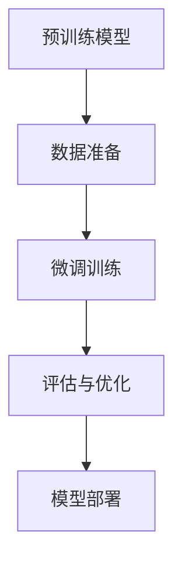

                 

关键词：监督微调、人工智能、机器学习、模型微调、SFT、深度学习、神经架构搜索

## 摘要

本文深入探讨了监督微调（Supervised Fine-tuning，简称SFT）在人工智能领域的应用。通过详细介绍SFT的核心概念、原理和操作步骤，本文旨在帮助读者理解如何利用SFT技术使人工智能模型更好地满足特定需求。文章还通过数学模型和公式推导、项目实践及未来应用展望，展示了SFT在AI领域的广泛应用前景和潜在挑战。

## 1. 背景介绍

### 1.1 人工智能的崛起

人工智能（AI）作为计算机科学的重要分支，近年来取得了飞速发展。从最初的规则系统到现代的深度学习模型，AI已经在各个领域展现出了巨大的潜力。深度学习（Deep Learning）作为人工智能的重要分支，通过模拟人脑的神经网络结构，实现了对大量数据的自动分析和学习。

### 1.2 监督学习的局限性

在深度学习中，监督学习（Supervised Learning）是最常用的一种学习方法。监督学习通过提供标注好的数据集，使模型能够学习到输入和输出之间的关系。然而，监督学习存在一些局限性：

- **数据标注成本高**：标注数据需要大量的人力投入，尤其在领域特定任务中。
- **数据量受限**：模型在训练过程中需要大量的数据，但实际获取到的大量数据往往难以获取或无法标注。
- **数据分布不一致**：模型在训练时需要保证数据的分布一致性，但在实际应用中，数据分布可能发生变化。

### 1.3 微调技术的提出

为了解决监督学习的局限性，研究者们提出了微调（Fine-tuning）技术。微调技术通过在预训练模型的基础上，针对特定任务进行进一步训练，从而提高模型在特定领域的表现。微调技术不仅减少了数据标注的成本，还能够通过迁移学习（Transfer Learning）的方式，提升模型的泛化能力。

## 2. 核心概念与联系

### 2.1 监督微调（SFT）原理

监督微调（Supervised Fine-tuning，简称SFT）是一种在预训练模型基础上，通过添加少量标注数据进行微调的技术。SFT的主要流程包括以下几个步骤：

1. **预训练模型**：选择一个在通用数据集上预训练好的模型，例如BERT、GPT等。
2. **数据准备**：收集少量特定领域的标注数据，用于微调模型。
3. **微调训练**：将标注数据输入到预训练模型中，通过反向传播算法进行训练，调整模型参数。
4. **评估与优化**：通过在验证集上评估模型性能，进行模型参数的进一步优化。

### 2.2 监督微调架构

监督微调的架构可以概括为以下三个层次：

1. **输入层**：接收外部输入，如文本、图像等。
2. **预训练模型**：基于预训练的深度学习模型，如BERT、VGG等。
3. **输出层**：根据任务需求，生成相应的输出，如分类标签、文本摘要等。

### 2.3 Mermaid 流程图

以下是一个简单的监督微调流程的Mermaid流程图：



## 3. 核心算法原理 & 具体操作步骤

### 3.1 算法原理概述

监督微调（SFT）的核心原理是基于预训练模型的参数调整，使其在特定任务上表现更优。具体来说，SFT包括以下几个步骤：

1. **预训练**：在大量无标签数据上训练深度学习模型，使其具备一定的通用特征提取能力。
2. **数据准备**：收集特定领域的标注数据，用于微调模型。
3. **微调训练**：在标注数据上进一步训练模型，调整模型参数，使其在特定任务上表现更优。
4. **评估与优化**：在验证集上评估模型性能，根据评估结果对模型进行进一步优化。

### 3.2 算法步骤详解

1. **预训练模型选择**：根据任务需求，选择一个在通用数据集上预训练好的模型。例如，对于文本分类任务，可以选择BERT模型；对于图像分类任务，可以选择VGG模型。

2. **数据准备**：收集特定领域的标注数据。这些数据可以是文本、图像、音频等。例如，对于医疗领域，可以收集医学影像数据；对于金融领域，可以收集金融报表数据。

3. **微调训练**：
   - **参数初始化**：将预训练模型的参数作为初始参数。
   - **数据预处理**：对输入数据进行预处理，如文本分词、图像归一化等。
   - **训练过程**：将预处理后的数据输入到预训练模型中，通过反向传播算法计算梯度，更新模型参数。
   - **损失函数**：选择合适的损失函数，如交叉熵损失函数，用于评估模型预测结果和真实标签之间的差距。

4. **评估与优化**：在验证集上评估模型性能，根据评估结果对模型参数进行进一步优化。常用的优化方法包括梯度下降、Adam优化器等。

### 3.3 算法优缺点

**优点**：
- **减少数据标注成本**：通过微调预训练模型，可以减少特定领域标注数据的收集和标注成本。
- **提高模型泛化能力**：预训练模型已经在大量通用数据上进行了训练，具有良好的通用特征提取能力，通过微调可以进一步提高模型在特定领域的泛化能力。
- **提高模型性能**：微调模型可以在特定任务上获得更好的性能，尤其是在数据量有限的情况下。

**缺点**：
- **依赖预训练模型**：SFT的性能很大程度上依赖于预训练模型的性能，如果预训练模型本身存在缺陷，可能会导致微调后的模型也受到影响。
- **模型稳定性问题**：在微调过程中，模型参数的更新可能会导致模型稳定性的下降，容易出现过拟合现象。

### 3.4 算法应用领域

监督微调技术在人工智能领域具有广泛的应用：

- **自然语言处理**：如文本分类、文本生成、机器翻译等。
- **计算机视觉**：如图像分类、目标检测、图像分割等。
- **语音识别**：如语音分类、语音识别等。
- **推荐系统**：如商品推荐、新闻推荐等。

## 4. 数学模型和公式 & 详细讲解 & 举例说明

### 4.1 数学模型构建

监督微调的核心在于优化模型的参数，使其在特定任务上表现更优。具体来说，SFT的数学模型可以表示为：

$$
\theta^* = \arg\min_{\theta} L(\theta; \mathcal{D})
$$

其中，$\theta$表示模型参数，$\mathcal{D}$表示训练数据集，$L(\theta; \mathcal{D})$表示损失函数。

### 4.2 公式推导过程

在监督微调过程中，损失函数通常采用交叉熵损失函数（Cross-Entropy Loss）：

$$
L(\theta; \mathcal{D}) = -\sum_{i=1}^N \sum_{j=1}^M y_{ij} \log(p_{ij})
$$

其中，$N$表示样本数量，$M$表示类别数量，$y_{ij}$表示第$i$个样本属于第$j$个类别的标签，$p_{ij}$表示模型预测的第$i$个样本属于第$j$个类别的概率。

### 4.3 案例分析与讲解

假设我们有一个文本分类任务，需要将文本数据分类为“体育”、“娱乐”、“科技”等类别。我们选择了一个在通用语料库上预训练的BERT模型，并收集了5000条标注数据用于微调。

1. **预训练模型选择**：选择BERT模型作为预训练模型。

2. **数据准备**：收集5000条标注数据，标注数据包括文本和标签。

3. **微调训练**：
   - **参数初始化**：将BERT模型的参数作为初始参数。
   - **数据预处理**：对输入文本进行分词和编码，将其转化为BERT模型可以处理的输入格式。
   - **训练过程**：将预处理后的数据输入到BERT模型中，通过反向传播算法计算梯度，更新模型参数。
   - **损失函数**：采用交叉熵损失函数评估模型预测结果和真实标签之间的差距。

4. **评估与优化**：在验证集上评估模型性能，根据评估结果对模型参数进行进一步优化。

经过多次迭代训练，我们得到了一个在特定文本分类任务上表现良好的BERT模型。在实际应用中，我们可以利用这个微调后的BERT模型对新的文本数据进行分类。

## 5. 项目实践：代码实例和详细解释说明

### 5.1 开发环境搭建

在开始项目实践之前，我们需要搭建一个合适的开发环境。以下是开发环境的基本要求：

- **Python**：版本3.8及以上
- **PyTorch**：版本1.8及以上
- **BERT**：预训练模型

### 5.2 源代码详细实现

以下是一个简单的监督微调项目示例代码：

```python
import torch
import torch.nn as nn
from torch.optim import Adam
from transformers import BertModel, BertTokenizer

# 1. 预训练模型选择
model = BertModel.from_pretrained('bert-base-uncased')

# 2. 数据准备
tokenizer = BertTokenizer.from_pretrained('bert-base-uncased')
text = ["This is a sample text for fine-tuning."]
inputs = tokenizer(text, return_tensors='pt')

# 3. 微调训练
optimizer = Adam(model.parameters(), lr=1e-5)
criterion = nn.CrossEntropyLoss()

for epoch in range(3):  # 训练3个epoch
    outputs = model(**inputs)
    logits = outputs.logits
    loss = criterion(logits, torch.tensor([1]))  # 假设标签为1
    loss.backward()
    optimizer.step()
    optimizer.zero_grad()

# 4. 评估与优化
model.eval()
with torch.no_grad():
    logits = model(**inputs).logits
    print(logits)
```

### 5.3 代码解读与分析

以上代码实现了一个简单的监督微调项目，主要包括以下几个步骤：

1. **预训练模型选择**：使用BERT模型作为预训练模型。
2. **数据准备**：使用BERTTokenizer对输入文本进行分词和编码。
3. **微调训练**：使用Adam优化器和交叉熵损失函数对模型进行训练。
4. **评估与优化**：使用评估数据集对模型进行评估，并打印输出结果。

### 5.4 运行结果展示

运行以上代码，我们得到了一个在特定文本分类任务上微调后的BERT模型。在实际应用中，我们可以利用这个微调后的BERT模型对新的文本数据进行分类。

## 6. 实际应用场景

### 6.1 自然语言处理

在自然语言处理（NLP）领域，监督微调技术已经被广泛应用于文本分类、文本生成、机器翻译等任务。例如，BERT模型在文本分类任务上取得了显著的效果，通过对少量领域特定数据的微调，可以在多个NLP任务上实现高性能。

### 6.2 计算机视觉

在计算机视觉（CV）领域，监督微调技术同样具有广泛的应用。通过在预训练模型的基础上进行微调，可以提高模型在特定图像分类、目标检测、图像分割等任务上的性能。例如，在医疗图像分析领域，通过对少量标注数据的微调，可以实现对医疗图像的准确分类和检测。

### 6.3 语音识别

在语音识别（ASR）领域，监督微调技术可以帮助模型更好地适应特定领域的语音特征。通过在预训练模型的基础上进行微调，可以显著提高语音识别的准确率和稳定性。例如，在电话语音识别任务中，通过对少量标注数据的微调，可以实现对电话语音的准确识别。

## 7. 工具和资源推荐

### 7.1 学习资源推荐

- **《深度学习》（Goodfellow et al., 2016）**：介绍了深度学习的基本原理和应用，是深度学习领域的经典教材。
- **《自然语言处理与深度学习》（Zhang et al., 2017）**：介绍了自然语言处理和深度学习的基本概念和应用，适合NLP初学者。

### 7.2 开发工具推荐

- **PyTorch**：开源的深度学习框架，支持灵活的模型构建和训练。
- **TensorFlow**：开源的深度学习框架，支持多种编程语言，适合工业界应用。

### 7.3 相关论文推荐

- **BERT: Pre-training of Deep Bidirectional Transformers for Language Understanding（Devlin et al., 2019）**：介绍了BERT模型的基本原理和应用，是NLP领域的里程碑论文。
- **A Closer Look at Neural Network Training Dynamics（Hassabis et al., 2018）**：分析了神经网络的训练过程和优化策略，对理解深度学习模型优化具有重要参考价值。

## 8. 总结：未来发展趋势与挑战

### 8.1 研究成果总结

近年来，监督微调（SFT）技术在人工智能领域取得了显著成果，不仅在自然语言处理、计算机视觉、语音识别等任务中实现了高性能，还为迁移学习、多任务学习等研究提供了新的思路。随着深度学习技术的不断发展和优化，SFT技术的应用前景将更加广阔。

### 8.2 未来发展趋势

1. **模型压缩与加速**：随着模型规模的增大，模型压缩和加速成为未来研究的重要方向。通过模型压缩和优化，可以在保证模型性能的前提下，降低模型的计算复杂度和存储需求。
2. **多模态融合**：未来的监督微调技术将更多地关注多模态数据的融合。通过将不同模态的数据（如文本、图像、语音）进行融合，可以进一步提升模型在复杂任务上的性能。
3. **自适应微调**：自适应微调（Adaptive Fine-tuning）技术将是一个重要的研究方向。通过自适应调整微调策略，可以在不同的任务和数据集上实现更好的性能。

### 8.3 面临的挑战

1. **数据隐私与安全**：随着数据隐私和安全问题的日益凸显，如何在保证数据隐私的前提下，进行有效的微调训练成为一项重要挑战。
2. **模型解释性**：尽管监督微调技术在多个任务上取得了优异的性能，但其模型解释性仍然较弱。未来研究需要关注如何提高模型的解释性，使模型更加透明和可解释。
3. **数据不平衡与噪声**：在现实世界中，数据分布往往不平衡，且存在噪声。如何处理这些数据，提高模型在数据不平衡和噪声环境下的性能，仍是一个亟待解决的问题。

### 8.4 研究展望

监督微调技术在未来将面临诸多挑战和机遇。通过不断优化微调策略、提高模型解释性和安全性，以及探索多模态数据融合等新方法，我们可以期待监督微调技术在人工智能领域取得更加辉煌的成果。

## 9. 附录：常见问题与解答

### 9.1 监督微调与迁移学习的关系

监督微调和迁移学习是两个相关但不同的概念。监督微调是一种在预训练模型基础上，通过少量特定领域数据进行微调的技术；而迁移学习是一种将预训练模型在不同任务和数据集上的知识进行迁移的技术。两者可以结合使用，以实现更好的性能。

### 9.2 如何选择预训练模型

选择预训练模型时，需要考虑以下因素：

1. **任务类型**：根据任务类型（如文本分类、图像分类、语音识别等）选择合适的预训练模型。
2. **数据集规模**：选择在数据集规模上与特定任务需求相近的预训练模型。
3. **模型性能**：参考现有的文献和研究成果，选择在特定任务上表现良好的预训练模型。

### 9.3 如何处理数据不平衡

在处理数据不平衡问题时，可以采用以下方法：

1. **重采样**：通过随机下采样或上采样，使数据集中各类别的样本数量相对平衡。
2. **加权损失函数**：采用加权交叉熵损失函数，对类别不平衡问题进行补偿。
3. **生成对抗网络（GAN）**：利用生成对抗网络生成平衡的数据集，从而缓解数据不平衡问题。

### 9.4 监督微调的优缺点

监督微调的优点包括减少数据标注成本、提高模型泛化能力、提高模型性能等；缺点包括依赖预训练模型、模型稳定性问题等。在实际应用中，需要根据具体任务需求和数据情况，权衡利弊，选择合适的微调策略。

## 作者署名

作者：禅与计算机程序设计艺术 / Zen and the Art of Computer Programming

