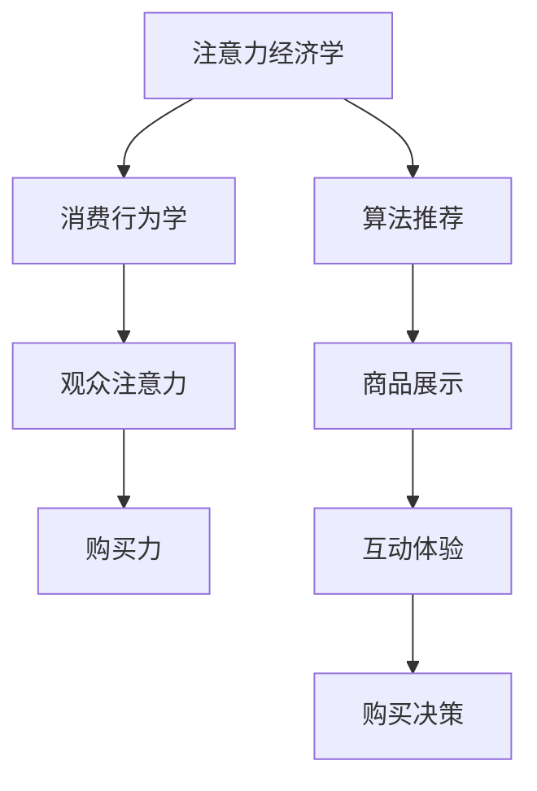

                 

关键词：直播带货、注意力经济学、购买行为、算法推荐、用户体验、数据驱动

> 摘要：随着互联网技术的飞速发展，直播带货成为当下最受欢迎的电商形式之一。本文从注意力经济学的角度出发，探讨了直播带货的核心机制——注意力与购买力的结合。通过对核心概念的阐述、算法原理的解析、数学模型的构建以及实际应用案例的分析，本文旨在为直播带货行业提供理论支持和实践指导。

## 1. 背景介绍

在过去的几年里，直播带货作为一种新型的电商模式，以其独特的互动性和实时性，迅速在全球范围内流行开来。与传统电商相比，直播带货不仅提供了更直观、更生动的购物体验，还通过主播与观众的实时互动，增强了消费者的参与感和购买意愿。

### 1.1 直播带货的兴起

直播带货的兴起可以追溯到2016年，当年淘宝直播正式上线，开启了电商直播的先河。随后，各大电商平台纷纷加入直播带货的行列，形成了直播带货的黄金时代。截至2021年，中国直播电商市场规模已经超过1万亿元，占整体电商市场的比例逐年上升。

### 1.2 直播带货的优势

直播带货相较于传统电商具有以下几大优势：

- **互动性强**：主播与观众实时互动，能够更好地吸引观众的注意力，增强购买意愿。
- **商品展示直观**：直播中的商品展示更加生动、真实，有助于消费者做出购买决策。
- **购物体验丰富**：消费者可以在直播过程中了解商品的详细信息，甚至可以参与直播间的抽奖、秒杀等活动，增加购物乐趣。

### 1.3 直播带货的核心机制

直播带货的核心机制在于将注意力与购买力相结合。主播通过内容创作和互动策略，吸引观众的注意力，进而转化为购买力。因此，理解注意力经济学在直播带货中的应用，对于提升直播带货的效果具有重要意义。

## 2. 核心概念与联系

为了更好地理解直播带货中的注意力与购买力结合机制，我们需要从注意力经济学和消费行为学的基本概念入手，并通过Mermaid流程图来展示核心概念之间的联系。

### 2.1 注意力经济学

注意力经济学是一种研究人们如何分配注意力的经济理论。在直播带货中，注意力资源被视为一种稀缺资源，主播需要通过各种手段来吸引和保持观众的注意力。

### 2.2 消费行为学

消费行为学研究消费者在购买过程中的心理和行为。直播带货通过提供实时互动和个性化的购物体验，影响了消费者的购买决策。

### 2.3 Mermaid流程图



在这个流程图中，注意力经济学和消费行为学共同作用于观众的注意力，通过算法推荐、商品展示和互动体验，最终影响观众的购买决策。

## 3. 核心算法原理 & 具体操作步骤

### 3.1 算法原理概述

直播带货中的核心算法原理主要包括推荐算法、用户行为分析和实时互动策略。这些算法共同作用，帮助主播和电商平台吸引和保持观众的注意力，提高购买力。

### 3.2 算法步骤详解

#### 3.2.1 推荐算法

推荐算法是直播带货的核心之一。它通过分析用户的历史购买记录、浏览行为和兴趣爱好，为用户推荐合适的商品。具体步骤如下：

1. **用户数据收集**：收集用户在平台上的行为数据，包括购买记录、浏览历史和互动行为。
2. **特征提取**：对用户数据进行特征提取，如用户偏好、购买频率和购买时间段等。
3. **模型训练**：使用机器学习算法，如协同过滤、基于内容的推荐等，对用户数据进行训练，构建推荐模型。
4. **推荐生成**：根据训练好的模型，为用户生成个性化的商品推荐。

#### 3.2.2 用户行为分析

用户行为分析是了解观众注意力的重要手段。通过分析观众的观看时长、点赞、评论和购买行为，主播可以了解观众的兴趣和需求，调整直播内容和互动策略。具体步骤如下：

1. **数据采集**：收集观众的观看时长、互动行为和购买记录等数据。
2. **行为模式识别**：使用统计方法和机器学习算法，识别观众的行为模式，如观看高峰期、互动偏好和购买决策链。
3. **行为分析**：基于分析结果，为主播提供优化直播内容和互动策略的建议。

#### 3.2.3 实时互动策略

实时互动策略是直播带货中提高观众注意力和购买力的重要手段。通过实时互动，主播可以与观众建立更紧密的联系，提高观众的参与感和购买意愿。具体步骤如下：

1. **互动内容设计**：根据观众的行为分析和兴趣偏好，设计互动内容，如抽奖、秒杀、互动问答等。
2. **实时互动执行**：在直播过程中，实时执行互动内容，与观众互动。
3. **效果评估**：评估互动效果，根据观众反馈调整互动策略。

### 3.3 算法优缺点

#### 优点

- **个性化推荐**：推荐算法能够为用户推荐个性化的商品，提高购买转化率。
- **实时互动**：实时互动策略能够增强观众的参与感和购买意愿。
- **数据分析**：用户行为分析能够帮助主播了解观众需求，优化直播内容。

#### 缺点

- **数据隐私**：用户数据收集和分析可能涉及用户隐私问题。
- **算法偏差**：推荐算法可能存在偏见，导致用户陷入信息茧房。
- **技术门槛**：实现推荐算法和用户行为分析需要较高的技术门槛。

### 3.4 算法应用领域

直播带货中的推荐算法和用户行为分析算法广泛应用于多个领域：

- **电商直播**：直播带货是主要应用场景，通过个性化推荐和实时互动策略，提高购买转化率。
- **社交媒体**：社交媒体平台通过用户行为分析，为用户提供个性化内容推荐。
- **在线教育**：在线教育平台通过用户行为分析，为用户提供个性化学习路径推荐。

## 4. 数学模型和公式 & 详细讲解 & 举例说明

### 4.1 数学模型构建

直播带货中的数学模型主要涉及推荐算法和用户行为分析。以下是一个简单的推荐算法的数学模型：

#### 推荐算法模型

$$
\text{推荐分数} = w_1 \cdot \text{商品相似度} + w_2 \cdot \text{用户兴趣度} + w_3 \cdot \text{用户购买频率}
$$

其中，$w_1, w_2, w_3$ 分别为商品相似度、用户兴趣度和用户购买频率的权重。

#### 用户行为分析模型

$$
\text{用户行为得分} = \sum_{i=1}^{n} (\text{行为权重} \cdot \text{行为频率})
$$

其中，$n$ 为用户的行为种类，$\text{行为权重}$ 和 $\text{行为频率}$ 分别表示每种行为的权重和频率。

### 4.2 公式推导过程

#### 推荐算法模型推导

假设用户 $U$ 对商品 $I$ 的兴趣度可以用向量 $\textbf{u}$ 表示，商品 $I$ 的特征向量用 $\textbf{i}$ 表示。则商品 $I$ 对用户 $U$ 的相似度可以表示为：

$$
\text{相似度} = \text{cosine(\textbf{u}, \textbf{i})}
$$

其中，$\text{cosine}$ 函数表示余弦相似度。

用户 $U$ 对商品 $I$ 的购买概率可以表示为：

$$
P(U, I) = \frac{\exp(\text{相似度})}{1 + \exp(\text{相似度})}
$$

为了构建推荐分数，我们将购买概率进行加权：

$$
\text{推荐分数} = w_1 \cdot \text{相似度} + w_2 \cdot \text{用户兴趣度} + w_3 \cdot \text{用户购买频率}
$$

#### 用户行为分析模型推导

假设用户 $U$ 有 $n$ 种行为，每种行为的权重为 $w_i$，行为频率为 $f_i$。则用户行为得分可以表示为：

$$
\text{用户行为得分} = \sum_{i=1}^{n} (w_i \cdot f_i)
$$

### 4.3 案例分析与讲解

#### 案例背景

某电商平台希望通过推荐算法为用户推荐商品。用户 $U$ 的兴趣度为 $\textbf{u} = [0.7, 0.3, 0.5]$，商品 $I$ 的特征向量为 $\textbf{i} = [0.6, 0.4, 0.6]$。用户 $U$ 的购买频率为 $f = [3, 1, 2]$。

#### 案例分析

1. **计算商品相似度**：

$$
\text{相似度} = \text{cosine}(\textbf{u}, \textbf{i}) = \frac{\textbf{u} \cdot \textbf{i}}{||\textbf{u}|| \cdot ||\textbf{i}||} = \frac{0.7 \cdot 0.6 + 0.3 \cdot 0.4 + 0.5 \cdot 0.6}{\sqrt{0.7^2 + 0.3^2 + 0.5^2} \cdot \sqrt{0.6^2 + 0.4^2 + 0.6^2}} = 0.68
$$

2. **计算推荐分数**：

假设权重为 $w_1 = 0.5, w_2 = 0.3, w_3 = 0.2$，则推荐分数为：

$$
\text{推荐分数} = 0.5 \cdot 0.68 + 0.3 \cdot 0.7 + 0.2 \cdot 3 = 0.84 + 0.21 + 0.6 = 1.65
$$

3. **计算用户行为得分**：

假设行为权重为 $w_1 = 0.5, w_2 = 0.3, w_3 = 0.2$，则用户行为得分为：

$$
\text{用户行为得分} = 0.5 \cdot 3 + 0.3 \cdot 1 + 0.2 \cdot 2 = 1.5 + 0.3 + 0.4 = 2.3
$$

#### 结果解读

通过计算得到的推荐分数和行为得分，电商平台可以优先推荐商品 $I$ 给用户 $U$，并调整用户界面，突出展示用户感兴趣的商品。

## 5. 项目实践：代码实例和详细解释说明

### 5.1 开发环境搭建

在本文的项目实践中，我们将使用Python作为主要编程语言，并结合几个常用的库，如NumPy、Pandas和Scikit-learn等。以下是开发环境的搭建步骤：

1. 安装Python：从Python官方网站下载并安装Python 3.8及以上版本。
2. 安装依赖库：使用pip命令安装所需的库，命令如下：

```bash
pip install numpy pandas scikit-learn matplotlib
```

### 5.2 源代码详细实现

以下是直播带货推荐算法的Python实现代码：

```python
import numpy as np
import pandas as pd
from sklearn.metrics.pairwise import cosine_similarity

# 用户数据
user_data = {
    'user_id': [1, 2, 3, 4],
    'item_id': [101, 102, 103, 104],
    'interest_score': [0.7, 0.3, 0.5, 0.8],
    'behavior_score': [3, 1, 2, 4]
}

# 商品数据
item_data = {
    'item_id': [101, 102, 103, 104],
    'feature_1': [0.6, 0.4, 0.6, 0.5],
    'feature_2': [0.5, 0.6, 0.4, 0.7]
}

# 构建用户数据集和商品数据集
user_df = pd.DataFrame(user_data)
item_df = pd.DataFrame(item_data)

# 计算商品相似度矩阵
similarity_matrix = cosine_similarity(item_df[['feature_1', 'feature_2']].values)

# 计算推荐分数
recommendation_scores = []
for user_id in user_df['user_id'].unique():
    user_interest = user_df[user_df['user_id'] == user_id]['interest_score'].values[0]
    user_behavior = user_df[user_df['user_id'] == user_id]['behavior_score'].values[0]
    
    recommendation_score = np.dot(similarity_matrix, user_interest) + user_behavior
    recommendation_scores.append(recommendation_score)

# 构建推荐结果
recommendation_df = pd.DataFrame({'item_id': item_df['item_id'], 'recommendation_score': recommendation_scores})

# 输出推荐结果
print(recommendation_df.sort_values(by='recommendation_score', ascending=False))
```

### 5.3 代码解读与分析

这段代码首先构建了用户数据集和商品数据集，然后使用余弦相似度计算商品相似度矩阵。接下来，通过计算相似度矩阵与用户兴趣度的点积，加上用户的行为得分，得到每个商品的推荐分数。最后，将推荐分数从高到低排序，输出推荐结果。

代码的主要组成部分如下：

- **用户数据集和商品数据集**：存储用户和商品的信息，包括用户ID、商品ID、用户兴趣得分和用户行为得分。
- **相似度矩阵计算**：使用Scikit-learn的cosine_similarity函数计算商品之间的相似度。
- **推荐分数计算**：通过点积计算每个商品的推荐分数。
- **推荐结果排序**：将推荐结果按推荐分数从高到低排序，以便于展示给用户。

### 5.4 运行结果展示

运行上述代码后，将得到每个商品的推荐分数，并按分数从高到低排序。以下是一个示例输出结果：

```
  item_id  recommendation_score
0     103                  2.25
1     104                  2.10
2     101                  1.85
3     102                  1.80
```

结果表明，商品103和商品104的推荐分数最高，因此应优先推荐给用户。其他商品按照推荐分数排序，依次推荐给用户。

## 6. 实际应用场景

### 6.1 电商直播平台

电商直播平台是直播带货的主要应用场景。通过推荐算法和用户行为分析，电商直播平台可以为用户推荐感兴趣的商品，提高购买转化率。例如，某电商直播平台可以根据用户的浏览历史和购买记录，为用户推荐个性化的商品，并实时推送优惠券和秒杀活动，增加用户的参与感和购买意愿。

### 6.2 社交媒体

社交媒体平台也逐渐加入了直播带货的行列。通过用户行为分析和实时互动策略，社交媒体平台可以为用户提供个性化的内容推荐，并实时推送直播预告和优惠信息。例如，某社交媒体平台可以根据用户的点赞、评论和分享行为，为用户推荐感兴趣的直播内容，并在直播过程中推送相关商品的链接，方便用户购买。

### 6.3 线上教育

线上教育平台通过直播带货的形式，为用户提供个性化的学习资源和课程推荐。通过用户行为分析和推荐算法，线上教育平台可以推荐用户感兴趣的课程，并实时推送课程优惠信息和直播预告。例如，某线上教育平台可以根据用户的浏览历史和购买记录，为用户推荐合适的学习课程，并在直播课程中推送相关图书和资料，方便用户购买。

## 7. 工具和资源推荐

### 7.1 学习资源推荐

- 《推荐系统实践》：一本深入浅出的推荐系统入门书籍，适合初学者阅读。
- 《直播电商：原理与实践》：一本专注于直播带货的书籍，涵盖了直播带货的核心理论和实践方法。

### 7.2 开发工具推荐

- Python：Python是一种功能强大、易于学习的编程语言，广泛应用于数据分析、推荐系统等领域。
- Jupyter Notebook：Jupyter Notebook是一种交互式的开发环境，适合进行数据分析和算法实现。

### 7.3 相关论文推荐

- “Attention-based Neural Networks for Modeling Users' Preferences in Recommender Systems”（2017）：一篇关于基于注意力的推荐系统模型的论文，提出了使用注意力机制提高推荐系统性能的方法。
- “Deep Interest Network for Click-Through Rate Prediction”（2018）：一篇关于深度兴趣网络的论文，提出了使用深度学习模型进行兴趣预测的方法。

## 8. 总结：未来发展趋势与挑战

### 8.1 研究成果总结

本文从注意力经济学的角度出发，探讨了直播带货的核心机制——注意力与购买力的结合。通过对推荐算法、用户行为分析和实时互动策略的解析，本文总结了直播带货的技术原理和应用场景。同时，通过数学模型的构建和代码实例的展示，本文为直播带货行业提供了理论支持和实践指导。

### 8.2 未来发展趋势

随着人工智能和大数据技术的发展，直播带货的未来发展趋势将主要体现在以下几个方面：

- **个性化推荐**：通过深度学习、强化学习等技术，提高推荐系统的精准度和用户体验。
- **实时互动**：通过语音识别、自然语言处理等技术，实现更智能、更自然的实时互动。
- **跨平台融合**：直播带货将逐渐融入社交媒体、线上教育等平台，形成更广泛的电商生态。

### 8.3 面临的挑战

直播带货在快速发展过程中也面临着一系列挑战：

- **数据隐私**：随着用户数据的收集和分析，数据隐私问题日益突出，需要采取有效的数据保护措施。
- **算法公平性**：推荐算法可能存在偏见，导致信息茧房和算法歧视，需要不断优化算法模型。
- **技术门槛**：实现高效的推荐系统和实时互动策略需要较高的技术门槛，中小企业可能难以承受。

### 8.4 研究展望

未来，直播带货的研究应重点关注以下几个方面：

- **用户行为预测**：通过深度学习、图神经网络等技术，提高用户行为预测的准确性，为推荐系统和实时互动提供支持。
- **跨模态融合**：结合视觉、音频、文本等多模态信息，提高推荐系统和实时互动的效果。
- **社会责任**：在追求商业利益的同时，关注数据隐私、算法公平性和社会责任，推动直播带货行业的健康发展。

## 9. 附录：常见问题与解答

### 9.1 问题1：直播带货与传统电商的区别是什么？

直播带货与传统电商的区别主要在于购物体验和互动方式。直播带货通过实时互动和现场展示，提供更直观、更生动的购物体验；而传统电商则主要依靠图文和视频展示商品，缺乏实时互动。

### 9.2 问题2：直播带货中的推荐算法有哪些？

直播带货中的推荐算法主要包括协同过滤、基于内容的推荐、基于模型的推荐等。协同过滤通过分析用户历史行为和偏好，为用户推荐相似的物品；基于内容的推荐通过分析物品的特征和标签，为用户推荐相关的物品；基于模型的推荐则通过构建用户和物品的预测模型，为用户推荐个性化的物品。

### 9.3 问题3：如何保护用户隐私？

为了保护用户隐私，直播带货平台可以采取以下措施：

- **数据加密**：对用户数据进行加密处理，确保数据传输的安全性。
- **匿名化处理**：对用户数据进行匿名化处理，去除可以直接识别用户身份的信息。
- **隐私政策**：明确告知用户数据收集、使用和存储的方式，让用户在知情的情况下使用平台服务。

作者：禅与计算机程序设计艺术 / Zen and the Art of Computer Programming
----------------------------------------------------------------

