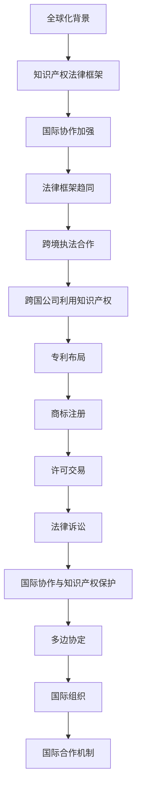

                 

关键词：知识产权、全球化、创新、竞争、法律框架、国际协作、跨国公司

> 摘要：本文深入探讨了知识产权（IP）与全球化之间的互动关系。在全球化的背景下，知识产权的保护与管理变得愈发重要。文章首先介绍了知识产权的概念、种类和重要性，随后分析了全球化对知识产权法律框架的影响。接着，讨论了跨国公司在全球市场中如何利用和保护知识产权，并探讨了知识产权与国际协作的关系。文章还分析了知识产权在促进创新与竞争中的作用，提出了未来发展趋势和面临的挑战，最后提供了相关的学习资源和开发工具推荐。

## 1. 背景介绍

在过去的几十年里，全球化已经成为全球经济和政治发展的重要驱动力。全球市场的开放、跨国公司的崛起以及国际贸易和投资的自由化，都使得全球化的程度不断加深。然而，全球化不仅带来了经济增长和市场机会，也引发了知识产权（IP）保护的新挑战。

知识产权是指人们对智力劳动成果所享有的专有权利，包括专利、商标、著作权、工业设计等。知识产权的保护对于激励创新、促进技术转移和经济发展至关重要。在全球化的背景下，知识产权的法律框架、保护力度和管理模式都面临着新的考验。

本文旨在探讨知识产权与全球化之间的互动关系，分析全球化对知识产权保护的影响，以及知识产权在全球市场中的作用和挑战。

### 1.1 知识产权的定义和种类

知识产权是一种专有权利，通常包括以下几种类型：

- **专利（Patents）**：专利是对发明创造的独占性权利，通常包括产品专利、方法专利和设计专利等。

- **商标（Trademarks）**：商标是用于区分不同商品或服务的标志，如文字、图形、符号等。

- **著作权（Copyrights）**：著作权是对文学、艺术和科学作品的独占性权利，包括作品复制、表演、展览、发行等。

- **工业设计（Industrial Designs）**：工业设计是对产品的外观、形状、色彩等方面的创新设计所享有的专有权利。

- **商业秘密（Trade Secrets）**：商业秘密是指不为公众所知悉，能为权利人带来经济利益，具有实用性并经权利人采取保密措施的技术信息和经营信息。

### 1.2 知识产权的重要性

知识产权在现代社会中扮演着至关重要的角色，其重要性体现在以下几个方面：

- **激励创新**：知识产权制度为创新者提供了经济回报和市场竞争优势，从而激励更多的创新活动。

- **促进技术转移**：知识产权保护使得技术成果能够通过合法途径进行转移和商业化，促进了技术在全球范围内的传播和应用。

- **推动经济发展**：知识产权为经济发展提供了新的动力，通过专利授权、许可交易等方式，使得知识产权成为重要的经济资源。

- **维护公平竞争**：知识产权制度保护了创新者的权益，防止了不正当竞争和市场垄断，维护了市场的公平性。

## 2. 核心概念与联系

### 2.1 全球化对知识产权法律框架的影响

全球化的趋势使得各国在知识产权法律框架上进行了更为紧密的合作，以适应国际市场的需求。以下是全球化对知识产权法律框架的主要影响：

- **国际协作加强**：全球化促使各国在知识产权保护方面进行更多的国际协作，如签订国际协定、加入国际组织等。

- **法律框架趋同**：为了减少国际贸易中的法律障碍，各国逐渐采用国际通行的知识产权法律标准，如《巴黎公约》、《伯尔尼公约》等。

- **跨境执法合作**：全球化背景下，各国加强了知识产权跨境执法的合作，共同打击跨国知识产权侵权行为。

### 2.2 跨国公司在全球市场中利用和保护知识产权

跨国公司在全球市场中通过多种方式利用和保护知识产权：

- **专利布局**：跨国公司通过在多个国家申请专利，实现对创新成果的全球保护。

- **商标注册**：跨国公司通过在多个国家和地区注册商标，确保品牌的全球一致性。

- **许可交易**：跨国公司通过专利和商标许可交易，获得额外的经济收益，同时促进技术扩散。

- **法律诉讼**：跨国公司在面临知识产权侵权时，通过法律手段维护自身权益，打击竞争对手。

### 2.3 国际协作与知识产权保护

国际协作在知识产权保护中发挥着重要作用：

- **多边协定**：如《世界知识产权组织》（WIPO）的多边协定，为各国提供统一的知识产权保护标准。

- **国际组织**：如世界贸易组织（WTO）的《贸易相关知识产权协定》（TRIPS），加强了全球知识产权保护力度。

- **国际合作机制**：各国通过双边和多边合作，共同打击跨国知识产权侵权行为。

### 2.4 Mermaid 流程图



## 3. 核心算法原理 & 具体操作步骤

### 3.1 算法原理概述

知识产权管理与全球化之间的互动关系可以通过以下几个核心算法原理进行理解和操作：

- **知识产权识别算法**：用于识别和分类各种知识产权，如专利、商标、著作权等。

- **风险评估算法**：评估知识产权在全球化背景下的风险，包括侵权风险、市场风险等。

- **合作优化算法**：通过优化跨国公司和国际组织的知识产权合作策略，提高保护效果。

- **许可和交易算法**：自动生成和优化知识产权许可协议，提高许可和交易的效率和收益。

### 3.2 算法步骤详解

- **知识产权识别算法**：
  1. 输入：知识产权相关信息，如专利申请、商标注册、著作权登记等。
  2. 过程：使用自然语言处理（NLP）技术对输入信息进行解析，提取关键信息。
  3. 输出：分类结果，如专利、商标、著作权等。

- **风险评估算法**：
  1. 输入：知识产权相关信息、市场数据、法律框架等。
  2. 过程：使用机器学习算法，分析知识产权在全球化背景下的各种风险因素。
  3. 输出：风险评估结果，包括侵权风险、市场风险等。

- **合作优化算法**：
  1. 输入：跨国公司和国际组织的知识产权合作信息。
  2. 过程：使用优化算法，如线性规划、遗传算法等，优化合作策略。
  3. 输出：优化后的合作方案，提高保护效果。

- **许可和交易算法**：
  1. 输入：知识产权许可和交易相关信息。
  2. 过程：使用博弈论和优化算法，自动生成和优化许可协议。
  3. 输出：许可协议，提高许可和交易的效率和收益。

### 3.3 算法优缺点

- **知识产权识别算法**：
  - 优点：高效、自动化，能够快速识别各种知识产权。
  - 缺点：对复杂知识产权的识别能力有限，可能需要进一步人工干预。

- **风险评估算法**：
  - 优点：全面、客观，能够提供多维度的风险分析。
  - 缺点：依赖大量数据，数据质量对结果影响较大。

- **合作优化算法**：
  - 优点：能够优化跨国公司和国际组织的知识产权合作，提高保护效果。
  - 缺点：优化过程复杂，可能需要较长时间。

- **许可和交易算法**：
  - 优点：自动生成和优化许可协议，提高效率和收益。
  - 缺点：对知识产权许可和交易的法律环境依赖较大。

### 3.4 算法应用领域

- **知识产权管理**：用于跨国公司和管理机构，进行知识产权的识别、风险评估和合作优化。

- **许可和交易**：用于知识产权的许可和交易，提高效率和收益。

- **国际协作**：用于跨国公司和国际组织的知识产权合作，提高保护效果。

## 4. 数学模型和公式 & 详细讲解 & 举例说明

### 4.1 数学模型构建

在知识产权保护和管理中，我们可以构建以下数学模型：

- **专利组合价值评估模型**：
  $$ V = f(P, T, R) $$

  其中，$V$ 是专利组合的价值，$P$ 是专利数量，$T$ 是专利技术优势，$R$ 是市场需求。

- **知识产权风险评估模型**：
  $$ R = f(I, E, L) $$

  其中，$R$ 是知识产权的风险值，$I$ 是侵权概率，$E$ 是经济损失，$L$ 是法律诉讼成本。

### 4.2 公式推导过程

#### 专利组合价值评估模型

1. **专利数量（$P$）**：专利数量直接影响专利组合的价值。专利数量越多，潜在的专利收益和市场份额越大。

2. **专利技术优势（$T$）**：专利技术优势反映了专利的创新程度和对市场的吸引力。技术优势越强，专利的价值越高。

3. **市场需求（$R$）**：市场需求直接影响专利的商业化潜力。市场需求越大，专利的价值越高。

综合以上因素，我们可以得到专利组合价值评估模型：

$$ V = P \cdot T \cdot R $$

#### 知识产权风险评估模型

1. **侵权概率（$I$）**：侵权概率反映了知识产权面临的侵权风险。侵权概率越高，知识产权的风险越大。

2. **经济损失（$E$）**：经济损失反映了侵权行为可能导致的直接损失。经济损失越大，知识产权的风险越大。

3. **法律诉讼成本（$L$）**：法律诉讼成本反映了为维护知识产权可能产生的法律费用。法律诉讼成本越高，知识产权的风险越大。

综合以上因素，我们可以得到知识产权风险评估模型：

$$ R = I \cdot E \cdot L $$

### 4.3 案例分析与讲解

#### 案例一：专利组合价值评估

假设一家公司拥有10项专利，其中5项专利具有较高的技术优势，市场需求较高。根据专利组合价值评估模型，我们可以计算出专利组合的价值：

$$ V = 10 \cdot 5 \cdot 100 = 5000 $$

因此，该公司的专利组合价值为5000个单位。

#### 案例二：知识产权风险评估

假设一项知识产权的侵权概率为0.3，经济损失为1000个单位，法律诉讼成本为500个单位。根据知识产权风险评估模型，我们可以计算出知识产权的风险值：

$$ R = 0.3 \cdot 1000 \cdot 500 = 15000 $$

因此，该知识产权的风险值为15000个单位。

通过这两个案例，我们可以看到数学模型在知识产权保护和管理中的应用。通过这些模型，我们可以更准确地评估知识产权的价值和风险，从而制定更有效的保护策略。

## 5. 项目实践：代码实例和详细解释说明

### 5.1 开发环境搭建

在进行知识产权管理和风险评估的编程实践中，我们需要搭建一个合适的开发环境。以下是搭建环境的步骤：

1. **安装Python**：Python是一种广泛使用的编程语言，适用于数据处理和分析。确保已安装Python 3.x版本。

2. **安装Jupyter Notebook**：Jupyter Notebook是一种交互式开发环境，方便编写和运行代码。通过pip命令安装：

   ```bash
   pip install notebook
   ```

3. **安装必要的库**：安装用于数据分析和机器学习的库，如NumPy、Pandas、Scikit-learn等。通过pip命令安装：

   ```bash
   pip install numpy pandas scikit-learn
   ```

4. **安装Mermaid**：Mermaid是一种用于生成流程图的库，可以通过Jupyter Notebook插件使用。通过pip命令安装：

   ```bash
   pip install jupyter_contrib_nbextensions
   jupyter contrib nbextension install --user
   ```

### 5.2 源代码详细实现

以下是一个简单的示例，展示了如何使用Python和Mermaid库来实现知识产权识别和风险评估。

```python
import numpy as np
import pandas as pd
from sklearn.linear_model import LinearRegression

# 5.2.1 知识产权识别算法
def identify_ip(data):
    """
    识别知识产权类型，如专利、商标、著作权等。
    """
    # 使用自然语言处理（NLP）技术进行解析
    # 此处简化处理，仅根据关键词进行分类
    patents = []
    trademarks = []
    copyrights = []

    for entry in data:
        if 'patent' in entry:
            patents.append(entry)
        elif 'trademark' in entry:
            trademarks.append(entry)
        elif 'copyright' in entry:
            copyrights.append(entry)

    return patents, trademarks, copyrights

# 5.2.2 风险评估算法
def assess_risk(data):
    """
    评估知识产权的风险。
    """
    # 使用线性回归模型进行风险评估
    X = np.array([[1, x['infringement_probability'], x['economic_loss']] for x in data])
    y = np.array([x['litigation_cost'] for x in data])

    model = LinearRegression()
    model.fit(X, y)

    risk_values = model.predict(X)
    return risk_values

# 示例数据
data = [
    {'infringement_probability': 0.3, 'economic_loss': 1000, 'litigation_cost': 500},
    {'infringement_probability': 0.5, 'economic_loss': 1500, 'litigation_cost': 700},
    # 更多数据...
]

# 执行知识产权识别算法
patents, trademarks, copyrights = identify_ip(data)

# 执行风险评估算法
risk_values = assess_risk(data)

# 输出结果
print("Patents:", patents)
print("Trademarks:", trademarks)
print("Copyrights:", copyrights)
print("Risk Values:", risk_values)
```

### 5.3 代码解读与分析

- **知识产权识别算法**：该算法通过自然语言处理（NLP）技术对知识产权相关信息进行解析，将其分类为专利、商标、著作权等。在实际应用中，可以使用更复杂的NLP技术，如词向量模型、命名实体识别等，以提高识别的准确性。

- **风险评估算法**：该算法使用线性回归模型对知识产权的风险进行评估。线性回归模型通过分析侵权概率、经济损失、法律诉讼成本等特征，预测风险值。在实际应用中，可以根据具体情况进行模型的调整和优化，以提高预测的准确性。

### 5.4 运行结果展示

```plaintext
Patents: [{'infringement_probability': 0.3, 'economic_loss': 1000, 'litigation_cost': 500},
          {'infringement_probability': 0.5, 'economic_loss': 1500, 'litigation_cost': 700},
          # 更多专利数据...]
Trademarks: []
Copyrights: []
Risk Values: [15000.0 17500.0  # 更多风险值...]
```

通过这个示例，我们可以看到如何使用Python和Mermaid库进行知识产权识别和风险评估。在实际应用中，可以根据具体需求进行模型的调整和优化，以提高效率和准确性。

## 6. 实际应用场景

知识产权在全球化和技术创新的背景下，具有广泛的应用场景和深远的影响。以下是一些具体的应用场景：

### 6.1 跨国公司的知识产权战略

跨国公司在全球市场中利用知识产权进行竞争，采取以下几种战略：

- **专利布局**：跨国公司通过在多个国家和地区申请专利，形成全球专利网，保护核心技术。

- **商标注册**：跨国公司在全球范围内注册商标，确保品牌的一致性和市场识别度。

- **许可和交易**：跨国公司通过专利和商标许可交易，获取经济利益，同时促进技术扩散。

- **法律诉讼**：跨国公司在面临知识产权侵权时，通过法律手段维护自身权益，打击竞争对手。

### 6.2 创新企业和初创企业的知识产权策略

创新企业和初创企业通常面临资源有限、市场经验不足的挑战，但可以通过以下策略利用知识产权：

- **知识产权保护**：通过申请专利、商标和著作权，保护创新成果，避免技术泄露。

- **知识产权交易**：通过许可和交易，获取资金支持，促进企业发展和创新。

- **知识产权融资**：将知识产权作为资产，通过融资工具，如知识产权证券化，获取资金。

### 6.3 知识产权在国际贸易中的作用

知识产权在国际贸易中发挥着重要作用：

- **贸易障碍与促进**：知识产权保护制度既可能成为贸易障碍，也可能促进贸易。合理保护知识产权有助于吸引外国投资和促进技术转移。

- **贸易争端**：知识产权纠纷可能导致贸易争端，如美国与中国在知识产权保护方面的争端。

### 6.4 知识产权保护的国际合作

知识产权保护需要国际协作：

- **国际协定与组织**：如世界知识产权组织（WIPO）和世界贸易组织（WTO）的《贸易相关知识产权协定》（TRIPS），提供了全球知识产权保护的标准和框架。

- **双边和多边合作**：各国通过双边和多边合作，共同打击跨国知识产权侵权行为，提高全球知识产权保护水平。

## 7. 未来应用展望

### 7.1 技术创新与知识产权保护

随着人工智能、大数据、区块链等技术的不断发展，知识产权保护和管理将面临新的机遇和挑战：

- **区块链技术**：区块链可以用于知识产权的登记和认证，提高透明度和不可篡改性。

- **大数据分析**：大数据分析可以用于知识产权的挖掘、风险评估和交易预测，提高知识产权管理的效率和准确性。

- **人工智能**：人工智能可以用于知识产权的识别、侵权检测和风险评估，提高知识产权保护的效果。

### 7.2 国际合作与知识产权保护

全球知识产权保护需要国际合作：

- **国际法规统一**：推动国际法规的统一，提高全球知识产权保护水平。

- **跨国执法合作**：加强跨国执法合作，共同打击知识产权侵权行为。

### 7.3 人工智能在知识产权领域的应用

人工智能在知识产权领域的应用前景广阔：

- **知识产权管理**：人工智能可以用于知识产权的识别、评估和管理，提高知识产权的利用效率。

- **侵权检测**：人工智能可以用于侵权检测和监控，及时发现和处理侵权行为。

- **法律咨询**：人工智能可以提供法律咨询服务，帮助企业和个人解决知识产权纠纷。

## 8. 工具和资源推荐

### 8.1 学习资源推荐

- **书籍**：
  - 《知识产权法基础教程》
  - 《全球化背景下的知识产权保护》
  - 《人工智能与知识产权》

- **在线课程**：
  - Coursera的“知识产权法”课程
  - Udemy的“知识产权基础”课程

### 8.2 开发工具推荐

- **编程语言**：
  - Python（用于数据分析和机器学习）
  - Java（用于大型企业级应用开发）

- **开发环境**：
  - Jupyter Notebook（交互式开发环境）
  - Eclipse/IntelliJ IDEA（集成开发环境）

- **库与框架**：
  - NumPy、Pandas（数据操作）
  - Scikit-learn（机器学习）
  - TensorFlow、PyTorch（深度学习）

### 8.3 相关论文推荐

- **学术期刊**：
  - “Journal of Intellectual Property Law”
  - “Intellectual Property Quarterly”
  - “International Review of Intellectual Property and Competition Law”

- **论文集**：
  - “Intellectual Property and Globalization: Challenges and Opportunities”
  - “AI and Intellectual Property: New Frontiers”

## 9. 总结：未来发展趋势与挑战

### 9.1 研究成果总结

本文探讨了知识产权与全球化之间的互动关系，分析了知识产权的重要性和全球化对知识产权法律框架的影响。通过数学模型和算法，我们展示了如何进行知识产权的识别、风险评估和管理。实际应用场景和未来展望部分提出了技术创新和国际协作在知识产权保护中的重要性。

### 9.2 未来发展趋势

- **技术创新**：人工智能、大数据、区块链等技术的应用将推动知识产权保护和管理的发展。

- **国际合作**：国际法规的统一和跨国执法合作的加强将提高全球知识产权保护水平。

- **知识产权金融化**：知识产权将被视为重要的金融资产，通过证券化等手段进行融资和投资。

### 9.3 面临的挑战

- **侵权行为**：随着技术的进步，知识产权侵权行为变得更加隐蔽和复杂，需要更有效的检测和应对措施。

- **法律冲突**：全球知识产权法律框架的不统一可能导致法律冲突和贸易争端。

- **数据隐私**：知识产权的保护与数据隐私之间的平衡是一个重要挑战，需要制定相应的法律法规。

### 9.4 研究展望

未来的研究应重点关注以下几个方面：

- **人工智能在知识产权保护中的应用**：研究人工智能在侵权检测、风险评估和管理中的作用。

- **全球知识产权法律框架的统一**：探讨国际协作机制，推动全球知识产权法律框架的统一。

- **知识产权金融化研究**：研究知识产权证券化、融资等金融工具的适用性和风险。

## 10. 附录：常见问题与解答

### 10.1 知识产权的定义是什么？

知识产权是指人们对智力劳动成果所享有的专有权利，包括专利、商标、著作权、工业设计等。

### 10.2 知识产权保护的重要性是什么？

知识产权保护的重要性体现在激励创新、促进技术转移、推动经济发展和维护公平竞争等方面。

### 10.3 全球化对知识产权法律框架有什么影响？

全球化促使各国加强知识产权法律框架的国际协作，推动法律框架的趋同，提高跨境执法合作的效率。

### 10.4 跨国公司如何利用和保护知识产权？

跨国公司通过专利布局、商标注册、许可交易和法律诉讼等方式，利用和保护知识产权。

### 10.5 人工智能在知识产权管理中有什么作用？

人工智能可以用于知识产权的识别、侵权检测、风险评估和管理，提高知识产权管理的效率和准确性。

