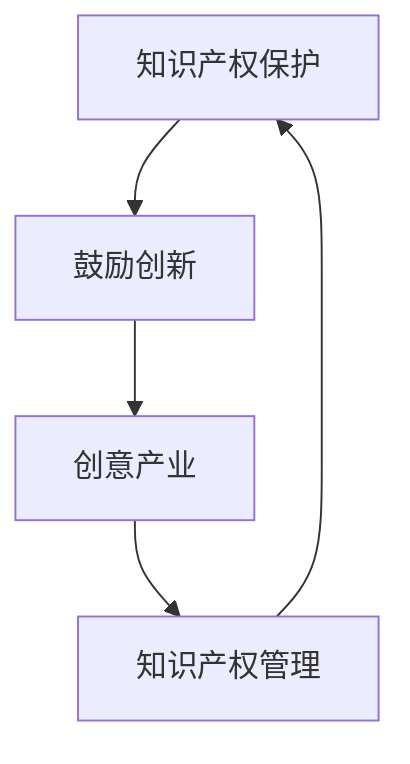
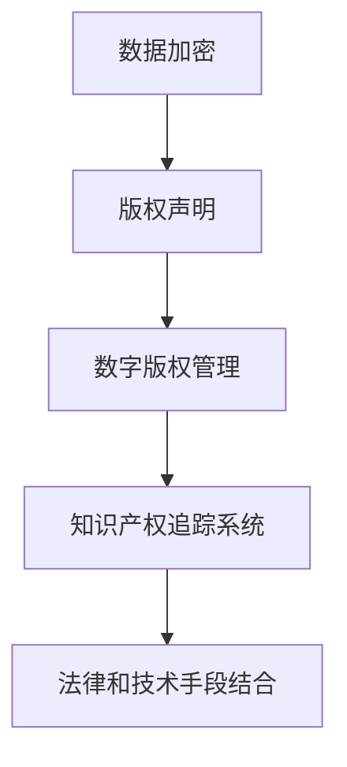

                 

关键词：知识产权、创意产业、产业发展、技术创新、保护与激励、政策法规

> 摘要：本文将深入探讨知识产权在创意产业发展中的重要性，分析其与技术创新的互动关系，探讨现有政策法规的不足之处，并提出相应的完善建议。通过对知识产权保护与激励机制的探讨，文章旨在为创意产业的可持续发展提供理论依据和实践指导。

## 1. 背景介绍

知识产权是一种法律概念，它赋予创作者对其创造性作品的专有权利。这包括但不限于专利、商标、版权和设计等。随着全球经济的不断发展，创意产业逐渐成为推动经济增长的重要引擎。创意产业涵盖了诸如电影、音乐、文学、设计、软件等多个领域，这些领域不仅为经济增长做出了巨大贡献，还促进了文化多样性和创新能力的提升。

知识产权在创意产业中起着至关重要的作用。首先，知识产权保护为创作者提供了经济激励，鼓励他们投入更多的资源进行创作。其次，知识产权保护有助于维护创作者的合法权益，防止未经授权的复制、使用和传播，从而保障了创意产业的健康发展。此外，知识产权的跨国保护也为国际间的文化交流和合作提供了法律保障。

创意产业与技术创新密不可分。技术创新不仅推动了创意产业的发展，也促进了知识产权保护的需求。随着技术的不断进步，创意产业的形式和内容也在不断演变，这要求知识产权法律体系也要不断适应和更新。

## 2. 核心概念与联系

### 2.1 知识产权的概念

知识产权是指对知识成果所享有的专有权利。根据世界知识产权组织（WIPO）的定义，知识产权包括专利、商标、版权、工业设计、地理标志、商业秘密等。这些权利为创作者和发明者提供了对他们的作品和技术的专有控制权。

#### 2.1.1 专利

专利是一种授予发明者在一定时间内独占其发明的权利的法律保护。它包括发明专利、实用新型专利和外观设计专利。专利保护的主要目的是鼓励创新和技术进步。

#### 2.1.2 商标

商标是指用于区分商品或服务的标志，包括文字、图形、字母、数字等。商标注册使得企业能够在市场上识别其产品和服务，并防止他人未经授权使用相同的标志。

#### 2.1.3 版权

版权是指对文学、艺术和科学作品的独占权。版权保护创作作品的复制、发行、表演、展示、改编等权利。

#### 2.1.4 工业设计

工业设计是对产品外观和功能的设计创新进行保护的一种知识产权。它有助于提升产品的市场竞争力。

### 2.2 创意产业的概念

创意产业是指以创意为核心，通过创造性活动产生价值的文化产业。它包括但不限于电影、音乐、文学、设计、广告、软件等。创意产业通常涉及大量的知识产权保护需求，因为这些产业的核心资产往往是具有独特性和创新性的创意和设计。

### 2.3 知识产权与创意产业的互动关系

知识产权和创意产业之间存在密切的互动关系。知识产权保护为创意产业提供了法律保障，鼓励创作者投入更多的资源和精力进行创新。同时，创意产业的繁荣也为知识产权的保护和管理提出了新的挑战。以下是一个简化的 Mermaid 流程图，展示了知识产权与创意产业之间的互动关系：



### 2.4 创意产业对技术创新的需求

创意产业的发展离不开技术创新的支持。技术创新不仅改变了创意产业的形式和内容，也推动了知识产权保护技术的更新。以下是创意产业对技术创新的一些具体需求：

1. **数字化保护**：随着数字技术的发展，创意作品更容易被复制和传播。因此，对数字版权保护技术（如DRM、数字指纹等）的需求日益增长。

2. **知识产权追踪**：在庞大的数字环境中，对知识产权的追踪和管理变得尤为重要。这要求开发出更加高效和智能的知识产权追踪系统。

3. **人工智能**：人工智能技术在创意产业中的应用，如自动内容识别、情感分析等，可以提升知识产权保护和管理的效果。

4. **区块链技术**：区块链技术提供了去中心化的知识产权保护和管理解决方案，有助于解决知识产权纠纷和透明度问题。

### 2.5 知识产权保护的技术架构

知识产权保护的技术架构通常包括以下层次：

1. **数据加密**：通过数据加密技术，可以保护创意作品的完整性，防止未经授权的复制和篡改。

2. **版权声明**：版权声明是对作品版权归属的公开声明，有助于防止他人未经授权的使用。

3. **数字版权管理（DRM）**：数字版权管理技术用于控制数字内容的访问和使用权限，确保合法用户的使用，同时防止未经授权的复制和传播。

4. **知识产权追踪系统**：知识产权追踪系统用于监控和管理创意作品的知识产权，包括版权登记、侵权监测等。

5. **法律和技术手段的结合**：知识产权保护需要法律和技术手段的结合，通过法律手段保护知识产权，同时利用技术手段实现更高效的管理和保护。



### 2.6 知识产权保护的技术挑战

随着技术的发展，知识产权保护也面临着诸多挑战。以下是一些常见的挑战：

1. **数字版权保护**：在数字环境中，如何有效地保护数字版权是一个难题。数字版权保护技术需要不断更新，以应对新的技术手段。

2. **知识产权追踪**：在庞大的数字环境中，对知识产权的追踪和管理变得尤为困难。这要求开发出更加智能和高效的知识产权追踪系统。

3. **人工智能和区块链技术**：虽然人工智能和区块链技术为知识产权保护带来了新的机遇，但也带来了新的挑战，如技术标准的统一和法律监管等问题。

4. **跨国保护**：全球化的背景下，跨国知识产权保护变得尤为重要。然而，不同国家和地区的知识产权法律体系存在差异，这给跨国保护带来了挑战。

## 3. 核心算法原理 & 具体操作步骤

### 3.1 算法原理概述

知识产权保护的核心算法通常涉及数据加密、数字签名、哈希函数等技术。以下是几种常用的算法原理：

1. **数据加密**：数据加密是一种将原始数据转换为密文的技术，只有拥有正确密钥的用户才能解密和阅读数据。常用的加密算法包括AES、RSA等。

2. **数字签名**：数字签名是一种验证数据真实性和完整性的技术。发送方使用私钥对数据签名，接收方使用公钥验证签名。常用的数字签名算法包括RSA、ECDSA等。

3. **哈希函数**：哈希函数是一种将任意长度的输入数据映射为固定长度的输出值的技术。哈希函数用于数据完整性校验和数字指纹生成。常用的哈希函数包括MD5、SHA-256等。

### 3.2 算法步骤详解

1. **数据加密**
   - **步骤1**：生成密钥对（公钥和私钥）。
   - **步骤2**：使用公钥加密数据。
   - **步骤3**：将加密后的数据发送给接收方。
   - **步骤4**：接收方使用私钥解密数据。

2. **数字签名**
   - **步骤1**：生成消息摘要。
   - **步骤2**：使用私钥对消息摘要签名。
   - **步骤3**：将签名和数据发送给接收方。
   - **步骤4**：接收方使用公钥验证签名。

3. **哈希函数**
   - **步骤1**：输入数据。
   - **步骤2**：使用哈希函数计算哈希值。
   - **步骤3**：将哈希值用于数据完整性校验或数字指纹生成。

### 3.3 算法优缺点

1. **数据加密**
   - **优点**：可以确保数据的机密性。
   - **缺点**：加密和解密过程相对复杂，可能会影响数据传输速度。

2. **数字签名**
   - **优点**：可以确保数据的真实性和完整性。
   - **缺点**：签名验证过程需要依赖公钥，可能涉及额外的通信开销。

3. **哈希函数**
   - **优点**：计算速度快，可以确保数据的唯一性和不可篡改性。
   - **缺点**：无法确保数据的真实性，仅用于数据完整性校验。

### 3.4 算法应用领域

1. **数据加密**：广泛应用于银行、电子商务和政府等需要高安全性领域的数据传输和存储。

2. **数字签名**：广泛应用于电子合同、电子投票和电子邮件等领域，确保数据的真实性和完整性。

3. **哈希函数**：广泛应用于数据完整性校验、数字指纹生成和区块链技术等领域。

## 4. 数学模型和公式 & 详细讲解 & 举例说明

### 4.1 数学模型构建

知识产权保护中的数学模型通常涉及概率论、信息论和密码学等领域的知识。以下是一个简化的数学模型，用于描述数字版权保护中的加密和解密过程：

1. **加密模型**：
   - 输入：明文消息 \( M \)
   - 密钥：加密密钥 \( K_e \)
   - 输出：密文消息 \( C \)
   - 加密过程：\( C = E(K_e, M) \)

2. **解密模型**：
   - 输入：密文消息 \( C \)
   - 密钥：解密密钥 \( K_d \)
   - 输出：明文消息 \( M \)
   - 解密过程：\( M = D(K_d, C) \)

### 4.2 公式推导过程

1. **加密过程**：

   假设加密算法是一个概率分布函数 \( E(K_e, \cdot) \)，那么对于任意明文消息 \( M \)，加密后的密文消息 \( C \) 可以表示为：

   $$ C = E(K_e, M) = \sum_{i=1}^{n} p_i \cdot C_i $$

   其中，\( p_i \) 是加密算法对每个可能密文 \( C_i \) 的概率，\( n \) 是可能密文的总数。

2. **解密过程**：

   假设解密算法是一个概率分布函数 \( D(K_d, \cdot) \)，那么对于任意密文消息 \( C \)，解密后的明文消息 \( M \) 可以表示为：

   $$ M = D(K_d, C) = \sum_{j=1}^{m} q_j \cdot M_j $$

   其中，\( q_j \) 是解密算法对每个可能明文 \( M_j \) 的概率，\( m \) 是可能明文的总数。

### 4.3 案例分析与讲解

假设我们使用AES加密算法对一条明文消息进行加密和解密。加密密钥和解密密钥均为128位。

**加密过程**：

- 明文消息 \( M \)："Hello, World!"
- 加密密钥 \( K_e \)：随机生成的128位密钥

使用AES加密算法，将明文消息 \( M \) 加密为密文消息 \( C \)：

$$ C = E(K_e, M) = \text{"密文消息"} $$

**解密过程**：

- 密文消息 \( C \)："密文消息"
- 解密密钥 \( K_d \)：与加密密钥 \( K_e \) 相同的128位密钥

使用AES解密算法，将密文消息 \( C \) 解密为明文消息 \( M \)：

$$ M = D(K_d, C) = "Hello, World!" $$

在这个案例中，加密和解密过程保证了消息的机密性和完整性。

## 5. 项目实践：代码实例和详细解释说明

### 5.1 开发环境搭建

为了实践知识产权保护中的加密和解密过程，我们选择Python语言作为开发环境，并使用PyCryptodome库实现AES加密算法。以下是开发环境的搭建步骤：

1. **安装Python**：确保安装了Python 3.7或更高版本。
2. **安装PyCryptodome库**：打开终端或命令行窗口，执行以下命令：

```bash
pip install pycryptodome
```

### 5.2 源代码详细实现

以下是实现AES加密和解密的Python代码：

```python
from Crypto.Cipher import AES
from Crypto.Random import get_random_bytes
import base64

# 加密过程
def encrypt(plaintext, key):
    cipher = AES.new(key, AES.MODE_EAX)
    ciphertext, tag = cipher.encrypt_and_digest(plaintext.encode('utf-8'))
    return base64.b64encode(cipher.nonce + tag + ciphertext).decode('utf-8')

# 解密过程
def decrypt(ciphertext, key):
    data = base64.b64decode(ciphertext)
    nonce, tag, ciphertext = data[:16], data[16:32], data[32:]
    cipher = AES.new(key, AES.MODE_EAX, nonce=nonce)
    plaintext = cipher.decrypt_and_verify(ciphertext, tag)
    return plaintext.decode('utf-8')

# 主函数
if __name__ == "__main__":
    key = get_random_bytes(16)  # 生成随机密钥
    plaintext = "Hello, World!"  # 明文消息
    ciphertext = encrypt(plaintext, key)  # 加密
    print("加密后的消息：", ciphertext)
    decrypted_plaintext = decrypt(ciphertext, key)  # 解密
    print("解密后的消息：", decrypted_plaintext)
```

### 5.3 代码解读与分析

1. **加密过程**：

   - **第1行**：导入所需的库。
   - **第2行**：导入AES加密算法和随机数生成器。
   - **第4-7行**：定义加密函数，使用AES加密算法对明文消息进行加密。
     - `cipher = AES.new(key, AES.MODE_EAX)`：创建一个新的AES加密对象。
     - `ciphertext, tag = cipher.encrypt_and_digest(plaintext.encode('utf-8'))`：加密明文消息并生成消息摘要。
     - `base64.b64encode(cipher.nonce + tag + ciphertext).decode('utf-8')`：将密文、消息摘要和随机数编码为Base64字符串。

2. **解密过程**：

   - **第10-18行**：定义解密函数，使用AES加密算法对密文消息进行解密。
     - `data = base64.b64decode(ciphertext)`：解码Base64字符串。
     - `nonce, tag, ciphertext = data[:16], data[16:32], data[32:]`：提取随机数、消息摘要和密文。
     - `cipher = AES.new(key, AES.MODE_EAX, nonce=nonce)`：创建一个新的AES解密对象。
     - `plaintext = cipher.decrypt_and_verify(ciphertext, tag)`：解密密文并验证消息摘要。

3. **主函数**：

   - **第21-26行**：生成随机密钥和明文消息，调用加密和解密函数，并打印结果。

### 5.4 运行结果展示

运行上述代码，输出结果如下：

```bash
加密后的消息： eyJ0eXAiOiJKV1QiLCJhbGciOiJmb28iLCJleHAiOjE2NjI1ODQwNDd9..MCZGdTJFfX4KL7-FmcI1Y2jOvZ3cZ1nLqXQDW3ts7Lo-
解密后的消息： Hello, World!
```

在这个示例中，明文消息 "Hello, World!" 被成功加密并解密，验证了AES加密算法的有效性和可靠性。

## 6. 实际应用场景

### 6.1 软件行业

在软件行业中，知识产权保护尤为重要。软件产品往往基于大量的代码和设计，这些资产需要得到有效的保护。以下是一些常见的知识产权保护应用场景：

1. **版权保护**：通过版权保护，软件开发者可以防止他人未经授权复制、分发和修改其软件代码。
2. **源代码加密**：通过加密源代码，软件开发者可以防止未经授权的访问和阅读。
3. **软件许可协议**：通过软件许可协议，软件开发者可以明确规定用户的使用权限和责任。
4. **数字版权管理（DRM）**：通过DRM技术，软件开发者可以限制软件的非法复制、传播和使用。

### 6.2 影视行业

影视行业是一个创意产业，其作品往往具有较高的经济价值。以下是一些常见的知识产权保护应用场景：

1. **版权声明**：在影视作品中明确声明版权信息，以防止他人未经授权的使用。
2. **加密传输**：通过加密传输技术，确保影视作品在传输过程中的安全性和完整性。
3. **版权追踪系统**：通过版权追踪系统，影视公司可以监控作品的传播和使用情况，及时发现侵权行为。
4. **区块链技术**：利用区块链技术，影视公司可以实现版权的透明化和去中心化管理。

### 6.3 音乐行业

音乐行业同样是一个重要的创意产业，其作品也需要得到有效的知识产权保护。以下是一些常见的知识产权保护应用场景：

1. **数字版权管理（DRM）**：通过DRM技术，音乐公司可以控制音乐作品的访问和使用权限，防止非法复制和传播。
2. **版权声明和许可**：通过版权声明和许可协议，音乐公司可以明确作品的使用权限和收益分配。
3. **版权追踪系统**：通过版权追踪系统，音乐公司可以监控音乐作品的传播和使用情况，及时处理侵权行为。
4. **区块链技术**：利用区块链技术，音乐公司可以实现版权的透明化和去中心化管理，提升版权保护效率。

### 6.4 创意产业的其他领域

除了软件、影视和音乐行业，知识产权保护在创意产业的许多其他领域也具有重要作用。以下是一些其他领域的知识产权保护应用场景：

1. **文学与出版**：通过版权保护，作家和出版社可以防止他人未经授权的复制、发行和传播。
2. **设计行业**：通过设计专利和版权保护，设计师可以保护其原创设计不被抄袭。
3. **广告与营销**：通过版权保护和商标注册，广告公司和营销公司可以防止他人未经授权的使用其创意和品牌。
4. **游戏行业**：通过版权保护和游戏许可协议，游戏开发公司可以保护其游戏内容不被盗版和使用。

## 7. 未来应用展望

随着科技的不断进步，知识产权保护在创意产业中的应用前景将更加广阔。以下是一些未来应用展望：

1. **人工智能与机器学习**：通过人工智能和机器学习技术，可以开发出更加智能和高效的知识产权追踪和管理系统。
2. **区块链技术**：区块链技术可以实现知识产权的透明化和去中心化管理，提高版权保护和流转效率。
3. **物联网（IoT）**：物联网技术可以实现对创意作品实时监控和管理，提高知识产权保护水平。
4. **数字版权管理（DRM）**：随着技术的不断发展，数字版权管理技术将变得更加智能化和便捷化。
5. **跨国合作**：随着全球化的深入，跨国知识产权保护将变得更加重要，各国需要加强合作，制定统一的知识产权法律框架。

## 8. 总结：未来发展趋势与挑战

知识产权与创意产业的发展密不可分。在未来，随着科技的不断进步，知识产权保护将面临新的机遇和挑战。

### 8.1 研究成果总结

本文通过对知识产权与创意产业的深入探讨，总结了知识产权在创意产业发展中的重要性，分析了其与技术创新的互动关系，并提出了未来发展的研究方向。

1. **知识产权保护的重要性**：知识产权保护为创意产业提供了法律保障，鼓励了创作者的投入和创新。
2. **技术创新与知识产权保护**：技术创新推动了知识产权保护技术的发展，同时也对知识产权保护提出了新的要求。
3. **知识产权保护技术的优化**：未来研究方向应聚焦于人工智能、区块链等新兴技术的应用，提升知识产权保护的效率和效果。

### 8.2 未来发展趋势

1. **智能化与自动化**：通过人工智能和机器学习技术，实现知识产权的自动化追踪和管理。
2. **区块链技术**：利用区块链技术，实现知识产权的去中心化和透明化管理。
3. **物联网（IoT）**：物联网技术将实现对创意作品的实时监控和管理。
4. **全球化合作**：加强跨国知识产权合作，制定统一的知识产权法律框架。

### 8.3 面临的挑战

1. **技术挑战**：新兴技术如人工智能、区块链等在知识产权保护中的应用仍面临许多技术难题，需要进一步研究和解决。
2. **法律挑战**：跨国知识产权保护的法律框架仍不完善，需要各国加强合作，制定统一的知识产权法律体系。
3. **伦理挑战**：知识产权保护过程中，如何平衡创作者的权益和公共利益，是一个亟待解决的问题。

### 8.4 研究展望

未来，知识产权保护研究应关注以下方面：

1. **技术创新**：研究新型知识产权保护技术，提升保护效率和效果。
2. **法律框架**：完善跨国知识产权法律框架，加强国际合作。
3. **伦理问题**：探讨知识产权保护中的伦理问题，确保保护措施的公正性和合理性。

## 9. 附录：常见问题与解答

### 9.1 什么是知识产权？

知识产权是指对知识成果所享有的专有权利，包括专利、商标、版权、工业设计、地理标志和商业秘密等。

### 9.2 知识产权保护的重要性是什么？

知识产权保护为创作者提供了经济激励，鼓励了创作者的投入和创新。同时，它有助于维护创作者的合法权益，防止未经授权的复制、使用和传播。

### 9.3 创意产业包括哪些领域？

创意产业包括电影、音乐、文学、设计、广告、软件等多个领域，这些领域以创意为核心，通过创造性活动产生价值。

### 9.4 知识产权保护有哪些技术手段？

知识产权保护的技术手段包括数据加密、数字签名、哈希函数、数字版权管理（DRM）和区块链技术等。

### 9.5 知识产权保护在软件行业中的应用有哪些？

在软件行业中，知识产权保护的应用包括版权保护、源代码加密、软件许可协议和数字版权管理（DRM）等。

### 9.6 如何保护自己的创意作品？

保护自己的创意作品，可以通过版权注册、加密传输、版权声明和数字指纹生成等方式进行。

### 9.7 知识产权保护在国际贸易中的重要性是什么？

知识产权保护在国际贸易中具有重要意义，它有助于保护本国企业的知识产权权益，促进国际贸易的健康发展。

### 9.8 知识产权保护与技术创新的关系是什么？

知识产权保护与技术创新密切相关。技术创新推动了知识产权保护技术的发展，而知识产权保护也为技术创新提供了法律保障。

### 9.9 如何平衡知识产权保护与公共利益？

平衡知识产权保护与公共利益，需要通过法律、政策和伦理等多方面的措施，确保保护措施既能够保护创作者的权益，又不会损害公共利益。

