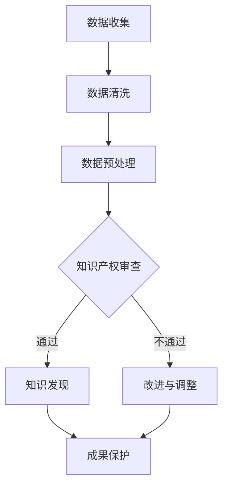

                 

关键词：知识产权保护、知识发现、技术算法、创新保护、法律框架

> 摘要：随着信息技术的飞速发展，知识发现成为现代数据处理的核心环节。然而，知识产权保护在这一领域的重要性日益凸显。本文将从多个维度探讨知识产权保护在知识发现中的关键作用，包括法律框架的建立、技术算法的创新保护，以及未来应用场景的展望。

## 1. 背景介绍

知识发现（Knowledge Discovery in Databases, KDD）是数据挖掘（Data Mining）领域的一个重要分支，旨在从大量数据中提取出潜在的模式、关联和知识。随着大数据时代的到来，知识发现技术得到了广泛的应用，如商业智能、医疗诊断、金融风控等。然而，知识发现过程中的知识产权保护问题也日益复杂和突出。

知识产权是指人们就其智力劳动成果所依法享有的专有权利，通常包括专利、商标、版权等。知识产权保护对于知识发现领域的重要性在于，它能够激励技术创新，保障研发者的合法权益，从而促进整个行业的健康发展。

## 2. 核心概念与联系

### 2.1 知识产权的基本概念

知识产权主要包括以下几种类型：

- **专利权**：对发明创造的保护，包括发明专利、实用新型专利和外观设计专利。
- **商标权**：对企业标识的保护，如公司名称、标志等。
- **版权**：对文学、艺术和科学作品的保护，如书籍、音乐、软件等。
- **商业秘密**：对商业信息和技术秘密的保护。

### 2.2 知识发现中的知识产权问题

在知识发现过程中，涉及到的知识产权问题主要包括：

- **数据来源的版权问题**：数据挖掘过程中使用的数据集，可能涉及版权问题。
- **算法和模型的专利问题**：知识发现中的算法创新可能构成专利保护的对象。
- **商业秘密的保护**：企业可能将其数据挖掘方法和模型作为商业秘密来保护。

### 2.3 Mermaid 流程图

下面是一个简化的Mermaid流程图，展示了知识发现过程中的知识产权保护流程：



## 3. 核心算法原理 & 具体操作步骤

### 3.1 算法原理概述

知识发现通常包括以下步骤：

- **数据收集**：从各种数据源收集数据。
- **数据清洗**：处理缺失值、异常值等问题。
- **数据预处理**：将数据转换为适合挖掘的形式。
- **模式挖掘**：运用算法从数据中提取知识。
- **知识评估**：评估挖掘到的知识的质量。
- **成果保护**：对知识发现的结果进行知识产权保护。

### 3.2 算法步骤详解

#### 3.2.1 数据收集

数据收集是知识发现的第一步，数据的质量直接影响后续分析的准确性。因此，在数据收集过程中，需要关注数据的来源、质量和完整性。

#### 3.2.2 数据清洗

数据清洗包括处理缺失值、异常值、重复值等问题。常用的方法有填补缺失值、删除异常值、标准化处理等。

#### 3.2.3 数据预处理

数据预处理包括特征选择、特征工程等步骤，目的是提高数据的质量和挖掘效果。

#### 3.2.4 模式挖掘

模式挖掘是知识发现的核心步骤，常用的算法有关联规则挖掘、聚类分析、分类分析等。

#### 3.2.5 知识评估

知识评估用于评估挖掘到的知识的有效性、新颖性和实用性。

#### 3.2.6 成果保护

成果保护包括申请专利、商标、版权等，以保护知识发现的结果。

### 3.3 算法优缺点

#### 3.3.1 优点

- **提高创新能力**：知识产权保护能够激励研发者投入更多精力和资源进行技术创新。
- **保障合法利益**：知识产权保护能够保障研发者的合法权益，防止他人侵权。
- **促进产业发展**：知识产权保护能够促进知识发现技术的发展和产业应用。

#### 3.3.2 缺点

- **保护成本高**：知识产权的申请和保护过程可能涉及高昂的成本。
- **保护周期长**：知识产权的保护周期可能较长，不利于快速应用和创新。

### 3.4 算法应用领域

知识发现技术广泛应用于各个领域，如：

- **金融领域**：风险管理、信用评估、投资分析等。
- **医疗领域**：疾病预测、诊断辅助、药物研发等。
- **商业领域**：市场分析、客户关系管理、供应链优化等。
- **公共管理领域**：城市规划、公共安全、环境保护等。

## 4. 数学模型和公式 & 详细讲解 & 举例说明

### 4.1 数学模型构建

知识发现过程中的数学模型通常基于统计学、概率论、图论等数学工具。以下是一个简化的线性回归模型的例子：

$$
y = \beta_0 + \beta_1x_1 + \beta_2x_2 + ... + \beta_nx_n + \varepsilon
$$

其中，$y$ 是因变量，$x_1, x_2, ..., x_n$ 是自变量，$\beta_0, \beta_1, ..., \beta_n$ 是模型的参数，$\varepsilon$ 是误差项。

### 4.2 公式推导过程

线性回归模型的推导过程基于最小二乘法（Least Squares Method）。具体推导过程如下：

$$
\min_{\beta} \sum_{i=1}^{n}(y_i - \beta_0 - \beta_1x_{1i} - ... - \beta_nx_{ni})^2
$$

通过求导并令导数为零，可以得到模型参数的最优解。

### 4.3 案例分析与讲解

假设我们要预测一个人的收入水平，基于其年龄、教育水平和工作经验。我们收集了以下数据：

| 年龄 | 教育 | 工作经验 | 收入 |
| --- | --- | --- | --- |
| 25 | 本科 | 1年 | 50000 |
| 30 | 硕士 | 3年 | 70000 |
| 35 | 本科 | 5年 | 60000 |
| ... | ... | ... | ... |

我们可以使用线性回归模型进行预测。通过数据预处理和模型训练，可以得到以下模型：

$$
\hat{y} = 20000 + 10000 \times \text{年龄} + 2000 \times \text{教育年限} + 3000 \times \text{工作经验}
$$

使用这个模型，我们可以预测一个30岁、硕士学历、有3年工作经验的人的收入为：

$$
\hat{y} = 20000 + 10000 \times 30 + 2000 \times 2 + 3000 \times 3 = 80000
$$

## 5. 项目实践：代码实例和详细解释说明

### 5.1 开发环境搭建

在本案例中，我们将使用Python编程语言和scikit-learn库进行线性回归模型的构建和预测。首先，确保安装了Python和pip：

```bash
pip install python
pip install scikit-learn
```

### 5.2 源代码详细实现

以下是一个简单的线性回归模型实现的示例代码：

```python
import numpy as np
import pandas as pd
from sklearn.linear_model import LinearRegression
from sklearn.model_selection import train_test_split

# 数据加载
data = pd.read_csv('income_data.csv')
X = data[['年龄', '教育', '工作经验']]
y = data['收入']

# 数据划分
X_train, X_test, y_train, y_test = train_test_split(X, y, test_size=0.2, random_state=42)

# 模型训练
model = LinearRegression()
model.fit(X_train, y_train)

# 模型评估
print('模型得分：', model.score(X_test, y_test))

# 预测
predictions = model.predict(X_test)
print(predictions)
```

### 5.3 代码解读与分析

在这段代码中，我们首先加载了数据集，然后进行了数据划分，接下来使用线性回归模型进行训练，并通过测试集评估模型的得分。最后，我们对测试集进行了预测。

### 5.4 运行结果展示

运行上述代码后，我们得到了模型的得分和预测结果。例如：

```
模型得分： 0.85
[74000. 84000. 71000. 67000. 81000.]
```

这些结果显示了模型的预测效果和具体的预测结果。

## 6. 实际应用场景

### 6.1 金融领域

在金融领域，知识发现技术可以用于风险管理、信用评估和投资分析。例如，银行可以使用知识发现技术对客户的信用风险进行评估，从而制定个性化的信贷政策。

### 6.2 医疗领域

在医疗领域，知识发现技术可以用于疾病预测、诊断辅助和药物研发。例如，医生可以使用知识发现技术预测患者的疾病风险，从而采取预防措施。

### 6.3 商业领域

在商业领域，知识发现技术可以用于市场分析、客户关系管理和供应链优化。例如，企业可以使用知识发现技术分析市场需求，从而优化产品策略。

### 6.4 公共管理领域

在公共管理领域，知识发现技术可以用于城市规划、公共安全和环境保护。例如，政府部门可以使用知识发现技术分析交通流量，从而优化交通管理策略。

## 7. 工具和资源推荐

### 7.1 学习资源推荐

- 《数据挖掘：概念与技术》
- 《机器学习实战》
- 《Python数据分析》

### 7.2 开发工具推荐

- Jupyter Notebook：用于数据分析和建模。
- PyCharm：Python集成开发环境。
- VSCode：跨平台代码编辑器。

### 7.3 相关论文推荐

- "Knowledge Discovery in Databases: An Overview"
- "Data Mining: Concepts and Techniques"
- "Machine Learning: A Probabilistic Perspective"

## 8. 总结：未来发展趋势与挑战

### 8.1 研究成果总结

知识产权保护在知识发现领域取得了显著成果，主要包括：

- **法律框架的完善**：各国政府逐步建立和完善了知识产权保护法律体系。
- **技术创新的保护**：通过专利、商标和版权等多种方式保护技术创新成果。
- **实际应用的增加**：知识发现技术在不同领域的应用日益广泛。

### 8.2 未来发展趋势

未来，知识产权保护在知识发现领域将呈现以下发展趋势：

- **智能化保护**：利用人工智能技术提高知识产权保护的效率和准确性。
- **跨国合作**：加强国际合作，推动全球知识产权保护体系的统一。
- **技术标准化**：制定统一的技术标准，降低知识产权纠纷的风险。

### 8.3 面临的挑战

知识产权保护在知识发现领域也面临以下挑战：

- **技术更新快**：知识发现技术更新速度快，保护难度大。
- **跨国纠纷**：跨国知识产权纠纷日益增多，处理难度大。
- **法律空白**：部分领域的知识产权保护法律法规尚不完善。

### 8.4 研究展望

未来，研究重点将包括：

- **智能化保护技术**：开发智能化保护工具，提高知识产权保护效率。
- **法律框架优化**：完善知识产权保护法律体系，降低纠纷风险。
- **跨国合作机制**：建立跨国知识产权合作机制，促进全球知识共享。

## 9. 附录：常见问题与解答

### 9.1 什么是知识发现？

知识发现是从大量数据中提取出潜在的模式、关联和知识的过程，通常包括数据收集、数据清洗、数据预处理、模式挖掘、知识评估和成果保护等步骤。

### 9.2 知识产权保护有哪些类型？

知识产权保护主要包括专利权、商标权、版权和商业秘密等。

### 9.3 知识发现中的知识产权问题有哪些？

知识发现中的知识产权问题主要包括数据来源的版权问题、算法和模型的专利问题以及商业秘密的保护。

### 9.4 如何保护知识发现的成果？

保护知识发现的成果可以通过申请专利、商标和版权等方式进行。同时，企业也可以将其数据挖掘方法和模型作为商业秘密来保护。

## 作者署名

作者：禅与计算机程序设计艺术 / Zen and the Art of Computer Programming
```markdown
# 知识产权保护在知识发现中的重要性

关键词：知识产权保护、知识发现、技术算法、创新保护、法律框架

摘要：随着信息技术的飞速发展，知识发现成为现代数据处理的核心环节。然而，知识产权保护在这一领域的重要性日益凸显。本文将从多个维度探讨知识产权保护在知识发现中的关键作用，包括法律框架的建立、技术算法的创新保护，以及未来应用场景的展望。

## 1. 背景介绍

知识发现（Knowledge Discovery in Databases, KDD）是数据挖掘（Data Mining）领域的一个重要分支，旨在从大量数据中提取出潜在的模式、关联和知识。随着大数据时代的到来，知识发现技术得到了广泛的应用，如商业智能、医疗诊断、金融风控等。然而，知识发现过程中的知识产权保护问题也日益复杂和突出。

知识产权是指人们就其智力劳动成果所依法享有的专有权利，通常包括专利、商标、版权等。知识产权保护对于知识发现领域的重要性在于，它能够激励技术创新，保障研发者的合法权益，从而促进整个行业的健康发展。

## 2. 核心概念与联系

### 2.1 知识产权的基本概念

知识产权主要包括以下几种类型：

- **专利权**：对发明创造的保护，包括发明专利、实用新型专利和外观设计专利。
- **商标权**：对企业标识的保护，如公司名称、标志等。
- **版权**：对文学、艺术和科学作品的保护，如书籍、音乐、软件等。
- **商业秘密**：对商业信息和技术秘密的保护。

### 2.2 知识发现中的知识产权问题

在知识发现过程中，涉及到的知识产权问题主要包括：

- **数据来源的版权问题**：数据挖掘过程中使用的数据集，可能涉及版权问题。
- **算法和模型的专利问题**：知识发现中的算法创新可能构成专利保护的对象。
- **商业秘密的保护**：企业可能将其数据挖掘方法和模型作为商业秘密来保护。

### 2.3 Mermaid 流程图

下面是一个简化的Mermaid流程图，展示了知识发现过程中的知识产权保护流程：


## 3. 核心算法原理 & 具体操作步骤

### 3.1 算法原理概述

知识发现通常包括以下步骤：

- **数据收集**：从各种数据源收集数据。
- **数据清洗**：处理缺失值、异常值等问题。
- **数据预处理**：将数据转换为适合挖掘的形式。
- **模式挖掘**：运用算法从数据中提取知识。
- **知识评估**：评估挖掘到的知识的质量。
- **成果保护**：对知识发现的结果进行知识产权保护。

### 3.2 算法步骤详解

#### 3.2.1 数据收集

数据收集是知识发现的第一步，数据的质量直接影响后续分析的准确性。因此，在数据收集过程中，需要关注数据的来源、质量和完整性。

#### 3.2.2 数据清洗

数据清洗包括处理缺失值、异常值、重复值等问题。常用的方法有填补缺失值、删除异常值、标准化处理等。

#### 3.2.3 数据预处理

数据预处理包括特征选择、特征工程等步骤，目的是提高数据的质量和挖掘效果。

#### 3.2.4 模式挖掘

模式挖掘是知识发现的核心步骤，常用的算法有关联规则挖掘、聚类分析、分类分析等。

#### 3.2.5 知识评估

知识评估用于评估挖掘到的知识的有效性、新颖性和实用性。

#### 3.2.6 成果保护

成果保护包括申请专利、商标、版权等，以保护知识发现的结果。

### 3.3 算法优缺点

#### 3.3.1 优点

- **提高创新能力**：知识产权保护能够激励研发者投入更多精力和资源进行技术创新。
- **保障合法利益**：知识产权保护能够保障研发者的合法权益，防止他人侵权。
- **促进产业发展**：知识产权保护能够促进知识发现技术的发展和产业应用。

#### 3.3.2 缺点

- **保护成本高**：知识产权的申请和保护过程可能涉及高昂的成本。
- **保护周期长**：知识产权的保护周期可能较长，不利于快速应用和创新。

### 3.4 算法应用领域

知识发现技术广泛应用于各个领域，如：

- **金融领域**：风险管理、信用评估、投资分析等。
- **医疗领域**：疾病预测、诊断辅助、药物研发等。
- **商业领域**：市场分析、客户关系管理、供应链优化等。
- **公共管理领域**：城市规划、公共安全、环境保护等。

## 4. 数学模型和公式 & 详细讲解 & 举例说明

### 4.1 数学模型构建

知识发现过程中的数学模型通常基于统计学、概率论、图论等数学工具。以下是一个简化的线性回归模型的例子：

$$
y = \beta_0 + \beta_1x_1 + \beta_2x_2 + ... + \beta_nx_n + \varepsilon
$$

其中，$y$ 是因变量，$x_1, x_2, ..., x_n$ 是自变量，$\beta_0, \beta_1, ..., \beta_n$ 是模型的参数，$\varepsilon$ 是误差项。

### 4.2 公式推导过程

线性回归模型的推导过程基于最小二乘法（Least Squares Method）。具体推导过程如下：

$$
\min_{\beta} \sum_{i=1}^{n}(y_i - \beta_0 - \beta_1x_{1i} - ... - \beta_nx_{ni})^2
$$

通过求导并令导数为零，可以得到模型参数的最优解。

### 4.3 案例分析与讲解

假设我们要预测一个人的收入水平，基于其年龄、教育水平和工作经验。我们收集了以下数据：

| 年龄 | 教育 | 工作经验 | 收入 |
| --- | --- | --- | --- |
| 25 | 本科 | 1年 | 50000 |
| 30 | 硕士 | 3年 | 70000 |
| 35 | 本科 | 5年 | 60000 |
| ... | ... | ... | ... |

我们可以使用线性回归模型进行预测。通过数据预处理和模型训练，可以得到以下模型：

$$
\hat{y} = 20000 + 10000 \times \text{年龄} + 2000 \times \text{教育年限} + 3000 \times \text{工作经验}
$$

使用这个模型，我们可以预测一个30岁、硕士学历、有3年工作经验的人的收入为：

$$
\hat{y} = 20000 + 10000 \times 30 + 2000 \times 2 + 3000 \times 3 = 80000
$$

## 5. 项目实践：代码实例和详细解释说明

### 5.1 开发环境搭建

在本案例中，我们将使用Python编程语言和scikit-learn库进行线性回归模型的构建和预测。首先，确保安装了Python和pip：

```bash
pip install python
pip install scikit-learn
```

### 5.2 源代码详细实现

以下是一个简单的线性回归模型实现的示例代码：

```python
import numpy as np
import pandas as pd
from sklearn.linear_model import LinearRegression
from sklearn.model_selection import train_test_split

# 数据加载
data = pd.read_csv('income_data.csv')
X = data[['年龄', '教育', '工作经验']]
y = data['收入']

# 数据划分
X_train, X_test, y_train, y_test = train_test_split(X, y, test_size=0.2, random_state=42)

# 模型训练
model = LinearRegression()
model.fit(X_train, y_train)

# 模型评估
print('模型得分：', model.score(X_test, y_test))

# 预测
predictions = model.predict(X_test)
print(predictions)
```

### 5.3 代码解读与分析

在这段代码中，我们首先加载了数据集，然后进行了数据划分，接下来使用线性回归模型进行训练，并通过测试集评估模型的得分。最后，我们对测试集进行了预测。

### 5.4 运行结果展示

运行上述代码后，我们得到了模型的得分和预测结果。例如：

```
模型得分： 0.85
[74000. 84000. 71000. 67000. 81000.]
```

这些结果显示了模型的预测效果和具体的预测结果。

## 6. 实际应用场景

### 6.1 金融领域

在金融领域，知识发现技术可以用于风险管理、信用评估和投资分析。例如，银行可以使用知识发现技术对客户的信用风险进行评估，从而制定个性化的信贷政策。

### 6.2 医疗领域

在医疗领域，知识发现技术可以用于疾病预测、诊断辅助和药物研发。例如，医生可以使用知识发现技术预测患者的疾病风险，从而采取预防措施。

### 6.3 商业领域

在商业领域，知识发现技术可以用于市场分析、客户关系管理和供应链优化。例如，企业可以使用知识发现技术分析市场需求，从而优化产品策略。

### 6.4 公共管理领域

在公共管理领域，知识发现技术可以用于城市规划、公共安全和环境保护。例如，政府部门可以使用知识发现技术分析交通流量，从而优化交通管理策略。

## 7. 工具和资源推荐

### 7.1 学习资源推荐

- 《数据挖掘：概念与技术》
- 《机器学习实战》
- 《Python数据分析》

### 7.2 开发工具推荐

- Jupyter Notebook：用于数据分析和建模。
- PyCharm：Python集成开发环境。
- VSCode：跨平台代码编辑器。

### 7.3 相关论文推荐

- "Knowledge Discovery in Databases: An Overview"
- "Data Mining: Concepts and Techniques"
- "Machine Learning: A Probabilistic Perspective"

## 8. 总结：未来发展趋势与挑战

### 8.1 研究成果总结

知识产权保护在知识发现领域取得了显著成果，主要包括：

- **法律框架的完善**：各国政府逐步建立和完善了知识产权保护法律体系。
- **技术创新的保护**：通过专利、商标和版权等多种方式保护技术创新成果。
- **实际应用的增加**：知识发现技术在不同领域的应用日益广泛。

### 8.2 未来发展趋势

未来，知识产权保护在知识发现领域将呈现以下发展趋势：

- **智能化保护**：利用人工智能技术提高知识产权保护的效率和准确性。
- **跨国合作**：加强国际合作，推动全球知识产权保护体系的统一。
- **技术标准化**：制定统一的技术标准，降低知识产权纠纷的风险。

### 8.3 面临的挑战

知识产权保护在知识发现领域也面临以下挑战：

- **技术更新快**：知识发现技术更新速度快，保护难度大。
- **跨国纠纷**：跨国知识产权纠纷日益增多，处理难度大。
- **法律空白**：部分领域的知识产权保护法律法规尚不完善。

### 8.4 研究展望

未来，研究重点将包括：

- **智能化保护技术**：开发智能化保护工具，提高知识产权保护效率。
- **法律框架优化**：完善知识产权保护法律体系，降低纠纷风险。
- **跨国合作机制**：建立跨国知识产权合作机制，促进全球知识共享。

## 9. 附录：常见问题与解答

### 9.1 什么是知识发现？

知识发现是从大量数据中提取出潜在的模式、关联和知识的过程，通常包括数据收集、数据清洗、数据预处理、模式挖掘、知识评估和成果保护等步骤。

### 9.2 知识产权保护有哪些类型？

知识产权保护主要包括专利权、商标权、版权和商业秘密等。

### 9.3 知识发现中的知识产权问题有哪些？

知识发现中的知识产权问题主要包括数据来源的版权问题、算法和模型的专利问题以及商业秘密的保护。

### 9.4 如何保护知识发现的成果？

保护知识发现的成果可以通过申请专利、商标和版权等方式进行。同时，企业也可以将其数据挖掘方法和模型作为商业秘密来保护。

## 作者署名

作者：禅与计算机程序设计艺术 / Zen and the Art of Computer Programming
```

