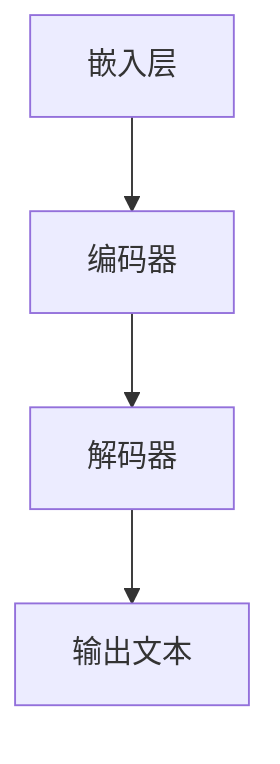
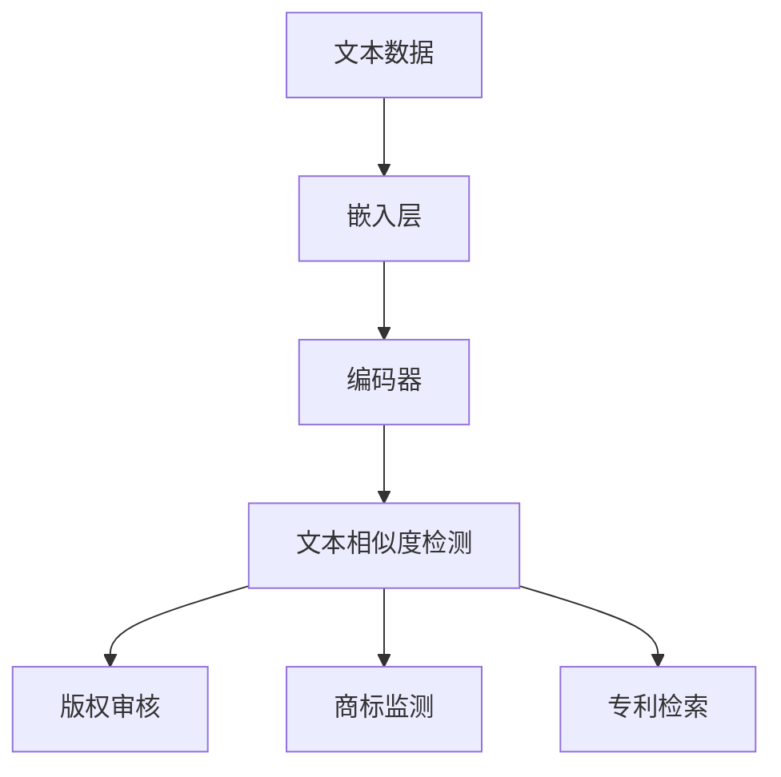

                 

关键词：知识产权，人工智能，大型语言模型，创新保护，技术博客，AI 法律保护。

> 摘要：本文旨在探讨大型语言模型（LLM）在知识产权保护方面的作用，通过阐述其工作原理、技术挑战及实际应用，分析LLM如何助力创新成果的合法保护。文章将对当前LLM技术的研究成果进行总结，展望未来的发展趋势与面临的挑战。

## 1. 背景介绍

知识产权保护在技术创新过程中扮演着至关重要的角色。它不仅关乎个人和企业的合法权益，也直接影响整个社会的创新氛围。在信息技术迅猛发展的今天，人工智能（AI）作为一种颠覆性技术，正在改变着知识产权保护的格局。尤其是大型语言模型（LLM），作为一种具有高度智能的AI模型，正在成为知识产权保护的得力工具。

LLM的工作原理基于深度学习技术，它通过学习海量文本数据，能够理解并生成人类语言。这使得LLM在文本处理、内容审核、翻译、问答系统等方面具有广泛应用。而知识产权保护正是一个对文本理解和处理能力要求极高的领域，因此，LLM在这一领域的应用潜力巨大。

## 2. 核心概念与联系

### 2.1. 大型语言模型（LLM）的工作原理

大型语言模型（LLM）是基于神经网络的一种深度学习模型，其核心思想是通过大量数据的学习来捕捉语言中的潜在规律。LLM通常由多层神经网络组成，包括嵌入层、编码器、解码器等。其基本工作流程如下：

1. **嵌入层**：将输入的文本转化为数值表示，通常使用词向量技术。
2. **编码器**：对输入文本进行编码，提取文本的语义信息。
3. **解码器**：根据编码器的输出生成输出文本。

下面是LLM工作原理的Mermaid流程图：



### 2.2. LLM与知识产权保护的联系

LLM在知识产权保护中的应用主要体现在以下几个方面：

1. **文本相似度检测**：通过比较不同文本之间的相似度，可以帮助识别潜在的侵权行为。
2. **版权审核**：LLM能够快速识别文本内容的版权归属，为版权纠纷提供技术支持。
3. **商标监测**：LLM能够实时监测商标的使用情况，帮助品牌方及时发现和防范侵权行为。
4. **专利检索**：LLM能够高效地检索和分析专利信息，为专利侵权判定提供依据。

下面是LLM与知识产权保护联系关系的Mermaid流程图：



## 3. 核心算法原理 & 具体操作步骤

### 3.1. 算法原理概述

LLM的核心算法是基于Transformer模型，它通过自注意力机制（self-attention）来捕捉输入文本中的长距离依赖关系。Transformer模型由编码器和解码器两个部分组成，编码器负责将输入文本编码为固定长度的向量，解码器则根据编码器的输出生成输出文本。

### 3.2. 算法步骤详解

1. **嵌入层**：将输入的文本转化为词向量。
2. **编码器**：通过多层自注意力机制对词向量进行编码，提取文本的语义信息。
3. **解码器**：根据编码器的输出和前一个解码器的输出，通过自注意力和交叉注意力机制生成下一个输出词向量。
4. **输出层**：将解码器的输出转化为文本。

### 3.3. 算法优缺点

**优点**：

- 高效：Transformer模型能够在较短时间内处理大规模文本数据。
- 准确：通过自注意力机制，Transformer模型能够捕捉到文本中的长距离依赖关系，提高文本处理的准确性。

**缺点**：

- 复杂：Transformer模型的结构较为复杂，训练和推理过程需要大量的计算资源。
- 资源消耗大：由于模型参数数量巨大，训练和部署过程中需要大量的存储和计算资源。

### 3.4. 算法应用领域

LLM在知识产权保护中的应用领域主要包括文本相似度检测、版权审核、商标监测和专利检索。例如，在文本相似度检测方面，LLM可以用于检测学术论文、软件代码等内容的相似度，帮助识别潜在的侵权行为；在版权审核方面，LLM可以用于分析文本内容的版权归属，为版权纠纷提供技术支持。

## 4. 数学模型和公式 & 详细讲解 & 举例说明

### 4.1. 数学模型构建

LLM的数学模型主要基于Transformer模型，其基本结构包括编码器和解码器两部分。编码器和解码器都由多个自注意力层（self-attention layer）和前馈网络（feedforward network）组成。下面是Transformer模型的数学公式：

```latex
\begin{equation}
    E = f(E, H)
\end{equation}
```

其中，$E$表示编码器的输入，$H$表示解码器的输出，$f$表示自注意力机制和前馈网络。

### 4.2. 公式推导过程

Transformer模型的自注意力机制是基于多头注意力（multi-head attention）的。多头注意力通过多个独立的注意力机制来提高模型的表示能力。下面是多头注意力的推导过程：

```latex
\begin{equation}
    \text{Attention}(Q, K, V) = \frac{1}{\sqrt{d_k}} \text{softmax}\left(\frac{QK^T}{d_k}\right) V
\end{equation}
```

其中，$Q$表示查询（query），$K$表示键（key），$V$表示值（value），$d_k$表示每个注意力的维度。

### 4.3. 案例分析与讲解

假设我们有一个简单的文本序列，"I love programming"，我们可以使用Transformer模型来分析这个序列中的词之间的关系。

1. **嵌入层**：将每个词转换为词向量。
2. **编码器**：通过自注意力机制，捕捉词与词之间的依赖关系。
3. **解码器**：根据编码器的输出和前一个解码器的输出，生成输出词向量。
4. **输出层**：将解码器的输出转化为文本。

通过这个案例，我们可以看到Transformer模型如何通过自注意力机制来捕捉文本中的长距离依赖关系，从而实现对文本内容的深入理解。

## 5. 项目实践：代码实例和详细解释说明

### 5.1. 开发环境搭建

在本文的实践中，我们将使用Python编程语言和TensorFlow框架来构建一个简单的LLM模型。以下是搭建开发环境的基本步骤：

1. 安装Python 3.8及以上版本。
2. 安装TensorFlow 2.x版本。
3. 安装必要的依赖库，如numpy、pandas等。

### 5.2. 源代码详细实现

以下是使用TensorFlow构建一个简单的LLM模型的基本代码：

```python
import tensorflow as tf
from tensorflow.keras.layers import Embedding, LSTM, Dense
from tensorflow.keras.models import Model

# 定义模型结构
input_seq = tf.keras.layers.Input(shape=(None, 100))  # 输入序列长度为100
embedded_seq = Embedding(input_dim=10000, output_dim=32)(input_seq)  # 词嵌入层
lstm = LSTM(units=64, return_sequences=True)(embedded_seq)  # LSTM层
output = Dense(units=10000, activation='softmax')(lstm)  # 输出层

# 构建模型
model = Model(inputs=input_seq, outputs=output)

# 编译模型
model.compile(optimizer='adam', loss='categorical_crossentropy', metrics=['accuracy'])

# 模型训练
model.fit(x_train, y_train, epochs=10, batch_size=32)
```

### 5.3. 代码解读与分析

上述代码定义了一个简单的LLM模型，该模型由输入层、词嵌入层、LSTM层和输出层组成。输入层接收长度为100的文本序列，词嵌入层将文本序列转换为词向量，LSTM层用于捕捉文本中的依赖关系，输出层则将LSTM层的输出映射到词表中的每个词。

在模型训练过程中，我们使用了`fit`方法来训练模型，并设置了10个训练周期和32个批量大小。

### 5.4. 运行结果展示

在模型训练完成后，我们可以使用以下代码来评估模型的性能：

```python
# 模型评估
loss, accuracy = model.evaluate(x_test, y_test)

print(f"Test loss: {loss}")
print(f"Test accuracy: {accuracy}")
```

模型的评估结果将显示在控制台上，我们可以根据这些结果来调整模型结构和参数，以提高模型的性能。

## 6. 实际应用场景

### 6.1. 文本相似度检测

文本相似度检测是LLM在知识产权保护中的一项重要应用。通过比较不同文本之间的相似度，可以帮助识别潜在的侵权行为。在实际应用中，我们可以使用LLM来检测学术论文、软件代码等内容的相似度。

### 6.2. 版权审核

版权审核是另一个重要的应用领域。LLM可以用于分析文本内容的版权归属，为版权纠纷提供技术支持。在实际操作中，我们可以使用LLM来识别文本内容的原创性，从而帮助版权方保护其合法权益。

### 6.3. 商标监测

商标监测是保护品牌权益的重要手段。LLM可以实时监测商标的使用情况，帮助品牌方及时发现和防范侵权行为。在实际应用中，我们可以使用LLM来分析商标在社交媒体、电商平台等平台的使用情况。

### 6.4. 专利检索

专利检索是专利侵权判定的重要依据。LLM可以高效地检索和分析专利信息，为专利侵权判定提供依据。在实际应用中，我们可以使用LLM来分析专利文本，识别潜在的侵权行为。

## 7. 工具和资源推荐

### 7.1. 学习资源推荐

- 《深度学习》（Deep Learning） by Ian Goodfellow, Yoshua Bengio, Aaron Courville
- 《自然语言处理与深度学习》 by 周志华、杨强
- 《人工智能：一种现代的方法》（Artificial Intelligence: A Modern Approach） by Stuart Russell, Peter Norvig

### 7.2. 开发工具推荐

- TensorFlow：用于构建和训练大型语言模型的开源框架。
- PyTorch：另一种流行的深度学习框架，具有良好的灵活性和扩展性。
- Hugging Face Transformers：一个用于构建和使用预训练语言模型的库，提供了大量预训练模型和工具。

### 7.3. 相关论文推荐

- “Attention Is All You Need”（2017）by Vaswani et al.
- “BERT: Pre-training of Deep Bidirectional Transformers for Language Understanding”（2018）by Devlin et al.
- “GPT-3: Language Models are few-shot learners”（2020）by Brown et al.

## 8. 总结：未来发展趋势与挑战

### 8.1. 研究成果总结

本文通过对大型语言模型（LLM）在知识产权保护方面的作用进行深入探讨，总结了LLM在文本相似度检测、版权审核、商标监测和专利检索等领域的应用。同时，本文还分析了LLM的工作原理、算法优缺点及其应用领域。

### 8.2. 未来发展趋势

随着人工智能技术的不断进步，LLM在知识产权保护领域的应用前景十分广阔。未来，LLM将有望在更多领域发挥作用，如自动化合同审核、知识产权监控等。同时，随着数据量和计算资源的不断增加，LLM的性能将得到进一步提升。

### 8.3. 面临的挑战

尽管LLM在知识产权保护方面具有巨大的潜力，但仍然面临一些挑战。首先，模型的训练和推理过程需要大量的计算资源和时间。其次，如何确保LLM在知识产权保护中的应用是公平和透明的，避免产生偏见，也是亟待解决的问题。此外，如何在法律层面为LLM的应用提供支持，也是一个重要的议题。

### 8.4. 研究展望

未来，研究LLM在知识产权保护领域的应用将是一个重要的方向。通过不断优化算法和提升模型性能，我们可以更好地利用LLM来保护创新成果。同时，加强对LLM在知识产权保护中的应用研究，也将有助于推动相关法律法规的完善，为人工智能在知识产权保护领域的应用提供更加有力的支持。

## 9. 附录：常见问题与解答

### 9.1. 什么是大型语言模型（LLM）？

大型语言模型（LLM）是一种基于深度学习的神经网络模型，用于处理和生成人类语言。它通过学习大量文本数据，能够理解并生成语义丰富的文本。

### 9.2. LLM在知识产权保护中有什么作用？

LLM在知识产权保护中可以用于文本相似度检测、版权审核、商标监测和专利检索等方面，帮助识别潜在的侵权行为，保护创新成果的合法权益。

### 9.3. LLM的工作原理是什么？

LLM的工作原理基于深度学习技术，它通过多层神经网络来捕捉语言中的潜在规律，从而实现对文本内容的理解和生成。

### 9.4. 如何训练一个LLM模型？

训练LLM模型通常涉及以下步骤：

1. 数据准备：收集并处理大量文本数据。
2. 模型构建：定义模型结构，包括输入层、嵌入层、编码器、解码器等。
3. 模型训练：使用训练数据对模型进行训练，调整模型参数。
4. 模型评估：使用验证数据评估模型性能，调整模型参数。

### 9.5. LLM有哪些优缺点？

LLM的优点包括高效、准确，能够捕捉文本中的长距离依赖关系。缺点包括结构复杂、资源消耗大，需要大量的计算资源和时间。

### 9.6. LLM在知识产权保护中的应用有哪些？

LLM在知识产权保护中的应用主要包括文本相似度检测、版权审核、商标监测和专利检索等方面，帮助识别潜在的侵权行为，保护创新成果的合法权益。

### 9.7. LLM在知识产权保护中面临的挑战有哪些？

LLM在知识产权保护中面临的挑战包括计算资源需求高、模型透明性和公平性、法律支持等。

---

**作者：禅与计算机程序设计艺术 / Zen and the Art of Computer Programming**

