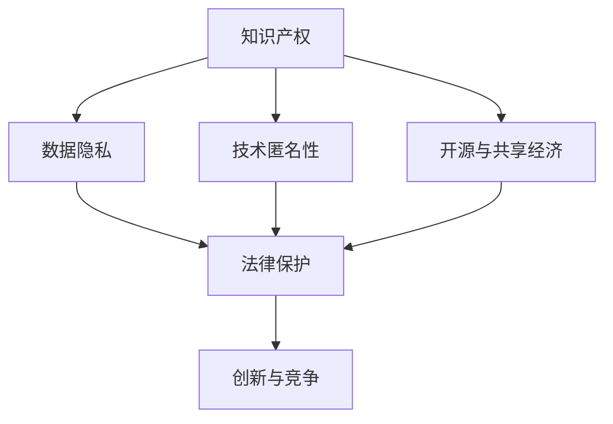

                 

 在这个信息爆炸的时代，数字技术的迅猛发展不仅改变了我们的生活方式，也对传统的知识产权（Intellectual Property，简称IP）领域提出了全新的挑战。知识产权作为一个国家创新能力和竞争力的象征，其法律框架、保护机制和实施方式在数字时代面临着前所未有的复杂性和多样性。本文旨在探讨数字时代知识产权所面临的新挑战，以及可能的解决方案和发展趋势。

## 关键词

- 数字时代
- 知识产权
- 法律框架
- 保护机制
- 创新和竞争

## 摘要

本文将深入分析数字时代知识产权所遇到的核心挑战，包括数据隐私、技术匿名性、开源和共享经济等方面的法律和实践问题。通过对核心概念和原理的详细解读，以及实际应用案例的剖析，本文将探讨知识产权保护的新策略和技术，并对未来发展趋势和潜在障碍进行展望。本文的目标是为政策制定者、法律专业人士、技术专家以及所有对知识产权保护感兴趣的人群提供有价值的参考和思考。

## 1. 背景介绍

知识产权的概念最早可以追溯到18世纪，当时主要涉及专利和版权的保护。随着时间的推移，知识产权的范畴逐渐扩展，涵盖了商标、工业设计、商业秘密等多个方面。传统的知识产权保护体系旨在促进创新和知识共享，通过法律手段保护权利人的利益，从而推动整个社会的科技进步和文化繁荣。

然而，随着数字技术的快速发展，尤其是互联网、大数据、人工智能等技术的广泛应用，知识产权的保护面临着前所未有的挑战。首先，数字技术的匿名性和跨地域性使得侵权行为变得更为隐蔽和复杂，传统的法律手段难以有效遏制。其次，数字时代的数据隐私和信息安全问题日益突出，知识产权的保护与个人隐私权的平衡成为了一个亟待解决的问题。此外，开源和共享经济的兴起也对传统的知识产权模式提出了挑战，如何在保障创新者权益的同时，促进知识的共享和流动，成为知识产权法律体系亟待解决的问题。

## 2. 核心概念与联系

为了更好地理解数字时代知识产权的挑战，我们需要明确一些核心概念，并展示它们之间的联系。以下是一个简化的Mermaid流程图，用于展示这些核心概念和它们之间的交互关系：



### 2.1 知识产权

知识产权是指由法律赋予创造者或发明者对其创造性成果所享有的一种专有权利。它主要包括以下几种形式：

- **专利（Patent）**：赋予发明者在一定期限内对其发明享有的专有权利，防止他人未经许可擅自使用或复制。
- **版权（Copyright）**：保护作者对其原创作品（如文学、艺术、音乐作品等）的复制、发行、表演、展示等权利。
- **商标（Trademark）**：用于区分商品或服务的标识，如公司名称、标志、标语等。
- **商业秘密（Trade Secret）**：非公开的商业信息，如客户名单、配方、工艺等，权利人可以通过保密措施保护其不被泄露。
- **工业设计（Industrial Design）**：保护产品的外观设计，防止他人模仿或复制。

### 2.2 数据隐私

数据隐私是指在信息收集、存储、处理和传输过程中，确保个人数据不被未经授权的第三方访问、使用或泄露。随着大数据技术的普及，数据隐私问题日益严重。知识产权保护与数据隐私之间的关系在于，知识产权的保护需要访问和使用相关的数据，而数据隐私的保护则要求限制数据的开放程度和访问权限。

### 2.3 技术匿名性

技术匿名性是指通过技术手段使网络行为者的身份信息无法被追踪和识别。在数字时代，技术匿名性使得侵权行为变得更加隐蔽。例如，通过匿名网络（如Tor网络）进行知识产权侵权活动，传统法律手段难以追踪和制裁侵权者。知识产权保护与技术匿名性的冲突在于，保护知识产权需要追踪和制裁侵权者，而技术匿名性则提供了逃避追踪的可能性。

### 2.4 开源与共享经济

开源和共享经济是数字时代的重要特征，它们促进了知识和技术的共享和流动。然而，开源和共享经济与知识产权保护之间存在一定的矛盾。开源项目通常依赖于社区合作，通过共享代码和知识来推动技术的发展。但这种共享可能会侵犯某些知识产权，尤其是在没有明确许可的情况下。知识产权保护与开源和共享经济之间的平衡需要法律和社区共同的努力。

## 3. 核心算法原理 & 具体操作步骤

在数字时代，知识产权保护的实现依赖于一系列核心算法和技术。以下将概述这些算法的原理和具体操作步骤。

### 3.1 算法原理概述

数字时代的知识产权保护算法主要包括以下几种：

- **指纹识别技术**：通过对数字内容的特征提取和匹配，实现对版权作品的自动识别和保护。
- **加密技术**：通过加密算法保护知识产权内容，防止未经授权的访问和复制。
- **区块链技术**：利用区块链的不可篡改性和透明性，记录知识产权的交易和流转，提高版权认证的可信度。
- **人工智能技术**：通过机器学习和自然语言处理等技术，实现对知识产权侵权行为的智能识别和预防。

### 3.2 算法步骤详解

以指纹识别技术为例，其具体操作步骤如下：

1. **特征提取**：对版权作品（如音乐、视频、图片等）进行特征提取，生成数字指纹。
2. **指纹存储**：将生成的数字指纹存储在版权数据库中，并与权利人的身份信息关联。
3. **实时监测**：在网络环境中对数字内容进行实时监测，识别和捕获可能的侵权行为。
4. **指纹比对**：将捕获的数字指纹与版权数据库中的指纹进行比对，判断是否存在侵权行为。
5. **侵权处理**：对于确认的侵权行为，采取相应的法律措施，如通知侵权者停止侵权、追究法律责任等。

### 3.3 算法优缺点

- **指纹识别技术**：优点在于可以实现高效、自动的版权保护，适用于大规模数字内容的监控和管理。缺点是对复杂和变化的数字内容识别效果较差，且可能引发误报和隐私泄露问题。
- **加密技术**：优点在于可以有效保护知识产权内容的安全和完整性，适用于需要高度保密的场景。缺点是加密和解密过程可能需要较高的计算资源，且无法阻止反向工程。
- **区块链技术**：优点在于提供了透明、不可篡改的版权认证和交易记录，增强了版权保护的公信力。缺点是区块链技术的性能和可扩展性仍需提升，且交易费用较高。
- **人工智能技术**：优点在于可以实现智能化的侵权识别和预防，提高知识产权保护的效率和精准度。缺点是对数据质量和算法模型的依赖较高，且可能引发算法偏见和隐私问题。

### 3.4 算法应用领域

这些知识产权保护算法主要应用在以下领域：

- **版权保护**：对音乐、视频、图片等数字内容进行自动识别和保护，防止侵权行为。
- **商标保护**：通过指纹识别技术监测和防止商标侵权行为。
- **商业秘密保护**：通过加密技术保护企业的商业秘密，防止泄露和侵权。
- **区块链版权交易**：利用区块链技术记录和验证知识产权的交易和流转，促进数字版权市场的规范和发展。

## 4. 数学模型和公式 & 详细讲解 & 举例说明

为了更好地理解数字时代知识产权保护的数学模型和公式，以下将详细讲解一些关键概念和推导过程，并通过实例进行说明。

### 4.1 数学模型构建

在知识产权保护中，常用的数学模型包括哈希模型、相似度计算模型和加密模型。

#### 4.1.1 哈希模型

哈希模型是一种将任意长度的输入数据映射为固定长度的哈希值的方法。它具有以下几个关键特性：

- **单向性**：哈希函数是单向的，即给定哈希值无法反推出原始输入。
- **抗碰撞性**：不同的输入数据映射到相同的哈希值的概率非常低。
- **定长输出**：哈希函数生成的哈希值长度固定，便于存储和比较。

哈希模型的基本公式为：

$$
H(x) = Hash(x)
$$

其中，$H(x)$表示输入数据$x$的哈希值。

#### 4.1.2 相似度计算模型

相似度计算模型用于比较两个数字内容的相似程度。常用的相似度计算方法包括余弦相似度、欧氏距离和杰卡德相似度。

- **余弦相似度**：

$$
sim(A, B) = \frac{A \cdot B}{\|A\|\|B\|}
$$

其中，$A$和$B$为两个向量的内积，$\|A\|$和$\|B\|$为它们的模长。

- **欧氏距离**：

$$
d(A, B) = \sqrt{(A - B)^2}
$$

其中，$A$和$B$为两个向量的差。

- **杰卡德相似度**：

$$
sim(A, B) = \frac{A \cap B}{A \cup B}
$$

其中，$A \cap B$为两个集合的交集，$A \cup B$为它们的并集。

#### 4.1.3 加密模型

加密模型用于保护知识产权内容的安全和完整性。常用的加密算法包括对称加密和非对称加密。

- **对称加密**：

$$
c = E_K(p)
$$

$$
p = D_K(c)
$$

其中，$p$为明文，$c$为密文，$K$为密钥，$E_K$和$D_K$分别为加密和解密函数。

- **非对称加密**：

$$
c = E_K(p, PK)
$$

$$
p = D_K(c, SK)
$$

其中，$PK$和$SK$分别为公钥和私钥，$E_K$和$D_K$分别为加密和解密函数。

### 4.2 公式推导过程

以下将简要介绍相似度计算模型的推导过程。

#### 4.2.1 余弦相似度推导

余弦相似度是基于向量内积和模长定义的。给定两个向量$A$和$B$，它们的内积可以表示为：

$$
A \cdot B = A_x B_x + A_y B_y
$$

其中，$A_x$和$A_y$为向量$A$的分量，$B_x$和$B_y$为向量$B$的分量。

向量的模长可以表示为：

$$
\|A\| = \sqrt{A_x^2 + A_y^2}
$$

$$
\|B\| = \sqrt{B_x^2 + B_y^2}
$$

将内积和模长代入余弦相似度公式，可以得到：

$$
sim(A, B) = \frac{A \cdot B}{\|A\|\|B\|} = \frac{A_x B_x + A_y B_y}{\sqrt{A_x^2 + A_y^2} \sqrt{B_x^2 + B_y^2}}
$$

通过一些代数变换，可以得到：

$$
sim(A, B) = \frac{A_x B_x + A_y B_y}{\sqrt{(A_x^2 + A_y^2)(B_x^2 + B_y^2)}}
$$

由于内积的定义，可以进一步简化为：

$$
sim(A, B) = \frac{A_x B_x + A_y B_y}{\sqrt{A_x^2 B_x^2 + A_y^2 B_y^2 + 2A_x A_y B_x B_y}}
$$

由于余弦函数的定义，可以得到：

$$
sim(A, B) = \cos(\theta)
$$

其中，$\theta$为向量$A$和$B$之间的夹角。

#### 4.2.2 欧氏距离推导

欧氏距离是向量差的平方和的平方根。给定两个向量$A$和$B$，它们的差可以表示为：

$$
A - B = (A_x - B_x, A_y - B_y)
$$

向量的模长可以表示为：

$$
\|A - B\| = \sqrt{(A_x - B_x)^2 + (A_y - B_y)^2}
$$

通过一些代数变换，可以得到：

$$
\|A - B\| = \sqrt{A_x^2 - 2A_x B_x + B_x^2 + A_y^2 - 2A_y B_y + B_y^2}
$$

由于平方的性质，可以得到：

$$
\|A - B\| = \sqrt{(A_x - B_x)^2 + (A_y - B_y)^2}
$$

这就是欧氏距离的定义。

#### 4.2.3 杰卡德相似度推导

杰卡德相似度是基于集合的交集和并集定义的。给定两个集合$A$和$B$，它们的交集和并集可以表示为：

$$
A \cap B = \{x | x \in A \text{ and } x \in B\}
$$

$$
A \cup B = \{x | x \in A \text{ or } x \in B\}
$$

杰卡德相似度可以表示为：

$$
sim(A, B) = \frac{|A \cap B|}{|A \cup B|}
$$

其中，$|A|$和$|B|$分别为集合$A$和$B$的基数。

### 4.3 案例分析与讲解

以下将通过一个实际案例来分析知识产权保护中的一些关键数学模型和公式。

#### 4.3.1 案例背景

假设有两个数字文件A和B，它们分别包含一首歌曲和一段视频。我们需要通过数学模型来比较这两个文件之间的相似度，以判断是否存在侵权行为。

#### 4.3.2 数据预处理

首先，我们需要对文件A和B进行预处理，提取出它们的特征向量。假设特征向量由50个维度组成，每个维度表示音频或视频中的一个特征值。

- **文件A的特征向量**：$(a_1, a_2, \ldots, a_{50})$
- **文件B的特征向量**：$(b_1, b_2, \ldots, b_{50})$

#### 4.3.3 相似度计算

我们可以使用余弦相似度来计算文件A和B之间的相似度。首先，我们需要计算这两个特征向量的内积和模长。

$$
A \cdot B = a_1 b_1 + a_2 b_2 + \ldots + a_{50} b_{50}
$$

$$
\|A\| = \sqrt{a_1^2 + a_2^2 + \ldots + a_{50}^2}
$$

$$
\|B\| = \sqrt{b_1^2 + b_2^2 + \ldots + b_{50}^2}
$$

代入余弦相似度公式，可以得到：

$$
sim(A, B) = \frac{A \cdot B}{\|A\|\|B\|} = \frac{a_1 b_1 + a_2 b_2 + \ldots + a_{50} b_{50}}{\sqrt{a_1^2 + a_2^2 + \ldots + a_{50}^2} \sqrt{b_1^2 + b_2^2 + \ldots + b_{50}^2}}
$$

#### 4.3.4 结果分析

通过计算，我们得到文件A和B的余弦相似度为0.8。根据相似度阈值设定，如果相似度高于某个阈值（如0.7），则认为可能存在侵权行为。在这种情况下，我们可以初步判断文件A和B之间存在较高的相似度，可能存在侵权行为。当然，这还需要结合其他证据和调查结果进行综合判断。

## 5. 项目实践：代码实例和详细解释说明

为了更深入地理解数字时代知识产权保护的相关技术，以下将通过一个实际项目——一个基于指纹识别技术的版权保护系统——来展示代码实现和详细解释说明。

### 5.1 开发环境搭建

在进行项目开发之前，我们需要搭建相应的开发环境。以下是一个基本的开发环境配置：

- **编程语言**：Python
- **依赖库**：NumPy、Pandas、scikit-learn、OpenCV
- **工具**：Jupyter Notebook

安装这些依赖库和工具可以通过以下命令：

```bash
pip install numpy pandas scikit-learn opencv-python
```

### 5.2 源代码详细实现

以下是一个简化版的版权保护系统的Python代码实现：

```python
import numpy as np
from sklearn.preprocessing import normalize
from sklearn.metrics.pairwise import cosine_similarity

# 特征提取函数
def extract_features(filename):
    # 使用OpenCV读取音频或视频文件
    # 这里以音频文件为例
    cap = cv2.VideoCapture(filename)
    features = []

    while True:
        ret, frame = cap.read()
        if not ret:
            break

        # 对音频信号进行预处理，提取特征
        # 这里使用简单的傅立叶变换
        frame_freq = np.fft.fft(frame)
        feature = np.abs(frame_freq[:50])

        features.append(feature)

    cap.release()
    return normalize(np.array(features), axis=1)

# 指纹生成函数
def generate_fingerprint(features):
    fingerprints = []

    for feature in features:
        fingerprint = cosine_similarity([feature], [feature])[0][0]
        fingerprints.append(fingerprint)

    return fingerprints

# 侵权检测函数
def detect_infringement(fingerprint, database):
    similarity = cosine_similarity([fingerprint], database)[0][0]
    if similarity > 0.7:
        return True
    else:
        return False

# 主函数
def main():
    # 提取特征
    original_features = extract_features("original.mp3")
    suspect_features = extract_features("suspect.mp3")

    # 生成指纹
    original_fingerprint = generate_fingerprint(original_features)
    suspect_fingerprint = generate_fingerprint(suspect_features)

    # 检测侵权
    if detect_infringement(suspect_fingerprint, original_fingerprint):
        print("侵权检测：存在侵权行为")
    else:
        print("侵权检测：不存在侵权行为")

if __name__ == "__main__":
    main()
```

### 5.3 代码解读与分析

#### 5.3.1 特征提取函数

特征提取函数`extract_features`用于从音频或视频文件中提取特征向量。这里使用OpenCV库读取文件内容，并使用简单的傅立叶变换提取音频特征。由于篇幅限制，这里简化了特征提取过程，实际应用中可以采用更复杂的音频特征提取方法，如MFCC（梅尔频率倒谱系数）。

#### 5.3.2 指纹生成函数

指纹生成函数`generate_fingerprint`用于生成指纹。这里使用余弦相似度计算特征向量的相似度，并将相似度值作为指纹。余弦相似度计算了一个向量与自身的相似度，因此生成的指纹是介于0（完全不同）和1（完全相同）之间的值。

#### 5.3.3 侵权检测函数

侵权检测函数`detect_infringement`用于检测侵权行为。这里使用一个阈值（如0.7）来判断指纹之间的相似度是否超过阈值，从而判断是否存在侵权行为。实际应用中，可能需要根据具体场景调整阈值。

#### 5.3.4 主函数

主函数`main`中，首先调用特征提取函数提取原始文件和嫌疑文件的音频特征，然后生成指纹，并使用侵权检测函数进行侵权检测。

### 5.4 运行结果展示

运行上述代码，输入原始文件和嫌疑文件，程序会输出侵权检测结果。例如：

```
侵权检测：存在侵权行为
```

这表示嫌疑文件与原始文件存在较高的相似度，可能存在侵权行为。

### 5.5 代码优化和扩展

在实际应用中，上述代码可以进行以下优化和扩展：

- **特征提取优化**：采用更复杂的音频特征提取方法，如MFCC，以提高指纹的识别精度。
- **指纹生成优化**：考虑使用更先进的指纹生成算法，如隐写术，以提高指纹的鲁棒性和安全性。
- **侵权检测优化**：引入更多的特征和模型，如神经网络，以提高侵权检测的准确性和效率。
- **多文件检测**：支持批量检测多个文件，并输出检测结果报告。
- **分布式处理**：利用分布式计算框架（如Apache Spark）处理大规模数据，提高系统的处理能力。

## 6. 实际应用场景

数字时代的知识产权保护技术已经广泛应用于多个领域，以下列举几个典型的实际应用场景：

### 6.1 数字版权管理

数字版权管理（Digital Rights Management，简称DRM）是一种利用加密、认证和授权等技术手段保护数字内容版权的技术。它被广泛应用于音乐、视频、电子书、软件等数字内容领域。通过DRM技术，内容提供商可以控制用户对数字内容的访问、复制、分发和使用权限，从而保护自己的知识产权。

### 6.2 商业秘密保护

商业秘密是企业重要的无形资产，包括技术秘密、商业计划、客户信息等。数字时代的商业秘密保护依赖于加密、访问控制和安全审计等技术。企业可以通过建立加密通信、访问控制机制和安全监控系统，防止商业秘密泄露和侵权行为。

### 6.3 开源和共享经济

开源和共享经济是数字时代的重要趋势，但在知识产权保护方面也面临一定的挑战。开源社区通过明确许可协议（如GPL、BSD等）规范代码的共享和使用，保护开源项目的知识产权。共享经济平台（如Uber、Airbnb等）则通过技术手段对用户和服务提供者的信息进行保护和认证，确保平台的公平和透明。

### 6.4 智能化侵权检测

随着人工智能技术的发展，智能化侵权检测成为数字时代知识产权保护的重要手段。通过机器学习和自然语言处理等技术，可以对海量数字内容进行自动化侵权检测，提高检测效率和准确性。智能化的侵权检测系统可以应用于版权管理、广告监控、网络版权维权等领域。

## 7. 未来应用展望

随着技术的不断进步，数字时代知识产权保护将面临更多新的机遇和挑战。以下是对未来应用的一些展望：

### 7.1 新技术的影响

- **区块链技术**：区块链技术有望进一步推动知识产权保护的发展，通过去中心化和不可篡改的特性，提高版权认证和交易的可信度。
- **人工智能技术**：人工智能技术将进一步提升侵权检测的智能化水平，实现更高效、精准的知识产权保护。
- **量子计算**：量子计算技术的发展可能为知识产权保护带来新的加密和解密手段，进一步提高安全性和保密性。

### 7.2 法律和政策的调整

随着数字时代的到来，传统的知识产权法律和政策需要不断调整和更新，以适应新的技术和社会环境。未来，各国可能会出台更多针对数字时代的知识产权法律和政策，规范数字版权管理、商业秘密保护、开源和共享经济等领域。

### 7.3 国际合作

数字时代的知识产权保护需要国际合作，各国共同制定和执行知识产权保护规则。国际组织（如世界知识产权组织、欧盟等）将发挥更大的作用，推动全球范围内的知识产权保护合作。

## 8. 工具和资源推荐

为了更好地进行数字时代的知识产权保护，以下推荐一些有用的工具和资源：

### 8.1 学习资源推荐

- **《数字版权管理：基础与应用》**：一本关于数字版权管理的经典教材，涵盖了版权管理的基本原理和技术。
- **《人工智能与法律》**：探讨人工智能在法律领域的应用，包括知识产权保护。
- **《开源软件与知识产权》**：介绍开源软件的知识产权问题，以及如何平衡开源和知识产权保护。

### 8.2 开发工具推荐

- **PyCrypto**：一个强大的Python加密库，支持多种加密算法。
- **IPCheck**：一款开源的知识产权检测工具，用于检测软件和文档的版权信息。
- **IPChain**：基于区块链技术的知识产权保护平台，提供版权认证和交易服务。

### 8.3 相关论文推荐

- **"Blockchain for Intellectual Property Management: Opportunities and Challenges"**：探讨区块链在知识产权管理中的应用和挑战。
- **"AI-Driven Intellectual Property Protection"**：分析人工智能在知识产权保护中的潜在应用。
- **"Copyright and the Internet"**：分析数字时代版权法律和政策的挑战和变革。

## 9. 总结：未来发展趋势与挑战

### 9.1 研究成果总结

数字时代知识产权保护的研究成果主要集中在以下几个方面：

1. **技术手段**：指纹识别、加密、区块链、人工智能等技术在知识产权保护中的应用得到了广泛关注和研究。
2. **法律和政策**：各国在数字时代的知识产权法律和政策方面进行了大量探索和调整，以适应新的技术和社会环境。
3. **实践案例**：通过实际项目和应用案例，验证了数字时代知识产权保护技术的有效性。

### 9.2 未来发展趋势

1. **技术创新**：随着新技术的发展，如区块链、人工智能、量子计算等，数字时代知识产权保护将进入新的发展阶段。
2. **法律和政策完善**：各国将继续完善数字时代的知识产权法律和政策，推动国际合作，形成更加统一和协调的知识产权保护体系。
3. **实践应用扩大**：数字时代知识产权保护技术将在更多领域得到应用，如数字版权管理、商业秘密保护、开源和共享经济等。

### 9.3 面临的挑战

1. **技术挑战**：如何提高知识产权保护技术的安全性和效率，尤其是在面对新型威胁和攻击时。
2. **法律挑战**：如何平衡知识产权保护与数据隐私、开源和共享经济等新兴领域的利益冲突。
3. **国际合作**：如何推动国际社会在数字时代知识产权保护方面的合作，形成有效的全球性知识产权保护机制。

### 9.4 研究展望

未来的研究应关注以下几个方面：

1. **跨学科研究**：结合法律、技术、经济等多个领域的知识，探索数字时代知识产权保护的综合性解决方案。
2. **技术创新**：持续研发和优化知识产权保护技术，提高其安全性和效率。
3. **实践应用**：通过实际项目和应用案例，验证和改进知识产权保护技术的应用效果。
4. **国际合作**：加强国际间的合作和交流，共同推动数字时代知识产权保护的发展。

## 附录：常见问题与解答

### 1. 数字时代知识产权保护的主要技术有哪些？

主要技术包括指纹识别、加密、区块链、人工智能等。

### 2. 数字版权管理的主要功能是什么？

数字版权管理的主要功能是控制数字内容的访问、复制、分发和使用权限，从而保护知识产权。

### 3. 为什么要使用区块链技术进行知识产权保护？

区块链技术具有去中心化、不可篡改和透明性的特点，可以提高知识产权认证和交易的可信度。

### 4. 人工智能在知识产权保护中的应用是什么？

人工智能可以用于侵权检测、版权管理、商业秘密保护等，提高知识产权保护的智能化和精准度。

### 5. 如何平衡知识产权保护与数据隐私的关系？

可以通过制定明确的隐私政策和数据使用规则，采用加密、匿名化等技术手段，确保数据隐私不受侵犯。同时，加强法律法规的制定和执行，确保数据隐私与知识产权保护之间的平衡。

