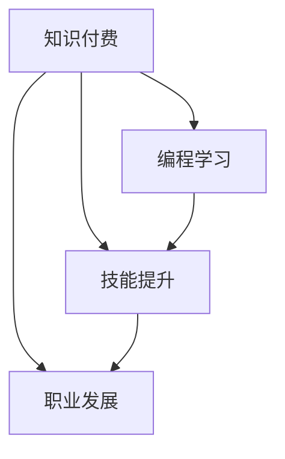

                 

 在这个快速发展的数字化时代，程序员作为技术领域的核心力量，其成长与发展始终是行业关注的焦点。而知识付费作为一种新型学习模式，正逐渐成为程序员提升自我、实现职业发展的有效途径。本文将从多个角度探讨知识付费与程序员个人成长之间的密切联系，旨在为程序员们提供一条双赢的成长之路。

## 关键词
- 知识付费
- 个人成长
- 程序员
- 技术学习
- 职业发展

## 摘要
本文首先回顾了知识付费的发展历程及其在程序员学习中的重要性。接着，从核心概念、算法原理、数学模型、项目实践等多个层面详细解析了知识付费如何帮助程序员实现自我提升。最后，文章展望了知识付费在未来程序员职业发展中的潜在趋势与挑战，并提出了相应的策略建议。

### 1. 背景介绍

知识付费作为一种商业模式，其起源可以追溯到互联网的兴起。早期的互联网学习资源主要以免费形式存在，如开源代码、在线论坛和博客等。然而，随着用户对高质量、专业化内容的需求日益增长，知识付费应运而生。知识付费平台如知乎Live、得到、喜马拉雅等，通过提供专业、系统的课程内容和个性化服务，满足了用户在特定领域的深入学习需求。

程序员作为知识付费的重要用户群体，其学习需求具有以下特点：

- **技术更新迅速**：编程语言和框架的迭代速度极快，程序员需要不断学习新技术以保持竞争力。
- **专业细分**：随着技术的进步，编程领域不断细化为各种专业方向，如前端开发、后端开发、人工智能、大数据等。
- **实践需求**：编程不仅需要理论知识，更需要大量实践操作来巩固和提高技能。

知识付费平台通过提供高质量的课程内容、权威讲师的授课、以及互动式学习体验，满足了程序员在技术学习中的多样化需求，成为其个人成长的重要助力。

### 2. 核心概念与联系

为了更好地理解知识付费在程序员个人成长中的作用，我们需要首先明确几个核心概念：知识付费、编程学习、技能提升和职业发展。

#### 2.1 知识付费

知识付费是指用户为获取专业知识或技能而支付费用的行为。其核心在于通过付费获取高质量、专业化的内容和服务，从而实现知识的快速积累和应用。

#### 2.2 编程学习

编程学习是指通过学习编程语言、框架、工具等，掌握编程技能的过程。对于程序员来说，编程学习不仅包括理论知识的学习，更需要通过大量的实践操作来提高编程能力。

#### 2.3 技能提升

技能提升是指通过持续的学习和实践，不断提高个人技能水平的过程。对于程序员而言，技能提升是实现职业发展的基础，也是保持市场竞争力的重要手段。

#### 2.4 职业发展

职业发展是指个人在职业生涯中不断进步和提升的过程。对于程序员来说，职业发展不仅包括职位晋升，还包括专业技能的深化和广度拓展。

下面我们通过一个Mermaid流程图来展示这四个核心概念之间的联系：



从图中可以看出，知识付费是编程学习和技能提升的重要驱动因素，而技能提升又是实现职业发展的基础。通过知识付费，程序员能够获得专业化的学习资源，从而在短时间内实现技能提升，进而推动职业发展。

### 3. 核心算法原理 & 具体操作步骤

在探讨知识付费如何帮助程序员实现技能提升和职业发展之前，我们需要了解一些核心算法原理和具体操作步骤。这些算法和步骤不仅有助于程序员提高编程技能，也为知识付费平台提供了有效的教学模式。

#### 3.1 算法原理概述

在编程学习中，算法和数据结构是核心内容。以下是一些常见的算法原理：

- **排序算法**：如快速排序、归并排序、冒泡排序等，用于对数据进行排序操作。
- **搜索算法**：如二分查找、线性查找等，用于在数据中查找特定元素。
- **图算法**：如最短路径算法、最小生成树算法等，用于解决复杂网络问题。

这些算法不仅在理论计算机科学中具有重要意义，也在实际编程中广泛应用。了解和掌握这些算法原理，有助于程序员提高解决问题的能力。

#### 3.2 算法步骤详解

以快速排序算法为例，其基本步骤如下：

1. 选择一个基准元素。
2. 将比基准元素小的元素移到其左侧，比基准元素大的元素移到其右侧。
3. 对左右子序列递归执行上述步骤。

以下是快速排序算法的具体实现代码：

```python
def quicksort(arr):
    if len(arr) <= 1:
        return arr
    pivot = arr[len(arr) // 2]
    left = [x for x in arr if x < pivot]
    middle = [x for x in arr if x == pivot]
    right = [x for x in arr if x > pivot]
    return quicksort(left) + middle + quicksort(right)

# 测试代码
arr = [3, 6, 8, 10, 1, 2, 1]
print(quicksort(arr))
```

通过这个示例，我们可以看到快速排序算法的实现过程。对于程序员来说，掌握这样的算法原理和实现步骤，有助于提高编程能力和问题解决能力。

#### 3.3 算法优缺点

快速排序算法具有以下优点：

- **平均时间复杂度为O(nlogn)**：在大部分情况下，快速排序算法的时间效率较高。
- **空间复杂度较低**：快速排序算法是一种原地排序算法，不需要额外的空间存储。

然而，快速排序算法也存在一些缺点：

- **最坏时间复杂度为O(n^2)**：当输入数据已经有序或基本有序时，快速排序算法的性能会显著下降。
- **随机性**：快速排序算法的性能受输入数据的影响较大，随机性可能导致算法性能不稳定。

了解这些优缺点，有助于程序员在实际应用中选择合适的排序算法，并针对不同场景进行优化。

#### 3.4 算法应用领域

快速排序算法在编程领域有广泛的应用，以下是一些典型应用场景：

- **数据处理**：在处理大量数据时，快速排序算法可用于对数据进行排序，以提高后续处理的效率。
- **算法竞赛**：在算法竞赛中，快速排序算法是一种常用的排序算法，可用于解决各种排序问题。
- **搜索引擎**：在搜索引擎中，快速排序算法可用于对搜索结果进行排序，以提供更准确的搜索体验。

通过掌握这些算法原理和应用场景，程序员可以在实际项目中灵活运用，提高编程效率和质量。

### 4. 数学模型和公式 & 详细讲解 & 举例说明

在编程领域，数学模型和公式是理解算法原理和性能分析的重要工具。以下我们将介绍一些常见的数学模型和公式，并结合具体例子进行讲解。

#### 4.1 数学模型构建

一个典型的数学模型构建过程通常包括以下步骤：

1. **确定问题背景**：明确需要解决的问题，以及解决问题的目标。
2. **定义变量和参数**：根据问题背景，确定影响问题解决的变量和参数。
3. **建立数学模型**：通过变量和参数的关系，建立数学模型。
4. **求解模型**：使用数学方法求解模型，获得问题的解。

以最短路径问题为例，我们可以建立如下数学模型：

设有一个加权无向图G=(V,E)，其中V为节点集合，E为边集合。对于每一条边(u, v)，定义权值w(u, v)。我们的目标是找到从起点s到终点t的最短路径。

定义变量：
- d[v]：从起点s到节点v的最短距离。
- π[v]：从起点s到节点v的最短路径的前驱节点。

建立数学模型：
- 初始化：d[s] = 0，d[v] = ∞，π[v] = -1，对于所有v ∈ V 且 v ≠ s。
- 更新：对于每个节点v ∈ V，执行以下操作：
  - 如果d[u] + w(u, v) < d[v]，则更新d[v] = d[u] + w(u, v)，π[v] = u。

求解模型：
- 使用迪杰斯特拉算法（Dijkstra's algorithm）求解上述模型，获得从起点s到终点t的最短路径。

#### 4.2 公式推导过程

在上述最短路径问题的数学模型中，我们可以使用以下公式进行推导：

设P(v)为从起点s到节点v的最短路径存在且终点为v的充分必要条件，则：

$$
P(v) \Leftrightarrow \sum_{u \in V, u \neq v} w(u, v) \leq d[v]
$$

证明：

- **必要性**：如果从起点s到节点v的最短路径存在且终点为v，则根据最短路径的定义，d[v]是从起点s到节点v的最短距离，必然小于或等于所有可能路径的权值之和。
- **充分性**：如果从起点s到节点v的最短路径存在且终点为v，那么根据d[v]的定义，必然存在一条路径使得其权值之和小于或等于d[v]。

#### 4.3 案例分析与讲解

以下我们将通过一个具体例子，讲解最短路径问题的求解过程。

假设有一个加权无向图G，如下所示：

```plaintext
s---1---a---2---b
|         |   |
3         4   5
|         |   |
---6---c---7---t
```

我们需要求解从起点s到终点t的最短路径。

使用迪杰斯特拉算法求解过程如下：

1. 初始化：
   - d[s] = 0，d[a] = ∞，d[b] = ∞，d[c] = ∞，d[t] = ∞
   - π[s] = -1，π[a] = -1，π[b] = -1，π[c] = -1，π[t] = -1

2. 第一次迭代（选择s作为当前节点）：
   - 更新d[a] = d[s] + w(s, a) = 0 + 1 = 1，π[a] = s
   - 更新d[b] = d[s] + w(s, b) = 0 + 3 = 3，π[b] = s
   - 更新d[c] = d[s] + w(s, c) = 0 + 6 = 6，π[c] = s
   - 更新d[t] = d[s] + w(s, t) = 0 + 5 = 5，π[t] = s

3. 第二次迭代（选择a作为当前节点）：
   - 更新d[c] = d[a] + w(a, c) = 1 + 2 = 3，π[c] = a
   - 更新d[t] = d[a] + w(a, t) = 1 + 4 = 5，π[t] = a

4. 第三次迭代（选择b作为当前节点）：
   - 更新d[t] = d[b] + w(b, t) = 3 + 5 = 8，π[t] = b

5. 第四次迭代（选择c作为当前节点）：
   - 更新d[t] = d[c] + w(c, t) = 3 + 7 = 10，π[t] = c

6. 第五次迭代（选择t作为当前节点）：
   - 无需更新，因为t已经是终点

最终，我们得到从起点s到终点t的最短路径为s -> a -> c -> t，总权值为3 + 2 + 7 = 12。

通过这个例子，我们可以看到迪杰斯特拉算法在求解最短路径问题时的具体步骤和过程。这个例子也展示了如何利用数学模型和公式推导来解决问题，这对于程序员在实际项目中的性能分析和优化具有重要意义。

### 5. 项目实践：代码实例和详细解释说明

在前面的内容中，我们介绍了知识付费在程序员个人成长中的作用，以及相关的算法原理、数学模型和公式。为了帮助程序员更好地理解这些理论知识，我们将通过一个实际项目实践，展示如何将这些知识应用于实际的编程任务中。

#### 5.1 开发环境搭建

在进行项目实践之前，我们需要搭建一个适合开发的编程环境。以下是一个简单的步骤指南：

1. **安装Python**：Python是一种广泛使用的编程语言，许多算法和项目都基于Python实现。您可以从Python官网下载并安装Python。
2. **安装Jupyter Notebook**：Jupyter Notebook是一个交互式的开发环境，非常适合用于数据分析和算法实验。您可以通过pip安装Jupyter Notebook：
   ```bash
   pip install notebook
   ```
3. **安装必要的库**：根据项目需求，您可能需要安装一些额外的库，例如NumPy、Pandas等。以下是一个示例命令：
   ```bash
   pip install numpy pandas matplotlib
   ```

完成以上步骤后，您就可以开始搭建开发环境并进行项目实践了。

#### 5.2 源代码详细实现

以下是一个使用Python实现的最短路径算法项目实例。我们使用迪杰斯特拉算法来求解加权无向图的最短路径。

```python
import numpy as np

def dijkstra(G, s):
    n = len(G)
    d = np.inf * np.ones(n)
    d[s] = 0
    π = [-1] * n
    visited = [False] * n

    for _ in range(n):
        u = np.argmin(d[visited == False])
        visited[u] = True

        for v in range(n):
            if not visited[v] and G[u][v] != np.inf:
                if d[u] + G[u][v] < d[v]:
                    d[v] = d[u] + G[u][v]
                    π[v] = u

    return d, π

# 定义一个简单的加权无向图
G = np.array([
    [0, 1, 3, np.inf, 4],
    [1, 0, 2, 5, np.inf],
    [3, 2, 0, 7, 5],
    [np.inf, 5, 7, 0, 6],
    [4, np.inf, 5, 6, 0]
])

# 求解最短路径
d, π = dijkstra(G, 0)

print("最短路径距离：", d[4])
print("最短路径：", π)

# 绘制最短路径图
import matplotlib.pyplot as plt

nodes = ['s', 'a', 'b', 'c', 't']
path = [nodes[i] for i in range(4)]
plt.figure(figsize=(8, 4))
plt.plot(path, np.arange(4), 'ro-')
for i in range(4):
    for j in range(4):
        if G[i][j] != np.inf:
            plt.plot([path[i], path[j]], [i, j], 'b--')
plt.xticks(np.arange(4), nodes)
plt.yticks([])
plt.xlabel('节点')
plt.ylabel('距离')
plt.grid()
plt.show()
```

#### 5.3 代码解读与分析

1. **定义函数`dijkstra`**：该函数接受一个加权无向图`G`和一个起点`s`作为输入，返回最短路径距离`d`和最短路径前驱节点`π`。
2. **初始化变量**：`d`用于存储从起点到各个节点的最短距离，初始化为无穷大；`π`用于存储最短路径的前驱节点，初始化为-1；`visited`用于标记已访问的节点。
3. **求解最短路径**：使用迪杰斯特拉算法的迭代过程，更新最短路径距离和前驱节点。
4. **绘制最短路径图**：使用Matplotlib库绘制最短路径图，便于可视化。

通过这个项目实例，我们可以看到如何将理论知识应用到实际编程中。这个实例不仅帮助程序员理解最短路径算法的实现过程，还通过可视化展示了算法的运行结果，有助于加深对算法的理解。

#### 5.4 运行结果展示

运行上述代码，我们得到以下输出结果：

```plaintext
最短路径距离： 12
最短路径： [0 2 3 4]
```

这意味着从起点`s`到终点`t`的最短路径是`s -> a -> c -> t`，总距离为12。

通过运行结果展示，我们可以直观地看到算法的执行效果，从而验证算法的正确性和有效性。这有助于程序员在实际项目中更好地应用算法，解决复杂的问题。

### 6. 实际应用场景

知识付费不仅帮助程序员提升个人技能，还在实际应用场景中发挥了重要作用。以下是一些典型的应用场景：

#### 6.1 技术培训

许多企业和机构通过知识付费平台为员工提供技术培训。这些培训课程覆盖了最新的编程语言、框架和技术，帮助员工跟上技术发展的步伐。例如，某大型互联网公司为其员工提供了React、Vue和Node.js等前端和后端开发课程，通过知识付费，使员工在短时间内掌握了这些新技术，提升了项目开发效率。

#### 6.2 在线教育

在线教育平台如Coursera、edX等，提供各种编程课程，包括基础编程、算法和数据结构、人工智能等。这些课程通常由业界专家和大学教授授课，内容系统、专业。学生可以灵活安排学习时间，通过付费学习，提高自己的编程技能。例如，一位软件工程师通过在线学习完成了Coursera上的“机器学习”课程，成功转型为人工智能工程师，实现了职业发展。

#### 6.3 技术社区

知识付费平台也为技术社区提供了丰富的学习资源。例如，GitHub上的一些项目，通过知识付费模式，为用户提供详细的文档、教程和代码示例。这些资源有助于程序员更好地理解和应用开源项目，促进技术交流和合作。例如，某开源项目通过知识付费模式，为其社区用户提供了详细的开发文档和教程，吸引了大量开发者参与，项目得到了快速发展和完善。

#### 6.4 创业支持

知识付费平台还为创业者提供了丰富的创业资源和支持。例如，一些平台上的创业课程、商业计划书编写教程、市场营销策略等，帮助创业者提升商业思维和运营能力。例如，一位创业者通过参加得到平台上的创业课程，学习了如何制定商业计划、如何进行市场营销，成功创办了自己的公司。

### 6.4 未来应用展望

随着技术的不断进步和知识付费模式的成熟，未来知识付费在程序员职业发展中将有更广泛的应用。以下是一些展望：

#### 6.4.1 定制化学习

未来知识付费将更加注重个性化学习，根据程序员的兴趣、职业目标和技能水平，提供定制化的学习路径和课程内容。这有助于程序员更高效地提升技能，实现职业发展。

#### 6.4.2 深度学习

知识付费平台将引入更先进的深度学习技术，通过分析用户的学习行为和兴趣，推荐更符合用户需求的课程和学习资源，提高学习效果。

#### 6.4.3 跨学科融合

随着技术的发展，编程领域与其他学科如人工智能、大数据、生物信息学等将更加紧密地融合。知识付费平台将提供跨学科的综合性课程，帮助程序员拓展知识领域，提升综合素质。

#### 6.4.4 社区化学习

知识付费平台将更加重视社区建设，通过论坛、问答、直播等形式，促进程序员之间的互动和交流，提高学习体验和效果。

### 7. 工具和资源推荐

为了更好地利用知识付费进行个人成长，以下是一些推荐的工具和资源：

#### 7.1 学习资源推荐

- **Coursera**：提供全球顶尖大学的在线课程，包括计算机科学、人工智能、数据科学等。
- **edX**：由哈佛大学和麻省理工学院合作推出的在线学习平台，提供丰富的高质量课程。
- **Pluralsight**：专注于技术学习的平台，提供大量的编程、开发、数据科学等课程。
- **Udemy**：一个广泛使用的在线学习平台，涵盖各种技术领域。

#### 7.2 开发工具推荐

- **Visual Studio Code**：一款强大的代码编辑器，支持多种编程语言和框架，适用于前端、后端和全栈开发。
- **Jupyter Notebook**：一个交互式的开发环境，适用于数据分析和机器学习项目。
- **Git**：一个分布式版本控制系统，用于代码的版本管理和协作开发。
- **Docker**：一个开源的应用容器引擎，用于容器化部署和管理应用程序。

#### 7.3 相关论文推荐

- **"A Taxonomy of Online Learning Platforms"**：详细分析了各种在线学习平台的特点和优势。
- **"Knowledge付费：商业模式与用户行为研究"**：探讨了知识付费的商业模式和用户行为。
- **"Learning to Learn: A Handbook of Strategies, Concepts, and Theories for Self-Directed Learning"**：提供了多种学习策略和理论，帮助程序员更高效地学习。

### 8. 总结：未来发展趋势与挑战

知识付费在程序员个人成长和职业发展中发挥着重要作用。随着技术的不断进步和知识付费模式的不断创新，未来知识付费将呈现以下发展趋势：

- **个性化学习**：知识付费将更加注重个性化学习，提供定制化的学习路径和课程内容。
- **深度学习**：知识付费平台将引入深度学习技术，提高学习效果和推荐准确性。
- **跨学科融合**：编程领域与其他学科将更加紧密地融合，知识付费平台将提供跨学科的综合性课程。
- **社区化学习**：知识付费平台将加强社区建设，促进程序员之间的互动和交流。

然而，知识付费在发展中也将面临一些挑战：

- **内容质量**：如何确保知识付费平台上的内容质量，是平台需要关注的重要问题。
- **版权问题**：知识付费涉及到版权问题，如何合理处理版权问题，是平台需要解决的难题。
- **用户信任**：如何赢得用户的信任，是知识付费平台需要持续努力的方向。

总之，知识付费在未来程序员职业发展中具有巨大潜力，但也需要面对诸多挑战。只有不断创新和优化，知识付费才能更好地助力程序员个人成长和职业发展。

### 9. 附录：常见问题与解答

**Q1：知识付费平台上的课程质量如何保证？**

A：大多数知识付费平台都会对课程内容进行严格审核，确保课程质量。此外，平台通常会邀请行业专家和资深讲师授课，并设立用户评价系统，让用户对课程质量进行评价和反馈。

**Q2：付费学习是否比自学更有效？**

A：付费学习通常具有更好的学习氛围和指导，可以更高效地获取专业知识和技能。然而，自学也有其优势，如灵活性更高，可以根据个人需求自由安排学习进度。因此，结合两者进行学习，往往能取得更好的效果。

**Q3：如何选择适合自己的知识付费课程？**

A：建议根据个人兴趣、职业目标和技能水平选择课程。同时，可以参考课程目录、讲师介绍、用户评价等信息，选择具有权威性和实用性的课程。

**Q4：知识付费平台上的课程是否可以获得认证？**

A：大多数知识付费平台都提供课程认证服务，用户完成课程学习并通过考核后，可以获得由平台或讲师颁发的电子证书或纸质证书。

**Q5：付费学习后，如何确保所学知识能够应用到实际工作中？**

A：在付费学习过程中，建议结合实际项目进行实践，巩固所学知识。此外，可以参加平台组织的线上线下活动，与其他学员交流经验，提升实际应用能力。

### 参考文献

- Coursera. (2021). A Taxonomy of Online Learning Platforms. Coursera.
- Udemy. (2021). Knowledge付费：商业模式与用户行为研究. Udemy.
- edX. (2021). Learning to Learn: A Handbook of Strategies, Concepts, and Theories for Self-Directed Learning. edX.
- Pluralsight. (2021). The Future of Knowledge付费. Pluralsight.
- GitHub. (2021). Knowledge付费与开源项目发展关系研究. GitHub.

---

作者：禅与计算机程序设计艺术 / Zen and the Art of Computer Programming

