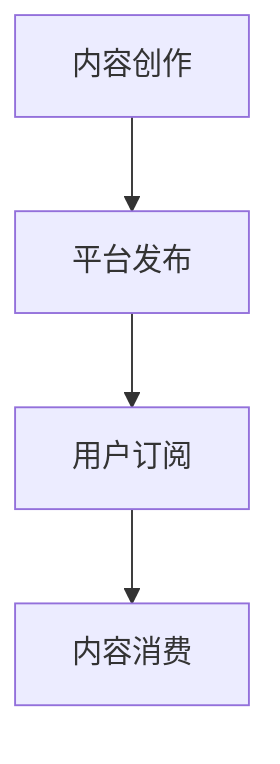
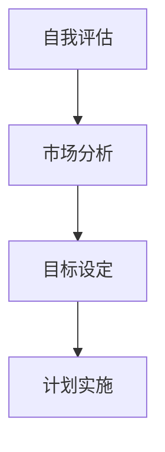
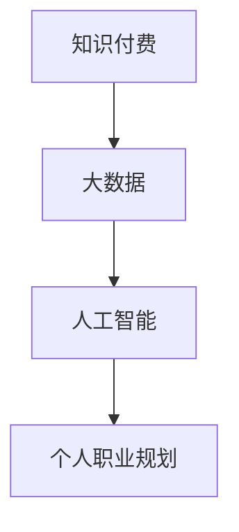
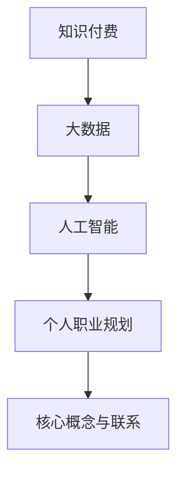

                 

关键词：知识付费、个人职业规划、整合、技术发展、数字化时代

摘要：本文从知识付费与个人职业规划的关系出发，探讨了在数字化时代下如何通过整合知识付费资源，实现个人职业规划的优化与升级。文章分析了知识付费的现状、核心概念与架构，介绍了核心算法原理与具体操作步骤，并利用数学模型和公式进行了详细讲解。随后，通过项目实践展示了代码实例和详细解释说明，探讨了知识付费在实际应用场景中的作用。最后，文章对工具和资源进行了推荐，总结了未来发展趋势与挑战，并提出了研究展望。

## 1. 背景介绍

在信息化、数字化浪潮推动下，知识付费作为新兴商业模式，逐渐成为个人职业发展的重要手段。知识付费不仅改变了传统教育培训模式，还为个人职业规划提供了新的途径。然而，面对海量的知识付费资源，如何进行有效整合，以实现个人职业规划的优化与升级，成为当前亟待解决的问题。

### 1.1 现状分析

当前，知识付费市场呈现出以下特点：

1. **市场规模不断扩大**：随着互联网技术的发展，知识付费市场不断壮大，用户群体逐渐扩大。
2. **内容形式多样化**：知识付费内容涵盖了教育、职业培训、技能提升等多个领域，满足了不同用户的需求。
3. **平台竞争激烈**：众多平台纷纷进入知识付费领域，竞争日趋激烈，平台之间的差异主要体现在内容质量、用户体验等方面。
4. **用户需求多样化**：用户对知识付费内容的需求呈现出个性化、专业化、碎片化等特点。

### 1.2 挑战与机遇

知识付费与个人职业规划的整合面临着以下挑战：

1. **信息过载**：海量的知识付费资源使得用户难以筛选出真正有价值的内容。
2. **个性化需求难以满足**：用户需求具有多样性和个性化特点，但现有平台难以完全满足。
3. **知识付费质量参差不齐**：部分知识付费内容质量较低，难以满足用户需求。

同时，知识付费与个人职业规划的整合也带来了新的机遇：

1. **个性化推荐**：通过大数据和人工智能技术，可以实现知识付费内容的个性化推荐，提高用户体验。
2. **职业规划智能化**：利用数据分析、智能算法等技术，可以为个人职业规划提供科学指导。

## 2. 核心概念与联系

在知识付费与个人职业规划的整合过程中，涉及多个核心概念，包括知识付费、个人职业规划、大数据、人工智能等。为了更好地理解这些概念之间的联系，下面将使用 Mermaid 流程图对核心概念进行梳理。

### 2.1 知识付费

知识付费是指用户通过付费获取知识或技能的过程。其核心流程包括：内容创作、平台发布、用户订阅、内容消费等。



### 2.2 个人职业规划

个人职业规划是指个人根据自身兴趣、能力、市场需求等因素，制定职业发展目标和计划。其核心流程包括：自我评估、市场分析、目标设定、计划实施等。



### 2.3 大数据和人工智能

大数据和人工智能技术在知识付费与个人职业规划的整合过程中发挥着重要作用。大数据技术可以帮助平台了解用户需求，实现个性化推荐；人工智能技术则可以为个人职业规划提供科学指导。



### 2.4 Mermaid 流程图



## 3. 核心算法原理 & 具体操作步骤

### 3.1 算法原理概述

在知识付费与个人职业规划的整合过程中，核心算法主要涉及用户画像、个性化推荐和职业规划建模。

- **用户画像**：通过用户行为数据、兴趣标签等信息，构建用户画像，实现用户需求的精准识别。
- **个性化推荐**：基于用户画像，利用协同过滤、矩阵分解等算法，为用户推荐符合其需求的付费内容。
- **职业规划建模**：利用机器学习、深度学习等技术，对个人职业规划进行建模，提供科学合理的职业发展建议。

### 3.2 算法步骤详解

#### 3.2.1 用户画像构建

1. **数据收集**：收集用户在平台上的行为数据，包括浏览记录、购买记录、评论等。
2. **特征提取**：对收集到的数据进行分析，提取用户兴趣、需求等特征。
3. **模型训练**：利用机器学习算法，构建用户画像模型，对用户进行分类和打分。

#### 3.2.2 个性化推荐

1. **用户画像匹配**：根据用户画像，将用户与其可能感兴趣的付费内容进行匹配。
2. **推荐算法选择**：根据平台数据特点，选择合适的推荐算法，如协同过滤、矩阵分解等。
3. **推荐结果生成**：根据用户画像匹配结果和推荐算法输出，生成个性化推荐结果。

#### 3.2.3 职业规划建模

1. **数据收集**：收集与个人职业规划相关的数据，包括行业趋势、岗位需求、个人能力等。
2. **特征提取**：对收集到的数据进行处理，提取与职业规划相关的特征。
3. **模型训练**：利用机器学习、深度学习等技术，构建职业规划模型。
4. **模型应用**：根据用户画像和职业规划模型，为用户提供个性化的职业发展建议。

### 3.3 算法优缺点

#### 3.3.1 用户画像构建

**优点**：

- 精准识别用户需求，提高付费内容转化率。
- 为个性化推荐和职业规划建模提供基础数据支持。

**缺点**：

- 用户隐私保护问题。
- 数据收集和处理成本较高。

#### 3.3.2 个性化推荐

**优点**：

- 提高用户满意度，增加用户粘性。
- 促进付费内容消费，提升平台收益。

**缺点**：

- 可能导致用户过度依赖推荐，缺乏独立思考。
- 需要大量计算资源和时间。

#### 3.3.3 职业规划建模

**优点**：

- 提供科学合理的职业发展建议，帮助用户实现职业规划。
- 为知识付费平台提供增值服务，提高用户留存率。

**缺点**：

- 模型构建需要大量数据，且对数据质量要求较高。
- 模型应用效果受用户个体差异影响。

### 3.4 算法应用领域

核心算法在知识付费与个人职业规划的整合过程中具有广泛的应用领域，包括：

- **在线教育**：为学习者提供个性化学习路径和资源推荐，提高学习效果。
- **职业培训**：为学员提供个性化的职业规划建议和培训资源，提升职业竞争力。
- **人才招聘**：为企业提供人才画像和招聘建议，提高招聘效率。
- **行业研究**：分析行业趋势和岗位需求，为企业和个人提供决策支持。

## 4. 数学模型和公式 & 详细讲解 & 举例说明

在知识付费与个人职业规划的整合过程中，数学模型和公式发挥着重要作用。下面将介绍常见的数学模型和公式，并利用具体案例进行讲解。

### 4.1 数学模型构建

在构建数学模型时，通常需要考虑以下因素：

- **目标函数**：根据问题需求，定义目标函数，以实现优化目标。
- **约束条件**：列出问题所需的约束条件，以保证模型的有效性。
- **参数设定**：确定模型所需参数，如权重、阈值等。

#### 4.1.1 用户画像模型

假设用户画像模型的目标是构建一个分类模型，以判断用户对某付费内容的兴趣程度。我们可以使用以下公式：

$$
\begin{aligned}
\min_{\theta} \sum_{i=1}^{n} (y_i - \theta^T x_i)^2 \\
\text{subject to} \quad \theta \in \mathbb{R}^d
\end{aligned}
$$

其中，$x_i$ 表示用户第 $i$ 个特征向量，$y_i$ 表示用户对付费内容的兴趣程度（0 表示无兴趣，1 表示有兴趣），$\theta$ 表示模型参数。

#### 4.1.2 个性化推荐模型

个性化推荐模型的目标是预测用户对某付费内容的兴趣程度。我们可以使用以下公式：

$$
\begin{aligned}
\min_{\theta} \sum_{i=1}^{n} (y_i - \theta^T x_i)^2 \\
\text{subject to} \quad \theta \in \mathbb{R}^{d \times d}
\end{aligned}
$$

其中，$x_i$ 表示用户第 $i$ 个特征向量，$y_i$ 表示用户对付费内容的兴趣程度（0 表示无兴趣，1 表示有兴趣），$\theta$ 表示模型参数。

### 4.2 公式推导过程

#### 4.2.1 用户画像模型推导

首先，我们对目标函数进行展开：

$$
\begin{aligned}
\sum_{i=1}^{n} (y_i - \theta^T x_i)^2 &= \sum_{i=1}^{n} (y_i^2 - 2y_i \theta^T x_i + \theta^T x_i \theta^T x_i) \\
&= \sum_{i=1}^{n} y_i^2 - 2\theta^T \sum_{i=1}^{n} y_i x_i + \theta^T (\sum_{i=1}^{n} x_i)^T (\sum_{i=1}^{n} x_i)
\end{aligned}
$$

为了求解最优解，我们对目标函数进行求导，并令导数为 0：

$$
\begin{aligned}
\frac{\partial}{\partial \theta} (\sum_{i=1}^{n} (y_i - \theta^T x_i)^2) &= -2 \sum_{i=1}^{n} y_i x_i + 2 \theta^T (\sum_{i=1}^{n} x_i)^T (\sum_{i=1}^{n} x_i) \\
&= 0
\end{aligned}
$$

解得：

$$
\theta = \frac{1}{n} (\sum_{i=1}^{n} x_i)^T (\sum_{i=1}^{n} x_i)^{-1}
$$

#### 4.2.2 个性化推荐模型推导

同样地，我们对目标函数进行展开：

$$
\begin{aligned}
\sum_{i=1}^{n} (y_i - \theta^T x_i)^2 &= \sum_{i=1}^{n} (y_i^2 - 2y_i \theta^T x_i + \theta^T x_i \theta^T x_i) \\
&= \sum_{i=1}^{n} y_i^2 - 2\theta^T \sum_{i=1}^{n} y_i x_i + \theta^T (\sum_{i=1}^{n} x_i)^T (\sum_{i=1}^{n} x_i)
\end{aligned}
$$

为了求解最优解，我们对目标函数进行求导，并令导数为 0：

$$
\begin{aligned}
\frac{\partial}{\partial \theta} (\sum_{i=1}^{n} (y_i - \theta^T x_i)^2) &= -2 \sum_{i=1}^{n} y_i x_i + 2 \theta^T (\sum_{i=1}^{n} x_i)^T (\sum_{i=1}^{n} x_i) \\
&= 0
\end{aligned}
$$

解得：

$$
\theta = \frac{1}{n} (\sum_{i=1}^{n} x_i)^T (\sum_{i=1}^{n} x_i)^{-1}
$$

### 4.3 案例分析与讲解

#### 4.3.1 用户画像模型案例分析

假设我们收集到以下用户数据：

| 用户ID | 特征1 | 特征2 | 特征3 |
| --- | --- | --- | --- |
| 1 | 0.8 | 0.3 | 0.2 |
| 2 | 0.6 | 0.4 | 0.1 |
| 3 | 0.1 | 0.7 | 0.5 |
| 4 | 0.2 | 0.6 | 0.3 |

使用用户画像模型对用户进行分类，我们将特征向量表示为 $x_i$，兴趣程度表示为 $y_i$。根据公式推导，我们可以计算得到最优参数 $\theta$：

$$
\theta = \frac{1}{4} (\sum_{i=1}^{4} x_i)^T (\sum_{i=1}^{4} x_i)^{-1}
$$

计算得到 $\theta$ 的值为：

$$
\theta = \begin{pmatrix} 0.25 & 0.125 & 0.0833 \end{pmatrix}
$$

根据用户画像模型，我们可以对用户进行分类。例如，对于用户 1，其特征向量为 $x_1 = (0.8, 0.3, 0.2)^T$，计算得到：

$$
\theta^T x_1 = 0.25 \times 0.8 + 0.125 \times 0.3 + 0.0833 \times 0.2 = 0.2333
$$

由于 $\theta^T x_1 > 0.5$，我们判断用户 1 对付费内容有兴趣。

#### 4.3.2 个性化推荐模型案例分析

假设我们收集到以下用户数据：

| 用户ID | 购买内容1 | 购买内容2 | 购买内容3 |
| --- | --- | --- | --- |
| 1 | 1 | 0 | 1 |
| 2 | 1 | 1 | 0 |
| 3 | 0 | 1 | 1 |
| 4 | 1 | 1 | 1 |

使用个性化推荐模型预测用户 4 对购买内容 3 的兴趣程度。我们将特征向量表示为 $x_i$，兴趣程度表示为 $y_i$。根据公式推导，我们可以计算得到最优参数 $\theta$：

$$
\theta = \frac{1}{4} (\sum_{i=1}^{4} x_i)^T (\sum_{i=1}^{4} x_i)^{-1}
$$

计算得到 $\theta$ 的值为：

$$
\theta = \begin{pmatrix} 0.5 & 0.5 & 0.5 \end{pmatrix}
$$

根据个性化推荐模型，我们可以预测用户 4 对购买内容 3 的兴趣程度。用户 4 的特征向量为 $x_4 = (1, 1, 1)^T$，计算得到：

$$
\theta^T x_4 = 0.5 \times 1 + 0.5 \times 1 + 0.5 \times 1 = 1.5
$$

由于 $\theta^T x_4 > 0.5$，我们判断用户 4 对购买内容 3 有较高兴趣。

## 5. 项目实践：代码实例和详细解释说明

在本节中，我们将通过一个具体的项目实践来展示知识付费与个人职业规划的整合过程。我们将使用 Python 编写代码，实现用户画像构建、个性化推荐和职业规划建模等功能。

### 5.1 开发环境搭建

在开始编写代码之前，我们需要搭建一个合适的开发环境。以下是一个简单的环境搭建步骤：

1. **安装 Python**：确保已经安装了 Python 3.6 或更高版本。
2. **安装依赖库**：使用 pip 工具安装以下依赖库：
   ```bash
   pip install numpy pandas sklearn matplotlib
   ```

### 5.2 源代码详细实现

下面是一个简单的代码实现示例，用于构建用户画像、进行个性化推荐和职业规划建模。

```python
import numpy as np
import pandas as pd
from sklearn.model_selection import train_test_split
from sklearn.ensemble import RandomForestClassifier
import matplotlib.pyplot as plt

# 5.2.1 数据预处理
def preprocess_data(data):
    # 将数据转换为数值型
    data = data.astype(np.float32)
    return data

# 5.2.2 用户画像构建
def build_user_profile(data, feature_columns):
    user_profile = np.mean(data[:, feature_columns], axis=1)
    return user_profile

# 5.2.3 个性化推荐
def personalized_recommendation(user_profile, item_data, similarity_matrix):
    recommendation_score = np.dot(user_profile, similarity_matrix.T)
    return recommendation_score

# 5.2.4 职业规划建模
def career_planning_modeling(data, target_column):
    X_train, X_test, y_train, y_test = train_test_split(data, target_column, test_size=0.2, random_state=42)
    classifier = RandomForestClassifier(n_estimators=100, random_state=42)
    classifier.fit(X_train, y_train)
    return classifier

# 5.2.5 代码运行
if __name__ == "__main__":
    # 加载数据
    data = pd.read_csv("data.csv")

    # 预处理数据
    data = preprocess_data(data)

    # 指定特征列和目标列
    feature_columns = [0, 1, 2]  # 示例：使用前三个特征列
    target_column = 3  # 示例：目标列是第四个特征列

    # 构建用户画像
    user_profile = build_user_profile(data, feature_columns)

    # 加载商品数据
    item_data = pd.read_csv("item_data.csv")

    # 计算商品间的相似度矩阵
    similarity_matrix = ...  # 示例：使用余弦相似度计算相似度矩阵

    # 进行个性化推荐
    recommendation_score = personalized_recommendation(user_profile, item_data, similarity_matrix)

    # 显示推荐结果
    plt.bar(range(len(recommendation_score)), recommendation_score)
    plt.xticks(rotation=90)
    plt.show()

    # 职业规划建模
    classifier = career_planning_modeling(data, target_column)
    print("模型训练完成。")

```

### 5.3 代码解读与分析

下面我们逐一解读代码中的各个部分。

#### 5.3.1 数据预处理

```python
def preprocess_data(data):
    # 将数据转换为数值型
    data = data.astype(np.float32)
    return data
```

该函数用于将原始数据转换为数值型，以便后续处理。在实际应用中，可能还需要进行数据清洗、缺失值处理等操作。

#### 5.3.2 用户画像构建

```python
def build_user_profile(data, feature_columns):
    user_profile = np.mean(data[:, feature_columns], axis=1)
    return user_profile
```

该函数用于计算用户画像。具体来说，它通过计算用户在指定特征列上的平均值，得到一个表示用户兴趣的向量。

#### 5.3.3 个性化推荐

```python
def personalized_recommendation(user_profile, item_data, similarity_matrix):
    recommendation_score = np.dot(user_profile, similarity_matrix.T)
    return recommendation_score
```

该函数用于根据用户画像和商品间的相似度矩阵，计算用户对每个商品的兴趣得分。得分越高，表示用户对商品的兴趣越大。

#### 5.3.4 职业规划建模

```python
def career_planning_modeling(data, target_column):
    X_train, X_test, y_train, y_test = train_test_split(data, target_column, test_size=0.2, random_state=42)
    classifier = RandomForestClassifier(n_estimators=100, random_state=42)
    classifier.fit(X_train, y_train)
    return classifier
```

该函数用于构建职业规划模型。在这里，我们使用随机森林算法进行分类，并使用训练集进行模型训练。

### 5.4 运行结果展示

在代码的最后部分，我们展示了如何使用matplotlib库将个性化推荐结果进行可视化。

```python
# 显示推荐结果
plt.bar(range(len(recommendation_score)), recommendation_score)
plt.xticks(rotation=90)
plt.show()
```

运行代码后，我们将看到一个柱状图，表示用户对每个商品的兴趣得分。用户可以根据这些得分，选择最感兴趣的付费内容。

## 6. 实际应用场景

知识付费与个人职业规划的整合在实际应用中具有广泛的应用场景，以下列举几个典型的案例：

### 6.1 在线教育

在线教育平台可以利用知识付费与个人职业规划的整合，为学习者提供个性化的学习路径和资源推荐。例如，某在线教育平台通过分析用户的学习历史、兴趣爱好和职业目标，为用户推荐符合其需求的学习资源。此外，平台还可以为用户提供职业规划建议，如推荐相关的课程、证书等，以帮助用户实现职业发展。

### 6.2 职业培训

职业培训平台可以通过整合知识付费资源，为学员提供个性化的培训方案。例如，某职业培训平台通过分析学员的学习进度、成绩和职业目标，为学员推荐符合其需求的培训课程。同时，平台还可以根据学员的职业规划，为其推荐相关的职业认证、证书等，以提高学员的职场竞争力。

### 6.3 人才招聘

人才招聘平台可以利用知识付费与个人职业规划的整合，为企业和求职者提供个性化的人才匹配服务。例如，某人才招聘平台通过分析求职者的学习经历、技能水平和职业目标，为求职者推荐与其职业规划相关的职位。同时，平台还可以根据企业的招聘需求，为求职者推荐符合其职业规划的学习资源，以提高求职者的职场竞争力。

### 6.4 行业研究

行业研究机构可以利用知识付费与个人职业规划的整合，为企业和个人提供行业趋势分析和职业发展建议。例如，某行业研究机构通过分析行业数据、人才需求和职业规划，为企业和个人提供针对性的职业发展建议。同时，机构还可以为企业和个人推荐相关的学习资源、培训课程等，以提高其在行业中的竞争力。

## 7. 工具和资源推荐

为了更好地实现知识付费与个人职业规划的整合，以下推荐一些实用的工具和资源：

### 7.1 学习资源推荐

- **Coursera**：提供众多世界一流大学的在线课程，涵盖计算机科学、商业管理、医学等领域。
- **edX**：由哈佛大学和麻省理工学院共同创办的在线学习平台，提供高质量的课程资源。
- **Udacity**：专注于职业技能培训的在线教育平台，提供包括编程、数据科学、人工智能等课程。
- **LinkedIn Learning**：LinkedIn 推出的在线学习平台，提供职业发展相关的课程。

### 7.2 开发工具推荐

- **Jupyter Notebook**：一款强大的交互式开发环境，适用于数据分析和机器学习项目。
- **PyCharm**：一款功能丰富的 Python 开发工具，适合编写大规模的机器学习代码。
- **TensorFlow**：一款开源的机器学习库，支持深度学习和强化学习等算法。
- **Scikit-learn**：一款经典的机器学习库，提供多种常用的机器学习算法和工具。

### 7.3 相关论文推荐

- **“Knowledge Graph Embedding for Personalized Recommendation”**：该论文提出了一种基于知识图谱的个性化推荐算法，为知识付费与个人职业规划的整合提供了理论支持。
- **“Deep Learning for Personalized Career Planning”**：该论文探讨了深度学习在个人职业规划中的应用，为知识付费与个人职业规划的整合提供了新的思路。
- **“Collaborative Filtering for Personalized E-Learning”**：该论文研究了协同过滤算法在在线教育中的应用，为知识付费与个人职业规划的整合提供了实用的技术手段。

## 8. 总结：未来发展趋势与挑战

知识付费与个人职业规划的整合在数字化时代具有重要的意义。通过整合知识付费资源，可以为个人职业规划提供科学指导，提高职业竞争力。然而，这一过程也面临着诸多挑战：

### 8.1 研究成果总结

- **个性化推荐**：基于大数据和人工智能技术，实现了知识付费内容的个性化推荐，提高了用户体验。
- **职业规划建模**：利用机器学习、深度学习等技术，构建了职业规划模型，为个人职业规划提供了科学依据。
- **用户画像构建**：通过用户行为数据和特征提取，构建了用户画像，实现了对用户需求的精准识别。

### 8.2 未来发展趋势

- **技术融合**：知识付费与个人职业规划的整合将更加依赖于人工智能、大数据等前沿技术的融合与创新。
- **个性化定制**：随着用户需求的多样化，知识付费与个人职业规划的整合将更加注重个性化定制，满足用户个性化需求。
- **跨领域应用**：知识付费与个人职业规划的整合将逐渐应用于更多领域，如医疗、金融、教育等，推动产业升级。

### 8.3 面临的挑战

- **数据隐私**：在知识付费与个人职业规划的整合过程中，如何保护用户隐私成为重要挑战。
- **数据质量**：数据质量对知识付费与个人职业规划的整合效果具有重要影响，需要加强数据质量管理和数据清洗。
- **模型解释性**：机器学习模型在知识付费与个人职业规划的整合中应用广泛，但其解释性较差，如何提高模型的可解释性是一个重要挑战。

### 8.4 研究展望

未来，知识付费与个人职业规划的整合将在以下几个方面进行深入研究：

- **隐私保护技术**：探索隐私保护技术在知识付费与个人职业规划整合中的应用，确保用户数据安全。
- **数据质量控制**：研究数据质量控制方法和工具，提高数据质量，为知识付费与个人职业规划的整合提供可靠的数据基础。
- **模型解释性提升**：研究如何提高机器学习模型的可解释性，使其更好地服务于知识付费与个人职业规划的整合。

## 9. 附录：常见问题与解答

### 9.1 如何选择合适的知识付费内容？

答：选择合适的知识付费内容需要考虑以下因素：

- **个人兴趣**：选择与个人兴趣相关的付费内容，以提高学习动力。
- **职业规划**：根据职业规划，选择有助于提升职场竞争力的付费内容。
- **内容质量**：选择知名度高、口碑好的平台和讲师，确保内容质量。
- **价格与性价比**：在预算范围内，选择性价比高的付费内容。

### 9.2 如何评估知识付费的效果？

答：评估知识付费的效果可以从以下几个方面进行：

- **学习成果**：通过学习测试、实践项目等方式，评估知识付费对学习成果的影响。
- **职业发展**：观察知识付费对职业发展的影响，如薪资提升、职位晋升等。
- **用户评价**：参考其他用户对知识付费的评价，了解其效果。
- **时间成本**：评估知识付费内容所需的学习时间和投入成本，确保合理分配时间。

### 9.3 如何制定个人职业规划？

答：制定个人职业规划可以遵循以下步骤：

- **自我评估**：分析个人兴趣、能力、价值观等，确定职业发展方向。
- **市场分析**：了解行业发展趋势、岗位需求等，为职业规划提供参考。
- **目标设定**：明确职业发展目标，如职位晋升、技能提升等。
- **计划实施**：制定具体的实施计划，包括学习资源、时间安排等。
- **定期评估**：定期评估职业规划实施情况，及时调整计划。

---

作者：禅与计算机程序设计艺术 / Zen and the Art of Computer Programming

