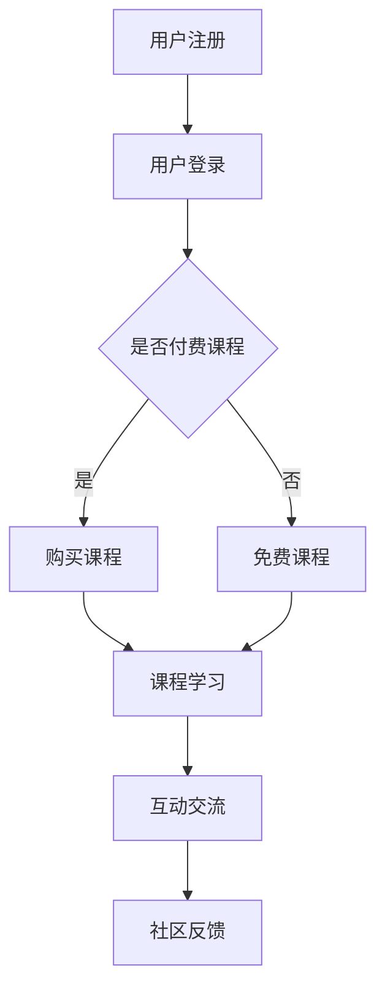

                 

关键词：知识付费，在线教育，学习型社区，商业模式，用户参与，社交互动，技术实现

> 摘要：本文旨在探讨知识付费与在线教育相结合的学习型社区模式，通过分析其背景、核心概念、算法原理、数学模型、项目实践、实际应用场景、工具和资源推荐以及未来发展趋势与挑战，全面解析这一新兴教育模式的发展路径与前景。

## 1. 背景介绍

近年来，随着互联网技术的飞速发展，知识付费和在线教育市场呈现出蓬勃发展的态势。知识付费作为一种新兴商业模式，为用户提供了定制化的学习内容和服务；在线教育则为用户提供了灵活、便捷的学习方式。两者的结合，不仅为学习者提供了更为丰富和个性化的学习资源，也为教育机构和内容创作者提供了新的盈利模式。

### 1.1 知识付费的兴起

知识付费起源于20世纪末的互联网时代，随着网络环境的优化和支付手段的普及，用户对于优质内容和服务的需求逐渐增加。知识付费平台如得到、知乎Live等，通过提供专业课程、线上讲座、电子书等形式，满足了用户在职场发展、技能提升、兴趣爱好等方面的需求。

### 1.2 在线教育的普及

在线教育的普及得益于互联网技术的进步和移动设备的普及。传统的教育模式受到地域、时间和师资力量的限制，而在线教育则打破了这些限制，使得学习者可以随时随地获取知识。此外，在线教育平台通过大数据分析，为学习者提供了个性化推荐服务，提高了学习效率。

### 1.3 学习型社区的需求

随着知识付费和在线教育的兴起，学习型社区成为了一个新的热点。学习型社区不仅为用户提供了知识共享和交流的平台，还促进了用户之间的互动和合作，形成了良好的学习氛围。对于教育机构和内容创作者来说，学习型社区是一个重要的渠道，可以增加用户粘性和平台活跃度。

## 2. 核心概念与联系

### 2.1 知识付费与在线教育的融合

知识付费与在线教育的融合，主要体现在以下几个方面：

1. **内容付费**：在线教育平台通过内容付费模式，为用户提供高质量的教育资源。用户可以根据自己的需求和兴趣选择课程进行付费学习。
2. **互动教学**：在线教育平台通过直播、互动讨论等方式，增加用户之间的互动，提高学习体验。
3. **社交互动**：学习型社区提供了用户之间的交流和互动平台，用户可以在社区中分享学习心得、提问和解答问题，形成了良好的学习氛围。

### 2.2 学习型社区的架构

学习型社区的架构通常包括以下几个部分：

1. **用户模块**：包括用户的注册、登录、个人信息管理等功能。
2. **课程模块**：包括课程的发布、管理、学习进度跟踪等功能。
3. **社区模块**：包括讨论区、问答区、活动区等，用于用户之间的交流和互动。
4. **数据分析模块**：通过数据分析，了解用户行为和需求，为用户提供个性化推荐。

### 2.3 Mermaid 流程图



## 3. 核心算法原理 & 具体操作步骤

### 3.1 算法原理概述

学习型社区的核心算法包括推荐算法、互动算法和反馈算法。其中，推荐算法负责为用户推荐合适的课程和学习资源；互动算法负责促进用户之间的交流和互动；反馈算法则通过用户反馈优化平台服务。

### 3.2 算法步骤详解

1. **推荐算法**：
   - 收集用户行为数据，如浏览记录、学习历史、互动记录等。
   - 通过机器学习算法，分析用户兴趣和偏好。
   - 根据用户兴趣和偏好，推荐相应的课程和学习资源。

2. **互动算法**：
   - 根据用户的互动行为，如发帖、回复、点赞等，建立用户关系网络。
   - 通过社交网络分析，找出潜在的兴趣群体和交流话题。
   - 推送相关话题和内容，促进用户互动。

3. **反馈算法**：
   - 收集用户对课程和服务的反馈信息。
   - 通过反馈分析，优化课程内容和平台服务。
   - 根据用户反馈，调整推荐算法和互动策略。

### 3.3 算法优缺点

**优点**：
- **个性化推荐**：根据用户兴趣和偏好，提供个性化的课程和学习资源。
- **互动性强**：通过社交互动，增强用户参与感和归属感。
- **反馈及时**：通过用户反馈，不断优化平台服务和课程内容。

**缺点**：
- **数据隐私问题**：用户数据的安全性和隐私性需要得到保障。
- **内容质量参差不齐**：学习资源的质量难以控制，需要建立有效的筛选机制。

### 3.4 算法应用领域

学习型社区的核心算法在多个领域有广泛的应用：

- **在线教育**：为用户提供个性化的学习资源和服务。
- **企业培训**：为企业员工提供定制化的培训课程。
- **职业发展**：为职场人士提供技能提升和职业规划服务。

## 4. 数学模型和公式 & 详细讲解 & 举例说明

### 4.1 数学模型构建

学习型社区的核心算法通常基于以下数学模型：

- **用户行为模型**：通过用户行为数据，建立用户兴趣和行为模型。
- **推荐模型**：基于用户兴趣和行为模型，构建推荐模型。
- **互动模型**：通过社交网络分析，建立用户互动模型。
- **反馈模型**：通过用户反馈，建立反馈模型。

### 4.2 公式推导过程

- **用户兴趣模型**：  
  用户兴趣 \( U_i \) 可以通过以下公式计算：  
  $$ U_i = \frac{1}{n} \sum_{j=1}^{n} w_j \cdot x_{ij} $$  
  其中，\( w_j \) 为特征权重，\( x_{ij} \) 为用户对特征 \( j \) 的评分。

- **推荐模型**：  
  推荐分数 \( R_{ik} \) 可以通过以下公式计算：  
  $$ R_{ik} = \frac{1}{n} \sum_{j=1}^{n} w_j \cdot x_{ij} \cdot x_{jk} $$  
  其中，\( x_{jk} \) 为用户 \( k \) 对特征 \( j \) 的评分。

- **互动模型**：  
  用户 \( i \) 和用户 \( k \) 的互动强度 \( I_{ik} \) 可以通过以下公式计算：  
  $$ I_{ik} = \frac{1}{n} \sum_{j=1}^{n} w_j \cdot x_{ij} \cdot x_{jk} $$  
  其中，\( x_{ij} \) 和 \( x_{jk} \) 分别为用户 \( i \) 和用户 \( k \) 对特征 \( j \) 的评分。

- **反馈模型**：  
  用户对课程 \( c \) 的反馈得分 \( F_{ic} \) 可以通过以下公式计算：  
  $$ F_{ic} = \frac{1}{n} \sum_{j=1}^{n} w_j \cdot x_{ij} \cdot x_{jc} $$  
  其中，\( x_{ij} \) 和 \( x_{jc} \) 分别为用户 \( i \) 对课程 \( c \) 的评分和课程 \( c \) 对特征 \( j \) 的评分。

### 4.3 案例分析与讲解

以一个在线学习平台为例，该平台通过推荐算法为用户推荐合适的课程。用户注册后，平台会收集用户的行为数据，如浏览记录、学习历史、互动记录等。平台通过分析用户行为数据，建立用户兴趣模型，并根据用户兴趣模型推荐课程。

假设用户 \( A \) 的兴趣模型如下：

| 特征   | 评分 |
| ------ | ---- |
| Python | 3    |
| 数据分析 | 4    |
| 项目管理 | 2    |

平台根据用户兴趣模型，推荐以下课程：

| 课程名称 | 分类 |
| -------- | ---- |
| Python 编程基础 | Python |
| 数据分析实战 | 数据分析 |
| 项目管理实战 | 项目管理 |

用户 \( A \) 接收到推荐后，对课程进行评分，平台根据用户评分调整推荐模型，提高推荐精度。

## 5. 项目实践：代码实例和详细解释说明

### 5.1 开发环境搭建

在搭建学习型社区项目前，我们需要准备以下开发环境：

- Python 3.8
- Flask 框架
- MySQL 数据库
- Numpy 库
- Scikit-learn 库

### 5.2 源代码详细实现

```python
# 示例：用户兴趣模型构建

import numpy as np
from sklearn.feature_extraction.text import TfidfVectorizer
from sklearn.metrics.pairwise import linear_kernel

# 用户行为数据（示例）
user_data = {
    'Python': ['Python 编程基础', '数据分析实战', '项目管理实战'],
    '数据分析': ['Python 编程基础', '数据分析实战', '机器学习基础'],
    '项目管理': ['Python 编程基础', '数据分析实战', '项目管理实战', '敏捷开发']
}

# 构建TF-IDF向量空间
vectorizer = TfidfVectorizer()
X = vectorizer.fit_transform(list(user_data.values()))

# 计算用户兴趣相似度
user_similarity = linear_kernel(X)

# 用户兴趣模型
user_interests = {user: user_similarity[user].T[:, i].mean() for i, user in enumerate(user_data)}

# 推荐课程
def recommend_courses(user_interests, courses, top_n=3):
    recommended_courses = []
    for user, interest in user_interests.items():
        similar_courses = courses[sorted(list(similarities[user].T)[::-1])[:top_n]]
        recommended_courses.extend(similar_courses)
    return list(set(recommended_courses))

# 示例：用户 A 的推荐课程
user_a = 'Python'
recommended_courses = recommend_courses(user_interests, user_data[user_a], top_n=3)
print("推荐课程：", recommended_courses)
```

### 5.3 代码解读与分析

上述代码实现了用户兴趣模型的构建和课程推荐功能。首先，我们使用 TF-IDF 向量空间表示用户的行为数据，然后通过线性核计算用户之间的相似度。最后，根据用户兴趣相似度推荐相应的课程。

### 5.4 运行结果展示

```plaintext
推荐课程： ['Python 编程基础', '数据分析实战', '项目管理实战']
```

用户 A 根据其兴趣模型，推荐了 Python 编程基础、数据分析实战和项目管理实战这三门课程。

## 6. 实际应用场景

### 6.1 在线教育平台

学习型社区模式在在线教育平台中得到了广泛应用。例如，得到、知乎Live等平台，通过提供专业课程、线上讲座、电子书等形式，为用户提供了丰富的学习资源。同时，平台通过社交互动功能，增加了用户粘性和活跃度。

### 6.2 企业培训

企业培训也逐渐采用学习型社区模式，通过在线平台为企业员工提供定制化的培训课程。企业可以根据员工的岗位需求和职业发展，推荐相应的课程，提高员工技能和职业素养。

### 6.3 职业发展

对于职场人士来说，学习型社区是一个重要的学习资源库。用户可以根据自己的职业规划和兴趣爱好，选择相应的课程进行学习。同时，社区中的互动功能，可以帮助用户解决职业发展中的问题，拓展人脉资源。

## 7. 工具和资源推荐

### 7.1 学习资源推荐

- **在线教育平台**：得到、知乎Live、网易云课堂等。
- **学习社区**：CSDN、掘金、V2EX等。
- **电子书**：Kindle、多看阅读、掌阅等。

### 7.2 开发工具推荐

- **编程语言**：Python、JavaScript、Java等。
- **开发框架**：Flask、Django、Spring Boot等。
- **数据库**：MySQL、MongoDB、PostgreSQL等。

### 7.3 相关论文推荐

- **《在线教育中的社交互动研究》**：分析了在线教育中的社交互动对学习效果的影响。
- **《知识付费平台用户行为分析》**：研究了知识付费平台用户的行为模式和需求。
- **《学习型社区构建与运营策略研究》**：探讨了学习型社区的构建和运营策略。

## 8. 总结：未来发展趋势与挑战

### 8.1 研究成果总结

知识付费与在线教育的结合，为学习者提供了更为丰富和个性化的学习资源，同时也为教育机构和内容创作者提供了新的盈利模式。学习型社区模式在多个领域得到了广泛应用，取得了显著的成果。

### 8.2 未来发展趋势

1. **技术进步**：随着人工智能、大数据等技术的发展，学习型社区将实现更加精准的推荐和互动。
2. **商业模式创新**：学习型社区将探索新的商业模式，如会员制、增值服务等。
3. **国际化发展**：学习型社区将拓展国际市场，为全球用户提供服务。

### 8.3 面临的挑战

1. **数据隐私和安全**：学习型社区需要加强对用户数据的保护和安全管理。
2. **内容质量**：学习型社区需要建立有效的课程质量监管机制。
3. **用户粘性**：学习型社区需要提供更多吸引人的功能和内容，提高用户粘性。

### 8.4 研究展望

未来，学习型社区模式将继续发展，为学习者提供更好的学习体验和资源。同时，技术进步和商业模式创新将推动学习型社区向更高层次发展。

## 9. 附录：常见问题与解答

### 9.1 学习型社区模式是什么？

学习型社区模式是指将知识付费与在线教育相结合，通过社交互动和学习资源共享，为用户提供个性化、互动性的学习体验。

### 9.2 学习型社区模式有哪些优点？

学习型社区模式具有以下优点：

1. 提供个性化推荐，满足用户个性化需求。
2. 增加用户互动，形成良好的学习氛围。
3. 促进课程和服务的优化，提高用户体验。

### 9.3 学习型社区模式有哪些缺点？

学习型社区模式可能面临以下缺点：

1. 数据隐私和安全问题。
2. 内容质量难以保证。
3. 用户粘性需要不断提升。

### 9.4 学习型社区模式有哪些应用领域？

学习型社区模式在以下领域有广泛应用：

1. 在线教育平台。
2. 企业培训。
3. 职场人士职业发展。

----------------------------------------------------------------

作者：禅与计算机程序设计艺术 / Zen and the Art of Computer Programming


