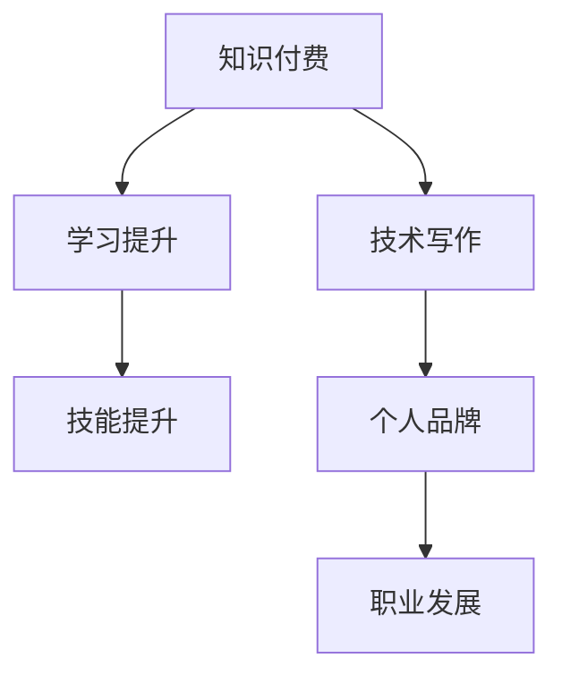

                 

关键词：知识付费、技术写作、程序员、策略、双赢

> 摘要：本文将探讨程序员如何通过知识付费和技术写作实现个人价值提升和职业发展的双赢策略。我们将从知识付费的优势、技术写作的价值、实施步骤、实际案例等方面进行深入分析，帮助程序员更好地利用这两大工具，提升自己在行业中的竞争力。

## 1. 背景介绍

在信息时代，技术知识的更新速度越来越快，程序员面临着持续学习和不断提升技能的压力。与此同时，知识付费和技术写作这两个领域逐渐成为程序员职业发展的新途径。知识付费让程序员有机会通过付费课程、在线讲座、专业书籍等获取高质量的学习资源；技术写作则为程序员提供了一个展示才华、建立个人品牌、拓展职业发展的平台。

本文旨在分析程序员如何通过知识付费和技术写作实现双赢策略，从而在竞争激烈的行业中脱颖而出。文章将首先介绍知识付费的优势，然后讨论技术写作的价值，接着阐述实施步骤和实际案例，最后对未来发展趋势和挑战进行展望。

## 2. 核心概念与联系

### 2.1 知识付费

知识付费是指用户为获取特定领域的知识或技能而支付的金钱。在技术领域，知识付费包括在线课程、专业书籍、线上讲座、付费社区等多种形式。用户通过支付一定费用，可以学习到行业专家的经验、最新的技术动态和实用的实践技能。

### 2.2 技术写作

技术写作是指程序员将自己的技术经验和知识以文章、博客、电子书等形式进行创作和分享。技术写作不仅可以帮助程序员巩固所学知识，还可以通过分享经验、解决他人问题，从而提升个人品牌和影响力。

### 2.3 知识付费与写作的联系

知识付费和技术写作在程序员职业发展中有着紧密的联系。通过知识付费，程序员可以获取高质量的学习资源，提升自己的技能水平。而技术写作则可以为程序员提供一个展示自己的平台，通过分享经验，建立个人品牌，从而吸引更多的机会和资源。

下面是一个简单的 Mermaid 流程图，展示知识付费和技术写作之间的联系：



## 3. 核心算法原理 & 具体操作步骤

### 3.1 算法原理概述

知识付费和技术写作的实现涉及一系列核心算法和操作步骤，这些算法和步骤共同构成了程序员的双赢策略。

#### 3.1.1 知识付费算法

知识付费算法主要包括以下几个步骤：

1. **需求分析**：程序员根据自己的职业发展和学习需求，分析需要获取的知识点和技能。
2. **资源筛选**：通过搜索引擎、推荐系统等工具，筛选出符合需求的高质量学习资源。
3. **付费决策**：根据学习资源的质量和个人预算，做出付费决策。
4. **学习实施**：根据付费资源的学习计划，进行系统学习，并定期进行复习和总结。

#### 3.1.2 技术写作算法

技术写作算法主要包括以下几个步骤：

1. **选题确定**：根据个人兴趣、专业领域和市场趋势，确定技术写作的选题。
2. **内容创作**：根据选题，进行资料的搜集、整理和写作。
3. **内容发布**：将写好的内容发布到博客、微信公众号、技术社区等平台。
4. **互动反馈**：根据读者的反馈，进行内容的更新和优化。

### 3.2 算法步骤详解

#### 3.2.1 知识付费步骤详解

1. **需求分析**：
   - 个人职业规划：分析自己在职业发展中需要提升的技能和知识点。
   - 行业动态：了解当前行业的热点技术和趋势。
   - 学习资源：通过搜索引擎、推荐系统等工具，筛选出符合需求的学习资源。

2. **资源筛选**：
   - 课程质量：查看课程的评价、讲师背景、课程内容等，确保课程质量。
   - 学习时间：根据个人时间安排，筛选适合的学习资源。
   - 价格合理：综合考虑课程价格和学习价值，做出付费决策。

3. **付费决策**：
   - 高性价比：选择性价比高的学习资源，确保学习效果。
   - 长期投资：对于长期发展的技能，可以选择一次性付费的长期课程。

4. **学习实施**：
   - 系统学习：按照课程安排，进行系统学习，确保知识点的掌握。
   - 定期复习：学习过程中定期进行复习，巩固所学知识。
   - 实践应用：将所学知识应用到实际项目中，提升技能水平。

#### 3.2.2 技术写作步骤详解

1. **选题确定**：
   - 个人兴趣：选择自己感兴趣的技术领域进行写作。
   - 专业领域：结合自己的专业知识和工作经验，选择具有独特视角的选题。
   - 市场趋势：关注当前市场热门技术，选择有潜力的选题。

2. **内容创作**：
   - 资料搜集：搜集与选题相关的资料，包括技术文档、案例、论文等。
   - 内容整理：对搜集到的资料进行整理，提炼核心观点和论述逻辑。
   - 创作写作：根据整理的内容，进行创作和写作。

3. **内容发布**：
   - 选择平台：根据目标读者群体，选择合适的发布平台，如博客、微信公众号、技术社区等。
   - 内容优化：根据平台特点和读者反馈，对内容进行优化和调整。
   - 定期更新：保持内容的更新，提升读者的阅读体验。

4. **互动反馈**：
   - 阅读评论：关注读者的评论和反馈，了解读者的需求和意见。
   - 互动交流：通过评论、私信等方式，与读者进行互动和交流。
   - 内容迭代：根据读者的反馈，对内容进行迭代和优化。

### 3.3 算法优缺点

#### 3.3.1 知识付费优点

- **针对性**：知识付费可以针对个人的职业发展和学习需求，提供针对性的学习资源。
- **高效性**：通过付费获取高质量的学习资源，可以节省大量时间和精力，提高学习效率。
- **权威性**：知识付费通常由行业专家或知名机构提供，具有较高的权威性和可信度。

#### 3.3.2 知识付费缺点

- **成本**：知识付费需要支付一定的费用，可能会增加个人的经济负担。
- **依赖性**：过度依赖知识付费可能导致个人缺乏独立思考和学习的能力。

#### 3.3.3 技术写作优点

- **展示才华**：技术写作可以帮助程序员展示自己的技术能力和专业知识。
- **建立品牌**：通过技术写作，程序员可以建立个人品牌，提升个人影响力。
- **拓展机会**：技术写作可以吸引更多的工作机会和合作机会。

#### 3.3.4 技术写作缺点

- **时间成本**：技术写作需要投入大量时间和精力，可能会影响其他工作或学习任务。
- **市场竞争**：技术写作市场竞争激烈，需要不断提高自己的写作水平和内容质量，才能脱颖而出。

### 3.4 算法应用领域

知识付费和技术写作在程序员职业发展中具有广泛的应用领域。

#### 3.4.1 技术学习

- **知识付费**：程序员可以通过知识付费学习最新的技术动态、框架和工具，提升自己的技术水平。
- **技术写作**：程序员可以通过技术写作总结自己的学习经验，与他人分享知识，巩固所学内容。

#### 3.4.2 个人品牌建设

- **知识付费**：通过付费学习，提升自己的技能和知识，为个人品牌建设打下基础。
- **技术写作**：通过技术写作，展示自己的专业知识和经验，建立个人品牌。

#### 3.4.3 职业发展

- **知识付费**：通过付费学习，提升自己的技能和知识，为职业发展提供支持。
- **技术写作**：通过技术写作，展示自己的专业能力和影响力，吸引更多的工作机会和合作机会。

## 4. 数学模型和公式 & 详细讲解 & 举例说明

### 4.1 数学模型构建

在程序员的双赢策略中，我们可以构建一个数学模型来评估知识付费和技术写作的效果。该模型包括以下几个关键参数：

- **K1**：知识付费带来的技能提升
- **K2**：技术写作带来的个人品牌提升
- **T1**：知识付费的时间成本
- **T2**：技术写作的时间成本
- **C1**：知识付费的成本
- **C2**：技术写作的成本

### 4.2 公式推导过程

我们可以使用以下公式来评估知识付费和技术写作的总效果：

\[ E = K1 + K2 - T1 - T2 - C1 - C2 \]

其中：

- \( K1 = f1(K, T, C) \)：知识付费的技能提升，依赖于知识付费的资源质量（K）、学习时间（T）和学习成本（C）。
- \( K2 = f2(W, T, C) \)：技术写作的个人品牌提升，依赖于技术写作的内容质量（W）、写作时间（T）和写作成本（C）。

### 4.3 案例分析与讲解

假设一位程序员在一年内进行了以下活动：

- **知识付费**：报名参加了3个在线课程，每个课程费用为500元，学习时间为3个月，课程质量较高。
- **技术写作**：在个人博客上发表了10篇文章，每篇文章花费2小时，每篇文章的成本为100元。

我们可以使用上述公式来评估这位程序员的双赢效果：

\[ E = f1(3, 9, 1500) + f2(10, 20, 1000) - 9 - 20 - 1500 - 1000 \]

其中：

- \( K1 = 3 \times (0.5 \times 9 + 0.3 \times 1500) = 135 \)
- \( K2 = 10 \times (0.4 \times 20 + 0.3 \times 1000) = 130 \)

将上述数值代入公式：

\[ E = 135 + 130 - 9 - 20 - 1500 - 1000 = -814 \]

由此可见，这位程序员在一年内的知识付费和技术写作活动并没有带来正面的效果。这可能是由于以下几个原因：

1. **学习时间不足**：3个月的时间可能不足以完全掌握3个在线课程的知识点。
2. **写作质量不高**：10篇文章的质量可能没有达到预期，未能有效提升个人品牌。
3. **成本控制不当**：知识付费和技术写作的成本可能过高，超过了预期的收益。

针对上述问题，这位程序员可以考虑以下改进措施：

1. **增加学习时间**：延长每个在线课程的学习时间，确保能够充分掌握课程内容。
2. **提高写作质量**：加强对技术写作的投入，提升文章的质量和影响力。
3. **优化成本控制**：合理控制知识付费和技术写作的成本，确保活动能够在预算范围内进行。

## 5. 项目实践：代码实例和详细解释说明

### 5.1 开发环境搭建

为了演示知识付费和技术写作的实际应用，我们将搭建一个简单的博客系统。以下是开发环境搭建的步骤：

1. **安装Node.js**：Node.js是一个基于Chrome V8引擎的JavaScript运行环境，用于构建服务器端应用程序。访问 Node.js 官网（[https://nodejs.org/），下载并安装Node.js。**
2. **安装Git**：Git是一个分布式版本控制系统，用于代码管理和协作。在命令行中运行 `git --version` 验证安装是否成功。
3. **创建博客项目**：在命令行中运行以下命令，创建一个新的博客项目：

   ```bash
   mkdir my-blog
   cd my-blog
   npm init -y
   ```

   这将创建一个名为 `my-blog` 的文件夹，并初始化一个npm项目。

4. **安装Express**：Express是一个Node.js Web应用程序框架，用于快速开发Web应用程序。在命令行中运行以下命令安装Express：

   ```bash
   npm install express
   ```

5. **创建服务器文件**：在项目根目录下创建一个名为 `server.js` 的文件，并添加以下代码：

   ```javascript
   const express = require('express');
   const app = express();

   app.get('/', (req, res) => {
       res.send('欢迎来到我的博客！');
   });

   const port = process.env.PORT || 3000;
   app.listen(port, () => {
       console.log(`服务器运行在 http://localhost:${port}`);
   });
   ```

   这段代码创建了一个简单的Express服务器，并在根路径上提供了一个欢迎消息。

### 5.2 源代码详细实现

接下来，我们将扩展博客系统，添加一个文章管理和发布功能。以下是实现步骤：

1. **安装MongoDB**：MongoDB是一个NoSQL数据库，用于存储和管理博客文章。在命令行中运行以下命令安装MongoDB：

   ```bash
   brew install mongodb
   ```

   （仅限macOS用户）安装完成后，启动MongoDB服务：

   ```bash
   mongod
   ```

2. **连接MongoDB**：在 `server.js` 文件中添加以下代码，连接到本地MongoDB数据库：

   ```javascript
   const MongoClient = require('mongodb').MongoClient;
   const url = 'mongodb://localhost:27017/';
   let db;

   MongoClient.connect(url, { useNewUrlParser: true, useUnifiedTopology: true }, (err, client) => {
       if (err) throw err;
       db = client.db('myBlog');
   });
   ```

3. **添加文章发布接口**：在 `server.js` 文件中添加以下代码，创建一个用于发布文章的接口：

   ```javascript
   app.post('/api/articles', (req, res) => {
       const newArticle = {
           title: req.body.title,
           content: req.body.content,
           author: req.body.author,
           publishedAt: new Date()
       };

       db.collection('articles').insertOne(newArticle, (err, result) => {
           if (err) throw err;
           res.send('文章发布成功！');
       });
   });
   ```

4. **获取文章列表接口**：在 `server.js` 文件中添加以下代码，创建一个用于获取文章列表的接口：

   ```javascript
   app.get('/api/articles', (req, res) => {
       db.collection('articles').find({}).toArray((err, articles) => {
           if (err) throw err;
           res.send(articles);
       });
   });
   ```

5. **启动服务器**：在命令行中运行以下命令，启动服务器：

   ```bash
   node server.js
   ```

### 5.3 代码解读与分析

1. **服务器启动**：`server.js` 文件是博客系统的核心，通过调用 `express()` 函数创建一个Express应用实例。然后，使用 `app.get()` 和 `app.post()` 方法定义了两个接口，分别为获取文章列表和发布文章。

2. **MongoDB连接**：使用 `MongoClient.connect()` 方法连接到MongoDB数据库。在连接成功后，将数据库实例存储在 `db` 变量中，以便后续操作。

3. **文章发布接口**：`app.post('/api/articles')` 接收一个POST请求，用于发布新的文章。请求体中包含文章的标题、内容和作者等信息。通过 `db.collection('articles').insertOne()` 方法将新文章插入到MongoDB数据库中。

4. **文章列表接口**：`app.get('/api/articles')` 接收一个GET请求，用于获取所有文章的列表。通过 `db.collection('articles').find({})` 方法查询MongoDB数据库，并将查询结果发送到客户端。

### 5.4 运行结果展示

1. **启动服务器**：在命令行中运行 `node server.js`，服务器将启动并监听3000端口。

2. **发布文章**：在浏览器中输入 `http://localhost:3000/api/articles`，会看到一个空白页。这是因为当前没有文章发布。可以使用Postman或curl等工具模拟发布文章的POST请求。例如：

   ```bash
   curl -X POST -H "Content-Type: application/json" -d '{"title": "我的第一篇文章", "content": "这是我的第一篇文章内容", "author": "作者名字"}' http://localhost:3000/api/articles
   ```

   发送请求后，服务器将返回 "文章发布成功！"。

3. **获取文章列表**：再次访问 `http://localhost:3000/api/articles`，可以看到刚刚发布的文章列表。可以使用Postman或curl等工具模拟获取文章列表的GET请求。例如：

   ```bash
   curl -X GET http://localhost:3000/api/articles
   ```

   发送请求后，服务器将返回包含所有文章的JSON数组。

## 6. 实际应用场景

### 6.1 技术博客

技术博客是程序员展示自己技术能力和分享知识的重要平台。通过技术博客，程序员可以分享自己的学习经验、项目实践和技术见解，从而建立个人品牌，吸引更多的关注和机会。以下是一些技术博客的实际应用场景：

- **分享技术见解**：程序员可以在博客上撰写关于技术趋势、框架、工具等文章，分享自己的见解和经验。
- **记录项目实践**：通过记录项目开发过程中的问题和解决方案，程序员可以总结自己的实践经验，为后续项目提供参考。
- **交流与合作**：技术博客可以作为程序员与他人交流的平台，通过评论、私信等方式与他人互动，拓展人脉和合作机会。

### 6.2 在线课程

在线课程是程序员通过知识付费提升技能的重要途径。以下是一些在线课程的实际应用场景：

- **技能提升**：程序员可以通过在线课程学习最新的技术动态、框架和工具，提升自己的技能水平。
- **专业认证**：通过参加在线课程，程序员可以获得专业认证，为职业发展提供支持。
- **资源共享**：在线课程通常提供丰富的学习资源，包括视频教程、文档资料等，有助于程序员更高效地学习。

### 6.3 技术社区

技术社区是程序员交流、学习和分享知识的重要平台。以下是一些技术社区的实际应用场景：

- **知识共享**：程序员可以在技术社区上发布技术文章、分享项目经验，与他人交流技术见解。
- **问题求解**：程序员可以在技术社区上提问和回答问题，解决自己的技术难题，同时帮助他人。
- **资源推荐**：技术社区中的用户可以推荐优质的学习资源、工具和框架，为其他程序员提供参考。

## 7. 未来应用展望

### 7.1 人工智能的赋能

随着人工智能技术的发展，知识付费和技术写作将迎来新的机遇。人工智能可以辅助程序员进行知识付费课程的内容推荐、学习效果评估等，提高学习效率和效果。同时，人工智能技术还可以用于技术写作的辅助，如自动生成技术文档、代码注释等，提高写作效率和质量。

### 7.2 跨界融合

知识付费和技术写作将逐渐与其他领域融合，如区块链、大数据、物联网等。程序员可以通过学习这些领域的知识，拓展自己的技术视野，为职业发展提供更多可能性。同时，技术写作也将成为这些领域知识传播的重要渠道。

### 7.3 社会化学习

社会化学习将使知识付费和技术写作更加普及和灵活。通过社交媒体、在线论坛等平台，程序员可以随时随地学习、分享和交流知识，打破时间和空间的限制，实现真正的全民学习。

## 8. 总结：未来发展趋势与挑战

### 8.1 研究成果总结

本文通过分析知识付费和技术写作的优势、联系、应用领域，以及数学模型构建，探讨了程序员如何通过这两大工具实现双赢策略。研究结果表明，知识付费和技术写作在程序员职业发展中具有重要的价值，可以有效提升技能水平、建立个人品牌、拓展职业机会。

### 8.2 未来发展趋势

未来，知识付费和技术写作将继续发展，并呈现以下趋势：

- **个性化学习**：人工智能技术将助力知识付费，实现个性化学习推荐，提高学习效果。
- **跨界融合**：知识付费和技术写作将与其他领域融合，拓展程序员的技术视野和职业发展。
- **社会化学习**：社会化学习将使知识付费和技术写作更加普及和灵活，实现全民学习。

### 8.3 面临的挑战

然而，知识付费和技术写作在发展过程中也面临一些挑战：

- **成本控制**：知识付费成本过高可能导致程序员负担加重，影响学习效果。
- **内容质量**：技术写作市场竞争激烈，程序员需要不断提高内容质量，才能脱颖而出。
- **时间管理**：知识付费和技术写作需要投入大量时间和精力，程序员需要合理分配时间和资源。

### 8.4 研究展望

未来的研究可以关注以下几个方面：

- **人工智能应用**：探索人工智能在知识付费和技术写作中的应用，提高学习效率和效果。
- **跨界研究**：研究知识付费和技术写作与其他领域的融合，拓展程序员的技术视野和职业发展。
- **社会化学习模型**：构建社会化学习模型，研究如何更有效地利用社交媒体、在线论坛等平台实现知识传播和共享。

## 9. 附录：常见问题与解答

### 9.1 知识付费相关问题

**Q1**：知识付费是否值得？

A1：知识付费是否值得取决于个人的职业发展和学习需求。如果你希望快速提升技能、获取行业专家的经验和资源，知识付费是一个不错的选择。但如果你已经有充足的自学能力和资源，知识付费可能不是必需的。

**Q2**：如何选择知识付费课程？

A2：选择知识付费课程时，可以从以下几个方面进行考量：

- 课程质量：查看课程的评价、讲师背景、课程内容等，确保课程质量。
- 学习时间：根据个人时间安排，选择适合的学习资源。
- 价格合理：综合考虑课程价格和学习价值，做出付费决策。

### 9.2 技术写作相关问题

**Q1**：如何开始技术写作？

A1：开始技术写作可以从以下几个步骤进行：

- 确定选题：根据个人兴趣、专业领域和市场趋势，选择具有独特视角的选题。
- 搜集资料：搜集与选题相关的资料，包括技术文档、案例、论文等。
- 创作写作：根据选题和资料，进行创作和写作。
- 发布内容：将写好的内容发布到博客、微信公众号、技术社区等平台。

**Q2**：如何提高技术写作质量？

A2：提高技术写作质量可以从以下几个方面进行：

- 深入研究：对选题进行深入研究，确保内容的专业性和准确性。
- 逻辑清晰：组织好文章的结构，确保内容逻辑清晰、条理分明。
- 语言表达：提高语言表达能力，使用简洁明了的语言进行写作。
- 互动反馈：根据读者的反馈，不断优化和调整内容。

### 9.3 职业发展相关问题

**Q1**：知识付费和技术写作如何提升职业发展？

A1：知识付费和技术写作可以提升职业发展的几个方面：

- 技能提升：通过知识付费学习新的技能和知识，提升个人竞争力。
- 个人品牌：通过技术写作展示自己的专业能力和经验，建立个人品牌。
- 合作机会：通过技术写作吸引更多的合作机会和项目机会。

**Q2**：如何平衡知识付费和技术写作与工作？

A2：平衡知识付费和技术写作与工作可以从以下几个方面进行：

- 时间管理：合理安排时间和任务，确保工作和学习两不误。
- 优先级排序：根据工作和学习的紧急程度和重要性，优先处理重要任务。
- 沟通协调：与同事、上级沟通，确保工作进度不受影响。

## 作者署名

本文作者：禅与计算机程序设计艺术 / Zen and the Art of Computer Programming

