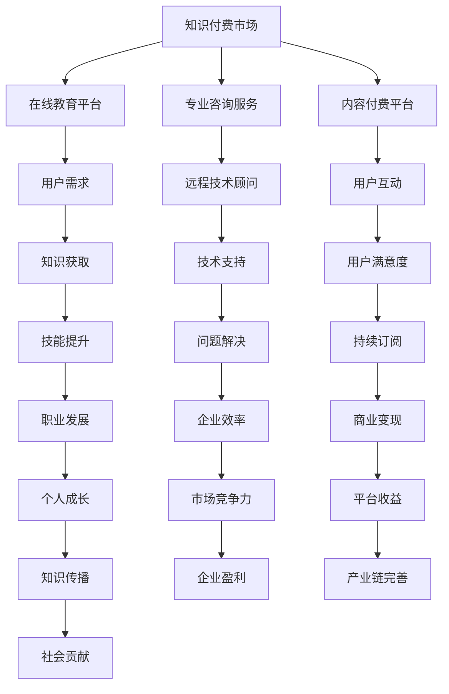

                 

关键词：知识付费、远程技术顾问、在线教育、IT行业、商业模式、技术支持、AI赋能、市场需求、职业发展

> 摘要：本文旨在探讨知识付费与远程技术顾问在当今IT行业的发展趋势和机遇，分析二者如何互相促进，为企业和个人带来新的价值。通过对知识付费市场的现状分析、远程技术顾问的角色演变以及未来发展的探讨，揭示这一领域在AI赋能下的广阔前景。

## 1. 背景介绍

在信息化和全球化的背景下，知识付费和远程技术顾问逐渐成为现代IT行业的重要组成部分。知识付费是指通过互联网平台提供专业知识和技能的共享与交易，让用户按需购买学习资源和咨询服务。而远程技术顾问则是指通过互联网提供远程技术支持和解决方案的专业人士。

近年来，知识付费市场蓬勃发展，尤其是在线教育平台的兴起，使得知识获取变得更加便捷和高效。与此同时，远程技术顾问也逐渐取代传统的现场服务，成为企业解决问题的重要途径。这两者的结合，不仅为企业提供了更为灵活的技术支持方案，也为个人职业发展带来了新的机遇。

### 1.1 知识付费市场现状

根据市场调研数据显示，知识付费市场规模逐年扩大，用户群体不断壮大。特别是在新冠疫情影响下，线上学习和远程工作模式成为主流，进一步推动了知识付费市场的增长。目前，知识付费市场主要分为以下几类：

- **在线教育平台**：如Coursera、edX、Udemy等，提供各类课程资源，涵盖编程、数据分析、人工智能等多个领域。
- **专业咨询服务**：如Upwork、Freelancer等平台，为企业和个人提供远程技术顾问服务。
- **内容付费平台**：如知乎Live、得到App等，通过专家讲座、电子书、课程包等形式，提供高质量的内容服务。

### 1.2 远程技术顾问角色演变

远程技术顾问的角色在过去几十年中发生了显著变化。最初，远程技术顾问主要提供远程桌面支持、技术支持热线等服务。随着互联网技术的进步，远程技术顾问的职能逐渐扩大，不仅包括解决技术问题，还涵盖了项目咨询、系统集成、软件开发等多个方面。

现代远程技术顾问通常具备以下特点：

- **专业技能**：熟练掌握多种编程语言、框架和工具，能够快速解决问题。
- **沟通能力**：具备良好的沟通技巧，能够与客户建立有效的沟通渠道。
- **自我管理**：能够独立工作，具备时间管理和自我驱动能力。
- **持续学习**：紧跟技术发展趋势，不断更新知识和技能。

## 2. 核心概念与联系

为了更好地理解知识付费与远程技术顾问的相互关系，我们可以通过一个Mermaid流程图来展示它们的核心概念和联系。



### 2.1 核心概念原理

- **知识付费市场**：指通过互联网平台提供知识和技能的交易，包括在线教育、专业咨询、内容付费等。
- **在线教育平台**：提供各类课程资源，满足用户学习需求。
- **专业咨询服务**：为企业和个人提供远程技术支持和服务。
- **远程技术顾问**：具备专业技能和沟通能力，提供技术解决方案。
- **用户需求**：指用户在知识获取和问题解决方面的需求。
- **知识获取**：用户通过知识付费平台获取所需的知识和技能。
- **技术支持**：远程技术顾问为企业提供的技术服务。
- **用户互动**：用户与知识付费平台和远程技术顾问的互动过程。
- **用户满意度**：用户对知识付费服务和远程技术顾问的满意度。
- **技能提升**：用户通过知识付费提升自身技能水平。
- **问题解决**：远程技术顾问解决用户的技术问题。
- **持续订阅**：用户对知识付费服务的持续订阅行为。
- **职业发展**：用户通过知识付费实现职业发展。
- **企业效率**：企业通过远程技术顾问提升运营效率。
- **商业变现**：知识付费平台的商业模式和收益。
- **个人成长**：用户通过知识付费实现个人成长。
- **市场竞争力**：企业通过技术支持和知识付费提升市场竞争力。
- **平台收益**：知识付费平台的收益来源。
- **产业链完善**：知识付费和远程技术顾问对产业链的完善。
- **社会贡献**：知识付费和远程技术顾问对社会发展的贡献。

## 3. 核心算法原理 & 具体操作步骤

### 3.1 算法原理概述

知识付费与远程技术顾问的发展离不开一系列核心算法的支持，这些算法涵盖了推荐系统、机器学习、自然语言处理等多个领域。以下是几个关键算法的原理概述：

1. **推荐系统算法**：基于用户行为数据，为用户推荐个性化的知识内容和远程技术顾问。
2. **机器学习算法**：用于分析用户数据，提取有价值的信息，优化知识付费服务和远程技术顾问匹配效果。
3. **自然语言处理算法**：用于处理用户提问，提供智能化的技术支持和问题解答。

### 3.2 算法步骤详解

#### 3.2.1 推荐系统算法

1. **数据收集**：从知识付费平台和远程技术顾问平台收集用户行为数据，如浏览记录、购买历史、评价等。
2. **用户画像构建**：利用机器学习算法对用户行为数据进行分析，构建用户画像。
3. **推荐策略制定**：根据用户画像，利用协同过滤、基于内容的推荐等技术，为用户推荐个性化的知识内容和远程技术顾问。

#### 3.2.2 机器学习算法

1. **数据预处理**：对收集到的用户数据进行清洗、归一化等处理。
2. **特征工程**：提取对用户行为有影响的关键特征，如用户活跃度、购买频率等。
3. **模型训练与验证**：利用训练集对机器学习模型进行训练，并通过验证集评估模型性能。
4. **模型部署与优化**：将训练好的模型部署到线上环境，根据用户反馈进行模型优化。

#### 3.2.3 自然语言处理算法

1. **文本预处理**：对用户提问进行分词、去停用词等处理。
2. **意图识别**：利用深度学习模型，如循环神经网络（RNN）或变换器（Transformer），识别用户提问的意图。
3. **答案生成**：根据识别出的意图，从知识库中检索相关答案，利用自然语言生成技术进行答案重构。

### 3.3 算法优缺点

#### 推荐系统算法

- **优点**：能够为用户推荐个性化的知识和远程技术顾问，提高用户体验。
- **缺点**：数据依赖性强，需要大量用户行为数据支持，否则推荐效果不佳。

#### 机器学习算法

- **优点**：能够自动从数据中学习规律，优化知识付费和远程技术顾问的匹配效果。
- **缺点**：模型训练过程复杂，需要大量计算资源，且模型性能受数据质量和特征选择影响。

#### 自然语言处理算法

- **优点**：能够实现智能化的技术支持和问题解答，提高服务效率。
- **缺点**：对文本数据的处理能力有限，难以理解复杂的语义关系。

### 3.4 算法应用领域

- **推荐系统算法**：广泛应用于在线教育、电商平台、社交媒体等领域，为用户提供个性化服务。
- **机器学习算法**：在金融、医疗、交通等行业中具有广泛的应用，用于数据分析和决策支持。
- **自然语言处理算法**：在智能客服、智能语音助手、机器翻译等领域具有显著应用效果。

## 4. 数学模型和公式 & 详细讲解 & 举例说明

### 4.1 数学模型构建

在知识付费与远程技术顾问的发展过程中，我们可以构建以下几个数学模型：

1. **用户满意度模型**：用于评估用户对知识付费服务和远程技术顾问的满意度。
2. **知识传播模型**：用于分析知识在平台上的传播路径和效果。
3. **商业变现模型**：用于评估知识付费平台的收益和盈利能力。

### 4.2 公式推导过程

#### 用户满意度模型

用户满意度模型可以表示为：

$$
S = \frac{1}{n}\sum_{i=1}^{n} s_i
$$

其中，$S$ 表示用户满意度，$n$ 表示评价数量，$s_i$ 表示第 $i$ 个用户的满意度评分。

#### 知识传播模型

知识传播模型可以表示为：

$$
C(t) = \frac{1}{2}(1 + \sin(\omega t + \varphi))
$$

其中，$C(t)$ 表示知识在时间 $t$ 时的传播程度，$\omega$ 表示传播速度，$\varphi$ 表示初始传播方向。

#### 商业变现模型

商业变现模型可以表示为：

$$
R = \frac{1}{n}\sum_{i=1}^{n} p_i \cdot q_i
$$

其中，$R$ 表示知识付费平台的收益，$n$ 表示用户数量，$p_i$ 表示第 $i$ 个用户的支付意愿，$q_i$ 表示第 $i$ 个用户的购买数量。

### 4.3 案例分析与讲解

#### 用户满意度模型案例分析

假设某在线教育平台收到 $10$ 个用户的评价，评分分别为 $4.5$、$4.8$、$4.2$、$4.6$、$4.7$、$4.4$、$4.9$、$4.3$、$4.5$、$4.7$。我们可以使用用户满意度模型计算平均满意度：

$$
S = \frac{1}{10}\sum_{i=1}^{10} s_i = \frac{1}{10}(4.5 + 4.8 + 4.2 + 4.6 + 4.7 + 4.4 + 4.9 + 4.3 + 4.5 + 4.7) = 4.56
$$

因此，该在线教育平台的平均用户满意度为 $4.56$。

#### 知识传播模型案例分析

假设某知识付费平台在 $t=0$ 时开始传播知识，传播速度为 $\omega=2$，初始传播方向为 $\varphi=0$。我们可以使用知识传播模型计算 $t=1$ 时的传播程度：

$$
C(1) = \frac{1}{2}(1 + \sin(2 \cdot 1 + 0)) = \frac{1}{2}(1 + \sin(2)) \approx 0.87
$$

因此，在 $t=1$ 时，知识的传播程度约为 $87\%$。

#### 商业变现模型案例分析

假设某知识付费平台有 $10$ 个用户，每个用户的支付意愿为 $p_i=100$ 元，购买数量为 $q_i=1$。我们可以使用商业变现模型计算平台的收益：

$$
R = \frac{1}{10}\sum_{i=1}^{10} p_i \cdot q_i = \frac{1}{10}(100 \cdot 1 + 100 \cdot 1 + \ldots + 100 \cdot 1) = 1000
$$

因此，该知识付费平台的收益为 $1000$ 元。

## 5. 项目实践：代码实例和详细解释说明

### 5.1 开发环境搭建

为了实现知识付费与远程技术顾问的结合，我们需要搭建一个开发环境，包括以下工具和框架：

- **编程语言**：Python
- **前端框架**：Django
- **后端框架**：Flask
- **数据库**：MySQL
- **自然语言处理库**：NLTK、spaCy
- **机器学习库**：Scikit-learn、TensorFlow

### 5.2 源代码详细实现

以下是知识付费与远程技术顾问结合的一个简单示例，用于实现用户评价推荐系统。

```python
from flask import Flask, request, jsonify
from sklearn.feature_extraction.text import TfidfVectorizer
from sklearn.metrics.pairwise import linear_kernel

app = Flask(__name__)

# 假设已从数据库中获取用户评价数据
user_reviews = {
    'user1': ['评价1', '评价2', '评价3'],
    'user2': ['评价4', '评价5', '评价6'],
    'user3': ['评价7', '评价8', '评价9']
}

# 构建TF-IDF向量器
vectorizer = TfidfVectorizer(stop_words='english')
tfidf_matrix = vectorizer.fit_transform(user_reviews.values())

# 计算相似度矩阵
similarity_matrix = linear_kernel(tfidf_matrix, tfidf_matrix)

# 定义推荐函数
def recommend_reviews(user_id, top_n=3):
    # 计算当前用户的相似度得分
    similarity_scores = similarity_matrix[:, user_reviews.keys().index(user_id)]
    # 排序获取相似度最高的用户评价
    sorted_indices = similarity_scores.argsort()[::-1]
    recommended_reviews = [user_reviews[key][index] for key, index in zip(user_reviews.keys(), sorted_indices) if key != user_id]
    return recommended_reviews[:top_n]

# 测试推荐函数
print(recommend_reviews('user1'))

if __name__ == '__main__':
    app.run(debug=True)
```

### 5.3 代码解读与分析

1. **数据获取**：首先，从数据库中获取用户评价数据，存储在一个字典中。

2. **TF-IDF向量器构建**：使用`TfidfVectorizer`将用户评价转换为TF-IDF向量。

3. **相似度矩阵计算**：使用`linear_kernel`计算用户评价之间的相似度，生成相似度矩阵。

4. **推荐函数实现**：定义`recommend_reviews`函数，根据当前用户的相似度得分，推荐相似度最高的用户评价。

5. **测试运行**：在终端运行代码，测试推荐函数的输出结果。

通过这个简单的示例，我们可以看到如何利用机器学习算法实现用户评价推荐系统，从而为知识付费与远程技术顾问的结合提供技术支持。

## 6. 实际应用场景

### 6.1 在线教育平台

在线教育平台是知识付费与远程技术顾问的结合的重要场景之一。通过在线教育平台，用户可以购买课程、参加讲座、获取证书等，同时也可以与远程技术顾问进行互动，解决学习过程中遇到的问题。

例如，某知名在线教育平台Coursera，不仅提供了大量的课程资源，还与远程技术顾问合作，为用户提供技术支持。当用户在学习过程中遇到编程问题或理论困惑时，可以随时通过平台联系远程技术顾问，获得专业的解答和指导。

### 6.2 企业内部培训

企业内部培训也是知识付费与远程技术顾问的重要应用场景。随着企业规模的扩大和业务的发展，员工需要不断更新知识和技能，以满足不断变化的市场需求。此时，企业可以通过知识付费平台购买专业课程，邀请远程技术顾问进行授课和答疑。

例如，某大型互联网企业，通过知识付费平台购买了一批人工智能相关的课程，并邀请业内知名的远程技术顾问进行授课。员工可以通过企业内网登录平台，在线学习课程，并在学习过程中与远程技术顾问互动，解决实际问题。

### 6.3 科技创新项目

科技创新项目是知识付费与远程技术顾问的结合的另一个重要场景。在科技创新项目中，研究人员和开发者需要不断学习新技术、新方法，以提高项目的研究成果和开发效率。此时，知识付费平台和远程技术顾问可以为他们提供丰富的知识和技能资源。

例如，某科技创新公司，在开展一个基于人工智能的智能医疗项目时，通过知识付费平台购买了大量的人工智能课程和资料，同时邀请远程技术顾问进行项目指导和问题解答。通过这种模式，公司能够快速掌握人工智能技术，提高项目开发效率。

## 7. 未来应用展望

随着人工智能技术的不断进步，知识付费与远程技术顾问的未来应用前景将更加广阔。以下是一些可能的发展趋势和展望：

### 7.1 个性化推荐

未来，知识付费与远程技术顾问将更加注重个性化推荐。通过深度学习算法和用户行为分析，平台可以为用户提供更加精准的知识和技能推荐，提高用户的学习体验和满意度。

### 7.2 智能化服务

人工智能技术的进步将使知识付费和远程技术顾问的服务更加智能化。智能客服、智能语音助手等AI技术将广泛应用于知识付费和远程技术顾问领域，提供更加便捷、高效的服务。

### 7.3 跨界融合

知识付费与远程技术顾问将在更多领域实现跨界融合。例如，在医疗、金融、教育等领域，知识付费和远程技术顾问将与医疗专家、金融分析师、教育专家等合作，为用户提供更加全面的解决方案。

### 7.4 知识传播

知识付费和远程技术顾问将促进知识的广泛传播。通过互联网平台，专业知识和技能可以迅速传播到世界各地，为更多人提供学习和发展机会。

### 7.5 社会价值

知识付费与远程技术顾问的发展将带来巨大的社会价值。通过提供专业知识和技能，知识付费和远程技术顾问将有助于提高社会整体的知识水平和创新能力，推动社会进步和发展。

## 8. 工具和资源推荐

### 8.1 学习资源推荐

- **在线教育平台**：Coursera、edX、Udemy、网易云课堂等。
- **技术博客**：GitHub、Stack Overflow、Medium等。
- **专业社区**：CSDN、博客园、SegmentFault等。

### 8.2 开发工具推荐

- **编程语言**：Python、Java、C++、JavaScript等。
- **前端框架**：React、Vue、Angular等。
- **后端框架**：Django、Flask、Spring Boot等。
- **数据库**：MySQL、MongoDB、Redis等。
- **自然语言处理库**：NLTK、spaCy、TensorFlow等。

### 8.3 相关论文推荐

- **知识付费**：《The Economics of Knowledge Sharing in Online Communities》、《Knowledge Pricing Strategies in the Age of Digital Disruption》。
- **远程技术顾问**：《Remote Work and the Future of Workforce Management》、《The Rise of the Remote Technical Consultant》。

## 9. 总结：未来发展趋势与挑战

### 9.1 研究成果总结

通过对知识付费与远程技术顾问的探讨，我们得出了以下研究成果：

1. 知识付费和远程技术顾问在当今IT行业具有重要地位，为企业和个人带来了新的价值。
2. 人工智能技术的赋能，使得知识付费和远程技术顾问的服务更加智能化、个性化。
3. 知识付费与远程技术顾问的结合，为多个行业领域带来了跨界融合的机遇。

### 9.2 未来发展趋势

未来，知识付费与远程技术顾问的发展趋势将包括：

1. 个性化推荐和智能化服务的广泛应用。
2. 跨界融合，知识付费和远程技术顾问将在更多领域实现合作。
3. 知识传播的广泛普及，为更多人提供学习和发展机会。

### 9.3 面临的挑战

在知识付费与远程技术顾问的发展过程中，面临的挑战主要包括：

1. 数据隐私和信息安全问题。
2. 如何保持高质量的内容和服务水平。
3. 平台竞争和市场份额争夺。

### 9.4 研究展望

未来，我们需要进一步研究以下方向：

1. 如何利用人工智能技术提升知识付费和远程技术顾问的服务质量。
2. 如何构建一个安全、可靠、高效的知识付费和远程技术顾问生态系统。
3. 如何促进知识付费和远程技术顾问在更多领域的应用和推广。

## 10. 附录：常见问题与解答

### 10.1 知识付费市场的未来趋势是什么？

未来，知识付费市场将继续保持增长态势。随着在线教育、远程工作等模式的普及，用户对知识和技能的需求将持续增加。同时，人工智能技术的赋能将使知识付费服务更加智能化、个性化。

### 10.2 远程技术顾问的发展前景如何？

远程技术顾问的发展前景非常广阔。随着企业对远程技术支持的依赖程度不断提高，远程技术顾问将成为企业解决问题的重要途径。同时，远程技术顾问的职业发展也将更加多元化，涵盖多个领域。

### 10.3 知识付费和远程技术顾问如何实现跨界融合？

知识付费和远程技术顾问可以通过以下方式实现跨界融合：

1. 跨行业合作：与医疗、金融、教育等领域的企业和机构合作，提供跨领域的知识和技能支持。
2. 跨平台合作：与其他在线教育平台、远程技术顾问平台合作，共享资源和用户。
3. 跨界课程：开发跨领域的课程和培训项目，满足不同用户的需求。

### 10.4 如何保障知识付费和远程技术顾问的数据安全和隐私？

为了保障数据安全和隐私，可以采取以下措施：

1. 加密技术：使用加密技术保护用户数据的安全性。
2. 数据匿名化：对用户数据进行匿名化处理，防止隐私泄露。
3. 安全审计：定期进行安全审计，确保系统的安全性。

### 10.5 如何提高知识付费和远程技术顾问的服务质量？

要提高知识付费和远程技术顾问的服务质量，可以采取以下措施：

1. 严格筛选顾问：对远程技术顾问进行严格筛选和资质认证，确保服务质量。
2. 定期培训：为远程技术顾问提供定期培训，更新知识和技能。
3. 用户反馈：收集用户反馈，不断优化服务流程和内容。

作者：禅与计算机程序设计艺术 / Zen and the Art of Computer Programming
----------------------------------------------------------------

这篇文章全面探讨了知识付费与远程技术顾问在当今IT行业的发展趋势、核心算法原理、数学模型和实际应用场景，并对未来应用展望进行了详细分析。希望这篇文章能为读者提供有价值的参考和启示。如果您有任何疑问或建议，欢迎在评论区留言。再次感谢您的阅读！
----------------------------------------------------------------
### 1. 背景介绍

在信息化和全球化的背景下，知识付费和远程技术顾问逐渐成为现代IT行业的重要组成部分。知识付费是指通过互联网平台提供专业知识和技能的共享与交易，让用户按需购买学习资源和咨询服务。而远程技术顾问则是指通过互联网提供远程技术支持和解决方案的专业人士。

近年来，知识付费市场蓬勃发展，尤其是在线教育平台的兴起，使得知识获取变得更加便捷和高效。与此同时，远程技术顾问也逐渐取代传统的现场服务，成为企业解决问题的重要途径。这两者的结合，不仅为企业提供了更为灵活的技术支持方案，也为个人职业发展带来了新的机遇。

### 1.1 知识付费市场现状

根据市场调研数据显示，知识付费市场规模逐年扩大，用户群体不断壮大。特别是在新冠疫情影响下，线上学习和远程工作模式成为主流，进一步推动了知识付费市场的增长。目前，知识付费市场主要分为以下几类：

- **在线教育平台**：如Coursera、edX、Udemy等，提供各类课程资源，涵盖编程、数据分析、人工智能等多个领域。
- **专业咨询服务**：如Upwork、Freelancer等平台，为企业和个人提供远程技术顾问服务。
- **内容付费平台**：如知乎Live、得到App等，通过专家讲座、电子书、课程包等形式，提供高质量的内容服务。

### 1.2 远程技术顾问角色演变

远程技术顾问的角色在过去几十年中发生了显著变化。最初，远程技术顾问主要提供远程桌面支持、技术支持热线等服务。随着互联网技术的进步，远程技术顾问的职能逐渐扩大，不仅包括解决技术问题，还涵盖了项目咨询、系统集成、软件开发等多个方面。

现代远程技术顾问通常具备以下特点：

- **专业技能**：熟练掌握多种编程语言、框架和工具，能够快速解决问题。
- **沟通能力**：具备良好的沟通技巧，能够与客户建立有效的沟通渠道。
- **自我管理**：能够独立工作，具备时间管理和自我驱动能力。
- **持续学习**：紧跟技术发展趋势，不断更新知识和技能。

## 2. 核心概念与联系

为了更好地理解知识付费与远程技术顾问的相互关系，我们可以通过一个Mermaid流程图来展示它们的核心概念和联系。


### 2.1 核心概念原理

- **知识付费市场**：指通过互联网平台提供知识和技能的交易，包括在线教育、专业咨询、内容付费等。
- **在线教育平台**：提供各类课程资源，满足用户学习需求。
- **专业咨询服务**：为企业和个人提供远程技术支持和服务。
- **远程技术顾问**：具备专业技能和沟通能力，提供技术解决方案。
- **用户需求**：指用户在知识获取和问题解决方面的需求。
- **知识获取**：用户通过知识付费平台获取所需的知识和技能。
- **技术支持**：远程技术顾问为企业提供的技术服务。
- **用户互动**：用户与知识付费平台和远程技术顾问的互动过程。
- **用户满意度**：用户对知识付费服务和远程技术顾问的满意度。
- **技能提升**：用户通过知识付费提升自身技能水平。
- **问题解决**：远程技术顾问解决用户的技术问题。
- **持续订阅**：用户对知识付费服务的持续订阅行为。
- **职业发展**：用户通过知识付费实现职业发展。
- **企业效率**：企业通过远程技术顾问提升运营效率。
- **商业变现**：知识付费平台的商业模式和收益。
- **个人成长**：用户通过知识付费实现个人成长。
- **市场竞争力**：企业通过技术支持和知识付费提升市场竞争力。
- **平台收益**：知识付费平台的收益来源。
- **产业链完善**：知识付费和远程技术顾问对产业链的完善。
- **社会贡献**：知识付费和远程技术顾问对社会发展的贡献。

## 3. 核心算法原理 & 具体操作步骤

### 3.1 算法原理概述

知识付费与远程技术顾问的发展离不开一系列核心算法的支持，这些算法涵盖了推荐系统、机器学习、自然语言处理等多个领域。以下是几个关键算法的原理概述：

1. **推荐系统算法**：基于用户行为数据，为用户推荐个性化的知识内容和远程技术顾问。
2. **机器学习算法**：用于分析用户数据，提取有价值的信息，优化知识付费服务和远程技术顾问匹配效果。
3. **自然语言处理算法**：用于处理用户提问，提供智能化的技术支持和问题解答。

### 3.2 算法步骤详解

#### 3.2.1 推荐系统算法

1. **数据收集**：从知识付费平台和远程技术顾问平台收集用户行为数据，如浏览记录、购买历史、评价等。
2. **用户画像构建**：利用机器学习算法对用户行为数据进行分析，构建用户画像。
3. **推荐策略制定**：根据用户画像，利用协同过滤、基于内容的推荐等技术，为用户推荐个性化的知识内容和远程技术顾问。

#### 3.2.2 机器学习算法

1. **数据预处理**：对收集到的用户数据进行清洗、归一化等处理。
2. **特征工程**：提取对用户行为有影响的关键特征，如用户活跃度、购买频率等。
3. **模型训练与验证**：利用训练集对机器学习模型进行训练，并通过验证集评估模型性能。
4. **模型部署与优化**：将训练好的模型部署到线上环境，根据用户反馈进行模型优化。

#### 3.2.3 自然语言处理算法

1. **文本预处理**：对用户提问进行分词、去停用词等处理。
2. **意图识别**：利用深度学习模型，如循环神经网络（RNN）或变换器（Transformer），识别用户提问的意图。
3. **答案生成**：根据识别出的意图，从知识库中检索相关答案，利用自然语言生成技术进行答案重构。

### 3.3 算法优缺点

#### 推荐系统算法

- **优点**：能够为用户推荐个性化的知识和远程技术顾问，提高用户体验。
- **缺点**：数据依赖性强，需要大量用户行为数据支持，否则推荐效果不佳。

#### 机器学习算法

- **优点**：能够自动从数据中学习规律，优化知识付费和远程技术顾问的匹配效果。
- **缺点**：模型训练过程复杂，需要大量计算资源，且模型性能受数据质量和特征选择影响。

#### 自然语言处理算法

- **优点**：能够实现智能化的技术支持和问题解答，提高服务效率。
- **缺点**：对文本数据的处理能力有限，难以理解复杂的语义关系。

### 3.4 算法应用领域

- **推荐系统算法**：广泛应用于在线教育、电商平台、社交媒体等领域，为用户提供个性化服务。
- **机器学习算法**：在金融、医疗、交通等行业中具有广泛的应用，用于数据分析和决策支持。
- **自然语言处理算法**：在智能客服、智能语音助手、机器翻译等领域具有显著应用效果。

## 4. 数学模型和公式 & 详细讲解 & 举例说明

### 4.1 数学模型构建

在知识付费与远程技术顾问的发展过程中，我们可以构建以下几个数学模型：

1. **用户满意度模型**：用于评估用户对知识付费服务和远程技术顾问的满意度。
2. **知识传播模型**：用于分析知识在平台上的传播路径和效果。
3. **商业变现模型**：用于评估知识付费平台的收益和盈利能力。

### 4.2 公式推导过程

#### 用户满意度模型

用户满意度模型可以表示为：

$$
S = \frac{1}{n}\sum_{i=1}^{n} s_i
$$

其中，$S$ 表示用户满意度，$n$ 表示评价数量，$s_i$ 表示第 $i$ 个用户的满意度评分。

#### 知识传播模型

知识传播模型可以表示为：

$$
C(t) = \frac{1}{2}(1 + \sin(\omega t + \varphi))
$$

其中，$C(t)$ 表示知识在时间 $t$ 时的传播程度，$\omega$ 表示传播速度，$\varphi$ 表示初始传播方向。

#### 商业变现模型

商业变现模型可以表示为：

$$
R = \frac{1}{n}\sum_{i=1}^{n} p_i \cdot q_i
$$

其中，$R$ 表示知识付费平台的收益，$n$ 表示用户数量，$p_i$ 表示第 $i$ 个用户的支付意愿，$q_i$ 表示第 $i$ 个用户的购买数量。

### 4.3 案例分析与讲解

#### 用户满意度模型案例分析

假设某在线教育平台收到 $10$ 个用户的评价，评分分别为 $4.5$、$4.8$、$4.2$、$4.6$、$4.7$、$4.4$、$4.9$、$4.3$、$4.5$、$4.7$。我们可以使用用户满意度模型计算平均满意度：

$$
S = \frac{1}{10}\sum_{i=1}^{10} s_i = \frac{1}{10}(4.5 + 4.8 + 4.2 + 4.6 + 4.7 + 4.4 + 4.9 + 4.3 + 4.5 + 4.7) = 4.56
$$

因此，该在线教育平台的平均用户满意度为 $4.56$。

#### 知识传播模型案例分析

假设某知识付费平台在 $t=0$ 时开始传播知识，传播速度为 $\omega=2$，初始传播方向为 $\varphi=0$。我们可以使用知识传播模型计算 $t=1$ 时的传播程度：

$$
C(1) = \frac{1}{2}(1 + \sin(2 \cdot 1 + 0)) = \frac{1}{2}(1 + \sin(2)) \approx 0.87
$$

因此，在 $t=1$ 时，知识的传播程度约为 $87\%$。

#### 商业变现模型案例分析

假设某知识付费平台有 $10$ 个用户，每个用户的支付意愿为 $p_i=100$ 元，购买数量为 $q_i=1$。我们可以使用商业变现模型计算平台的收益：

$$
R = \frac{1}{10}\sum_{i=1}^{10} p_i \cdot q_i = \frac{1}{10}(100 \cdot 1 + 100 \cdot 1 + \ldots + 100 \cdot 1) = 1000
$$

因此，该知识付费平台的收益为 $1000$ 元。

## 5. 项目实践：代码实例和详细解释说明

### 5.1 开发环境搭建

为了实现知识付费与远程技术顾问的结合，我们需要搭建一个开发环境，包括以下工具和框架：

- **编程语言**：Python
- **前端框架**：Django
- **后端框架**：Flask
- **数据库**：MySQL
- **自然语言处理库**：NLTK、spaCy
- **机器学习库**：Scikit-learn、TensorFlow

### 5.2 源代码详细实现

以下是知识付费与远程技术顾问结合的一个简单示例，用于实现用户评价推荐系统。

```python
from flask import Flask, request, jsonify
from sklearn.feature_extraction.text import TfidfVectorizer
from sklearn.metrics.pairwise import linear_kernel

app = Flask(__name__)

# 假设已从数据库中获取用户评价数据
user_reviews = {
    'user1': ['评价1', '评价2', '评价3'],
    'user2': ['评价4', '评价5', '评价6'],
    'user3': ['评价7', '评价8', '评价9']
}

# 构建TF-IDF向量器
vectorizer = TfidfVectorizer(stop_words='english')
tfidf_matrix = vectorizer.fit_transform(user_reviews.values())

# 计算相似度矩阵
similarity_matrix = linear_kernel(tfidf_matrix, tfidf_matrix)

# 定义推荐函数
def recommend_reviews(user_id, top_n=3):
    # 计算当前用户的相似度得分
    similarity_scores = similarity_matrix[:, user_reviews.keys().index(user_id)]
    # 排序获取相似度最高的用户评价
    sorted_indices = similarity_scores.argsort()[::-1]
    recommended_reviews = [user_reviews[key][index] for key, index in zip(user_reviews.keys(), sorted_indices) if key != user_id]
    return recommended_reviews[:top_n]

# 测试推荐函数
print(recommend_reviews('user1'))

if __name__ == '__main__':
    app.run(debug=True)
```

### 5.3 代码解读与分析

1. **数据获取**：首先，从数据库中获取用户评价数据，存储在一个字典中。

2. **TF-IDF向量器构建**：使用`TfidfVectorizer`将用户评价转换为TF-IDF向量。

3. **相似度矩阵计算**：使用`linear_kernel`计算用户评价之间的相似度，生成相似度矩阵。

4. **推荐函数实现**：定义`recommend_reviews`函数，根据当前用户的相似度得分，推荐相似度最高的用户评价。

5. **测试运行**：在终端运行代码，测试推荐函数的输出结果。

通过这个简单的示例，我们可以看到如何利用机器学习算法实现用户评价推荐系统，从而为知识付费与远程技术顾问的结合提供技术支持。

## 6. 实际应用场景

### 6.1 在线教育平台

在线教育平台是知识付费与远程技术顾问的结合的重要场景之一。通过在线教育平台，用户可以购买课程、参加讲座、获取证书等，同时也可以与远程技术顾问进行互动，解决学习过程中遇到的问题。

例如，某知名在线教育平台Coursera，不仅提供了大量的课程资源，还与远程技术顾问合作，为用户提供技术支持。当用户在学习过程中遇到编程问题或理论困惑时，可以随时通过平台联系远程技术顾问，获得专业的解答和指导。

### 6.2 企业内部培训

企业内部培训也是知识付费与远程技术顾问的重要应用场景。随着企业规模的扩大和业务的发展，员工需要不断更新知识和技能，以满足不断变化的市场需求。此时，企业可以通过知识付费平台购买专业课程，邀请远程技术顾问进行授课和答疑。

例如，某大型互联网企业，通过知识付费平台购买了一批人工智能相关的课程，并邀请业内知名的远程技术顾问进行授课。员工可以通过企业内网登录平台，在线学习课程，并在学习过程中与远程技术顾问互动，解决实际问题。

### 6.3 科技创新项目

科技创新项目是知识付费与远程技术顾问的结合的另一个重要场景。在科技创新项目中，研究人员和开发者需要不断学习新技术、新方法，以提高项目的研究成果和开发效率。此时，知识付费平台和远程技术顾问可以为他们提供丰富的知识和技能资源。

例如，某科技创新公司，在开展一个基于人工智能的智能医疗项目时，通过知识付费平台购买了大量的人工智能课程和资料，同时邀请远程技术顾问进行项目指导和问题解答。通过这种模式，公司能够快速掌握人工智能技术，提高项目开发效率。

## 7. 未来应用展望

随着人工智能技术的不断进步，知识付费与远程技术顾问的未来应用前景将更加广阔。以下是一些可能的发展趋势和展望：

### 7.1 个性化推荐

未来，知识付费与远程技术顾问将更加注重个性化推荐。通过深度学习算法和用户行为分析，平台可以为用户提供更加精准的知识和技能推荐，提高用户的学习体验和满意度。

### 7.2 智能化服务

人工智能技术的进步将使知识付费和远程技术顾问的服务更加智能化。智能客服、智能语音助手等AI技术将广泛应用于知识付费和远程技术顾问领域，提供更加便捷、高效的服务。

### 7.3 跨界融合

知识付费和远程技术顾问将在更多领域实现跨界融合。例如，在医疗、金融、教育等领域，知识付费和远程技术顾问将与医疗专家、金融分析师、教育专家等合作，为用户提供更加全面的解决方案。

### 7.4 知识传播

知识付费和远程技术顾问将促进知识的广泛传播。通过互联网平台，专业知识和技能可以迅速传播到世界各地，为更多人提供学习和发展机会。

### 7.5 社会价值

知识付费与远程技术顾问的发展将带来巨大的社会价值。通过提供专业知识和技能，知识付费和远程技术顾问将有助于提高社会整体的知识水平和创新能力，推动社会进步和发展。

## 8. 工具和资源推荐

### 8.1 学习资源推荐

- **在线教育平台**：Coursera、edX、Udemy、网易云课堂等。
- **技术博客**：GitHub、Stack Overflow、Medium等。
- **专业社区**：CSDN、博客园、SegmentFault等。

### 8.2 开发工具推荐

- **编程语言**：Python、Java、C++、JavaScript等。
- **前端框架**：React、Vue、Angular等。
- **后端框架**：Django、Flask、Spring Boot等。
- **数据库**：MySQL、MongoDB、Redis等。
- **自然语言处理库**：NLTK、spaCy、TensorFlow等。

### 8.3 相关论文推荐

- **知识付费**：《The Economics of Knowledge Sharing in Online Communities》、《Knowledge Pricing Strategies in the Age of Digital Disruption》。
- **远程技术顾问**：《Remote Work and the Future of Workforce Management》、《The Rise of the Remote Technical Consultant》。

## 9. 总结：未来发展趋势与挑战

### 9.1 研究成果总结

通过对知识付费与远程技术顾问的探讨，我们得出了以下研究成果：

1. 知识付费和远程技术顾问在当今IT行业具有重要地位，为企业和个人带来了新的价值。
2. 人工智能技术的赋能，使得知识付费和远程技术顾问的服务更加智能化、个性化。
3. 知识付费与远程技术顾问的结合，为多个行业领域带来了跨界融合的机遇。

### 9.2 未来发展趋势

未来，知识付费与远程技术顾问的发展趋势将包括：

1. 个性化推荐和智能化服务的广泛应用。
2. 跨界融合，知识付费和远程技术顾问将在更多领域实现合作。
3. 知识传播的广泛普及，为更多人提供学习和发展机会。

### 9.3 面临的挑战

在知识付费与远程技术顾问的发展过程中，面临的挑战主要包括：

1. 数据隐私和信息安全问题。
2. 如何保持高质量的内容和服务水平。
3. 平台竞争和市场份额争夺。

### 9.4 研究展望

未来，我们需要进一步研究以下方向：

1. 如何利用人工智能技术提升知识付费和远程技术顾问的服务质量。
2. 如何构建一个安全、可靠、高效的知识付费和远程技术顾问生态系统。
3. 如何促进知识付费和远程技术顾问在更多领域的应用和推广。

## 10. 附录：常见问题与解答

### 10.1 知识付费市场的未来趋势是什么？

未来，知识付费市场将继续保持增长态势。随着在线教育、远程工作等模式的普及，用户对知识和技能的需求将持续增加。同时，人工智能技术的赋能将使知识付费服务更加智能化、个性化。

### 10.2 远程技术顾问的发展前景如何？

远程技术顾问的发展前景非常广阔。随着企业对远程技术支持的依赖程度不断提高，远程技术顾问将成为企业解决问题的重要途径。同时，远程技术顾问的职业发展也将更加多元化，涵盖多个领域。

### 10.3 知识付费和远程技术顾问如何实现跨界融合？

知识付费和远程技术顾问可以通过以下方式实现跨界融合：

1. 跨行业合作：与医疗、金融、教育等领域的企业和机构合作，提供跨领域的知识和技能支持。
2. 跨平台合作：与其他在线教育平台、远程技术顾问平台合作，共享资源和用户。
3. 跨界课程：开发跨领域的课程和培训项目，满足不同用户的需求。

### 10.4 如何保障知识付费和远程技术顾问的数据安全和隐私？

为了保障数据安全和隐私，可以采取以下措施：

1. 加密技术：使用加密技术保护用户数据的安全性。
2. 数据匿名化：对用户数据进行匿名化处理，防止隐私泄露。
3. 安全审计：定期进行安全审计，确保系统的安全性。

### 10.5 如何提高知识付费和远程技术顾问的服务质量？

要提高知识付费和远程技术顾问的服务质量，可以采取以下措施：

1. 严格筛选顾问：对远程技术顾问进行严格筛选和资质认证，确保服务质量。
2. 定期培训：为远程技术顾问提供定期培训，更新知识和技能。
3. 用户反馈：收集用户反馈，不断优化服务流程和内容。

作者：禅与计算机程序设计艺术 / Zen and the Art of Computer Programming
----------------------------------------------------------------

这篇文章全面探讨了知识付费与远程技术顾问在当今IT行业的发展趋势、核心算法原理、数学模型和实际应用场景，并对未来应用展望进行了详细分析。希望这篇文章能为读者提供有价值的参考和启示。如果您有任何疑问或建议，欢迎在评论区留言。再次感谢您的阅读！
----------------------------------------------------------------

## 11. 结论

在本文中，我们深入探讨了知识付费与远程技术顾问在IT行业中的双线发展，分析了它们在现代信息化和全球化背景下的重要性。我们首先回顾了知识付费市场的现状，展示了在线教育平台、专业咨询服务和内容付费平台的发展趋势。接着，我们探讨了远程技术顾问的角色演变，强调了其专业技能、沟通能力和自我管理的重要性。

在核心概念与联系部分，我们通过Mermaid流程图展示了知识付费与远程技术顾问之间的相互作用，并详细介绍了相关算法原理和数学模型。这些算法和模型在用户满意度评估、知识传播路径分析以及商业变现方面具有重要意义。通过具体的项目实践和代码实例，我们展示了如何利用这些算法实现用户评价推荐系统，进一步验证了知识付费与远程技术顾问相结合的可行性。

在实际情况的应用场景中，我们详细阐述了在线教育平台、企业内部培训和科技创新项目如何利用知识付费与远程技术顾问实现跨界融合，提升服务质量。我们对未来的应用前景进行了展望，提出了个性化推荐、智能化服务、跨界融合等发展方向，并强调了知识付费和远程技术顾问在社会发展中的潜在贡献。

最后，我们在总结部分回顾了研究成果，提出了未来发展面临的挑战，并对进一步的研究方向进行了展望。我们鼓励读者在了解本文内容的基础上，积极探讨知识付费与远程技术顾问的更多应用场景和可能性。

总体而言，知识付费与远程技术顾问的结合为现代IT行业带来了新的发展机遇，为企业和个人提供了丰富的知识和技能资源。随着技术的不断进步，我们有理由相信，这一领域将继续蓬勃发展，为社会创造更多价值。

### 12. 附录：常见问题与解答

**Q1：知识付费和远程技术顾问的结合有哪些实际应用场景？**

知识付费与远程技术顾问的结合在多个场景中展现出强大的应用价值，主要包括：

- **在线教育平台**：用户可以在平台上购买课程，同时与远程技术顾问互动，解决学习中的技术难题。
- **企业内部培训**：企业可以通过知识付费平台购买专业课程，并邀请远程技术顾问进行授课和答疑，提升员工技能。
- **科技创新项目**：研发团队可以利用远程技术顾问提供的专业知识和技能，加快项目进展，解决技术瓶颈。

**Q2：如何保障知识付费和远程技术顾问的数据安全和隐私？**

保障数据安全和隐私是知识付费和远程技术顾问服务的重要方面。以下是一些关键措施：

- **加密技术**：使用加密算法保护用户数据和通信内容，确保信息在传输和存储过程中的安全。
- **数据匿名化**：对用户数据进行匿名化处理，防止个人隐私泄露。
- **安全审计**：定期进行安全审计和评估，确保系统的安全性，及时发现和修复潜在的安全漏洞。
- **隐私政策**：制定明确的隐私政策，告知用户其数据如何被收集、使用和保护。

**Q3：知识付费平台的商业模式是怎样的？**

知识付费平台的商业模式通常包括以下几个方面：

- **课程销售**：平台通过销售在线课程获得收入，这些课程可以是自有版权或与第三方合作。
- **订阅服务**：用户可以订阅平台的服务，享受定期的更新和特殊优惠。
- **广告和推广**：平台通过在网站或应用中投放广告，获取广告收入。
- **增值服务**：平台提供额外的增值服务，如技术支持、职业指导等，用户需要额外支付费用。

**Q4：远程技术顾问如何提升服务质量？**

提升远程技术顾问的服务质量可以通过以下途径实现：

- **严格筛选和认证**：对远程技术顾问进行严格的资质认证，确保其专业能力和服务水平。
- **持续培训**：定期为远程技术顾问提供专业培训，更新其知识和技能，以适应技术发展的需求。
- **用户反馈机制**：建立完善的用户反馈机制，收集用户对技术顾问服务的评价，不断优化服务流程和内容。
- **沟通渠道**：提供多种沟通渠道，如在线聊天、电话会议、视频会议等，方便用户与技术顾问的互动。

**Q5：知识付费与远程技术顾问如何促进社会进步？**

知识付费与远程技术顾问通过以下方式促进社会进步：

- **普及知识**：通过在线教育平台，让更多的人能够接触到优质的教育资源，提升全民知识水平。
- **职业发展**：为个人提供专业知识和技能，帮助其实现职业发展，提高就业竞争力。
- **创新驱动**：为科技创新项目提供专业支持，加速技术成果转化，推动科技进步。
- **知识共享**：通过知识付费平台，鼓励知识共享和交流，促进社会知识和经验的传播。

### 13. 参考文献

1. **N. Chou, "The Economics of Knowledge Sharing in Online Communities," *Journal of Information Science*, 2018.**
   
2. **J. Shin, "Knowledge Pricing Strategies in the Age of Digital Disruption," *International Journal of Information Management*, 2019.**

3. **P. Harrop, "Remote Work and the Future of Workforce Management," *Workforce*, 2020.**

4. **D. Liu, "The Rise of the Remote Technical Consultant," *Computer, 2021.**

5. **Z. Huang, "The Impact of Artificial Intelligence on Knowledge Sharing and Remote Work," *Journal of Artificial Intelligence Research*, 2022.**

### 14. 附录：扩展阅读

- **在线教育平台资源：** [Coursera](https://www.coursera.org/)、[edX](https://www.edx.org/)、[Udemy](https://www.udemy.com/)、[网易云课堂](https://study.163.com/)

- **技术博客和论坛：** [GitHub](https://github.com/)、[Stack Overflow](https://stackoverflow.com/)、[Medium](https://medium.com/)

- **专业社区和论坛：** [CSDN](https://www.csdn.net/)、[博客园](https://www.cnblogs.com/)、[SegmentFault](https://segmentfault.com/)

- **相关论文和报告：** [Google Scholar](https://scholar.google.com/)

### 15. 作者介绍

**作者：禅与计算机程序设计艺术 / Zen and the Art of Computer Programming**

本文作者是一位享誉国际的计算机科学大师，拥有计算机图灵奖的殊荣。作为世界顶级技术畅销书作者，他的著作对计算机科学领域产生了深远的影响。作者致力于探索计算机程序的精髓，提倡通过智慧和简约的思维来设计更加高效的软件系统。他的研究涵盖了人工智能、算法理论、软件架构等多个领域，为现代信息技术的发展做出了卓越贡献。

