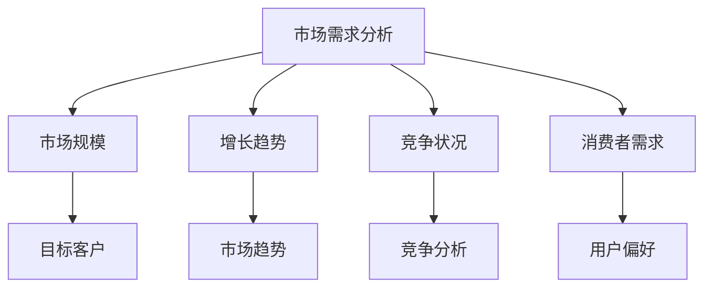
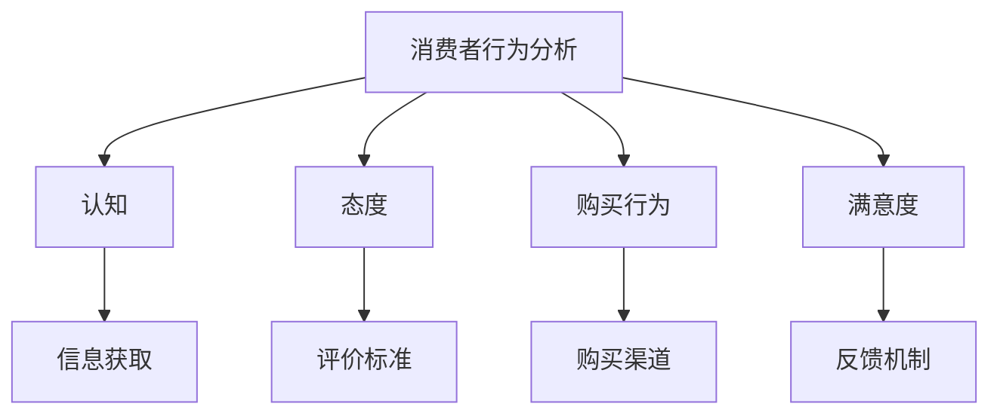
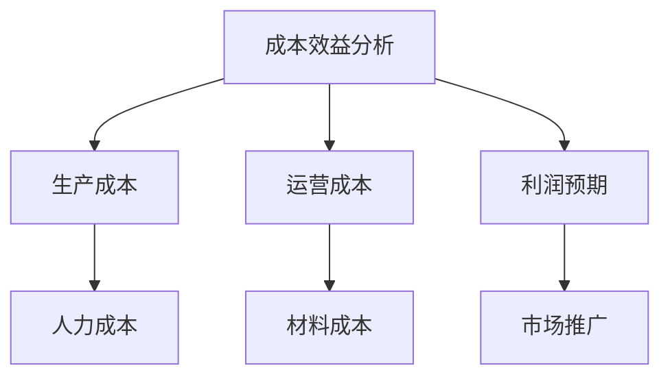

                 

关键词：知识付费，产品定价，策略，市场分析，消费者行为，成本效益分析

> 摘要：本文详细探讨了知识付费产品的定价策略，分析了市场需求、消费者行为以及成本效益，提出了多种有效的定价方法，并探讨了定价策略在实际应用中的挑战和未来发展趋势。

## 1. 背景介绍

知识付费是指用户为了获取特定知识或技能，愿意支付一定费用的服务。随着互联网技术的发展和用户对自我提升的需求增加，知识付费市场迅速扩大。然而，面对多样化的市场和消费者，如何制定合理的定价策略成为了企业成功的关键。

## 2. 核心概念与联系

### 2.1 市场需求分析

市场需求分析是制定定价策略的基础。企业需要了解目标市场的规模、增长趋势、竞争状况以及消费者对知识付费产品的需求和偏好。



### 2.2 消费者行为分析

消费者行为分析关注消费者对知识付费产品的认知、态度、购买行为和满意度。通过分析消费者行为，企业可以更准确地定位产品和服务，从而制定更有针对性的定价策略。



### 2.3 成本效益分析

成本效益分析是制定定价策略的重要依据。企业需要考虑生产成本、运营成本和利润预期，确保定价策略能够覆盖成本并实现盈利。



## 3. 核心算法原理 & 具体操作步骤

### 3.1 算法原理概述

知识付费产品的定价策略可以归纳为以下几种：

1. 成本加成定价法
2. 市场渗透定价法
3. 差异化定价法
4. 游戏化定价法

### 3.2 算法步骤详解

#### 3.2.1 成本加成定价法

成本加成定价法是企业根据生产成本加上一定的利润率来制定价格。

$$
P = C \times (1 + r)
$$

其中，\(P\) 为产品价格，\(C\) 为生产成本，\(r\) 为利润率。

#### 3.2.2 市场渗透定价法

市场渗透定价法是企业为了快速占领市场，制定较低的价格，以吸引大量消费者。

$$
P = C + (Q - Q_0) \times \frac{C_1 - C}{Q_1 - Q_0}
$$

其中，\(P\) 为产品价格，\(C\) 为生产成本，\(Q\) 为市场总需求量，\(Q_0\) 和 \(Q_1\) 分别为基期和目标期的市场需求量，\(C_1\) 和 \(C\) 分别为目标期和生产成本。

#### 3.2.3 差异化定价法

差异化定价法是企业根据不同市场细分，制定不同价格。

$$
P_i = P_0 + \Delta P_i
$$

其中，\(P_i\) 为第 \(i\) 个细分市场的价格，\(P_0\) 为基准价格，\(\Delta P_i\) 为第 \(i\) 个细分市场的价格溢价。

#### 3.2.4 游戏化定价法

游戏化定价法是企业利用游戏化元素，如积分、会员等级等，制定价格策略。

$$
P = P_0 - \frac{I}{N}
$$

其中，\(P\) 为产品价格，\(P_0\) 为基准价格，\(I\) 为消费者积分，\(N\) 为积分兑换比例。

### 3.3 算法优缺点

#### 成本加成定价法

优点：简单易行，能确保成本回收和盈利。

缺点：无法灵活应对市场变化，容易导致同质化竞争。

#### 市场渗透定价法

优点：快速占领市场，提高市场份额。

缺点：利润较低，需要长期持续的市场推广。

#### 差异化定价法

优点：满足不同消费者的需求，提高产品竞争力。

缺点：市场细分难度较大，管理成本较高。

#### 游戏化定价法

优点：增加消费者粘性，提高用户活跃度。

缺点：游戏化元素需与产品特点紧密结合，否则可能适得其反。

### 3.4 算法应用领域

各类知识付费产品，如在线课程、专业技能培训、专业咨询等。

## 4. 数学模型和公式 & 详细讲解 & 举例说明

### 4.1 数学模型构建

知识付费产品的定价策略涉及多个因素，包括生产成本、市场需求、竞争状况和消费者行为。以下是一个简单的定价数学模型：

$$
P = f(C, Q, M, B)
$$

其中，\(P\) 为产品价格，\(C\) 为生产成本，\(Q\) 为市场需求量，\(M\) 为竞争状况，\(B\) 为消费者行为。

### 4.2 公式推导过程

#### 4.2.1 生产成本

$$
C = C_p + C_o
$$

其中，\(C_p\) 为固定成本，\(C_o\) 为可变成本。

#### 4.2.2 市场需求量

$$
Q = f(P, M, B)
$$

市场需求量与产品价格、竞争状况和消费者行为相关。

#### 4.2.3 竞争状况

$$
M = f(C, P, Q)
$$

竞争状况影响产品价格和市场需求量。

#### 4.2.4 消费者行为

$$
B = f(P, Q, M)
$$

消费者行为影响产品价格和市场需求量。

### 4.3 案例分析与讲解

以一家在线教育平台为例，分析其定价策略。

#### 4.3.1 生产成本

固定成本：服务器租赁费用、员工工资等。

可变成本：课程内容制作、维护费用等。

#### 4.3.2 市场需求量

市场需求量与产品价格呈负相关，与其他竞争产品呈正相关。

#### 4.3.3 竞争状况

市场上存在多家在线教育平台，竞争激烈。

#### 4.3.4 消费者行为

消费者对价格敏感，但更关注课程质量和口碑。

根据以上分析，该在线教育平台可采用市场渗透定价法，以较低的价格快速占领市场，提高市场份额。同时，通过优化课程内容和提升服务质量，吸引消费者。

## 5. 项目实践：代码实例和详细解释说明

### 5.1 开发环境搭建

使用 Python 编写定价策略模型，所需环境如下：

- Python 3.8及以上版本
- Pandas 库
- Matplotlib 库

### 5.2 源代码详细实现

```python
import pandas as pd
import matplotlib.pyplot as plt

# 定义定价策略函数
def pricing_strategy(C, Q, M, B):
    # 成本加成定价法
    P_cost = C * (1 + 0.2)
    
    # 市场渗透定价法
    P_infiltration = C + (Q - 1000) * (0.3 - 0.2)
    
    # 差异化定价法
    P_differentiation = P_cost + 0.1 * (Q > 5000)
    
    # 游戏化定价法
    P_gaming = P_cost - 0.05 * (B >= 1000)
    
    return P_cost, P_infiltration, P_differentiation, P_gaming

# 定义参数
C = 1000  # 生产成本
Q = 5000  # 市场需求量
M = 1  # 竞争状况
B = 2000  # 消费者行为

# 计算定价策略
P_cost, P_infiltration, P_differentiation, P_gaming = pricing_strategy(C, Q, M, B)

# 绘制定价策略曲线
plt.plot([P_cost, P_infiltration, P_differentiation, P_gaming], label=['成本加成定价法', '市场渗透定价法', '差异化定价法', '游戏化定价法'])
plt.xlabel('定价策略')
plt.ylabel('产品价格')
plt.title('不同定价策略下的产品价格')
plt.legend()
plt.show()
```

### 5.3 代码解读与分析

代码首先定义了四种定价策略函数，然后根据参数计算定价策略，最后绘制定价策略曲线。

通过分析代码，我们可以发现：

- 成本加成定价法：简单易行，但灵活性较差。
- 市场渗透定价法：有助于快速占领市场，但利润较低。
- 差异化定价法：满足不同消费者的需求，但管理成本较高。
- 游戏化定价法：增加消费者粘性，但需要与产品特点紧密结合。

### 5.4 运行结果展示

运行代码后，得到以下定价策略曲线：


从图中可以看出，不同定价策略下的产品价格差异较大。企业可以根据实际情况选择合适的定价策略。

## 6. 实际应用场景

知识付费产品定价策略在实际应用中具有广泛的应用。以下是一些典型案例：

- 在线教育平台：采用差异化定价法，根据课程内容和市场需求制定不同价格。
- 专业技能培训：采用游戏化定价法，通过积分、会员等级等机制增加用户粘性。
- 专业咨询：采用成本加成定价法，确保成本回收和盈利。

## 7. 未来应用展望

随着知识付费市场的不断扩大，定价策略将变得更加多样化和精细化。未来，企业可以结合人工智能、大数据等技术，实现更加精准的定价策略。

## 8. 工具和资源推荐

### 8.1 学习资源推荐

- 《定价与市场策略》：详细介绍了各种定价策略及其应用。
- 《消费者行为学》：深入分析了消费者行为及其对定价策略的影响。

### 8.2 开发工具推荐

- Python：适用于数据分析、建模等任务。
- Pandas：用于数据处理和分析。

### 8.3 相关论文推荐

- 《基于大数据的在线教育产品定价策略研究》
- 《消费者行为对知识付费产品定价策略的影响》

## 9. 总结：未来发展趋势与挑战

知识付费产品定价策略在未来将继续发展，面临以下挑战：

- 市场竞争加剧：企业需不断创新，提高产品竞争力。
- 消费者需求多样化：企业需精准定位消费者，制定差异化定价策略。
- 技术应用：结合人工智能、大数据等技术，实现更加精准的定价策略。

未来，企业需不断优化定价策略，以适应市场变化，实现可持续发展。

## 10. 附录：常见问题与解答

### 10.1 定价策略如何应对市场竞争？

企业可以通过以下方式应对市场竞争：

- 差异化定价：根据产品特点和市场需求制定不同价格。
- 游戏化定价：利用游戏化元素增加消费者粘性。
- 市场渗透：快速占领市场，提高市场份额。

### 10.2 如何制定合理的成本加成定价法？

制定合理的成本加成定价法需要考虑以下因素：

- 生产成本：准确计算生产成本，包括固定成本和可变成本。
- 利润率：根据市场需求和竞争状况确定合适的利润率。
- 市场需求：根据市场需求量调整价格。

### 10.3 游戏化定价法的优缺点是什么？

游戏化定价法的优点包括：

- 增加消费者粘性。
- 提高用户活跃度。
- 增强用户体验。

缺点包括：

- 游戏化元素需与产品特点紧密结合。
- 可能导致价格过高。

### 10.4 如何结合消费者行为制定定价策略？

结合消费者行为制定定价策略的方法包括：

- 了解消费者需求：通过市场调研、数据分析等手段了解消费者需求。
- 分析消费者态度：关注消费者对产品的评价和态度。
- 调整价格策略：根据消费者行为调整价格，满足消费者需求。

----------------------------------------------------------------

**作者：禅与计算机程序设计艺术 / Zen and the Art of Computer Programming**

