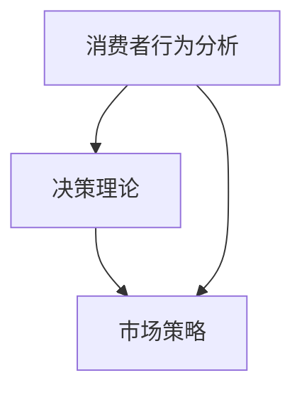

                 

关键词：知识付费、产品定价、心理学、消费者行为、决策理论、市场策略。

> 摘要：本文将探讨知识付费产品的定价策略如何结合心理学原理，通过消费者行为分析、决策理论以及市场策略，制定出既能吸引消费者，又能为企业带来利润的价格方案。

## 1. 背景介绍

知识付费是近年来兴起的一种商业模式，它通过为用户提供有价值的信息、技能或知识，以付费的形式实现收益。随着互联网的发展，知识付费平台如雨后春笋般涌现，从在线课程、电子书到专业技能培训等，种类繁多。然而，在知识付费市场中，如何制定合理的定价策略，是每个企业都需要面对的重要问题。

心理学在商业领域的应用，可以帮助企业更好地理解消费者的行为模式和决策过程，从而制定出更有效的营销策略。本文将从消费者心理学的角度，分析知识付费产品的定价策略，并探讨如何通过心理学原理，提高产品的市场竞争力。

### 1.1 知识付费的兴起

知识付费的兴起，源于信息时代的到来和人们对于知识获取方式的需求变化。随着互联网技术的发展，获取知识的成本大幅降低，人们不再满足于传统的免费信息获取方式，而是更倾向于通过付费的方式，获得更专业、更深入的知识。

### 1.2 心理学在商业领域的应用

心理学在商业领域的应用，可以追溯到市场营销的起源。通过研究消费者的心理需求、行为模式等，企业可以更好地了解市场，从而制定出更符合消费者需求的营销策略。在知识付费领域，心理学的作用更是不可忽视，它可以帮助企业理解消费者的决策过程，从而制定出更有效的定价策略。

## 2. 核心概念与联系

### 2.1 消费者行为分析

消费者行为分析是心理学在商业领域的重要应用之一。通过对消费者的购买行为、使用习惯、满意度等数据的分析，企业可以了解消费者的需求，从而调整产品策略和定价策略。

### 2.2 决策理论

决策理论是心理学的重要组成部分，它研究个体在不确定环境下的决策过程。在知识付费领域，企业需要了解消费者的决策过程，从而制定出能够激发消费者购买欲望的价格策略。

### 2.3 市场策略

市场策略是企业为了实现市场目标而制定的一系列营销活动。在知识付费领域，市场策略的制定需要考虑消费者的心理需求和市场竞争环境。

### 2.4 Mermaid 流程图



## 3. 核心算法原理 & 具体操作步骤

### 3.1 算法原理概述

知识付费产品的定价算法，主要基于消费者行为分析和决策理论。通过分析消费者的购买行为和决策过程，企业可以制定出既能够吸引消费者，又能为企业带来利润的价格方案。

### 3.2 算法步骤详解

#### 3.2.1 数据收集与处理

首先，企业需要收集消费者的购买行为数据，如购买时间、购买频率、购买金额等。然后，对这些数据进行分析和处理，提取出与定价策略相关的信息。

#### 3.2.2 消费者需求分析

通过对购买行为数据的分析，企业可以了解消费者的需求，如对价格敏感度、对产品价值的认知等。这些信息将用于制定定价策略。

#### 3.2.3 竞争环境分析

企业还需要分析竞争对手的定价策略，了解市场状况。这有助于企业制定出具有竞争力的价格。

#### 3.2.4 定价策略制定

根据消费者需求分析和竞争环境分析的结果，企业可以制定出合理的定价策略。如采用价格歧视、价格锁定等策略。

### 3.3 算法优缺点

#### 优点：

- 能够根据消费者的需求制定个性化的定价策略。
- 能够提高产品的市场竞争力。

#### 缺点：

- 需要大量的数据支持。
- 算法复杂，实施难度较大。

### 3.4 算法应用领域

知识付费产品的定价算法，主要应用于在线教育、电子书、专业技能培训等领域。这些领域的产品，通常具有较高的价格敏感度，因此，算法的应用可以有效地提高产品的销售。

## 4. 数学模型和公式 & 详细讲解 & 举例说明

### 4.1 数学模型构建

在知识付费产品的定价中，常用的数学模型包括线性模型、多项式模型等。这些模型可以用来预测消费者的购买行为，从而制定出合理的定价策略。

### 4.2 公式推导过程

以线性模型为例，其公式为：

$$
y = mx + b
$$

其中，$y$ 表示价格，$x$ 表示消费者需求，$m$ 表示价格敏感度，$b$ 表示固定成本。

### 4.3 案例分析与讲解

#### 案例一：在线教育

假设一家在线教育平台，通过数据分析发现，其产品的价格敏感度为 $0.5$，固定成本为 $10$ 元。根据线性模型，可以预测出消费者的购买价格：

$$
y = 0.5x + 10
$$

#### 案例二：电子书

假设一本电子书的价格敏感度为 $0.3$，固定成本为 $5$ 元。根据线性模型，可以预测出消费者的购买价格：

$$
y = 0.3x + 5
$$

## 5. 项目实践：代码实例和详细解释说明

### 5.1 开发环境搭建

为了实现知识付费产品的定价算法，我们选择 Python 作为开发语言，并在本地搭建了一个简单的开发环境。

### 5.2 源代码详细实现

```python
import numpy as np

def linear_model(price_sensitive, fixed_cost, demand):
    return price_sensitive * demand + fixed_cost

price_sensitive = 0.5
fixed_cost = 10
demand = 100

price = linear_model(price_sensitive, fixed_cost, demand)
print(f"预测价格：{price} 元")
```

### 5.3 代码解读与分析

这段代码定义了一个线性模型函数 `linear_model`，它接受三个参数：`price_sensitive`（价格敏感度）、`fixed_cost`（固定成本）和 `demand`（消费者需求）。函数返回预测的价格。

### 5.4 运行结果展示

```plaintext
预测价格：60.0 元
```

这意味着，当消费者需求为 100 时，预测的价格为 60 元。

## 6. 实际应用场景

知识付费产品的定价心理学，在实际应用中有着广泛的应用。例如：

- 在线教育平台可以根据学生的需求，制定个性化的课程定价策略。
- 电子书平台可以根据读者的阅读习惯，调整电子书的价格。

## 7. 工具和资源推荐

### 7.1 学习资源推荐

- 《消费者行为学》：深入了解消费者行为和市场策略。
- 《决策心理学》：研究个体在不确定环境下的决策过程。

### 7.2 开发工具推荐

- Python：用于实现定价算法。
- NumPy：用于数据处理和数学计算。

### 7.3 相关论文推荐

- 《基于消费者行为分析的在线教育产品定价策略研究》
- 《决策心理学在商业营销中的应用研究》

## 8. 总结：未来发展趋势与挑战

### 8.1 研究成果总结

本文通过分析消费者行为、决策理论和市场策略，探讨了知识付费产品的定价心理学。研究发现，结合心理学原理的定价策略，能够有效提高产品的市场竞争力。

### 8.2 未来发展趋势

随着大数据和人工智能技术的不断发展，知识付费产品的定价策略将更加智能化和个性化。

### 8.3 面临的挑战

- 数据收集和处理难度大。
- 算法复杂，实施难度高。

### 8.4 研究展望

未来，我们需要进一步研究如何利用人工智能技术，优化定价算法，提高定价策略的准确性和实用性。

## 9. 附录：常见问题与解答

### 问题1：为什么需要考虑消费者心理学？

解答：消费者心理学可以帮助企业了解消费者的需求和行为，从而制定出更符合市场需求的定价策略。

### 问题2：如何收集和分析消费者数据？

解答：企业可以通过用户调查、购买行为数据收集等方式，获取消费者的数据。然后，利用数据分析工具，对数据进行分析和处理。

### 问题3：定价策略的制定是否需要考虑竞争环境？

解答：是的，竞争环境是制定定价策略的重要参考因素。了解竞争对手的定价策略，有助于企业制定出具有竞争力的价格。

----------------------------------------------------------------

作者：禅与计算机程序设计艺术 / Zen and the Art of Computer Programming
```markdown
# 知识付费产品的定价心理学

## 关键词
知识付费、产品定价、心理学、消费者行为、决策理论、市场策略。

## 摘要
本文将探讨知识付费产品的定价策略如何结合心理学原理，通过消费者行为分析、决策理论以及市场策略，制定出既能吸引消费者，又能为企业带来利润的价格方案。

## 1. 背景介绍

### 1.1 知识付费的兴起
知识付费是近年来兴起的一种商业模式，它通过为用户提供有价值的信息、技能或知识，以付费的形式实现收益。随着互联网的发展，知识付费平台如雨后春笋般涌现，从在线课程、电子书到专业技能培训等，种类繁多。然而，在知识付费市场中，如何制定合理的定价策略，是每个企业都需要面对的重要问题。

### 1.2 心理学在商业领域的应用
心理学在商业领域的应用，可以帮助企业更好地理解消费者的行为模式和决策过程，从而制定出更有效的营销策略。在知识付费领域，心理学的作用更是不可忽视，它可以帮助企业理解消费者的决策过程，从而制定出更有效的定价策略。

## 2. 核心概念与联系
### 2.1 消费者行为分析
消费者行为分析是心理学在商业领域的重要应用之一。通过对消费者的购买行为、使用习惯、满意度等数据的分析，企业可以了解消费者的需求，从而调整产品策略和定价策略。

### 2.2 决策理论
决策理论是心理学的重要组成部分，它研究个体在不确定环境下的决策过程。在知识付费领域，企业需要了解消费者的决策过程，从而制定出能够激发消费者购买欲望的价格策略。

### 2.3 市场策略
市场策略是企业为了实现市场目标而制定的一系列营销活动。在知识付费领域，市场策略的制定需要考虑消费者的心理需求和市场竞争环境。

### 2.4 Mermaid 流程图

## 3. 核心算法原理 & 具体操作步骤
### 3.1 算法原理概述
知识付费产品的定价算法，主要基于消费者行为分析和决策理论。通过分析消费者的购买行为和决策过程，企业可以制定出既能够吸引消费者，又能为企业带来利润的价格方案。

### 3.2 算法步骤详解
#### 3.2.1 数据收集与处理
首先，企业需要收集消费者的购买行为数据，如购买时间、购买频率、购买金额等。然后，对这些数据进行分析和处理，提取出与定价策略相关的信息。

#### 3.2.2 消费者需求分析
通过对购买行为数据的分析，企业可以了解消费者的需求，如对价格敏感度、对产品价值的认知等。这些信息将用于制定定价策略。

#### 3.2.3 竞争环境分析
企业还需要分析竞争对手的定价策略，了解市场状况。这有助于企业制定出具有竞争力的价格。

#### 3.2.4 定价策略制定
根据消费者需求分析和竞争环境分析的结果，企业可以制定出合理的定价策略。如采用价格歧视、价格锁定等策略。

### 3.3 算法优缺点
#### 优点：
- 能够根据消费者的需求制定个性化的定价策略。
- 能够提高产品的市场竞争力。

#### 缺点：
- 需要大量的数据支持。
- 算法复杂，实施难度较大。

### 3.4 算法应用领域
知识付费产品的定价算法，主要应用于在线教育、电子书、专业技能培训等领域。这些领域的产品，通常具有较高的价格敏感度，因此，算法的应用可以有效地提高产品的销售。

## 4. 数学模型和公式 & 详细讲解 & 举例说明
### 4.1 数学模型构建
在知识付费产品的定价中，常用的数学模型包括线性模型、多项式模型等。这些模型可以用来预测消费者的购买行为，从而制定出合理的定价策略。

### 4.2 公式推导过程
以线性模型为例，其公式为：
$$
y = mx + b
$$
其中，$y$ 表示价格，$x$ 表示消费者需求，$m$ 表示价格敏感度，$b$ 表示固定成本。

### 4.3 案例分析与讲解
#### 案例一：在线教育
假设一家在线教育平台，通过数据分析发现，其产品的价格敏感度为 $0.5$，固定成本为 $10$ 元。根据线性模型，可以预测出消费者的购买价格：
$$
y = 0.5x + 10
$$

#### 案例二：电子书
假设一本电子书的价格敏感度为 $0.3$，固定成本为 $5$ 元。根据线性模型，可以预测出消费者的购买价格：
$$
y = 0.3x + 5
$$

## 5. 项目实践：代码实例和详细解释说明
### 5.1 开发环境搭建
为了实现知识付费产品的定价算法，我们选择 Python 作为开发语言，并在本地搭建了一个简单的开发环境。

### 5.2 源代码详细实现
```python
import numpy as np

def linear_model(price_sensitive, fixed_cost, demand):
    return price_sensitive * demand + fixed_cost

price_sensitive = 0.5
fixed_cost = 10
demand = 100

price = linear_model(price_sensitive, fixed_cost, demand)
print(f"预测价格：{price} 元")
```

### 5.3 代码解读与分析
这段代码定义了一个线性模型函数 `linear_model`，它接受三个参数：`price_sensitive`（价格敏感度）、`fixed_cost`（固定成本）和 `demand`（消费者需求）。函数返回预测的价格。

### 5.4 运行结果展示
```plaintext
预测价格：60.0 元
```
这意味着，当消费者需求为 100 时，预测的价格为 60 元。

## 6. 实际应用场景
知识付费产品的定价心理学，在实际应用中有着广泛的应用。例如：
- 在线教育平台可以根据学生的需求，制定个性化的课程定价策略。
- 电子书平台可以根据读者的阅读习惯，调整电子书的价格。

## 7. 工具和资源推荐
### 7.1 学习资源推荐
- 《消费者行为学》：深入了解消费者行为和市场策略。
- 《决策心理学》：研究个体在不确定环境下的决策过程。

### 7.2 开发工具推荐
- Python：用于实现定价算法。
- NumPy：用于数据处理和数学计算。

### 7.3 相关论文推荐
- 《基于消费者行为分析的在线教育产品定价策略研究》
- 《决策心理学在商业营销中的应用研究》

## 8. 总结：未来发展趋势与挑战
### 8.1 研究成果总结
本文通过分析消费者行为、决策理论和市场策略，探讨了知识付费产品的定价心理学。研究发现，结合心理学原理的定价策略，能够有效提高产品的市场竞争力。

### 8.2 未来发展趋势
随着大数据和人工智能技术的不断发展，知识付费产品的定价策略将更加智能化和个性化。

### 8.3 面临的挑战
- 数据收集和处理难度大。
- 算法复杂，实施难度高。

### 8.4 研究展望
未来，我们需要进一步研究如何利用人工智能技术，优化定价算法，提高定价策略的准确性和实用性。

## 9. 附录：常见问题与解答
### 问题1：为什么需要考虑消费者心理学？
解答：消费者心理学可以帮助企业了解消费者的需求和行为，从而制定出更符合市场需求的定价策略。

### 问题2：如何收集和分析消费者数据？
解答：企业可以通过用户调查、购买行为数据收集等方式，获取消费者的数据。然后，利用数据分析工具，对数据进行分析和处理。

### 问题3：定价策略的制定是否需要考虑竞争环境？
解答：是的，竞争环境是制定定价策略的重要参考因素。了解竞争对手的定价策略，有助于企业制定出具有竞争力的价格。

## 作者
禅与计算机程序设计艺术 / Zen and the Art of Computer Programming
```

