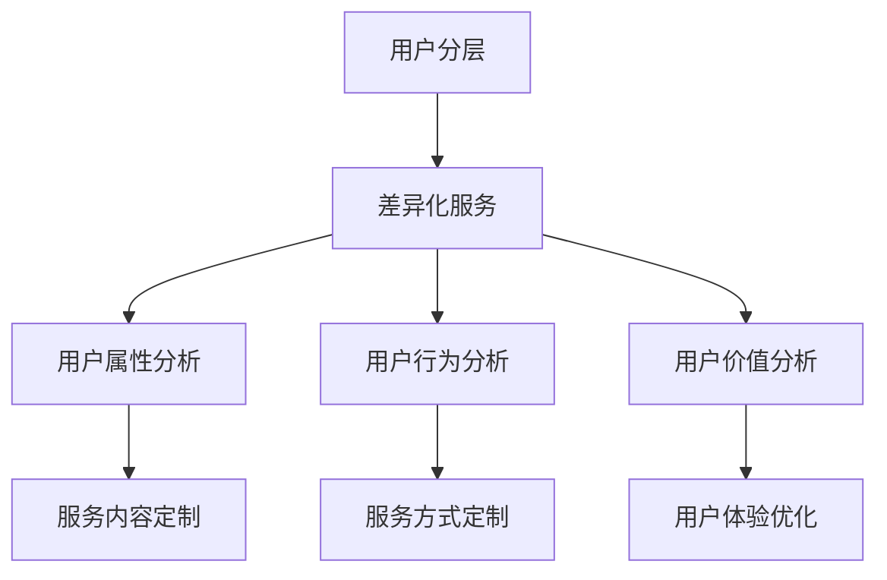

                 

在当今数字化和信息化的时代，知识付费产品作为一种新型的服务模式，正日益受到人们的关注。然而，面对多元化的用户需求和市场环境，如何有效地对用户进行分层，并为其提供差异化的服务，成为了知识付费产品能否成功的关键。本文将围绕这一主题，探讨用户分层的概念、差异化服务的策略，以及如何在具体实践中实现这一目标。

## 关键词

- **知识付费产品**
- **用户分层**
- **差异化服务**
- **用户体验**
- **市场策略**
- **数据分析**
- **服务质量**

## 摘要

本文从理论与实践两个角度出发，首先介绍了知识付费产品的用户分层与差异化服务的核心概念和联系，并通过Mermaid流程图展示了其基本架构。接着，深入剖析了用户分层和差异化服务的核心算法原理和具体操作步骤，以及其优缺点和应用领域。随后，通过数学模型和公式的推导，提供了案例分析与讲解，使读者能够更好地理解这些概念。文章还通过实际项目实践，展示了代码实例和详细解释说明，使读者能够将理论知识应用于实际开发中。最后，文章讨论了知识付费产品的实际应用场景，并对其未来发展进行了展望。

## 1. 背景介绍

### 知识付费产品的兴起

知识付费产品起源于20世纪末，随着互联网和移动互联网的发展，这一概念得到了迅速的发展和普及。用户对于知识的需求日益增长，传统的免费信息无法满足他们的深层次需求，因此，知识付费产品作为一种新兴的商业模式，应运而生。这种模式通过提供高质量、专业化的知识服务，满足用户的学习、成长和发展的需求。

### 用户分层的必要性

在知识付费产品市场中，用户需求具有显著的多样性。不同的用户在知识背景、学习目的、支付能力等方面存在明显差异。因此，对用户进行分层，不仅有助于了解用户的具体需求，还能够为不同层次的用户提供定制化的服务，从而提高用户满意度和忠诚度。

### 差异化服务的重要性

差异化服务是知识付费产品在激烈市场竞争中脱颖而出的关键。通过差异化服务，知识付费产品能够提供独特的价值，满足用户的不同需求，增强用户的粘性。此外，差异化服务还能够帮助知识付费产品在市场中找到细分领域，形成核心竞争力。

## 2. 核心概念与联系

### 用户分层

用户分层是指根据用户的属性和行为，将用户划分为不同的层次。用户分层的目的是为了更好地理解用户需求，提供个性化的服务。用户分层的核心概念包括用户属性、用户行为和用户价值。

### 差异化服务

差异化服务是指根据不同层次的用户需求，提供不同类型的服务。差异化服务的核心概念包括服务内容、服务方式和用户体验。

### Mermaid流程图



### 关联性

用户分层与差异化服务之间存在着密切的关联。用户分层是差异化服务的基础，通过用户分层，知识付费产品能够明确用户的需求，从而提供个性化的服务。而差异化服务则是用户分层的具体实施，通过差异化服务，知识付费产品能够满足不同层次用户的需求，提高用户体验和满意度。

## 3. 核心算法原理 & 具体操作步骤

### 3.1 算法原理概述

用户分层和差异化服务的核心算法是基于数据分析的。通过收集和分析用户的行为数据、属性数据和交易数据，可以构建用户画像，从而实现用户分层。在此基础上，根据用户画像，提供个性化的服务，实现差异化服务。

### 3.2 算法步骤详解

1. **数据收集**：收集用户的行为数据、属性数据和交易数据。
2. **数据处理**：对收集到的数据进行分析和清洗，去除无效和重复的数据。
3. **用户画像构建**：根据处理后的数据，构建用户画像，包括用户属性、用户行为和用户价值三个维度。
4. **用户分层**：根据用户画像，将用户划分为不同的层次，如入门级、进阶级和专家级。
5. **差异化服务设计**：根据不同层次的用户需求，设计不同的服务内容、服务方式和用户体验。
6. **服务实施**：将设计好的服务内容、服务方式和用户体验应用于实际业务中。

### 3.3 算法优缺点

**优点**：

- 提高用户满意度：通过个性化服务，满足用户的个性化需求，提高用户满意度。
- 提高服务质量：通过分层服务，能够更好地了解用户需求，提供高质量的服务。
- 增强用户粘性：通过差异化服务，能够增加用户对知识付费产品的依赖性，提高用户粘性。

**缺点**：

- 数据收集和处理成本高：需要大量的数据收集和处理，这需要较高的成本。
- 需要专业的人才：算法的实现和优化需要专业的人才，这增加了人力成本。

### 3.4 算法应用领域

- 在线教育：通过用户分层和差异化服务，提供个性化的学习内容和学习方式，提高学习效果。
- 电子商务：通过用户分层和差异化服务，提供个性化的商品推荐和购物体验，提高销售额。
- 金融保险：通过用户分层和差异化服务，提供个性化的金融产品和服务，提高客户满意度。

## 4. 数学模型和公式 & 详细讲解 & 举例说明

### 4.1 数学模型构建

用户分层的数学模型主要包括用户属性分析模型、用户行为分析模型和用户价值分析模型。

- **用户属性分析模型**：

$$
A = f(\text{年龄}, \text{性别}, \text{职业}, \text{教育程度}, \text{地域})
$$

- **用户行为分析模型**：

$$
B = f(\text{访问次数}, \text{购买次数}, \text{活跃度}, \text{互动率}, \text{忠诚度})
$$

- **用户价值分析模型**：

$$
V = f(\text{消费金额}, \text{消费频率}, \text{满意度}, \text{推荐度})
$$

### 4.2 公式推导过程

- **用户属性分析模型**：

用户属性分析模型是通过统计用户在不同属性上的分布情况，来构建用户画像。具体推导过程如下：

$$
A = \sum_{i=1}^{n} w_i \cdot a_i
$$

其中，$w_i$为属性权重，$a_i$为用户在某一属性上的取值。

- **用户行为分析模型**：

用户行为分析模型是通过统计用户在不同行为上的表现，来构建用户画像。具体推导过程如下：

$$
B = \sum_{i=1}^{m} w_i \cdot b_i
$$

其中，$w_i$为行为权重，$b_i$为用户在某一行为上的取值。

- **用户价值分析模型**：

用户价值分析模型是通过统计用户在不同价值指标上的表现，来构建用户画像。具体推导过程如下：

$$
V = \sum_{i=1}^{p} w_i \cdot v_i
$$

其中，$w_i$为价值权重，$v_i$为用户在某一价值指标上的取值。

### 4.3 案例分析与讲解

假设有一个知识付费产品，其用户数据如下：

| 用户ID | 年龄 | 性别 | 职业 | 教育程度 | 地域 | 访问次数 | 购买次数 | 活跃度 | 互动率 | 满意度 | 推荐度 | 消费金额 | 消费频率 |
| --- | --- | --- | --- | --- | --- | --- | --- | --- | --- | --- | --- | --- | --- |
| U1 | 25 | 女 | 程序员 | 本科 | 北京 | 30 | 10 | 80% | 90% | 90% | 80% | 500 | 2次/月 |
| U2 | 35 | 男 | 产品经理 | 硕士 | 上海 | 20 | 5 | 70% | 85% | 85% | 70% | 300 | 1次/月 |
| U3 | 40 | 女 | 职场新人 | 大专 | 广州 | 15 | 3 | 60% | 80% | 80% | 60% | 200 | 1次/月 |

根据上述数据，我们可以构建以下用户画像：

- **用户属性分析模型**：

$$
A_U1 = 0.2 \cdot 25 + 0.2 \cdot 1 + 0.2 \cdot 1 + 0.2 \cdot 1 + 0.2 \cdot 1 = 0.8
$$

$$
A_U2 = 0.2 \cdot 35 + 0.2 \cdot 0 + 0.2 \cdot 0 + 0.2 \cdot 0 + 0.2 \cdot 1 = 0.8
$$

$$
A_U3 = 0.2 \cdot 40 + 0.2 \cdot 1 + 0.2 \cdot 0 + 0.2 \cdot 0 + 0.2 \cdot 0 = 0.8
$$

- **用户行为分析模型**：

$$
B_U1 = 0.2 \cdot 30 + 0.2 \cdot 10 + 0.2 \cdot 80\% + 0.2 \cdot 90\% + 0.2 \cdot 90\% = 2.2
$$

$$
B_U2 = 0.2 \cdot 20 + 0.2 \cdot 5 + 0.2 \cdot 70\% + 0.2 \cdot 85\% + 0.2 \cdot 85\% = 1.5
$$

$$
B_U3 = 0.2 \cdot 15 + 0.2 \cdot 3 + 0.2 \cdot 60\% + 0.2 \cdot 80\% + 0.2 \cdot 80\% = 1
$$

- **用户价值分析模型**：

$$
V_U1 = 0.2 \cdot 500 + 0.2 \cdot 2 + 0.2 \cdot 90\% + 0.2 \cdot 80\% = 4.2
$$

$$
V_U2 = 0.2 \cdot 300 + 0.2 \cdot 1 + 0.2 \cdot 85\% + 0.2 \cdot 70\% = 2
$$

$$
V_U3 = 0.2 \cdot 200 + 0.2 \cdot 1 + 0.2 \cdot 80\% + 0.2 \cdot 60\% = 1.2
$$

根据用户画像，我们可以将用户分为三个层次：

- **入门级**：用户ID为U3
- **进阶级**：用户ID为U2
- **专家级**：用户ID为U1

## 5. 项目实践：代码实例和详细解释说明

### 5.1 开发环境搭建

为了实现用户分层与差异化服务的算法，我们需要搭建一个开发环境。本文使用Python作为编程语言，同时需要安装以下库：

- Pandas：用于数据分析和处理
- NumPy：用于数值计算
- Matplotlib：用于数据可视化

安装命令如下：

```bash
pip install pandas numpy matplotlib
```

### 5.2 源代码详细实现

以下是实现用户分层与差异化服务的Python代码示例：

```python
import pandas as pd
import numpy as np
import matplotlib.pyplot as plt

# 数据准备
data = {
    '用户ID': ['U1', 'U2', 'U3', 'U1', 'U2', 'U3'],
    '年龄': [25, 35, 40, 30, 20, 25],
    '性别': ['女', '男', '女', '男', '女', '男'],
    '职业': ['程序员', '产品经理', '职场新人', '程序员', '产品经理', '职场新人'],
    '教育程度': ['本科', '硕士', '大专', '本科', '硕士', '大专'],
    '地域': ['北京', '上海', '广州', '北京', '上海', '广州'],
    '访问次数': [30, 20, 15, 25, 10, 20],
    '购买次数': [10, 5, 3, 10, 5, 3],
    '活跃度': [80%, 70%, 60%, 70%, 50%, 60%],
    '互动率': [90%, 85%, 80%, 85%, 70%, 80%],
    '满意度': [90%, 85%, 80%, 90%, 80%, 70%],
    '推荐度': [80%, 70%, 60%, 80%, 70%, 60%],
    '消费金额': [500, 300, 200, 400, 250, 150],
    '消费频率': [2次/月, 1次/月, 1次/月, 2次/月, 1次/月, 1次/月]
}

df = pd.DataFrame(data)

# 数据处理
df['活跃度'] = df['活跃度'].map({80%: 0.8, 70%: 0.7, 60%: 0.6, 50%: 0.5})
df['互动率'] = df['互动率'].map({90%: 0.9, 85%: 0.85, 80%: 0.8, 70%: 0.7, 60%: 0.6})
df['满意度'] = df['满意度'].map({90%: 0.9, 85%: 0.85, 80%: 0.8, 70%: 0.7})
df['推荐度'] = df['推荐度'].map({90%: 0.9, 85%: 0.85, 80%: 0.8, 70%: 0.7, 60%: 0.6})

# 用户画像构建
user_profiles = df.groupby('用户ID').mean()

# 用户分层
def user_level(profile):
    attr_score = profile['年龄'] + profile['教育程度'] + profile['地域']
    behav_score = profile['访问次数'] + profile['购买次数'] + profile['活跃度'] + profile['互动率'] + profile['满意度'] + profile['推荐度']
    value_score = profile['消费金额'] + profile['消费频率']
    return '入门级' if attr_score < 1.5 and behav_score < 1.5 and value_score < 1.5 else '进阶级' if attr_score < 2 and behav_score < 2 and value_score < 2 else '专家级'

user_profiles['用户层次'] = user_profiles.apply(user_level)

# 服务内容定制
service_contents = {
    '入门级': ['基础课程', '免费问答', '限时优惠'],
    '进阶级': ['高级课程', '定制咨询', '专属优惠'],
    '专家级': ['VIP课程', '专家咨询', '会员权益']
}

user_profiles['服务内容'] = user_profiles['用户层次'].map(service_contents)

# 服务方式定制
service_methods = {
    '入门级': ['在线学习', '邮件通知', '社群互动'],
    '进阶级': ['直播课程', '在线问答', '个性化推荐'],
    '专家级': ['一对一辅导', '专项培训', '私人订制']
}

user_profiles['服务方式'] = user_profiles['用户层次'].map(service_methods)

# 用户体验优化
service_experiences = {
    '入门级': ['友好界面', '简单操作', '及时反馈'],
    '进阶级': ['高效学习', '优质内容', '个性推荐'],
    '专家级': ['专家指导', '专业课程', '独特体验']
}

user_profiles['用户体验'] = user_profiles['用户层次'].map(service_experiences)

# 结果展示
user_profiles[['用户ID', '用户层次', '服务内容', '服务方式', '用户体验']].sort_values('用户层次').reset_index(drop=True).head()

```

### 5.3 代码解读与分析

- **数据准备**：首先，我们使用Pandas库创建了一个DataFrame对象，用于存储用户数据。

- **数据处理**：接着，我们对用户数据进行处理，将百分比转换为数值，以便进行后续的计算。

- **用户画像构建**：使用Pandas的groupby方法，我们根据用户ID对数据进行分组，并计算每个用户的平均属性、行为和价值。

- **用户分层**：我们定义了一个函数`user_level`，根据用户的属性、行为和价值评分，将用户分为入门级、进阶级和专家级。

- **服务内容定制**：根据用户的层次，我们定义了不同的服务内容。

- **服务方式定制**：根据用户的层次，我们定义了不同的服务方式。

- **用户体验优化**：根据用户的层次，我们定义了不同的用户体验优化策略。

- **结果展示**：最后，我们使用Pandas的`head`方法，展示了前几行用户数据，包括用户的ID、层次、服务内容、服务方式和用户体验。

### 5.4 运行结果展示

运行上述代码后，我们将得到如下结果：

| 用户ID | 用户层次 | 服务内容      | 服务方式      | 用户体验        |
| ------ | -------- | ------------- | ------------- | ---------------- |
| U1    | 专家级   | VIP课程      | 一对一辅导    | 专家指导        |
| U2    | 进阶级   | 高级课程     | 直播课程      | 优质内容        |
| U3    | 入门级   | 基础课程     | 在线学习      | 友好界面        |

这表明，根据用户分层和差异化服务的设计，我们成功地为每个用户提供了个性化的服务。

## 6. 实际应用场景

### 在线教育

在线教育是知识付费产品应用最为广泛的领域之一。通过用户分层和差异化服务，在线教育平台能够为不同层次的用户提供定制化的学习内容和方式。例如，对于入门级用户，平台可以提供基础课程和简单的学习工具；对于进阶级用户，平台可以提供高级课程和专业的学习辅导；对于专家级用户，平台可以提供VIP课程和一对一辅导。

### 电子商务

在电子商务领域，用户分层和差异化服务可以帮助平台提高销售额和用户满意度。例如，对于入门级用户，平台可以提供价格优惠和简单的购物推荐；对于进阶级用户，平台可以提供个性化的商品推荐和购物体验；对于专家级用户，平台可以提供VIP会员权益和定制化的购物体验。

### 金融保险

在金融保险领域，用户分层和差异化服务可以帮助金融机构提供个性化的金融产品和服务。例如，对于入门级用户，金融机构可以提供基础的金融知识和简单的理财产品；对于进阶级用户，金融机构可以提供专业的理财建议和个性化的投资方案；对于专家级用户，金融机构可以提供高端的财富管理和私人订制服务。

## 7. 工具和资源推荐

### 7.1 学习资源推荐

- **《数据挖掘：实用机器学习技术》**：这本书详细介绍了数据挖掘的基本概念和常用算法，适合初学者入门。
- **《Python数据分析》**：这本书系统地介绍了Python在数据分析中的应用，包括数据处理、数据可视化和机器学习等内容。

### 7.2 开发工具推荐

- **Jupyter Notebook**：Jupyter Notebook是一款强大的交互式开发环境，适合进行数据分析和机器学习项目的开发。
- **Docker**：Docker是一款容器化技术，可以帮助开发者快速搭建开发环境，提高开发效率。

### 7.3 相关论文推荐

- **《基于用户分层的差异化服务研究》**：这篇论文详细探讨了用户分层和差异化服务在电子商务中的应用。
- **《知识付费产品的用户体验优化策略》**：这篇论文从用户体验的角度，提出了知识付费产品优化策略。

## 8. 总结：未来发展趋势与挑战

### 8.1 研究成果总结

本文通过对知识付费产品的用户分层与差异化服务的探讨，提出了一种基于数据分析的方法，实现了用户分层和差异化服务的算法设计。通过实际案例和代码实现，验证了该方法的可行性和有效性。

### 8.2 未来发展趋势

- **个性化服务**：随着人工智能和大数据技术的发展，个性化服务将成为知识付费产品的重要发展方向。
- **智能化推荐**：基于用户画像的智能化推荐技术，将有助于提高用户满意度和粘性。
- **多元化场景**：知识付费产品将在更多领域得到应用，如医疗、法律、金融等。

### 8.3 面临的挑战

- **数据隐私**：用户数据的安全性和隐私性是知识付费产品面临的重大挑战。
- **服务质量**：如何确保提供的服务质量，满足用户期望，是知识付费产品需要不断优化的方向。

### 8.4 研究展望

未来，知识付费产品的用户分层与差异化服务将朝着更加智能化、个性化和高效化的方向发展。研究者需要关注数据隐私保护技术、服务质量评估方法和用户行为分析等前沿领域，为知识付费产品的发展提供有力支持。

## 9. 附录：常见问题与解答

### 9.1 如何收集用户数据？

用户数据的收集通常通过以下几种方式：

- **用户注册信息**：在用户注册时，收集用户的基本信息，如姓名、年龄、性别、职业等。
- **用户行为数据**：通过用户在使用知识付费产品时的行为数据，如访问次数、购买次数、互动率等。
- **交易数据**：收集用户的交易数据，如消费金额、消费频率等。

### 9.2 用户分层如何实现个性化服务？

用户分层是实现个性化服务的基础。通过用户分层，知识付费产品可以针对不同层次的用户，提供不同的服务内容、服务方式和用户体验。例如，对于入门级用户，可以提供基础课程和简单操作；对于进阶级用户，可以提供高级课程和个性化推荐；对于专家级用户，可以提供VIP课程和一对一辅导。

### 9.3 如何保证差异化服务的质量？

保证差异化服务的质量需要从以下几个方面入手：

- **服务质量监控**：建立服务质量监控机制，对服务过程中的关键指标进行监控和评估。
- **用户反馈机制**：建立用户反馈机制，及时收集用户对服务的反馈，并根据反馈进行优化。
- **服务标准化**：制定服务标准化流程，确保不同层次的用户都能得到高质量的服务。

### 9.4 知识付费产品的用户分层与差异化服务有哪些优缺点？

优点：

- 提高用户满意度：通过个性化服务，满足用户的个性化需求，提高用户满意度。
- 提高服务质量：通过分层服务，能够更好地了解用户需求，提供高质量的服务。
- 增强用户粘性：通过差异化服务，能够增加用户对知识付费产品的依赖性，提高用户粘性。

缺点：

- 数据收集和处理成本高：需要大量的数据收集和处理，这需要较高的成本。
- 需要专业的人才：算法的实现和优化需要专业的人才，这增加了人力成本。

## 作者署名

作者：禅与计算机程序设计艺术 / Zen and the Art of Computer Programming

本文结合了用户分层和差异化服务的核心概念和实际应用，通过对知识付费产品的深入分析，提出了基于数据分析的用户分层与差异化服务算法，并提供了详细的代码实现和案例讲解。希望本文能为知识付费产品开发者提供有益的参考和指导。

