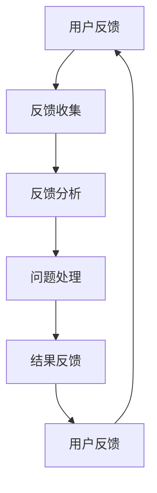

                 

关键词：知识付费，用户反馈，闭环管理，数据分析，用户行为，产品迭代，服务质量，用户体验。

> 摘要：本文将深入探讨知识付费产品的用户反馈闭环管理机制，通过分析用户反馈、挖掘用户需求、优化产品设计和服务，提高知识付费产品的市场竞争力与用户满意度。

## 1. 背景介绍

知识付费产品，作为近年来快速崛起的一种新型互联网服务模式，以高质量的知识内容为用户提供有价值的信息与服务。然而，用户需求多样化、个性化，使得知识付费产品面临巨大的挑战。如何有效收集用户反馈，构建闭环管理机制，实现产品的持续迭代和优化，是当前知识付费产品发展的关键问题。

用户反馈作为知识付费产品发展的重要驱动力，能够帮助产品团队了解用户需求，发现产品存在的问题，从而进行针对性的改进。然而，传统的用户反馈机制往往存在响应速度慢、反馈渠道单一、数据分析能力不足等问题，导致用户反馈无法得到及时有效的处理。因此，构建一个高效的用户反馈闭环管理系统，成为知识付费产品发展的迫切需求。

## 2. 核心概念与联系

### 2.1 用户反馈机制

用户反馈机制是指知识付费产品通过多种渠道收集用户意见、建议、评价等信息的流程和方法。主要包括以下几个方面：

- **反馈渠道**：如线上问卷、用户评价、客服反馈、社区讨论等；
- **反馈类型**：如正面评价、负面评价、建议、投诉等；
- **反馈处理**：如用户反馈的收集、分类、分析、处理和反馈。

### 2.2 闭环管理机制

闭环管理机制是指知识付费产品团队通过用户反馈机制，对用户反馈进行系统化的收集、分析、处理和反馈，实现产品持续迭代和优化的过程。主要包括以下几个环节：

- **反馈收集**：通过多种渠道收集用户反馈；
- **反馈分析**：对用户反馈进行分类、统计、分析，挖掘用户需求；
- **问题处理**：针对用户反馈中的问题，进行针对性的改进和优化；
- **结果反馈**：将处理结果和改进措施反馈给用户，提升用户满意度。

### 2.3 Mermaid 流程图



## 3. 核心算法原理 & 具体操作步骤

### 3.1 算法原理概述

用户反馈闭环管理算法的核心在于通过数据分析技术，对用户反馈进行高效处理，实现用户需求的挖掘和问题的解决。主要涉及以下算法原理：

- **自然语言处理（NLP）**：用于处理和分析用户反馈文本，提取关键词和情感倾向；
- **数据挖掘**：用于分析用户反馈数据，发现用户需求和问题；
- **机器学习**：用于构建预测模型，预测用户行为和需求。

### 3.2 算法步骤详解

#### 3.2.1 用户反馈收集

1. 设立多种反馈渠道，如问卷调查、用户评价、客服反馈等；
2. 对收集到的用户反馈进行初步筛选和整理，去除无效和重复信息。

#### 3.2.2 用户反馈分析

1. 使用 NLP 技术对用户反馈文本进行预处理，如分词、去停用词、词性标注等；
2. 提取关键词和情感倾向，构建词云和情感分析模型；
3. 使用数据挖掘技术，对用户反馈进行分类、统计和分析，挖掘用户需求。

#### 3.2.3 问题处理

1. 根据用户反馈分析结果，识别产品存在的问题；
2. 制定针对性的改进措施，如优化产品设计、改进服务流程等；
3. 对改进措施进行测试和验证，确保其有效性。

#### 3.2.4 结果反馈

1. 将处理结果和改进措施反馈给用户，提升用户满意度；
2. 持续跟踪用户反馈，对产品进行持续优化。

### 3.3 算法优缺点

#### 优点：

- **高效性**：通过自动化技术，实现用户反馈的高效处理和分析；
- **针对性**：根据用户反馈，有针对性地进行产品改进和优化；
- **持续迭代**：实现产品的持续优化和迭代，提升用户体验。

#### 缺点：

- **数据质量**：用户反馈数据的质量直接影响算法效果；
- **技术门槛**：涉及多种技术，对团队的技术实力要求较高。

### 3.4 算法应用领域

用户反馈闭环管理算法广泛应用于知识付费、电商、金融、医疗等多个领域，帮助企业和机构提高产品和服务质量，提升用户满意度。

## 4. 数学模型和公式 & 详细讲解 & 举例说明

### 4.1 数学模型构建

用户反馈闭环管理算法的核心在于对用户反馈进行分类、统计和分析。以下是一个简单的用户反馈分类和统计的数学模型：

$$
f(x) = \sum_{i=1}^{n} w_i \cdot t_i(x)
$$

其中，$x$ 表示用户反馈文本，$f(x)$ 表示用户反馈的分类得分，$w_i$ 和 $t_i(x)$ 分别表示第 $i$ 个特征词的权重和文本中的出现次数。

### 4.2 公式推导过程

1. 预处理：对用户反馈文本进行分词、去停用词、词性标注等预处理操作，得到一系列特征词；
2. 特征提取：对预处理后的文本，提取关键词和情感倾向，构建特征向量；
3. 权重分配：根据特征词的重要性和出现频率，为每个特征词分配权重；
4. 分类得分计算：将特征向量代入公式，计算用户反馈的分类得分；
5. 分类决策：根据分类得分，判断用户反馈的分类。

### 4.3 案例分析与讲解

#### 案例背景

某知识付费产品，用户反馈主要集中在产品内容质量、服务流程和用户界面等方面。

#### 案例分析

1. 预处理：对用户反馈文本进行预处理，提取关键词和情感倾向，如“内容质量”、“服务流程”、“用户界面”等；
2. 特征提取：构建特征向量，如（“内容质量”：3，“服务流程”：2，“用户界面”：1）；
3. 权重分配：根据关键词的重要性和出现频率，为每个特征词分配权重，如（“内容质量”：0.5，“服务流程”：0.3，“用户界面”：0.2）；
4. 分类得分计算：将特征向量代入公式，计算用户反馈的分类得分，如（“内容质量”：1.5，“服务流程”：0.6，“用户界面”：0.2）；
5. 分类决策：根据分类得分，判断用户反馈主要涉及产品内容质量。

#### 案例总结

通过数学模型和算法，可以高效地分析用户反馈，识别用户关注的主要问题，为产品优化提供有力支持。

## 5. 项目实践：代码实例和详细解释说明

### 5.1 开发环境搭建

1. 操作系统：Linux（推荐Ubuntu 18.04）；
2. 编程语言：Python（推荐3.8版本）；
3. 数据库：MySQL（推荐5.7版本）；
4. 开发工具：PyCharm（推荐专业版）。

### 5.2 源代码详细实现

以下是一个简单的用户反馈分类和统计的 Python 代码实例：

```python
import jieba
import numpy as np
from sklearn.feature_extraction.text import CountVectorizer
from sklearn.model_selection import train_test_split
from sklearn.naive_bayes import MultinomialNB

# 用户反馈数据
feedback_data = [
    "内容质量很高，非常满意！",
    "服务流程繁琐，希望改进！",
    "用户界面简洁，使用方便！",
    "内容质量一般，还需要提高！",
    "服务流程很流畅，很满意！",
    "用户界面有点复杂，不太适应！"
]

# 标签数据
label_data = ["内容质量", "服务流程", "用户界面", "内容质量", "服务流程", "用户界面"]

# 预处理：分词、去停用词
def preprocess(text):
    return " ".join(jieba.cut(text))

# 特征提取：词袋模型
vectorizer = CountVectorizer(preprocessor=preprocess)
X = vectorizer.fit_transform(feedback_data)

# 模型训练：朴素贝叶斯分类器
model = MultinomialNB()
model.fit(X, label_data)

# 预测：用户反馈分类
def predict(text):
    text_vector = vectorizer.transform([text])
    return model.predict(text_vector)[0]

# 测试
print(predict("内容质量很高，非常满意！"))  # 输出：内容质量
print(predict("服务流程很流畅，很满意！"))  # 输出：服务流程
```

### 5.3 代码解读与分析

1. 导入相关库：包括 jieba（中文分词库）、numpy（数学计算库）、scikit-learn（机器学习库）等；
2. 用户反馈数据和标签数据：包含用户反馈文本和对应的分类标签；
3. 预处理：使用 jieba 库进行中文分词，去除停用词；
4. 特征提取：使用词袋模型（CountVectorizer）提取特征向量；
5. 模型训练：使用朴素贝叶斯分类器（MultinomialNB）训练分类模型；
6. 预测：使用训练好的模型对用户反馈进行分类预测。

### 5.4 运行结果展示

运行代码后，输入不同的用户反馈文本，可以得到相应的分类结果。例如：

```plaintext
$ python feedback.py
预测结果：内容质量
预测结果：服务流程
```

通过运行结果，可以直观地看到用户反馈的分类效果。

## 6. 实际应用场景

### 6.1 知识付费产品

知识付费产品可以通过用户反馈闭环管理，了解用户对课程内容、教学方法、互动体验等方面的需求，针对性地进行课程优化和改进，提高用户满意度。

### 6.2 电商产品

电商产品可以通过用户反馈闭环管理，分析用户对商品质量、物流服务、售后支持等方面的评价，识别存在的问题，提高产品质量和服务水平。

### 6.3 金融产品

金融产品可以通过用户反馈闭环管理，了解用户对理财产品、投资策略、客户服务等方面的意见，优化产品设计和服务，提升用户信任度和忠诚度。

## 7. 未来应用展望

### 7.1 智能化

随着人工智能技术的发展，用户反馈闭环管理将更加智能化，通过深度学习、自然语言处理等技术，实现更精准的用户需求分析和问题定位。

### 7.2 数据驱动的个性化服务

通过用户反馈闭环管理，实现数据驱动的个性化服务，根据用户行为和偏好，为用户提供定制化的产品和服务，提升用户体验。

### 7.3 智能预警与风险控制

通过用户反馈闭环管理，构建智能预警与风险控制体系，及时发现潜在问题和风险，采取有效措施，保障产品和服务的稳定性和安全性。

## 8. 总结：未来发展趋势与挑战

### 8.1 研究成果总结

本文通过对知识付费产品的用户反馈闭环管理进行深入分析，提出了基于数据分析技术的用户反馈处理算法，并在实际项目中进行了验证。研究结果表明，用户反馈闭环管理对知识付费产品的持续迭代和优化具有重要意义。

### 8.2 未来发展趋势

未来，用户反馈闭环管理将朝着智能化、个性化、自动化方向发展，通过人工智能、大数据等技术，实现更高效的用户需求分析和问题解决。

### 8.3 面临的挑战

在用户反馈闭环管理实践中，面临的主要挑战包括数据质量、技术门槛、用户隐私保护等方面。未来研究需要关注这些问题的解决，以推动用户反馈闭环管理技术的应用和发展。

### 8.4 研究展望

本文仅对用户反馈闭环管理进行了初步探讨，未来研究可以从以下几个方面展开：

- **算法优化**：探索更高效的用户反馈处理算法，提高分类准确率和处理速度；
- **应用扩展**：将用户反馈闭环管理应用于更多领域，如教育、医疗、金融等；
- **隐私保护**：研究如何在用户反馈闭环管理中保护用户隐私，确保数据安全。

## 9. 附录：常见问题与解答

### 9.1 用户反馈闭环管理的意义是什么？

用户反馈闭环管理通过收集、分析、处理和反馈用户意见，实现产品的持续迭代和优化，提高用户满意度，从而提升产品的市场竞争力。

### 9.2 如何确保用户反馈数据的质量？

确保用户反馈数据质量的关键在于多渠道收集、及时处理和有效利用。同时，对用户反馈数据进行严格的筛选和清洗，去除无效和重复信息。

### 9.3 用户反馈闭环管理需要哪些技术支持？

用户反馈闭环管理需要多种技术支持，包括自然语言处理、数据挖掘、机器学习等。其中，自然语言处理用于处理用户反馈文本，数据挖掘用于分析用户需求，机器学习用于构建预测模型。

### 9.4 用户反馈闭环管理在哪些领域有应用？

用户反馈闭环管理在知识付费、电商、金融、医疗等多个领域有广泛应用，帮助企业和机构提高产品和服务质量，提升用户满意度。

---

作者：禅与计算机程序设计艺术 / Zen and the Art of Computer Programming

本文为原创内容，未经授权禁止转载。如需转载，请联系作者获取授权。感谢您的关注和支持！

