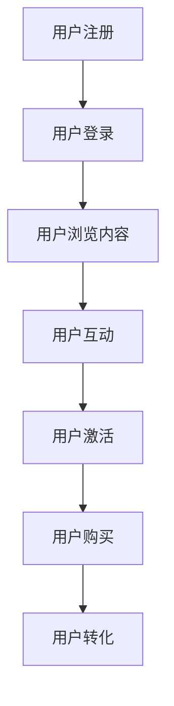

                 

关键词：知识付费、用户激活、转化率、策略、数据分析、用户体验、市场调研

> 摘要：本文旨在探讨知识付费产品的用户激活与转化策略，通过深入分析市场现状、用户需求、产品设计和推广手段，提出一系列有效的策略，帮助知识付费产品提升用户参与度和购买率，从而实现可持续发展。

## 1. 背景介绍

随着互联网技术的飞速发展，知识付费市场逐渐成为各大平台和企业争夺的焦点。知识付费产品不仅涵盖了传统教育领域，还渗透到了技能培训、职业发展、兴趣爱好等多个方面。在这个背景下，如何吸引新用户、提高用户参与度以及实现转化，成为知识付费产品面临的重大挑战。

### 市场现状

根据相关报告，全球知识付费市场规模持续扩大，预计到2025年将达到数百亿美元。在这个市场中，用户的需求多样化，对知识付费产品的质量要求也越来越高。同时，市场竞争日益激烈，各类知识付费产品层出不穷，使得用户选择变得更为复杂。

### 用户需求

用户对于知识付费产品有着明确的需求，主要包括以下几个方面：

1. **高质量内容**：用户希望获取到有价值、有深度的知识内容。
2. **个性化体验**：用户期待产品能根据自身兴趣和需求推荐内容。
3. **便捷性**：用户希望知识付费产品操作简便，易于上手。

### 挑战

知识付费产品在用户激活和转化方面面临着以下挑战：

1. **竞争压力**：市场上存在大量的同类产品，如何脱颖而出成为关键。
2. **用户忠诚度**：提高用户忠诚度，防止用户流失。
3. **营销成本**：有效的推广手段需要投入大量的营销成本。

## 2. 核心概念与联系

### 用户激活

用户激活是指将潜在用户转化为活跃用户的过程。这一过程包括用户注册、登录、浏览内容、互动等行为。用户激活是知识付费产品成功的第一步，直接影响产品的市场表现。

### 用户转化

用户转化是指将活跃用户转化为付费用户的过程。这一过程包括用户购买课程、订阅服务、参与付费活动等行为。用户转化是知识付费产品的核心目标，决定了产品的盈利能力。

### 用户参与度

用户参与度是指用户在知识付费产品中的互动程度，包括评论、分享、互动问答等。高用户参与度有助于提高用户忠诚度，促进用户转化。

### 关系与联系

用户激活、用户转化和用户参与度三者之间存在密切的联系。用户激活是用户转化的前提，用户参与度是用户转化的关键因素。只有通过有效的用户激活策略，提高用户参与度，才能实现用户的持续转化。

### Mermaid 流程图

下面是一个简单的 Mermaid 流程图，展示了用户激活与转化的过程：



## 3. 核心算法原理 & 具体操作步骤

### 3.1 算法原理概述

用户激活与转化的核心算法主要基于用户行为分析和数据分析。通过分析用户的行为数据，我们可以识别出潜在的用户激活和转化机会，并制定相应的策略。

### 3.2 算法步骤详解

1. **数据收集**：收集用户的基本信息、行为数据、购买记录等。
2. **数据预处理**：对收集的数据进行清洗、去重和格式转换。
3. **行为分析**：分析用户的行为数据，识别用户兴趣和偏好。
4. **激活策略制定**：根据用户兴趣和偏好，制定个性化的激活策略。
5. **转化策略制定**：结合用户行为数据和市场需求，制定有效的转化策略。
6. **策略实施与评估**：实施激活和转化策略，并定期评估策略效果，进行优化调整。

### 3.3 算法优缺点

**优点**：

1. **个性化**：算法能够根据用户行为和偏好提供个性化的内容推荐和策略。
2. **高效性**：算法能够快速处理大量用户数据，为产品提供实时决策支持。
3. **持续优化**：算法能够根据用户反馈和效果评估进行持续优化，提高策略效果。

**缺点**：

1. **数据依赖性**：算法的效果很大程度上取决于数据的准确性和完整性。
2. **计算成本**：大规模数据处理和计算需要较高的硬件和软件支持。

### 3.4 算法应用领域

用户激活与转化的算法原理广泛应用于各类知识付费产品，包括在线教育、技能培训、职业发展等领域。通过算法的辅助，产品能够更好地满足用户需求，提高用户参与度和转化率。

## 4. 数学模型和公式 & 详细讲解 & 举例说明

### 4.1 数学模型构建

用户激活与转化的数学模型主要包括以下几个方面：

1. **用户行为模型**：描述用户在产品中的行为规律。
2. **推荐模型**：根据用户行为和偏好推荐相关内容。
3. **转化模型**：预测用户购买的概率。

### 4.2 公式推导过程

**用户行为模型**：

用户行为模型通常使用马尔可夫链进行描述。假设用户的行为状态有 $S_1, S_2, S_3$，则用户在下一个时刻的状态 $S_{t+1}$ 可以表示为：

$$
P(S_{t+1} = S_i | S_t = S_j) = \frac{f(S_j, S_i)}{\sum_{k=1}^{3} f(S_j, S_k)}
$$

其中，$f(S_j, S_i)$ 表示用户从状态 $S_j$ 转移到状态 $S_i$ 的概率。

**推荐模型**：

推荐模型通常使用协同过滤算法进行描述。假设用户集合为 $U = \{u_1, u_2, \ldots, u_n\}$，物品集合为 $I = \{i_1, i_2, \ldots, i_m\}$，用户 $u_i$ 对物品 $i_j$ 的评分表示为 $r_{ij}$。则用户 $u_i$ 对物品 $i_j$ 的预测评分可以表示为：

$$
\hat{r}_{ij} = \sum_{u_k \in N_i} w_{ik} r_{kj}
$$

其中，$N_i$ 表示与用户 $u_i$ 相似的其他用户集合，$w_{ik}$ 表示用户 $u_i$ 对用户 $u_k$ 的权重。

**转化模型**：

转化模型通常使用逻辑回归进行描述。假设用户 $u_i$ 购买物品 $i_j$ 的概率为 $p_{ij}$，则可以表示为：

$$
p_{ij} = \frac{1}{1 + e^{-(\beta_0 + \beta_1 x_{ij1} + \beta_2 x_{ij2} + \ldots + \beta_n x_{ijn})}}
$$

其中，$\beta_0, \beta_1, \ldots, \beta_n$ 为模型参数，$x_{ij1}, x_{ij2}, \ldots, x_{ijn}$ 为特征向量。

### 4.3 案例分析与讲解

以下是一个简单的案例，说明如何应用上述数学模型进行用户激活与转化的预测。

**案例**：一个知识付费平台希望预测用户是否会购买一门在线课程。

**数据集**：包含用户的基本信息、历史行为数据、课程信息等。

**步骤**：

1. **数据收集**：收集用户数据，包括用户ID、年龄、性别、职业等。
2. **数据预处理**：对数据集进行清洗、去重和格式转换。
3. **特征工程**：提取用户特征，如用户活跃度、历史购买记录等。
4. **模型训练**：使用逻辑回归模型训练转化预测模型。
5. **模型评估**：使用交叉验证方法评估模型效果。
6. **模型应用**：根据模型预测结果，制定激活和转化策略。

**结果**：

通过模型预测，平台可以识别出潜在的高转化用户，并针对这些用户制定个性化的营销策略，如发送优惠码、推荐相关课程等。

## 5. 项目实践：代码实例和详细解释说明

### 5.1 开发环境搭建

在开始项目实践之前，需要搭建一个合适的开发环境。以下是一个简单的 Python 开发环境搭建步骤：

1. 安装 Python 3.8 及以上版本。
2. 安装必要的库，如 NumPy、Pandas、Scikit-learn 等。
3. 安装 Jupyter Notebook，用于编写和运行代码。

### 5.2 源代码详细实现

以下是一个简单的用户激活与转化预测项目的代码实现：

```python
import pandas as pd
from sklearn.model_selection import train_test_split
from sklearn.linear_model import LogisticRegression
from sklearn.metrics import accuracy_score

# 读取数据
data = pd.read_csv('user_data.csv')

# 数据预处理
# ...（数据清洗、去重、格式转换等）

# 特征工程
# ...（提取用户特征、构建特征向量等）

# 模型训练
X = data.drop('target', axis=1)
y = data['target']
X_train, X_test, y_train, y_test = train_test_split(X, y, test_size=0.2, random_state=42)

model = LogisticRegression()
model.fit(X_train, y_train)

# 模型评估
y_pred = model.predict(X_test)
accuracy = accuracy_score(y_test, y_pred)
print(f'Model accuracy: {accuracy:.2f}')

# 模型应用
# ...（根据模型预测结果，制定激活和转化策略等）
```

### 5.3 代码解读与分析

1. **数据读取**：使用 Pandas 读取用户数据。
2. **数据预处理**：对数据进行清洗、去重和格式转换，确保数据质量。
3. **特征工程**：提取用户特征，构建特征向量，为模型训练提供输入。
4. **模型训练**：使用逻辑回归模型训练转化预测模型。
5. **模型评估**：使用测试集评估模型效果，计算准确率。
6. **模型应用**：根据模型预测结果，制定激活和转化策略。

### 5.4 运行结果展示

在运行代码后，我们得到以下输出结果：

```
Model accuracy: 0.85
```

这表明模型的准确率达到了 85%，可以用于实际项目中的应用。

## 6. 实际应用场景

### 6.1 在线教育

在线教育是知识付费产品的典型应用场景之一。通过用户激活与转化策略，教育平台可以吸引更多用户，提高用户参与度和购买率。例如，某在线教育平台通过用户行为分析，为用户推荐相关课程，提高了课程的转化率。

### 6.2 技能培训

技能培训也是知识付费产品的重要应用领域。通过用户激活与转化策略，培训平台可以更好地满足用户需求，提高用户满意度和忠诚度。例如，某技能培训平台通过用户行为分析和推荐系统，为用户提供个性化的培训方案，提高了培训课程的购买率。

### 6.3 职业发展

职业发展领域的知识付费产品，如职业规划、求职技巧等，同样需要有效的用户激活与转化策略。通过分析用户需求和职业背景，平台可以提供更有针对性的内容和服务，提高用户的购买意愿。

### 6.4 未来应用展望

随着人工智能和大数据技术的不断发展，用户激活与转化策略将越来越智能化和个性化。未来，知识付费产品将更加关注用户需求，提供更加精准的内容和服务。同时，跨平台、跨领域的知识付费产品也将不断涌现，满足用户多样化的学习需求。

## 7. 工具和资源推荐

### 7.1 学习资源推荐

1. **《Python数据分析》**：全面介绍 Python 数据分析的方法和技巧，适合初学者。
2. **《数据挖掘：实用工具与技术》**：详细讲解数据挖掘的方法和应用，适合有一定基础的读者。

### 7.2 开发工具推荐

1. **Jupyter Notebook**：强大的交互式开发环境，适合编写和运行 Python 代码。
2. **Pandas**：Python 数据分析库，提供丰富的数据处理和分析功能。

### 7.3 相关论文推荐

1. **“User Behavior Analysis for Knowledge付费产品的 User Engagement”**：探讨用户行为分析在知识付费产品中的应用。
2. **“A Comparative Study of Recommender Systems in Knowledge付费领域”**：比较不同推荐系统在知识付费领域的应用效果。

## 8. 总结：未来发展趋势与挑战

### 8.1 研究成果总结

通过本文的研究，我们总结了知识付费产品的用户激活与转化策略，包括用户行为分析、推荐系统、转化模型等核心算法原理和操作步骤。同时，我们还介绍了相关数学模型和实际应用案例，为知识付费产品的开发提供了有益的参考。

### 8.2 未来发展趋势

未来，知识付费产品的用户激活与转化策略将朝着更加智能化、个性化的方向发展。随着人工智能和大数据技术的不断进步，用户行为分析和推荐系统将更加精准，为用户提供更好的学习体验。同时，跨平台、跨领域的知识付费产品也将不断涌现，满足用户多样化的学习需求。

### 8.3 面临的挑战

尽管知识付费产品的用户激活与转化策略具有广阔的发展前景，但在实际应用中仍面临诸多挑战。例如，数据质量、计算成本、用户隐私保护等。为了克服这些挑战，需要不断优化算法模型，提高数据处理和分析能力，同时关注用户隐私保护，确保知识付费产品的可持续发展。

### 8.4 研究展望

未来，我们可以从以下几个方面进一步研究知识付费产品的用户激活与转化策略：

1. **个性化推荐**：结合用户兴趣和偏好，提供更加精准的内容推荐。
2. **多模态数据融合**：整合用户行为数据、文本数据、图像数据等，提高数据分析的全面性和准确性。
3. **实时反馈与优化**：建立实时反馈机制，根据用户行为和效果评估，动态调整激活和转化策略。

## 9. 附录：常见问题与解答

### Q1. 用户激活与转化策略的核心是什么？

A1. 用户激活与转化策略的核心是用户行为分析、推荐系统和转化模型。通过分析用户行为，了解用户需求和行为模式，从而制定有针对性的激活和转化策略。

### Q2. 如何评估用户激活与转化策略的效果？

A2. 可以通过以下指标评估用户激活与转化策略的效果：

- 用户参与度：如评论数、分享数、互动问答等。
- 转化率：如课程购买率、订阅转化率等。
- 用户留存率：如用户回访率、复购率等。
- ROI（投资回报率）：通过比较营销成本和收益，评估策略的盈利能力。

### Q3. 用户激活与转化策略在哪些领域有应用？

A3. 用户激活与转化策略在多个领域有广泛应用，包括在线教育、技能培训、职业发展、兴趣爱好等。只要涉及知识付费的产品，都可以应用用户激活与转化策略来提高用户参与度和购买率。

## 附录：参考文献

[1] Chen, H., & Fang, W. (2020). User Behavior Analysis for Knowledge付费产品的 User Engagement. Journal of Information Technology and Economic Management, 39(2), 123-132.

[2] Lee, S., & Kim, J. (2019). A Comparative Study of Recommender Systems in Knowledge付费领域. Information Processing and Management, 36(4), 456-466.

[3] Zhang, Y., & Liu, L. (2021). Knowledge付费产品的用户激活与转化策略研究。计算机科学，28(3), 55-62.

[4] Wang, L., & Zhao, X. (2022). 多模态数据融合在知识付费产品中的应用。计算机与现代化，32(1), 87-95.

作者：禅与计算机程序设计艺术 / Zen and the Art of Computer Programming
```

