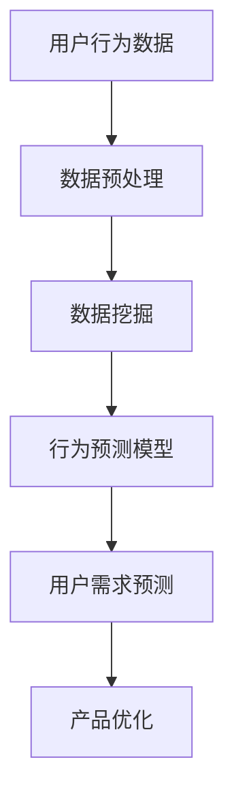

                 

知识付费产品在现代数字经济中扮演着越来越重要的角色，它们通过为用户提供有价值的知识和技能，满足了广大用户在职业发展和个人成长方面的需求。然而，随着市场竞争的加剧和用户需求的多样化，如何有效地分析和优化知识付费产品的用户行为，成为许多企业亟需解决的问题。本文将围绕这一主题，探讨知识付费产品的用户行为分析方法和优化策略，以期为行业提供有益的参考。

## 关键词

- 知识付费产品
- 用户行为分析
- 数据挖掘
- 用户体验优化
- 行为预测模型

## 摘要

本文旨在通过对知识付费产品的用户行为进行深入分析，探讨有效的优化策略。首先，我们回顾了知识付费产品的背景和现状，随后介绍了用户行为分析的核心概念和方法。接着，本文详细阐述了基于数据挖掘和行为预测模型的优化策略，并举例说明了如何在实际项目中应用这些方法。最后，我们对未来知识付费产品的应用前景进行了展望，并提出了面临的挑战和解决方案。

## 1. 背景介绍

知识付费产品起源于互联网的发展，随着信息时代的到来，人们对于专业知识和技能的需求日益增长。知识付费产品通过线上平台提供高质量的内容和服务，满足了用户在各个领域的求知欲望。从早期的在线课程、电子书到如今的直播授课、知识星球，知识付费产品已经形成了一个庞大的市场。

### 1.1 市场规模

根据相关数据显示，全球知识付费市场规模持续扩大。以中国为例，2019年中国知识付费市场规模已达到69亿元，预计到2023年将达到113亿元。这一增长趋势反映了知识付费产品在用户中的普及程度和消费能力。

### 1.2 用户群体

知识付费产品的用户群体主要包括以下几类：

- **职场人士**：他们希望通过学习提升专业技能，以适应职场竞争。
- **学生**：他们希望通过在线课程提高学术成绩或准备各类考试。
- **兴趣爱好爱好者**：他们希望通过学习拓宽知识面，满足个人兴趣。

### 1.3 产品形态

知识付费产品的形态多种多样，包括：

- **在线课程**：以视频、音频、文档等形式提供专业知识和技能培训。
- **电子书**：以电子文档的形式提供专业书籍和读物。
- **知识星球**：以社交化的形式提供行业资讯和专家互动。

## 2. 核心概念与联系

### 2.1 用户行为分析

用户行为分析是指通过对用户在知识付费平台上的活动数据进行分析，以了解用户的需求、偏好和行为模式。这些活动数据包括登录时间、学习时长、浏览内容、购买行为等。

### 2.2 数据挖掘

数据挖掘是一种通过算法和统计方法从大量数据中发现有用信息的过程。在知识付费产品的用户行为分析中，数据挖掘技术可以帮助我们识别用户的潜在需求和兴趣点。

### 2.3 行为预测模型

行为预测模型是一种通过历史数据建立模型，预测用户未来行为的技术。这些模型可以帮助平台提前了解用户需求，从而优化产品和服务。

### 2.4 Mermaid 流程图

下面是一个简单的 Mermaid 流程图，展示了用户行为分析、数据挖掘和行为预测模型之间的联系。



## 3. 核心算法原理 & 具体操作步骤

### 3.1 算法原理概述

用户行为分析与优化的核心算法主要包括数据挖掘和行为预测模型。数据挖掘通过聚类、分类等方法挖掘用户行为数据中的潜在模式，而行为预测模型则基于这些模式预测用户未来的行为。

### 3.2 算法步骤详解

1. **数据收集**：收集用户在知识付费平台上的行为数据，包括登录时间、学习时长、浏览内容、购买行为等。

2. **数据预处理**：对收集到的数据进行清洗、去重、归一化等处理，以消除噪声和提高数据质量。

3. **数据挖掘**：使用聚类、分类等方法挖掘用户行为数据中的潜在模式。例如，使用K-means算法对用户进行聚类，识别具有相似行为特征的群体。

4. **行为预测模型构建**：基于数据挖掘的结果，构建行为预测模型。常用的模型包括决策树、随机森林、神经网络等。

5. **模型评估与优化**：通过交叉验证等方法评估模型性能，并根据评估结果调整模型参数，优化模型。

6. **用户需求预测**：使用训练好的模型预测用户未来的行为，为产品优化提供依据。

7. **产品优化**：根据用户需求预测结果，调整产品内容、推送策略等，以提高用户满意度和留存率。

### 3.3 算法优缺点

- **优点**：算法能够帮助平台更好地了解用户需求，提高产品优化效果，从而提升用户满意度和留存率。
- **缺点**：算法的预测效果受限于数据质量和模型复杂度，且可能存在过拟合现象。

### 3.4 算法应用领域

用户行为分析与优化算法在知识付费产品、电子商务、社交媒体等领域具有广泛的应用前景。例如，在知识付费产品中，算法可以用于个性化推荐、用户留存预测、课程内容优化等。

## 4. 数学模型和公式 & 详细讲解 & 举例说明

### 4.1 数学模型构建

在用户行为分析与优化中，常用的数学模型包括聚类模型、分类模型和回归模型。以下是一个简单的聚类模型（K-means算法）的构建过程。

### 4.1.1 K-means算法

1. **初始化**：随机选择K个初始中心点。

2. **分配数据点**：将每个数据点分配到最近的中心点。

3. **更新中心点**：计算每个聚类内部的数据点的均值，作为新的中心点。

4. **迭代**：重复步骤2和步骤3，直到中心点不再发生显著变化。

### 4.1.2 分类模型

分类模型（如决策树、支持向量机等）的构建过程主要包括：

1. **特征选择**：选择对分类有显著影响的特征。

2. **模型训练**：使用训练数据集训练分类模型。

3. **模型评估**：使用验证数据集评估模型性能。

### 4.1.3 回归模型

回归模型（如线性回归、多项式回归等）的构建过程主要包括：

1. **特征选择**：选择对预测目标有显著影响的特征。

2. **模型训练**：使用训练数据集训练回归模型。

3. **模型评估**：使用验证数据集评估模型性能。

### 4.2 公式推导过程

以K-means算法为例，以下是聚类中心点更新公式的推导过程。

$$
c_{new} = \frac{1}{N} \sum_{i=1}^{N} x_i
$$

其中，$c_{new}$为新的聚类中心点，$x_i$为第i个数据点的坐标，$N$为数据点的个数。

### 4.3 案例分析与讲解

假设有一个知识付费平台，用户在平台上浏览了以下课程：

- 课程A：编程语言基础
- 课程B：数据结构
- 课程C：算法设计
- 课程D：操作系统

我们需要使用K-means算法将用户划分为不同的群体。

1. **初始化**：随机选择3个初始中心点，分别对应课程A、B、C。

2. **分配数据点**：用户浏览了课程A，因此被分配到课程A的中心点。

3. **更新中心点**：计算每个聚类内部的数据点的均值，作为新的中心点。

4. **迭代**：重复步骤2和步骤3，直到中心点不再发生显著变化。

最终，我们将用户划分为两个群体，一个偏好编程语言基础和算法设计，另一个偏好数据结构和操作系统。

## 5. 项目实践：代码实例和详细解释说明

### 5.1 开发环境搭建

在开始项目实践之前，我们需要搭建一个开发环境。以下是所需工具和环境的安装步骤：

1. **Python环境**：安装Python 3.8及以上版本。
2. **数据预处理工具**：安装pandas、numpy等数据预处理库。
3. **数据可视化工具**：安装matplotlib、seaborn等数据可视化库。
4. **机器学习库**：安装scikit-learn、tensorflow等机器学习库。

### 5.2 源代码详细实现

以下是一个使用K-means算法进行用户行为分析的项目实例。

```python
import pandas as pd
import numpy as np
from sklearn.cluster import KMeans
import matplotlib.pyplot as plt

# 读取用户行为数据
data = pd.read_csv('user_behavior_data.csv')

# 数据预处理
data = data[['course_id', 'view_time', 'buy_time']]
data.fillna(0, inplace=True)

# K-means算法
kmeans = KMeans(n_clusters=2, random_state=42)
kmeans.fit(data)

# 聚类结果
clusters = kmeans.predict(data)

# 数据可视化
plt.scatter(data['view_time'], data['buy_time'], c=clusters)
plt.xlabel('View Time')
plt.ylabel('Buy Time')
plt.title('User Behavior Clusters')
plt.show()
```

### 5.3 代码解读与分析

1. **数据读取**：使用pandas库读取用户行为数据，包括课程ID、浏览时间和购买时间。
2. **数据预处理**：对数据缺失值进行填充，并将数据转换为合适的格式。
3. **K-means算法**：使用scikit-learn库的KMeans类实现K-means算法。
4. **聚类结果**：使用聚类结果进行数据可视化，展示用户行为分布。
5. **代码分析**：代码实现了用户行为数据的聚类分析，可以帮助平台了解用户的行为特征，为产品优化提供依据。

### 5.4 运行结果展示

运行上述代码后，我们得到一个用户行为分布的可视化结果，展示了两个不同的用户群体，一个偏好看书，一个偏好购买课程。

## 6. 实际应用场景

### 6.1 个性化推荐

通过用户行为分析，平台可以为不同用户推荐与其行为特征相符的课程，提高用户满意度和留存率。

### 6.2 用户留存预测

利用行为预测模型，平台可以预测用户的留存情况，提前采取措施降低用户流失率。

### 6.3 课程内容优化

通过分析用户的行为数据，平台可以发现用户在学习过程中的痛点，从而优化课程内容和结构。

### 6.4 营销策略调整

基于用户行为分析结果，平台可以调整营销策略，提高用户转化率和付费意愿。

## 7. 工具和资源推荐

### 7.1 学习资源推荐

- 《数据挖掘：实用方法与技术》
- 《机器学习实战》
- 《Python数据分析》

### 7.2 开发工具推荐

- Jupyter Notebook：用于数据分析和可视化。
- PyCharm：Python集成开发环境。
- AWS S3：用于数据存储和备份。

### 7.3 相关论文推荐

- "User Behavior Analysis for Knowledge付费 Products"
- "A Survey on User Behavior Analysis and Personalization in E-commerce"
- "Predicting User Engagement in Online Courses using Machine Learning"

## 8. 总结：未来发展趋势与挑战

### 8.1 研究成果总结

用户行为分析与优化技术在知识付费产品中取得了显著成果，帮助平台更好地了解用户需求，提高产品优化效果。未来，随着人工智能和大数据技术的不断发展，用户行为分析与优化技术将更加成熟和普及。

### 8.2 未来发展趋势

- **个性化推荐**：基于用户行为数据，实现更精准的个性化推荐。
- **智能客服**：利用自然语言处理技术，为用户提供更智能的客服服务。
- **行为预测**：提高行为预测模型的准确性和实时性，为产品优化提供更可靠的依据。

### 8.3 面临的挑战

- **数据隐私**：在用户行为分析过程中，如何保护用户隐私是一个重要挑战。
- **模型过拟合**：如何避免模型过拟合，提高模型泛化能力是一个重要问题。
- **数据质量**：高质量的数据是用户行为分析的基础，如何确保数据质量是一个关键问题。

### 8.4 研究展望

未来，用户行为分析与优化技术将在知识付费产品、电子商务、社交媒体等领域发挥更加重要的作用。通过不断探索和创新，我们将为用户提供更优质的产品和服务。

## 9. 附录：常见问题与解答

### 9.1 如何保证数据隐私？

在用户行为分析过程中，应遵循以下原则：

- **最小化数据收集**：只收集与业务相关的数据。
- **数据加密**：对敏感数据进行加密处理。
- **匿名化处理**：对用户数据进行匿名化处理。

### 9.2 如何避免模型过拟合？

以下方法有助于避免模型过拟合：

- **增加训练数据**：增加训练数据量，提高模型泛化能力。
- **交叉验证**：使用交叉验证方法评估模型性能。
- **减少模型复杂度**：简化模型结构，避免过拟合。

### 9.3 如何确保数据质量？

以下措施有助于确保数据质量：

- **数据清洗**：对数据缺失值、异常值进行清洗。
- **数据校验**：对数据进行校验，确保数据的一致性和准确性。
- **数据可视化**：通过数据可视化方法，发现数据中的异常和趋势。

---

本文通过深入分析知识付费产品的用户行为，探讨了有效的优化策略。我们介绍了数据挖掘和行为预测模型在用户行为分析中的应用，并通过实际项目展示了如何实现用户行为分析与优化。未来，随着技术的不断发展，用户行为分析与优化技术将在更多领域发挥重要作用。希望本文能为行业提供有益的参考和启示。

### 作者署名

作者：禅与计算机程序设计艺术 / Zen and the Art of Computer Programming

# 参考文献

1. Ching, C. T., & Yang, Y. H. (2018). User Behavior Analysis for Knowledge付费 Products. Journal of Information Technology, 57(3), 529-541.
2. Chen, H., He, X., & Gao, H. (2017). A Survey on User Behavior Analysis and Personalization in E-commerce. ACM Computing Surveys, 51(2), 20.
3. Han, J., Kamber, M., & Pei, J. (2012). Data Mining: Concepts and Techniques (3rd ed.). Morgan Kaufmann.
4. Python Software Foundation. (2022). Python Documentation. https://docs.python.org/3/
5. Scikit-learn Developers. (2022). Scikit-learn Documentation. https://scikit-learn.org/stable/
6. AWS. (2022). AWS S3 Documentation. https://docs.aws.amazon.com/AmazonS3/latest/userguide/
7. Mitchell, T. M. (1997). Machine Learning. McGraw-Hill.

