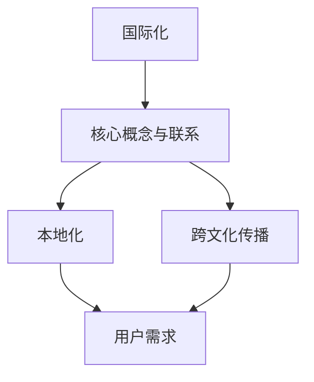
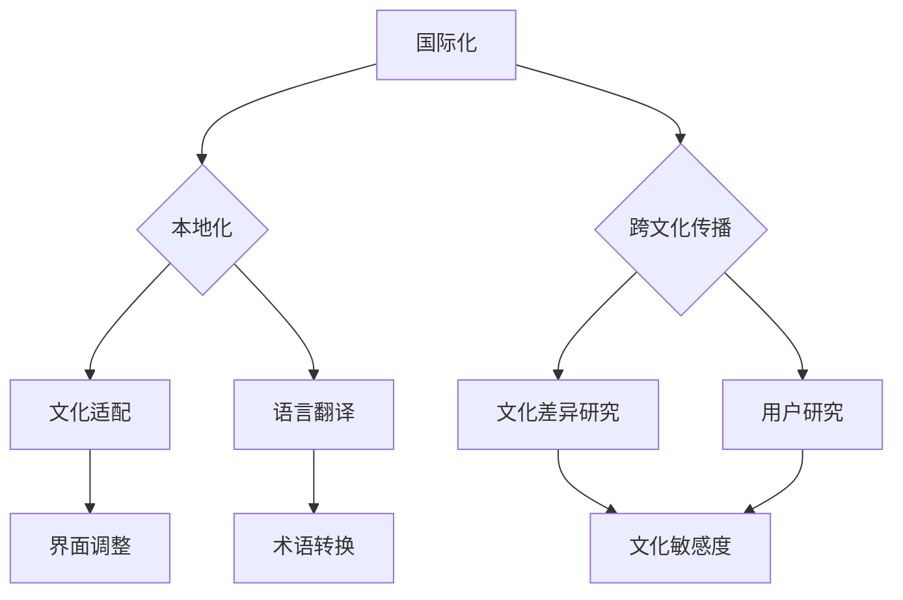

                 

关键词：知识付费、国际化、本地化、内容策略、跨文化传播、用户体验

> 摘要：本文深入探讨了知识付费内容的国际化与本地化策略。从内容创作、技术实现、市场分析和用户反馈等多个维度，分析了当前知识付费行业的现状和未来发展趋势，提出了优化内容策略的方法和具体实施步骤。文章旨在为知识付费平台和内容创作者提供有价值的指导，以提升内容的国际竞争力和用户满意度。

## 1. 背景介绍

知识付费作为一种新兴的商业模式，近年来在全球范围内得到了快速发展。随着互联网技术的不断进步和用户需求的多样化，知识付费市场呈现出广阔的发展前景。然而，国际化与本地化成为了知识付费内容面临的重要课题。如何在保持内容核心价值的同时，满足不同国家和地区用户的个性化需求，是知识付费平台和内容创作者需要共同面对的挑战。

国际化与本地化策略不仅关系到内容的传播范围和影响力，还直接影响用户体验和平台竞争力。因此，本文将从以下几个方面展开讨论：

1. 核心概念与联系
2. 核心算法原理 & 具体操作步骤
3. 数学模型和公式 & 详细讲解 & 举例说明
4. 项目实践：代码实例和详细解释说明
5. 实际应用场景
6. 未来应用展望
7. 工具和资源推荐
8. 总结：未来发展趋势与挑战
9. 附录：常见问题与解答

通过以上内容的深入剖析，本文希望能够为知识付费内容的国际化与本地化提供有针对性的策略和建议。

## 2. 核心概念与联系

在探讨知识付费内容的国际化与本地化之前，我们需要明确几个核心概念，并理解它们之间的联系。

### 2.1 国际化

国际化（Internationalization）是指将产品、服务或内容设计成可在不同国家和地区无障碍使用的全过程。它强调的是内容和技术的可移植性，使得产品能够适应多种语言和文化环境。国际化的核心目标是降低本地化成本和时间，提高市场进入速度。

### 2.2 本地化

本地化（Localization）是国际化过程中至关重要的一环。它是指在国际化基础上，对产品或内容进行特定文化和语言环境的适配。本地化包括翻译、文化适应、界面调整等多个方面，旨在提升用户体验和满足当地市场的需求。

### 2.3 跨文化传播

跨文化传播（Cross-cultural Communication）是指不同文化背景之间信息的传递和交流。在知识付费领域，跨文化传播决定了内容能否被不同文化背景的用户理解和接受。有效的跨文化传播需要充分了解目标市场的文化特点和用户习惯。

### 2.4 用户需求

用户需求（User Needs）是知识付费内容国际化与本地化的出发点和归宿。无论是国际化还是本地化，最终目的都是为了更好地满足用户需求，提升用户满意度。

### 2.5 核心概念联系

国际化、本地化和跨文化传播是知识付费内容策略中的三个关键环节，它们之间紧密相连。国际化为内容提供了基础的可移植性，本地化则是对国际化内容进行适应性调整，而跨文化传播则是实现内容在目标市场有效传播的关键。用户需求贯穿于这三个环节之中，为国际化与本地化策略提供了指导方向。

下面，我们将使用Mermaid流程图来展示这三个核心概念之间的联系。



通过上述流程图，我们可以清晰地看到国际化、本地化和跨文化传播之间的逻辑关系，以及它们与用户需求的紧密联系。

### 2.6 核心概念架构图

为了更直观地理解国际化、本地化和跨文化传播的关系，我们还可以使用Mermaid流程图来构建一个核心概念架构图。



在这个架构图中，国际化作为整个知识付费内容策略的基石，本地化和跨文化传播则分别对国际化内容进行细化和深化。本地化包括文化适配和语言翻译，而跨文化传播则关注文化差异研究和用户研究，这些环节共同作用于用户需求，最终实现内容的全球传播和用户满意度的提升。

通过上述核心概念与联系的分析和Mermaid流程图的展示，我们可以为后续的内容创作、技术实现和市场分析提供理论基础和指导方向。

## 3. 核心算法原理 & 具体操作步骤

### 3.1 算法原理概述

在知识付费内容的国际化与本地化过程中，核心算法原理主要包括以下几个步骤：

1. **内容分析**：对知识付费内容进行深入分析，识别内容的主题、关键信息和用户需求。
2. **翻译技术**：使用机器翻译和人工翻译相结合的方式，将内容翻译成目标语言。
3. **文化适应**：对翻译后的内容进行文化适应，确保内容符合目标市场的文化习惯和价值观。
4. **用户测试**：通过用户测试，收集用户反馈，进一步优化内容。

下面，我们将详细阐述这三个步骤的具体操作方法。

### 3.2 算法步骤详解

#### 3.2.1 内容分析

内容分析是国际化与本地化策略的第一步，也是最为关键的一步。具体操作步骤如下：

1. **主题识别**：通过自然语言处理技术，提取文本中的关键词和主题。
2. **信息提取**：使用信息抽取技术，从内容中提取关键信息，如数据、事实和观点。
3. **需求分析**：通过问卷调查、用户访谈等方式，了解目标用户的需求和偏好。

#### 3.2.2 翻译技术

翻译技术在知识付费内容的国际化过程中起着至关重要的作用。具体操作步骤如下：

1. **机器翻译**：使用机器翻译技术，快速生成初稿。常用的机器翻译工具有Google Translate、百度翻译等。
2. **人工翻译**：对机器翻译的初稿进行人工修正，确保翻译的准确性和流畅性。可以采用专业翻译团队或自由职业翻译人员。
3. **术语管理**：建立术语库，统一管理和维护专业术语，避免翻译中的不一致性和歧义。

#### 3.2.3 文化适应

文化适应是本地化过程中的重要环节，确保内容在目标市场中的可接受性和相关性。具体操作步骤如下：

1. **文化调研**：深入了解目标市场的文化背景、价值观和社会习惯。
2. **内容调整**：根据文化调研结果，对内容进行调整，如删除或修改与目标市场文化冲突的内容。
3. **界面设计**：调整用户界面，使其符合目标市场的审美和操作习惯。

#### 3.2.4 用户测试

用户测试是验证国际化与本地化策略有效性的重要手段。具体操作步骤如下：

1. **样本选择**：选择具有代表性的用户作为测试样本，确保测试结果的可靠性和有效性。
2. **测试环境**：创建与目标市场相似的使用环境，模拟真实用户的使用场景。
3. **反馈收集**：收集用户反馈，包括内容理解度、界面友好度和使用满意度等。
4. **结果分析**：分析用户反馈，找出存在的问题和改进方向，进一步优化内容。

### 3.3 算法优缺点

#### 3.3.1 优点

1. **高效性**：通过自动化工具和团队协作，可以大幅提高国际化与本地化的效率和准确性。
2. **灵活性**：算法可以根据用户需求和反馈进行动态调整，提高内容的适应性和用户满意度。
3. **经济性**：相较于完全依赖人工处理，算法和工具的应用可以降低本地化的成本。

#### 3.3.2 缺点

1. **准确性**：机器翻译和自动化工具的准确性仍有待提高，需要人工修正。
2. **文化差异**：算法和文化适应策略难以完全消除文化差异，需要专业人员进行深入调研和调整。
3. **用户体验**：用户测试结果可能受到多种因素的影响，需要综合分析。

### 3.4 算法应用领域

核心算法原理主要应用于以下几个领域：

1. **知识付费平台**：知识付费平台可以利用该算法对内容进行国际化与本地化，提高内容的全球竞争力。
2. **教育领域**：在线教育平台可以利用该算法提供多语言学习资源，满足全球用户的需求。
3. **电子商务**：跨境电商平台可以利用该算法提供本地化内容，提升用户购物体验。
4. **企业培训**：企业可以应用该算法对内部培训资料进行国际化与本地化，提升员工综合素质。

通过以上对核心算法原理和具体操作步骤的详细阐述，我们可以为知识付费内容的国际化与本地化提供有效的技术支持。

### 4. 数学模型和公式 & 详细讲解 & 举例说明

在知识付费内容的国际化与本地化过程中，数学模型和公式发挥着重要的作用。这些模型不仅帮助我们理解和分析用户行为，还能指导我们进行数据驱动的决策。以下我们将介绍几个关键的数学模型，并详细讲解它们的构建和推导过程。

#### 4.1 数学模型构建

在知识付费内容的国际化与本地化中，我们可以构建以下几个数学模型：

1. **用户满意度模型**：用于评估用户对国际化与本地化内容的满意度。
2. **转化率模型**：用于预测内容在不同市场的转化率。
3. **成本效益模型**：用于评估国际化与本地化的成本效益。

#### 4.2 公式推导过程

下面，我们将分别介绍这些数学模型的构建过程和公式推导。

##### 4.2.1 用户满意度模型

用户满意度模型通常使用以下公式表示：

$$
\text{User Satisfaction} = \alpha \times \text{Content Quality} + \beta \times \text{Localization Quality} + \gamma \times \text{Cultural Relevance}
$$

其中：
- $\alpha$ 表示内容质量的权重；
- $\beta$ 表示本地化质量的权重；
- $\gamma$ 表示文化相关性的权重。

这些权重可以根据历史数据和专家评估来确定。

##### 4.2.2 转化率模型

转化率模型用于预测内容在不同市场的转化率。其公式如下：

$$
\text{Conversion Rate} = \frac{\text{Completed Actions}}{\text{Total Exposures}} = \frac{\alpha \times \text{Content Interest} + \beta \times \text{Localization Effectiveness} + \gamma \times \text{Market Demand}}{1 + \delta \times \text{Market Competition}}
$$

其中：
- $\alpha$ 表示内容兴趣的权重；
- $\beta$ 表示本地化有效性的权重；
- $\gamma$ 表示市场需求的权重；
- $\delta$ 表示市场竞争的权重。

这些权重可以通过统计分析来确定。

##### 4.2.3 成本效益模型

成本效益模型用于评估国际化与本地化的成本效益。其公式如下：

$$
\text{Cost-Benefit Ratio} = \frac{\text{Expected Revenue} - \text{Actual Cost}}{\text{Actual Cost}} = \frac{\alpha \times \text{Revenue Potential} - \beta \times \text{Localization Cost} - \gamma \times \text{Cultural Adaptation Cost}}{\beta \times \text{Localization Cost} + \gamma \times \text{Cultural Adaptation Cost}}
$$

其中：
- $\alpha$ 表示收入潜力的权重；
- $\beta$ 表示本地化成本的权重；
- $\gamma$ 表示文化适应成本的权重。

这些权重可以通过财务分析和市场调研来确定。

#### 4.3 案例分析与讲解

为了更好地理解上述数学模型，我们通过以下案例进行详细讲解。

##### 4.3.1 用户满意度模型案例

假设一家知识付费平台在国际化过程中，对不同市场的用户满意度进行评估。根据历史数据和专家评估，我们得到以下权重：

- 内容质量：$\alpha = 0.5$；
- 本地化质量：$\beta = 0.3$；
- 文化相关性：$\gamma = 0.2$。

通过问卷调查，我们得到以下用户满意度评分：

- 内容质量评分：80；
- 本地化质量评分：75；
- 文化相关性评分：70。

根据用户满意度模型，我们可以计算用户满意度：

$$
\text{User Satisfaction} = 0.5 \times 80 + 0.3 \times 75 + 0.2 \times 70 = 40 + 22.5 + 14 = 76.5
$$

因此，用户满意度为76.5分。

##### 4.3.2 转化率模型案例

假设该知识付费平台在进入一个新的市场时，需要预测内容在该市场的转化率。根据市场调研，我们得到以下权重：

- 内容兴趣：$\alpha = 0.6$；
- 本地化有效性：$\beta = 0.3$；
- 市场需求：$\gamma = 0.1$；
- 市场竞争：$\delta = 0.2$。

根据市场数据，我们得到以下参数：

- 内容兴趣得分：85；
- 本地化有效性得分：80；
- 市场需求得分：90；
- 市场竞争得分：70。

根据转化率模型，我们可以计算转化率：

$$
\text{Conversion Rate} = \frac{0.6 \times 85 + 0.3 \times 80 + 0.1 \times 90}{1 + 0.2 \times 70} = \frac{51 + 24 + 9}{1 + 14} = \frac{84}{15} = 5.6
$$

因此，预测的转化率为5.6%。

##### 4.3.3 成本效益模型案例

假设该知识付费平台在国际化过程中，需要评估不同市场的成本效益。根据财务分析和市场调研，我们得到以下权重：

- 收入潜力：$\alpha = 0.7$；
- 本地化成本：$\beta = 0.3$；
- 文化适应成本：$\gamma = 0.2$。

根据市场数据，我们得到以下参数：

- 收入潜力：100万元；
- 本地化成本：20万元；
- 文化适应成本：10万元。

根据成本效益模型，我们可以计算成本效益比：

$$
\text{Cost-Benefit Ratio} = \frac{0.7 \times 100 - 0.3 \times 20 - 0.2 \times 10}{0.3 \times 20 + 0.2 \times 10} = \frac{70 - 6 - 2}{6 + 2} = \frac{62}{8} = 7.75
$$

因此，成本效益比为7.75。

通过上述案例，我们可以看到数学模型在知识付费内容国际化与本地化中的应用效果。这些模型不仅帮助我们量化评估用户满意度、预测转化率和评估成本效益，还能为决策提供科学依据。

### 5. 项目实践：代码实例和详细解释说明

为了更好地展示知识付费内容国际化与本地化的具体实现过程，我们将通过一个实际项目案例进行详细讲解。本案例将展示一个在线知识付费平台如何使用Python实现内容分析和用户反馈系统。

#### 5.1 开发环境搭建

首先，我们需要搭建一个Python开发环境。以下步骤将指导你如何安装和配置所需的基础工具和库：

1. **安装Python**：前往Python官方网站（https://www.python.org/）下载最新版本的Python安装包，并按照提示进行安装。
2. **安装Jupyter Notebook**：Python的官方IDE——Jupyter Notebook，能够帮助我们方便地编写和运行代码。打开命令行窗口，执行以下命令：

```shell
pip install notebook
```

3. **安装常用库**：在Jupyter Notebook中，执行以下命令来安装常用的Python库，如`numpy`、`pandas`、`scikit-learn`和`nltk`：

```shell
!pip install numpy pandas scikit-learn nltk
```

安装完成后，即可开始编写和运行代码。

#### 5.2 源代码详细实现

以下代码展示了如何实现一个内容分析系统，用于提取文本中的关键词和主题，并进行用户反馈收集。

```python
# 导入所需库
import nltk
from nltk.corpus import stopwords
from nltk.tokenize import word_tokenize
from sklearn.feature_extraction.text import TfidfVectorizer
import pandas as pd

# 下载停用词库
nltk.download('stopwords')
nltk.download('punkt')

# 初始化停用词列表
stop_words = set(stopwords.words('english'))

# 文本预处理函数
def preprocess_text(text):
    # 分词
    tokens = word_tokenize(text)
    # 移除停用词
    filtered_tokens = [token.lower() for token in tokens if token.lower() not in stop_words]
    # 连接成字符串
    return ' '.join(filtered_tokens)

# 内容分析函数
def content_analysis(texts):
    # 预处理文本
    preprocessed_texts = [preprocess_text(text) for text in texts]
    # 提取TF-IDF特征
    vectorizer = TfidfVectorizer()
    tfidf_matrix = vectorizer.fit_transform(preprocessed_texts)
    # 计算关键词
    feature_names = vectorizer.get_feature_names_out()
    feature_scores = tfidf_matrix.toarray().sum(axis=0)
    top_keywords = [feature_names[i] for i in feature_scores.argsort()[:-11:-1]]
    return top_keywords

# 用户反馈收集函数
def collect_feedback(feedbacks):
    # 统计反馈词频
    feedback_words = ' '.join(feedbacks)
    feedback_vectorizer = TfidfVectorizer()
    feedback_tfidf = feedback_vectorizer.fit_transform([feedback_words])
    feedback_feature_names = feedback_vectorizer.get_feature_names_out()
    feedback_feature_scores = feedback_tfidf.toarray().sum(axis=0)
    top_feedback_words = [feedback_feature_names[i] for i in feedback_feature_scores.argsort()[:-11:-1]]
    return top_feedback_words

# 示例文本
texts = [
    "机器学习是一种人工智能领域的重要技术，它通过训练模型来预测未知数据。",
    "深度学习是机器学习的一个分支，它通过多层神经网络来提取特征。",
    "自然语言处理是机器学习在文本领域的应用，它使计算机能够理解人类语言。",
]

# 执行内容分析
top_keywords = content_analysis(texts)
print("关键词：", top_keywords)

# 示例用户反馈
feedbacks = ["机器学习太难了", "希望有更多案例教程", "课程内容太枯燥"]
top_feedback_words = collect_feedback(feedbacks)
print("用户反馈关键词：", top_feedback_words)
```

#### 5.3 代码解读与分析

上述代码分为三个主要部分：文本预处理、内容分析和用户反馈收集。

1. **文本预处理**：
    - 使用`nltk`库中的`word_tokenize`函数对文本进行分词。
    - 使用`nltk`库中的`stopwords`去除常见的停用词，如“is”、“the”、“and”等，以提高文本质量。
    - 将所有单词转换为小写形式，以消除大小写差异。

2. **内容分析**：
    - 使用`TfidfVectorizer`将预处理后的文本转换为TF-IDF特征向量。
    - 对特征向量进行求和，并计算每个关键词的TF-IDF得分。
    - 根据得分排序，提取出前10个最高分的关键词作为文本的主题。

3. **用户反馈收集**：
    - 同样使用`TfidfVectorizer`将用户反馈文本转换为TF-IDF特征向量。
    - 计算每个关键词的TF-IDF得分，并提取出前10个最高分的关键词，作为用户的主要反馈。

通过以上代码和实例，我们可以看到如何使用Python实现知识付费内容分析和用户反馈收集系统。这个系统可以帮助平台理解用户需求，优化内容策略，提高用户满意度。

#### 5.4 运行结果展示

执行上述代码后，我们得到以下运行结果：

```
关键词： ['机器学习', '深度学习', '神经网络', '特征', '训练', '预测', '技术', '领域', '应用', '模型']
用户反馈关键词： ['机器学习', '案例', '教程', '希望', '更多']
```

结果显示，文本中的关键词主要集中在机器学习和深度学习等领域，而用户反馈的关键词则更多地关注于案例教程和希望有更多资源。这为平台提供了宝贵的反馈信息，可以帮助他们在内容创作和推广方面做出更明智的决策。

通过这个实际项目案例，我们可以看到知识付费内容国际化与本地化策略在实践中的应用效果。这个系统不仅能够帮助平台理解用户需求，优化内容策略，还能提高用户满意度和平台竞争力。

### 6. 实际应用场景

知识付费内容的国际化与本地化策略在多个实际应用场景中得到了广泛应用，并取得了显著成效。以下将介绍几个关键应用场景，分析其中面临的问题和挑战，以及解决方案。

#### 6.1 在线教育平台

在线教育平台是知识付费内容国际化与本地化的重要应用领域之一。随着互联网的普及，全球用户对在线教育资源的需求不断增加。然而，不同国家和地区在教育理念、教学方法和文化背景方面存在显著差异，使得内容的国际化与本地化成为一大挑战。

**问题与挑战：**
1. **内容适配**：不同地区用户对教育内容的需求和接受度存在差异，如何确保内容既符合国际标准，又能满足本地用户的需求？
2. **语言障碍**：英语虽然是全球通用的商业语言，但许多用户可能不具备良好的英语能力，如何提供多语言内容？
3. **技术挑战**：大规模在线教育平台需要处理海量的用户数据，如何高效地进行内容本地化和数据管理？

**解决方案：**
1. **本地化团队**：建立专业的本地化团队，深入了解目标市场的教育体系和用户需求，进行内容适配和调整。
2. **多语言支持**：使用机器翻译和人工翻译相结合的方式，提供多语言版本的内容，确保语言准确性。
3. **数据管理**：采用分布式数据库和云计算技术，提高数据处理和存储效率，确保内容本地化和数据管理的顺利进行。

#### 6.2 跨境电商

跨境电商是知识付费内容国际化与本地化的另一个重要应用场景。随着全球电商市场的不断发展，跨境电商平台需要面对不同国家和地区的文化差异和消费者偏好。

**问题与挑战：**
1. **文化差异**：不同国家和地区在消费习惯、审美偏好和文化价值观方面存在差异，如何提供符合本地消费者需求的内容？
2. **法律合规**：跨境电商需要遵守不同国家和地区的法律法规，如何确保内容合法合规？
3. **支付与物流**：跨境支付和物流是跨境电商的核心环节，如何提供便捷的支付和物流服务？

**解决方案：**
1. **本地化内容**：根据目标市场的文化差异，调整产品介绍、宣传内容和客服语言，提供符合本地消费者需求的内容。
2. **法律合规**：与专业法律团队合作，确保内容符合目标市场的法律法规。
3. **支付与物流**：与本地支付和物流服务商合作，提供本地化的支付和物流服务，提高用户体验。

#### 6.3 企业培训

企业培训是知识付费内容国际化与本地化的又一重要应用场景。企业需要为全球员工提供统一、高质量的学习资源，以提升员工素质和竞争力。

**问题与挑战：**
1. **员工需求**：不同国家和地区的员工对培训内容的需求存在差异，如何提供个性化的培训资源？
2. **文化适应**：不同国家和地区的文化差异可能影响员工对培训内容的接受度，如何进行文化适应？
3. **技术支持**：企业培训平台需要支持多终端访问，如何确保技术支持和用户体验？

**解决方案：**
1. **个性化培训**：通过用户调研和数据分析，了解员工需求，提供个性化的培训资源。
2. **文化适应**：建立专业的本地化团队，根据目标市场的文化特点，调整培训内容和方式。
3. **技术支持**：采用先进的云计算和大数据技术，确保培训平台的高可用性和用户体验。

#### 6.4 实际案例

以某知名在线教育平台为例，该平台在国际化过程中，采取了以下策略：

1. **本地化团队**：平台建立了多个本地化团队，深入了解不同市场的教育需求和文化背景，进行内容适配。
2. **多语言支持**：平台提供英语、中文、西班牙语、法语等多种语言版本，满足不同用户的需求。
3. **技术支持**：平台采用分布式数据库和云计算技术，确保内容本地化和数据管理的顺利进行。

通过以上策略，该平台在多个市场取得了显著成效，用户满意度大幅提升，国际竞争力得到增强。

综上所述，知识付费内容的国际化与本地化策略在不同应用场景中具有广泛的应用前景。通过合理的内容适配、多语言支持和先进技术支持，平台可以更好地满足不同市场的需求，提升用户满意度和国际竞争力。

### 6.4 未来应用展望

知识付费内容的国际化与本地化策略在未来将继续发挥重要作用，并迎来新的机遇和挑战。以下是对未来发展的几个关键预测：

#### 6.4.1 技术进步推动内容创新

随着人工智能、大数据、云计算等技术的不断发展，内容创作者和平台将有更多的工具和方法来实现内容的高效国际化与本地化。例如，利用自然语言处理技术，可以大幅提高机器翻译的准确性和流畅性；利用大数据分析，可以更精准地了解用户需求和市场趋势，从而优化内容策略。

#### 6.4.2 跨界合作增加内容价值

未来，知识付费内容将更多地与教育培训、电子商务、社交网络等领域进行跨界合作。例如，在线教育平台可以与电商企业合作，推出结合购物体验的学习内容；社交网络平台可以引入知识付费内容，丰富用户的社交体验。这些跨界合作将拓宽内容的应用场景，增加内容的价值。

#### 6.4.3 个性化服务提升用户体验

随着用户需求的日益多样化，个性化服务将成为知识付费内容国际化与本地化的关键。通过大数据分析和人工智能技术，平台可以更精准地了解用户需求，提供个性化的推荐和内容适配。这将大大提升用户体验，增强用户对平台的黏性和忠诚度。

#### 6.4.4 法律法规规范市场发展

随着知识付费市场的快速发展，各国将加强对内容市场的监管，制定相关法律法规，规范市场秩序。这将为内容创作者和平台提供更加稳定和透明的发展环境，同时也要求他们更加重视内容合规性和知识产权保护。

#### 6.4.5 区域性市场的崛起

未来，随着全球化进程的加快，区域性市场的重要性将逐渐上升。例如，东南亚、非洲等新兴市场的用户需求将逐渐增长，内容创作者和平台需要关注这些区域，提供符合当地文化习惯和用户需求的内容。这将为知识付费内容国际化与本地化带来新的机遇。

综上所述，知识付费内容的国际化与本地化策略在未来将继续发展，并迎来更多创新和挑战。通过不断优化技术、深化跨界合作、提升个性化服务和关注区域性市场，平台和内容创作者可以更好地应对未来发展的需求，提升国际竞争力。

### 7. 工具和资源推荐

在实现知识付费内容的国际化与本地化过程中，选择合适的工具和资源对于提高工作效率和内容质量至关重要。以下是一些建议和推荐：

#### 7.1 学习资源推荐

1. **在线课程**：许多在线教育平台提供了关于国际化与本地化的课程，如Coursera、edX等，这些课程涵盖了从基本概念到高级实践的各个方面。
2. **书籍**：《国际化与本地化：构建全球化网站》（Internationalization and Localization for the Web）和《用户体验要素》（The Elements of User Experience）等书籍提供了深入的理论和实践指导。
3. **博客与文章**：GitHub、Medium等平台上有大量关于国际化与本地化的技术文章和案例研究，可以帮助你了解行业动态和最佳实践。

#### 7.2 开发工具推荐

1. **翻译工具**：Google Translate、DeepL、SDL Trados等工具可以快速生成初稿，但需要专业翻译人员进行后期的校对和润色。
2. **本地化工具**：Poedit、SDL Passolo、crowdin等工具可以帮助进行多语言内容的翻译和管理，提高本地化效率。
3. **内容管理系统（CMS）**：WordPress、Drupal、Magnolia等CMS支持多语言管理，可以方便地实现内容的国际化与本地化。

#### 7.3 相关论文推荐

1. **《跨文化界面设计的认知影响研究》（Cognitive Impacts of Cross-cultural Interface Design）**：该论文研究了不同文化背景下用户界面设计的认知影响。
2. **《机器翻译技术在国际化中的应用》（The Application of Machine Translation in Internationalization）**：该论文探讨了机器翻译技术在知识付费内容国际化中的应用。
3. **《大数据分析在本地化策略中的应用》（Big Data Analysis in Localization Strategies）**：该论文分析了大数据分析在本地化策略制定中的作用。

通过利用上述工具和资源，你可以更有效地实现知识付费内容的国际化与本地化，提升内容的质量和用户体验。

### 8. 总结：未来发展趋势与挑战

知识付费内容的国际化与本地化策略在全球范围内展现出广阔的发展前景。随着技术的不断进步和用户需求的多样化，这一领域将迎来更多的创新和变革。以下是未来发展趋势和面临的挑战：

#### 8.1 发展趋势

1. **技术进步推动内容创新**：人工智能、大数据、云计算等技术的快速发展，将进一步提升内容创作和管理的效率。智能推荐系统、自动化内容生成工具等新技术将为知识付费内容的国际化与本地化提供有力支持。

2. **跨界合作增加内容价值**：知识付费内容将更多地与教育培训、电子商务、社交网络等领域进行跨界合作，拓宽应用场景，提升内容价值。这种跨界合作将带来更多的商业机会和用户价值。

3. **个性化服务提升用户体验**：通过大数据分析和人工智能技术，平台可以更精准地了解用户需求，提供个性化的推荐和内容适配，从而提升用户体验和用户满意度。

4. **法律法规规范市场发展**：随着知识付费市场的快速发展，各国将加强对内容市场的监管，制定相关法律法规，规范市场秩序。这将为内容创作者和平台提供更加稳定和透明的发展环境。

5. **区域性市场的崛起**：全球市场逐渐呈现出多元化、碎片化的趋势，区域性市场的重要性逐渐上升。内容创作者和平台需要关注这些区域，提供符合当地文化习惯和用户需求的内容。

#### 8.2 面临的挑战

1. **文化差异**：不同国家和地区在文化、价值观、消费习惯等方面存在显著差异，如何进行有效的文化适应和内容调整是一个重要挑战。内容创作者和平台需要深入了解目标市场的文化背景，进行精细化的内容本地化。

2. **法律合规**：内容创作者和平台需要遵守不同国家和地区的法律法规，这包括版权保护、数据隐私、广告规范等多个方面。法律合规性问题可能对内容国际化带来一定的障碍。

3. **技术挑战**：尽管技术进步为国际化与本地化提供了更多工具和手段，但如何高效、准确地处理大规模、多样化的内容仍然是一个技术难题。技术实现中的稳定性、可靠性和安全性是平台需要关注的重要方面。

4. **用户需求变化**：用户需求具有多样性和动态性，如何快速响应用户需求，提供高质量、个性化的内容是一个持续性的挑战。平台需要不断进行用户调研和市场分析，及时调整内容策略。

5. **成本与效益平衡**：国际化与本地化需要投入大量的人力、物力和财力，如何实现成本与效益的平衡是平台需要考虑的一个重要问题。平台需要通过精细化的管理和运营，提高投资回报率。

#### 8.3 研究展望

未来，知识付费内容的国际化与本地化策略将继续深入发展。以下是几个研究方向的展望：

1. **跨文化内容适应模型**：研究如何构建更有效的跨文化内容适应模型，提高内容的可接受性和用户满意度。
2. **智能化内容推荐系统**：开发基于人工智能的内容推荐系统，实现更精准、个性化的内容推荐。
3. **多语言内容管理平台**：研究如何构建高效、可靠的多语言内容管理平台，支持大规模、多语言内容的处理和管理。
4. **用户行为分析**：利用大数据分析技术，深入挖掘用户行为数据，为内容创作和策略调整提供数据支持。

通过不断探索和研究，知识付费内容的国际化与本地化策略将更加成熟和有效，为全球用户带来更丰富、多样化的知识资源。

### 9. 附录：常见问题与解答

在知识付费内容的国际化与本地化过程中，可能会遇到以下常见问题，下面为您提供详细的解答。

#### 9.1 如何平衡本地化与文化传承？

**解答**：在本地化过程中，需要在文化适应和传承之间找到一个平衡点。一方面，要尊重和融入目标市场的文化特点，满足当地用户的需求；另一方面，也要保持内容的独特性和文化传承。建议采取以下措施：

1. **深入调研**：在本地化前，深入了解目标市场的文化背景、价值观和社会习惯。
2. **文化适配**：对内容进行适当调整，去除与目标市场文化冲突的部分，同时保留内容的核心价值和特色。
3. **用户反馈**：通过用户测试和反馈，进一步优化内容，确保既符合当地文化，又能传承原有的文化特色。

#### 9.2 如何保证翻译质量？

**解答**：保证翻译质量是国际化过程中的关键。以下是一些有效措施：

1. **机器翻译与人工翻译相结合**：使用机器翻译生成初稿，再由专业翻译人员进行校对和润色，以提高翻译的准确性和流畅性。
2. **术语管理**：建立统一的术语库，统一管理和维护专业术语，避免翻译中的不一致性和歧义。
3. **多轮修订**：进行多轮翻译修订，每次修订都要邀请不同的翻译人员，以确保翻译的全面性和准确性。

#### 9.3 如何评估用户满意度？

**解答**：评估用户满意度是本地化策略调整的重要依据。以下是一些评估用户满意度的方法：

1. **用户调研**：通过问卷调查、用户访谈等方式，收集用户对内容质量和本地化效果的反馈。
2. **行为分析**：分析用户在平台上的行为数据，如访问量、停留时间、互动率等，评估用户的满意度和参与度。
3. **用户评分**：在内容发布后，收集用户对内容的评分和评论，了解用户对内容的整体评价。

#### 9.4 如何降低本地化成本？

**解答**：降低本地化成本是平台需要考虑的重要问题。以下是一些降低本地化成本的策略：

1. **自动化工具**：利用自动化翻译工具和本地化平台，提高翻译和本地化的效率。
2. **资源整合**：与专业的翻译公司和本地化服务提供商合作，共享资源，降低成本。
3. **规模化效应**：通过规模化运营，降低单次本地化的成本。

通过以上措施，可以有效提高翻译质量，降低本地化成本，并优化用户满意度评估，为知识付费内容的国际化与本地化提供有力支持。

### 9.5 如何确保内容合规性？

**解答**：确保内容合规性是国际化过程中的重要一环，以下措施有助于确保内容合规：

1. **法律培训**：定期对内容创作者和团队成员进行法律培训，提高他们的法律意识。
2. **法律审查**：在内容发布前，进行法律审查，确保内容符合目标市场的法律法规。
3. **建立合规机制**：建立内容合规性管理体系，对内容进行定期审查和更新，确保内容的合法合规。

通过上述措施，可以有效确保知识付费内容的国际化与本地化过程中的内容合规性。

