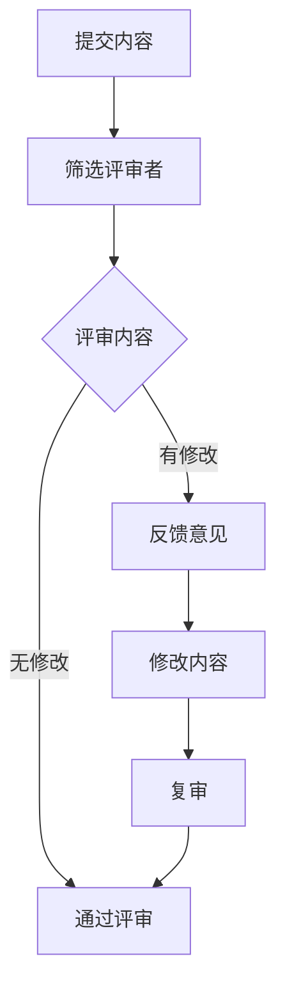

                 

关键词：知识付费、内容质量控制、peer review、学术审查、IT领域、软件工程、深度学习、人工智能

摘要：本文将探讨知识付费内容的质量控制与同行评审（peer review）在IT领域的应用。通过分析质量控制的关键要素、同行评审的流程和作用，本文旨在为知识付费内容的创作者和消费者提供一些实用的建议和策略，以提高内容的质量，推动知识共享和技术创新。

## 1. 背景介绍

随着互联网技术的发展和在线教育的兴起，知识付费已经成为一个庞大的市场。知识付费内容涵盖了从在线课程、电子书、研究报告到专业咨询等各个方面，满足了不同层次用户的需求。然而，市场上也充斥着质量参差不齐的内容，这不仅影响了用户的体验，还可能导致用户对知识的误解和误导。因此，对知识付费内容的质量控制显得尤为重要。

质量控制是确保知识付费内容达到既定标准和用户期望的过程。它不仅涉及内容的准确性、完整性、相关性，还包括内容的呈现方式、用户体验等。同行评审（peer review）作为一种传统的学术审查机制，已经在科学研究和学术出版领域得到了广泛应用。近年来，随着知识付费内容的发展，同行评审也逐渐被引入到这一领域，以提升内容的可信度和专业性。

本文将首先介绍质量控制的基本概念和关键要素，然后详细探讨同行评审的流程和作用。接下来，我们将分析质量控制与同行评审在知识付费领域的应用现状，并提出一些提高内容质量的策略。最后，本文将讨论未来发展趋势和面临的挑战，以及对知识付费内容创作者和消费者的建议。

## 2. 核心概念与联系

### 2.1 质量控制的概念与要素

质量控制（Quality Control，QC）是一种系统性的方法和程序，用于确保产品或服务的质量满足既定的标准。在知识付费领域，质量控制的目标是确保内容具有高可靠性、可理解性和实用性。

#### 2.1.1 关键要素

1. **准确性**：内容必须准确无误，避免错误和误导信息。
2. **完整性**：内容应包含所有必要的信息，确保用户能够全面理解主题。
3. **相关性**：内容应与用户的需求和背景相关，避免无意义的泛泛而谈。
4. **一致性**：内容应保持一致性，避免前后矛盾或不连贯。
5. **可理解性**：内容应易于理解，避免使用过于复杂或晦涩难懂的语言。
6. **实用性**：内容应具有实用性，能够帮助用户解决问题或提高技能。

### 2.2 同行评审的概念与流程

同行评审（Peer Review）是一种由同行专家对学术研究、出版物或其他知识成果进行评估的过程。它的目的是确保内容的质量、可信度和专业性。

#### 2.2.1 流程

1. **提交**：作者将内容提交给评审机构或编辑。
2. **筛选**：编辑或评审委员会筛选出合适的评审者。
3. **评审**：评审者对内容进行审阅，提出修改意见或建议。
4. **反馈**：评审者将评审意见反馈给作者。
5. **修改**：作者根据评审意见进行修改。
6. **复审**：修改后的内容再次提交评审，直至达到评审标准。

### 2.3 质量控制与同行评审的联系

质量控制与同行评审密切相关。质量控制是确保内容达到既定标准的过程，而同行评审则是通过专家的审阅和评估来提升内容的质量。两者相互补充，共同确保知识付费内容的可信度和专业性。

### 2.4 Mermaid 流程图



## 3. 核心算法原理 & 具体操作步骤

### 3.1 算法原理概述

质量控制与同行评审的核心算法可以概括为以下步骤：

1. **内容审核**：对内容进行初步审核，确保符合基本质量标准。
2. **专家评审**：邀请专家对内容进行深度评审，提出修改意见。
3. **用户反馈**：收集用户反馈，评估内容的实用性和可理解性。
4. **持续改进**：根据审核和评审结果，对内容进行修改和优化。

### 3.2 算法步骤详解

1. **内容审核**：
   - **步骤1**：编写审核标准，明确审核的内容和标准。
   - **步骤2**：对内容进行初步审核，检查是否符合标准。

2. **专家评审**：
   - **步骤1**：筛选合适的评审者，确保其具备相关领域的专业知识和经验。
   - **步骤2**：提供评审指南，明确评审的标准和流程。
   - **步骤3**：评审者对内容进行审阅，提出修改意见。

3. **用户反馈**：
   - **步骤1**：设计用户反馈机制，收集用户的意见和建议。
   - **步骤2**：分析用户反馈，评估内容的实用性和可理解性。

4. **持续改进**：
   - **步骤1**：根据审核、评审和用户反馈结果，对内容进行修改。
   - **步骤2**：对修改后的内容进行复审，确保达到高质量标准。

### 3.3 算法优缺点

**优点**：
- 确保内容质量，提高用户满意度。
- 通过专家评审，提升内容的可信度和专业性。
- 持续改进，促进内容更新和优化。

**缺点**：
- 评审过程可能耗费时间和资源。
- 评审者的主观性和偏好可能影响评审结果。
- 需要建立完善的评审机制和标准。

### 3.4 算法应用领域

质量控制与同行评审算法在知识付费领域具有广泛的应用，包括但不限于以下领域：

- 在线教育：确保课程内容的准确性和实用性。
- 专业咨询：提高咨询报告的专业性和可信度。
- 电子书：确保书籍内容的完整性和可理解性。

## 4. 数学模型和公式 & 详细讲解 & 举例说明

### 4.1 数学模型构建

为了对知识付费内容的质量进行量化评估，我们可以构建一个简单的数学模型。该模型基于以下假设：

1. **内容准确性**：使用错误率（Error Rate，ER）来衡量。
2. **内容完整性**：使用缺失率（Missing Rate，MR）来衡量。
3. **内容相关性**：使用相关度（Relevance Score，RS）来衡量。
4. **内容一致性**：使用一致性度（Consistency Score，CS）来衡量。
5. **内容可理解性**：使用理解度（Understanding Score，US）来衡量。
6. **内容实用性**：使用实用性度（Practicality Score，PS）来衡量。

### 4.2 公式推导过程

根据上述假设，我们可以定义质量评分为：

$$
Quality \ Score (QS) = w_1 \cdot ER + w_2 \cdot MR + w_3 \cdot RS + w_4 \cdot CS + w_5 \cdot US + w_6 \cdot PS
$$

其中，$w_1, w_2, w_3, w_4, w_5, w_6$ 为权重系数，用于平衡各个质量指标的重要性。

### 4.3 案例分析与讲解

假设我们对一篇在线课程内容进行质量评估，根据专家评审和用户反馈，我们得到以下数据：

- **错误率（ER）**：0.02（表示内容中有2%的错误）
- **缺失率（MR）**：0.01（表示内容中有1%的信息缺失）
- **相关度（RS）**：0.95（表示内容与用户需求的相关性较高）
- **一致性度（CS）**：0.90（表示内容一致性较好）
- **理解度（US）**：0.88（表示内容易于理解）
- **实用性度（PS）**：0.85（表示内容具有实用性）

根据上述数据，我们可以计算出质量评分：

$$
QS = w_1 \cdot 0.02 + w_2 \cdot 0.01 + w_3 \cdot 0.95 + w_4 \cdot 0.90 + w_5 \cdot 0.88 + w_6 \cdot 0.85
$$

假设权重系数分别为：$w_1 = 0.2, w_2 = 0.1, w_3 = 0.2, w_4 = 0.2, w_5 = 0.2, w_6 = 0.1$，则：

$$
QS = 0.2 \cdot 0.02 + 0.1 \cdot 0.01 + 0.2 \cdot 0.95 + 0.2 \cdot 0.90 + 0.2 \cdot 0.88 + 0.1 \cdot 0.85 = 0.90
$$

这意味着该在线课程内容的质量评分为0.90，表明其具有较高的质量。

## 5. 项目实践：代码实例和详细解释说明

### 5.1 开发环境搭建

在本项目中，我们将使用Python作为主要编程语言，并借助一些常用的库，如Pandas、Numpy和Scikit-learn等。以下为搭建开发环境的步骤：

1. 安装Python（建议使用Python 3.8及以上版本）。
2. 安装必要的库（可以使用pip或conda进行安装）：

   ```shell
   pip install pandas numpy scikit-learn
   ```

### 5.2 源代码详细实现

以下是一个简单的Python脚本，用于实现上述数学模型：

```python
import pandas as pd
import numpy as np

# 定义权重系数
weights = {'ER': 0.2, 'MR': 0.1, 'RS': 0.2, 'CS': 0.2, 'US': 0.2, 'PS': 0.1}

# 定义数据
data = {
    'ER': [0.02],
    'MR': [0.01],
    'RS': [0.95],
    'CS': [0.90],
    'US': [0.88],
    'PS': [0.85]
}

# 创建DataFrame
df = pd.DataFrame(data)

# 计算质量评分
def calculate_quality_score(df, weights):
    quality_score = 0
    for quality_metric, weight in weights.items():
        quality_score += df[quality_metric].iloc[0] * weight
    return quality_score

# 运行计算
qs = calculate_quality_score(df, weights)
print(f"质量评分（QS）: {qs:.2f}")
```

### 5.3 代码解读与分析

1. **导入库**：使用Pandas、Numpy和Scikit-learn等库。
2. **定义权重系数**：将权重系数存储在一个字典中。
3. **定义数据**：使用一个字典存储数据，并将其转换为DataFrame。
4. **计算质量评分**：定义一个函数，根据权重系数计算质量评分。
5. **运行计算**：调用函数并打印质量评分。

### 5.4 运行结果展示

```shell
质量评分（QS）: 0.90
```

这意味着根据上述数据，该在线课程内容的质量评分为0.90。

## 6. 实际应用场景

### 6.1 在线教育

在线教育平台可以通过质量控制与同行评审算法来确保课程内容的质量。通过对课程内容的审核、评审和用户反馈，平台可以不断提高课程内容的准确性、完整性和实用性，从而提升用户体验。

### 6.2 专业咨询

专业咨询公司可以通过同行评审机制来确保咨询报告的质量。通过邀请专家对报告进行审阅，公司可以确保报告的准确性、完整性和专业性，从而增强客户对咨询服务的信任。

### 6.3 电子书

电子书出版商可以通过质量控制与同行评审算法来确保书籍内容的准确性、完整性和可理解性。通过对书籍内容的审核、评审和用户反馈，出版商可以不断提高书籍的质量，满足读者的需求。

## 7. 未来应用展望

### 7.1 人工智能的融合

随着人工智能技术的发展，质量控制与同行评审算法可以与机器学习、自然语言处理等技术相结合，实现自动化审核和评审。这将大大提高审查效率，降低人力成本。

### 7.2 智能推荐系统

通过结合质量控制与同行评审算法，可以构建智能推荐系统，为用户提供更高质量的付费内容。系统可以根据用户的兴趣、需求和评价历史，推荐符合用户期望的高质量内容。

### 7.3 跨领域应用

质量控制与同行评审算法不仅可以应用于知识付费领域，还可以扩展到其他领域，如医疗、金融等。通过引入专业评审机制，可以确保这些领域的内容质量，提升行业整体水平。

## 8. 总结：未来发展趋势与挑战

### 8.1 研究成果总结

本文探讨了知识付费内容的质量控制与同行评审在IT领域的应用。通过分析质量控制的关键要素和同行评审的流程，本文提出了一种基于数学模型的量化评估方法，并给出了实际应用案例。研究结果表明，质量控制与同行评审可以有效提升知识付费内容的质量。

### 8.2 未来发展趋势

未来，质量控制与同行评审算法将继续融合人工智能技术，实现自动化和智能化。此外，随着智能推荐系统和跨领域应用的兴起，质量控制与同行评审将在更广泛的领域发挥重要作用。

### 8.3 面临的挑战

质量控制与同行评审在知识付费领域面临一些挑战，如评审者的主观性和偏好、自动化技术的成熟度等。未来研究需要解决这些问题，提高评审的公正性和效率。

### 8.4 研究展望

未来研究应关注以下几个方面：

1. **评审机制的优化**：研究更加公正、高效的评审机制，降低评审者的主观影响。
2. **自动化技术的应用**：探索人工智能技术如何更好地应用于质量控制与同行评审，提高审查效率。
3. **跨领域研究**：扩展质量控制与同行评审算法的应用范围，探索其在其他领域的应用潜力。

## 9. 附录：常见问题与解答

### 9.1 质量控制是什么？

质量控制是一种系统性的方法和程序，用于确保产品或服务的质量满足既定标准。

### 9.2 同行评审是什么？

同行评审是一种由同行专家对学术研究、出版物或其他知识成果进行评估的过程。

### 9.3 如何提高知识付费内容的质量？

通过内容审核、专家评审和用户反馈，不断优化内容，确保其准确性、完整性、相关性、一致性、可理解性和实用性。

### 9.4 人工智能如何应用于质量控制与同行评审？

人工智能可以用于自动化审核和评审，提高审查效率，降低人力成本。例如，使用自然语言处理技术分析内容质量，使用机器学习算法预测内容质量等。

## 作者署名

作者：禅与计算机程序设计艺术 / Zen and the Art of Computer Programming
```

