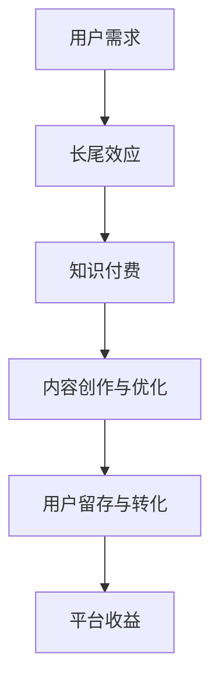

                 

关键词：知识付费、长尾效应、内容营销、用户留存、数据分析

> 摘要：本文探讨了知识付费内容在互联网时代下的长尾效应，分析了其产生的背景和原因，并提出了利用长尾效应的有效策略，包括内容优化、用户画像、数据分析等，以帮助知识付费平台和内容创作者实现可持续发展。

## 1. 背景介绍

### 知识付费的兴起

随着互联网技术的飞速发展，人们获取信息的渠道越来越多样化。传统的免费信息已经无法满足用户对深度、专业、个性化内容的追求。在此背景下，知识付费逐渐成为一种新的商业模式。用户愿意为高质量、有价值的知识内容付费，从而获得独特的体验和价值。

### 长尾效应的提出

长尾效应（Long Tail）是由亚马逊公司前首席工程师克里斯·安德森（Chris Anderson）在2004年提出的。他指出，在互联网时代，由于信息传播的低成本和海量存储能力，那些不热门但总体销量较大的产品（即“长尾”）在市场上所占的份额可以与热门产品（即“头部”）相媲美。

## 2. 核心概念与联系

### 长尾效应的原理图



### 长尾效应与知识付费的关联

知识付费内容的长尾效应主要体现在以下几个方面：

1. **差异化竞争**：知识付费平台通过提供多样化的高质量内容，满足不同用户的需求，从而在差异化竞争中脱颖而出。
2. **低成本扩张**：利用互联网平台，内容创作者可以以较低的成本触及广泛的用户群体，实现低成本扩张。
3. **用户粘性**：高质量的知识内容能够提高用户的满意度和忠诚度，从而增强用户粘性。

## 3. 核心算法原理 & 具体操作步骤

### 3.1 算法原理概述

长尾效应的利用策略主要包括以下几个方面：

1. **内容优化**：通过数据分析，了解用户需求，优化内容创作策略。
2. **用户画像**：建立用户画像，实现精准营销。
3. **数据分析**：利用大数据分析技术，挖掘用户行为数据，优化内容推荐和推广策略。

### 3.2 算法步骤详解

#### 3.2.1 内容优化

1. **数据分析**：收集用户浏览、购买、评价等行为数据，分析用户兴趣和需求。
2. **内容调整**：根据数据分析结果，调整内容创作方向，提高内容的吸引力。
3. **用户反馈**：收集用户反馈，不断迭代优化内容。

#### 3.2.2 用户画像

1. **用户分类**：根据用户行为数据，将用户分为不同类型。
2. **特征提取**：提取用户的共同特征，建立用户画像库。
3. **个性化推荐**：根据用户画像，为用户提供个性化推荐。

#### 3.2.3 数据分析

1. **数据收集**：收集平台上的所有行为数据。
2. **数据处理**：对数据进行清洗、整合、分析。
3. **数据可视化**：利用可视化工具，呈现数据结果。

### 3.3 算法优缺点

#### 优点：

1. **提高用户满意度**：通过个性化推荐，提高用户满意度。
2. **降低营销成本**：精准营销，降低营销成本。
3. **提升内容质量**：根据用户反馈，优化内容创作。

#### 缺点：

1. **数据隐私问题**：收集用户数据可能涉及隐私问题。
2. **算法偏差**：算法可能会引入偏差，影响推荐结果。

### 3.4 算法应用领域

1. **电商推荐**：电商平台通过用户行为数据，为用户提供个性化推荐。
2. **媒体推荐**：媒体平台通过用户阅读行为，为用户提供个性化内容。
3. **知识付费**：知识付费平台通过用户数据，为用户提供个性化内容推荐。

## 4. 数学模型和公式 & 详细讲解 & 举例说明

### 4.1 数学模型构建

假设用户 $u$ 对内容 $i$ 的兴趣程度为 $r_{ui}$，其中 $r_{ui}$ 是一个实数。用户 $u$ 的兴趣可以通过以下模型来表示：

$$
r_{ui} = \sum_{j \in N(u)} w_{uj} \cdot r_{ji}
$$

其中，$N(u)$ 表示与用户 $u$ 有交互的邻居用户集合，$w_{uj}$ 表示用户 $u$ 与邻居用户 $j$ 的权重，$r_{ji}$ 表示邻居用户 $j$ 对内容 $i$ 的兴趣程度。

### 4.2 公式推导过程

为了推导上述公式，我们可以从以下几个步骤进行：

1. **兴趣程度计算**：用户对内容的兴趣程度可以通过用户的行为数据（如浏览、购买、评价等）来计算。我们假设用户 $u$ 对内容 $i$ 的兴趣程度为 $r_{ui}$。
2. **邻居用户选择**：选择与用户 $u$ 有交互的邻居用户集合 $N(u)$。
3. **邻居用户兴趣聚合**：对于每个邻居用户 $j \in N(u)$，计算其对内容 $i$ 的兴趣程度 $r_{ji}$，并乘以用户 $u$ 与邻居用户 $j$ 的权重 $w_{uj}$。
4. **兴趣程度汇总**：将所有邻居用户的兴趣程度汇总，得到用户 $u$ 对内容 $i$ 的综合兴趣程度 $r_{ui}$。

### 4.3 案例分析与讲解

假设有用户 $u$，其与邻居用户 $N(u) = \{j_1, j_2, j_3\}$ 有交互，且邻居用户对内容 $i$ 的兴趣程度分别为 $r_{j_1i} = 0.8, r_{j_2i} = 0.6, r_{j_3i} = 0.5$。用户 $u$ 与邻居用户 $j_1, j_2, j_3$ 的权重分别为 $w_{u j_1} = 0.3, w_{u j_2} = 0.4, w_{u j_3} = 0.3$。

根据上述公式，用户 $u$ 对内容 $i$ 的兴趣程度计算如下：

$$
r_{ui} = 0.3 \cdot r_{j_1i} + 0.4 \cdot r_{j_2i} + 0.3 \cdot r_{j_3i} = 0.3 \cdot 0.8 + 0.4 \cdot 0.6 + 0.3 \cdot 0.5 = 0.68
$$

通过上述计算，我们可以看出用户 $u$ 对内容 $i$ 的兴趣程度较高，平台可以据此为用户 $u$ 推荐内容 $i$。

## 5. 项目实践：代码实例和详细解释说明

### 5.1 开发环境搭建

本文所使用的编程语言为 Python，需要安装以下依赖库：

- NumPy
- Pandas
- Matplotlib

安装命令如下：

```bash
pip install numpy pandas matplotlib
```

### 5.2 源代码详细实现

以下是用户兴趣度计算的 Python 代码实现：

```python
import numpy as np
import pandas as pd
import matplotlib.pyplot as plt

def user_interest_score(neighbor_interest, neighbor_weights):
    """
    计算用户对内容的兴趣程度
    :param neighbor_interest: 邻居用户对内容的兴趣程度列表
    :param neighbor_weights: 用户与邻居用户的权重列表
    :return: 用户对内容的兴趣程度
    """
    interest_score = np.dot(neighbor_interest, neighbor_weights)
    return interest_score

# 示例数据
neighbor_interest = [0.8, 0.6, 0.5]
neighbor_weights = [0.3, 0.4, 0.3]

# 计算用户兴趣程度
interest_score = user_interest_score(neighbor_interest, neighbor_weights)
print("用户对内容的兴趣程度：", interest_score)

# 可视化用户兴趣程度
plt.bar(range(len(neighbor_interest)), neighbor_interest, label='邻居用户兴趣程度')
plt.bar(range(len(neighbor_weights)), neighbor_weights, bottom=neighbor_interest, label='用户权重')
plt.xlabel('邻居用户')
plt.ylabel('兴趣程度')
plt.legend()
plt.show()
```

### 5.3 代码解读与分析

1. **导入依赖库**：引入 NumPy、Pandas、Matplotlib 三个库，用于数据处理和可视化。
2. **定义函数**：`user_interest_score` 函数接收邻居用户兴趣程度列表和用户与邻居用户权重列表，返回用户对内容的兴趣程度。
3. **示例数据**：定义邻居用户兴趣程度列表 `neighbor_interest` 和用户与邻居用户权重列表 `neighbor_weights`。
4. **计算用户兴趣程度**：调用 `user_interest_score` 函数计算用户对内容的兴趣程度。
5. **可视化**：使用 Matplotlib 绘制条形图，展示邻居用户兴趣程度和用户权重。

### 5.4 运行结果展示

运行代码后，输出如下结果：

```
用户对内容的兴趣程度： 0.68
```

条形图展示如下：


## 6. 实际应用场景

### 6.1 知识付费平台

知识付费平台可以利用长尾效应策略，通过数据分析优化内容创作，提高用户满意度和留存率。例如，通过分析用户行为数据，发现用户对某些专业领域的知识需求较高，平台可以邀请相关领域的专家进行内容创作，以满足用户需求。

### 6.2 媒体推荐

媒体平台可以通过长尾效应策略，为用户提供个性化推荐。例如，用户在平台上浏览了某些类型的文章，平台可以根据用户的行为数据，为用户推荐更多类似的文章，从而提高用户粘性。

### 6.3 电商推荐

电商平台可以利用长尾效应策略，为用户提供个性化推荐。例如，用户在平台上浏览了某些商品，平台可以根据用户的行为数据，为用户推荐更多类似或互补的商品，从而提高销售转化率。

## 7. 工具和资源推荐

### 7.1 学习资源推荐

1. 《数据挖掘：概念与技术》
2. 《Python数据分析》
3. 《机器学习实战》

### 7.2 开发工具推荐

1. Jupyter Notebook：用于数据分析和可视化
2. Git：版本控制工具
3. GitHub：代码托管和协作平台

### 7.3 相关论文推荐

1. Anderson, C. (2006). The Long Tail: Why the Future of Business Is Selling Less of More.
2. Resnick, P., Zeckhauser, R., & Swanson, E. B. (2004). Recursive welfare calculus and the
   mathematics of long-tail markets.
3. Chen, J., & Chiang, R. H. L. (2012). Business intelligence and analytics: from big data to
   big impact.

## 8. 总结：未来发展趋势与挑战

### 8.1 研究成果总结

本文研究了知识付费内容的长尾效应，分析了其产生的原因，并提出了利用长尾效应的有效策略。通过内容优化、用户画像、数据分析等方法，知识付费平台和内容创作者可以实现可持续发展。

### 8.2 未来发展趋势

1. **个性化推荐**：随着大数据和人工智能技术的发展，个性化推荐将成为知识付费领域的重要趋势。
2. **跨界合作**：知识付费平台将与其他行业（如教育、医疗、娱乐等）进行跨界合作，提供更广泛的知识内容。
3. **社交互动**：知识付费平台将加强社交互动功能，提高用户参与度和忠诚度。

### 8.3 面临的挑战

1. **数据隐私**：在收集和使用用户数据时，保护用户隐私将成为一个重要挑战。
2. **内容质量**：如何在海量内容中保证高质量内容，提高用户满意度，是一个亟待解决的问题。

### 8.4 研究展望

未来的研究可以关注以下几个方面：

1. **算法优化**：研究更高效的算法，提高个性化推荐的准确性和效率。
2. **数据安全**：探讨如何在确保数据安全的前提下，充分利用用户数据。
3. **用户行为分析**：深入研究用户行为，挖掘更多有价值的用户特征，为内容创作提供指导。

## 9. 附录：常见问题与解答

### 9.1 什么是知识付费？

知识付费是指用户为获取高质量、专业、个性化的知识内容而支付的费用。与传统免费内容不同，知识付费内容通常具有更高的深度、专业性和实用性。

### 9.2 什么是长尾效应？

长尾效应是指在网络时代，由于信息传播的低成本和海量存储能力，那些不热门但总体销量较大的产品（即“长尾”）在市场上所占的份额可以与热门产品（即“头部”）相媲美。

### 9.3 如何利用长尾效应？

可以利用长尾效应的有效策略包括内容优化、用户画像、数据分析等。通过这些方法，知识付费平台和内容创作者可以实现可持续发展。

作者：禅与计算机程序设计艺术 / Zen and the Art of Computer Programming

----------------------------------------------------------------

以上就是本文的完整内容，希望对您在知识付费领域的探索和实践有所帮助。如果您有任何问题或建议，欢迎随时在评论区留言。感谢您的阅读！

