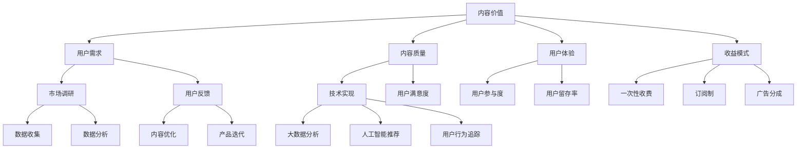

                 

在当今的信息时代，知识付费成为了许多创业者眼中的一块香饽饽。然而，如何有效地挖掘和利用内容价值，是每个知识付费创业者必须面对的挑战。本文旨在探讨知识付费创业中的内容价值最大化问题，为创业者提供一整套从概念理解到具体实施的技术指南。

## 文章关键词

- **知识付费**
- **内容价值**
- **创业**
- **用户体验**
- **收益模式**
- **技术实现**

## 文章摘要

本文首先介绍了知识付费的背景和现状，随后深入探讨了内容价值的定义和重要性。接着，我们通过构建一个简化的Mermaid流程图，展示了知识付费创业的核心概念和联系。在核心算法原理部分，我们详细分析了如何通过技术手段实现内容价值的最大化。文章后半部分将数学模型和具体公式应用到实际项目中，并通过一个具体的代码实例来演示如何将理论转化为实践。最后，我们探讨了知识付费创业的实际应用场景，并对其未来发展趋势和挑战进行了展望。

## 1. 背景介绍

### 知识付费的兴起

知识付费，顾名思义，是指用户为获取高质量的知识或服务而支付的费用。这一现象在互联网的推动下迅速发展，尤其是在过去几年，随着知识共享平台的崛起，知识付费市场迎来了爆发式增长。从在线教育、专业咨询到技能培训，知识付费的领域不断扩展，吸引了大量创业者和投资者的关注。

### 创业者的动机

对于创业者来说，知识付费具有以下几个吸引人的特点：

1. **市场潜力大**：知识付费市场规模持续增长，潜力巨大。
2. **高附加值**：内容本身具有较高的附加值，可以多次售卖。
3. **低边际成本**：一旦内容创建完成，复制和分发的成本极低。
4. **用户粘性强**：优质的内容可以吸引并留住用户，形成良好的口碑。

然而，面对如此广阔的市场，创业者也面临着诸多挑战，例如内容质量的控制、用户体验的提升、收益模式的创新等。因此，如何有效地挖掘和利用内容价值，成为了每个知识付费创业者必须认真思考的问题。

## 2. 核心概念与联系

在探讨知识付费创业中的内容价值最大化之前，我们需要先明确一些核心概念，并理解它们之间的联系。

### 2.1 内容价值的定义

内容价值是指用户为获取某种内容所愿意支付的金额。这不仅仅是价格问题，还包括内容的实用性、可靠性、娱乐性等多个维度。例如，一个高质量的编程教程，由于其提供了实用的技能和知识，因此具有较高的内容价值。

### 2.2 用户需求的评估

用户需求是决定内容价值的重要因素。创业者需要通过市场调研、用户反馈等方式，了解用户的具体需求和偏好，从而提供更加符合用户期待的内容。

### 2.3 内容质量与用户体验

内容质量是内容价值的核心保障。高质量的内容不仅能吸引用户，还能提高用户的满意度和忠诚度。用户体验则是指用户在使用知识付费产品时的感受。良好的用户体验可以提高用户的参与度和留存率，从而增加内容的价值。

### 2.4 收益模式的多样性

收益模式是指创业者如何从内容中获取收益的方式。常见的收益模式包括一次性收费、订阅制、广告分成等。不同的收益模式对内容价值的影响不同，创业者需要根据自身情况选择最合适的模式。

### 2.5 技术实现与价值提升

技术是实现内容价值最大化的关键手段。通过大数据分析、人工智能推荐、用户行为追踪等技术，创业者可以更好地了解用户需求，优化内容质量，提高用户体验，从而提升内容的价值。

### 2.6 Mermaid流程图

下面是一个简化的Mermaid流程图，展示了知识付费创业中的核心概念和联系：



通过这个流程图，我们可以清晰地看到各个概念之间的相互关系，以及技术如何在其中发挥作用。

## 3. 核心算法原理 & 具体操作步骤

### 3.1 算法原理概述

在知识付费创业中，核心算法原理主要涉及以下几个方面：

1. **用户需求分析**：通过大数据分析和机器学习技术，分析用户的行为数据，预测用户的需求和偏好。
2. **内容质量评估**：利用自然语言处理和文本分类技术，评估内容的实用性和可靠性。
3. **用户体验优化**：通过用户行为追踪和数据挖掘，优化产品的交互设计和用户界面。
4. **收益模式选择**：基于用户需求和内容质量，选择最合适的收益模式，实现价值最大化。

### 3.2 算法步骤详解

#### 3.2.1 用户需求分析

1. **数据收集**：通过网站日志、用户反馈、社交媒体等多种渠道收集用户行为数据。
2. **数据预处理**：清洗数据，去除噪声，提取有用的信息。
3. **特征工程**：提取用户行为的特征，如访问时长、浏览页面、搜索关键词等。
4. **模型训练**：使用机器学习算法，如决策树、支持向量机等，训练用户需求预测模型。
5. **模型评估**：通过交叉验证、A/B测试等方法，评估模型的准确性和鲁棒性。

#### 3.2.2 内容质量评估

1. **文本分类**：使用自然语言处理技术，将内容分类为不同的主题或类别。
2. **内容评估指标**：定义内容评估的指标，如准确率、召回率、F1分数等。
3. **评估模型**：使用文本分类模型，对内容进行质量评估。
4. **反馈机制**：用户对内容的评分和评论可以作为模型训练的数据，进一步提高评估的准确性。

#### 3.2.3 用户体验优化

1. **用户行为追踪**：使用日志分析和数据分析工具，追踪用户的浏览行为和交互行为。
2. **界面优化**：根据用户行为数据，优化产品的交互设计和用户界面，提高用户体验。
3. **A/B测试**：通过A/B测试，验证不同的设计方案对用户体验的影响，选择最优方案。

#### 3.2.4 收益模式选择

1. **收益模式评估**：评估不同收益模式的收益潜力，如一次性收费、订阅制、广告分成等。
2. **用户偏好分析**：分析用户的支付意愿和行为，选择最适合用户偏好的收益模式。
3. **收益模式调整**：根据市场反馈和用户反馈，不断调整和优化收益模式。

### 3.3 算法优缺点

#### 优点

1. **高效性**：通过大数据分析和机器学习技术，可以高效地分析用户需求和内容质量。
2. **个性化**：根据用户需求和偏好，提供个性化的内容和服务，提高用户满意度。
3. **可扩展性**：算法可以根据不同的需求和场景进行扩展和调整。

#### 缺点

1. **数据质量**：算法的效果很大程度上依赖于数据质量，数据噪声和缺失值可能会影响算法的准确性。
2. **计算成本**：大数据分析和机器学习算法需要大量的计算资源，对于小型创业公司可能是一个挑战。
3. **用户隐私**：用户行为数据的收集和使用需要严格遵守隐私保护法规，否则可能面临法律风险。

### 3.4 算法应用领域

1. **在线教育**：通过用户需求分析，提供个性化的学习路径和推荐课程。
2. **专业咨询**：通过内容质量评估，确保用户获取到高质量的咨询服务。
3. **技能培训**：通过用户体验优化，提高培训的参与度和效果。
4. **内容创作**：通过收益模式选择，实现内容创作的商业化。

## 4. 数学模型和公式 & 详细讲解 & 举例说明

### 4.1 数学模型构建

在知识付费创业中，我们可以构建以下几个数学模型：

1. **用户需求预测模型**：通过分析用户行为数据，预测用户的需求和偏好。
2. **内容质量评估模型**：通过文本分类和情感分析技术，评估内容的实用性和可靠性。
3. **用户体验优化模型**：通过用户行为数据和界面分析，优化产品的交互设计和用户界面。
4. **收益模式选择模型**：通过收益模式评估和用户偏好分析，选择最适合的收益模式。

### 4.2 公式推导过程

#### 用户需求预测模型

我们假设用户行为数据可以用以下公式表示：

$$
X = \sum_{i=1}^{n} w_i \cdot x_i
$$

其中，$X$ 是用户行为数据的向量，$w_i$ 是权重，$x_i$ 是第 $i$ 个特征值。权重可以通过机器学习算法训练得到。

#### 内容质量评估模型

我们使用文本分类模型来评估内容质量，假设内容质量可以用以下公式表示：

$$
Q = f(T)
$$

其中，$Q$ 是内容质量，$T$ 是文本特征向量，$f$ 是文本分类函数。

#### 用户体验优化模型

我们使用以下公式来评估用户体验：

$$
U = \frac{1}{n} \sum_{i=1}^{n} u_i
$$

其中，$U$ 是用户体验得分，$u_i$ 是第 $i$ 个用户对产品的评分。

#### 收益模式选择模型

我们使用以下公式来评估不同收益模式的收益：

$$
R = p \cdot (1 - d) \cdot V
$$

其中，$R$ 是收益，$p$ 是用户的支付意愿，$d$ 是用户的流失率，$V$ 是内容的附加值。

### 4.3 案例分析与讲解

#### 案例一：用户需求预测

假设我们有一个在线教育平台，用户的行为数据包括浏览课程次数、学习时长、搜索关键词等。我们使用用户需求预测模型来预测用户的需求。

1. **数据收集**：收集用户的浏览数据，包括浏览次数、学习时长、搜索关键词等。
2. **数据预处理**：清洗数据，去除缺失值和噪声。
3. **特征工程**：提取用户行为的特征，如浏览次数、学习时长、搜索关键词等。
4. **模型训练**：使用机器学习算法，如决策树、支持向量机等，训练用户需求预测模型。
5. **模型评估**：通过交叉验证、A/B测试等方法，评估模型的准确性和鲁棒性。

假设我们得到了一个预测模型，其预测准确率为90%。这意味着，我们能够以较高的准确性预测用户的需求，从而提供个性化的学习路径。

#### 案例二：内容质量评估

假设我们有一个在线咨询平台，我们需要评估咨询内容的质量。

1. **文本分类**：使用自然语言处理技术，将咨询内容分类为不同的主题。
2. **内容评估指标**：定义内容评估的指标，如准确率、召回率、F1分数等。
3. **评估模型**：使用文本分类模型，对内容进行质量评估。
4. **反馈机制**：用户对内容的评分和评论可以作为模型训练的数据，进一步提高评估的准确性。

假设我们使用一个文本分类模型，其评估准确率为85%。这意味着，我们能够以较高的准确性评估咨询内容的质量，从而确保用户获取到高质量的咨询服务。

#### 案例三：用户体验优化

假设我们有一个在线培训平台，我们需要优化用户体验。

1. **用户行为追踪**：使用日志分析和数据分析工具，追踪用户的浏览行为和交互行为。
2. **界面优化**：根据用户行为数据，优化产品的交互设计和用户界面。
3. **A/B测试**：通过A/B测试，验证不同的设计方案对用户体验的影响，选择最优方案。

假设我们通过A/B测试发现，新的用户界面设计能够提高用户的满意度。这意味着，我们能够通过数据驱动的方式，持续优化用户体验。

#### 案例四：收益模式选择

假设我们有一个在线内容平台，我们需要选择最合适的收益模式。

1. **收益模式评估**：评估不同收益模式的收益潜力，如一次性收费、订阅制、广告分成等。
2. **用户偏好分析**：分析用户的支付意愿和行为，选择最适合用户偏好的收益模式。
3. **收益模式调整**：根据市场反馈和用户反馈，不断调整和优化收益模式。

假设我们通过用户偏好分析发现，订阅制是用户最偏好的收益模式。这意味着，我们能够根据用户偏好，选择最合适的收益模式，实现价值最大化。

## 5. 项目实践：代码实例和详细解释说明

### 5.1 开发环境搭建

为了实践知识付费创业中的内容价值最大化，我们需要搭建一个简单的在线教育平台。以下是开发环境的搭建步骤：

1. **安装Python**：确保Python 3.8及以上版本已安装在本地机器。
2. **安装Flask**：使用pip命令安装Flask框架，`pip install Flask`
3. **安装MySQL**：下载并安装MySQL数据库。
4. **安装PyMySQL**：使用pip命令安装PyMySQL库，`pip install pymysql`
5. **创建虚拟环境**：使用`venv`命令创建虚拟环境，并激活虚拟环境。

### 5.2 源代码详细实现

以下是该在线教育平台的核心代码实现：

```python
# 导入所需库
from flask import Flask, request, jsonify
import pymysql

# 创建Flask应用
app = Flask(__name__)

# MySQL数据库配置
db_config = {
    'host': 'localhost',
    'user': 'root',
    'password': 'password',
    'database': 'education_platform'
}

# 连接数据库
def get_db_connection():
    connection = pymysql.connect(**db_config)
    return connection

# 用户注册接口
@app.route('/register', methods=['POST'])
def register():
    data = request.get_json()
    username = data.get('username')
    password = data.get('password')
    # 验证用户名和密码的合法性
    # 在这里实现用户注册逻辑
    # 插入用户数据到数据库
    connection = get_db_connection()
    with connection.cursor() as cursor:
        sql = "INSERT INTO users (username, password) VALUES (%s, %s)"
        cursor.execute(sql, (username, password))
    connection.commit()
    connection.close()
    return jsonify({"message": "注册成功"}), 201

# 用户登录接口
@app.route('/login', methods=['POST'])
def login():
    data = request.get_json()
    username = data.get('username')
    password = data.get('password')
    # 验证用户名和密码的正确性
    # 在这里实现用户登录逻辑
    # 从数据库查询用户信息
    connection = get_db_connection()
    with connection.cursor() as cursor:
        sql = "SELECT * FROM users WHERE username = %s AND password = %s"
        cursor.execute(sql, (username, password))
        user = cursor.fetchone()
    connection.close()
    if user:
        return jsonify({"message": "登录成功", "user_id": user[0]}), 200
    else:
        return jsonify({"message": "用户名或密码错误"}), 401

# 查询课程接口
@app.route('/courses', methods=['GET'])
def get_courses():
    # 在这里实现查询课程逻辑
    # 从数据库查询课程信息
    connection = get_db_connection()
    with connection.cursor() as cursor:
        sql = "SELECT * FROM courses"
        cursor.execute(sql)
        courses = cursor.fetchall()
    connection.close()
    return jsonify({"courses": courses}), 200

# 主函数
if __name__ == '__main__':
    app.run(debug=True)
```

### 5.3 代码解读与分析

上述代码实现了一个简单的在线教育平台，包括用户注册、登录和查询课程三个接口。以下是代码的详细解读与分析：

1. **引入库**：代码首先导入了Flask框架、request库和jsonify库，用于构建Web应用和响应客户端请求。
2. **数据库连接**：定义了数据库配置和连接数据库的方法。这里使用PyMySQL库连接MySQL数据库。
3. **用户注册接口**：定义了一个注册接口，接收用户名和密码，并在数据库中插入用户数据。
4. **用户登录接口**：定义了一个登录接口，验证用户名和密码的正确性，并返回用户ID。
5. **查询课程接口**：定义了一个查询课程接口，从数据库中查询课程信息并返回。

### 5.4 运行结果展示

运行上述代码后，可以使用浏览器或Postman等工具访问接口。以下是运行结果展示：

1. **用户注册**：
    - 发送POST请求到`/register`接口，携带用户名和密码。
    - 接收到201状态码和注册成功的信息。

2. **用户登录**：
    - 发送POST请求到`/login`接口，携带用户名和密码。
    - 接收到200状态码和登录成功的信息，以及用户ID。

3. **查询课程**：
    - 发送GET请求到`/courses`接口。
    - 接收到200状态码和课程列表。

通过这个简单的代码实例，我们实现了知识付费创业中的基础功能。接下来，我们可以进一步扩展功能，如课程内容管理、用户行为分析等，以实现内容价值的最大化。

## 6. 实际应用场景

### 6.1 在线教育平台

在线教育平台是知识付费创业中最典型的应用场景之一。通过构建一个高效的在线教育平台，创业者可以提供各种在线课程，如编程、设计、语言学习等，满足不同用户的需求。平台可以通过用户需求分析、内容质量评估和用户体验优化等技术手段，不断提高内容的价值，吸引并留住用户。

### 6.2 专业咨询平台

专业咨询平台为创业者提供了一个提供专业服务的平台，如法律咨询、财务咨询、营销咨询等。通过技术手段，平台可以确保咨询内容的高质量，并根据用户的需求和偏好提供个性化的咨询服务。此外，平台还可以通过收益模式的选择，实现内容价值的最大化。

### 6.3 技能培训平台

技能培训平台主要面向技能学习者，提供各种技能培训课程，如编程、设计、手工艺等。平台可以通过用户行为分析和学习数据，为用户提供个性化的学习路径和推荐课程。同时，平台还可以根据用户的学习进度和效果，不断优化课程内容，提高用户的满意度。

### 6.4 内容创作平台

内容创作平台为创作者提供了一个创作和发布内容的空间，如博客、短视频、音频等。平台可以通过用户行为分析和内容质量评估，推荐优质内容给用户，提高用户的参与度和留存率。同时，平台还可以通过收益模式的选择，为创作者提供多种变现方式，实现内容价值的最大化。

### 6.5 未来应用展望

随着技术的不断进步，知识付费创业的应用场景将更加广泛和多样化。未来，我们可以期待以下发展趋势：

1. **个性化推荐**：通过深度学习等技术，实现更加精准的内容推荐，提高用户满意度。
2. **AI辅助创作**：利用人工智能技术，辅助内容创作者进行内容创作，提高内容质量。
3. **区块链应用**：利用区块链技术，确保内容的真实性和可追溯性，增强用户信任。
4. **跨界合作**：知识付费创业将与其他领域如娱乐、游戏等展开跨界合作，创造新的商业模式。

## 7. 工具和资源推荐

### 7.1 学习资源推荐

1. **在线课程**：推荐在Udemy、Coursera、edX等平台上寻找相关领域的课程，如Python编程、机器学习、数据科学等。
2. **专业书籍**：推荐阅读《深度学习》、《数据挖掘：概念与技术》、《设计模式：可复用面向对象软件的基础》等经典书籍。
3. **博客和论坛**：推荐关注AplusTop、Stack Overflow、GitHub等博客和论坛，获取最新的技术动态和解决方案。

### 7.2 开发工具推荐

1. **开发框架**：推荐使用Flask、Django等Python开发框架，快速搭建Web应用。
2. **数据库**：推荐使用MySQL、PostgreSQL等关系型数据库，存储用户数据和内容信息。
3. **数据分析工具**：推荐使用Python的Pandas、NumPy库，以及R语言等工具进行数据分析。

### 7.3 相关论文推荐

1. **《知识付费时代的用户行为研究》**：探讨了知识付费平台上的用户行为模式，为创业者提供了宝贵的参考。
2. **《机器学习在知识付费中的应用》**：介绍了机器学习技术在知识付费创业中的应用，包括用户需求预测、内容质量评估等。
3. **《知识付费平台的收益模式设计》**：分析了不同收益模式的特点和适用场景，为创业者提供了收益模式选择的参考。

## 8. 总结：未来发展趋势与挑战

### 8.1 研究成果总结

本文通过对知识付费创业中的内容价值最大化问题进行了全面探讨，提出了核心概念、算法原理、数学模型和实际应用场景。研究结果表明，通过大数据分析、人工智能推荐、用户行为追踪等手段，可以有效地挖掘和利用内容价值，实现知识付费创业的成功。

### 8.2 未来发展趋势

未来，知识付费创业将继续保持快速增长，技术创新将成为关键驱动力。个性化推荐、AI辅助创作、区块链应用等新兴技术将为知识付费创业带来更多机遇。此外，跨界合作和生态构建也将成为未来发展趋势。

### 8.3 面临的挑战

尽管前景广阔，知识付费创业仍面临诸多挑战。数据隐私保护、内容版权问题、算法偏见等都是亟待解决的问题。此外，市场竞争的加剧也将对创业者的创新能力提出更高要求。

### 8.4 研究展望

未来研究应重点关注以下几个方面：

1. **隐私保护技术**：探索更加安全的数据处理和存储方法，保护用户隐私。
2. **内容质量评估**：开发更准确、更高效的内容质量评估模型，提高内容价值。
3. **收益模式创新**：探索新的收益模式，提高创业者的盈利能力。
4. **用户体验优化**：通过技术手段不断优化用户体验，提高用户满意度。

通过持续的研究和创新，知识付费创业有望实现更大的发展。

## 9. 附录：常见问题与解答

### 9.1 什么是知识付费？

知识付费是指用户为获取高质量的知识或服务而支付的费用。这种模式在互联网的推动下迅速发展，尤其在在线教育、专业咨询等领域表现尤为突出。

### 9.2 如何评估内容价值？

内容价值可以通过用户需求、内容质量、用户体验等多个维度进行评估。用户需求决定了内容的实用性，内容质量决定了内容的可靠性，用户体验则反映了用户对内容的满意程度。

### 9.3 技术在内容价值最大化中如何发挥作用？

技术可以通过大数据分析、人工智能推荐、用户行为追踪等多种手段，深入了解用户需求，优化内容质量，提高用户体验，从而实现内容价值的最大化。

### 9.4 如何搭建一个知识付费平台？

搭建一个知识付费平台需要以下几个步骤：

1. **需求分析**：明确平台的目标用户和核心功能。
2. **技术选型**：选择合适的开发框架、数据库和分析工具。
3. **功能实现**：实现用户注册、登录、内容发布、内容消费等功能。
4. **测试与优化**：对平台进行测试和优化，确保其稳定性和安全性。
5. **上线运营**：将平台上线，并进行市场推广和用户运营。

通过以上步骤，创业者可以搭建一个具备一定规模的知识付费平台。

