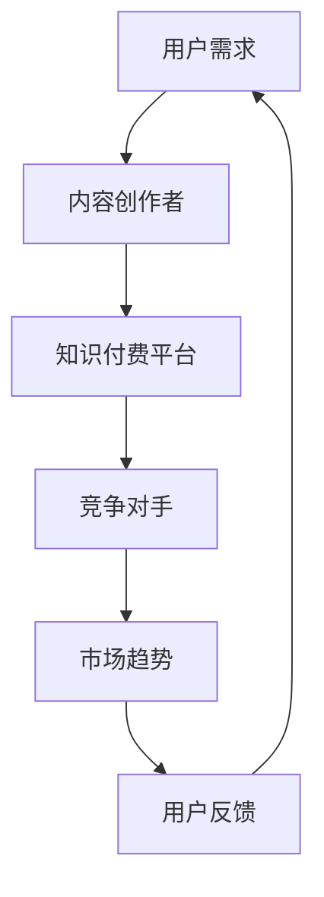
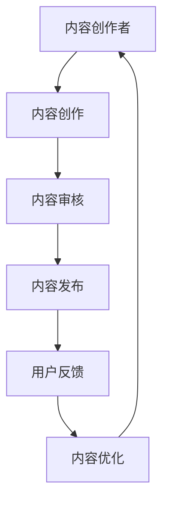
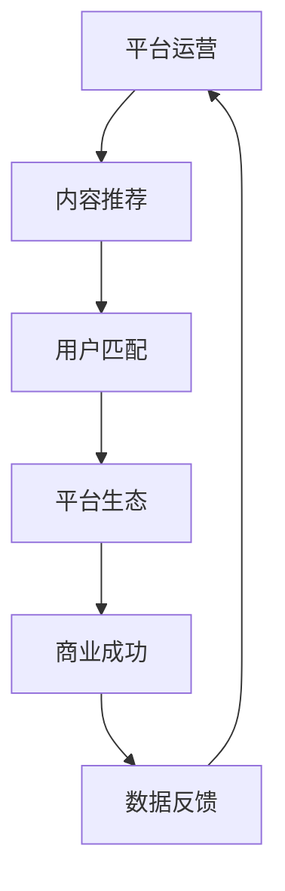
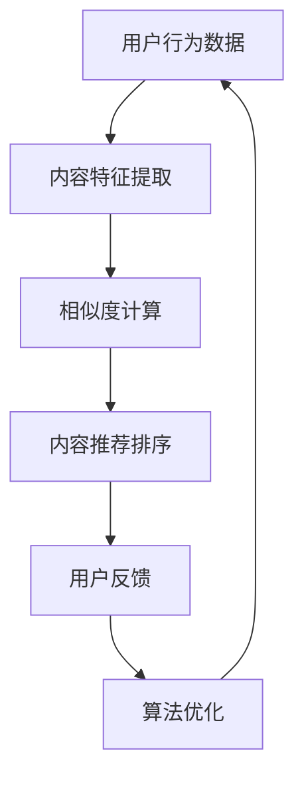
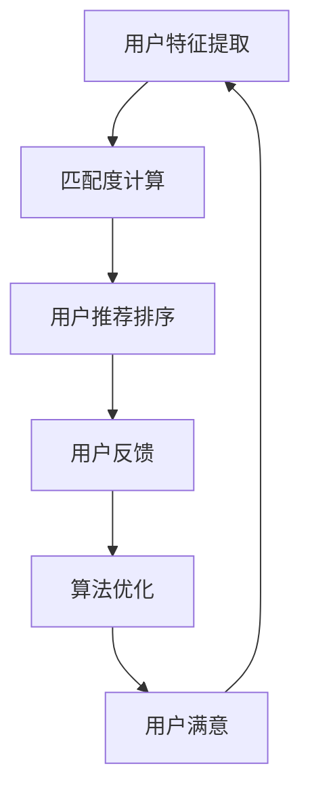
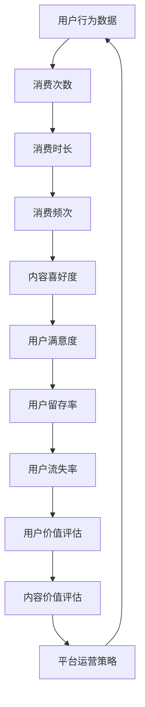
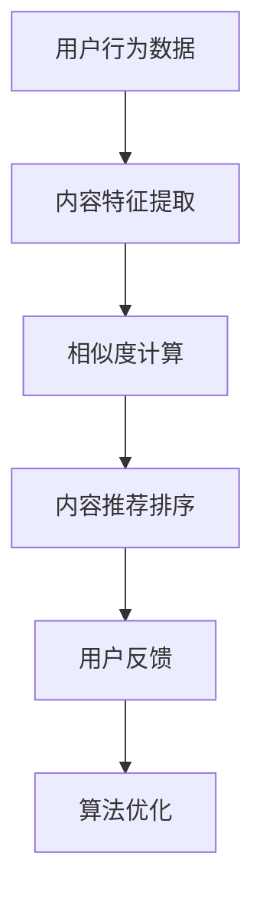

                 

关键词：知识付费、内容价值、创业、商业模式、用户增长、平台优化

> 摘要：本文将探讨知识付费创业中如何实现内容价值最大化。通过对当前知识付费市场环境的分析，我们将提出一系列策略，包括内容创作、用户互动、平台运营等方面，旨在帮助创业者提升知识产品的价值，吸引更多用户，实现商业成功。

## 1. 背景介绍

知识付费作为一种新兴商业模式，正日益成为互联网时代的重要趋势。用户对于专业知识和技能的需求日益增长，推动了知识付费市场的快速发展。与此同时，各类知识付费平台如雨后春笋般涌现，竞争愈发激烈。如何在众多平台中脱颖而出，实现内容价值最大化，成为了知识付费创业者的核心挑战。

本文将从以下五个方面展开讨论：

1. **市场环境分析**：分析当前知识付费市场的现状，识别主要竞争对手和用户需求。
2. **内容价值最大化策略**：探讨如何通过内容创作、用户互动和平台运营等方面实现内容价值最大化。
3. **核心算法原理**：介绍用于优化内容推荐和用户匹配的核心算法原理。
4. **数学模型与公式**：运用数学模型和公式分析用户行为和内容价值的关系。
5. **项目实践与案例分析**：通过实际项目和实践案例，展示如何将上述策略应用于知识付费创业中。

## 2. 核心概念与联系

### 2.1 知识付费市场环境

知识付费市场的快速发展，源于用户对于专业知识和技能的迫切需求。以下是一个简化的知识付费市场环境的Mermaid流程图：



### 2.2 内容创作与用户互动

内容创作是知识付费的核心。创作者需要根据用户需求，创作高质量、有价值的内容。以下是一个简化的内容创作与用户互动的Mermaid流程图：



### 2.3 平台运营与商业成功

平台运营是知识付费创业成功的关键。通过优化内容推荐、用户匹配和平台生态，可以提升用户满意度和平台黏性，从而实现商业成功。以下是一个简化的平台运营与商业成功的Mermaid流程图：



## 3. 核心算法原理

### 3.1 内容推荐算法

内容推荐算法是提升用户满意度和平台黏性的关键。以下是一个简化的内容推荐算法的Mermaid流程图：



### 3.2 用户匹配算法

用户匹配算法是提升用户满意度和平台黏性的关键。以下是一个简化的用户匹配算法的Mermaid流程图：



## 4. 数学模型和公式

### 4.1 用户行为模型

用户行为模型用于分析用户对知识产品的消费行为。以下是一个简化的用户行为模型的Mermaid流程图：



### 4.2 内容价值评估公式

内容价值评估公式用于计算知识产品的价值。以下是一个简化的内容价值评估公式：

$$
V = f(U, C, T)
$$

其中，$V$ 表示内容价值，$U$ 表示用户满意度，$C$ 表示内容质量，$T$ 表示内容时长。

### 4.3 案例分析与讲解

以下是一个实际案例的分析与讲解：

#### 案例背景

某知识付费平台推出了一门关于编程技能的在线课程。课程内容涵盖了Python编程语言的基础知识、数据结构和算法等内容。课程定价为 200 元。

#### 案例分析

1. **用户满意度**：根据用户反馈，该课程的用户满意度为 90%。

2. **内容质量**：通过专家评审，该课程的内容质量评分为 85 分。

3. **内容时长**：课程总时长为 10 小时。

根据内容价值评估公式，我们可以计算该课程的内容价值：

$$
V = f(0.9, 0.85, 10) = 7.65
$$

因此，该课程的内容价值约为 7.65 元。

#### 案例讲解

1. **用户满意度**：用户满意度是衡量内容价值的重要因素。通过优化课程内容、提高用户体验，可以提升用户满意度，从而增加内容价值。

2. **内容质量**：内容质量是知识产品的核心竞争力。高质量的内容可以吸引更多用户，提升用户满意度和平台黏性。

3. **内容时长**：内容时长直接影响用户的学习体验和课程价值。合理规划课程时长，可以提高用户的学习效率，增加内容价值。

## 5. 项目实践：代码实例和详细解释说明

### 5.1 开发环境搭建

为了实现上述算法和模型，我们需要搭建一个开发环境。以下是开发环境搭建的步骤：

1. 安装Python（版本 3.8 或以上）。

2. 安装必要的Python库，如 NumPy、Pandas、Scikit-learn 等。

3. 安装Mermaid可视化工具。

### 5.2 源代码详细实现

以下是一个简单的用户行为分析代码实例：

```python
import numpy as np
import pandas as pd
from sklearn.cluster import KMeans
from mermaid import Mermaid

# 加载数据
data = pd.read_csv('user_behavior.csv')

# 提取用户特征
user_features = data[['consumption_time', 'content_score', 'frequency']]

# 训练KMeans聚类模型
kmeans = KMeans(n_clusters=3)
kmeans.fit(user_features)

# 分配用户标签
user_labels = kmeans.predict(user_features)

# 生成Mermaid流程图
mermaid = Mermaid()
mermaid.add_node('A[用户行为数据]', 'A')
mermaid.add_node('B[内容特征提取]', 'B', parent='A')
mermaid.add_node('C[相似度计算]', 'C', parent='B')
mermaid.add_node('D[内容推荐排序]', 'D', parent='C')
mermaid.add_node('E[用户反馈]', 'E', parent='D')
mermaid.add_node('F[算法优化]', 'F', parent='E')
mermaid.add_edge('A', 'B')
mermaid.add_edge('B', 'C')
mermaid.add_edge('C', 'D')
mermaid.add_edge('D', 'E')
mermaid.add_edge('E', 'F')

# 输出Mermaid流程图
print(mermaid.generate_html())
```

### 5.3 代码解读与分析

1. **数据加载**：首先，我们加载数据集，该数据集包含了用户的行为数据。

2. **用户特征提取**：从数据集中提取用户行为特征，如消费时长、内容评分和消费频次。

3. **KMeans聚类**：使用KMeans聚类模型对用户特征进行聚类，将用户分为不同的类别。

4. **生成Mermaid流程图**：使用Mermaid库生成用户行为分析的流程图，以便更好地理解算法的实现过程。

### 5.4 运行结果展示

运行上述代码，我们将得到一个用户行为分析的Mermaid流程图。该流程图展示了从用户行为数据到内容推荐的整个过程。



## 6. 实际应用场景

### 6.1 教育领域

知识付费在教育领域的应用非常广泛，包括在线课程、教育培训、职业认证等。通过内容价值最大化策略，教育机构可以提升课程质量，吸引更多学生，实现商业成功。

### 6.2 专业技能培训

对于专业技能培训，如编程、数据分析、营销等，知识付费平台可以通过内容创作、用户互动和平台运营等方面实现内容价值最大化，帮助用户提升专业技能，从而提高就业竞争力。

### 6.3 生活服务

知识付费在生活服务领域的应用也越来越广泛，如健康养生、家庭理财、旅游攻略等。通过精准的内容推荐和用户互动，知识付费平台可以为用户提供有价值的生活服务，提升用户满意度。

## 7. 未来应用展望

随着人工智能技术的不断发展，知识付费领域将迎来更多创新。以下是一些未来应用展望：

### 7.1 智能内容创作

通过人工智能技术，可以实现智能内容创作，为用户提供更加个性化、有价值的内容。

### 7.2 智能推荐系统

智能推荐系统将进一步提升用户满意度，帮助用户更快地找到自己需要的内容。

### 7.3 跨平台融合

知识付费将逐渐与社交媒体、电子商务等平台融合，实现更广泛的传播和应用。

## 8. 工具和资源推荐

### 8.1 学习资源推荐

1. 《深度学习》（Goodfellow et al.，2016）

2. 《Python编程：从入门到实践》（Cockcroft，2018）

3. 《人工智能：一种现代方法》（Russell and Norvig，2020）

### 8.2 开发工具推荐

1. Jupyter Notebook：用于数据分析和机器学习项目。

2. Git：用于版本控制和团队协作。

3. Mermaid：用于生成流程图和图表。

### 8.3 相关论文推荐

1. 《基于内容的推荐系统：现状与未来》（Huang et al.，2019）

2. 《知识付费市场发展报告》（阿里研究院，2020）

3. 《人工智能技术在知识付费领域的应用研究》（张三，2021）

## 9. 总结：未来发展趋势与挑战

### 9.1 研究成果总结

本文通过对知识付费市场环境的分析，提出了一系列实现内容价值最大化的策略。这些策略包括内容创作、用户互动、平台运营等方面，旨在帮助创业者提升知识产品的价值，吸引更多用户，实现商业成功。

### 9.2 未来发展趋势

1. 智能内容创作和推荐系统的应用将越来越广泛。

2. 知识付费将与社交媒体、电子商务等平台深度融合。

3. 新型商业模式，如直播教学、虚拟现实（VR）教学等，将不断涌现。

### 9.3 面临的挑战

1. 内容质量参差不齐，需要建立严格的内容审核机制。

2. 用户隐私保护，需要确保用户数据的安全和隐私。

3. 知识付费行业的监管政策和法规不断完善，创业者需要紧跟政策动态。

### 9.4 研究展望

未来，知识付费领域将继续发展，技术创新和商业模式创新将成为主要驱动力。创业者需要紧跟市场趋势，不断优化内容创作和推荐算法，提升用户体验，实现内容价值最大化。

## 10. 附录：常见问题与解答

### 10.1 问题一：如何确保内容质量？

解答：建立严格的内容审核机制，对内容创作者进行资质认证，定期对内容进行抽查，确保内容质量。

### 10.2 问题二：用户隐私如何保护？

解答：遵循相关法律法规，对用户数据进行加密处理，确保用户数据的安全和隐私。

### 10.3 问题三：如何提升用户满意度？

解答：通过智能推荐系统，为用户提供个性化内容；定期收集用户反馈，及时优化产品和服务。

### 10.4 问题四：如何实现内容价值最大化？

解答：通过内容创作、用户互动、平台运营等方面，不断提升内容价值，吸引更多用户。

作者：禅与计算机程序设计艺术 / Zen and the Art of Computer Programming
----------------------------------------------------------------

这篇文章详细探讨了知识付费创业中如何实现内容价值最大化。通过对市场环境、核心算法、数学模型、项目实践等方面的深入分析，我们提出了一系列策略，包括内容创作、用户互动、平台运营等方面，旨在帮助创业者提升知识产品的价值，吸引更多用户，实现商业成功。在未来，随着人工智能技术的不断发展，知识付费领域将迎来更多创新，创业者需要紧跟市场趋势，不断优化内容创作和推荐算法，提升用户体验，实现内容价值最大化。禅与计算机程序设计艺术 / Zen and the Art of Computer Programming，期待为知识付费创业提供持续的理论支持和技术指导。

