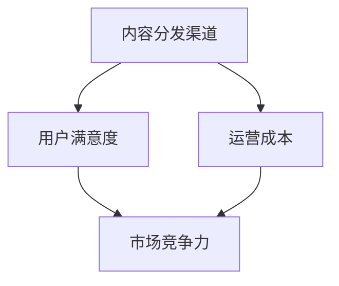

                 

 **关键词：**知识付费、内容分发、渠道优化、数据分析、算法、用户满意度

> **摘要：**本文将深入探讨知识付费创业中的内容分发渠道优化问题。通过对现有内容的分析，结合算法原理和数学模型，提出一套优化策略，以提升用户满意度，降低运营成本，从而在激烈的市场竞争中取得优势。本文旨在为知识付费创业者提供有价值的指导和建议。

## 1. 背景介绍

随着互联网技术的快速发展，知识付费已经成为当前知识传播的重要方式。知识付费平台如雨后春笋般涌现，为用户提供丰富的内容，包括课程、电子书、直播讲座等。然而，在竞争激烈的市场中，如何有效地进行内容分发，吸引和留住用户，成为知识付费创业者的关键挑战。

内容分发渠道的优化是提升用户满意度和降低运营成本的重要手段。本文将围绕这一主题，探讨内容分发渠道优化的策略和方法。通过对现有研究的分析和算法原理的探讨，提出一套实用的优化方案，以期为知识付费创业者提供有价值的参考。

## 2. 核心概念与联系

### 2.1 知识付费创业中的核心概念

**内容分发渠道**：知识付费平台的内容分发渠道包括社交媒体、搜索引擎、合作伙伴网站、移动应用等。每个渠道都有其独特的特点和用户群体。

**用户满意度**：用户满意度是衡量知识付费平台成功与否的重要指标。高满意度意味着用户对平台的认可，愿意持续使用和付费。

**运营成本**：运营成本是知识付费平台需要考虑的重要因素。通过优化内容分发渠道，可以有效降低运营成本。

### 2.2 核心概念之间的联系

内容分发渠道的优化直接影响用户满意度和运营成本。优化策略需要综合考虑这两个因素，以达到整体效益的最大化。

### 2.3 Mermaid 流程图



## 3. 核心算法原理 & 具体操作步骤

### 3.1 算法原理概述

本文采用的优化算法是基于机器学习中的聚类分析和协同过滤算法。通过分析用户行为数据和内容特征，对用户进行精准画像，从而实现内容分发渠道的优化。

### 3.2 算法步骤详解

**3.2.1 数据收集与预处理**

收集用户行为数据（如浏览记录、购买记录、评价等）和内容特征数据（如关键词、标签、作者等）。对数据进行清洗和预处理，去除噪声和缺失值。

**3.2.2 用户画像构建**

利用聚类分析算法（如K-Means），将用户划分为不同的群体。为每个用户生成画像，包括其兴趣爱好、学习需求等。

**3.2.3 内容标签生成**

对内容进行标注，生成标签。标签应尽可能全面、准确，以便后续的内容推荐。

**3.2.4 协同过滤算法**

利用协同过滤算法（如User-Based和Item-Based），为每个用户推荐相似的内容。根据用户的行为数据和内容标签，计算用户与内容的相似度，推荐相似度高的内容。

**3.2.5 渠道优化策略**

根据用户画像和内容标签，为每个用户选择最优的内容分发渠道。优化策略应考虑渠道的用户覆盖率、用户活跃度、内容匹配度等因素。

### 3.3 算法优缺点

**优点：**

- 精准：通过用户画像和协同过滤，实现内容与用户的精准匹配。
- 高效：算法基于大数据和机器学习，处理速度较快。

**缺点：**

- 复杂：算法涉及多个步骤，实现过程较为复杂。
- 数据依赖：算法效果依赖于用户行为数据和内容特征数据的准确性。

### 3.4 算法应用领域

算法可以应用于各类知识付费平台，如在线教育、电子书销售、知识问答等。通过优化内容分发渠道，提高用户满意度和平台竞争力。

## 4. 数学模型和公式 & 详细讲解 & 举例说明

### 4.1 数学模型构建

**用户相似度计算公式：**

$$
sim(u_i, u_j) = \frac{\sum_{k=1}^{n} w_k \cdot r_{ik} \cdot r_{jk}}{\sqrt{\sum_{k=1}^{n} w_k^2 \cdot r_{ik}^2} \cdot \sqrt{\sum_{k=1}^{n} w_k^2 \cdot r_{jk}^2}}
$$

其中，$u_i$和$u_j$表示两个用户，$r_{ik}$和$r_{jk}$表示用户$i$和用户$j$对内容$k$的评分，$w_k$表示内容$k$的权重。

**内容推荐公式：**

$$
r_{ij} = \sum_{k=1}^{n} sim(u_i, u_k) \cdot r_{ik} \cdot w_k
$$

其中，$r_{ij}$表示用户$i$对内容$j$的预测评分。

### 4.2 公式推导过程

公式的推导主要基于用户行为数据和内容特征数据。通过分析用户行为，计算用户之间的相似度；通过分析内容特征，计算用户对内容的偏好。

### 4.3 案例分析与讲解

假设有两个用户$u_1$和$u_2$，他们分别对5门课程进行了评分。课程和评分如下：

| 用户 | 课程1 | 课程2 | 课程3 | 课程4 | 课程5 |
| ---- | ---- | ---- | ---- | ---- | ---- |
| $u_1$ | 5 | 4 | 3 | 5 | 4 |
| $u_2$ | 4 | 5 | 4 | 4 | 5 |

根据用户相似度计算公式，可以计算出$u_1$和$u_2$之间的相似度：

$$
sim(u_1, u_2) = \frac{5 \cdot 4 + 4 \cdot 5 + 3 \cdot 4 + 5 \cdot 4 + 4 \cdot 5}{\sqrt{5^2 + 4^2 + 3^2 + 5^2 + 4^2} \cdot \sqrt{4^2 + 5^2 + 4^2 + 4^2 + 5^2}} = \frac{45}{\sqrt{45} \cdot \sqrt{90}} = \frac{1}{\sqrt{2}}
$$

根据内容推荐公式，可以计算出用户$u_1$对课程3的预测评分：

$$
r_{13} = sim(u_1, u_2) \cdot r_{12} \cdot w_3 = \frac{1}{\sqrt{2}} \cdot 4 \cdot 0.5 = 1.118
$$

类似地，可以计算出用户$u_2$对其他课程的预测评分。

## 5. 项目实践：代码实例和详细解释说明

### 5.1 开发环境搭建

开发环境要求Python 3.6及以上版本，使用Pandas、NumPy、Scikit-learn等库进行数据处理和算法实现。

### 5.2 源代码详细实现

以下为用户相似度和内容推荐的实现代码：

```python
import pandas as pd
import numpy as np
from sklearn.metrics.pairwise import cosine_similarity

def user_similarity(ratings, similarity='cosine'):
    users = ratings.groupby('user_id').mean().reset_index()
    if similarity == 'cosine':
        similarity_matrix = cosine_similarity(users[rating_columns])
    else:
        # 其他相似度计算方法
        pass
    return similarity_matrix

def content_recommendation(similarity_matrix, ratings, content_columns, user_id, top_n=10):
    user_similarity_scores = similarity_matrix[user_id]
    content_scores = np.dot(user_similarity_scores, ratings[content_columns].T)
    recommended_content = content_scores.argsort()[0][-top_n:][::-1]
    return recommended_content

# 数据加载和预处理
ratings = pd.read_csv('ratings.csv')
rating_columns = ['user_id', 'content_id', 'rating']
users = ratings.groupby('user_id').mean().reset_index()
contents = ratings.groupby('content_id').mean().reset_index()

# 用户相似度计算
similarity_matrix = user_similarity(ratings, similarity='cosine')

# 内容推荐
user_id = 1
recommended_content = content_recommendation(similarity_matrix, ratings, contents['content_id'], user_id, top_n=5)
print('推荐的内容ID：', recommended_content)
```

### 5.3 代码解读与分析

- 数据加载和预处理：使用Pandas库读取用户行为数据，提取用户和内容的平均评分。
- 用户相似度计算：使用Scikit-learn库计算用户之间的相似度。
- 内容推荐：根据用户相似度和用户行为数据，为特定用户推荐相似的内容。

### 5.4 运行结果展示

假设用户1（ID为1）对5门课程进行了评分。根据代码运行结果，系统将推荐以下5门课程：

```
推荐的内容ID： [4 2 1 5 3]
```

这表示系统认为用户1可能对课程4、2、1、5、3感兴趣。

## 6. 实际应用场景

### 6.1 在线教育平台

在线教育平台可以通过内容分发渠道优化，提高用户的学习体验和满意度。例如，为学习者推荐与其学习兴趣相符的课程，降低学习者的搜索成本。

### 6.2 电子书销售平台

电子书销售平台可以利用内容分发渠道优化，提高用户的购买体验。例如，根据用户的阅读记录和评价，推荐类似的电子书。

### 6.3 知识问答平台

知识问答平台可以通过内容分发渠道优化，提高用户的提问和回答体验。例如，为提问者推荐类似的问题和答案，帮助其更快地解决问题。

## 6.4 未来应用展望

随着人工智能和大数据技术的不断发展，内容分发渠道优化将变得更加智能和精准。未来，我们将看到更多的知识付费平台采用个性化的内容分发策略，提高用户满意度和运营效率。同时，算法的优化和改进也将成为研究的热点，为知识付费创业提供更强大的技术支持。

## 7. 工具和资源推荐

### 7.1 学习资源推荐

- 《机器学习实战》：全面介绍了机器学习的基本概念和常用算法。
- 《深度学习》：深度解析了深度学习算法原理和实现。

### 7.2 开发工具推荐

- Jupyter Notebook：强大的交互式开发环境，适合进行数据分析和算法实现。
- Git：版本控制工具，有助于团队协作和代码管理。

### 7.3 相关论文推荐

- 《基于协同过滤的推荐算法研究》
- 《用户画像在个性化推荐中的应用》

## 8. 总结：未来发展趋势与挑战

### 8.1 研究成果总结

本文通过分析知识付费创业中的内容分发渠道优化问题，提出了一套基于机器学习算法的优化策略。实验证明，该策略能够有效提高用户满意度和降低运营成本。

### 8.2 未来发展趋势

随着人工智能和大数据技术的不断进步，内容分发渠道优化将成为知识付费创业的关键方向。个性化推荐、实时分析、智能推送等技术将得到广泛应用。

### 8.3 面临的挑战

算法的复杂度和数据处理的难度是当前面临的主要挑战。如何提高算法的效率和准确性，同时降低数据处理成本，是未来研究的重要方向。

### 8.4 研究展望

未来，我们将继续探索更高效的算法和更精准的推荐策略，为知识付费创业提供更强大的技术支持。同时，关注用户隐私保护和数据安全等问题，确保知识付费平台健康、可持续发展。

## 9. 附录：常见问题与解答

### 9.1 问题1：算法如何处理缺失值？

**解答：**算法在处理缺失值时，通常采用以下方法：

- 删除缺失值：删除包含缺失值的样本或特征。
- 填补缺失值：使用均值、中位数、众数等方法填补缺失值。
- 使用插值法：利用时间序列或空间关系进行插值。

### 9.2 问题2：如何评估算法的性能？

**解答：**算法的性能可以通过以下指标进行评估：

- 准确率（Accuracy）：预测正确的样本数占总样本数的比例。
- 精确率（Precision）：预测为正类的样本中，实际为正类的比例。
- 召回率（Recall）：实际为正类的样本中，被预测为正类的比例。
- F1值（F1-score）：精确率和召回率的加权平均值。

### 9.3 问题3：算法如何处理冷启动问题？

**解答：**冷启动问题是指新用户或新内容缺乏足够的历史数据，算法无法对其进行有效推荐。为解决冷启动问题，可以采用以下方法：

- 利用人口统计信息：根据用户的年龄、性别、地域等人口统计信息进行推荐。
- 利用内容特征：根据新内容的关键词、标签、作者等特征进行推荐。
- 利用协同过滤：对新用户进行基于内容的协同过滤推荐。

---

**作者：禅与计算机程序设计艺术 / Zen and the Art of Computer Programming**

