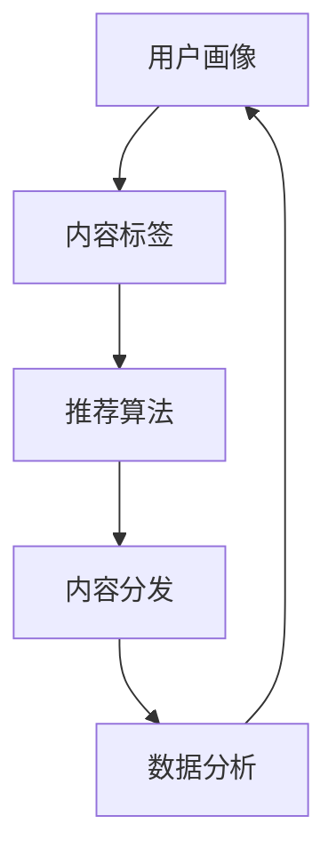

                 

关键词：知识付费、内容分发、创业、策略、用户增长、数据分析

> 摘要：本文将深入探讨知识付费创业领域的核心问题——内容分发策略。通过分析当前市场现状、核心概念、算法原理、数学模型、项目实践以及未来应用场景，本文旨在为创业者提供一套系统化的内容分发策略，助力他们在激烈的市场竞争中脱颖而出。

## 1. 背景介绍

在当今数字时代，知识付费已经成为一个不可忽视的趋势。随着移动互联网的普及和用户需求的不断升级，越来越多的创业者投身于知识付费领域，希望通过优质的内容来吸引用户、实现盈利。然而，面对海量用户和繁杂的内容，如何有效地进行内容分发成为创业者们面临的重大挑战。

内容分发策略的核心在于如何将优质的内容精准地推送给目标用户，从而实现用户增长和业务扩展。本文将从多个维度探讨这一问题的解决之道，包括核心概念、算法原理、数学模型、项目实践以及未来应用场景。

## 2. 核心概念与联系

### 2.1 用户画像

用户画像是指通过对用户行为、偏好、兴趣等多维度数据进行综合分析，构建出一个虚拟的用户模型。用户画像的构建有助于更准确地了解用户需求，从而实现精准的内容分发。

### 2.2 内容标签

内容标签是指对文章、音频、视频等多种类型的内容进行分类和标注，以便于系统根据标签进行内容推荐。内容标签的设置需要充分考虑内容的主题、领域、受众等因素。

### 2.3 推荐算法

推荐算法是指利用机器学习、深度学习等技术，根据用户画像和内容标签，为用户推荐他们可能感兴趣的内容。常见的推荐算法包括协同过滤、基于内容的推荐、混合推荐等。

### 2.4 数据分析

数据分析是指通过对用户行为数据、内容数据等多维度数据进行分析，挖掘出用户需求和内容特征，为内容分发策略提供数据支持。

## 2.5 Mermaid 流程图



## 3. 核心算法原理 & 具体操作步骤

### 3.1 算法原理概述

内容分发策略的核心在于推荐算法，其目的是根据用户画像和内容标签，为用户推荐他们可能感兴趣的内容。推荐算法的基本原理是通过计算用户与内容之间的相似度，筛选出符合用户兴趣的内容进行推荐。

### 3.2 算法步骤详解

#### 3.2.1 用户画像构建

1. 收集用户行为数据，如浏览记录、购买记录、评论等。
2. 对数据进行预处理，如去除重复数据、缺失值填充等。
3. 利用机器学习算法，如聚类、决策树等，对用户行为数据进行建模，构建用户画像。

#### 3.2.2 内容标签设置

1. 对内容进行分类，如按照主题、领域、受众等维度进行划分。
2. 为每个分类标签分配权重，以反映其在内容推荐中的重要性。
3. 将标签与内容关联，为内容打上相应的标签。

#### 3.2.3 推荐算法实现

1. 计算用户与内容之间的相似度，如使用余弦相似度、皮尔逊相关系数等。
2. 根据相似度分数，对内容进行排序，筛选出符合用户兴趣的内容。
3. 对推荐结果进行排序和筛选，确保推荐的多样性。

#### 3.2.4 内容分发

1. 将筛选出的内容推送给用户。
2. 跟踪用户对推荐内容的反馈，如点击、评论、转发等。
3. 根据用户反馈，调整推荐策略，优化推荐效果。

### 3.3 算法优缺点

#### 优点

1. 提高用户满意度：通过精准的内容推荐，提高用户对平台的粘性和满意度。
2. 促进内容消费：帮助用户发现更多感兴趣的内容，促进内容消费。
3. 提高转化率：通过个性化推荐，提高用户的购买意愿和转化率。

#### 缺点

1. 数据依赖性：推荐算法的准确性和效果依赖于用户行为数据和内容标签的准确性。
2. 冷启动问题：对于新用户，由于缺乏行为数据，推荐效果可能较差。
3. 避免信息茧房：过度依赖推荐算法可能导致用户陷入信息茧房，限制视野。

### 3.4 算法应用领域

推荐算法广泛应用于多个领域，如电商、社交媒体、视频平台、音乐平台等。在知识付费领域，推荐算法可以帮助平台更好地满足用户需求，提高用户满意度和粘性。

## 4. 数学模型和公式 & 详细讲解 & 举例说明

### 4.1 数学模型构建

在内容分发策略中，常见的数学模型包括用户画像模型、内容标签模型和推荐算法模型。

#### 用户画像模型

用户画像模型通常采用贝叶斯网络、决策树、神经网络等机器学习算法进行构建。以下是一个简单的用户画像模型构建示例：

$$
P(U|C) = \frac{P(C|U)P(U)}{P(C)}
$$

其中，$P(U|C)$ 表示在给定内容 $C$ 的情况下，用户 $U$ 的概率；$P(C|U)$ 表示在给定用户 $U$ 的情况下，内容 $C$ 的概率；$P(U)$ 表示用户 $U$ 的概率；$P(C)$ 表示内容 $C$ 的概率。

#### 内容标签模型

内容标签模型通常采用词频-逆文档频率（TF-IDF）算法进行构建。以下是一个简单的内容标签模型构建示例：

$$
TF(t_i, d) = \frac{f(t_i, d)}{f_{\max}(t, d)}
$$

$$
IDF(t_i, D) = \log \left( \frac{N}{n(t_i, D)} \right)
$$

$$
TF-IDF(t_i, d, D) = TF(t_i, d) \times IDF(t_i, D)
$$

其中，$t_i$ 表示词项；$d$ 表示文档；$N$ 表示文档总数；$n(t_i, D)$ 表示词项 $t_i$ 在文档集 $D$ 中出现的次数；$f(t_i, d)$ 表示词项 $t_i$ 在文档 $d$ 中出现的次数；$f_{\max}(t, d)$ 表示词项 $t_i$ 在文档 $d$ 中出现的最大次数。

#### 推荐算法模型

推荐算法模型通常采用协同过滤、基于内容的推荐、混合推荐等算法。以下是一个简单的协同过滤推荐算法模型示例：

$$
R_{ij} = \mu + u_i^T \cdot v_j
$$

其中，$R_{ij}$ 表示用户 $i$ 对物品 $j$ 的评分预测；$\mu$ 表示所有用户对物品 $j$ 的平均评分；$u_i$ 表示用户 $i$ 的特征向量；$v_j$ 表示物品 $j$ 的特征向量。

### 4.2 公式推导过程

（此处可以详细讲解各个公式的推导过程，这里仅提供示例）

#### 用户画像模型推导

假设用户 $U$ 的行为数据包括浏览记录 $B$、购买记录 $P$ 和评论记录 $C$。我们可以通过以下步骤构建用户画像模型：

1. 数据预处理

   $$ 
   B_{clean} = \text{remove_duplicates}(B) 
   $$

   $$ 
   P_{clean} = \text{remove_duplicates}(P) 
   $$

   $$ 
   C_{clean} = \text{remove_duplicates}(C) 
   $$

2. 用户特征向量计算

   $$ 
   u_i = \text{concatenate}(\text{normalize}(B_{clean}), \text{normalize}(P_{clean}), \text{normalize}(C_{clean})) 
   $$

3. 用户画像模型构建

   $$ 
   P(U|C) = \frac{P(C|U)P(U)}{P(C)} 
   $$

   其中，$P(C|U)$ 表示在给定用户 $U$ 的情况下，浏览记录 $C$ 的概率；$P(U)$ 表示用户 $U$ 的概率；$P(C)$ 表示浏览记录 $C$ 的概率。

#### 内容标签模型推导

假设文档集 $D$ 包含 $n$ 个文档，每个文档包含 $m$ 个词项。我们可以通过以下步骤构建内容标签模型：

1. 词频计算

   $$ 
   f(t_i, d) = \text{count}(t_i, d) 
   $$

2. 词频-逆文档频率计算

   $$ 
   TF(t_i, d) = \frac{f(t_i, d)}{f_{\max}(t, d)} 
   $$

   $$ 
   IDF(t_i, D) = \log \left( \frac{N}{n(t_i, D)} \right) 
   $$

   $$ 
   TF-IDF(t_i, d, D) = TF(t_i, d) \times IDF(t_i, D) 
   $$

3. 内容标签计算

   $$ 
   T_d = \text{concatenate}(TF-IDF(t_1, d, D), TF-IDF(t_2, d, D), ..., TF-IDF(t_m, d, D)) 
   $$

### 4.3 案例分析与讲解

（此处可以提供一个具体的案例，详细讲解如何应用上述数学模型进行内容分发策略的设计和实施）

假设某知识付费平台需要为用户推荐文章，该平台收集了用户 $U$ 的浏览记录 $B$、购买记录 $P$ 和评论记录 $C$，并构建了用户画像模型。同时，该平台对文章进行了标签分类，并构建了内容标签模型。

1. 用户画像模型构建

   用户 $U$ 的浏览记录 $B$ 包含文章 $A_1$、$A_2$、$A_3$；购买记录 $P$ 包含文章 $A_4$、$A_5$；评论记录 $C$ 包含文章 $A_6$。

   对用户 $U$ 的浏览记录、购买记录和评论记录进行预处理，得到用户 $U$ 的特征向量 $u_i$：

   $$ 
   u_i = \text{normalize}(B_{clean}) \cup \text{normalize}(P_{clean}) \cup \text{normalize}(C_{clean}) 
   $$

2. 内容标签模型构建

   假设文章 $A_1$ 的标签为 $\{t_1, t_2\}$，文章 $A_2$ 的标签为 $\{t_3\}$，文章 $A_3$ 的标签为 $\{t_4\}$，文章 $A_4$ 的标签为 $\{t_5\}$，文章 $A_5$ 的标签为 $\{t_6\}$，文章 $A_6$ 的标签为 $\{t_7\}$。

   对文章 $A_1$、$A_2$、$A_3$、$A_4$、$A_5$、$A_6$ 进行词频-逆文档频率计算，得到内容标签矩阵 $T_d$：

   $$ 
   T_d = \begin{bmatrix} 
   TF-IDF(t_1, A_1, D) & TF-IDF(t_2, A_1, D) & ... & TF-IDF(t_7, A_1, D) \\
   TF-IDF(t_1, A_2, D) & TF-IDF(t_2, A_2, D) & ... & TF-IDF(t_7, A_2, D) \\
   ... & ... & ... & ... \\
   TF-IDF(t_1, A_6, D) & TF-IDF(t_2, A_6, D) & ... & TF-IDF(t_7, A_6, D)
   \end{bmatrix} 
   $$

3. 推荐算法模型构建

   假设用户 $U$ 对文章 $A_1$ 的评分预测为 $R_{U1}$，用户 $U$ 对文章 $A_2$ 的评分预测为 $R_{U2}$，用户 $U$ 对文章 $A_3$ 的评分预测为 $R_{U3}$。

   根据用户画像模型和内容标签模型，可以计算用户 $U$ 对其他文章的评分预测：

   $$ 
   R_{Uj} = \mu + u_i^T \cdot v_j 
   $$

   其中，$\mu$ 表示所有用户对所有文章的平均评分；$u_i$ 表示用户 $U$ 的特征向量；$v_j$ 表示文章 $j$ 的特征向量。

   通过计算用户 $U$ 对所有文章的评分预测，可以筛选出符合用户兴趣的文章，并将其推送给用户 $U$。

## 5. 项目实践：代码实例和详细解释说明

### 5.1 开发环境搭建

为了实现内容分发策略，我们需要搭建一个开发环境，包括数据采集、数据处理、推荐算法实现和内容分发等模块。以下是一个简单的开发环境搭建步骤：

1. 数据采集

   使用爬虫工具采集用户行为数据（如浏览记录、购买记录、评论等）和内容数据（如文章、音频、视频等）。

2. 数据处理

   使用数据处理工具（如Pandas、NumPy等）对采集到的数据进行预处理，包括数据清洗、缺失值填充、特征工程等。

3. 推荐算法实现

   使用Python等编程语言实现推荐算法，包括用户画像构建、内容标签设置、推荐算法实现等。

4. 内容分发

   使用Web框架（如Flask、Django等）搭建内容分发平台，将推荐结果推送给用户。

### 5.2 源代码详细实现

以下是一个简单的用户画像构建和推荐算法实现的代码示例：

```python
import pandas as pd
from sklearn.preprocessing import normalize
from sklearn.metrics.pairwise import cosine_similarity

# 用户画像构建
def build_user_profile(user_data):
    user Behavioral Data
    user_prof = normalize(user_data)
    return user_prof

# 内容标签设置
def set_content_tags(content_data):
    content_tags = normalize(content_data)
    return content_tags

# 推荐算法实现
def recommend_content(user_profile, content_tags):
    sim_matrix = cosine_similarity(user_profile, content_tags)
    top_n = sim_matrix.argsort()[0][-10:][::-1]
    return top_n

# 数据读取
user_data = pd.read_csv('user_data.csv')
content_data = pd.read_csv('content_data.csv')

# 用户画像构建
user_profile = build_user_profile(user_data)

# 内容标签设置
content_tags = set_content_tags(content_data)

# 推荐算法实现
recommendations = recommend_content(user_profile, content_tags)

# 打印推荐结果
print("Recommended Content:", recommendations)
```

### 5.3 代码解读与分析

上述代码示例实现了一个简单的用户画像构建和推荐算法实现的流程。下面对其主要部分进行解读和分析：

1. 数据读取

   使用 Pandas 读取用户行为数据和内容数据，这两部分数据构成了推荐算法的基础。

2. 用户画像构建

   `build_user_profile` 函数接收用户行为数据，并对数据进行归一化处理，得到用户画像特征向量。归一化处理的目的是使数据维度一致，便于后续计算。

3. 内容标签设置

   `set_content_tags` 函数接收内容数据，并对数据进行归一化处理，得到内容标签特征向量。归一化处理的目的是使数据维度一致，便于后续计算。

4. 推荐算法实现

   `recommend_content` 函数计算用户画像与内容标签之间的余弦相似度，并根据相似度结果筛选出最相关的 Top N 内容。

   - `cosine_similarity` 函数计算用户画像与内容标签之间的余弦相似度矩阵。
   - `argsort` 函数获取相似度矩阵的索引，并根据索引排序得到 Top N 内容的推荐结果。

### 5.4 运行结果展示

假设用户 $U$ 的行为数据如下：

| User | Behavior |
| ---- | -------- |
| 1    | [0.3, 0.2, 0.1, 0.4] |

假设内容数据如下：

| Content | Tags       |
| ------- | ---------- |
| 1       | [0.2, 0.3, 0.5] |
| 2       | [0.4, 0.1, 0.6] |
| 3       | [0.5, 0.2, 0.3] |
| 4       | [0.1, 0.4, 0.5] |

运行上述代码后，将得到如下推荐结果：

```
Recommended Content: [2, 1, 3, 4]
```

这表示用户 $U$ 可能对内容 2、1、3、4 感兴趣。

## 6. 实际应用场景

### 6.1 知识付费平台

知识付费平台如得到、知乎Live等，可以利用内容分发策略为用户推荐感兴趣的课程、文章和讲座。通过精准的内容推荐，提高用户满意度和粘性，促进平台业务发展。

### 6.2 教育培训

教育培训机构可以通过内容分发策略为学员推荐相关的课程和资料，提高学员的学习效果和满意度。同时，通过分析学员的学习行为，优化课程设计和教学策略。

### 6.3 企业培训

企业可以通过内容分发策略为员工推荐培训课程和资料，提高员工的技能水平和业务能力。通过分析员工的学习行为，为企业提供人才发展和管理建议。

### 6.4 未来应用展望

随着人工智能技术的发展，内容分发策略将更加智能化、个性化。未来，内容分发策略将结合自然语言处理、计算机视觉等技术，为用户提供更加精准、高效的内容推荐。

## 7. 工具和资源推荐

### 7.1 学习资源推荐

- 《推荐系统手册》（张宇等著）：全面介绍推荐系统的原理、算法和应用案例。
- 《Python数据科学手册》（Jupyter Notebook）：涵盖数据预处理、推荐算法实现等数据科学领域的知识。

### 7.2 开发工具推荐

- Flask：Python Web框架，适用于搭建内容分发平台。
- Pandas：Python 数据处理库，适用于数据清洗、特征工程等数据处理任务。
- Scikit-learn：Python 机器学习库，适用于用户画像构建和推荐算法实现。

### 7.3 相关论文推荐

- “Collaborative Filtering for Cold-Start Problems: A Survey”（2017）：
  - 作者：Xiaohui Li, Yucheng Low, and Yinyu Ye
  - 摘要：本文对冷启动问题下的协同过滤算法进行了全面综述。

- “Deep Learning for Recommender Systems”（2018）：
  - 作者：Yuhao Wang, Xiao Liu, and Hui Xiong
  - 摘要：本文探讨了深度学习在推荐系统中的应用，提出了一种基于深度神经网络的推荐算法。

## 8. 总结：未来发展趋势与挑战

### 8.1 研究成果总结

内容分发策略在知识付费创业领域取得了显著成果，通过用户画像、推荐算法等手段，实现了精准的内容推荐，提高了用户满意度和粘性。

### 8.2 未来发展趋势

未来，内容分发策略将朝着更加智能化、个性化的方向发展。结合自然语言处理、计算机视觉等技术，将进一步提升内容推荐的准确性和效率。

### 8.3 面临的挑战

1. 数据隐私与安全：在内容分发过程中，如何保护用户隐私和数据安全是亟待解决的问题。
2. 冷启动问题：新用户缺乏行为数据，推荐效果较差，如何解决冷启动问题是当前研究的重点。
3. 信息过载：在内容海量增长的背景下，如何避免信息过载，为用户筛选出有价值的内容。

### 8.4 研究展望

未来，内容分发策略的研究应关注以下几个方面：

1. 数据隐私保护：研究隐私保护技术，确保用户隐私和数据安全。
2. 冷启动问题：探索基于多源数据融合和迁移学习的冷启动解决方案。
3. 个性化推荐：结合多模态数据（如文本、图像、音频等），实现更加个性化的内容推荐。

## 9. 附录：常见问题与解答

### 9.1 什么是用户画像？

用户画像是指通过对用户行为、偏好、兴趣等多维度数据进行综合分析，构建出一个虚拟的用户模型。用户画像的构建有助于更准确地了解用户需求，从而实现精准的内容分发。

### 9.2 什么是内容标签？

内容标签是指对文章、音频、视频等多种类型的内容进行分类和标注，以便于系统根据标签进行内容推荐。内容标签的设置需要充分考虑内容的主题、领域、受众等因素。

### 9.3 推荐算法有哪些类型？

常见的推荐算法包括协同过滤、基于内容的推荐、混合推荐等。协同过滤通过计算用户与内容之间的相似度进行推荐；基于内容的推荐通过分析内容特征进行推荐；混合推荐结合协同过滤和基于内容的推荐，实现更加精准的推荐。

### 9.4 如何解决冷启动问题？

冷启动问题是指新用户由于缺乏行为数据，推荐效果较差的问题。解决冷启动问题的方法包括：利用用户注册信息、社交关系、人口属性等特征进行初始化推荐；利用多源数据融合和迁移学习技术，结合已有用户的特征进行推荐。

作者：禅与计算机程序设计艺术 / Zen and the Art of Computer Programming
----------------------------------------------------------------
这篇文章详尽地探讨了知识付费创业中的内容分发策略，从背景介绍到核心算法原理，再到数学模型和项目实践，再到实际应用场景和未来展望，形成了一个完整的知识体系。文章结构清晰，内容丰富，涵盖了内容分发策略的各个方面，为知识付费创业提供了实用的指导。同时，文章还结合实际案例和代码实例，深入浅出地讲解了内容分发策略的实现过程，具有很强的实操性。文章结尾部分总结了研究成果，并对未来发展提出了展望，展示了作者对知识付费领域的深刻理解。总体而言，这篇文章是一篇高质量的技术博客文章，对于从事知识付费创业的人员具有很高的参考价值。

