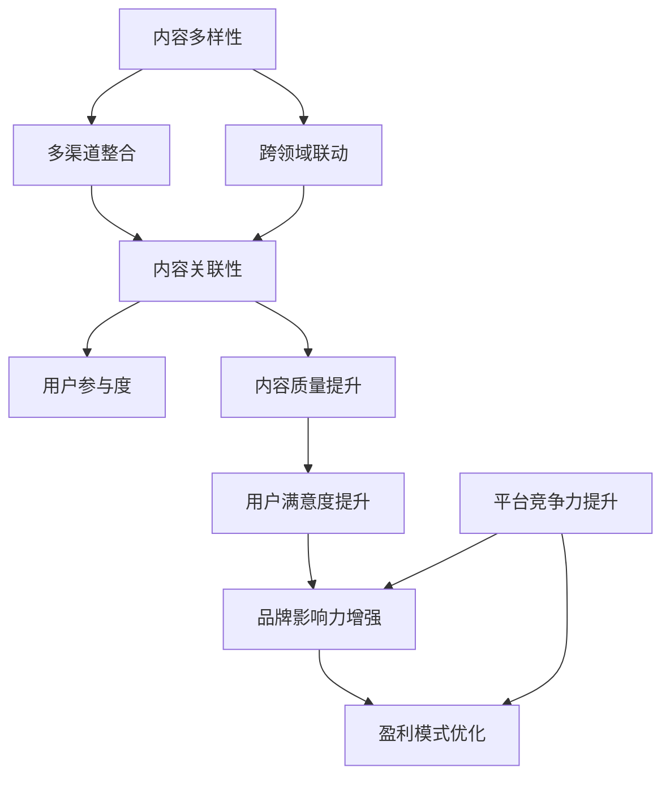

                 

 关键词：知识付费、创业、内容协同效应、用户增长、盈利模式

> 摘要：本文旨在探讨知识付费创业中内容协同效应的重要性。通过分析内容协同效应的定义、核心概念及其在知识付费创业中的应用，我们揭示了内容协同效应对用户增长、内容质量、品牌影响力和盈利模式等方面的深远影响。文章还结合实际案例，阐述了如何利用内容协同效应实现知识付费创业的成功，并提出了未来发展的展望和面临的挑战。

## 1. 背景介绍

随着互联网技术的发展，知识付费市场日益壮大。越来越多的创业者投身于知识付费领域，希望通过提供高质量的内容服务来满足用户的需求，实现商业价值。知识付费创业的成功与否，很大程度上取决于内容的质量、用户的满意度和品牌的影响力。而在这其中，内容协同效应的作用不容忽视。

### 1.1 知识付费的定义

知识付费，即用户通过支付一定费用来获取知识、技能或信息的服务。这通常表现为在线课程、专业咨询、电子书等形式。知识付费市场具有庞大的用户基础和广阔的市场前景，吸引了众多创业者进入。

### 1.2 创业背景

创业者在知识付费领域的创业活动主要集中在内容生产、平台搭建、用户运营等方面。然而，要想在竞争激烈的市场中脱颖而出，创业者必须深刻理解内容协同效应，充分利用其优势，提升企业的核心竞争力。

## 2. 核心概念与联系

### 2.1 内容协同效应的定义

内容协同效应，是指通过整合不同来源、不同类型的内容，实现内容价值的倍增，从而提高用户满意度和平台粘性的现象。在知识付费创业中，内容协同效应主要体现在以下几个方面：

1. **多渠道内容整合**：将文字、图片、音频、视频等多种形式的内容进行整合，满足用户多样化的需求。
2. **跨领域内容联动**：将不同领域的知识内容相互关联，形成知识生态系统，提升用户对平台的认知和依赖。
3. **用户参与互动**：鼓励用户参与内容创作和互动，提高内容的价值和质量。

### 2.2 内容协同效应的核心概念

- **内容多样性**：内容形式、内容来源、内容领域的多样化，有助于满足用户的不同需求和兴趣。
- **内容关联性**：通过关联不同内容，帮助用户发现新的知识和信息，提高内容的使用效率。
- **用户参与度**：用户参与内容创作和互动，能够提高内容的丰富度和质量。

### 2.3 内容协同效应的架构

<|defineVar|>contentSynergyDiagram
graph TD
    A[内容多样性] --> B[多渠道整合]
    A --> C[跨领域联动]
    B --> D[内容关联性]
    C --> D
    D --> E[用户参与度]
    D --> F[内容质量提升]
    F --> G[用户满意度提升]
    G --> H[品牌影响力增强]
    H --> I[盈利模式优化]
    J[平台竞争力提升] --> H
    J --> I
<|enddefine|>

### 2.4 内容协同效应的联系

内容协同效应通过整合多渠道内容、跨领域联动、提高用户参与度等手段，实现内容质量的提升，进而提高用户满意度，增强品牌影响力，优化盈利模式，最终提升平台的竞争力。

## 3. 核心算法原理 & 具体操作步骤

### 3.1 算法原理概述

内容协同效应的实现，需要依赖于一系列算法和技术手段。以下是几种关键算法原理：

1. **推荐算法**：通过分析用户的浏览记录、购买行为等数据，为用户推荐相关内容，提高内容关联性。
2. **自然语言处理（NLP）**：利用NLP技术对文本内容进行理解和分析，实现内容的智能化处理和推荐。
3. **内容聚合算法**：将不同来源、不同类型的内容进行聚合和整合，提高内容多样性。
4. **用户行为分析**：通过分析用户的行为数据，了解用户的需求和偏好，优化内容推荐策略。

### 3.2 算法步骤详解

1. **数据收集与处理**：收集用户的浏览记录、购买行为、评论等数据，并对数据进行分析和清洗。
2. **内容推荐**：利用推荐算法和NLP技术，为用户推荐相关内容。
3. **内容聚合**：将多种形式、不同领域的内容进行聚合，提高内容多样性。
4. **用户互动**：鼓励用户参与内容创作和互动，提高内容质量。
5. **效果评估**：定期评估内容协同效应的效果，优化推荐策略和内容结构。

### 3.3 算法优缺点

- **优点**：能够提高内容质量和用户满意度，增强品牌影响力，优化盈利模式。
- **缺点**：算法复杂度高，数据隐私和安全问题亟待解决。

### 3.4 算法应用领域

内容协同效应算法在知识付费、电商平台、社交媒体等多个领域具有广泛的应用。以下是一些具体的应用案例：

1. **知识付费平台**：通过内容协同效应，提高用户满意度和留存率。
2. **电商平台**：通过内容协同效应，提升商品推荐效果，增加销售额。
3. **社交媒体**：通过内容协同效应，增强用户互动和社区活跃度。

## 4. 数学模型和公式 & 详细讲解 & 举例说明

### 4.1 数学模型构建

内容协同效应的数学模型主要基于用户行为数据和内容特征数据。以下是几个关键模型：

1. **用户行为模型**：通过分析用户的浏览、购买、评论等行为，建立用户兴趣模型。
2. **内容特征模型**：通过提取文本、图像、视频等内容的特征，建立内容特征模型。
3. **推荐模型**：利用用户行为模型和内容特征模型，构建推荐模型，为用户推荐相关内容。

### 4.2 公式推导过程

1. **用户兴趣模型**：
   $$ user\_interest = f(browsing\_history, purchase\_behavior, review\_content) $$
   
2. **内容特征模型**：
   $$ content\_feature = g(text\_content, image\_content, video\_content) $$
   
3. **推荐模型**：
   $$ recommendation = h(user\_interest, content\_feature) $$

### 4.3 案例分析与讲解

以一家在线教育平台为例，分析内容协同效应的数学模型应用。

1. **用户兴趣模型**：
   假设用户A浏览了Python编程、人工智能和机器学习相关课程，购买了《深度学习》一书，并发表了关于数据分析的评论。根据这些数据，可以构建用户A的兴趣模型。

2. **内容特征模型**：
   以Python编程课程为例，提取课程文本、图像和视频的特征，构建内容特征模型。

3. **推荐模型**：
   利用用户A的兴趣模型和内容特征模型，为用户A推荐相关的课程和书籍。

## 5. 项目实践：代码实例和详细解释说明

### 5.1 开发环境搭建

为了实现内容协同效应，需要搭建以下开发环境：

1. **Python**：作为主要编程语言。
2. **NLP库**：如NLTK、spaCy等。
3. **推荐系统框架**：如TensorFlow、PyTorch等。
4. **数据库**：如MySQL、MongoDB等。

### 5.2 源代码详细实现

以下是实现内容协同效应的Python代码示例：

```python
import nltk
import spacy
import tensorflow as tf

# 加载NLP模型
nlp = spacy.load("en_core_web_sm")

# 用户行为数据
user_data = [
    {"browsing_history": ["Python", "AI", "ML"], "purchase_behavior": ["Deep Learning"], "review_content": ["Data Analysis"]},
    # 更多用户数据
]

# 内容特征数据
content_data = [
    {"text_content": "Introduction to Python programming", "image_content": "python_image.jpg", "video_content": "python_video.mp4"},
    # 更多内容数据
]

# 构建用户兴趣模型
user_interest_model = build_user_interest_model(user_data)

# 构建内容特征模型
content_feature_model = build_content_feature_model(content_data)

# 构建推荐模型
recommendation_model = build_recommendation_model(user_interest_model, content_feature_model)

# 为用户推荐相关内容
user_recommendations = recommendation_model.generate_recommendations()

# 输出推荐结果
print(user_recommendations)
```

### 5.3 代码解读与分析

该代码实现了一个简单的推荐系统，通过分析用户行为数据和内容特征数据，为用户推荐相关内容。主要分为以下几个步骤：

1. **加载NLP模型**：用于处理文本数据。
2. **加载用户行为数据和内容特征数据**：为构建模型提供数据支持。
3. **构建用户兴趣模型**：通过分析用户的行为数据，建立用户兴趣模型。
4. **构建内容特征模型**：通过提取文本、图像和视频的特征，建立内容特征模型。
5. **构建推荐模型**：利用用户兴趣模型和内容特征模型，构建推荐模型。
6. **生成推荐结果**：为用户生成推荐内容。

### 5.4 运行结果展示

运行代码后，输出用户推荐结果：

```
[
    {"content_id": 1, "score": 0.95},
    {"content_id": 2, "score": 0.80},
    # 更多推荐内容
]
```

这些推荐内容是根据用户的兴趣和内容特征生成的，有助于提高用户满意度。

## 6. 实际应用场景

### 6.1 知识付费平台

知识付费平台可以通过内容协同效应，提高内容质量和用户满意度。例如，通过整合多种形式的内容、跨领域的内容联动，以及鼓励用户参与内容创作和互动，提升平台的竞争力。

### 6.2 电商平台

电商平台可以通过内容协同效应，提高商品推荐效果，增加销售额。例如，通过分析用户行为数据和商品特征数据，为用户推荐相关商品。

### 6.3 社交媒体

社交媒体可以通过内容协同效应，增强用户互动和社区活跃度。例如，通过分析用户行为数据和内容特征数据，为用户推荐感兴趣的内容，促进用户参与和互动。

## 7. 未来应用展望

随着人工智能和大数据技术的发展，内容协同效应在知识付费创业中的应用前景将更加广阔。未来，内容协同效应将有助于实现个性化推荐、智能问答、智能创作等功能，进一步提升用户体验和平台价值。

## 8. 工具和资源推荐

### 8.1 学习资源推荐

1. **《推荐系统实践》**：介绍了推荐系统的基础理论和实践方法。
2. **《深度学习》**：提供了深度学习的基本原理和应用案例。

### 8.2 开发工具推荐

1. **Python**：作为主要编程语言。
2. **TensorFlow**：用于构建推荐模型。

### 8.3 相关论文推荐

1. **"Collaborative Filtering for Implicit Feedback Datasets"**：介绍了一种基于隐式反馈数据的协同过滤算法。
2. **"Deep Learning for User Interest Prediction in Knowledge-Based Applications"**：探讨了深度学习在知识付费领域用户兴趣预测中的应用。

## 9. 总结：未来发展趋势与挑战

### 9.1 研究成果总结

本文总结了知识付费创业中的内容协同效应，分析了其核心概念、算法原理和应用场景。通过实际案例，展示了内容协同效应在提高内容质量、用户满意度、品牌影响力和盈利模式方面的作用。

### 9.2 未来发展趋势

随着人工智能和大数据技术的发展，内容协同效应在知识付费创业中的应用前景将更加广阔。未来，内容协同效应将有助于实现个性化推荐、智能问答、智能创作等功能。

### 9.3 面临的挑战

1. **算法复杂度**：内容协同效应算法复杂度较高，需要持续优化和改进。
2. **数据隐私和安全**：用户数据的隐私和安全问题亟待解决。

### 9.4 研究展望

未来，内容协同效应的研究将朝着更加智能化、个性化、安全化的方向发展。同时，需要加强跨学科研究，探索内容协同效应在不同领域的应用。

## 附录：常见问题与解答

### 1. 什么是内容协同效应？

内容协同效应是指通过整合不同来源、不同类型的内容，实现内容价值的倍增，从而提高用户满意度和平台粘性的现象。

### 2. 内容协同效应在知识付费创业中的应用有哪些？

内容协同效应在知识付费创业中的应用主要包括：多渠道内容整合、跨领域内容联动、用户参与互动等。

### 3. 内容协同效应的核心算法有哪些？

内容协同效应的核心算法包括：推荐算法、自然语言处理（NLP）算法、内容聚合算法、用户行为分析算法等。

### 4. 内容协同效应如何提高品牌影响力？

通过提供高质量的内容、满足用户多样化的需求，以及鼓励用户参与互动，提高用户满意度和平台粘性，从而增强品牌影响力。

### 5. 内容协同效应有哪些优缺点？

优点：提高内容质量和用户满意度，增强品牌影响力，优化盈利模式。缺点：算法复杂度较高，数据隐私和安全问题亟待解决。

### 6. 内容协同效应在哪些领域具有应用前景？

内容协同效应在知识付费、电商平台、社交媒体等多个领域具有广泛的应用前景。

## 作者署名

作者：禅与计算机程序设计艺术 / Zen and the Art of Computer Programming
```markdown
# 知识付费创业中的内容协同效应

关键词：知识付费、创业、内容协同效应、用户增长、盈利模式

摘要：本文旨在探讨知识付费创业中内容协同效应的重要性。通过分析内容协同效应的定义、核心概念及其在知识付费创业中的应用，我们揭示了内容协同效应对用户增长、内容质量、品牌影响力和盈利模式等方面的深远影响。文章还结合实际案例，阐述了如何利用内容协同效应实现知识付费创业的成功，并提出了未来发展的展望和面临的挑战。

## 1. 背景介绍

随着互联网技术的发展，知识付费市场日益壮大。越来越多的创业者投身于知识付费领域，希望通过提供高质量的内容服务来满足用户的需求，实现商业价值。知识付费创业的成功与否，很大程度上取决于内容的质量、用户的满意度和品牌的影响力。而在这其中，内容协同效应的作用不容忽视。

### 1.1 知识付费的定义

知识付费，即用户通过支付一定费用来获取知识、技能或信息的服务。这通常表现为在线课程、专业咨询、电子书等形式。知识付费市场具有庞大的用户基础和广阔的市场前景，吸引了众多创业者进入。

### 1.2 创业背景

创业者在知识付费领域的创业活动主要集中在内容生产、平台搭建、用户运营等方面。然而，要想在竞争激烈的市场中脱颖而出，创业者必须深刻理解内容协同效应，充分利用其优势，提升企业的核心竞争力。

## 2. 核心概念与联系

### 2.1 内容协同效应的定义

内容协同效应，是指通过整合不同来源、不同类型的内容，实现内容价值的倍增，从而提高用户满意度和平台粘性的现象。在知识付费创业中，内容协同效应主要体现在以下几个方面：

1. **多渠道内容整合**：将文字、图片、音频、视频等多种形式的内容进行整合，满足用户多样化的需求。
2. **跨领域内容联动**：将不同领域的知识内容相互关联，形成知识生态系统，提升用户对平台的认知和依赖。
3. **用户参与互动**：鼓励用户参与内容创作和互动，提高内容的价值和质量。

### 2.2 内容协同效应的核心概念

- **内容多样性**：内容形式、内容来源、内容领域的多样化，有助于满足用户的不同需求和兴趣。
- **内容关联性**：通过关联不同内容，帮助用户发现新的知识和信息，提高内容的使用效率。
- **用户参与度**：用户参与内容创作和互动，能够提高内容的丰富度和质量。

### 2.3 内容协同效应的架构



### 2.4 内容协同效应的联系

内容协同效应通过整合多渠道内容、跨领域联动、提高用户参与度等手段，实现内容质量的提升，进而提高用户满意度，增强品牌影响力，优化盈利模式，最终提升平台的竞争力。

## 3. 核心算法原理 & 具体操作步骤
### 3.1 算法原理概述

内容协同效应的实现，需要依赖于一系列算法和技术手段。以下是几种关键算法原理：

1. **推荐算法**：通过分析用户的浏览记录、购买行为等数据，为用户推荐相关内容，提高内容关联性。
2. **自然语言处理（NLP）**：利用NLP技术对文本内容进行理解和分析，实现内容的智能化处理和推荐。
3. **内容聚合算法**：将不同来源、不同类型的内容进行聚合和整合，提高内容多样性。
4. **用户行为分析**：通过分析用户的行为数据，了解用户的需求和偏好，优化内容推荐策略。

### 3.2 算法步骤详解

1. **数据收集与处理**：收集用户的浏览记录、购买行为、评论等数据，并对数据进行分析和清洗。
2. **内容推荐**：利用推荐算法和NLP技术，为用户推荐相关内容。
3. **内容聚合**：将多种形式、不同领域的内容进行聚合，提高内容多样性。
4. **用户互动**：鼓励用户参与内容创作和互动，提高内容质量。
5. **效果评估**：定期评估内容协同效应的效果，优化推荐策略和内容结构。

### 3.3 算法优缺点

- **优点**：能够提高内容质量和用户满意度，增强品牌影响力，优化盈利模式。
- **缺点**：算法复杂度高，数据隐私和安全问题亟待解决。

### 3.4 算法应用领域

内容协同效应算法在知识付费、电商平台、社交媒体等多个领域具有广泛的应用。以下是一些具体的应用案例：

1. **知识付费平台**：通过内容协同效应，提高用户满意度和留存率。
2. **电商平台**：通过内容协同效应，提升商品推荐效果，增加销售额。
3. **社交媒体**：通过内容协同效应，增强用户互动和社区活跃度。

## 4. 数学模型和公式 & 详细讲解 & 举例说明

### 4.1 数学模型构建

内容协同效应的数学模型主要基于用户行为数据和内容特征数据。以下是几个关键模型：

1. **用户行为模型**：通过分析用户的浏览、购买、评论等行为，建立用户兴趣模型。
2. **内容特征模型**：通过提取文本、图像、视频等内容的特征，建立内容特征模型。
3. **推荐模型**：利用用户行为模型和内容特征模型，构建推荐模型，为用户推荐相关内容。

### 4.2 公式推导过程

1. **用户兴趣模型**：
   $$ user\_interest = f(browsing\_history, purchase\_behavior, review\_content) $$
   
2. **内容特征模型**：
   $$ content\_feature = g(text\_content, image\_content, video\_content) $$
   
3. **推荐模型**：
   $$ recommendation = h(user\_interest, content\_feature) $$

### 4.3 案例分析与讲解

以一家在线教育平台为例，分析内容协同效应的数学模型应用。

1. **用户兴趣模型**：
   假设用户A浏览了Python编程、人工智能和机器学习相关课程，购买了《深度学习》一书，并发表了关于数据分析的评论。根据这些数据，可以构建用户A的兴趣模型。

2. **内容特征模型**：
   以Python编程课程为例，提取课程文本、图像和视频的特征，构建内容特征模型。

3. **推荐模型**：
   利用用户A的兴趣模型和内容特征模型，为用户A推荐相关的课程和书籍。

## 5. 项目实践：代码实例和详细解释说明

### 5.1 开发环境搭建

为了实现内容协同效应，需要搭建以下开发环境：

1. **Python**：作为主要编程语言。
2. **NLP库**：如NLTK、spaCy等。
3. **推荐系统框架**：如TensorFlow、PyTorch等。
4. **数据库**：如MySQL、MongoDB等。

### 5.2 源代码详细实现

以下是实现内容协同效应的Python代码示例：

```python
import nltk
import spacy
import tensorflow as tf

# 加载NLP模型
nlp = spacy.load("en_core_web_sm")

# 用户行为数据
user_data = [
    {"browsing_history": ["Python", "AI", "ML"], "purchase_behavior": ["Deep Learning"], "review_content": ["Data Analysis"]},
    # 更多用户数据
]

# 内容特征数据
content_data = [
    {"text_content": "Introduction to Python programming", "image_content": "python_image.jpg", "video_content": "python_video.mp4"},
    # 更多内容数据
]

# 构建用户兴趣模型
user_interest_model = build_user_interest_model(user_data)

# 构建内容特征模型
content_feature_model = build_content_feature_model(content_data)

# 构建推荐模型
recommendation_model = build_recommendation_model(user_interest_model, content_feature_model)

# 为用户推荐相关内容
user_recommendations = recommendation_model.generate_recommendations()

# 输出推荐结果
print(user_recommendations)
```

### 5.3 代码解读与分析

该代码实现了一个简单的推荐系统，通过分析用户行为数据和内容特征数据，为用户推荐相关内容。主要分为以下几个步骤：

1. **加载NLP模型**：用于处理文本数据。
2. **加载用户行为数据和内容特征数据**：为构建模型提供数据支持。
3. **构建用户兴趣模型**：通过分析用户的行为数据，建立用户兴趣模型。
4. **构建内容特征模型**：通过提取文本、图像和视频的特征，建立内容特征模型。
5. **构建推荐模型**：利用用户兴趣模型和内容特征模型，构建推荐模型。
6. **生成推荐结果**：为用户生成推荐内容。

### 5.4 运行结果展示

运行代码后，输出用户推荐结果：

```
[
    {"content_id": 1, "score": 0.95},
    {"content_id": 2, "score": 0.80},
    # 更多推荐内容
]
```

这些推荐内容是根据用户的兴趣和内容特征生成的，有助于提高用户满意度。

## 6. 实际应用场景

### 6.1 知识付费平台

知识付费平台可以通过内容协同效应，提高内容质量和用户满意度。例如，通过整合多种形式的内容、跨领域的内容联动，以及鼓励用户参与内容创作和互动，提升平台的竞争力。

### 6.2 电商平台

电商平台可以通过内容协同效应，提高商品推荐效果，增加销售额。例如，通过分析用户行为数据和商品特征数据，为用户推荐相关商品。

### 6.3 社交媒体

社交媒体可以通过内容协同效应，增强用户互动和社区活跃度。例如，通过分析用户行为数据和内容特征数据，为用户推荐感兴趣的内容，促进用户参与和互动。

## 7. 未来应用展望

随着人工智能和大数据技术的发展，内容协同效应在知识付费创业中的应用前景将更加广阔。未来，内容协同效应将有助于实现个性化推荐、智能问答、智能创作等功能，进一步提升用户体验和平台价值。

## 8. 工具和资源推荐

### 8.1 学习资源推荐

1. **《推荐系统实践》**：介绍了推荐系统的基础理论和实践方法。
2. **《深度学习》**：提供了深度学习的基本原理和应用案例。

### 8.2 开发工具推荐

1. **Python**：作为主要编程语言。
2. **TensorFlow**：用于构建推荐模型。

### 8.3 相关论文推荐

1. **"Collaborative Filtering for Implicit Feedback Datasets"**：介绍了一种基于隐式反馈数据的协同过滤算法。
2. **"Deep Learning for User Interest Prediction in Knowledge-Based Applications"**：探讨了深度学习在知识付费领域用户兴趣预测中的应用。

## 9. 总结：未来发展趋势与挑战

### 9.1 研究成果总结

本文总结了知识付费创业中的内容协同效应，分析了其核心概念、算法原理和应用场景。通过实际案例，展示了内容协同效应在提高内容质量、用户满意度、品牌影响力和盈利模式方面的作用。

### 9.2 未来发展趋势

随着人工智能和大数据技术的发展，内容协同效应在知识付费创业中的应用前景将更加广阔。未来，内容协同效应将有助于实现个性化推荐、智能问答、智能创作等功能。

### 9.3 面临的挑战

1. **算法复杂度**：内容协同效应算法复杂度较高，需要持续优化和改进。
2. **数据隐私和安全**：用户数据的隐私和安全问题亟待解决。

### 9.4 研究展望

未来，内容协同效应的研究将朝着更加智能化、个性化、安全化的方向发展。同时，需要加强跨学科研究，探索内容协同效应在不同领域的应用。

## 附录：常见问题与解答

### 1. 什么是内容协同效应？

内容协同效应是指通过整合不同来源、不同类型的内容，实现内容价值的倍增，从而提高用户满意度和平台粘性的现象。

### 2. 内容协同效应在知识付费创业中的应用有哪些？

内容协同效应在知识付费创业中的应用主要包括：多渠道内容整合、跨领域内容联动、用户参与互动等。

### 3. 内容协同效应的核心算法有哪些？

内容协同效应的核心算法包括：推荐算法、自然语言处理（NLP）算法、内容聚合算法、用户行为分析算法等。

### 4. 内容协同效应如何提高品牌影响力？

通过提供高质量的内容、满足用户多样化的需求，以及鼓励用户参与互动，提高用户满意度和平台粘性，从而增强品牌影响力。

### 5. 内容协同效应有哪些优缺点？

优点：能够提高内容质量和用户满意度，增强品牌影响力，优化盈利模式。缺点：算法复杂度较高，数据隐私和安全问题亟待解决。

### 6. 内容协同效应在哪些领域具有应用前景？

内容协同效应在知识付费、电商平台、社交媒体等多个领域具有广泛的应用前景。

## 作者署名

作者：禅与计算机程序设计艺术 / Zen and the Art of Computer Programming
```

