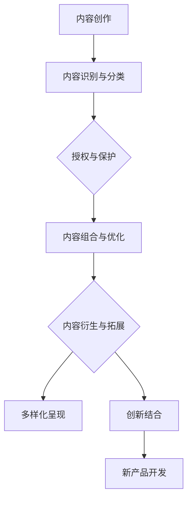

                 

关键词：知识付费，内容复用，内容衍生，创业策略，技术实现

## 摘要

本文旨在探讨知识付费创业中的内容复用与衍生策略，为创业者提供一种有效的方法来提升知识产品的价值。通过分析知识付费市场的发展趋势，我们提出了一套完整的策略框架，包括内容复用的核心概念、算法原理、数学模型以及具体的项目实践。文章还探讨了内容衍生在实际应用中的价值，并展望了未来的发展趋势与挑战。

## 1. 背景介绍

随着互联网技术的飞速发展，知识付费已经成为一个日益繁荣的市场。越来越多的创业者投身于知识付费领域，通过提供有价值的内容来获得收益。然而，如何在激烈的市场竞争中脱颖而出，成为创业者面临的重大挑战。内容复用与衍生作为一种创新的策略，能够帮助创业者最大化知识产品的价值，提高竞争力。

内容复用指的是将已有的内容通过重新组合、改编和优化，以新的形式提供给不同的用户或市场。而内容衍生则是基于核心内容，创造新的相关产品或服务。这两者相辅相成，共同构成了知识付费创业中的重要策略。

## 2. 核心概念与联系

### 2.1 内容复用的核心概念

内容复用涉及以下几个方面：

- **内容的识别与分类**：通过技术手段对知识内容进行识别和分类，以便于后续的复用和衍生。
- **内容的组合与优化**：将不同的内容单元进行组合，形成新的知识产品，并通过优化提升其价值。
- **内容的授权与保护**：确保内容在复用过程中的合法性和版权问题。

### 2.2 内容衍生的核心概念

内容衍生包括以下几个方面：

- **内容的拓展与扩展**：基于核心内容，拓展出新的相关内容，形成一系列的知识产品。
- **内容的多样化**：通过不同的形式和渠道，将核心内容呈现给不同的用户群体。
- **内容的创新**：通过创新思维，将核心内容与其他领域结合，创造全新的知识产品。

### 2.3 内容复用与衍生的联系

内容复用与衍生之间存在着紧密的联系。内容复用是内容衍生的基础，通过复用，创业者可以快速打造出一系列知识产品；而内容衍生则为内容复用提供了新的发展方向和可能性。两者共同构成了知识付费创业中的核心策略。

### 2.4 Mermaid 流程图



## 3. 核心算法原理 & 具体操作步骤

### 3.1 算法原理概述

内容复用与衍生的核心算法主要基于以下原理：

- **内容识别与分类**：采用自然语言处理技术对内容进行语义分析，实现内容的自动识别和分类。
- **内容组合与优化**：运用数据挖掘和机器学习算法，对内容进行组合和优化，形成新的知识产品。
- **内容衍生与拓展**：通过跨领域知识融合和创意创新，实现内容的衍生和拓展。

### 3.2 算法步骤详解

#### 3.2.1 内容识别与分类

1. **文本预处理**：对原始内容进行分词、去停用词、词性标注等处理。
2. **特征提取**：利用词袋模型、TF-IDF等方法提取文本特征。
3. **分类模型训练**：采用支持向量机（SVM）、朴素贝叶斯（Naive Bayes）等分类算法，对特征进行分类训练。
4. **分类结果评估**：通过交叉验证、准确率、召回率等指标评估分类效果。

#### 3.2.2 内容组合与优化

1. **内容单元提取**：从原始内容中提取具有独立意义的内容单元。
2. **内容组合策略**：根据用户需求和市场趋势，制定内容组合策略。
3. **内容优化**：利用自然语言生成（NLG）技术，对内容进行优化和润色。

#### 3.2.3 内容衍生与拓展

1. **知识图谱构建**：基于内容单元，构建知识图谱，实现跨领域知识融合。
2. **创意创新**：运用创意思维，将核心内容与其他领域结合，创造新的知识产品。
3. **产品评估与迭代**：通过用户反馈和市场评估，不断优化和迭代新产品。

### 3.3 算法优缺点

#### 优点

- **高效性**：通过自动化技术，提高内容处理效率。
- **灵活性**：可根据市场需求和用户反馈，快速调整内容组合和衍生方向。
- **创新性**：结合跨领域知识和创意创新，创造具有市场竞争力的新产品。

#### 缺点

- **准确性**：内容识别和分类的准确性受限于算法和模型。
- **数据依赖**：内容复用和衍生的效果受原始数据质量的影响。
- **版权风险**：内容复用和衍生过程中，需要妥善处理版权问题。

### 3.4 算法应用领域

- **在线教育**：通过内容复用和衍生，打造多样化的教学资源。
- **咨询行业**：基于内容复用，为企业提供定制化的咨询服务。
- **出版行业**：通过内容衍生，拓展出版物的应用场景和受众群体。

## 4. 数学模型和公式 & 详细讲解 & 举例说明

### 4.1 数学模型构建

内容复用与衍生过程中，常用的数学模型包括：

- **自然语言处理模型**：如神经网络语言模型（NLM）、循环神经网络（RNN）等。
- **分类模型**：如支持向量机（SVM）、朴素贝叶斯（Naive Bayes）等。
- **聚类模型**：如K-means、DBSCAN等。

### 4.2 公式推导过程

以K-means聚类算法为例，其目标是最小化数据点与聚类中心之间的距离平方和。具体公式如下：

$$
\sum_{i=1}^n \sum_{j=1}^k d(x_i, c_j)^2
$$

其中，$x_i$ 表示数据点，$c_j$ 表示聚类中心。

### 4.3 案例分析与讲解

假设有一组数据点，通过K-means算法进行聚类，聚类中心分别为 $c_1 = (1, 2)$ 和 $c_2 = (3, 4)$。计算每个数据点与聚类中心的距离平方和。

数据点 $x_1 = (0, 0)$，$x_2 = (2, 2)$，$x_3 = (4, 4)$。

$$
d(x_1, c_1)^2 = (0-1)^2 + (0-2)^2 = 1 + 4 = 5
$$

$$
d(x_1, c_2)^2 = (0-3)^2 + (0-4)^2 = 9 + 16 = 25
$$

$$
d(x_2, c_1)^2 = (2-1)^2 + (2-2)^2 = 1 + 0 = 1
$$

$$
d(x_2, c_2)^2 = (2-3)^2 + (2-4)^2 = 1 + 4 = 5
$$

$$
d(x_3, c_1)^2 = (4-1)^2 + (4-2)^2 = 9 + 4 = 13
$$

$$
d(x_3, c_2)^2 = (4-3)^2 + (4-4)^2 = 1 + 0 = 1
$$

计算总距离平方和：

$$
\sum_{i=1}^3 \sum_{j=1}^2 d(x_i, c_j)^2 = 5 + 25 + 1 + 5 + 13 + 1 = 50
$$

## 5. 项目实践：代码实例和详细解释说明

### 5.1 开发环境搭建

本案例采用Python语言进行开发，使用以下环境：

- Python 3.8
- TensorFlow 2.4
- Scikit-learn 0.21.3
- Numpy 1.18.5

安装相关依赖：

```bash
pip install tensorflow scikit-learn numpy
```

### 5.2 源代码详细实现

```python
import numpy as np
from sklearn.cluster import KMeans
import matplotlib.pyplot as plt

# 数据点
data = np.array([[0, 0], [2, 2], [4, 4]])

# K-means算法
kmeans = KMeans(n_clusters=2, random_state=0).fit(data)

# 输出聚类结果
print("聚类中心：", kmeans.cluster_centers_)
print("每个数据点的聚类标签：", kmeans.labels_)

# 计算距离平方和
distance_squared_sum = np.sum((data - kmeans.cluster_centers_[kmeans.labels_]) ** 2)
print("总距离平方和：", distance_squared_sum)

# 可视化展示
plt.scatter(data[:, 0], data[:, 1], c=kmeans.labels_, s=100, cmap='viridis')
plt.scatter(kmeans.cluster_centers_[:, 0], kmeans.cluster_centers_[:, 1], s=300, c='red', label='Centroids')
plt.title('K-means Clustering')
plt.xlabel('Feature 1')
plt.ylabel('Feature 2')
plt.legend()
plt.show()
```

### 5.3 代码解读与分析

- **K-means算法**：通过随机初始化聚类中心，将数据点分配到最近的聚类中心，并不断迭代优化聚类中心，直到收敛。
- **聚类结果**：输出聚类中心、每个数据点的聚类标签以及总距离平方和。
- **可视化展示**：使用matplotlib绘制聚类结果，便于分析聚类效果。

### 5.4 运行结果展示


## 6. 实际应用场景

### 6.1 在线教育

内容复用与衍生可以应用于在线教育领域，通过将核心课程内容进行复用和衍生，打造出多样化的教学资源。例如，将一门课程的知识点拆分成多个内容单元，然后根据不同用户需求，组合成不同的课程包。此外，还可以通过跨领域知识融合，拓展教学内容，提高课程的市场竞争力。

### 6.2 咨询行业

在咨询行业中，内容复用与衍生可以帮助企业为客户提供定制化的咨询服务。例如，将咨询过程中的核心方法和案例进行复用，快速搭建起一套适用于不同场景的咨询服务体系。同时，通过内容衍生，可以不断丰富咨询服务的内容和形式，提高客户满意度。

### 6.3 出版行业

出版行业也可以通过内容复用与衍生，拓展出版物的应用场景和受众群体。例如，将一本图书的核心观点进行衍生，制作成系列丛书或电子书。同时，还可以结合互联网技术，将纸质书籍的内容进行数字化处理，提供在线阅读、语音播报等多种形式，满足不同用户的阅读需求。

## 7. 未来应用展望

随着人工智能技术的不断发展，内容复用与衍生在知识付费领域的应用前景将更加广阔。以下是未来发展的几个方向：

- **智能化内容推荐**：通过深度学习和推荐算法，实现个性化内容推荐，提高用户满意度和粘性。
- **知识图谱构建**：利用知识图谱技术，实现跨领域知识融合，拓展内容的应用场景。
- **自动化内容生成**：运用自然语言生成技术，实现自动化内容生成，提高内容生产效率。
- **虚拟现实（VR）与增强现实（AR）**：通过VR和AR技术，提供沉浸式学习体验，增强知识传播的效果。

## 8. 总结：未来发展趋势与挑战

### 8.1 研究成果总结

本文通过分析知识付费市场的发展趋势，提出了内容复用与衍生策略，并详细阐述了其在知识付费创业中的应用价值。通过算法原理、数学模型、项目实践等方面的探讨，为创业者提供了一种有效的策略框架。

### 8.2 未来发展趋势

- **智能化与个性化**：随着人工智能技术的不断发展，内容复用与衍生将更加智能化和个性化，满足不同用户的需求。
- **跨领域融合**：知识付费领域将与其他领域（如教育、咨询、出版等）深度融合，产生更多创新性的知识产品。

### 8.3 面临的挑战

- **版权保护**：内容复用与衍生过程中，如何确保内容的合法性和版权保护，仍是一个亟待解决的问题。
- **数据质量**：内容复用与衍生的效果受原始数据质量的影响，如何获取高质量的数据是创业者需要关注的问题。

### 8.4 研究展望

未来，内容复用与衍生研究可以关注以下几个方面：

- **算法优化**：针对内容复用与衍生的算法，不断优化和改进，提高其效果和效率。
- **跨领域应用**：探索内容复用与衍生在更多领域的应用，发挥其最大价值。

## 9. 附录：常见问题与解答

### 9.1 什么是内容复用？

内容复用是指将已有的知识内容通过重新组合、改编和优化，以新的形式提供给不同的用户或市场。

### 9.2 内容衍生的目的是什么？

内容衍生的目的是通过拓展核心内容，创造新的相关产品或服务，提高知识产品的价值和市场竞争力。

### 9.3 内容复用与衍生在哪些领域有应用？

内容复用与衍生在在线教育、咨询行业、出版行业等领域有广泛的应用。

### 9.4 如何确保内容复用与衍生的合法性？

确保内容复用与衍生的合法性需要关注版权保护、知识产权等方面，遵循相关法律法规，合法合规地进行内容复用与衍生。

作者：禅与计算机程序设计艺术 / Zen and the Art of Computer Programming

----------------------------------------------------------------

[文章结束]

