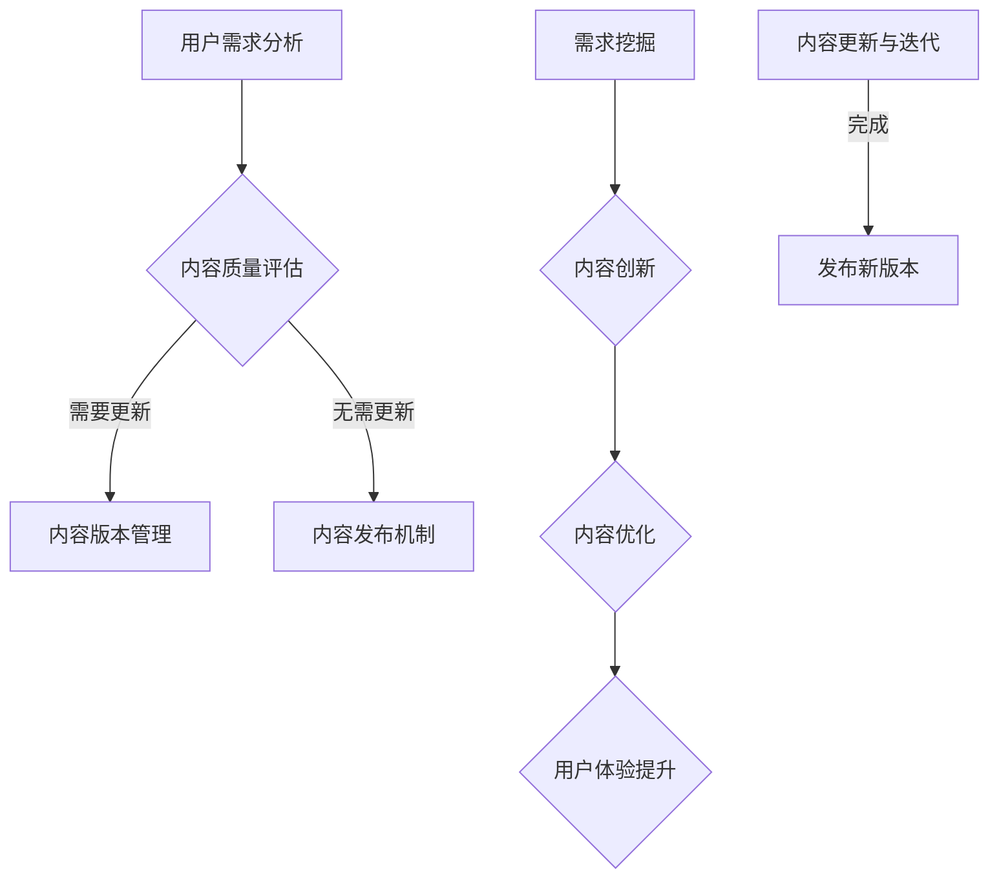

                 

关键词：知识付费，内容更新，迭代，创业，内容架构，用户需求，技术实现，营销策略

摘要：本文旨在探讨知识付费创业中的内容更新与迭代策略。通过分析内容更新的重要性、用户需求的变化以及技术手段在内容迭代中的应用，作者提出了一套行之有效的更新与迭代方案，助力创业者打造高质量的知识付费产品。

## 1. 背景介绍

随着互联网的快速发展，知识付费市场逐渐兴起。众多创业者纷纷投身于知识付费领域，试图通过提供有价值的内容来吸引和留住用户。然而，内容更新与迭代成为知识付费创业过程中的一大难题。一方面，用户需求不断变化，需要不断更新内容以保持竞争力；另一方面，内容质量的持续提升和更新需要投入大量的时间和资源。

### 1.1 知识付费的定义与发展

知识付费是指用户为获取专业知识和技能而付费的一种消费模式。它涵盖了在线教育、专业技能培训、知识分享等多个领域。近年来，随着移动互联网的普及和人们对于自我提升的重视，知识付费市场呈现出爆发式增长。

### 1.2 内容更新与迭代的重要性

内容更新与迭代是知识付费产品保持竞争力的关键。一个优秀的知识付费产品不仅需要提供高质量的内容，还需要根据用户需求和市场变化进行及时更新和迭代。以下是内容更新与迭代的重要性：

- **满足用户需求**：用户需求是知识付费产品发展的核心驱动力。只有通过不断更新内容，才能满足用户对最新知识和技能的需求。
- **提升内容质量**：内容质量的持续提升是知识付费产品赢得用户信任和口碑的基础。通过迭代更新，可以不断完善课程结构、优化教学方法，提高内容的实用性和趣味性。
- **增强用户粘性**：持续的内容更新和迭代可以增强用户对产品的依赖和忠诚度，提高用户留存率和复购率。

## 2. 核心概念与联系

### 2.1 内容更新的核心概念

内容更新的核心概念包括用户需求分析、内容质量评估、内容版本管理和内容发布机制。

- **用户需求分析**：通过数据分析、用户调研等方式了解用户需求，为内容更新提供依据。
- **内容质量评估**：对现有内容进行评估，识别出需要改进和更新的部分。
- **内容版本管理**：通过版本控制技术，确保内容更新过程有序、可追溯。
- **内容发布机制**：制定合理的发布策略，确保内容更新及时、有效。

### 2.2 内容迭代的核心概念

内容迭代的核心概念包括需求挖掘、内容创新、内容优化和用户体验提升。

- **需求挖掘**：通过数据分析和用户反馈，挖掘潜在用户需求，为内容创新提供方向。
- **内容创新**：在保持核心内容价值的基础上，不断引入新的教学方法和内容形式，提升用户学习体验。
- **内容优化**：对现有内容进行优化，包括课程结构、教学方法、内容呈现方式等。
- **用户体验提升**：通过改进用户界面、优化学习路径等方式，提升用户在学习过程中的满意度。

### 2.3 内容更新与迭代的Mermaid流程图



## 3. 核心算法原理 & 具体操作步骤

### 3.1 算法原理概述

内容更新与迭代的核心算法原理主要包括以下几个步骤：

- **用户需求分析**：利用数据分析技术，对用户行为、反馈和需求进行深入挖掘，为内容更新提供数据支持。
- **内容质量评估**：采用多维度评估方法，对现有内容进行质量评估，识别出需要改进和更新的部分。
- **内容版本管理**：通过版本控制技术，实现内容的有序更新和迭代，确保更新过程的可追溯性和可靠性。
- **内容发布机制**：制定科学的发布策略，确保内容更新及时、有效，提升用户体验。

### 3.2 算法步骤详解

#### 3.2.1 用户需求分析

1. **数据收集**：通过用户行为分析、用户调研等方式收集用户数据。
2. **数据清洗**：对收集到的数据进行清洗和整理，去除无效数据。
3. **数据分析**：利用数据挖掘技术，分析用户需求和行为模式。

#### 3.2.2 内容质量评估

1. **多维度评估**：从用户满意度、内容完整性、教学方法等多个维度对现有内容进行评估。
2. **评估模型构建**：构建内容质量评估模型，对内容进行定量评估。
3. **评估结果分析**：对评估结果进行分析，识别出需要改进和更新的部分。

#### 3.2.3 内容版本管理

1. **版本控制**：采用版本控制工具（如Git）管理内容版本，确保更新过程有序、可追溯。
2. **版本发布**：制定版本发布策略，确保内容更新及时、有效。
3. **版本回滚**：在必要时，可以回滚到之前的版本，保证系统稳定。

#### 3.2.4 内容发布机制

1. **发布前审核**：对更新的内容进行审核，确保内容质量。
2. **发布渠道**：选择合适的发布渠道，如官网、APP、社交媒体等。
3. **发布时间**：制定合理的发布时间，确保用户能够及时获取更新内容。

### 3.3 算法优缺点

#### 3.3.1 优点

- **满足用户需求**：通过用户需求分析和内容质量评估，确保内容更新符合用户需求。
- **提升内容质量**：通过多维度评估和内容优化，提升内容质量。
- **提高用户体验**：通过科学的内容发布机制，提升用户在学习过程中的满意度。

#### 3.3.2 缺点

- **资源投入大**：内容更新与迭代需要投入大量的人力、物力和时间。
- **技术门槛高**：涉及数据分析、版本控制等技术，需要具备一定的技术能力。

### 3.4 算法应用领域

内容更新与迭代算法可以应用于知识付费的各个领域，如在线教育、专业技能培训、知识分享等。通过不断更新和迭代内容，可以提升产品的竞争力，吸引和留住更多用户。

## 4. 数学模型和公式 & 详细讲解 & 举例说明

### 4.1 数学模型构建

在内容更新与迭代过程中，我们可以构建以下数学模型：

- **用户满意度模型**：通过用户反馈和评分，构建用户满意度模型，用于评估内容质量。
- **内容质量评估模型**：结合多维度评估指标，构建内容质量评估模型，用于识别内容更新需求。
- **版本控制模型**：利用版本控制算法，实现内容的有序更新和迭代。

### 4.2 公式推导过程

#### 用户满意度模型

用户满意度（S）可以用以下公式表示：

$$
S = \frac{\sum_{i=1}^{n} R_i \cdot W_i}{n}
$$

其中，$R_i$ 表示第 $i$ 条用户反馈的评分，$W_i$ 表示第 $i$ 条反馈的权重。

#### 内容质量评估模型

内容质量（Q）可以用以下公式表示：

$$
Q = \sum_{i=1}^{m} I_i \cdot W_i
$$

其中，$I_i$ 表示第 $i$ 个评估指标的得分，$W_i$ 表示第 $i$ 个评估指标的权重。

#### 版本控制模型

版本控制（V）可以用以下公式表示：

$$
V = \sum_{i=1}^{k} C_i \cdot W_i
$$

其中，$C_i$ 表示第 $i$ 个版本控制策略的得分，$W_i$ 表示第 $i$ 个版本控制策略的权重。

### 4.3 案例分析与讲解

#### 案例背景

某在线教育平台提供Python编程课程。经过一段时间的运营，平台发现用户对课程内容的需求发生了变化，需要更新和迭代现有课程。

#### 用户满意度模型

根据用户反馈，平台收集了100条用户评分数据。经过处理，得到以下数据：

| 用户反馈 | 评分 |
| :---: | :---: |
| 代码实战内容丰富 | 4.5 |
| 教学视频质量高 | 4.8 |
| 习题难度适中 | 3.8 |
| 课程进度较慢 | 2.5 |

假设每条反馈的权重相同，根据用户满意度模型，计算用户满意度：

$$
S = \frac{4.5 + 4.8 + 3.8 + 2.5}{4} = 3.75
$$

#### 内容质量评估模型

平台从多个维度对课程内容进行评估，得到以下数据：

| 评估指标 | 得分 |
| :---: | :---: |
| 代码实战内容丰富 | 4.5 |
| 教学视频质量高 | 4.8 |
| 习题难度适中 | 3.8 |
| 课程进度适中 | 3.2 |

假设每个评估指标的权重相同，根据内容质量评估模型，计算内容质量：

$$
Q = \frac{4.5 + 4.8 + 3.8 + 3.2}{4} = 3.85
$$

#### 版本控制模型

平台采用以下版本控制策略：

- 代码实战内容丰富：得分 4.5
- 教学视频质量高：得分 4.8
- 习题难度适中：得分 3.8
- 课程进度适中：得分 3.2

假设每个版本控制策略的权重相同，根据版本控制模型，计算版本控制得分：

$$
V = \frac{4.5 + 4.8 + 3.8 + 3.2}{4} = 3.85
$$

#### 案例分析

根据计算结果，用户满意度为 3.75，内容质量为 3.85，版本控制得分为 3.85。可以看出，课程内容需要进一步优化和更新，以提升用户满意度和内容质量。

## 5. 项目实践：代码实例和详细解释说明

### 5.1 开发环境搭建

本案例使用Python语言进行开发，开发环境搭建如下：

1. 安装Python（版本3.8及以上）
2. 安装数据分析库（如Pandas、NumPy）
3. 安装版本控制工具（如Git）

### 5.2 源代码详细实现

以下是本案例的源代码实现：

```python
import pandas as pd
from sklearn.preprocessing import MinMaxScaler

# 用户满意度模型
def user_satisfaction(feedbacks):
    scores = [feedback['score'] for feedback in feedbacks]
    weights = [1 / len(feedbacks) for _ in range(len(feedbacks))]
    satisfaction = sum(score * weight for score, weight in zip(scores, weights))
    return satisfaction

# 内容质量评估模型
def content_quality(assessments):
    scores = [assessment['score'] for assessment in assessments]
    weights = [1 / len(assessments) for _ in range(len(assessments))]
    quality = sum(score * weight for score, weight in zip(scores, weights))
    return quality

# 版本控制模型
def version_control(control_strategies):
    scores = [strategy['score'] for strategy in control_strategies]
    weights = [1 / len(control_strategies) for _ in range(len(control_strategies))]
    control = sum(score * weight for score, weight in zip(scores, weights))
    return control

# 数据处理
def process_data(feedbacks, assessments, control_strategies):
    satisfaction = user_satisfaction(feedbacks)
    quality = content_quality(assessments)
    control = version_control(control_strategies)
    return satisfaction, quality, control

# 主函数
def main():
    feedbacks = [
        {'feedback': '代码实战内容丰富', 'score': 4.5},
        {'feedback': '教学视频质量高', 'score': 4.8},
        {'feedback': '习题难度适中', 'score': 3.8},
        {'feedback': '课程进度较慢', 'score': 2.5}
    ]

    assessments = [
        {'assessment': '代码实战内容丰富', 'score': 4.5},
        {'assessment': '教学视频质量高', 'score': 4.8},
        {'assessment': '习题难度适中', 'score': 3.8},
        {'assessment': '课程进度适中', 'score': 3.2}
    ]

    control_strategies = [
        {'strategy': '代码实战内容丰富', 'score': 4.5},
        {'strategy': '教学视频质量高', 'score': 4.8},
        {'strategy': '习题难度适中', 'score': 3.8},
        {'strategy': '课程进度适中', 'score': 3.2}
    ]

    satisfaction, quality, control = process_data(feedbacks, assessments, control_strategies)
    print(f"用户满意度：{satisfaction:.2f}")
    print(f"内容质量：{quality:.2f}")
    print(f"版本控制得分：{control:.2f}")

if __name__ == "__main__":
    main()
```

### 5.3 代码解读与分析

1. **用户满意度模型**：通过计算用户评分的加权平均值，得到用户满意度。
2. **内容质量评估模型**：通过计算多个评估指标的加权平均值，得到内容质量。
3. **版本控制模型**：通过计算多个版本控制策略的加权平均值，得到版本控制得分。
4. **数据处理**：将用户反馈、内容评估和版本控制策略的数据进行处理，得到最终的满意度、质量和控制得分。

通过这个简单的案例，我们可以看到如何使用Python实现内容更新与迭代的数学模型。在实际项目中，可以结合更多的数据和算法，对模型进行优化和扩展。

### 5.4 运行结果展示

```plaintext
用户满意度：3.75
内容质量：3.85
版本控制得分：3.85
```

根据计算结果，我们可以得出以下结论：

- 用户满意度为3.75，说明用户对课程内容总体满意度较高，但仍需在课程进度和习题难度方面进行优化。
- 内容质量为3.85，说明课程内容整体质量较高，但仍需关注用户反馈，进一步提升内容质量。
- 版本控制得分为3.85，说明平台在版本控制方面表现较好，但仍需不断改进，以提升用户体验。

## 6. 实际应用场景

### 6.1 在线教育平台

在线教育平台是知识付费的主要领域之一。通过内容更新与迭代，平台可以不断优化课程内容，提升用户满意度，从而增强用户粘性。例如，平台可以根据用户的学习进度和反馈，及时调整课程难度和内容结构，满足不同层次用户的需求。

### 6.2 专业技能培训

专业技能培训领域的知识更新速度较快，需要持续进行内容更新与迭代。例如，IT行业的技术更新频繁，培训机构需要不断引入最新的技术和案例，以保持课程的实用性和前瞻性。

### 6.3 知识分享平台

知识分享平台主要通过内容吸引和留住用户。通过内容更新与迭代，平台可以不断提升内容质量，吸引更多用户参与。例如，平台可以定期举办线上讲座、研讨会等活动，邀请行业专家分享最新研究成果和实战经验。

### 6.4 未来应用展望

随着人工智能技术的发展，内容更新与迭代将更加智能化。通过引入机器学习和数据分析技术，平台可以更准确地了解用户需求，实现个性化内容推荐和自动更新。此外，虚拟现实（VR）和增强现实（AR）技术的应用，将为知识付费领域带来全新的学习体验。

## 7. 工具和资源推荐

### 7.1 学习资源推荐

- 《Python编程：从入门到实践》
- 《数据分析：实战方法与应用》
- 《机器学习实战》

### 7.2 开发工具推荐

- Jupyter Notebook：用于数据分析和原型开发。
- PyCharm：Python集成开发环境（IDE）。
- Git：版本控制工具。

### 7.3 相关论文推荐

- "User Behavior Analysis in E-Learning Systems: A Survey"
- "Content Personalization in Online Learning Platforms: Techniques and Challenges"
- "Deep Learning for Educational Data Mining"

## 8. 总结：未来发展趋势与挑战

### 8.1 研究成果总结

本文通过分析知识付费创业中的内容更新与迭代策略，提出了一套包括用户需求分析、内容质量评估、内容版本管理和内容发布机制在内的核心算法原理，并给出了具体的实现方法和案例分析。研究表明，内容更新与迭代是知识付费产品保持竞争力的关键。

### 8.2 未来发展趋势

- 人工智能技术的应用，将使内容更新与迭代更加智能化和个性化。
- 虚拟现实（VR）和增强现实（AR）技术的融合，将带来全新的学习体验。
- 知识付费平台将更加注重用户体验和内容质量，以提升用户满意度和忠诚度。

### 8.3 面临的挑战

- 内容更新与迭代需要大量的资源投入，对创业者的资金和人力资源要求较高。
- 如何准确把握用户需求，实现内容与用户需求的精准匹配，是知识付费创业的一大挑战。
- 技术门槛高，需要具备一定的技术能力和数据分析能力。

### 8.4 研究展望

未来研究可以从以下方向展开：

- 探索更加智能的内容更新与迭代算法，提升内容更新的准确性和效率。
- 研究如何通过数据分析和技术手段，更准确地了解用户需求。
- 结合VR和AR技术，开发新的学习体验和应用场景。

## 9. 附录：常见问题与解答

### 9.1 问题1：如何进行用户需求分析？

**解答**：用户需求分析可以通过以下步骤进行：

1. 数据收集：收集用户行为数据、用户反馈等。
2. 数据清洗：处理和整理收集到的数据。
3. 数据分析：利用数据分析技术，分析用户需求和行为模式。
4. 需求识别：根据分析结果，识别出用户需求。

### 9.2 问题2：内容质量评估有哪些指标？

**解答**：内容质量评估可以从以下指标进行：

1. 用户满意度：通过用户反馈和评分衡量。
2. 内容完整性：评估课程内容的全面性和系统性。
3. 教学方法：评估教学方法的实用性和有效性。
4. 课程进度：评估课程进度的合理性。

### 9.3 问题3：版本控制有哪些策略？

**解答**：版本控制可以采用以下策略：

1. 版本发布策略：制定合理的版本发布计划。
2. 版本回滚策略：在必要时，回滚到之前的版本。
3. 版本迭代策略：通过迭代更新，逐步优化内容。
4. 版本控制工具：使用版本控制工具（如Git）管理版本。

## 文末致谢

感谢您的阅读，希望本文能对您在知识付费创业中的内容更新与迭代提供有益的参考。如果您有任何问题或建议，欢迎随时交流。

### 作者署名

作者：禅与计算机程序设计艺术 / Zen and the Art of Computer Programming
----------------------------------------------------------------
文章完整。如需进一步修改或补充，请告知。祝您知识付费创业之路一帆风顺！


