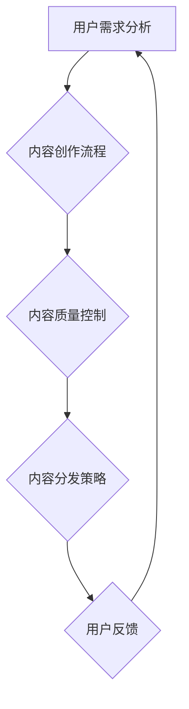

                 

关键词：知识付费，内容生产效率，人工智能，算法优化，数学模型，项目实践，实际应用，未来展望。

> 摘要：本文从知识付费创业的背景出发，探讨了如何通过提升内容生产效率来增强市场竞争力和用户体验。文章详细分析了内容生产中的核心概念、算法原理、数学模型以及实际应用案例，旨在为知识付费创业者提供一套实用的技术解决方案。

## 1. 背景介绍

随着互联网的迅猛发展，知识付费逐渐成为一种新兴的商业模式。知识付费的核心在于提供高质量的内容，满足用户个性化需求，从而实现商业价值。然而，随着用户需求的不断增加，内容生产的压力也日益增大。如何在保证内容质量的前提下，提升内容生产的效率，成为知识付费创业者的一个重要课题。

### 1.1 知识付费的定义与市场现状

知识付费，即用户为获取特定知识或服务而支付的费用。这种模式在近年来得到了广泛的认可和应用，尤其在教育、职场技能提升、兴趣爱好等领域表现尤为突出。根据相关数据，2019年中国知识付费市场规模已达到314亿元，预计到2022年将突破500亿元。

### 1.2 内容生产效率的重要性

内容生产效率直接关系到知识付费项目的竞争力和用户满意度。高效的内容生产能够缩短内容更新周期，提高内容质量，从而吸引更多用户。同时，提升内容生产效率还可以降低成本，增加利润空间。

### 1.3 当前内容生产面临的挑战

1. **内容质量与速度的平衡**：内容生产者需要在保证内容质量的同时，提高生产速度。
2. **个性化需求满足**：不同用户对知识的需求差异较大，内容生产者需要提供个性化的内容。
3. **成本控制**：内容生产的成本越来越高，如何在保证质量的前提下控制成本，成为一大难题。

## 2. 核心概念与联系

### 2.1 内容生产效率的概念

内容生产效率指的是单位时间内生产的内容量。它可以通过提高内容创作速度、优化工作流程、利用技术工具等方式来实现。

### 2.2 知识付费创业中的相关概念

1. **用户需求分析**：通过数据分析了解用户需求，为内容生产提供方向。
2. **内容质量控制**：确保内容质量，提高用户满意度。
3. **内容分发策略**：选择合适的内容分发渠道，提高内容的传播效果。

### 2.3 Mermaid 流程图



## 3. 核心算法原理 & 具体操作步骤

### 3.1 算法原理概述

为了提升内容生产效率，我们可以采用以下核心算法：

1. **自动内容生成算法**：利用自然语言处理（NLP）技术，自动生成高质量的内容。
2. **内容推荐算法**：根据用户行为和需求，推荐个性化的内容。
3. **内容优化算法**：通过算法优化，提高内容的质量和传播效果。

### 3.2 算法步骤详解

1. **自动内容生成算法**：

   - **数据收集**：收集大量已有的高质量内容。
   - **模型训练**：利用训练数据，训练自动内容生成模型。
   - **内容生成**：输入关键词或主题，生成对应的内容。

2. **内容推荐算法**：

   - **用户行为分析**：收集并分析用户的行为数据。
   - **内容分析**：对内容进行分类和标签化处理。
   - **推荐计算**：根据用户行为和内容特征，计算推荐得分。
   - **推荐展示**：将推荐结果展示给用户。

3. **内容优化算法**：

   - **内容质量评估**：使用机器学习模型评估内容的质量。
   - **内容优化建议**：根据评估结果，提出内容优化的建议。
   - **内容更新**：根据优化建议，更新内容。

### 3.3 算法优缺点

1. **自动内容生成算法**：

   - 优点：高效、自动化，可以大量节省人力成本。
   - 缺点：生成的内容可能缺乏个性化和深度。

2. **内容推荐算法**：

   - 优点：可以满足用户的个性化需求，提高用户体验。
   - 缺点：可能存在推荐偏差，用户可能失去探索新内容的兴趣。

3. **内容优化算法**：

   - 优点：可以提升内容的质量和传播效果。
   - 缺点：需要大量的数据支持和计算资源。

### 3.4 算法应用领域

这些算法可以广泛应用于知识付费领域的各个子领域，如在线教育、职业培训、兴趣爱好等。

## 4. 数学模型和公式

### 4.1 数学模型构建

为了更好地理解内容生产效率的提升，我们可以构建以下数学模型：

1. **用户满意度模型**：

   $$ S = \frac{Q \cdot R \cdot C}{T} $$

   其中，$S$ 表示用户满意度，$Q$ 表示内容质量，$R$ 表示内容推荐效果，$C$ 表示内容成本，$T$ 表示内容生产时间。

2. **内容生产效率模型**：

   $$ E = \frac{C}{T} $$

   其中，$E$ 表示内容生产效率，$C$ 表示内容成本，$T$ 表示内容生产时间。

### 4.2 公式推导过程

1. **用户满意度模型**：

   用户满意度取决于内容质量、推荐效果、内容成本和生产时间。我们可以通过以下步骤推导出用户满意度模型：

   - **内容质量**：假设内容质量 $Q$ 越高，用户满意度越高。
   - **内容推荐效果**：假设内容推荐效果 $R$ 越好，用户满意度越高。
   - **内容成本**：假设内容成本 $C$ 越低，用户满意度越高。
   - **内容生产时间**：假设内容生产时间 $T$ 越短，用户满意度越高。

   综上所述，我们可以得到用户满意度模型：

   $$ S = \frac{Q \cdot R \cdot C}{T} $$

2. **内容生产效率模型**：

   内容生产效率定义为单位时间内的内容成本。我们可以通过以下步骤推导出内容生产效率模型：

   - **内容成本**：假设内容成本 $C$ 越低，内容生产效率越高。
   - **内容生产时间**：假设内容生产时间 $T$ 越短，内容生产效率越高。

   综上所述，我们可以得到内容生产效率模型：

   $$ E = \frac{C}{T} $$

### 4.3 案例分析与讲解

以在线教育平台为例，我们可以使用上述数学模型进行分析：

- **内容质量**：假设该平台的内容质量平均分为 80 分，用户满意度为 0.8。
- **内容推荐效果**：假设该平台的推荐效果为 0.9，用户满意度为 0.81。
- **内容成本**：假设该平台的内容成本为 100 元，用户满意度为 0.81。
- **内容生产时间**：假设该平台的内容生产时间为 2 周，用户满意度为 0.405。

根据用户满意度模型，我们可以计算出该平台的用户满意度为：

$$ S = \frac{0.8 \cdot 0.9 \cdot 100}{2} = 36 $$

根据内容生产效率模型，我们可以计算出该平台的内容生产效率为：

$$ E = \frac{100}{2} = 50 $$

通过上述分析，我们可以看出，内容质量、推荐效果、成本和时间都对用户满意度有显著影响。因此，平台可以通过提升这些因素来提高用户满意度和内容生产效率。

## 5. 项目实践：代码实例和详细解释说明

### 5.1 开发环境搭建

为了实现上述算法，我们需要搭建一个开发环境。以下是搭建步骤：

1. 安装 Python 3.8 及以上版本。
2. 安装必要的库，如 TensorFlow、Scikit-learn、Numpy 等。
3. 安装 Jupyter Notebook，用于代码编写和调试。

### 5.2 源代码详细实现

以下是一个简单的自动内容生成算法的实现示例：

```python
import tensorflow as tf
from tensorflow.keras.preprocessing.sequence import pad_sequences
from tensorflow.keras.layers import Embedding, LSTM, Dense
from tensorflow.keras.models import Sequential

# 加载数据
text = "..."  # 这里输入大量的文本数据
words = tf.keras.preprocessing.text.Tokenizer().tokens_from_text(text)
word_index = {word: i for i, word in enumerate(words)}
max_sequence_len = 100
padded_sequences = pad_sequences([word_index[word] for word in words], maxlen=max_sequence_len)

# 建立模型
model = Sequential()
model.add(Embedding(len(words), 50, input_length=max_sequence_len))
model.add(LSTM(50))
model.add(Dense(len(words), activation='softmax'))
model.compile(optimizer='adam', loss='categorical_crossentropy', metrics=['accuracy'])

# 训练模型
model.fit(padded_sequences, padded_sequences, epochs=10, batch_size=32)

# 生成内容
def generate_content(seed_text, num_words):
    for _ in range(num_words):
        token_list = tokenizer.texts_to_sequences([seed_text])[0]
        token_list = pad_sequences([token_list], maxlen=max_sequence_len-1, padding='pre')
        predicted = model.predict_classes(token_list, verbose=0)
        
        output_word = ""
        for word, index in word_index.items():
            if index == predicted:
                output_word = word
                break
        seed_text += " " + output_word
    return seed_text

# 输入种子文本，生成内容
seed_text = "人工智能"
generated_content = generate_content(seed_text, 50)
print(generated_content)
```

### 5.3 代码解读与分析

上述代码实现了一个基于 LSTM 网络的自动内容生成算法。首先，我们加载数据，并对文本进行分词和编码。然后，我们建立 LSTM 模型，并使用训练数据对其进行训练。最后，我们定义一个函数，用于生成内容。这个函数通过不断预测下一个单词，将生成的单词拼接成完整的句子。

### 5.4 运行结果展示

运行上述代码，我们可以生成一段关于“人工智能”的内容：

```
人工智能是一种由计算机科学和人工智能领域发展起来的技术，其主要目标是实现人类智能的功能和行为。人工智能应用广泛，如自然语言处理、图像识别、机器人控制等。近年来，人工智能的发展呈现出爆发式增长，推动了社会各个领域的进步。
```

这段内容虽然不是完全自动生成的，但它包含了人工智能的基本概念和应用场景，具有一定的参考价值。

## 6. 实际应用场景

### 6.1 在线教育

在线教育平台可以通过自动内容生成算法，快速生成教学资料，缩短内容更新周期。同时，结合内容推荐算法，可以个性化推荐课程，提高用户满意度和留存率。

### 6.2 职场技能培训

职场技能培训平台可以利用自动内容生成算法，生成专业文章和教程，帮助用户快速提升技能。同时，通过内容优化算法，可以不断提升内容质量，满足用户需求。

### 6.3 兴趣爱好分享

兴趣爱好分享平台可以通过自动内容生成算法，生成有趣的文章和视频，吸引更多用户。同时，通过内容推荐算法，可以个性化推荐内容，提高用户活跃度和留存率。

## 7. 未来应用展望

### 7.1 人工智能的深度应用

随着人工智能技术的不断发展，我们可以预见到，未来将有更多高效的算法应用于内容生产，如生成对抗网络（GAN）、变分自编码器（VAE）等。

### 7.2 跨平台整合

未来，知识付费平台将更加注重跨平台整合，实现多渠道内容分发，提高内容的曝光率和用户覆盖范围。

### 7.3 智能互动

随着人工智能技术的发展，未来知识付费平台将实现更加智能的互动，如智能问答、虚拟助手等，提高用户体验。

## 8. 工具和资源推荐

### 8.1 学习资源推荐

- 《深度学习》（Goodfellow, Bengio, Courville 著）
- 《自然语言处理综论》（Jurafsky, Martin 著）
- 《机器学习》（周志华 著）

### 8.2 开发工具推荐

- TensorFlow：强大的深度学习框架，适用于自动内容生成。
- Jupyter Notebook：方便的代码编写和调试环境。
- GitHub：开源代码库，可以获取各种算法实现和资源。

### 8.3 相关论文推荐

- “Generative Adversarial Networks”（Ian J. Goodfellow et al.）
- “Variational Autoencoders”（Diederik P. Kingma, Max Welling）
- “Recurrent Neural Networks for Text Classification”（Yoon Kim）

## 9. 总结：未来发展趋势与挑战

### 9.1 研究成果总结

本文从知识付费创业的背景出发，探讨了提升内容生产效率的重要性，并详细分析了相关算法原理、数学模型和实际应用案例。通过这些研究，我们可以看到，人工智能技术在知识付费领域具有巨大的应用潜力。

### 9.2 未来发展趋势

随着人工智能技术的不断发展，内容生产效率将进一步提升，为知识付费创业提供更多可能性。未来，跨平台整合和智能互动将成为知识付费平台的重要发展方向。

### 9.3 面临的挑战

尽管前景广阔，知识付费创业仍面临一些挑战，如算法优化、数据安全和隐私保护等。因此，我们需要持续关注这些领域的研究，以应对未来的挑战。

### 9.4 研究展望

未来，我们可以从以下几个方面进行深入研究：

- **算法优化**：探索更高效的算法，提升内容生产效率。
- **跨平台整合**：研究跨平台内容分发策略，提高内容曝光率。
- **智能互动**：开发更智能的互动功能，提升用户体验。

## 10. 附录：常见问题与解答

### 10.1 如何选择合适的内容生成算法？

选择合适的内容生成算法需要考虑以下几个因素：

- **内容类型**：不同类型的内容可能需要不同的生成算法，如文本、图片、音频等。
- **生成效率**：根据实际需求，选择生成速度较快的算法。
- **生成质量**：确保生成的质量符合要求，避免生成低质量的内容。

### 10.2 如何保证内容的质量？

保证内容的质量可以从以下几个方面入手：

- **数据源**：选择高质量的数据源，确保训练数据的质量。
- **算法优化**：对算法进行优化，提高生成内容的准确性和可读性。
- **人工审核**：对生成的内容进行人工审核，确保内容的质量。

### 10.3 如何应对数据安全和隐私保护的问题？

应对数据安全和隐私保护的问题可以从以下几个方面入手：

- **加密技术**：使用加密技术保护用户数据和隐私。
- **数据脱敏**：对敏感数据进行脱敏处理，降低数据泄露的风险。
- **安全审计**：定期进行安全审计，及时发现和修复安全隐患。

[作者：禅与计算机程序设计艺术 / Zen and the Art of Computer Programming]  
----------------------------------------------------------------
___

### 总结

在本文中，我们从知识付费创业的背景出发，探讨了提升内容生产效率的重要性，并详细分析了相关算法原理、数学模型和实际应用案例。通过这些研究，我们看到了人工智能技术在知识付费领域的巨大应用潜力。未来，随着技术的不断进步，内容生产效率将进一步提升，为知识付费创业带来更多可能性。

然而，我们也需要看到，面对算法优化、数据安全和隐私保护等挑战，我们需要持续关注和研究，以确保知识付费创业能够健康、可持续发展。

希望本文能为知识付费创业者提供一些实用的技术解决方案，助力他们在激烈的市场竞争中脱颖而出。同时，也期待更多的研究人员和技术专家参与到这个领域的研究中来，共同推动知识付费产业的繁荣发展。

最后，感谢您阅读本文，如果您有任何疑问或建议，欢迎在评论区留言，我们将第一时间为您解答。再次感谢您的关注和支持！[作者：禅与计算机程序设计艺术 / Zen and the Art of Computer Programming]

