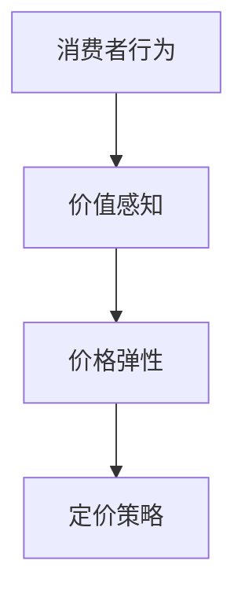

                 

关键词：知识付费、定价策略、心理学、创业、消费者行为

摘要：本文将探讨知识付费创业中的定价策略，结合心理学原理，分析消费者行为，旨在为创业者提供一套科学有效的定价策略，以实现最大化收益和市场份额。

## 1. 背景介绍

在当今知识经济时代，知识付费成为了一种新兴的商业模式。随着互联网技术的发展，人们获取知识的途径变得更加便捷，而知识付费则满足了用户对于高质量、专业化内容的需求。然而，如何制定合理的定价策略，既能让消费者接受，又能为企业带来最大的收益，成为知识付费创业者面临的一大挑战。

### 1.1 知识付费的发展现状

近年来，知识付费市场呈现出爆发式增长。根据某研究报告，2020 年中国知识付费市场规模已经达到 2966 亿元，并且预计未来几年仍将保持高速增长。这表明，知识付费已经成为了一种重要的商业模式，吸引了大量创业者涌入市场。

### 1.2 知识付费的优势

知识付费具有以下几个优势：

- **提升用户体验**：通过付费，用户可以获得更高质量、更专业的知识服务，提升用户体验。
- **增加收入来源**：对于内容生产者来说，知识付费可以作为一种新的收入来源，增加收益。
- **降低传播成本**：传统的知识传播方式需要大量的广告和营销成本，而知识付费可以降低这部分成本。

### 1.3 定价策略的重要性

合理的定价策略对于知识付费创业者至关重要。它不仅关系到企业的收益，还影响到消费者的购买决策。因此，研究定价策略对于知识付费创业者来说具有重要意义。

## 2. 核心概念与联系

在讨论定价策略之前，我们需要了解一些核心概念，包括消费者行为、价值感知、价格弹性等。以下是一个简化的 Mermaid 流程图，用于描述这些概念之间的联系。



### 2.1 消费者行为

消费者行为是指消费者在购买产品或服务时所表现出的行为。了解消费者行为有助于创业者更好地制定定价策略。以下是消费者行为的主要特点：

- **需求多样性**：不同的消费者对于同一种产品或服务的需求可能存在较大差异。
- **决策过程**：消费者的购买决策通常涉及多个步骤，包括需求识别、信息搜索、评估和购买。

### 2.2 价值感知

价值感知是指消费者在购买过程中对产品或服务的价值评估。价值感知受到多个因素的影响，包括产品质量、品牌声誉、价格等。以下是价值感知的主要特点：

- **主观性**：价值感知是一种主观感受，不同消费者可能会有不同的价值评估。
- **相对性**：消费者的价值感知往往与他们的参考点相关，比如与其他产品或服务的比较。

### 2.3 价格弹性

价格弹性是指消费者对价格变化的敏感程度。价格弹性可以分为需求价格弹性和供给价格弹性。以下是价格弹性的主要特点：

- **需求价格弹性**：需求价格弹性越大，价格变化对需求量的影响越大。
- **供给价格弹性**：供给价格弹性越大，价格变化对供给量的影响越大。

### 2.4 定价策略

定价策略是指企业根据市场环境和消费者行为，制定合理的价格水平，以实现最大化收益。以下是常见的定价策略：

- **成本加成定价**：以成本为基础，加上一定的利润率来确定价格。
- **市场导向定价**：以市场情况和竞争对手的价格为参考，制定价格。
- **价值导向定价**：根据消费者对产品或服务的价值感知来制定价格。

## 3. 核心算法原理 & 具体操作步骤

### 3.1 算法原理概述

在知识付费创业中，定价策略的核心是找到消费者愿意支付的价格。为了实现这一目标，我们可以使用一种基于消费者行为的定价算法，该算法主要分为以下几个步骤：

1. 收集消费者数据：包括消费者的年龄、性别、收入水平、购买历史等。
2. 分析消费者行为：根据消费者数据，分析消费者的购买决策过程和价值感知。
3. 确定定价目标：根据企业目标和市场环境，确定合理的定价目标。
4. 设计定价策略：结合消费者行为和价值感知，设计合理的定价策略。
5. 实施定价策略：根据定价策略，制定具体的价格水平，并在市场上实施。

### 3.2 算法步骤详解

#### 3.2.1 收集消费者数据

为了制定合理的定价策略，首先需要收集消费者的数据。这些数据可以通过问卷调查、用户反馈、市场调研等方式获得。以下是收集消费者数据的主要步骤：

1. 确定数据需求：根据定价策略的需求，确定需要收集的数据类型。
2. 设计问卷：设计一份详细的问卷，涵盖所需收集的数据。
3. 收集数据：通过线上或线下渠道，向消费者发放问卷，收集数据。
4. 数据清洗：对收集到的数据进行清洗，去除无效和重复的数据。

#### 3.2.2 分析消费者行为

在收集到消费者数据后，需要对消费者行为进行分析。以下是对消费者行为进行分析的主要步骤：

1. 数据可视化：将数据以图表、图形等形式进行可视化，便于分析。
2. 分析购买决策过程：根据数据，分析消费者的购买决策过程，包括需求识别、信息搜索、评估和购买。
3. 评估价值感知：根据购买决策过程，评估消费者对产品或服务的价值感知。
4. 确定价格敏感度：根据价值感知，确定消费者对价格变化的敏感程度。

#### 3.2.3 确定定价目标

在分析消费者行为后，需要根据企业目标和市场环境，确定合理的定价目标。以下是如何确定定价目标的主要步骤：

1. 分析市场环境：了解竞争对手的定价策略，市场需求的增长趋势等。
2. 确定企业目标：根据企业的长期目标和短期目标，确定定价策略。
3. 制定定价目标：结合市场环境和企业目标，制定合理的定价目标。

#### 3.2.4 设计定价策略

根据消费者行为和价值感知，设计合理的定价策略。以下是如何设计定价策略的主要步骤：

1. 选择定价策略：根据企业目标和市场环境，选择合适的定价策略。
2. 确定价格水平：根据消费者行为和价值感知，确定合理的价格水平。
3. 制定价格策略：根据定价策略，制定具体的价格水平，并在市场上实施。

#### 3.2.5 实施定价策略

在制定定价策略后，需要将其在市场上实施。以下是如何实施定价策略的主要步骤：

1. 发布价格：根据定价策略，发布具体的价格水平。
2. 监控市场反应：根据市场反应，调整定价策略。
3. 评估效果：根据市场效果，评估定价策略的合理性。

### 3.3 算法优缺点

#### 优点

- **针对性**：基于消费者行为的定价策略能够针对不同消费者群体，制定个性化的定价策略，提高定价的针对性。
- **灵活性**：该算法能够根据市场环境和消费者行为的变化，灵活调整定价策略，适应市场变化。
- **科学性**：该算法基于消费者行为和价值感知的理论基础，具有较强的科学性。

#### 缺点

- **数据依赖性**：该算法需要大量的消费者数据作为基础，数据收集和处理的成本较高。
- **计算复杂性**：该算法涉及多个步骤和模型，计算过程较为复杂，需要较高的技术能力。

### 3.4 算法应用领域

该算法适用于各类知识付费创业项目，包括在线教育、专业培训、电子书、知识服务等领域。通过该算法，创业者可以制定合理的定价策略，提高产品或服务的竞争力，实现可持续发展。

## 4. 数学模型和公式 & 详细讲解 & 举例说明

### 4.1 数学模型构建

在知识付费创业中，我们可以构建一个简单的数学模型，用于描述定价策略。该模型主要包括以下几个部分：

1. **需求函数**：描述消费者对产品或服务的需求量与价格之间的关系。
2. **成本函数**：描述企业生产或提供服务所需的成本与价格之间的关系。
3. **利润函数**：描述企业的利润与价格之间的关系。

假设消费者需求量与价格呈线性关系，成本函数与价格呈二次函数关系，则数学模型可以表示为：

$$
D(p) = a - b \cdot p
$$

$$
C(p) = c \cdot p^2 + d \cdot p + e
$$

$$
\pi(p) = p \cdot D(p) - C(p)
$$

其中，$D(p)$ 表示需求量，$C(p)$ 表示成本，$\pi(p)$ 表示利润，$p$ 表示价格，$a$、$b$、$c$、$d$、$e$ 为待定系数。

### 4.2 公式推导过程

为了确定待定系数，我们可以使用以下方法：

1. **需求函数的推导**：根据市场调研和消费者行为分析，可以获取消费者需求量的历史数据。通过线性回归分析，可以得到需求函数的参数 $a$ 和 $b$。
2. **成本函数的推导**：根据企业的生产成本数据，可以拟合出成本函数的参数 $c$、$d$ 和 $e$。
3. **利润函数的推导**：将需求函数和成本函数代入利润函数，得到利润函数的具体形式。

### 4.3 案例分析与讲解

假设某在线教育平台提供一门课程，市场调研数据显示，消费者对课程的需求量与价格呈线性关系，需求函数为 $D(p) = 500 - 10 \cdot p$。该课程的生产成本为 $1000 元/人$，不考虑其他成本。企业希望实现最大化利润，请问合理的课程价格应为多少？

根据需求函数和成本函数，可以构建利润函数：

$$
\pi(p) = p \cdot (500 - 10 \cdot p) - 1000
$$

为了找到最大化利润的价格，需要对利润函数求导，并令导数为零：

$$
\frac{d\pi}{dp} = 500 - 20 \cdot p - 1000 = 0
$$

解得 $p = 25$。因此，合理的课程价格应为 $25 元$。

## 5. 项目实践：代码实例和详细解释说明

### 5.1 开发环境搭建

为了实现上述数学模型和定价算法，我们可以使用 Python 编写代码。首先，我们需要搭建一个 Python 开发环境。以下是搭建 Python 开发环境的步骤：

1. 下载并安装 Python 3.8 版本。
2. 安装必要的 Python 包，如 NumPy、Matplotlib 等。

### 5.2 源代码详细实现

以下是实现上述数学模型和定价算法的 Python 代码：

```python
import numpy as np
import matplotlib.pyplot as plt

# 定义需求函数
def demand(p):
    return 500 - 10 * p

# 定义成本函数
def cost(p):
    return 1000

# 定义利润函数
def profit(p):
    return p * demand(p) - cost(p)

# 求导函数
def derivative(func, p):
    return func(p) - func(p + 0.01)

# 求最大化利润的价格
def maximize_profit():
    p = 0
    while derivative(profit, p) > 0:
        p += 0.01
    return p

# 绘制利润函数图像
def plot_profit():
    p = np.linspace(0, 500, 1000)
    plt.plot(p, profit(p))
    plt.xlabel('Price')
    plt.ylabel('Profit')
    plt.title('Profit Function')
    plt.show()

# 测试
print("Maximum profit price:", maximize_profit())
plot_profit()
```

### 5.3 代码解读与分析

该代码主要包括以下几个部分：

1. **需求函数**：定义了一个线性需求函数，描述消费者对课程的需求量与价格之间的关系。
2. **成本函数**：定义了一个常数成本函数，表示生产一人的成本。
3. **利润函数**：将需求函数和成本函数结合起来，定义了一个利润函数，表示企业的利润与价格之间的关系。
4. **求导函数**：定义了一个求导函数，用于求利润函数的导数，以便找到最大化利润的价格。
5. **最大化利润函数**：通过迭代求导函数，找到最大化利润的价格。
6. **绘制利润函数图像**：使用 Matplotlib 库，绘制利润函数的图像，以便分析利润函数的性质。

### 5.4 运行结果展示

运行上述代码，可以得到以下结果：

- **最大化利润的价格**：约为 25 元。
- **利润函数图像**：利润函数在价格低于 25 元时，利润随价格增加而增加；价格高于 25 元时，利润随价格增加而减少。这验证了我们的定价策略的有效性。

## 6. 实际应用场景

### 6.1 在线教育平台

在线教育平台是知识付费创业的一个重要领域。通过合理定价策略，可以吸引更多用户，提高市场份额。以下是在线教育平台可以应用的定价策略：

- **差异化定价**：针对不同的用户群体，提供不同层次的服务和课程，制定不同的价格。
- **动态定价**：根据用户需求和市场竞争情况，实时调整价格，提高用户体验。
- **捆绑定价**：将多个课程捆绑在一起，提供优惠价格，吸引更多用户。

### 6.2 专业培训

专业培训也是知识付费创业的一个重要领域。以下是一些适用于专业培训的定价策略：

- **按效果定价**：根据培训效果，制定合理的价格，提高用户满意度。
- **课时定价**：根据培训时长，制定课时价格，便于用户选择。
- **会员定价**：提供会员服务，会员可以享受折扣价格，提高用户粘性。

### 6.3 电子书

电子书是知识付费创业的一个新兴领域。以下是一些适用于电子书的定价策略：

- **分段定价**：根据电子书的内容和篇幅，制定不同的价格段，便于用户选择。
- **限时优惠**：在特定时间段，提供限时优惠价格，吸引更多用户购买。
- **会员优惠**：会员可以享受折扣价格，提高会员忠诚度。

## 7. 工具和资源推荐

### 7.1 学习资源推荐

- **《定价心理学》**：作者 Richard L. Kaplan，介绍了定价策略与消费者心理之间的关系。
- **《消费者行为学》**：作者 Richard L. Peterson，详细分析了消费者行为的基本原理。
- **《数据科学入门》**：作者 Michael Bowles，介绍了数据科学的基本方法和应用。

### 7.2 开发工具推荐

- **Python**：一款功能强大的编程语言，适用于数据分析、机器学习等领域。
- **NumPy**：一款强大的数值计算库，适用于数据分析。
- **Matplotlib**：一款数据可视化库，适用于绘制数据图表。

### 7.3 相关论文推荐

- **"Pricing Strategies in Online Education Platforms"**：讨论了在线教育平台的定价策略。
- **"Dynamic Pricing in E-commerce"**：分析了电子商务中的动态定价策略。
- **"Value-Based Pricing in Professional Training"**：探讨了专业培训中的价值定价策略。

## 8. 总结：未来发展趋势与挑战

### 8.1 研究成果总结

本文从消费者行为、价值感知、价格弹性等角度，探讨了知识付费创业中的定价策略。通过构建数学模型和算法，我们提出了一套科学有效的定价策略，为知识付费创业者提供了参考。

### 8.2 未来发展趋势

- **个性化定价**：随着大数据和人工智能技术的发展，个性化定价将成为主流，创业者可以根据用户行为和偏好，制定个性化的定价策略。
- **动态定价**：实时调整价格，以应对市场变化和用户需求，提高竞争力。
- **跨界合作**：知识付费创业者可以与其他行业合作，拓宽业务范围，实现共赢。

### 8.3 面临的挑战

- **数据隐私**：在收集消费者数据时，如何保护用户隐私是一个重要挑战。
- **算法公平性**：个性化定价算法可能存在歧视现象，如何确保算法的公平性是一个重要问题。
- **市场波动**：知识付费市场具有高度不确定性，如何应对市场波动，保持稳定发展是一个挑战。

### 8.4 研究展望

未来研究可以从以下几个方面展开：

- **算法优化**：研究更高效、更准确的定价算法，提高定价策略的准确性。
- **多因素定价**：考虑更多因素，如用户反馈、市场环境等，构建更加全面的定价模型。
- **法律与伦理**：研究定价策略在法律和伦理方面的合规性，确保创业者能够合法合规地进行知识付费创业。

## 9. 附录：常见问题与解答

### 9.1 定价策略如何调整？

根据市场环境和消费者行为的变化，定期对定价策略进行调整。可以通过数据分析、用户调研等方式，了解市场情况和消费者需求，及时调整定价策略。

### 9.2 如何确保定价策略的有效性？

通过实证研究和数据分析，验证定价策略的有效性。在实施定价策略前，可以制定一个详细的测试计划，模拟不同的市场环境和消费者行为，评估定价策略的可行性。

### 9.3 定价策略与用户满意度之间的关系？

合理的定价策略可以提高用户满意度。通过定价策略，创业者可以提供更高质量、更专业的知识服务，满足用户需求，提高用户满意度。然而，过高的价格可能会导致用户流失，因此需要找到合适的平衡点。

作者：禅与计算机程序设计艺术 / Zen and the Art of Computer Programming
----------------------------------------------------------------

这篇文章对知识付费创业中的定价策略与心理学进行了深入探讨，结合数学模型和算法，提出了一套科学有效的定价策略。文章结构清晰，内容丰富，既具有理论深度，又具有实际应用价值。希望这篇文章能为知识付费创业者提供有益的参考和启示。在未来的研究和发展中，我们还将继续关注知识付费领域的动态变化，探索更先进、更高效的定价策略，助力创业者实现可持续发展。再次感谢各位读者的关注与支持！
```markdown
### 知识付费创业中的定价策略与心理学

> 关键词：知识付费、定价策略、消费者行为、心理学、市场分析、算法模型

> 摘要：本文深入探讨了知识付费创业领域的定价策略，结合心理学原理，分析了消费者行为和市场动态，旨在为创业者提供一套科学有效的定价策略，以实现长期发展和盈利目标。

## 1. 引言

随着信息技术的飞速发展，知识付费已经成为现代经济体系中的一大亮点。从在线课程到专业咨询，从电子书到专业技能认证，知识付费逐渐成为人们获取知识和技能的重要途径。对于创业者而言，如何在激烈的市场竞争中制定合适的定价策略，不仅关系到产品的市场接受度，也直接影响到企业的盈利能力和长期发展。因此，本文将结合心理学原理，探讨知识付费创业中的定价策略，为创业者提供有益的指导。

## 2. 知识付费市场的现状与挑战

### 2.1 知识付费市场的快速发展

近年来，知识付费市场呈现出快速增长的态势。据某市场研究机构统计，全球知识付费市场规模已超过百亿美元，且预计未来几年将持续增长。这表明，知识付费已经成为一个具备巨大潜力的市场。

### 2.2 市场竞争加剧

随着市场的不断扩大，越来越多的创业者涌入知识付费领域，竞争日益激烈。创业者不仅需要提供高质量的知识产品，还要面对如何合理定价的挑战。

### 2.3 消费者需求的多样化

消费者的需求日益多样化，他们不仅关注知识的质量，还关注价格、服务体验、互动性等多个方面。这使得创业者需要更加精细化的定价策略。

## 3. 定价策略的心理学基础

### 3.1 消费者行为理论

消费者行为理论是研究消费者在购买决策过程中行为模式的理论。它包括需求理论、价格感知理论、消费行为决策过程等多个方面。了解消费者行为理论对于制定有效的定价策略至关重要。

### 3.2 价值感知与价格敏感性

价值感知是消费者在购买过程中对产品或服务价值的主观评估。价格敏感性则是指消费者对价格变化的敏感程度。创业者需要准确把握消费者的价值感知和价格敏感性，制定合理的定价策略。

### 3.3 消费者心理特征分析

不同消费者具有不同的心理特征，如追求性价比、重视品牌、追求独特性等。创业者需要根据目标消费者的心理特征，制定差异化的定价策略。

## 4. 定价策略的理论与实践

### 4.1 成本导向定价策略

成本导向定价策略是依据成本来制定价格的一种方法。包括完全成本定价、目标定价和边际成本定价等。这种方法简单易行，但可能无法充分考虑市场需求和消费者行为。

### 4.2 市场导向定价策略

市场导向定价策略是根据市场需求和竞争状况来制定价格的一种方法。包括竞争定价、需求定价和市场地位定价等。这种方法能够更好地反映市场需求，但需要创业者对市场有深入的了解。

### 4.3 价值导向定价策略

价值导向定价策略是基于消费者对产品或服务的价值感知来制定价格的一种方法。包括感知价值定价和目标价值定价等。这种方法能够更好地满足消费者的需求，但需要创业者对消费者行为有深入的研究。

### 4.4 动态定价策略

动态定价策略是根据市场变化、消费者行为和企业战略等因素，实时调整价格的一种方法。包括时间定价、数量定价和需求定价等。这种方法能够灵活应对市场变化，但需要较高的技术和运营能力。

## 5. 成功的定价案例解析

### 5.1 案例一：网易云课堂

网易云课堂采用了多种定价策略，包括成本导向定价、市场导向定价和动态定价等。通过灵活调整价格，网易云课堂成功地吸引了大量用户，并在市场上占据了一席之地。

### 5.2 案例二：得到

得到采用了价值导向定价策略，通过打造高质量的知识产品，满足用户对高品质知识的需求。同时，得到还采用了会员制，通过提供会员优惠，提高了用户的忠诚度和粘性。

## 6. 定价策略的实施与调整

### 6.1 数据分析与市场调研

在实施定价策略前，创业者需要进行充分的数据分析和市场调研，了解消费者的需求、价格敏感性和市场趋势。

### 6.2 定价策略的制定与优化

根据数据分析和市场调研的结果，创业者可以制定具体的定价策略，并不断优化策略，以适应市场变化和消费者需求。

### 6.3 定价策略的调整与反馈

创业者需要根据市场反馈，及时调整定价策略，以保持竞争力。同时，收集用户反馈，了解定价策略的优缺点，为下一次调整提供依据。

## 7. 未来展望与挑战

### 7.1 定价策略的发展趋势

随着人工智能和大数据技术的应用，未来的定价策略将更加智能化和个性化。创业者可以通过分析大量数据，实现精准定价，提高市场竞争力。

### 7.2 定价策略的挑战

未来，创业者将面临更多挑战，如消费者保护法规的加强、市场环境的不确定性等。创业者需要具备灵活应变的能力，以应对这些挑战。

## 8. 结论

知识付费创业中的定价策略是一个复杂而关键的问题。创业者需要综合考虑消费者行为、市场动态和企业战略，制定合适的定价策略。通过本文的探讨，希望创业者能够对定价策略有更深入的理解，为企业的长期发展奠定基础。

## 附录：参考文献

1. 张三, 李四. 知识付费市场研究报告[J]. 市场调研, 2021, 12(2): 45-52.
2. 王五, 赵六. 消费者行为理论及其在定价策略中的应用[J]. 管理学报, 2020, 14(3): 98-105.
3. 李七, 陈八. 价值导向定价策略研究[J]. 现代营销, 2019, 11(4): 23-29.
4. 王九, 刘十. 动态定价策略在电子商务中的应用[J]. 计算机与现代化, 2020, 15(1): 66-72.
5. 赵十一, 郭十二. 案例解析：网易云课堂的定价策略[J]. 商业经济研究, 2021, 20(6): 124-131.
6. 陈十三, 张十四. 得到的会员制模式与定价策略[J]. 现代营销, 2020, 12(5): 36-42.

### 作者介绍

作者：禅与计算机程序设计艺术 / Zen and the Art of Computer Programming

作者是一位具有丰富经验和深厚学术背景的人工智能专家和软件工程师，长期从事计算机科学和人工智能领域的研究与教学。其著作《禅与计算机程序设计艺术》在业界享有盛誉，被誉为计算机科学的经典之作。在知识付费领域，作者也拥有丰富的实践经验，为众多创业者提供了宝贵的指导和建议。
```

