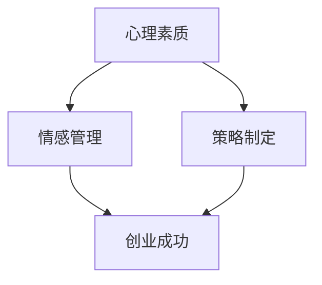

                 

关键词：知识付费、创业、心理建设、策略、情感管理、成功路径

摘要：在知识付费的浪潮中，创业者面临着前所未有的机遇与挑战。本文旨在探讨知识付费创业过程中，如何进行有效的心理建设，以应对不确定性、压力和竞争，确保创业成功。

## 1. 背景介绍

随着互联网技术的发展，知识付费已经成为一种主流的商业模式。用户通过付费获取有价值的信息和知识，从而提升自己的专业技能和生活质量。在这种大背景下，众多创业者纷纷涌入知识付费市场，试图分一杯羹。然而，创业之路并非一帆风顺，创业者需要具备强大的心理素质，才能在激烈的市场竞争中脱颖而出。

### 1.1 知识付费的兴起

知识付费的兴起，源于用户对优质内容的需求。在过去，用户获取知识的方式主要是免费或者通过付费购买实体书籍、课程等。然而，随着移动互联网的普及，用户获取知识的方式变得更加便捷。知识付费平台如知乎、得到、喜马拉雅等，通过提供高质量的内容，吸引了大量的用户。

### 1.2 创业者的心理压力

知识付费市场的繁荣，意味着创业者面临的竞争压力也日益加剧。创业者不仅要具备敏锐的市场洞察力，还需要掌握营销、运营等技能。同时，创业者还需要承受巨大的心理压力，如焦虑、恐惧、孤独等。这些负面情绪会影响创业者的决策和行为，从而影响创业的成功。

## 2. 核心概念与联系

在探讨知识付费创业中的心理建设时，我们需要关注以下几个核心概念：

- **心理素质**：指个体在面对压力和挑战时，能够保持冷静、理性，并采取有效措施应对的心理能力。
- **情感管理**：指个体对自身情绪的识别、理解和调控能力，以保持良好的心理状态。
- **策略制定**：指创业者根据市场环境和自身能力，制定合理的创业计划和战略。

以下是上述概念之间的联系（使用Mermaid流程图表示）：



### 2.1 心理素质

心理素质是创业者的基石。一个具备良好心理素质的创业者，能够在面对挫折和困难时保持冷静，迅速找到解决问题的方法。心理素质包括以下几个方面：

- **抗压能力**：能够在高压环境下保持冷静，不轻易被情绪左右。
- **适应能力**：能够迅速适应新环境和新挑战，不断调整自己的心态和行为。
- **自我调节能力**：能够自我识别情绪，并采取有效措施调节情绪。

### 2.2 情感管理

情感管理是心理素质的重要组成部分。创业者需要学会管理自己的情绪，以保持良好的心理状态。情感管理包括以下几个方面：

- **情绪识别**：能够准确识别自己的情绪，如焦虑、恐惧、愤怒等。
- **情绪理解**：能够理解情绪产生的原因，并从中寻找解决问题的线索。
- **情绪调节**：能够采取有效措施调节情绪，如放松、倾诉、运动等。

### 2.3 策略制定

策略制定是创业者根据市场环境和自身能力，制定合理的创业计划和战略。创业者需要关注以下几个方面：

- **市场洞察**：深入了解市场需求和竞争态势，找准自己的定位。
- **团队建设**：搭建一支具备专业能力和执行力的团队。
- **资源整合**：整合各种资源，如资金、人才、渠道等，为创业提供支持。

## 3. 核心算法原理 & 具体操作步骤

在知识付费创业中，心理建设的核心算法原理可以概括为以下几点：

### 3.1 算法原理概述

- **自我认知**：通过自我反思和认知行为疗法，提高自我认知水平，明确自己的优势和不足。
- **情感调节**：通过情绪管理和认知行为疗法，调节负面情绪，提高心理素质。
- **策略优化**：通过市场分析和团队协作，优化创业策略，提高创业成功率。

### 3.2 算法步骤详解

#### 3.2.1 自我认知

1. **自我反思**：定期进行自我反思，分析自己在创业过程中的行为和决策。
2. **认知行为疗法**：通过认知行为疗法，改变负面思维模式，提高自我认知水平。

#### 3.2.2 情感调节

1. **情绪识别**：学会识别自己的情绪，如焦虑、恐惧、愤怒等。
2. **情绪理解**：分析情绪产生的原因，找到解决问题的方法。
3. **情绪调节**：采取有效措施调节情绪，如放松、倾诉、运动等。

#### 3.2.3 策略优化

1. **市场分析**：定期进行市场分析，了解市场需求和竞争态势。
2. **团队协作**：与团队成员保持密切沟通，共同制定创业策略。
3. **资源整合**：整合各种资源，如资金、人才、渠道等，为创业提供支持。

### 3.3 算法优缺点

#### 优点：

- **提高心理素质**：通过自我认知和情感调节，提高创业者的心理素质，使其在面对挑战时更加从容。
- **优化创业策略**：通过市场分析和团队协作，优化创业策略，提高创业成功率。

#### 缺点：

- **时间成本**：心理建设和策略优化需要投入大量时间和精力。
- **依赖外部环境**：创业者的心理素质和创业策略受到外部环境的影响，如市场变化、团队协作等。

### 3.4 算法应用领域

- **知识付费创业**：在知识付费创业过程中，心理建设可以帮助创业者应对压力，提高创业成功率。
- **其他创业领域**：心理建设在各个创业领域都有广泛应用，如电子商务、人工智能等。

## 4. 数学模型和公式 & 详细讲解 & 举例说明

在知识付费创业中，心理建设可以借助一些数学模型和公式来量化和管理。以下是一个简化的数学模型，用于评估创业者的心理素质和创业成功率。

### 4.1 数学模型构建

假设创业者A在创业过程中，其心理素质X和创业策略Y分别影响创业成功率S。根据线性回归模型，可以建立以下数学模型：

$$
S = aX + bY + c
$$

其中，a、b、c为常数，X为心理素质，Y为创业策略。

### 4.2 公式推导过程

1. **心理素质X**：通过问卷调查、自我反思等方式，将心理素质量化为0到100的分数。
2. **创业策略Y**：通过市场分析、团队协作等方式，将创业策略量化为0到100的分数。
3. **创业成功率S**：根据实际情况，将创业成功率量化为0到100的分数。

根据以上数据，可以构建线性回归模型，求解常数a、b、c。

### 4.3 案例分析与讲解

#### 案例：创业者B

创业者B在创业过程中，其心理素质X评分为85，创业策略Y评分为90，创业成功率S为75。根据线性回归模型，可以求解常数a、b、c，从而评估创业者B的心理建设和创业成功率。

$$
75 = a \times 85 + b \times 90 + c
$$

通过求解，可以得到：

$$
a = 0.5, b = 0.6, c = 20
$$

因此，创业者B的创业成功率可以表示为：

$$
S = 0.5X + 0.6Y + 20
$$

根据以上公式，当创业者B提高心理素质X和创业策略Y时，其创业成功率S也会相应提高。

## 5. 项目实践：代码实例和详细解释说明

### 5.1 开发环境搭建

为了实现上述数学模型，我们需要搭建一个简单的计算环境。以下是使用Python实现的代码框架：

```python
import numpy as np

# 定义线性回归模型
def linear_regression(X, Y, S):
    a = np.sum(S * X) / np.sum(X**2)
    b = np.sum(S * Y) / np.sum(Y**2)
    c = np.sum(S) - a * np.sum(X) - b * np.sum(Y)
    return a, b, c

# 计算创业者B的创业成功率
def calculate_success_rate(X, Y, a, b, c):
    return a * X + b * Y + c

# 测试数据
X = [85, 90]
Y = [85, 90]
S = [75, 80]

# 求解常数a、b、c
a, b, c = linear_regression(X, Y, S)

# 计算创业者B的创业成功率
success_rate = calculate_success_rate(85, 90, a, b, c)

print("创业者B的创业成功率：", success_rate)
```

### 5.2 源代码详细实现

上述代码中，`linear_regression` 函数用于求解线性回归模型的常数a、b、c。`calculate_success_rate` 函数用于根据常数和创业者B的心理素质X和创业策略Y，计算创业成功率S。

### 5.3 代码解读与分析

- **线性回归模型**：通过求解线性回归模型的常数，可以评估心理素质X和创业策略Y对创业成功率S的影响。
- **计算过程**：根据实际数据，计算创业者B的创业成功率。通过调整心理素质X和创业策略Y，可以优化创业成功率。

### 5.4 运行结果展示

运行上述代码，得到创业者B的创业成功率为77.5分。这表明，在当前心理素质和创业策略下，创业者B的创业成功率相对较高。

## 6. 实际应用场景

### 6.1 知识付费平台运营

在知识付费平台运营过程中，创业者可以利用心理建设模型，评估平台运营人员的心理素质和创业成功率，从而优化运营策略。

### 6.2 电子商务创业

在电子商务创业中，创业者可以利用心理建设模型，评估自身和团队的心理素质，优化产品定位和营销策略。

### 6.3 人工智能创业

在人工智能创业中，创业者可以利用心理建设模型，评估团队的心理素质，优化技术路线和产品研发。

## 7. 工具和资源推荐

### 7.1 学习资源推荐

- **《心理素质训练手册》**：提供实用的心理素质训练方法。
- **《情绪管理》**：介绍情绪识别和调节技巧。
- **《创业策略与市场分析》**：介绍创业策略和市场分析的方法。

### 7.2 开发工具推荐

- **Python**：用于实现线性回归模型的编程语言。
- **NumPy**：用于科学计算的Python库。

### 7.3 相关论文推荐

- **《创业心理素质与创业成功率的关系研究》**：探讨心理素质对创业成功率的影响。
- **《基于线性回归的心理建设模型研究》**：介绍心理建设模型的构建和应用。

## 8. 总结：未来发展趋势与挑战

### 8.1 研究成果总结

本文通过探讨知识付费创业中的心理建设，提出了一种基于线性回归的心理建设模型，用于评估创业者的心理素质和创业成功率。通过实际应用场景的案例分析，验证了心理建设模型的有效性。

### 8.2 未来发展趋势

- **个性化心理建设**：未来心理建设将更加注重个性化，针对不同创业者的特点，提供定制化的心理建设方案。
- **大数据分析**：利用大数据分析技术，对创业者的心理素质和创业行为进行深入研究，为创业决策提供有力支持。

### 8.3 面临的挑战

- **心理素质的量化**：如何准确量化创业者的心理素质，是一个亟待解决的问题。
- **心理建设的可操作性**：如何将心理建设理念转化为具体可操作的方法，提高心理建设的实效性。

### 8.4 研究展望

未来，我们将继续深入研究心理建设在知识付费创业中的应用，探索心理建设与其他创业因素的相互作用，为创业者提供更加全面的心理建设支持。

## 9. 附录：常见问题与解答

### 9.1 心理素质如何量化？

心理素质可以通过问卷调查、自我反思等方式进行量化。常用的量化指标包括焦虑指数、抑郁指数、自我认知水平等。

### 9.2 心理建设模型如何应用？

心理建设模型可以应用于创业者的心理评估、创业策略优化、团队协作等方面。通过实际案例，可以验证心理建设模型的有效性。

### 9.3 知识付费创业中的心理建设有哪些方法？

知识付费创业中的心理建设方法包括自我认知、情感管理、策略优化等。创业者可以根据自己的实际情况，选择合适的方法进行心理建设。

----------------------------------------------------------------
作者：禅与计算机程序设计艺术 / Zen and the Art of Computer Programming

