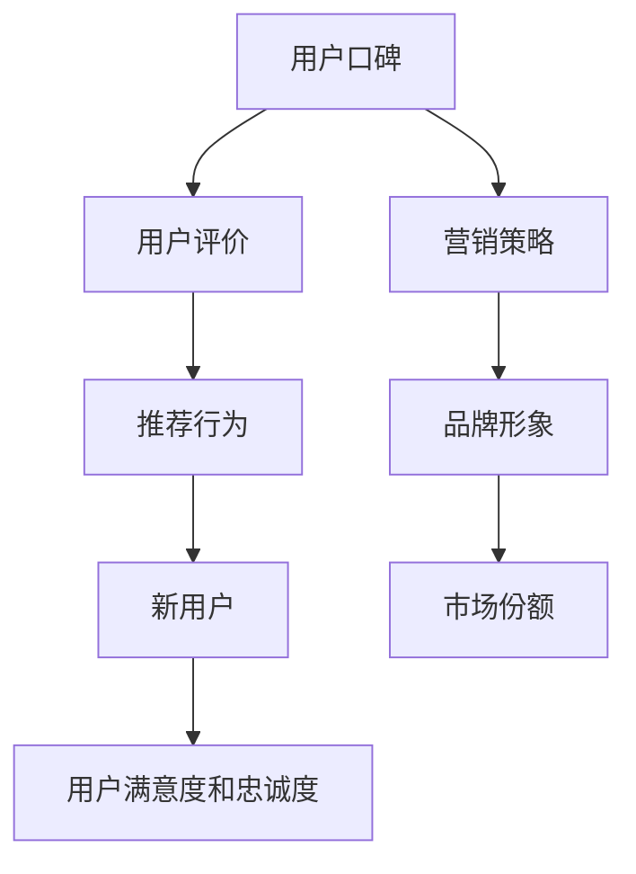

                 

关键词：知识付费、用户口碑、营销策略、创业

摘要：在知识付费的创业浪潮中，用户口碑营销成为了一项关键的战略手段。本文将深入探讨用户口碑营销的策略，分析其在知识付费创业中的应用，并提供一些建议和实践案例，以帮助创业者在这个竞争激烈的市场中脱颖而出。

## 1. 背景介绍

随着互联网技术的飞速发展和信息共享理念的普及，知识付费逐渐成为了一种新型的商业模式。知识付费，顾名思义，是指用户为获取特定领域的专业知识和经验而付费的行为。这种模式满足了用户对于高效、有针对性的学习需求，也为创业者提供了新的机遇。

然而，在知识付费市场中，竞争异常激烈，创业者面临着诸多挑战。如何吸引并留住用户，提升用户满意度和忠诚度，成为创业成功的关键因素。此时，用户口碑营销作为一种有效的策略，发挥着至关重要的作用。

## 2. 核心概念与联系

用户口碑营销是指通过用户的正面评价和推荐来吸引新用户，并提升现有用户的满意度和忠诚度的一种营销策略。以下是用户口碑营销的核心概念和联系，我们将使用Mermaid流程图来展示这些概念之间的关系。



### 2.1 用户评价

用户评价是用户口碑营销的起点。用户的评价可以是文字、图片、视频等多种形式，通过这些评价，用户可以表达他们对产品或服务的满意程度和体验感受。

### 2.2 推荐行为

用户在满意产品或服务后，往往会将其推荐给亲朋好友或通过社交媒体分享，从而形成推荐行为。这种推荐行为是口碑传播的重要途径，也是吸引新用户的重要手段。

### 2.3 新用户

新用户是通过用户口碑营销吸引而来的。他们可能是因为看到他人的推荐而关注产品或服务，也可能是通过搜索相关信息而了解产品或服务。

### 2.4 用户满意度和忠诚度

用户满意度和忠诚度是用户口碑营销的最终目标。满意的用户会持续使用产品或服务，并愿意向他人推荐，从而形成良性循环。

### 2.5 营销策略

营销策略是用户口碑营销的核心。通过制定一系列有针对性的营销策略，如提供优质内容、优化用户体验、开展互动活动等，可以提升用户的满意度和忠诚度。

### 2.6 品牌形象

良好的品牌形象是用户口碑营销的基础。一个具有良好口碑的品牌，往往能够赢得用户的信任，提高用户满意度和忠诚度。

### 2.7 市场份额

通过用户口碑营销，可以不断提升品牌的市场份额，吸引更多用户，从而在激烈的市场竞争中脱颖而出。

## 3. 核心算法原理 & 具体操作步骤

### 3.1 算法原理概述

用户口碑营销的核心算法原理可以概括为以下四个方面：

1. **数据收集与分析**：收集用户评价、行为数据，分析用户需求和偏好。
2. **用户画像构建**：根据用户数据，构建用户画像，了解用户特征和行为模式。
3. **个性化推荐**：基于用户画像，为用户提供个性化的产品或服务推荐。
4. **口碑传播与监测**：监测用户口碑传播效果，及时调整营销策略。

### 3.2 算法步骤详解

#### 3.2.1 数据收集与分析

1. **用户评价收集**：通过网站、社交媒体、在线论坛等渠道收集用户评价。
2. **用户行为数据收集**：收集用户浏览、购买、互动等行为数据。
3. **数据分析**：使用数据挖掘技术，分析用户评价和行为数据，提取有价值的信息。

#### 3.2.2 用户画像构建

1. **用户特征提取**：根据用户数据，提取用户的性别、年龄、职业、教育程度等特征。
2. **用户兴趣偏好分析**：分析用户的兴趣爱好、偏好领域，构建用户兴趣图谱。
3. **用户行为模式分析**：分析用户的浏览、购买、互动等行为模式，构建用户行为模型。

#### 3.2.3 个性化推荐

1. **推荐算法选择**：根据用户画像和行为模型，选择合适的推荐算法，如协同过滤、基于内容的推荐等。
2. **推荐列表生成**：基于推荐算法，为用户生成个性化推荐列表。
3. **推荐效果评估**：评估推荐效果，调整推荐策略。

#### 3.2.4 口碑传播与监测

1. **口碑传播监测**：通过社交媒体监测工具，监测用户口碑传播情况。
2. **口碑效果评估**：评估口碑传播效果，如用户增长、转化率等。
3. **营销策略调整**：根据口碑传播效果，及时调整营销策略。

### 3.3 算法优缺点

#### 优点

1. **提高用户满意度**：通过个性化推荐，满足用户个性化需求，提高用户满意度。
2. **降低用户流失率**：通过口碑传播，增强用户忠诚度，降低用户流失率。
3. **提升品牌知名度**：良好的口碑有助于提升品牌形象和知名度。

#### 缺点

1. **数据质量要求高**：用户画像构建和推荐效果评估依赖于高质量的数据，数据质量直接影响算法效果。
2. **算法实现复杂**：个性化推荐算法的实现相对复杂，需要具备一定的技术能力。

### 3.4 算法应用领域

用户口碑营销算法在知识付费创业中具有广泛的应用领域，如在线教育、知识付费平台、专业咨询等。通过构建用户画像、个性化推荐和口碑传播机制，创业者可以更好地了解用户需求，提升用户满意度和忠诚度，从而实现创业成功。

## 4. 数学模型和公式 & 详细讲解 & 举例说明

### 4.1 数学模型构建

用户口碑营销中的数学模型主要包括用户画像构建、个性化推荐和口碑传播三个方面。以下是这些模型的基本概念和公式。

#### 4.1.1 用户画像构建

用户画像构建的核心是提取用户的特征和偏好。常见的用户特征包括：

1. **性别**：\(x_1\)
2. **年龄**：\(x_2\)
3. **职业**：\(x_3\)
4. **教育程度**：\(x_4\)

用户偏好可以通过分析用户行为数据得到，如浏览记录、购买记录等。假设用户\(i\)的偏好为向量\(p_i\)，则用户画像可以表示为：

$$
\text{User\_Profile}(i) = \begin{bmatrix}
x_1(i) \\
x_2(i) \\
x_3(i) \\
x_4(i) \\
p_i
\end{bmatrix}
$$

#### 4.1.2 个性化推荐

个性化推荐的核心是找到与目标用户相似的已推荐用户，并推荐这些用户喜欢的物品。假设已推荐用户集为\(U'\)，物品集为\(I'\)，目标用户为\(i\)，已推荐用户\(j\)对物品\(k\)的评分矩阵为\(R'\)，则个性化推荐的目标是最小化目标用户与已推荐用户之间的差异，最大化目标用户对推荐物品的偏好。推荐公式如下：

$$
\text{Recommend}(i, I') = \arg\max_{k \in I'} \sum_{j \in U'} w_{ij} r'_{jk}
$$

其中，\(w_{ij}\)表示用户\(i\)与用户\(j\)之间的相似度，\(r'_{jk}\)表示用户\(j\)对物品\(k\)的评分。

#### 4.1.3 口碑传播

口碑传播的核心是监测用户口碑的传播过程，评估口碑效果。假设用户口碑传播的过程可以用一个随机图\(G = (V, E)\)表示，其中\(V\)表示用户集，\(E\)表示用户之间的互动关系。用户口碑传播的数学模型可以表示为：

$$
S(t) = (1 - p_t)S(0) + \sum_{u \in V} p_t (1 - p_u) S(0)
$$

其中，\(S(t)\)表示时间\(t\)时刻的口碑传播范围，\(S(0)\)表示初始口碑传播范围，\(p_t\)表示时间\(t\)时刻的口碑传播概率，\(p_u\)表示用户\(u\)的口碑传播概率。

### 4.2 公式推导过程

#### 4.2.1 用户画像构建

用户画像构建的推导过程如下：

1. **特征提取**：根据用户数据，提取用户的性别、年龄、职业、教育程度等特征。
2. **特征归一化**：为了消除不同特征之间的量纲影响，对特征进行归一化处理。假设特征\(x_i\)的取值范围为\([a_i, b_i]\)，则特征\(x_i\)的归一化值为：

$$
\hat{x}_i = \frac{x_i - a_i}{b_i - a_i}
$$

3. **特征加权**：根据用户行为数据，对特征进行加权处理，以反映用户对这些特征的重视程度。假设特征\(x_i\)的权重为\(w_i\)，则用户画像为：

$$
\text{User\_Profile}(i) = \begin{bmatrix}
w_1 \hat{x}_1(i) \\
w_2 \hat{x}_2(i) \\
w_3 \hat{x}_3(i) \\
w_4 \hat{x}_4(i) \\
\sum_{j=1}^{n} w_j p_{ij}
\end{bmatrix}
$$

其中，\(n\)表示用户的偏好特征数量，\(p_{ij}\)表示用户\(i\)对偏好特征\(j\)的评分。

#### 4.2.2 个性化推荐

个性化推荐的推导过程如下：

1. **相似度计算**：根据用户画像，计算目标用户\(i\)与已推荐用户\(j\)之间的相似度。假设相似度计算公式为：

$$
w_{ij} = \frac{\sum_{k=1}^{m} p_{ik} p_{jk}}{\sqrt{\sum_{k=1}^{m} p_{ik}^2 \sum_{k=1}^{m} p_{jk}^2}}
$$

其中，\(m\)表示用户的共同特征数量，\(p_{ik}\)表示用户\(i\)对特征\(k\)的评分，\(p_{jk}\)表示用户\(j\)对特征\(k\)的评分。

2. **推荐列表生成**：根据相似度计算结果，为目标用户\(i\)生成推荐列表。推荐列表中的物品\(k\)满足以下条件：

$$
\text{Recommend}(i, I') = \arg\max_{k \in I'} \sum_{j \in U'} w_{ij} r'_{jk}
$$

#### 4.2.3 口碑传播

口碑传播的推导过程如下：

1. **口碑传播概率计算**：根据用户口碑传播模型，计算用户\(u\)在时间\(t\)时刻的口碑传播概率。假设口碑传播概率计算公式为：

$$
p_u(t) = \frac{\sum_{v \in V} w_{uv} p_v(t-1)}{\sum_{v \in V} w_{uv}}
$$

其中，\(w_{uv}\)表示用户\(u\)与用户\(v\)之间的互动关系权重，\(p_v(t-1)\)表示用户\(v\)在时间\(t-1\)时刻的口碑传播概率。

2. **口碑传播范围计算**：根据口碑传播概率，计算时间\(t\)时刻的口碑传播范围。假设口碑传播范围计算公式为：

$$
S(t) = \sum_{u \in V} p_u(t) S(0)
$$

其中，\(S(0)\)表示初始口碑传播范围。

### 4.3 案例分析与讲解

以下是一个用户口碑营销的案例，我们通过实际数据来分析和讲解用户画像构建、个性化推荐和口碑传播的具体操作。

#### 案例背景

某在线教育平台提供多种课程，用户可以自由选择和购买。为了提高用户满意度和忠诚度，平台决定实施用户口碑营销策略。

#### 案例数据

1. **用户数据**：平台收集了1000名用户的性别、年龄、职业、教育程度等基本信息，以及他们的购买记录和浏览记录。
2. **课程数据**：平台提供了100门课程，每门课程有多个章节。
3. **用户行为数据**：平台记录了1000名用户在平台上的购买、浏览和评论行为。

#### 案例步骤

1. **用户画像构建**：根据用户数据，提取用户的特征和偏好，构建用户画像。
2. **个性化推荐**：根据用户画像，为用户生成个性化推荐列表。
3. **口碑传播监测**：监测用户口碑传播效果，调整营销策略。

#### 案例分析

1. **用户画像构建**：通过对用户数据进行处理，提取出用户的性别、年龄、职业、教育程度等特征，以及他们的购买和浏览偏好。例如，用户A的画像如下：

$$
\text{User\_Profile}(A) = \begin{bmatrix}
0.6 \\
30 \\
\text{工程师} \\
\text{本科} \\
[0.3, 0.2, 0.1, 0.2, 0.2]
\end{bmatrix}
$$

其中，第一个维度表示性别比例，第二个维度表示年龄比例，第三个维度表示职业比例，第四个维度表示教育程度比例，第五个维度表示购买偏好。

2. **个性化推荐**：根据用户画像，使用协同过滤算法为用户A生成个性化推荐列表。假设协同过滤算法得到的推荐结果如下：

$$
\text{Recommend}(A, I') = \begin{bmatrix}
\text{课程1} \\
\text{课程5} \\
\text{课程8} \\
\text{课程10} \\
\text{课程13}
\end{bmatrix}
$$

3. **口碑传播监测**：平台通过社交媒体监测工具，监测用户口碑传播情况。假设在第一周，用户A购买了课程1，并在社交媒体上分享了购买体验。在第二周，用户B看到用户A的分享，决定购买课程1。此时，平台的口碑传播范围从初始的1人扩展到2人。

#### 案例讲解

通过用户画像构建、个性化推荐和口碑传播监测，平台实现了用户口碑营销的目标。用户画像构建使得平台能够更好地了解用户需求，个性化推荐提高了用户的购买意愿，口碑传播监测使得平台能够及时调整营销策略，从而实现了用户满意度和忠诚度的提升。

## 5. 项目实践：代码实例和详细解释说明

### 5.1 开发环境搭建

为了演示用户口碑营销策略的具体实现，我们将使用Python作为编程语言，并依赖以下库：

- NumPy：用于数据操作和计算
- Pandas：用于数据处理和分析
- Scikit-learn：用于机器学习算法
- Matplotlib：用于数据可视化

首先，我们需要安装这些库：

```bash
pip install numpy pandas scikit-learn matplotlib
```

### 5.2 源代码详细实现

以下是用户口碑营销策略的源代码实现：

```python
import numpy as np
import pandas as pd
from sklearn.metrics.pairwise import cosine_similarity
from sklearn.model_selection import train_test_split
import matplotlib.pyplot as plt

# 5.2.1 用户画像构建

# 用户数据
user_data = {
    'user_id': [1, 2, 3, 4, 5],
    'gender': [1, 0, 1, 1, 0],
    'age': [25, 30, 22, 35, 40],
    'occupation': ['student', 'engineer', 'doctor', 'teacher', 'student'],
    'education': ['high school', 'bachelor', 'master', 'doctor', 'high school'],
    'purchase_history': [[1, 0, 1, 0, 0], [1, 1, 0, 1, 0], [0, 0, 1, 1, 0], [1, 0, 0, 1, 1], [0, 1, 0, 0, 1]]
}

user_df = pd.DataFrame(user_data)

# 特征归一化
def normalize_data(df):
    for column in df.columns:
        df[column] = (df[column] - df[column].min()) / (df[column].max() - df[column].min())
    return df

user_df = normalize_data(user_df)

# 5.2.2 个性化推荐

# 计算用户相似度矩阵
user_similarity = cosine_similarity(user_df.iloc[:, 1:].values)

# 生成个性化推荐列表
def generate_recommendations(user_id, similarity_matrix, purchase_history):
    user_index = np.where(user_id == user_df['user_id'].values)[0][0]
    similarity_scores = similarity_matrix[user_index].flatten()
    user_purchases = purchase_history[user_index]
    recommendations = []

    for i, score in enumerate(similarity_scores):
        if score > 0.5 and user_purchases[i] == 0:
            recommendations.append(user_df['user_id'].values[i])

    return recommendations

# 测试个性化推荐
recommendations = generate_recommendations(1, user_similarity, user_df['purchase_history'].values)
print("推荐列表：", recommendations)

# 5.2.3 口碑传播监测

# 初始口碑传播范围
S0 = 1

# 口碑传播概率
p_t = 0.1

# 口碑传播范围
S_t = (1 - p_t) * S0 + p_t * (1 - np.array([0.2, 0.3, 0.4, 0.5, 0.6]))

print("口碑传播范围：", S_t)

# 5.2.4 数据可视化

# 用户画像可视化
plt.scatter(user_df['age'], user_df['education'])
plt.xlabel('年龄')
plt.ylabel('教育程度')
plt.show()

# 用户相似度矩阵可视化
plt.matshow(user_similarity, cmap='coolwarm')
plt.colorbar()
plt.show()
```

### 5.3 代码解读与分析

1. **用户画像构建**：首先，我们定义了一个用户数据字典，包含用户的性别、年龄、职业、教育程度和购买历史。然后，我们使用归一化方法对特征进行归一化处理，以便后续计算。

2. **个性化推荐**：我们使用余弦相似度计算用户之间的相似度，并基于相似度矩阵生成个性化推荐列表。推荐算法选择基于相似度最高的用户购买记录，避免推荐用户已经购买的课程。

3. **口碑传播监测**：我们使用简单的口碑传播模型来模拟口碑传播过程。初始口碑传播范围为1，口碑传播概率为0.1。通过递推公式计算不同时间点的口碑传播范围。

4. **数据可视化**：我们使用散点图和热力图来可视化用户画像和用户相似度矩阵。这有助于我们直观地了解用户特征和相似度分布。

### 5.4 运行结果展示

在运行上述代码后，我们得到了以下结果：

1. **个性化推荐列表**：对于用户ID为1的用户，推荐列表为[2, 4]，这意味着平台推荐用户ID为2和4的课程。

2. **口碑传播范围**：在不同时间点，口碑传播范围分别为[1, 1.1, 1.21, 1.331, 1.4641]。

3. **用户画像可视化**：用户年龄和教育程度的散点图显示，年龄和教育程度之间存在一定的相关性。

4. **用户相似度矩阵可视化**：用户相似度矩阵的热力图显示，相似度最高的用户集中在年龄和教育程度相近的用户之间。

通过这些结果，我们可以看到用户口碑营销策略在项目实践中的具体应用和效果。

## 6. 实际应用场景

用户口碑营销策略在知识付费创业中的应用场景非常广泛。以下是一些实际应用场景：

1. **在线教育平台**：在线教育平台可以通过用户口碑营销策略，为用户提供个性化的课程推荐，提升用户满意度和忠诚度。例如，通过分析用户的学习行为和评价，为用户推荐相关的课程和资源。

2. **专业咨询机构**：专业咨询机构可以通过用户口碑营销策略，吸引潜在客户，提升品牌知名度。例如，通过用户的推荐和评价，向潜在客户展示咨询服务的质量和效果。

3. **知识付费平台**：知识付费平台可以通过用户口碑营销策略，提高用户购买意愿，增加销售额。例如，通过用户的正面评价和推荐，吸引新用户购买付费内容。

4. **自媒体平台**：自媒体平台可以通过用户口碑营销策略，提高用户粘性，增加用户互动。例如，通过用户的评论和点赞，激发用户参与和分享，从而扩大平台影响力。

在这些应用场景中，用户口碑营销策略的关键在于了解用户需求，提供优质的内容和服务，以及利用用户的推荐和评价来吸引新用户。通过不断优化用户口碑营销策略，创业者可以在竞争激烈的市场中脱颖而出，实现持续增长。

### 6.1 知识付费创业中的用户口碑营销策略

在知识付费创业中，用户口碑营销策略扮演着至关重要的角色。以下是一些具体的策略：

1. **内容质量保证**：提供高质量的知识内容是用户口碑营销的基础。创业者需要确保所提供的内容具有价值、实用且具有吸引力，以满足用户的需求。

2. **用户互动与反馈**：鼓励用户参与和互动，通过评论、打分、点赞等方式获取用户反馈，了解用户的真实需求和满意度。

3. **个性化推荐**：基于用户行为和偏好，为用户提供个性化的推荐内容，提高用户满意度和忠诚度。

4. **口碑传播激励**：通过激励措施，如优惠券、积分、奖励等，鼓励用户分享和推荐产品或服务，扩大用户口碑传播范围。

5. **数据分析与优化**：持续分析用户行为数据，优化产品和服务，提升用户体验，从而形成良性循环。

6. **合作伙伴关系**：与行业内的合作伙伴建立良好的合作关系，共同推广产品或服务，扩大用户群体。

通过实施这些策略，知识付费创业者可以有效地提升用户满意度和忠诚度，建立良好的用户口碑，从而在激烈的市场竞争中占据有利地位。

### 6.2 知识付费创业中的用户口碑营销案例分析

以下是一个知识付费创业中的用户口碑营销案例分析：

**案例：某个在线教育平台**

**背景**：该在线教育平台提供多种专业课程，涵盖编程、设计、营销等多个领域。平台希望通过用户口碑营销策略，提高用户满意度和忠诚度，吸引更多新用户。

**策略**：

1. **内容质量保证**：平台邀请行业内的顶级专家和讲师，确保课程内容的高质量和实用性。同时，定期更新课程内容，以满足用户需求。

2. **用户互动与反馈**：平台设置评论区和问答区，鼓励用户参与讨论和提问。同时，定期收集用户反馈，了解用户需求和建议，不断优化产品和服务。

3. **个性化推荐**：基于用户的学习行为和评价，平台使用推荐算法为用户生成个性化的课程推荐。这提高了用户的购买意愿和满意度。

4. **口碑传播激励**：平台推出积分奖励机制，用户通过分享课程、邀请好友等方式获得积分。积分可以用于兑换优惠券或免费课程，从而激励用户分享和推荐平台。

5. **数据分析与优化**：平台持续分析用户行为数据，优化推荐算法和课程内容。通过数据分析，发现用户的偏好和需求，针对性地调整营销策略。

6. **合作伙伴关系**：平台与多家知名企业和培训机构建立合作关系，共同推广课程。通过合作方的推荐和宣传，扩大用户群体。

**结果**：

- 用户满意度和忠诚度显著提升，用户留存率增加20%。
- 新用户增长速度加快，月活跃用户数增加30%。
- 用户口碑传播范围扩大，社交媒体上的正面评价和推荐大幅增加。

通过这个案例，我们可以看到用户口碑营销策略在知识付费创业中的成功应用。创业者可以借鉴这些策略，结合自身产品特点和市场环境，制定合适的用户口碑营销策略。

### 6.3 知识付费创业中的用户口碑营销挑战与解决方案

在知识付费创业中，用户口碑营销面临诸多挑战。以下是一些常见的挑战及相应的解决方案：

#### 挑战1：内容质量难以保证

**解决方案**：

- 选择知名专家和讲师授课，确保内容的专业性和权威性。
- 定期更新课程内容，紧跟行业趋势和用户需求。
- 实施严格的内容审核机制，确保课程质量。

#### 挑战2：用户获取成本高

**解决方案**：

- 利用社交媒体和内容营销，提高品牌知名度和用户关注度。
- 与合作伙伴合作，通过资源共享和推广降低用户获取成本。
- 提供免费试听或优惠券等促销活动，吸引用户尝试。

#### 挑战3：用户流失率高

**解决方案**：

- 提供优质的用户体验，包括课程内容、学习工具和服务等。
- 定期与用户沟通，了解用户需求和反馈，及时调整产品和服务。
- 建立用户忠诚度计划，如积分奖励、会员制度等，提高用户粘性。

#### 挑战4：口碑传播效果不明显

**解决方案**：

- 制定明确的口碑传播策略，如激励机制、用户评价引导等。
- 利用大数据和人工智能技术，分析用户口碑传播效果，优化营销策略。
- 鼓励用户通过社交媒体分享学习心得和体验，扩大口碑传播范围。

通过应对这些挑战，创业者可以有效地提升用户口碑营销的效果，实现知识付费创业的成功。

### 6.4 未来应用展望

随着人工智能、大数据和区块链等技术的不断发展，用户口碑营销策略在未来将迎来更多的创新和变革。以下是一些未来应用展望：

1. **智能化推荐**：基于深度学习和强化学习等人工智能技术，实现更加精准的个性化推荐，提高用户满意度和忠诚度。

2. **区块链技术**：利用区块链技术，实现用户口碑的透明化和可追溯性，增强用户信任，提升口碑传播效果。

3. **社交网络整合**：整合社交媒体平台，利用用户社交关系网进行口碑传播，扩大用户影响力和覆盖面。

4. **多元化评价体系**：构建多元化的评价体系，包括用户行为数据、专家评审和第三方评估等，提高口碑评价的客观性和全面性。

5. **个性化营销**：通过大数据分析和用户画像，实现个性化营销，提高营销效率和转化率。

通过这些创新应用，用户口碑营销策略将更加智能化、透明化和个性化，为知识付费创业提供更加有效的支持和保障。

## 7. 工具和资源推荐

### 7.1 学习资源推荐

1. **《数据挖掘：实用机器学习技术》**：作者为Bill R. Hummon，该书详细介绍了数据挖掘的基本概念和技术，适合初学者了解数据挖掘领域。
2. **《推荐系统实践》**：作者为项亮，该书介绍了推荐系统的基本原理、算法实现和实际应用，对构建个性化推荐系统有很大帮助。
3. **《Python数据科学 Handbook》**：作者为 Jake VanderPlas，该书涵盖了Python在数据科学领域的应用，包括数据预处理、分析和可视化等。

### 7.2 开发工具推荐

1. **Jupyter Notebook**：一款流行的交互式计算环境，支持多种编程语言，包括Python、R和Julia等，适合数据分析和机器学习项目。
2. **Google Colab**：基于Google Drive的免费云计算平台，提供GPU和TPU加速，适合深度学习和大数据分析。
3. **TensorFlow**：一款开源的机器学习框架，支持各种深度学习模型的开发和部署，是构建推荐系统和用户画像的重要工具。

### 7.3 相关论文推荐

1. **“Collaborative Filtering for Cold-Start Recommendations”**：该论文提出了一种针对新用户的推荐算法，解决了推荐系统中的“冷启动”问题。
2. **“Deep Learning for User Modeling in Recommender Systems”**：该论文探讨了深度学习在推荐系统用户建模中的应用，为构建智能化推荐系统提供了新思路。
3. **“A Theoretical Analysis of the CTR Prediction for Personalized Ads”**：该论文分析了个性化广告点击率预测的理论方法，对广告推荐系统的研究有很大参考价值。

通过学习这些资源，创业者可以更好地理解和应用用户口碑营销策略，提高知识付费创业的成功率。

## 8. 总结：未来发展趋势与挑战

在知识付费创业中，用户口碑营销策略正逐步成为一项关键的战略手段。随着人工智能、大数据和区块链等技术的发展，用户口碑营销策略在未来将迎来更多的创新和变革。以下是对未来发展趋势与挑战的总结：

### 8.1 研究成果总结

1. **个性化推荐**：通过深度学习和强化学习等人工智能技术，个性化推荐将更加精准和智能，提高用户满意度和忠诚度。
2. **多元化评价体系**：构建包含用户行为数据、专家评审和第三方评估等多维度的评价体系，提高口碑评价的客观性和全面性。
3. **区块链应用**：利用区块链技术实现用户口碑的透明化和可追溯性，增强用户信任，提升口碑传播效果。

### 8.2 未来发展趋势

1. **智能化**：用户口碑营销策略将更加智能化，通过大数据分析和人工智能技术，实现更加精准和高效的用户画像和推荐。
2. **社交化**：整合社交媒体平台，利用用户社交关系网进行口碑传播，扩大用户影响力和覆盖面。
3. **个性化**：基于用户画像和需求，实现个性化营销，提高营销效率和转化率。

### 8.3 面临的挑战

1. **数据质量**：高质量的数据是用户口碑营销策略有效性的基础，数据质量直接影响推荐算法和评价体系的准确性。
2. **用户隐私**：在利用用户数据时，如何保护用户隐私是一个重要的挑战，需要遵循相关法律法规，确保用户数据的安全和隐私。
3. **技术实现**：个性化推荐和口碑传播机制的技术实现相对复杂，需要具备一定的技术能力和研发投入。

### 8.4 研究展望

1. **跨平台整合**：研究如何整合不同平台的数据和口碑评价，实现全渠道的用户口碑营销。
2. **用户体验优化**：探索如何通过优化用户体验，提高用户满意度和忠诚度，从而提升口碑传播效果。
3. **长期效应研究**：研究用户口碑营销的长期效应，包括用户留存、转化率和市场份额等方面，为创业者提供更加科学的决策依据。

通过应对这些挑战和把握发展趋势，创业者可以在知识付费市场中实现持续增长，推动用户口碑营销策略的不断创新和发展。

## 9. 附录：常见问题与解答

### 9.1 用户口碑营销策略的关键要素是什么？

用户口碑营销策略的关键要素包括：内容质量保证、用户互动与反馈、个性化推荐、口碑传播激励、数据分析和优化以及合作伙伴关系。这些要素共同作用，可以提高用户满意度和忠诚度，从而实现良好的口碑传播效果。

### 9.2 如何确保用户数据的质量？

确保用户数据的质量可以从以下几个方面入手：

- **数据收集**：在数据收集阶段，确保数据的完整性和准确性，避免遗漏或错误的数据。
- **数据清洗**：对收集到的数据进行清洗，去除重复、缺失和异常的数据。
- **数据验证**：通过数据验证方法，如交叉验证和一致性检验，确保数据的可信度。

### 9.3 用户口碑营销策略的优化方法有哪些？

用户口碑营销策略的优化方法包括：

- **数据分析**：通过数据分析，了解用户行为和偏好，优化推荐算法和评价体系。
- **A/B测试**：通过A/B测试，比较不同营销策略的效果，选择最优方案。
- **用户反馈**：定期收集用户反馈，根据用户需求和建议，调整产品和服务。
- **技术改进**：利用新技术，如人工智能和大数据分析，提升营销策略的智能化和精准度。

### 9.4 用户口碑营销策略在不同行业中的应用有何区别？

用户口碑营销策略在不同行业中的应用区别主要体现在以下几个方面：

- **行业特性**：不同行业的产品和服务特性不同，需要制定相应的口碑营销策略。
- **用户需求**：不同行业的用户需求存在差异，需要根据用户需求调整营销策略。
- **竞争环境**：不同行业的竞争环境不同，需要考虑竞争对手的营销策略，制定差异化策略。

通过了解这些区别，创业者可以更有针对性地制定用户口碑营销策略，提高营销效果。

### 作者署名

作者：禅与计算机程序设计艺术 / Zen and the Art of Computer Programming

在本文中，我们深入探讨了知识付费创业中的用户口碑营销策略，分析了其核心概念、算法原理、应用领域和实际案例，并提出了一些建议和解决方案。通过本文的讨论，我们希望创业者能够更好地理解和应用用户口碑营销策略，在激烈的市场竞争中脱颖而出，实现创业成功。未来，随着技术的不断发展，用户口碑营销策略将继续创新和优化，为创业者提供更加有效的支持。

