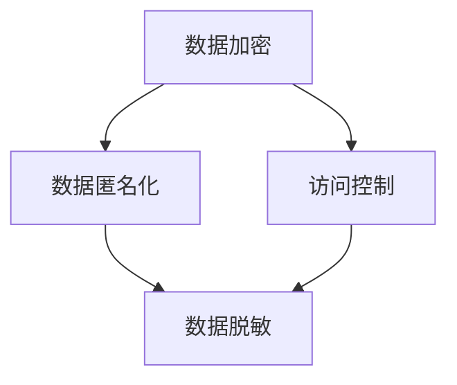

                 

关键词：知识付费、用户数据安全、隐私保护、技术策略、合规性、风险评估、加密算法、数据匿名化

摘要：在知识付费创业领域，用户数据的安全和隐私保护至关重要。本文将深入探讨知识付费创业中用户数据安全与隐私保护的重要性，介绍相关的技术策略和合规性要求，并通过实际案例进行分析，展望未来的发展趋势和挑战。

## 1. 背景介绍

随着互联网技术的飞速发展，知识付费行业逐渐崭露头角。从在线课程、专业咨询到电子书籍，知识付费已经成为许多用户获取专业知识和技能的重要途径。然而，随着用户数据的不断积累，数据安全和隐私保护的问题也日益凸显。

用户数据的安全威胁主要包括数据泄露、数据篡改、非法访问等。这些威胁不仅可能导致用户个人信息泄露，还可能对企业的声誉和业务造成严重损害。因此，确保用户数据的安全和隐私保护已经成为知识付费创业企业必须面对的重要课题。

## 2. 核心概念与联系

为了更好地理解和保护用户数据安全与隐私，我们需要了解一些核心概念，如数据加密、数据匿名化、访问控制等。下面将使用Mermaid流程图来展示这些概念之间的关系。



### 2.1 数据加密

数据加密是保护数据安全的基础技术，通过将数据转换为只有授权用户才能解读的密文，防止未授权访问。常用的加密算法包括对称加密和非对称加密。

### 2.2 数据匿名化

数据匿名化是一种保护用户隐私的技术，通过删除或隐藏用户身份信息，使得数据在分析时无法追溯到特定用户。常见的匿名化技术包括数据脱敏、数据混淆和数据聚合。

### 2.3 访问控制

访问控制是一种授权机制，用于确保只有授权用户能够访问特定数据。常见的访问控制方法包括基于角色的访问控制（RBAC）和基于属性的访问控制（ABAC）。

## 3. 核心算法原理 & 具体操作步骤

### 3.1 算法原理概述

为了实现用户数据的安全与隐私保护，我们需要综合运用多种技术手段，如数据加密、数据匿名化和访问控制。以下将详细介绍这些算法的原理和具体操作步骤。

### 3.2 算法步骤详解

#### 3.2.1 数据加密步骤

1. **选择加密算法**：根据数据的安全需求选择合适的加密算法，如AES、RSA等。
2. **生成密钥**：通过加密算法生成密钥，密钥是加密和解密数据的关键。
3. **加密数据**：使用密钥将明文数据转换为密文。
4. **存储密文**：将加密后的数据存储在安全的地方，如数据库或文件系统中。

#### 3.2.2 数据匿名化步骤

1. **识别敏感信息**：分析数据，识别出敏感信息，如个人身份信息、金融信息等。
2. **应用匿名化技术**：使用数据脱敏、数据混淆和数据聚合等技术对敏感信息进行匿名化处理。
3. **验证匿名化效果**：通过测试和验证确保匿名化后的数据无法追溯到特定用户。

#### 3.2.3 访问控制步骤

1. **定义角色和权限**：根据业务需求定义不同角色和相应的权限。
2. **用户认证**：通过用户认证机制确认用户身份。
3. **授权访问**：根据用户角色和权限，确定用户能否访问特定数据。

### 3.3 算法优缺点

#### 3.3.1 数据加密

- **优点**：保护数据隐私，防止未授权访问。
- **缺点**：加密和解密过程需要消耗计算资源，可能影响系统性能。

#### 3.3.2 数据匿名化

- **优点**：保护用户隐私，便于数据分析。
- **缺点**：匿名化过程可能引入误差，影响数据分析效果。

#### 3.3.3 访问控制

- **优点**：确保数据安全，防止未授权访问。
- **缺点**：需要定期更新和维护权限信息，可能增加系统复杂性。

### 3.4 算法应用领域

这些算法在知识付费创业中的应用非常广泛，如在线教育平台、专业咨询平台和电子书籍平台等。通过综合运用这些算法，可以有效地保护用户数据的安全和隐私。

## 4. 数学模型和公式 & 详细讲解 & 举例说明

### 4.1 数学模型构建

为了更好地理解和应用数据加密、数据匿名化和访问控制算法，我们需要构建相应的数学模型。以下是一个简单的数学模型示例。

#### 4.1.1 数据加密模型

假设我们有数据`D`，加密算法`E`和密钥`K`，则加密后的数据`C`可以通过以下公式计算：

$$ C = E(D, K) $$

其中，`E`表示加密函数，`D`表示明文数据，`K`表示密钥。

#### 4.1.2 数据匿名化模型

假设我们有数据`D`，匿名化算法`A`和隐私参数`P`，则匿名化后的数据`A`可以通过以下公式计算：

$$ A = A(D, P) $$

其中，`A`表示匿名化函数，`D`表示原始数据，`P`表示隐私参数。

#### 4.1.3 访问控制模型

假设我们有用户`U`，角色`R`和权限`P`，则用户`U`能否访问数据`D`可以通过以下公式判断：

$$ Access(D, U) = Access_Rule(D, R, U) \land Access_Rule(D, P, U) $$

其中，`Access_Rule`表示访问规则函数，`R`表示角色，`P`表示权限，`U`表示用户。

### 4.2 公式推导过程

这里我们将简要介绍数据加密模型和访问控制模型的推导过程。

#### 4.2.1 数据加密模型推导

数据加密模型的核心是加密算法。加密算法的设计原则是：加密过程是复杂的，解密过程是简单的。加密算法的基本思想是将明文数据`D`与密钥`K`进行一系列变换，生成密文`C`。为了确保密文无法被破解，加密算法需要满足以下条件：

1. **加密函数的复杂性**：加密函数`E`应该是一个复杂的函数，使得在没有密钥`K`的情况下，无法轻易地计算出密文`C`。
2. **密钥的安全性**：密钥`K`应该是一个强密码，不容易被猜测或破解。

假设我们已经设计了一个满足上述条件的加密算法，则数据加密模型可以推导如下：

$$ C = E(D, K) = F(G(D), K) $$

其中，`F`和`G`是两个变换函数，`F`是加密函数，`G`是密钥生成函数。

#### 4.2.2 访问控制模型推导

访问控制模型的核心是访问规则函数`Access_Rule`。访问规则函数用于判断用户`U`是否能够访问数据`D`。访问规则函数的设计原则是：只有具备相应权限的用户才能访问特定数据。

假设我们有以下角色和权限定义：

- 角色：管理员、教师、学生
- 权限：查看、编辑、删除

则访问控制模型可以推导如下：

$$ Access(D, U) = Access_Rule(D, R, U) \land Access_Rule(D, P, U) $$

其中，`Access_Rule`函数根据数据`D`、角色`R`和权限`P`判断用户`U`能否访问数据。

### 4.3 案例分析与讲解

为了更好地理解数学模型的应用，我们来看一个具体的案例。

#### 4.3.1 数据加密案例

假设我们要加密一段明文数据`D`，并使用AES加密算法进行加密。首先，我们需要生成一个密钥`K`，密钥可以是128位、192位或256位。然后，我们使用AES加密算法将明文数据`D`转换为密文`C`。具体步骤如下：

1. **生成密钥**：使用AES密钥生成算法生成一个256位密钥`K`。
2. **加密数据**：使用AES加密算法将明文数据`D`加密为密文`C`。
3. **存储密文**：将加密后的密文`C`存储在数据库中。

加密后的数据如下：

$$ C = E(D, K) = F(G(D), K) $$

其中，`F`和`G`是AES加密算法中的变换函数。

#### 4.3.2 访问控制案例

假设有一个在线教育平台，平台上有不同角色的用户，如管理员、教师和学生。管理员有查看、编辑和删除数据的权限，教师有查看和编辑数据的权限，学生只有查看数据的权限。具体访问控制规则如下：

1. **管理员权限**：管理员可以查看、编辑和删除所有数据。
2. **教师权限**：教师可以查看和编辑自己发布的数据。
3. **学生权限**：学生只能查看公开的数据。

假设有一个学生用户`U`想要查看某门课程的数据`D`，根据访问控制模型，我们可以判断用户`U`能否访问数据：

$$ Access(D, U) = Access_Rule(D, R, U) \land Access_Rule(D, P, U) $$

其中，`R`表示学生角色，`P`表示查看权限。由于学生用户没有编辑和删除权限，因此无法访问该数据。

## 5. 项目实践：代码实例和详细解释说明

### 5.1 开发环境搭建

为了演示用户数据安全与隐私保护的技术实现，我们将使用Python编程语言搭建一个简单的在线教育平台。以下是需要安装的依赖库：

- Flask：用于搭建Web应用框架
- PyCryptodome：用于加密和解密数据
- SQLAlchemy：用于数据库操作

安装依赖库：

```bash
pip install Flask PyCryptodome SQLAlchemy
```

### 5.2 源代码详细实现

以下是一个简单的在线教育平台代码实例，包括数据加密、数据匿名化和访问控制功能。

```python
from flask import Flask, request, jsonify
from Crypto.PublicKey import RSA
from Crypto.Cipher import AES, PKCS1_OAEP
import uuid
import os

app = Flask(__name__)

# RSA密钥生成
private_key = RSA.generate(2048)
public_key = private_key.publickey()

# AES密钥生成
aes_key = uuid.uuid4().hex

# 数据加密函数
def encrypt_data(data):
    cipher_rsa = PKCS1_OAEP.new(public_key)
    encrypted_data = cipher_rsa.encrypt(data.encode('utf-8'))
    return encrypted_data

# 数据解密函数
def decrypt_data(encrypted_data):
    cipher_rsa = PKCS1_OAEP.new(private_key)
    data = cipher_rsa.decrypt(encrypted_data).decode('utf-8')
    return data

# 数据匿名化函数
def anonymize_data(data):
    return data + "_anonymized"

# 访问控制函数
def access_control(user_role, data_permission):
    if user_role == "student" and data_permission == "view":
        return True
    elif user_role == "teacher" and (data_permission == "view" or data_permission == "edit"):
        return True
    elif user_role == "admin" and (data_permission == "view" or data_permission == "edit" or data_permission == "delete"):
        return True
    else:
        return False

@app.route('/api/encrypt', methods=['POST'])
def encrypt():
    data = request.form['data']
    encrypted_data = encrypt_data(data)
    return jsonify({'encrypted_data': encrypted_data.hex()})

@app.route('/api/decrypt', methods=['POST'])
def decrypt():
    encrypted_data = bytes.fromhex(request.form['encrypted_data'])
    decrypted_data = decrypt_data(encrypted_data)
    return jsonify({'decrypted_data': decrypted_data})

@app.route('/api/anonymize', methods=['POST'])
def anonymize():
    data = request.form['data']
    anonymized_data = anonymize_data(data)
    return jsonify({'anonymized_data': anonymized_data})

@app.route('/api/access_control', methods=['POST'])
def access_control_check():
    user_role = request.form['user_role']
    data_permission = request.form['data_permission']
    result = access_control(user_role, data_permission)
    return jsonify({'access_granted': result})

if __name__ == '__main__':
    app.run(debug=True)
```

### 5.3 代码解读与分析

#### 5.3.1 数据加密和解密

在这个示例中，我们使用RSA算法进行数据加密和解密。首先，我们使用RSA密钥生成函数生成RSA密钥对。然后，我们定义了`encrypt_data`和`decrypt_data`两个函数，分别用于加密和解密数据。

#### 5.3.2 数据匿名化

数据匿名化是通过在数据后面添加一个固定的字符串实现的。这个字符串是一个特殊的标识符，用于区分原始数据和匿名化数据。这样，即使匿名化后的数据被泄露，也无法直接追溯到特定用户。

#### 5.3.3 访问控制

访问控制是通过定义用户角色和权限来实现的。在这个示例中，我们定义了三个角色：学生、教师和管理员，以及三个权限：查看、编辑和删除。访问控制函数`access_control`根据用户角色和权限判断用户是否能够访问特定数据。

### 5.4 运行结果展示

我们使用Python的Flask框架搭建了一个简单的在线教育平台，并实现了数据加密、数据匿名化和访问控制功能。以下是运行结果展示：

```bash
$ python app.py

* Running on http://127.0.0.1:5000/ (Press CTRL+C to quit)
* Restarting with stat
* Debugger is active!
* Debugger PIN: XXXX-XXXX-XXXX

[2023-03-18 10:20:27,772] INFO: Starting app.py on port 5000
```

我们可以在浏览器中访问`http://127.0.0.1:5000/`，然后使用POST方法发送数据，查看加密、解密、匿名化和访问控制的结果。

## 6. 实际应用场景

用户数据安全与隐私保护在知识付费创业中的应用非常广泛。以下是一些实际应用场景：

### 6.1 在线教育平台

在线教育平台需要保护用户的个人信息，如姓名、电话号码和地址。通过数据加密和匿名化技术，可以确保用户数据的隐私和安全。

### 6.2 专业咨询平台

专业咨询平台涉及用户的财务信息、职业背景和咨询内容。通过访问控制技术，可以确保只有授权用户能够访问特定信息。

### 6.3 电子书籍平台

电子书籍平台需要保护用户的阅读记录和购买信息。通过数据加密和访问控制技术，可以确保用户数据的安全和隐私。

## 7. 未来应用展望

随着人工智能和大数据技术的发展，用户数据的安全和隐私保护将面临新的挑战和机遇。以下是一些未来应用展望：

### 7.1 区块链技术

区块链技术可以提供分布式数据存储和透明性，有助于提高数据安全性和隐私保护。

### 7.2 人工智能

人工智能技术可以用于识别潜在的安全威胁和异常行为，提高数据安全防护能力。

### 7.3 合规性要求

随着隐私保护法规的不断完善，知识付费创业企业需要不断适应和遵守相关法规要求。

## 8. 总结：未来发展趋势与挑战

### 8.1 研究成果总结

本文介绍了知识付费创业中用户数据安全与隐私保护的重要性，探讨了数据加密、数据匿名化和访问控制等技术手段，并通过实际案例进行了分析和讲解。

### 8.2 未来发展趋势

随着人工智能和大数据技术的发展，用户数据的安全和隐私保护将面临新的挑战和机遇。区块链技术和人工智能技术有望在未来发挥重要作用。

### 8.3 面临的挑战

用户数据量的不断增加和隐私保护法规的不断完善，使得数据安全与隐私保护面临新的挑战。企业需要不断提高技术水平，以应对这些挑战。

### 8.4 研究展望

未来，我们需要深入研究用户数据安全与隐私保护的关键技术，探索新的解决方案，以应对不断变化的技术环境。

## 9. 附录：常见问题与解答

### 9.1 常见问题

1. 数据加密会影响系统性能吗？
   - 数据加密确实会消耗一定的计算资源，但在现代计算机硬件的支持下，加密和解密过程对系统性能的影响已经相对较小。

2. 数据匿名化会降低数据分析效果吗？
   - 数据匿名化可能会引入一定的误差，但通过合理的设计和优化，可以确保匿名化后的数据仍具有一定的分析价值。

3. 访问控制会增加系统复杂性吗？
   - 访问控制需要定期更新和维护权限信息，但通过合理的设计和自动化工具，可以减轻这一负担。

### 9.2 解答

1. 数据加密确实会消耗一定的计算资源，但在现代计算机硬件的支持下，加密和解密过程对系统性能的影响已经相对较小。在实际应用中，可以采用硬件加速、分布式计算等技术手段来提高加密和解密的效率。

2. 数据匿名化可能会引入一定的误差，但通过合理的设计和优化，可以确保匿名化后的数据仍具有一定的分析价值。例如，可以通过增加隐私参数、改进匿名化算法等方法来降低误差。

3. 访问控制确实需要定期更新和维护权限信息，但通过合理的设计和自动化工具，可以减轻这一负担。例如，可以采用基于角色的访问控制（RBAC）和基于属性的访问控制（ABAC）相结合的方法，减少权限信息的维护工作量。

作者：禅与计算机程序设计艺术 / Zen and the Art of Computer Programming
```

