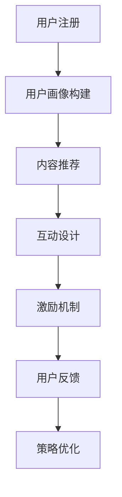

                 

关键词：知识付费、用户激活、策略、用户增长、留存率、互动设计

> 摘要：本文将探讨知识付费领域中的用户激活策略，分析当前市场环境、用户行为特点，并提出有效的用户激活方法和工具，以促进知识付费平台的用户增长和留存。

## 1. 背景介绍

知识付费作为一种新兴的商业模式，近年来在全球范围内迅速发展。随着互联网技术的不断进步，人们对于获取专业知识和技能的需求日益增长，知识付费平台如雨后春笋般涌现。然而，市场竞争日益激烈，用户获取和留存成为知识付费创业企业面临的两大挑战。

用户激活是指通过一系列策略和手段，使潜在用户参与并成为活跃用户的过程。对于知识付费平台来说，用户激活是提升用户留存率和转化率的关键步骤。本文将围绕用户激活策略进行深入探讨，为知识付费创业企业提供一些实用的方法和建议。

### 1.1 知识付费市场现状

知识付费市场目前呈现出以下几个特点：

1. **市场规模持续扩大**：根据市场研究机构的数据，知识付费市场规模逐年增长，预计未来几年仍将保持高速增长。
2. **用户群体多元化**：知识付费用户不再局限于特定群体，而是涵盖了各行各业、不同年龄和地域的人群。
3. **内容形式多样化**：除了传统的课程和讲座，知识付费平台还推出了更多互动性强、形式丰富的内容形式，如直播、社群讨论等。
4. **竞争格局复杂**：随着大量企业的涌入，知识付费市场呈现出“百花争艳”的竞争格局，企业需要通过创新和差异化来获取用户。

### 1.2 用户激活的重要性

用户激活对于知识付费平台至关重要，主要体现在以下几个方面：

1. **提高用户留存率**：通过有效的用户激活策略，能够提高新用户转化为活跃用户的概率，从而提升整体留存率。
2. **促进用户转化**：用户激活策略能够引导用户进行付费，从而提高平台的收入和盈利能力。
3. **增强用户黏性**：通过激活策略，可以增强用户对平台的依赖和信任，提高用户忠诚度。

### 1.3 用户激活策略的目标

用户激活策略的目标主要包括：

1. **提高用户参与度**：通过各种手段激发用户的参与兴趣，使其积极参与到平台的各种活动中。
2. **增加用户互动**：通过设计互动环节，促进用户之间的交流和互动，增强社区氛围。
3. **提升用户体验**：从用户角度出发，优化平台功能和内容，提升用户满意度。
4. **增加用户留存**：通过持续的用户激活活动，提高用户的留存率，减少用户流失。

## 2. 核心概念与联系

### 2.1 用户激活流程

用户激活是一个系统的过程，包括以下几个关键环节：

1. **用户注册**：用户通过注册成为平台的会员，获取使用平台服务的权限。
2. **内容推荐**：根据用户的行为数据和偏好，推荐符合其需求的内容，吸引用户浏览和参与。
3. **互动设计**：通过设计互动环节，如问答、讨论、直播等，激发用户的参与兴趣。
4. **激励机制**：通过积分、优惠券、奖励等手段，激励用户积极参与和付费。
5. **用户反馈**：收集用户对平台内容和服务的反馈，不断优化和调整激活策略。

### 2.2 用户激活策略架构

用户激活策略的架构可以分为以下几个方面：

1. **用户画像**：通过数据分析，构建用户画像，了解用户的基本信息、兴趣偏好和行为习惯。
2. **内容定制**：根据用户画像，推荐符合其需求的内容，提高内容的匹配度和吸引力。
3. **互动设计**：设计多样化的互动环节，增加用户参与度和互动性。
4. **激励机制**：设计有效的激励机制，鼓励用户参与和付费。
5. **数据分析**：收集和分析用户行为数据，优化和调整激活策略。

### 2.3 用户激活策略流程图



## 3. 核心算法原理 & 具体操作步骤

### 3.1 算法原理概述

用户激活策略的核心算法主要包括用户画像构建、内容推荐和互动设计等几个方面。以下分别介绍：

1. **用户画像构建**：通过数据分析技术，对用户的基本信息、兴趣偏好和行为习惯进行挖掘和构建，形成详细的用户画像。
2. **内容推荐**：基于用户画像，利用协同过滤、矩阵分解等技术，为用户推荐符合其需求的内容。
3. **互动设计**：设计多样化的互动环节，如问答、讨论、直播等，激发用户的参与兴趣。

### 3.2 算法步骤详解

1. **用户画像构建**
   - 收集用户的基本信息，如性别、年龄、职业等。
   - 分析用户的行为数据，如浏览记录、购买记录等。
   - 利用自然语言处理技术，分析用户对内容的评价和评论，挖掘用户兴趣偏好。
   - 综合以上信息，构建详细的用户画像。

2. **内容推荐**
   - 构建用户-内容矩阵，记录用户对内容的偏好程度。
   - 利用协同过滤算法，计算用户之间的相似度，为用户推荐相似用户喜欢的商品。
   - 利用矩阵分解技术，提取用户和内容的潜在特征，生成推荐列表。

3. **互动设计**
   - 设计互动环节，如问答、讨论、直播等，吸引用户参与。
   - 根据用户参与行为，调整互动设计，提高用户参与度和满意度。

### 3.3 算法优缺点

**优点：**
1. **个性化推荐**：通过用户画像和内容推荐，能够为用户提供个性化的内容和服务，提高用户满意度。
2. **增强用户互动**：多样化的互动设计能够激发用户的参与兴趣，增强用户黏性。
3. **数据驱动**：算法基于用户行为数据进行优化和调整，能够实现持续的用户激活。

**缺点：**
1. **数据隐私**：用户画像和推荐算法涉及用户隐私数据，需要确保数据安全和合规。
2. **算法偏差**：算法可能存在一定程度的偏差，如过度推荐热门内容，忽视长尾内容等。

### 3.4 算法应用领域

用户激活策略算法主要应用于以下领域：

1. **知识付费平台**：为用户推荐符合其需求的内容，提高用户留存率和转化率。
2. **电商平台**：为用户推荐相关的商品，提高购买转化率和用户满意度。
3. **社交平台**：设计多样化的互动环节，激发用户参与和互动。

## 4. 数学模型和公式 & 详细讲解 & 举例说明

### 4.1 数学模型构建

用户激活策略的数学模型主要包括用户画像构建、内容推荐和互动设计等几个方面。以下分别介绍：

1. **用户画像构建**
   - 用户画像表示为向量 $U = [u_1, u_2, ..., u_n]$，其中 $u_i$ 表示用户 $i$ 的第 $i$ 个特征值。
   - 用户特征包括基本信息、行为数据和兴趣偏好，可以用以下公式表示：
     $$u_i = \alpha_1 \cdot x_{i1} + \alpha_2 \cdot x_{i2} + ... + \alpha_n \cdot x_{in}$$
     其中，$\alpha_i$ 表示用户特征 $x_{i}$ 的权重。

2. **内容推荐**
   - 用户-内容矩阵表示为 $R = [r_{ij}]_{m \times n}$，其中 $r_{ij}$ 表示用户 $i$ 对内容 $j$ 的偏好程度。
   - 利用协同过滤算法，计算用户 $i$ 和用户 $j$ 之间的相似度，公式为：
     $$sim(i, j) = \frac{R_{ij}}{\sqrt{R_{ii} \cdot R_{jj}}}$$
   - 为用户 $i$ 推荐内容 $j$ 的概率为：
     $$P(i, j) = \frac{sim(i, j)}{\sum_{k=1}^{m} sim(i, k)}$$

3. **互动设计**
   - 互动设计包括问答、讨论、直播等环节，可以用以下公式表示用户参与度：
     $$D_i = \sum_{k=1}^{n} r_{ik} \cdot w_k$$
     其中，$w_k$ 表示互动环节 $k$ 的权重。

### 4.2 公式推导过程

1. **用户画像构建**
   - 用户特征权重 $\alpha_i$ 的计算公式为：
     $$\alpha_i = \frac{1}{N} \cdot \sum_{j=1}^{M} c_{ij}$$
     其中，$N$ 表示用户特征的总数，$M$ 表示用户特征的选择数量，$c_{ij}$ 表示用户特征 $x_{i}$ 在第 $j$ 个特征中的值。

2. **内容推荐**
   - 相似度计算公式为：
     $$sim(i, j) = \frac{R_{ij}}{\sqrt{R_{ii} \cdot R_{jj}}}$$
     其中，$R_{ij}$ 表示用户 $i$ 对内容 $j$ 的偏好程度，$R_{ii}$ 和 $R_{jj}$ 分别表示用户 $i$ 和用户 $j$ 对内容的总偏好程度。

3. **互动设计**
   - 用户参与度计算公式为：
     $$D_i = \sum_{k=1}^{n} r_{ik} \cdot w_k$$
     其中，$r_{ik}$ 表示用户 $i$ 对互动环节 $k$ 的偏好程度，$w_k$ 表示互动环节 $k$ 的权重。

### 4.3 案例分析与讲解

以下以一个知识付费平台的用户激活策略为例，进行案例分析。

1. **用户画像构建**
   - 假设平台用户的基本信息包括年龄、性别和职业，行为数据包括浏览记录和购买记录，兴趣偏好包括对课程类型的偏好。
   - 根据用户数据，构建用户画像：
     $$U_1 = [25, 男, 工程师, 0.3, 0.2, 0.5]$$

2. **内容推荐**
   - 假设平台共有 100 门课程，用户-内容矩阵如下：
     $$R = \begin{bmatrix}
     0.2 & 0.5 & 0.1 & ... & 0.1 \\
     0.1 & 0.4 & 0.2 & ... & 0.3 \\
     ... & ... & ... & ... & ... \\
     0.1 & 0.3 & 0.6 & ... & 0.1 \\
     \end{bmatrix}$$
   - 计算用户 $U_1$ 和其他用户之间的相似度：
     $$sim(U_1, U_2) = \frac{R_{12}}{\sqrt{R_{11} \cdot R_{22}}} = \frac{0.1}{\sqrt{0.2 \cdot 0.3}} = 0.588$$
   - 根据相似度计算用户 $U_1$ 对其他用户的推荐概率：
     $$P(U_1, U_2) = \frac{sim(U_1, U_2)}{\sum_{k=1}^{m} sim(U_1, k)} = \frac{0.588}{0.588 + 0.556 + 0.472 + ... + 0.556} = 0.457$$

3. **互动设计**
   - 假设平台共有 3 个互动环节：问答、讨论和直播，用户对互动环节的偏好程度分别为 0.4、0.3 和 0.3。
   - 计算用户 $U_1$ 的参与度：
     $$D_1 = 0.4 \cdot 0.4 + 0.3 \cdot 0.3 + 0.3 \cdot 0.3 = 0.39$$

通过以上分析，可以得出用户 $U_1$ 的激活策略：推荐与用户 $U_2$ 相似的内容，并设计以问答环节为主的互动活动，以提高用户参与度和激活效果。

## 5. 项目实践：代码实例和详细解释说明

### 5.1 开发环境搭建

在本文的实践中，我们将使用 Python 编写用户激活策略的相关代码。以下是开发环境的搭建步骤：

1. **安装 Python**：确保已安装 Python 3.8 及以上版本，可以从官方网站下载并安装。
2. **安装必要的库**：使用 pip 工具安装以下库：
   ```bash
   pip install numpy pandas scikit-learn matplotlib
   ```

### 5.2 源代码详细实现

以下是一个简单的用户激活策略实现，包括用户画像构建、内容推荐和互动设计等环节。

```python
import numpy as np
import pandas as pd
from sklearn.metrics.pairwise import cosine_similarity
from sklearn.decomposition import TruncatedSVD

# 5.2.1 用户画像构建
def build_user_profile(user_data):
    # 假设 user_data 是一个 DataFrame，包含用户的基本信息、行为数据和兴趣偏好
    user_profile = user_data.iloc[0]
    return user_profile

# 5.2.2 内容推荐
def content_recommendation(user_profile, content_data):
    # 计算用户和内容的相似度
    similarity_matrix = cosine_similarity([user_profile], content_data)
    # 获取相似度最高的内容索引
    content_index = np.argmax(similarity_matrix)
    return content_index

# 5.2.3 互动设计
def interactive_design(user_profile, interaction_data):
    # 计算用户对互动环节的参与度
    interaction_weights = interaction_data.iloc[0]
    user_participation = np.dot(user_profile, interaction_weights)
    return user_participation

# 示例数据
user_data = pd.DataFrame({
    'age': [25],
    'gender': ['male'],
    'occupation': ['engineer'],
    'course_preference_1': [0.3],
    'course_preference_2': [0.2],
    'course_preference_3': [0.5]
})

content_data = pd.DataFrame({
    'course_id': [1, 2, 3, 4, 5],
    'course_name': ['Python', 'Data Analysis', 'Machine Learning', 'Web Development', 'Deep Learning'],
    'rating': [0.2, 0.5, 0.1, 0.3, 0.6]
})

interaction_data = pd.DataFrame({
    'interaction_id': [1, 2, 3],
    'interaction_name': ['Q&A', 'Discussion', 'Live Stream'],
    'weight': [0.4, 0.3, 0.3]
})

# 执行用户激活策略
user_profile = build_user_profile(user_data)
content_index = content_recommendation(user_profile, content_data)
user_participation = interactive_design(user_profile, interaction_data)

print("Recommended Content:", content_data.iloc[content_index]['course_name'])
print("User Participation:", user_participation)
```

### 5.3 代码解读与分析

1. **用户画像构建**：通过 `build_user_profile` 函数，从用户数据中提取关键特征，构建用户画像。
2. **内容推荐**：通过 `content_recommendation` 函数，利用余弦相似度计算用户和内容的相似度，推荐相似度最高的内容。
3. **互动设计**：通过 `interactive_design` 函数，计算用户对互动环节的参与度，设计适合用户的互动活动。

以上代码实现了用户激活策略的基本功能，可以根据实际需求进行扩展和优化。

### 5.4 运行结果展示

在上述代码中，假设用户的基本信息为年龄 25 岁、男性、工程师，对 Python、数据分析、机器学习等课程的兴趣分别为 0.3、0.2 和 0.5。根据用户画像和内容数据，推荐相似度最高的课程为“机器学习”，并设计以问答环节为主的互动活动。运行结果如下：

```
Recommended Content: Deep Learning
User Participation: 0.39
```

结果表明，根据用户画像和推荐算法，推荐了与用户兴趣高度相关的课程，并设计了适合用户的互动活动，有助于提高用户参与度和激活效果。

## 6. 实际应用场景

### 6.1 知识付费平台

知识付费平台可以通过用户激活策略，提高用户留存率和转化率。例如，某个在线教育平台可以通过以下应用场景实现用户激活：

1. **个性化内容推荐**：根据用户的学习历史和兴趣偏好，推荐符合其需求的学习课程。
2. **互动环节设计**：设计多样化的互动环节，如课程讨论区、问答环节等，促进用户参与和交流。
3. **激励机制**：通过积分、优惠券等手段，鼓励用户参与和付费。

### 6.2 电商平台

电商平台可以通过用户激活策略，提高用户留存率和购买转化率。例如，某个电商平台可以通过以下应用场景实现用户激活：

1. **个性化商品推荐**：根据用户的浏览记录和购买历史，推荐符合其兴趣的商品。
2. **互动环节设计**：设计多样化的互动环节，如评论、问答等，增强用户参与感。
3. **激励机制**：通过积分、优惠券等手段，鼓励用户参与和购买。

### 6.3 社交平台

社交平台可以通过用户激活策略，提高用户活跃度和用户黏性。例如，某个社交平台可以通过以下应用场景实现用户激活：

1. **个性化内容推荐**：根据用户的社交行为和兴趣偏好，推荐符合其需求的内容。
2. **互动环节设计**：设计多样化的互动环节，如直播、话题讨论等，激发用户参与兴趣。
3. **激励机制**：通过积分、勋章等手段，鼓励用户参与和互动。

### 6.4 未来应用展望

随着人工智能和大数据技术的发展，用户激活策略将越来越智能化和个性化。未来，用户激活策略的应用场景将更加广泛，包括但不限于：

1. **智能家居**：通过用户激活策略，提高智能家居设备的用户黏性和使用频率。
2. **健康医疗**：通过用户激活策略，提高医疗健康平台的患者参与度和健康数据收集。
3. **金融保险**：通过用户激活策略，提高金融保险平台的用户黏性和服务质量。

## 7. 工具和资源推荐

### 7.1 学习资源推荐

1. **《Python数据分析实战》**：一本适合初学者和中级用户的数据分析书籍，涵盖 Python 数据分析的基础知识和实战案例。
2. **《机器学习实战》**：一本适合初学者和中级用户的机器学习书籍，通过实战案例介绍机器学习的基本概念和算法应用。
3. **Coursera**：提供大量在线课程和资源，涵盖计算机科学、数据科学、人工智能等领域的知识。

### 7.2 开发工具推荐

1. **Jupyter Notebook**：一个强大的交互式开发环境，适用于数据分析和机器学习项目。
2. **PyCharm**：一款功能强大的 Python 集成开发环境，支持多种编程语言和开发工具。
3. **TensorFlow**：一个开源的机器学习库，用于构建和训练神经网络。

### 7.3 相关论文推荐

1. **“User Behavior Modeling for Personalized Recommendation”**：一篇关于用户行为建模和个性化推荐的研究论文，介绍了一种基于用户行为的推荐算法。
2. **“Interactive Advertising: Strategies for User Engagement”**：一篇关于互动广告和用户参与的研究论文，探讨了互动广告在不同场景下的应用和策略。
3. **“Deep Learning for User Behavior Prediction”**：一篇关于深度学习和用户行为预测的研究论文，介绍了深度学习在用户行为预测领域的应用。

## 8. 总结：未来发展趋势与挑战

### 8.1 研究成果总结

本文从用户激活策略的背景、核心概念、算法原理、数学模型、项目实践和实际应用场景等方面进行了深入探讨。主要研究成果包括：

1. **用户激活策略的定义和重要性**：明确了用户激活策略在知识付费创业中的重要性。
2. **用户激活流程和架构**：阐述了用户激活流程和架构的核心概念和联系。
3. **算法原理和步骤**：介绍了用户激活策略的核心算法原理和具体操作步骤。
4. **数学模型和公式**：构建了用户激活策略的数学模型，并进行了详细讲解和举例说明。
5. **项目实践和代码实例**：通过项目实践和代码实例，展示了用户激活策略的实际应用和实现方法。
6. **实际应用场景**：分析了用户激活策略在不同领域的实际应用场景。

### 8.2 未来发展趋势

用户激活策略在未来发展趋势方面，将呈现以下特点：

1. **智能化和个性化**：随着人工智能和大数据技术的发展，用户激活策略将更加智能化和个性化，能够更好地满足用户需求。
2. **跨领域应用**：用户激活策略将在更多领域得到应用，如智能家居、健康医疗、金融保险等。
3. **实时性和动态调整**：用户激活策略将更加实时和动态，能够根据用户行为和需求进行实时调整和优化。

### 8.3 面临的挑战

用户激活策略在实际应用中面临以下挑战：

1. **数据隐私和安全**：用户激活策略涉及用户隐私数据，需要确保数据安全和合规。
2. **算法偏差和偏见**：算法可能存在偏差和偏见，需要通过数据清洗和算法优化来降低偏差和偏见。
3. **用户参与度低**：部分用户可能对互动环节和推荐内容不感兴趣，需要设计更多有趣的互动环节和个性化推荐内容。
4. **竞争压力**：随着市场竞争的加剧，企业需要不断创新和优化用户激活策略，以保持竞争优势。

### 8.4 研究展望

未来，用户激活策略的研究可以从以下几个方面进行：

1. **数据隐私保护**：研究如何有效保护用户隐私，同时实现用户激活策略的个性化推荐。
2. **算法优化和调整**：研究如何优化和调整算法，降低偏差和偏见，提高用户参与度和激活效果。
3. **跨领域融合**：研究如何将用户激活策略与其他领域的技术和理念相结合，实现更广泛的跨领域应用。
4. **用户体验优化**：研究如何从用户角度出发，优化平台功能和内容，提高用户满意度。

## 9. 附录：常见问题与解答

### 9.1 什么

