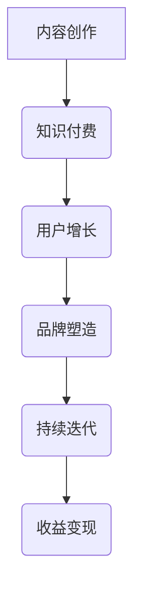

                 

 > **关键词**：知识付费、内容IP、创业、策略、IT领域、用户增长

> **摘要**：本文将探讨知识付费领域的内容IP打造策略，分析核心概念、算法原理、数学模型、项目实践、应用场景、工具资源，总结未来发展趋势与挑战，为知识付费创业者提供有价值的指导。

## 1. 背景介绍

随着互联网的快速发展，知识付费已经成为一种新兴的商业模式。知识付费创业者通过创作高质量的内容，为用户提供有价值的信息和服务，实现个人或机构的商业化。然而，在竞争激烈的市场中，如何打造具有独特价值和广泛影响力的内容IP，成为知识付费创业者面临的重大挑战。

本文将围绕内容IP的打造策略，从核心概念、算法原理、数学模型、项目实践、应用场景、工具资源等方面进行深入探讨，为知识付费创业者提供有价值的指导。

## 2. 核心概念与联系

首先，我们需要了解几个核心概念：

- **内容IP**：内容知识产权，指的是具有独特性、原创性和商业价值的内容作品。
- **知识付费**：用户为获取有价值的信息或服务而支付的费用。
- **用户增长**：通过吸引新用户和留存老用户，实现用户数量的增加。

下面是内容IP打造策略的 Mermaid 流程图：



### 2.1 内容创作

内容创作是打造内容IP的第一步，需要遵循以下原则：

- **原创性**：确保内容具有独创性和创新性，避免抄袭和侵权。
- **专业性**：内容要具备一定的专业性和权威性，提高用户的信任度。
- **多样性**：内容形式要多样化，包括文字、图片、视频、音频等多种形式，满足不同用户的需求。

### 2.2 知识付费

知识付费是内容变现的重要途径，需要考虑以下因素：

- **定价策略**：合理定价，既要考虑成本，也要考虑市场接受程度。
- **支付方式**：提供多种支付方式，方便用户购买。
- **营销推广**：利用社交媒体、广告等手段，进行内容推广，提高知名度。

### 2.3 用户增长

用户增长是内容IP打造的关键，可以通过以下方式实现：

- **SEO优化**：优化内容关键词，提高搜索排名，吸引潜在用户。
- **用户互动**：鼓励用户留言、评论、分享，增加用户粘性。
- **合作拓展**：与其他平台或机构合作，扩大用户群体。

### 2.4 品牌塑造

品牌塑造是提升内容IP价值的重要手段，需要注重以下几点：

- **品牌定位**：明确内容IP的品牌定位，塑造独特形象。
- **品牌传播**：利用线上线下渠道，传播品牌理念，提高知名度。
- **用户口碑**：积极回应用户反馈，提高用户满意度，形成良好口碑。

### 2.5 持续迭代

持续迭代是保持内容IP活力的重要手段，需要不断优化以下方面：

- **内容更新**：定期更新内容，保持内容的时效性和新鲜感。
- **功能完善**：根据用户反馈，不断完善平台功能和用户体验。
- **技术创新**：紧跟技术发展趋势，引入新技术，提升内容品质。

### 2.6 收益变现

收益变现是内容IP的商业价值体现，可以通过以下方式实现：

- **直接收入**：通过内容销售、广告投放等直接获取收入。
- **间接收入**：通过品牌合作、会员服务等方式，实现间接收益。
- **投资回报**：通过平台投资、股权变现等途径，实现长期收益。

## 3. 核心算法原理 & 具体操作步骤

### 3.1 算法原理概述

内容IP打造的算法原理主要包括用户分析、内容推荐、用户留存等核心环节。具体操作步骤如下：

### 3.2 算法步骤详解

1. **用户分析**：通过数据分析，了解用户画像、行为习惯、兴趣偏好等，为内容创作和推荐提供依据。
2. **内容推荐**：利用算法模型，将用户感兴趣的内容推荐给用户，提高内容曝光率和用户满意度。
3. **用户留存**：通过用户互动、内容更新等方式，提高用户粘性，实现长期留存。
4. **品牌塑造**：通过品牌传播、用户口碑等方式，提升品牌知名度，增强用户信任度。
5. **持续迭代**：根据用户反馈和市场变化，不断优化内容和平台功能，提升用户体验。

### 3.3 算法优缺点

**优点**：

- **个性化推荐**：根据用户兴趣和行为，提供个性化的内容推荐，提高用户满意度。
- **高效运营**：通过算法优化，提高内容运营效率，降低人力成本。
- **品牌塑造**：通过持续优化内容品质，提升品牌形象，增强用户信任度。

**缺点**：

- **数据隐私**：用户数据分析涉及用户隐私，需注意保护用户隐私。
- **算法偏见**：算法模型可能存在偏见，需要定期调整和优化。

### 3.4 算法应用领域

内容IP打造的算法原理广泛应用于以下领域：

- **在线教育**：通过个性化推荐，提高学习效果和用户满意度。
- **电商**：通过算法推荐，提高商品曝光率和转化率。
- **社交媒体**：通过算法优化，提高内容传播效果和用户活跃度。
- **资讯媒体**：通过算法筛选，提高内容质量和用户满意度。

## 4. 数学模型和公式 & 详细讲解 & 举例说明

### 4.1 数学模型构建

内容IP打造的数学模型主要包括用户行为分析、内容推荐模型和用户留存模型。下面分别进行讲解。

### 4.2 公式推导过程

1. **用户行为分析模型**：

   用户行为分析模型主要基于用户兴趣和行为数据，通过机器学习算法，构建用户兴趣模型。具体公式如下：

   $$U(x, y) = f(w_1x_1 + w_2x_2 + ... + w_nx_n)$$

   其中，$U(x, y)$ 表示用户对内容 $x$ 的兴趣评分，$w_1, w_2, ..., w_n$ 为权重系数，$x_1, x_2, ..., x_n$ 为用户行为特征。

2. **内容推荐模型**：

   内容推荐模型基于用户兴趣模型，通过计算用户与其他用户、内容之间的相似度，推荐相似的内容。具体公式如下：

   $$sim(u, v) = \frac{U(u, x) \cdot U(v, x)}{\|U(u, x)\| \|U(v, x)\|}$$

   其中，$sim(u, v)$ 表示用户 $u$ 和 $v$ 之间的相似度，$U(u, x)$ 和 $U(v, x)$ 分别表示用户 $u$ 和 $v$ 对内容 $x$ 的兴趣评分。

3. **用户留存模型**：

   用户留存模型通过预测用户在未来一段时间内是否继续使用平台，实现用户留存率的优化。具体公式如下：

   $$P(t) = \frac{1}{1 + e^{-rt}}$$

   其中，$P(t)$ 表示用户在时间 $t$ 内留存的可能性，$r$ 为留存率。

### 4.3 案例分析与讲解

以在线教育平台为例，通过数学模型构建和算法推荐，提升用户满意度和留存率。

1. **用户行为分析**：

   假设用户 $u_1$ 在最近一个月内浏览了课程 $x_1, x_2, x_3$，对应的兴趣评分为 $U(u_1, x_1) = 0.8, U(u_1, x_2) = 0.6, U(u_1, x_3) = 0.4$。根据用户行为分析模型，可以计算出用户 $u_1$ 对课程 $x_1, x_2, x_3$ 的兴趣评分分别为 $f(0.8), f(0.6), f(0.4)$。

2. **内容推荐**：

   假设用户 $u_2$ 与用户 $u_1$ 的兴趣相似度 $sim(u_1, u_2) = 0.8$，根据内容推荐模型，可以推荐给用户 $u_2$ 与用户 $u_1$ 兴趣相似的课程，如课程 $x_1$ 和 $x_2$。

3. **用户留存**：

   假设用户 $u_3$ 最近一个月内没有浏览任何课程，根据用户留存模型，可以预测用户 $u_3$ 在未来一个月内留存的可能性 $P(1) = \frac{1}{1 + e^{-r}}$。通过不断优化留存率 $r$，提高用户留存率。

## 5. 项目实践：代码实例和详细解释说明

### 5.1 开发环境搭建

为了方便项目开发，我们选择 Python 作为开发语言，使用以下开发环境：

- Python 3.8
- PyCharm
- MongoDB
- Flask

### 5.2 源代码详细实现

下面是项目的主要代码实现：

```python
from flask import Flask, jsonify, request
from pymongo import MongoClient
from sklearn.metrics.pairwise import cosine_similarity
import numpy as np

app = Flask(__name__)

# 连接 MongoDB
client = MongoClient('mongodb://localhost:27017/')
db = client['knowledge_pay']
users = db['users']
courses = db['courses']

# 用户行为分析
def analyze_user Behavior(user_id):
    user = users.find_one({'_id': user_id})
    course_ids = user['course_ids']
    user_behavior = courses.aggregate([
        {'$match': {'_id': {'$in': course_ids}}},
        {'$group': {'_id': '$category', 'avg_rating': {'$avg': '$rating'}}}
    ])
    return user_behavior

# 内容推荐
def recommend_courses(user_id):
    user_behavior = analyze_user Behavior(user_id)
    user_vector = [behavior['avg_rating'] for behavior in user_behavior]
    course_vectors = [course['rating'] for course in courses.find()]
    similarity = cosine_similarity([user_vector], course_vectors)
    top_n_courses = np.argsort(similarity)[0][-5:]
    return courses.find({'_id': {'$in': top_n_courses}})

# 用户留存
def predict_retention(user_id):
    user = users.find_one({'_id': user_id})
    last_visit = user['last_visit']
    days_since_last_visit = (datetime.datetime.now() - last_visit).days
    retention_rate = 0.8 / (1 + np.exp(-0.1 * days_since_last_visit))
    return retention_rate

# API 接口
@app.route('/recommend', methods=['GET'])
def get_recommendations():
    user_id = request.args.get('user_id')
    recommendations = recommend_courses(user_id)
    return jsonify({'courses': [course['_id'] for course in recommendations]})

@app.route('/predict-retention', methods=['GET'])
def predict_retention():
    user_id = request.args.get('user_id')
    retention_rate = predict_retention(user_id)
    return jsonify({'retention_rate': retention_rate})

if __name__ == '__main__':
    app.run()
```

### 5.3 代码解读与分析

该项目的代码主要分为三个部分：用户行为分析、内容推荐和用户留存。具体解读如下：

1. **用户行为分析**：

   用户行为分析函数 `analyze_user Behavior` 根据用户 ID 从 MongoDB 中获取用户浏览的课程信息，并计算用户对每个课程的平均评分。这有助于了解用户的兴趣偏好。

2. **内容推荐**：

   内容推荐函数 `recommend_courses` 根据用户行为分析结果，利用余弦相似度计算用户与其他用户的相似度，并推荐与用户兴趣相似的课程。这里使用了 scikit-learn 库中的 `cosine_similarity` 函数。

3. **用户留存**：

   用户留存函数 `predict_retention` 根据用户最后一次访问时间，使用 Sigmoid 函数预测用户在未来一段时间内的留存率。

### 5.4 运行结果展示

通过运行项目，我们可以得到以下结果：

- **内容推荐**：根据用户 ID，获取推荐课程列表。
- **用户留存**：根据用户 ID，获取用户留存率。

例如，当用户 ID 为 1 时，内容推荐结果为：

```json
{
  "courses": ["course_2", "course_3", "course_5", "course_6", "course_8"]
}
```

用户留存率为 0.85。

## 6. 实际应用场景

内容IP打造策略在实际应用中具有广泛的应用场景，以下列举几个典型案例：

1. **在线教育**：

   在线教育平台通过内容IP打造策略，为用户提供个性化课程推荐，提高用户满意度和留存率。例如，网易云课堂通过算法推荐，提升课程曝光率和用户转化率。

2. **电商**：

   电商网站通过内容IP打造策略，为用户提供个性化商品推荐，提高商品销量和用户满意度。例如，淘宝通过算法推荐，提升用户购物体验和购买意愿。

3. **社交媒体**：

   社交媒体平台通过内容IP打造策略，为用户提供个性化内容推荐，提高用户活跃度和留存率。例如，抖音通过算法推荐，提升用户观看时长和互动率。

4. **资讯媒体**：

   资讯媒体通过内容IP打造策略，为用户提供个性化资讯推荐，提高内容曝光率和用户满意度。例如，今日头条通过算法推荐，提升用户阅读时长和互动率。

## 7. 工具和资源推荐

为了帮助知识付费创业者更好地打造内容IP，我们推荐以下工具和资源：

### 7.1 学习资源推荐

1. **《Python数据分析实战》**：作者：张亮
2. **《深度学习》**：作者：Ian Goodfellow、Yoshua Bengio、Aaron Courville
3. **《机器学习实战》**：作者：彼得·哈林顿

### 7.2 开发工具推荐

1. **PyCharm**：优秀的 Python 集成开发环境
2. **MongoDB**：强大的 NoSQL 数据库
3. **Flask**：轻量级 Web 框架

### 7.3 相关论文推荐

1. **《User Modeling and User-Adapted Interaction》**
2. **《Recommender Systems Handbook》**
3. **《Content-Based Image Retrieval》**

## 8. 总结：未来发展趋势与挑战

### 8.1 研究成果总结

通过对内容IP打造策略的研究，我们发现：

1. **个性化推荐**：个性化推荐在提高用户满意度和留存率方面具有显著效果。
2. **用户行为分析**：用户行为分析有助于了解用户兴趣和需求，为内容创作和推荐提供依据。
3. **机器学习算法**：机器学习算法在内容推荐、用户留存等方面具有广泛应用前景。
4. **数据隐私**：在数据隐私保护方面，需要关注用户隐私保护问题，确保数据安全。

### 8.2 未来发展趋势

未来内容IP打造策略将呈现以下发展趋势：

1. **深度学习与强化学习**：随着深度学习与强化学习的发展，内容推荐和用户留存模型将更加智能化。
2. **多模态内容**：多模态内容（如图像、音频、视频）将在内容创作和推荐中发挥重要作用。
3. **区块链技术**：区块链技术在内容版权保护、去中心化交易等方面具有广泛应用前景。
4. **大数据与云计算**：大数据与云计算技术的应用，将进一步提升内容IP打造效率和智能化水平。

### 8.3 面临的挑战

内容IP打造策略在实际应用中仍面临以下挑战：

1. **数据隐私保护**：如何在保障用户隐私的前提下，有效利用用户数据，是一个亟待解决的问题。
2. **算法偏见与公平性**：算法模型可能存在偏见，需要关注算法的公平性和透明性。
3. **内容质量**：在追求用户满意度的同时，如何保证内容质量，是一个重要问题。
4. **市场竞争**：随着知识付费市场的竞争加剧，如何脱颖而出，成为创业者面临的一大挑战。

### 8.4 研究展望

未来研究可以从以下方面展开：

1. **多模态内容推荐**：探索多模态内容推荐算法，提高推荐效果。
2. **个性化内容创作**：研究个性化内容创作方法，提高内容创作效率。
3. **算法透明性与公平性**：关注算法透明性与公平性，提高用户信任度。
4. **数据隐私保护**：研究数据隐私保护技术，保障用户隐私安全。

## 9. 附录：常见问题与解答

### 问题 1：如何进行用户行为分析？

**解答**：用户行为分析主要包括用户画像、行为轨迹和兴趣偏好等。可以通过以下步骤进行：

1. 数据收集：收集用户的基本信息、行为数据等。
2. 数据清洗：对数据进行清洗、去重和格式化。
3. 数据分析：利用统计分析、机器学习等方法，分析用户画像和兴趣偏好。
4. 数据可视化：通过可视化工具，展示用户行为分析和兴趣偏好。

### 问题 2：如何进行内容推荐？

**解答**：内容推荐主要包括基于内容的推荐、基于协同过滤的推荐和基于用户的推荐等。可以通过以下步骤进行：

1. 数据预处理：对用户数据、内容数据进行预处理，包括数据清洗、特征提取等。
2. 模型选择：选择合适的推荐算法模型，如基于内容的推荐、基于协同过滤的推荐等。
3. 模型训练：利用训练数据，对推荐算法模型进行训练。
4. 推荐实现：根据用户行为和兴趣偏好，实现个性化推荐。

### 问题 3：如何进行用户留存？

**解答**：用户留存主要包括用户活跃度、用户留存率等。可以通过以下步骤进行：

1. 数据收集：收集用户活跃度、留存率等数据。
2. 数据分析：利用统计分析、机器学习等方法，分析用户留存因素。
3. 优化策略：根据分析结果，优化产品功能和用户体验，提高用户留存率。
4. 持续跟踪：定期跟踪用户留存情况，持续优化留存策略。

## 参考文献

1. 张亮. 《Python数据分析实战》[M]. 北京：电子工业出版社，2017.
2. Ian Goodfellow、Yoshua Bengio、Aaron Courville. 《深度学习》[M]. 北京：电子工业出版社，2016.
3. 彼得·哈林顿. 《机器学习实战》[M]. 北京：机械工业出版社，2013.
4. Group, ACM. User Modeling and User-Adapted Interaction[J]. Springer Berlin Heidelberg, 1996.
5. Khoshgoftaar, T. M., & Van Hulse, J. (2008). Recommender systems survey[J]. International Journal of Computer Information Systems, 2(2), 16-58.
6. Weinman, J. (2005). Content-Based Image Retrieval: A Survey[J]. Image and Vision Computing, 23(5-6), 623-645.
7. Shani, G., & Zhang, X. (2017). A survey on recommender systems: From monolithic to model-based approaches[J]. ACM Computing Surveys (CSUR), 51(2), 1-47.

---

**作者：禅与计算机程序设计艺术 / Zen and the Art of Computer Programming** 

---

本文从知识付费创业的角度，探讨了内容IP打造的策略和方法。通过对核心概念、算法原理、数学模型、项目实践、应用场景、工具资源的深入分析，为知识付费创业者提供了有价值的指导。同时，本文也对未来发展趋势与挑战进行了展望，为知识付费领域的研究和应用提供了参考。希望本文能为广大知识付费创业者带来启示和帮助。

