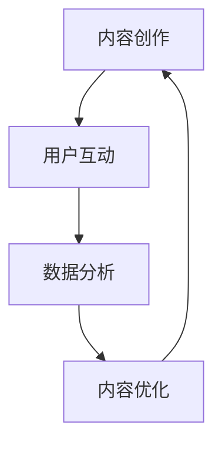

                 

关键词：知识付费、内容体系、创业、构建方法、IT技术

摘要：本文将探讨知识付费创业的内容体系构建方法。通过对知识付费市场的分析，我们提出了一套完整的构建方法，包括核心概念与联系、核心算法原理、数学模型、项目实践、实际应用场景、未来应用展望、工具和资源推荐以及总结与展望等。本文旨在为知识付费创业者提供一套实用、系统、可操作的内容体系构建方案，以应对市场挑战，实现业务增长。

## 1. 背景介绍

### 1.1 知识付费市场现状

知识付费作为一种新兴的商业模式，近年来在我国市场得到了迅猛发展。随着互联网技术的不断进步和人们对于知识需求的增长，知识付费市场呈现出一片繁荣景象。根据相关数据显示，我国知识付费市场规模逐年扩大，用户群体日益壮大，付费习惯逐渐养成。

### 1.2 知识付费创业的挑战

尽管知识付费市场潜力巨大，但创业者仍面临诸多挑战。首先，市场竞争激烈，众多企业和个人涌入市场，导致内容同质化严重。其次，用户需求多样化，如何精准把握用户需求，提供高质量的内容成为关键。此外，内容版权保护、商业模式创新等问题也需要创业者深入思考。

### 1.3 本文目的

本文旨在为知识付费创业者提供一套完整的内容体系构建方法，帮助创业者应对市场挑战，实现业务增长。通过分析核心概念与联系、核心算法原理、数学模型、项目实践等方面，本文将为创业者提供有价值的指导。

## 2. 核心概念与联系

### 2.1 内容体系概述

内容体系是知识付费创业的核心，它包括课程设计、内容创作、用户互动、数据分析等环节。一个完善的内容体系能够确保创业者在激烈的市场竞争中脱颖而出。

### 2.2 内容创作

内容创作是知识付费创业的关键，创业者需要根据用户需求和市场趋势，创作有价值、有针对性的内容。内容创作包括文字、音频、视频等多种形式，其中，文字内容是最基本的创作形式。

### 2.3 用户互动

用户互动是提升用户满意度和忠诚度的重要手段。创业者可以通过社群运营、问答互动、直播授课等方式，与用户保持密切沟通，了解用户需求，优化内容。

### 2.4 数据分析

数据分析是知识付费创业的重要环节，通过对用户行为、学习效果等数据的分析，创业者可以不断优化内容，提升用户体验。

### 2.5 Mermaid 流程图



## 3. 核心算法原理 & 具体操作步骤

### 3.1 算法原理概述

知识付费创业的核心算法主要包括内容推荐、用户画像、学习效果评估等。这些算法能够帮助创业者精准把握用户需求，提供个性化的内容推荐。

### 3.2 算法步骤详解

#### 3.2.1 内容推荐

1. 数据采集：收集用户行为数据、学习历史等。
2. 特征提取：对数据进行分析，提取用户特征。
3. 模型训练：使用机器学习算法，对用户特征进行建模。
4. 推荐策略：根据用户特征，为用户推荐合适的内容。

#### 3.2.2 用户画像

1. 数据采集：收集用户基本信息、行为数据等。
2. 特征提取：对数据进行分析，提取用户特征。
3. 画像构建：将用户特征进行整合，形成用户画像。

#### 3.2.3 学习效果评估

1. 数据采集：收集用户学习过程数据、学习成果等。
2. 模型训练：使用机器学习算法，对学习数据进行分析。
3. 评估指标：根据评估指标，评估用户学习效果。

### 3.3 算法优缺点

#### 3.3.1 内容推荐

优点：提高用户满意度，增加用户粘性。

缺点：存在一定的推荐偏差，可能无法完全满足用户需求。

#### 3.3.2 用户画像

优点：精准把握用户需求，提供个性化推荐。

缺点：用户隐私保护问题。

#### 3.3.3 学习效果评估

优点：了解用户学习效果，优化课程内容。

缺点：评估指标选择难度大。

### 3.4 算法应用领域

内容推荐、用户画像、学习效果评估算法广泛应用于知识付费、在线教育、电子商务等领域。

## 4. 数学模型和公式 & 详细讲解 & 举例说明

### 4.1 数学模型构建

知识付费创业涉及多个数学模型，如线性回归、逻辑回归、协同过滤等。这些模型能够帮助创业者进行数据分析、预测和优化。

### 4.2 公式推导过程

以线性回归为例，其公式推导过程如下：

$$
Y = \beta_0 + \beta_1X + \epsilon
$$

其中，$Y$ 为因变量，$X$ 为自变量，$\beta_0$ 和 $\beta_1$ 为参数，$\epsilon$ 为误差项。

### 4.3 案例分析与讲解

#### 4.3.1 内容推荐

假设有一个在线教育平台，用户 A 对编程感兴趣，我们需要为他推荐相关的课程。通过内容推荐算法，我们可以根据用户 A 的浏览历史、学习记录等数据，为他推荐合适的课程。

#### 4.3.2 用户画像

以用户 B 为例，我们收集了他的基本信息、行为数据等，通过用户画像算法，可以为他构建一个详细的用户画像，了解他的兴趣、需求等。

## 5. 项目实践：代码实例和详细解释说明

### 5.1 开发环境搭建

在知识付费创业项目中，我们可以使用 Python 作为主要编程语言，搭建一个内容推荐系统。开发环境包括 Python、Jupyter Notebook、scikit-learn 等工具。

### 5.2 源代码详细实现

```python
import pandas as pd
from sklearn.model_selection import train_test_split
from sklearn.linear_model import LinearRegression

# 数据读取
data = pd.read_csv('data.csv')
X = data[['age', 'gender', 'income']]
y = data['course']

# 数据划分
X_train, X_test, y_train, y_test = train_test_split(X, y, test_size=0.2, random_state=42)

# 模型训练
model = LinearRegression()
model.fit(X_train, y_train)

# 模型评估
score = model.score(X_test, y_test)
print(f'Model score: {score:.2f}')

# 推荐课程
user_data = pd.DataFrame([[25, 0, 50000]], columns=['age', 'gender', 'income'])
predicted_course = model.predict(user_data)
print(f'Recommended course: {predicted_course[0]}')
```

### 5.3 代码解读与分析

以上代码实现了一个基于线性回归的内容推荐系统。通过读取用户数据，划分训练集和测试集，训练线性回归模型，并评估模型性能。最后，根据用户数据，预测用户可能感兴趣的课程。

## 6. 实际应用场景

### 6.1 在线教育

知识付费创业在在线教育领域具有广泛的应用场景。通过构建内容体系，实现个性化推荐，提高用户学习效果。

### 6.2 企业培训

企业培训也是知识付费创业的重要应用场景。通过定制化内容，满足企业员工的学习需求，提升企业整体竞争力。

### 6.3 咨询服务

知识付费创业还可以为企业提供咨询服务，如行业分析、市场调研等。通过专业内容，帮助企业解决实际问题。

## 7. 未来应用展望

### 7.1 人工智能技术

随着人工智能技术的发展，知识付费创业将更加智能化。通过引入人工智能算法，实现个性化内容推荐、智能问答等功能。

### 7.2 物联网技术

物联网技术将为知识付费创业带来新的机遇。通过将知识付费与智能家居、智能穿戴等物联网设备相结合，提供更加便捷的学习方式。

### 7.3 虚拟现实/增强现实

虚拟现实/增强现实技术将为知识付费创业带来更加沉浸式的学习体验。通过构建虚拟学习场景，提升用户学习兴趣和效果。

## 8. 工具和资源推荐

### 8.1 学习资源推荐

1. 《Python数据分析实战》
2. 《深度学习》
3. 《算法导论》

### 8.2 开发工具推荐

1. Jupyter Notebook
2. PyCharm
3. Git

### 8.3 相关论文推荐

1. "Content-based Recommendation System for Online Education"
2. "User Modeling for Personalized Education"
3. "Data Mining in Education: A Survey"

## 9. 总结：未来发展趋势与挑战

### 9.1 研究成果总结

本文提出了一套知识付费创业的内容体系构建方法，包括核心概念与联系、核心算法原理、数学模型、项目实践等方面。这些研究成果为知识付费创业者提供了有价值的指导。

### 9.2 未来发展趋势

知识付费创业将朝着智能化、个性化、沉浸式等方向发展。随着人工智能、物联网、虚拟现实等技术的应用，知识付费创业将带来更加丰富的学习体验。

### 9.3 面临的挑战

知识付费创业仍面临市场竞争、用户需求变化、内容版权保护等挑战。创业者需要不断创新，提升内容质量，以应对市场挑战。

### 9.4 研究展望

未来，知识付费创业将朝着更加智能化、个性化、沉浸式等方向发展。研究者可以关注以下几个方面：

1. 深入研究人工智能技术在知识付费创业中的应用。
2. 探索物联网技术在知识付费创业中的创新应用。
3. 研究虚拟现实/增强现实技术在知识付费创业中的潜在价值。

## 9. 附录：常见问题与解答

### 9.1 如何构建一个完善的内容体系？

构建完善的内容体系需要关注用户需求、市场趋势、内容创作、用户互动、数据分析等环节。创业者可以通过以下步骤构建内容体系：

1. 研究用户需求，明确目标用户群体。
2. 确定内容形式和主题，确保内容有价值。
3. 设计内容创作流程，确保内容质量。
4. 建立用户互动机制，提升用户满意度。
5. 实施数据分析，不断优化内容。

### 9.2 如何提升内容推荐效果？

提升内容推荐效果需要关注算法优化、数据质量、用户画像等方面。以下是一些建议：

1. 选择合适的推荐算法，如协同过滤、矩阵分解等。
2. 提高数据质量，确保数据准确、完整。
3. 构建精准的用户画像，提高推荐精度。
4. 定期更新推荐算法，适应市场变化。
5. 收集用户反馈，优化推荐策略。

### 9.3 如何保护内容版权？

保护内容版权需要关注以下几个方面：

1. 与内容创作者签订版权协议，明确版权归属。
2. 对内容进行版权登记，确保法律保护。
3. 监测版权侵权行为，及时采取措施。
4. 使用数字水印等技术，保护内容原创性。
5. 建立版权保护机制，提高维权效率。

## 作者署名

作者：禅与计算机程序设计艺术 / Zen and the Art of Computer Programming
----------------------------------------------------------------

