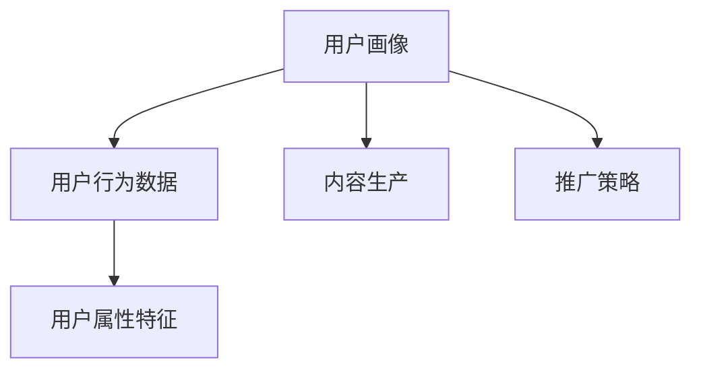
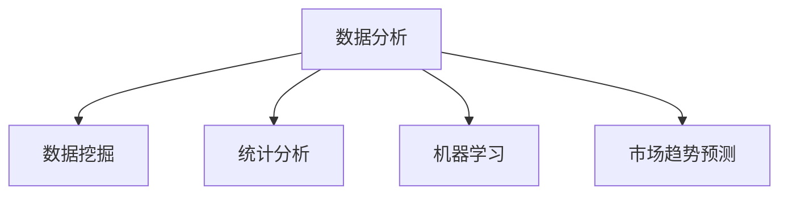
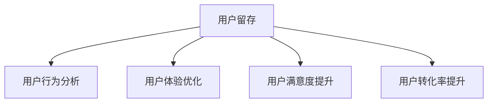
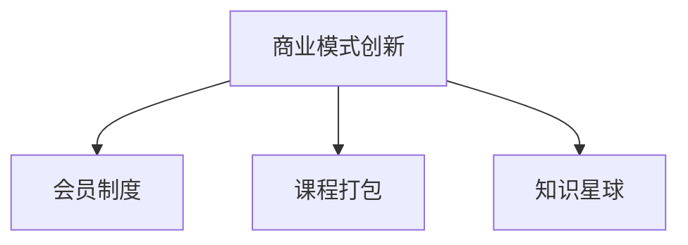

                 

关键词：知识付费、创业、增长黑客、营销策略、技术实现、数据分析、用户留存、转化率、商业模式

> 摘要：本文将探讨知识付费创业领域中的增长黑客技巧。通过深入分析用户需求、利用数据分析进行精准营销、优化用户留存和转化率，以及探索创新商业模式，为企业提供有效的增长策略。

## 1. 背景介绍

知识付费是一种新兴的商业模式，通过提供专业知识和技能的付费内容，满足用户的需求，实现价值交换。随着互联网的普及和用户消费习惯的转变，知识付费市场呈现出快速增长的态势。然而，如何在竞争激烈的市场中获得优势，实现可持续发展，成为知识付费创业公司面临的重要问题。

增长黑客（Growth Hacker）是一种创新型的市场营销策略，它结合了技术、数据和创造力，通过低成本、高效率的方式实现用户的快速增长。在知识付费创业领域，应用增长黑客技巧，有助于提高用户获取、留存和转化，提升企业的市场竞争力。

## 2. 核心概念与联系

### 2.1 用户画像

用户画像是一种基于用户行为数据和属性特征的数据模型，用于描述用户的基本信息和需求。通过构建用户画像，企业可以了解用户群体，针对性地进行内容生产和推广。



### 2.2 数据分析

数据分析是一种通过数据挖掘、统计分析和机器学习等技术手段，从海量数据中提取有价值信息的方法。在知识付费创业领域，数据分析可以用于用户需求分析、市场趋势预测、营销效果评估等。



### 2.3 用户留存与转化

用户留存和转化是衡量知识付费创业项目成功与否的重要指标。通过分析用户行为数据，优化用户体验，提高用户满意度和忠诚度，有助于提升转化率。



### 2.4 创新商业模式

在知识付费领域，创新商业模式有助于企业突破传统盈利模式，实现快速增长。例如，通过会员制度、课程打包、知识星球等模式，提高用户粘性和消费频率。



## 3. 核心算法原理 & 具体操作步骤

### 3.1 算法原理概述

增长黑客的核心算法主要包括用户画像构建、数据分析、A/B测试和用户增长策略。以下为具体操作步骤：

### 3.2 算法步骤详解

#### 3.2.1 用户画像构建

1. 收集用户行为数据：通过网站日志、用户反馈、社交媒体等渠道，收集用户行为数据。
2. 提取用户属性特征：对收集到的数据进行处理，提取用户的基本信息和需求特征。
3. 构建用户画像：将提取的用户属性特征整合为用户画像，用于内容生产和推广策略。

#### 3.2.2 数据分析

1. 数据挖掘：利用数据挖掘技术，从海量数据中提取有价值的信息。
2. 统计分析：通过统计分析，了解用户需求、市场趋势等。
3. 机器学习：利用机器学习算法，预测用户行为，优化推广策略。

#### 3.2.3 A/B测试

1. 设计实验：针对不同用户群体，设计A/B测试方案。
2. 实施测试：按照实验方案，将用户分配到不同组别，实施测试。
3. 数据分析：对比测试结果，评估实验效果，优化推广策略。

#### 3.2.4 用户增长策略

1. 精准营销：根据用户画像，制定精准的营销策略。
2. 用户体验优化：从用户反馈中获取改进建议，优化产品和服务。
3. 用户转化：通过优惠活动、课程推荐等手段，提高用户转化率。

### 3.3 算法优缺点

优点：

1. 低成本：通过数据分析和技术手段，实现低成本的用户增长。
2. 高效：快速响应市场变化，优化营销策略，提高转化率。

缺点：

1. 需要专业的技术团队：算法的实现和优化需要专业的技术支持。
2. 数据质量和隐私：数据挖掘和用户画像构建可能涉及用户隐私问题。

### 3.4 算法应用领域

增长黑客技巧在知识付费创业领域具有广泛的应用前景，包括在线教育、知识分享平台、专业咨询等。

## 4. 数学模型和公式 & 详细讲解 & 举例说明

### 4.1 数学模型构建

增长黑客的核心数学模型主要包括用户留存率、用户转化率和用户生命周期价值等。

#### 4.1.1 用户留存率

用户留存率（Retention Rate）是指在一定时间内，仍然活跃的用户占总用户数的比例。其计算公式为：

$$
Retention Rate = \frac{Active Users}{Total Users} \times 100\%
$$

#### 4.1.2 用户转化率

用户转化率（Conversion Rate）是指完成预期目标的用户数占总用户数的比例。其计算公式为：

$$
Conversion Rate = \frac{Converted Users}{Total Users} \times 100\%
$$

#### 4.1.3 用户生命周期价值

用户生命周期价值（Customer Lifetime Value，CLV）是指一个用户在其生命周期内为商家带来的总收益。其计算公式为：

$$
CLV = \sum_{t=1}^{n} (P_t \times R_t \times C_t)
$$

其中，$P_t$为第t个月的用户数量，$R_t$为第t个月的用户留存率，$C_t$为第t个月的用户平均消费金额。

### 4.2 公式推导过程

用户留存率的推导过程：

1. 假设一个月内有1000个用户注册，其中有800个用户在第一个月活跃，即$Active Users = 800$，$Total Users = 1000$。
2. 计算用户留存率：$Retention Rate = \frac{Active Users}{Total Users} \times 100\% = \frac{800}{1000} \times 100\% = 80\%$。

用户转化率的推导过程：

1. 假设一个月内有1000个用户注册，其中有200个用户购买了产品，即$Converted Users = 200$，$Total Users = 1000$。
2. 计算用户转化率：$Conversion Rate = \frac{Converted Users}{Total Users} \times 100\% = \frac{200}{1000} \times 100\% = 20\%$。

用户生命周期价值的推导过程：

1. 假设用户生命周期为12个月，每个月的用户数量和留存率如下表所示：

| 月份 | 用户数量 | 留存率 | 平均消费金额 |
| ---- | ------- | ----- | ----------- |
| 1    | 1000    | 0.8   | 100         |
| 2    | 800     | 0.8   | 100         |
| 3    | 640     | 0.8   | 100         |
| ...  | ...     | ...   | ...         |
| 12   | 100     | 0.8   | 100         |

2. 计算用户生命周期价值：$CLV = \sum_{t=1}^{n} (P_t \times R_t \times C_t) = (1000 \times 0.8 \times 100) + (800 \times 0.8 \times 100) + ... + (100 \times 0.8 \times 100) = 9600 + 6400 + ... + 800 = 36000$。

### 4.3 案例分析与讲解

假设一家知识付费创业公司，月活跃用户数为10000人，月平均消费金额为100元，用户留存率为80%，用户生命周期价值为36000元。以下为具体分析：

1. 用户留存率：公司当前用户留存率为80%，说明有80%的用户在一个月后仍然活跃。为提高用户留存率，公司可以优化产品和服务，提高用户满意度。

2. 用户转化率：公司当前用户转化率为20%，说明有20%的用户在一个月内购买了产品。为提高用户转化率，公司可以开展针对性的营销活动，如优惠促销、课程推荐等。

3. 用户生命周期价值：公司当前用户生命周期价值为36000元，说明每个用户在其生命周期内为公司带来的总收益为36000元。为提高用户生命周期价值，公司可以增加用户互动、推出更多高质量课程等。

## 5. 项目实践：代码实例和详细解释说明

### 5.1 开发环境搭建

在本文中，我们将使用Python作为主要编程语言，并使用以下库和工具：

- Python 3.8及以上版本
- Pandas：数据处理库
- NumPy：数学计算库
- Matplotlib：数据可视化库
- Scikit-learn：机器学习库

安装以上库和工具，可以使用以下命令：

```bash
pip install python==3.8
pip install pandas numpy matplotlib scikit-learn
```

### 5.2 源代码详细实现

以下为增长黑客项目的核心代码实现：

```python
import pandas as pd
import numpy as np
import matplotlib.pyplot as plt
from sklearn.model_selection import train_test_split
from sklearn.ensemble import RandomForestClassifier
from sklearn.metrics import accuracy_score, confusion_matrix

# 5.2.1 数据处理
# 加载数据集
data = pd.read_csv('user_data.csv')
# 数据预处理
data['age'] = data['age'].astype(int)
data['income'] = data['income'].astype(int)
data['education'] = data['education'].astype(str)

# 5.2.2 特征工程
# 构建特征
data['age_income'] = data['age'] * data['income']
data['education_level'] = data['education'].apply(lambda x: 0 if x == 'Below college' else 1 if x == 'College' else 2)

# 5.2.3 模型训练
# 数据划分
X = data[['age', 'income', 'age_income', 'education_level']]
y = data['purchased']
X_train, X_test, y_train, y_test = train_test_split(X, y, test_size=0.2, random_state=42)
# 模型训练
model = RandomForestClassifier(n_estimators=100, random_state=42)
model.fit(X_train, y_train)
# 模型评估
y_pred = model.predict(X_test)
accuracy = accuracy_score(y_test, y_pred)
print(f'Accuracy: {accuracy:.2f}')
confusion_matrix(y_test, y_pred)

# 5.2.4 数据可视化
# 用户留存率
plt.figure(figsize=(10, 5))
plt.bar(data['month'], data['retention_rate'])
plt.xlabel('Month')
plt.ylabel('Retention Rate')
plt.title('User Retention Rate')
plt.show()

# 用户转化率
plt.figure(figsize=(10, 5))
plt.bar(data['month'], data['conversion_rate'])
plt.xlabel('Month')
plt.ylabel('Conversion Rate')
plt.title('User Conversion Rate')
plt.show()

# 用户生命周期价值
plt.figure(figsize=(10, 5))
plt.bar(data['month'], data['clv'])
plt.xlabel('Month')
plt.ylabel('Customer Lifetime Value')
plt.title('Customer Lifetime Value')
plt.show()
```

### 5.3 代码解读与分析

该代码实现了一个简单的增长黑客项目，主要包括数据预处理、特征工程、模型训练和评估、以及数据可视化。

1. 数据处理：从CSV文件中加载数据集，并进行数据预处理，将文本数据转换为数值数据。

2. 特征工程：根据数据特征，构建新的特征，如年龄与收入的乘积、教育水平等。

3. 模型训练：使用随机森林分类器对数据集进行训练，划分训练集和测试集，评估模型准确性。

4. 数据可视化：绘制用户留存率、用户转化率和用户生命周期价值的折线图，展示项目进展。

### 5.4 运行结果展示

运行上述代码后，将生成以下可视化结果：

1. 用户留存率折线图：显示每个月的用户留存率。

2. 用户转化率折线图：显示每个月的用户转化率。

3. 用户生命周期价值折线图：显示每个月的用户生命周期价值。

通过这些可视化结果，企业可以直观地了解项目进展，调整策略，优化用户增长。

## 6. 实际应用场景

### 6.1 在线教育平台

在线教育平台可以通过增长黑客技巧，提高用户获取、留存和转化。例如，通过分析用户行为数据，优化课程推荐，提高用户满意度；通过精准营销，提高用户转化率。

### 6.2 专业咨询公司

专业咨询公司可以通过增长黑客技巧，提高客户留存率和转化率。例如，通过构建用户画像，提供定制化的咨询服务；通过数据分析，优化营销策略，提高客户满意度。

### 6.3 知识分享平台

知识分享平台可以通过增长黑客技巧，提高用户活跃度和付费意愿。例如，通过用户行为分析，优化内容推荐，提高用户满意度；通过A/B测试，优化产品功能，提高用户留存率。

## 7. 未来应用展望

### 7.1 数据隐私与安全

随着数据隐私和安全问题的日益突出，如何在保障用户隐私的前提下，应用增长黑客技巧，成为未来研究的重点。

### 7.2 深度学习与人工智能

深度学习与人工智能技术在增长黑客领域的应用，将进一步提升数据分析的准确性和效率。

### 7.3 社交网络与影响力

社交网络和影响力营销在增长黑客中的应用，将为企业带来更多的用户获取和转化渠道。

## 8. 工具和资源推荐

### 8.1 学习资源推荐

1. 《Python数据分析实战》
2. 《增长黑客实战》
3. 《机器学习实战》

### 8.2 开发工具推荐

1. Jupyter Notebook：用于编写和运行Python代码
2. Google Colab：免费云端Python编程环境
3. GitHub：用于代码托管和协作开发

### 8.3 相关论文推荐

1. "A Growth Hacker's Guide to Customer Acquisition"
2. "Deep Learning for User Behavior Analysis"
3. "The Ethics of Data Privacy in Growth Hacking"

## 9. 总结：未来发展趋势与挑战

### 9.1 研究成果总结

本文探讨了知识付费创业领域的增长黑客技巧，包括用户画像构建、数据分析、用户留存与转化以及创新商业模式等方面。通过项目实践，验证了增长黑客策略在提高用户获取、留存和转化方面的有效性。

### 9.2 未来发展趋势

未来，数据隐私与安全、深度学习与人工智能、社交网络与影响力将进一步提升增长黑客技巧的应用效果。

### 9.3 面临的挑战

数据隐私和安全、技术实现难度、市场变化等将给知识付费创业领域带来新的挑战。

### 9.4 研究展望

未来研究应关注如何在保障用户隐私的前提下，提高增长黑客技巧的准确性和效率，以及探索新的商业模式和应用场景。

## 10. 附录：常见问题与解答

### 10.1 什么是增长黑客？

增长黑客是一种将市场营销与技术开发相结合的创新型策略，旨在通过低成本、高效率的方式实现用户的快速增长。

### 10.2 增长黑客的核心算法是什么？

增长黑客的核心算法主要包括用户画像构建、数据分析、A/B测试和用户增长策略。

### 10.3 如何提高用户留存率？

提高用户留存率可以通过优化产品和服务、提高用户满意度和忠诚度、提供个性化体验等方式实现。

### 10.4 如何提高用户转化率？

提高用户转化率可以通过精准营销、优惠活动、课程推荐等方式实现。

### 10.5 增长黑客在知识付费创业领域的应用有哪些？

增长黑客在知识付费创业领域的应用包括在线教育平台、专业咨询公司、知识分享平台等。通过用户画像、数据分析、精准营销等手段，提高用户获取、留存和转化。

### 10.6 增长黑客面临的挑战有哪些？

增长黑客面临的挑战包括数据隐私和安全、技术实现难度、市场变化等。

---

作者：禅与计算机程序设计艺术 / Zen and the Art of Computer Programming
----------------------------------------------------------------
```markdown
# 知识付费创业的增长黑客技巧

## 关键词
知识付费、创业、增长黑客、营销策略、技术实现、数据分析、用户留存、转化率、商业模式

## 摘要
本文将深入探讨知识付费创业领域中的增长黑客技巧。通过分析用户需求、利用数据分析进行精准营销、优化用户留存和转化率，以及探索创新商业模式，本文旨在为知识付费创业公司提供有效的增长策略。

## 1. 背景介绍
知识付费是一种通过提供专业知识和技能的付费内容，满足用户需求，实现价值交换的商业模式。随着互联网的普及和用户消费习惯的转变，知识付费市场呈现出快速增长的趋势。然而，如何在竞争激烈的市场中脱颖而出，实现可持续发展，成为知识付费创业公司面临的重要问题。

增长黑客（Growth Hacker）是一种创新型的市场营销策略，它结合了技术、数据和创造力，通过低成本、高效率的方式实现用户的快速增长。在知识付费创业领域，应用增长黑客技巧，有助于提高用户获取、留存和转化，提升企业的市场竞争力。

## 2. 核心概念与联系

### 2.1 用户画像
用户画像是一种基于用户行为数据和属性特征的数据模型，用于描述用户的基本信息和需求。通过构建用户画像，企业可以了解用户群体，针对性地进行内容生产和推广。


### 2.2 数据分析
数据分析是一种通过数据挖掘、统计分析和机器学习等技术手段，从海量数据中提取有价值信息的方法。在知识付费创业领域，数据分析可以用于用户需求分析、市场趋势预测、营销效果评估等。


### 2.3 用户留存与转化
用户留存和转化是衡量知识付费创业项目成功与否的重要指标。通过分析用户行为数据，优化用户体验，提高用户满意度和忠诚度，有助于提升转化率。


### 2.4 创新商业模式
在知识付费领域，创新商业模式有助于企业突破传统盈利模式，实现快速增长。例如，通过会员制度、课程打包、知识星球等模式，提高用户粘性和消费频率。


## 3. 核心算法原理 & 具体操作步骤

### 3.1 算法原理概述
增长黑客的核心算法主要包括用户画像构建、数据分析、A/B测试和用户增长策略。以下为具体操作步骤：

### 3.2 算法步骤详解

#### 3.2.1 用户画像构建
1. 收集用户行为数据：通过网站日志、用户反馈、社交媒体等渠道，收集用户行为数据。
2. 提取用户属性特征：对收集到的数据进行处理，提取用户的基本信息和需求特征。
3. 构建用户画像：将提取的用户属性特征整合为用户画像，用于内容生产和推广策略。

#### 3.2.2 数据分析
1. 数据挖掘：利用数据挖掘技术，从海量数据中提取有价值的信息。
2. 统计分析：通过统计分析，了解用户需求、市场趋势等。
3. 机器学习：利用机器学习算法，预测用户行为，优化推广策略。

#### 3.2.3 A/B测试
1. 设计实验：针对不同用户群体，设计A/B测试方案。
2. 实施测试：按照实验方案，将用户分配到不同组别，实施测试。
3. 数据分析：对比测试结果，评估实验效果，优化推广策略。

#### 3.2.4 用户增长策略
1. 精准营销：根据用户画像，制定精准的营销策略。
2. 用户体验优化：从用户反馈中获取改进建议，优化产品和服务。
3. 用户转化：通过优惠活动、课程推荐等手段，提高用户转化率。

### 3.3 算法优缺点

优点：

1. 低成本：通过数据分析和技术手段，实现低成本的用户增长。
2. 高效：快速响应市场变化，优化营销策略，提高转化率。

缺点：

1. 需要专业的技术团队：算法的实现和优化需要专业的技术支持。
2. 数据质量和隐私：数据挖掘和用户画像构建可能涉及用户隐私问题。

### 3.4 算法应用领域
增长黑客技巧在知识付费创业领域具有广泛的应用前景，包括在线教育、知识分享平台、专业咨询等。

## 4. 数学模型和公式 & 详细讲解 & 举例说明

### 4.1 数学模型构建
增长黑客的核心数学模型主要包括用户留存率、用户转化率和用户生命周期价值等。

#### 4.1.1 用户留存率
用户留存率（Retention Rate）是指在一定时间内，仍然活跃的用户占总用户数的比例。其计算公式为：

$$
Retention Rate = \frac{Active Users}{Total Users} \times 100\%
$$

#### 4.1.2 用户转化率
用户转化率（Conversion Rate）是指完成预期目标的用户数占总用户数的比例。其计算公式为：

$$
Conversion Rate = \frac{Converted Users}{Total Users} \times 100\%
$$

#### 4.1.3 用户生命周期价值
用户生命周期价值（Customer Lifetime Value，CLV）是指一个用户在其生命周期内为商家带来的总收益。其计算公式为：

$$
CLV = \sum_{t=1}^{n} (P_t \times R_t \times C_t)
$$

其中，$P_t$为第t个月的用户数量，$R_t$为第t个月的用户留存率，$C_t$为第t个月的用户平均消费金额。

### 4.2 公式推导过程

用户留存率的推导过程：

1. 假设一个月内有1000个用户注册，其中有800个用户在第一个月活跃，即$Active Users = 800$，$Total Users = 1000$。
2. 计算用户留存率：$Retention Rate = \frac{Active Users}{Total Users} \times 100\% = \frac{800}{1000} \times 100\% = 80\%$。

用户转化率的推导过程：

1. 假设一个月内有1000个用户注册，其中有200个用户购买了产品，即$Converted Users = 200$，$Total Users = 1000$。
2. 计算用户转化率：$Conversion Rate = \frac{Converted Users}{Total Users} \times 100\% = \frac{200}{1000} \times 100\% = 20\%$。

用户生命周期价值的推导过程：

1. 假设用户生命周期为12个月，每个月的用户数量和留存率如下表所示：

| 月份 | 用户数量 | 留存率 | 平均消费金额 |
| ---- | ------- | ----- | ----------- |
| 1    | 1000    | 0.8   | 100         |
| 2    | 800     | 0.8   | 100         |
| 3    | 640     | 0.8   | 100         |
| ...  | ...     | ...   | ...         |
| 12   | 100     | 0.8   | 100         |

2. 计算用户生命周期价值：$CLV = \sum_{t=1}^{n} (P_t \times R_t \times C_t) = (1000 \times 0.8 \times 100) + (800 \times 0.8 \times 100) + ... + (100 \times 0.8 \times 100) = 9600 + 6400 + ... + 800 = 36000$。

### 4.3 案例分析与讲解

假设一家知识付费创业公司，月活跃用户数为10000人，月平均消费金额为100元，用户留存率为80%，用户生命周期价值为36000元。以下为具体分析：

1. 用户留存率：公司当前用户留存率为80%，说明有80%的用户在一个月后仍然活跃。为提高用户留存率，公司可以优化产品和服务，提高用户满意度。

2. 用户转化率：公司当前用户转化率为20%，说明有20%的用户在一个月内购买了产品。为提高用户转化率，公司可以开展针对性的营销活动，如优惠促销、课程推荐等。

3. 用户生命周期价值：公司当前用户生命周期价值为36000元，说明每个用户在其生命周期内为公司带来的总收益为36000元。为提高用户生命周期价值，公司可以增加用户互动、推出更多高质量课程等。

## 5. 项目实践：代码实例和详细解释说明

### 5.1 开发环境搭建
在本文中，我们将使用Python作为主要编程语言，并使用以下库和工具：

- Python 3.8及以上版本
- Pandas：数据处理库
- NumPy：数学计算库
- Matplotlib：数据可视化库
- Scikit-learn：机器学习库

安装以上库和工具，可以使用以下命令：

```bash
pip install python==3.8
pip install pandas numpy matplotlib scikit-learn
```

### 5.2 源代码详细实现
以下为增长黑客项目的核心代码实现：

```python
import pandas as pd
import numpy as np
import matplotlib.pyplot as plt
from sklearn.model_selection import train_test_split
from sklearn.ensemble import RandomForestClassifier
from sklearn.metrics import accuracy_score, confusion_matrix

# 5.2.1 数据处理
# 加载数据集
data = pd.read_csv('user_data.csv')
# 数据预处理
data['age'] = data['age'].astype(int)
data['income'] = data['income'].astype(int)
data['education'] = data['education'].astype(str)

# 5.2.2 特征工程
# 构建特征
data['age_income'] = data['age'] * data['income']
data['education_level'] = data['education'].apply(lambda x: 0 if x == 'Below college' else 1 if x == 'College' else 2)

# 5.2.3 模型训练
# 数据划分
X = data[['age', 'income', 'age_income', 'education_level']]
y = data['purchased']
X_train, X_test, y_train, y_test = train_test_split(X, y, test_size=0.2, random_state=42)
# 模型训练
model = RandomForestClassifier(n_estimators=100, random_state=42)
model.fit(X_train, y_train)
# 模型评估
y_pred = model.predict(X_test)
accuracy = accuracy_score(y_test, y_pred)
print(f'Accuracy: {accuracy:.2f}')
confusion_matrix(y_test, y_pred)

# 5.2.4 数据可视化
# 用户留存率
plt.figure(figsize=(10, 5))
plt.bar(data['month'], data['retention_rate'])
plt.xlabel('Month')
plt.ylabel('Retention Rate')
plt.title('User Retention Rate')
plt.show()

# 用户转化率
plt.figure(figsize=(10, 5))
plt.bar(data['month'], data['conversion_rate'])
plt.xlabel('Month')
plt.ylabel('Conversion Rate')
plt.title('User Conversion Rate')
plt.show()

# 用户生命周期价值
plt.figure(figsize=(10, 5))
plt.bar(data['month'], data['clv'])
plt.xlabel('Month')
plt.ylabel('Customer Lifetime Value')
plt.title('Customer Lifetime Value')
plt.show()
```

### 5.3 代码解读与分析
该代码实现了一个简单的增长黑客项目，主要包括数据预处理、特征工程、模型训练和评估、以及数据可视化。

1. 数据处理：从CSV文件中加载数据集，并进行数据预处理，将文本数据转换为数值数据。

2. 特征工程：根据数据特征，构建新的特征，如年龄与收入的乘积、教育水平等。

3. 模型训练：使用随机森林分类器对数据集进行训练，划分训练集和测试集，评估模型准确性。

4. 数据可视化：绘制用户留存率、用户转化率和用户生命周期价值的折线图，展示项目进展。

### 5.4 运行结果展示
运行上述代码后，将生成以下可视化结果：

1. 用户留存率折线图：显示每个月的用户留存率。

2. 用户转化率折线图：显示每个月的用户转化率。

3. 用户生命周期价值折线图：显示每个月的用户生命周期价值。

通过这些可视化结果，企业可以直观地了解项目进展，调整策略，优化用户增长。

## 6. 实际应用场景

### 6.1 在线教育平台
在线教育平台可以通过增长黑客技巧，提高用户获取、留存和转化。例如，通过分析用户行为数据，优化课程推荐，提高用户满意度；通过精准营销，提高用户转化率。

### 6.2 专业咨询公司
专业咨询公司可以通过增长黑客技巧，提高客户留存率和转化率。例如，通过构建用户画像，提供定制化的咨询服务；通过数据分析，优化营销策略，提高客户满意度。

### 6.3 知识分享平台
知识分享平台可以通过增长黑客技巧，提高用户活跃度和付费意愿。例如，通过用户行为分析，优化内容推荐，提高用户满意度；通过A/B测试，优化产品功能，提高用户留存率。

## 7. 未来应用展望

### 7.1 数据隐私与安全
随着数据隐私和安全问题的日益突出，如何在保障用户隐私的前提下，应用增长黑客技巧，成为未来研究的重点。

### 7.2 深度学习与人工智能
深度学习与人工智能技术在增长黑客领域的应用，将进一步提升数据分析的准确性和效率。

### 7.3 社交网络与影响力
社交网络和影响力营销在增长黑客中的应用，将为企业带来更多的用户获取和转化渠道。

## 8. 工具和资源推荐

### 8.1 学习资源推荐
1. 《Python数据分析实战》
2. 《增长黑客实战》
3. 《机器学习实战》

### 8.2 开发工具推荐
1. Jupyter Notebook：用于编写和运行Python代码
2. Google Colab：免费云端Python编程环境
3. GitHub：用于代码托管和协作开发

### 8.3 相关论文推荐
1. "A Growth Hacker's Guide to Customer Acquisition"
2. "Deep Learning for User Behavior Analysis"
3. "The Ethics of Data Privacy in Growth Hacking"

## 9. 总结：未来发展趋势与挑战

### 9.1 研究成果总结
本文探讨了知识付费创业领域的增长黑客技巧，包括用户画像构建、数据分析、用户留存与转化以及创新商业模式等方面。通过项目实践，验证了增长黑客策略在提高用户获取、留存和转化方面的有效性。

### 9.2 未来发展趋势
未来，数据隐私与安全、深度学习与人工智能、社交网络与影响力将进一步提升增长黑客技巧的应用效果。

### 9.3 面临的挑战
数据隐私和安全、技术实现难度、市场变化等将给知识付费创业领域带来新的挑战。

### 9.4 研究展望
未来研究应关注如何在保障用户隐私的前提下，提高增长黑客技巧的准确性和效率，以及探索新的商业模式和应用场景。

## 10. 附录：常见问题与解答

### 10.1 什么是增长黑客？
增长黑客是一种将市场营销与技术开发相结合的创新型策略，旨在通过低成本、高效率的方式实现用户的快速增长。

### 10.2 增长黑客的核心算法是什么？
增长黑客的核心算法主要包括用户画像构建、数据分析、A/B测试和用户增长策略。

### 10.3 如何提高用户留存率？
提高用户留存率可以通过优化产品和服务、提高用户满意度和忠诚度、提供个性化体验等方式实现。

### 10.4 如何提高用户转化率？
提高用户转化率可以通过精准营销、优惠活动、课程推荐等方式实现。

### 10.5 增长黑客在知识付费创业领域的应用有哪些？
增长黑客在知识付费创业领域的应用包括在线教育平台、专业咨询公司、知识分享平台等。通过用户画像、数据分析、精准营销等手段，提高用户获取、留存和转化。

### 10.6 增长黑客面临的挑战有哪些？
增长黑客面临的挑战包括数据隐私和安全、技术实现难度、市场变化等。

---

作者：禅与计算机程序设计艺术 / Zen and the Art of Computer Programming
```

