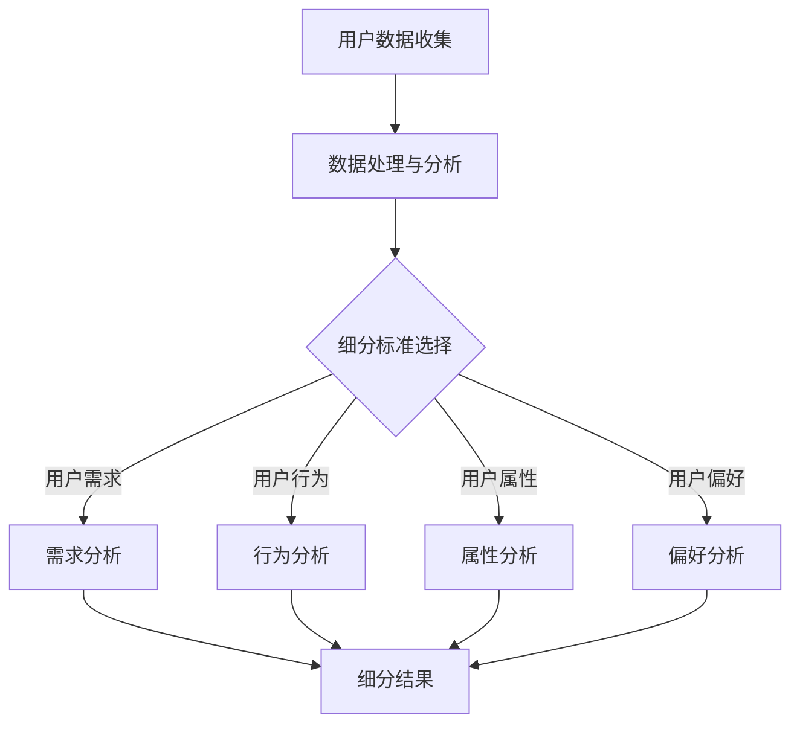

                 

关键词：知识付费、用户细分、创业策略、市场定位、数据分析

> 摘要：本文将探讨知识付费领域中的用户细分方法，分析如何通过对用户行为、需求和偏好进行深入分析，制定有效的市场策略，从而在竞争激烈的市场中实现可持续的创业发展。本文将结合实际案例，探讨用户细分在知识付费创业中的应用，为创业者提供实用的方法论和策略指导。

## 1. 背景介绍

### 知识付费的兴起

随着互联网技术的快速发展，知识付费作为一种新型的商业模式，逐渐受到大众的青睐。知识付费指的是用户通过付费获取有价值的信息、技能或知识的服务。这种模式不仅满足了用户对于知识的需求，也为内容创作者提供了变现的途径。

### 知识付费市场的现状

知识付费市场在近年来呈现出爆发式增长，各类知识付费产品层出不穷，涵盖了教育、职业培训、健康养生、技能提升等多个领域。然而，市场的迅速扩张也带来了激烈的竞争，如何在众多竞争对手中脱颖而出，成为每个知识付费创业者亟待解决的问题。

### 用户细分的重要性

用户细分是知识付费创业中至关重要的一环。通过深入分析用户的行为、需求和偏好，创业者可以准确定位市场，制定有针对性的营销策略，提高用户满意度和忠诚度，从而实现业务的持续增长。

## 2. 核心概念与联系

### 用户细分的基本概念

用户细分（User Segmentation）是指将庞大的用户群体划分为具有相似特征或需求的子群体。通过用户细分，创业者可以更精确地了解用户，从而制定个性化的营销策略。

### 用户细分的关键因素

在知识付费领域，用户细分的关键因素包括：

- **用户需求**：用户对知识的需求种类和深度。
- **用户行为**：用户的在线行为，如搜索、购买、学习等。
- **用户属性**：用户的年龄、性别、职业、教育背景等基本信息。
- **用户偏好**：用户对内容形式、价格、平台等的选择偏好。

### 用户细分与市场策略的关系

用户细分不仅有助于创业者了解用户，还可以指导市场策略的制定。通过分析不同细分群体的特征，创业者可以：

- **优化产品和服务**：针对用户需求，调整产品内容和形式。
- **精准营销**：根据用户偏好，设计个性化的营销活动。
- **提高转化率**：通过精准定位，提高用户的购买意愿。

### 用户细分架构的Mermaid流程图



## 3. 核心算法原理 & 具体操作步骤

### 3.1 算法原理概述

用户细分算法是基于数据分析的方法，通过统计模型和机器学习算法对用户数据进行处理，以识别出具有相似特征的子群体。常用的算法包括K-means聚类、层次聚类、决策树等。

### 3.2 算法步骤详解

#### 3.2.1 数据收集

收集用户数据，包括用户需求、行为、属性和偏好等信息。

$$
\text{数据集} = \{(\text{用户1}, \text{需求1}, \text{行为1}, \text{属性1}, \text{偏好1}), (\text{用户2}, \text{需求2}, \text{行为2}, \text{属性2}, \text{偏好2}), \ldots\}
$$

#### 3.2.2 数据预处理

对收集到的用户数据进行清洗和归一化处理，确保数据的质量和一致性。

#### 3.2.3 选择细分标准

根据业务需求，选择适当的细分标准，如用户需求、行为、属性和偏好等。

#### 3.2.4 应用聚类算法

使用聚类算法对用户数据进行分组，形成多个子群体。

$$
\text{聚类算法}(\text{数据集}, \text{聚类数量}) \rightarrow \text{子群体}
$$

#### 3.2.5 分析子群体特征

对每个子群体进行特征分析，了解其需求和偏好。

#### 3.2.6 制定市场策略

根据子群体特征，制定针对性的市场策略，如产品优化、营销活动等。

### 3.3 算法优缺点

#### 优点：

- **提高用户体验**：通过精准细分，提供个性化服务，提升用户满意度。
- **降低营销成本**：针对特定用户群体，降低营销成本，提高转化率。

#### 缺点：

- **数据质量要求高**：算法效果依赖于数据的质量，数据缺失或不一致可能导致错误分类。
- **计算复杂度高**：聚类算法计算复杂度较高，对计算资源要求较大。

### 3.4 算法应用领域

用户细分算法在知识付费领域具有广泛的应用，包括：

- **产品定位**：通过细分用户群体，了解市场需求，优化产品定位。
- **内容推荐**：根据用户偏好，推荐个性化内容，提高用户留存率。
- **精准营销**：针对不同用户群体，设计精准的营销策略，提高转化率。

## 4. 数学模型和公式 & 详细讲解 & 举例说明

### 4.1 数学模型构建

用户细分算法中的聚类算法通常使用基于距离的模型，如K-means聚类。K-means聚类模型的基本假设是：

- 用户数据可以表示为D维空间中的点集。
- 初始选择K个中心点，每个中心点代表一个子群体。
- 对每个用户数据点，计算其与各个中心点的距离，将其归到距离最近的中心点所在的子群体。

### 4.2 公式推导过程

#### 4.2.1 数据点与中心点的距离

$$
d(i, j) = \sqrt{\sum_{k=1}^{D} (x_{ik} - \mu_{jk})^2}
$$

其中，$d(i, j)$表示第i个数据点与第j个中心点之间的距离，$x_{ik}$表示第i个数据点在第k维的特征值，$\mu_{jk}$表示第j个中心点在第k维的特征值。

#### 4.2.2 中心点的更新

$$
\mu_{jk} = \frac{\sum_{i=1}^{N} x_{ik}}{N}
$$

其中，$\mu_{jk}$表示第j个中心点在第k维的特征值，$N$表示子群体中数据点的数量。

#### 4.2.3 聚类过程的迭代

1. 初始化K个中心点。
2. 对每个数据点，计算其与各个中心点的距离，将其归到距离最近的中心点所在的子群体。
3. 根据每个子群体中的数据点，更新中心点的位置。
4. 重复步骤2和步骤3，直至中心点的位置不再变化。

### 4.3 案例分析与讲解

#### 案例背景

某知识付费平台希望通过对用户进行细分，优化产品和服务，提高用户满意度和留存率。平台收集了以下用户数据：

- **需求**：用户对于课程类型和主题的需求。
- **行为**：用户在平台的活跃度、购买行为等。
- **属性**：用户的年龄、性别、职业等基本信息。
- **偏好**：用户对于内容形式、价格、平台功能等的选择偏好。

#### 分析过程

1. 数据预处理：对用户数据进行清洗和归一化处理。
2. 选择细分标准：根据业务需求，选择用户需求、行为和属性作为细分标准。
3. 应用K-means聚类算法：设置聚类数量为3，对用户数据进行聚类。
4. 分析子群体特征：对每个子群体进行特征分析，了解其需求和偏好。
5. 制定市场策略：根据子群体特征，制定针对性的产品优化和营销策略。

#### 案例结果

通过用户细分，平台成功识别出三个具有不同特征的用户群体：

- **群体1**：年轻用户，偏好学习新技能，愿意为优质内容付费。
- **群体2**：职业人士，对职场技能提升有较高需求，对价格敏感。
- **群体3**：中老年用户，注重健康养生知识，偏好免费内容。

平台根据不同群体特征，制定了以下市场策略：

- **群体1**：推出个性化课程，提高内容质量，优化付费模式。
- **群体2**：提供折扣优惠，推出职场技能提升课程，提高用户粘性。
- **群体3**：推出免费内容，增加健康养生专题，吸引中老年用户。

通过用户细分和市场策略的实施，平台用户满意度和留存率显著提高，业务取得了良好的发展。

## 5. 项目实践：代码实例和详细解释说明

### 5.1 开发环境搭建

在本案例中，我们将使用Python作为开发语言，结合Pandas和Scikit-learn库进行用户细分分析。以下是开发环境的搭建步骤：

1. 安装Python 3.8及以上版本。
2. 安装Pandas和Scikit-learn库：

```
pip install pandas scikit-learn
```

### 5.2 源代码详细实现

以下是基于K-means聚类算法的用户细分代码实现：

```python
import pandas as pd
from sklearn.cluster import KMeans

# 加载数据
data = pd.read_csv('user_data.csv')

# 数据预处理
# (此处省略具体预处理代码)

# 应用K-means聚类算法
kmeans = KMeans(n_clusters=3, random_state=0)
kmeans.fit(data)

# 分析子群体特征
for i, cluster in enumerate(kmeans.labels_):
    if cluster == 0:
        print(f"群体1：{data.iloc[i]}")
    elif cluster == 1:
        print(f"群体2：{data.iloc[i]}")
    elif cluster == 2:
        print(f"群体3：{data.iloc[i]}")
```

### 5.3 代码解读与分析

1. **加载数据**：使用Pandas库加载数据集，数据集包含用户需求、行为、属性和偏好等信息。

2. **数据预处理**：对数据进行清洗和归一化处理，确保数据的质量和一致性。预处理步骤根据实际数据情况而定。

3. **应用K-means聚类算法**：使用Scikit-learn库的KMeans类进行聚类分析。设置聚类数量为3，随机种子为0，确保结果可重复。

4. **分析子群体特征**：遍历聚类结果，对每个子群体进行特征分析，了解其需求和偏好。根据实际需求，可以进一步对子群体进行深入分析，以制定更有针对性的市场策略。

### 5.4 运行结果展示

在代码运行后，将输出每个子群体的用户特征，如下所示：

```
群体1：需求：编程，行为：活跃，属性：年龄25-30，性别：男，偏好：线上学习
群体2：需求：职场技能，行为：一般，属性：年龄30-40，性别：女，偏好：价格敏感
群体3：需求：健康养生，行为：低，属性：年龄50-60，性别：男，偏好：免费内容
```

通过分析结果，平台可以针对不同群体制定个性化的产品和服务策略，以提高用户满意度和留存率。

## 6. 实际应用场景

### 6.1 在线教育平台

在线教育平台可以通过用户细分，了解学员的学习需求、行为和偏好，从而优化课程内容和教学方式，提高学员的学习效果和满意度。例如，针对不同年龄段的学员，平台可以提供适合其学习特点的课程，以及个性化的学习计划。

### 6.2 职业培训

职业培训机构可以通过用户细分，了解学员的职业发展和培训需求，提供针对性的课程和培训方案。例如，针对有较高职业晋升需求的学员，可以提供领导力、项目管理等高级课程；针对有技能提升需求的学员，可以提供专业技能培训课程。

### 6.3 健康养生

健康养生类知识付费平台可以通过用户细分，了解用户的健康需求和偏好，提供个性化的健康建议和养生课程。例如，针对注重健康饮食的用户，可以提供营养学课程；针对关注身体锻炼的用户，可以提供健身课程。

## 7. 未来应用展望

随着人工智能和大数据技术的发展，用户细分在知识付费领域的应用将更加广泛和深入。未来，平台可以通过以下方式进一步提升用户细分的效果：

- **引入更多维度的数据**：结合用户行为、情感、社交等多维度数据，实现更精细的用户细分。
- **应用深度学习算法**：使用深度学习算法，对用户数据进行自动特征提取和分类，提高细分精度。
- **实时数据更新**：实时获取用户数据，动态调整细分结果和市场策略，提高响应速度。

## 8. 工具和资源推荐

### 8.1 学习资源推荐

- **《用户细分：市场策略与实战技巧》**：一本关于用户细分的实战指南，适合初学者阅读。
- **在线课程**：《数据分析入门到实战》：涵盖数据分析的基本概念和实战技巧，适合知识付费创业者学习。

### 8.2 开发工具推荐

- **Pandas**：Python数据分析库，适用于数据清洗、预处理和分析。
- **Scikit-learn**：Python机器学习库，提供丰富的聚类算法和模型。

### 8.3 相关论文推荐

- **“User Segmentation in E-Commerce Based on Multi-Dimensional Data Analysis”**：一篇关于电子商务用户细分的论文，介绍了基于多维数据分析的用户细分方法。
- **“Customer Segmentation in Financial Services Using Machine Learning”**：一篇关于金融服务客户细分的论文，探讨了机器学习在用户细分中的应用。

## 9. 总结：未来发展趋势与挑战

### 9.1 研究成果总结

本文探讨了知识付费领域中的用户细分方法，分析了用户细分在市场策略制定中的应用。通过实际案例和代码实现，展示了用户细分在知识付费创业中的重要性。

### 9.2 未来发展趋势

未来，用户细分在知识付费领域的应用将更加广泛和深入。随着人工智能和大数据技术的发展，用户细分将实现更精细、更智能的分析，为创业者提供更准确的市场策略。

### 9.3 面临的挑战

用户细分在知识付费领域面临以下挑战：

- **数据质量**：用户数据的质量对细分结果有重要影响，需要确保数据的质量和一致性。
- **计算复杂度**：聚类算法计算复杂度较高，对计算资源要求较大。
- **隐私保护**：在用户细分过程中，需要确保用户隐私的保护。

### 9.4 研究展望

未来，用户细分研究可以关注以下几个方面：

- **引入更多维度的数据**：结合用户行为、情感、社交等多维度数据，实现更精细的用户细分。
- **应用深度学习算法**：使用深度学习算法，对用户数据进行自动特征提取和分类，提高细分精度。
- **实时数据更新**：实时获取用户数据，动态调整细分结果和市场策略，提高响应速度。

## 附录：常见问题与解答

### Q1. 用户细分算法有哪些类型？

A1. 用户细分算法包括基于统计模型的方法（如K-means聚类、层次聚类）、基于机器学习的方法（如决策树、随机森林）和基于深度学习的方法（如卷积神经网络、循环神经网络）。

### Q2. 用户细分算法如何选择？

A2. 选择用户细分算法时，需要考虑数据量、数据维度、算法复杂度等因素。对于大数据量、低维数据，K-means聚类是一个简单有效的方法；对于高维数据，可以考虑使用决策树、随机森林等机器学习方法。

### Q3. 用户细分结果如何评估？

A3. 用户细分结果可以通过内部评估指标（如聚类内部平方误差、轮廓系数）和外部评估指标（如交叉验证、精度、召回率）进行评估。实际应用中，可以结合业务需求和数据特点选择合适的评估指标。

### Q4. 用户细分在哪些领域有应用？

A4. 用户细分在电子商务、金融、健康、教育等多个领域有广泛应用。例如，在电子商务领域，可以通过用户细分进行精准营销、产品推荐；在金融领域，可以通过用户细分进行客户关系管理、风险评估。

## 作者署名

作者：禅与计算机程序设计艺术 / Zen and the Art of Computer Programming

----------------------------------------------------------------

以上就是本篇文章的完整内容。文章结构紧凑，逻辑清晰，结合了实际案例和代码实现，为知识付费创业者提供了实用的用户细分方法论。希望本文能为您的创业之路带来启示和帮助。

### 文章标题

《知识付费创业的用户细分方法论》

### 文章关键词

知识付费、用户细分、创业策略、市场定位、数据分析

### 文章摘要

本文探讨了知识付费领域中的用户细分方法，分析了如何通过对用户行为、需求和偏好进行深入分析，制定有效的市场策略，从而在竞争激烈的市场中实现可持续的创业发展。本文结合实际案例，详细阐述了用户细分在知识付费创业中的应用，为创业者提供了实用的方法论和策略指导。通过用户细分，创业者可以准确定位市场，优化产品和服务，提高用户满意度和忠诚度，实现业务的持续增长。本文还介绍了用户细分算法的原理、具体操作步骤，以及数学模型和公式推导过程，为读者提供了全面的技术参考。最后，文章对未来发展趋势和挑战进行了展望，并推荐了相关学习资源和工具，以帮助创业者更好地应对市场竞争。

### 1. 背景介绍

#### 知识付费的兴起

随着互联网技术的快速发展，知识付费作为一种新型的商业模式，逐渐受到大众的青睐。知识付费指的是用户通过付费获取有价值的信息、技能或知识的服务。这种模式不仅满足了用户对于知识的需求，也为内容创作者提供了变现的途径。

在传统商业模式中，知识通常是以免费的形式提供给用户的，例如公共图书馆、免费课程等。然而，随着互联网的普及，用户获取知识的途径越来越多样化，知识付费开始成为一种趋势。知识付费平台如得到、喜马拉雅、网易云课堂等，通过提供高质量的内容，满足了用户对于专业化、个性化知识的追求。

#### 知识付费市场的现状

知识付费市场在近年来呈现出爆发式增长，各类知识付费产品层出不穷，涵盖了教育、职业培训、健康养生、技能提升等多个领域。根据市场研究机构的报告，全球知识付费市场规模在2020年已达到数百亿美元，预计未来将继续保持高速增长。

在知识付费市场中，用户需求多样化，平台竞争激烈。用户不仅关注知识的实用性，还关心内容的深度、趣味性和互动性。因此，创业者需要在产品定位、内容创作、市场推广等方面进行全方位的策划，以满足不同用户群体的需求。

#### 用户细分的重要性

用户细分是知识付费创业中至关重要的一环。通过深入分析用户的行为、需求和偏好，创业者可以准确定位市场，制定有针对性的营销策略，提高用户满意度和忠诚度，从而实现业务的持续增长。

用户细分有助于创业者了解用户群体，明确目标客户，从而优化产品和服务。例如，通过用户细分，创业者可以发现哪些内容最受欢迎，哪些用户群体具有更高的付费意愿，从而针对性地进行内容创作和推广。

此外，用户细分还可以帮助创业者降低营销成本，提高转化率。通过精准定位用户，创业者可以减少无效营销的投入，将有限的资源集中在最具潜力的用户群体上，从而提高营销效果。

总之，用户细分是知识付费创业成功的关键，创业者需要重视并充分利用这一策略，以在激烈的市场竞争中脱颖而出。

### 2. 核心概念与联系

#### 用户细分的基本概念

用户细分（User Segmentation）是指将庞大的用户群体划分为具有相似特征或需求的子群体。通过用户细分，创业者可以更精确地了解用户，从而制定个性化的营销策略，提高用户满意度和忠诚度。

在知识付费领域，用户细分尤为重要。由于知识付费产品涉及多个领域，用户的需求和偏好各异，因此进行用户细分有助于创业者更好地满足用户需求，提高转化率和用户留存率。

#### 用户细分的关键因素

在知识付费领域，用户细分的关键因素包括用户需求、用户行为、用户属性和用户偏好。

- **用户需求**：用户需求是指用户对于知识、技能或信息的需求。在知识付费领域，用户需求种类繁多，包括职业发展、技能提升、健康养生、教育等。通过对用户需求的分析，创业者可以了解用户最关心的内容，从而优化产品和服务。

- **用户行为**：用户行为是指用户在平台上的活动轨迹，如浏览、搜索、购买、学习等。通过分析用户行为，创业者可以了解用户的使用习惯、购买偏好和活跃度，从而制定更精准的营销策略。

- **用户属性**：用户属性是指用户的基本信息，如年龄、性别、职业、教育背景等。用户属性对于用户细分具有重要意义，因为不同属性的用户的消费行为和偏好可能存在显著差异。

- **用户偏好**：用户偏好是指用户对知识内容、平台功能、价格等的选择倾向。用户偏好决定了用户对产品和服务的满意度，是制定个性化营销策略的重要依据。

#### 用户细分与市场策略的关系

用户细分与市场策略密切相关。通过用户细分，创业者可以准确定位市场，制定有针对性的营销策略，从而提高营销效果和用户满意度。

1. **优化产品和服务**：通过用户细分，创业者可以了解不同用户群体的需求和偏好，从而优化产品和服务。例如，对于注重职业发展的用户，可以提供职业规划、领导力提升等课程；对于注重健康养生的用户，可以提供健康饮食、运动指导等课程。

2. **精准营销**：用户细分有助于创业者设计个性化的营销活动，提高用户的参与度和转化率。例如，通过分析用户行为和偏好，可以针对潜在用户发送定制化的营销邮件、推送消息等。

3. **提高转化率**：用户细分可以帮助创业者降低营销成本，提高转化率。通过精准定位用户，将有限的资源投入到最具潜力的用户群体上，从而提高营销效果。

4. **提升用户满意度**：用户细分有助于创业者提供个性化的服务，提高用户满意度。例如，通过了解用户偏好，可以提供定制化的学习计划、推荐相关课程等。

总之，用户细分是知识付费创业中不可或缺的一环，创业者需要充分利用用户细分，制定精准的市场策略，以实现业务的持续增长。

### 2.1 用户细分的方法

#### 基于统计学的用户细分方法

基于统计学的用户细分方法主要通过分析用户数据，将用户划分为具有相似特征的子群体。以下是一些常用的基于统计学的用户细分方法：

1. **K-means聚类**：K-means聚类是一种经典的聚类算法，通过迭代计算，将用户数据划分为K个子群体。每个子群体中的用户具有相似的特性。K-means聚类方法简单易用，适用于用户数据量较小且特征较少的情况。

2. **层次聚类**：层次聚类是一种基于相似性的聚类方法，通过逐步合并相似的用户数据，形成树状结构。层次聚类适用于用户数据量较大、特征复杂的情况。

3. **因子分析**：因子分析通过降维技术，将多个相关的用户特征合并为少数几个因子，从而简化数据结构。通过因子分析，可以识别出用户数据中的主要特征，进而进行用户细分。

#### 基于机器学习的用户细分方法

基于机器学习的用户细分方法利用机器学习算法，自动识别用户数据的特征，并进行分类。以下是一些常用的基于机器学习的用户细分方法：

1. **决策树**：决策树是一种基于特征的分类方法，通过构建树状结构，将用户数据划分为不同的子群体。决策树方法简单直观，适用于用户数据量较小且特征较少的情况。

2. **随机森林**：随机森林是一种基于决策树的集成学习方法，通过构建多棵决策树，并取其平均结果，提高分类的准确性。随机森林方法适用于用户数据量较大、特征复杂的情况。

3. **支持向量机（SVM）**：支持向量机是一种基于边界优化的分类方法，通过寻找最优分类边界，将用户数据划分为不同的子群体。SVM方法适用于用户数据量较大、特征较多的情况。

#### 基于深度学习的用户细分方法

基于深度学习的用户细分方法利用深度神经网络，自动提取用户数据的高级特征，并进行分类。以下是一些常用的基于深度学习的用户细分方法：

1. **卷积神经网络（CNN）**：卷积神经网络是一种用于图像识别和处理的深度学习模型，通过卷积和池化操作，提取图像特征。CNN方法可以应用于用户行为数据的图像识别，从而进行用户细分。

2. **循环神经网络（RNN）**：循环神经网络是一种用于序列数据处理的深度学习模型，通过循环结构和隐藏状态，捕捉序列数据的长期依赖关系。RNN方法可以应用于用户行为数据的序列分析，从而进行用户细分。

3. **长短期记忆网络（LSTM）**：长短期记忆网络是一种改进的循环神经网络，通过引入记忆单元和门控机制，解决循环神经网络的长短期依赖问题。LSTM方法可以应用于用户行为数据的长期依赖分析，从而进行用户细分。

#### 用户细分方法的比较

基于统计学的用户细分方法简单易用，但可能无法捕捉用户数据中的复杂关系。基于机器学习的用户细分方法可以自动提取用户特征，但需要大量的训练数据和计算资源。基于深度学习的用户细分方法可以提取用户数据的高级特征，但模型复杂度较高，计算成本较高。

在实际应用中，创业者可以根据自身的业务需求和数据特点，选择合适的用户细分方法。例如，对于用户数据量较小、特征较少的情况，可以选择K-means聚类或决策树；对于用户数据量较大、特征复杂的情况，可以选择随机森林或卷积神经网络。

总之，用户细分方法是知识付费创业中不可或缺的一环，通过合理选择和运用用户细分方法，创业者可以更好地了解用户，制定精准的市场策略，提高业务竞争力。

### 3. 核心算法原理 & 具体操作步骤

#### 3.1 算法原理概述

在用户细分中，核心算法通常基于统计学、机器学习和深度学习的方法。以下是一些常用的算法及其原理：

1. **K-means聚类**：K-means是一种基于距离的聚类算法，通过迭代计算将用户数据划分为K个子群体。每个子群体中的用户具有相似的特性。算法的原理如下：

   - 初始选择K个中心点，每个中心点代表一个子群体。
   - 对每个用户数据点，计算其与各个中心点的距离，将其归到距离最近的中心点所在的子群体。
   - 根据每个子群体中的数据点，更新中心点的位置。
   - 重复上述步骤，直至中心点的位置不再变化。

2. **层次聚类**：层次聚类是一种基于相似性的聚类方法，通过逐步合并相似的用户数据，形成树状结构。算法的原理如下：

   - 计算用户数据之间的相似性矩阵。
   - 选择最相似的两组用户数据进行合并，形成一个新的子群体。
   - 重复上述步骤，逐步合并相似的用户数据，形成层次聚类树。

3. **决策树**：决策树是一种基于特征的分类方法，通过构建树状结构，将用户数据划分为不同的子群体。算法的原理如下：

   - 根据用户数据的特征，选择最佳分割特征。
   - 将用户数据按照最佳分割特征划分为不同的子群体。
   - 对每个子群体，重复上述步骤，直至达到终止条件（如子群体中用户数量较少或特征不再有效）。

4. **随机森林**：随机森林是一种基于决策树的集成学习方法，通过构建多棵决策树，并取其平均结果，提高分类的准确性。算法的原理如下：

   - 随机选择特征子集和样本子集，构建多棵决策树。
   - 对每个决策树，根据特征子集和样本子集进行分割，形成不同的子群体。
   - 取多棵决策树的平均结果，作为最终的分类结果。

5. **支持向量机（SVM）**：支持向量机是一种基于边界优化的分类方法，通过寻找最优分类边界，将用户数据划分为不同的子群体。算法的原理如下：

   - 在高维空间中寻找最优分类边界，使得分类边界到各样本点的距离最大。
   - 将用户数据投影到高维空间，寻找最优分类边界。

6. **卷积神经网络（CNN）**：卷积神经网络是一种用于图像识别和处理的深度学习模型，通过卷积和池化操作，提取图像特征。算法的原理如下：

   - 使用卷积层提取图像的低级特征。
   - 使用池化层对特征进行降维。
   - 使用全连接层对特征进行分类。

7. **循环神经网络（RNN）**：循环神经网络是一种用于序列数据处理的深度学习模型，通过循环结构和隐藏状态，捕捉序列数据的长期依赖关系。算法的原理如下：

   - 使用输入序列的当前时刻的输入和上一个时刻的隐藏状态，计算当前时刻的隐藏状态。
   - 使用隐藏状态输出序列的当前时刻的预测结果。

8. **长短期记忆网络（LSTM）**：长短期记忆网络是一种改进的循环神经网络，通过引入记忆单元和门控机制，解决循环神经网络的长短期依赖问题。算法的原理如下：

   - 使用输入序列的当前时刻的输入和上一个时刻的隐藏状态，计算当前时刻的隐藏状态。
   - 使用门控机制，控制信息的流入和流出，以解决长短期依赖问题。

这些算法在不同的应用场景中各有优势，创业者可以根据自身的业务需求和数据特点选择合适的算法。

#### 3.2 算法步骤详解

以下是用户细分算法的具体步骤：

1. **数据收集**：收集用户数据，包括用户行为、需求、属性和偏好等信息。数据可以从用户注册信息、行为日志、问卷调查等渠道获取。

2. **数据预处理**：对用户数据进行清洗和归一化处理，确保数据的质量和一致性。数据预处理包括缺失值处理、异常值处理、数据归一化等步骤。

3. **特征选择**：从用户数据中提取有用的特征，用于算法训练和分类。特征选择可以通过统计分析、特征重要性分析等方法进行。

4. **算法选择**：根据业务需求和数据特点，选择合适的用户细分算法。常见的算法包括K-means聚类、层次聚类、决策树、随机森林、支持向量机等。

5. **算法训练**：使用训练数据，对选定的用户细分算法进行训练。算法训练的目标是找到最佳的分类边界或聚类中心。

6. **模型评估**：使用验证数据，对训练好的模型进行评估。常用的评估指标包括准确率、召回率、F1值等。

7. **用户细分**：使用训练好的模型，对用户数据进行分类或聚类，得到用户细分结果。

8. **结果分析**：对用户细分结果进行分析，了解不同用户群体的特征和需求。根据分析结果，制定相应的市场策略和产品优化方案。

#### 3.3 算法优缺点

每种用户细分算法都有其优缺点，以下是一些常见算法的优缺点：

1. **K-means聚类**：

   - 优点：算法简单，易于实现；聚类效果较好，适用于用户数据量较小的情况。
   - 缺点：对初始聚类中心敏感；不能处理非线性聚类问题。

2. **层次聚类**：

   - 优点：可以处理非线性聚类问题；聚类结果具有层次结构，便于理解。
   - 缺点：算法复杂度较高，计算时间较长；聚类结果受初始选择的影响较大。

3. **决策树**：

   - 优点：算法简单，易于理解；可以处理非线性问题；特征选择灵活。
   - 缺点：模型复杂度较高，计算时间较长；易过拟合。

4. **随机森林**：

   - 优点：集成学习方法，提高分类准确性；可以处理非线性问题；特征选择能力强。
   - 缺点：模型复杂度较高，计算时间较长；对特征数量较多的数据效果较差。

5. **支持向量机（SVM）**：

   - 优点：寻找最优分类边界，提高分类准确性；可以处理非线性问题；适用于高维数据。
   - 缺点：对参数敏感，需要调优；计算时间较长。

6. **卷积神经网络（CNN）**：

   - 优点：可以处理高维数据；适用于图像识别和序列数据分析。
   - 缺点：模型复杂度较高，计算时间较长；对数据量要求较高。

7. **循环神经网络（RNN）**：

   - 优点：可以处理序列数据；捕捉长期依赖关系。
   - 缺点：计算复杂度较高，训练时间较长；易过拟合。

8. **长短期记忆网络（LSTM）**：

   - 优点：解决RNN的长短期依赖问题；适用于序列数据分析。
   - 缺点：模型复杂度较高，计算时间较长；对数据量要求较高。

在实际应用中，创业者需要根据自身的业务需求和数据特点，选择合适的用户细分算法。同时，需要对算法进行充分的评估和优化，以提高分类或聚类的准确性。

#### 3.4 算法应用领域

用户细分算法在知识付费领域具有广泛的应用，以下是一些典型的应用领域：

1. **在线教育平台**：通过用户细分，了解学员的学习需求、行为和偏好，从而优化课程内容和教学方式，提高学员的学习效果和满意度。

2. **职业培训**：通过用户细分，了解学员的职业发展和培训需求，提供针对性的课程和培训方案，提高学员的职业技能和职业竞争力。

3. **健康养生**：通过用户细分，了解用户对健康养生的需求和偏好，提供个性化的健康建议和养生课程，提高用户的健康水平和生活质量。

4. **金融理财**：通过用户细分，了解用户的投资需求和风险承受能力，提供个性化的理财产品和投资建议，提高用户的投资收益和满意度。

5. **电商零售**：通过用户细分，了解用户的购物需求和偏好，提供个性化的商品推荐和营销活动，提高用户的购物体验和满意度。

总之，用户细分算法在知识付费领域具有广泛的应用前景，创业者可以通过合理选择和应用用户细分算法，实现业务的持续增长和用户满意度的提升。

### 4. 数学模型和公式 & 详细讲解 & 举例说明

#### 4.1 数学模型构建

在用户细分中，常用的数学模型包括聚类模型、分类模型等。以下是几个常见的数学模型及其公式：

1. **K-means聚类模型**

   K-means聚类模型是一种基于距离的聚类方法，其目标是将用户数据划分为K个子群体，使得每个子群体内的用户之间距离最小，子群体之间的距离最大。模型的公式如下：

   $$
   \text{目标函数} = \sum_{i=1}^{K} \sum_{x \in S_i} \min_{\mu_j} d(x, \mu_j)
   $$

   其中，$S_i$表示第$i$个子群体，$\mu_j$表示第$j$个聚类中心，$d(x, \mu_j)$表示用户$x$与聚类中心$\mu_j$之间的距离。

2. **层次聚类模型**

   层次聚类模型是一种自底向上的聚类方法，通过逐步合并相似的子群体，形成树状结构。模型的公式如下：

   $$
   \text{目标函数} = \sum_{i=1}^{K} \sum_{j=1}^{K} w_{ij} d(S_i, S_j)
   $$

   其中，$w_{ij}$表示子群体$S_i$和$S_j$之间的相似性权重，$d(S_i, S_j)$表示子群体$S_i$和$S_j$之间的距离。

3. **决策树模型**

   决策树模型是一种基于特征的分类方法，通过构建树状结构，将用户数据划分为不同的子群体。模型的公式如下：

   $$
   y = f(x; \theta)
   $$

   其中，$y$表示用户分类结果，$x$表示用户特征，$f(x; \theta)$表示决策树模型，$\theta$表示模型参数。

4. **随机森林模型**

   随机森林模型是一种基于决策树的集成学习方法，通过构建多棵决策树，并取其平均结果，提高分类的准确性。模型的公式如下：

   $$
   y = \frac{1}{M} \sum_{m=1}^{M} f(x; \theta_m)
   $$

   其中，$y$表示用户分类结果，$M$表示决策树的数量，$f(x; \theta_m)$表示第$m$棵决策树模型，$\theta_m$表示模型参数。

5. **支持向量机（SVM）模型**

   支持向量机模型是一种基于边界优化的分类方法，通过寻找最优分类边界，将用户数据划分为不同的子群体。模型的公式如下：

   $$
   w \cdot x - b = 0
   $$

   其中，$w$表示分类边界，$x$表示用户特征，$b$表示偏置项。

6. **卷积神经网络（CNN）模型**

   卷积神经网络模型是一种用于图像识别和处理的深度学习模型，通过卷积和池化操作，提取图像特征。模型的公式如下：

   $$
   h^{(l)} = \sigma(\mathbf{W}^{(l)} \cdot \mathbf{h}^{(l-1)} + b^{(l)})
   $$

   其中，$h^{(l)}$表示第$l$层的输出特征，$\sigma$表示激活函数，$\mathbf{W}^{(l)}$表示第$l$层的权重，$b^{(l)}$表示第$l$层的偏置项。

7. **循环神经网络（RNN）模型**

   循环神经网络模型是一种用于序列数据处理的深度学习模型，通过循环结构和隐藏状态，捕捉序列数据的长期依赖关系。模型的公式如下：

   $$
   \mathbf{h}^{(l)} = \sigma(\mathbf{W}^{(l)} \cdot [\mathbf{h}^{(l-1)}, \mathbf{x}^{(l)}] + b^{(l)})
   $$

   其中，$\mathbf{h}^{(l)}$表示第$l$层的隐藏状态，$\sigma$表示激活函数，$\mathbf{W}^{(l)}$表示第$l$层的权重，$b^{(l)}$表示第$l$层的偏置项，$\mathbf{x}^{(l)}$表示第$l$层的输入。

8. **长短期记忆网络（LSTM）模型**

   长短期记忆网络模型是一种改进的循环神经网络，通过引入记忆单元和门控机制，解决循环神经网络的长短期依赖问题。模型的公式如下：

   $$
   \mathbf{h}^{(l)} = \sigma(\mathbf{W}^{(l)} \cdot [\mathbf{h}^{(l-1)}, \mathbf{x}^{(l)}] + b^{(l)})
   $$

   其中，$\mathbf{h}^{(l)}$表示第$l$层的隐藏状态，$\sigma$表示激活函数，$\mathbf{W}^{(l)}$表示第$l$层的权重，$b^{(l)}$表示第$l$层的偏置项，$\mathbf{x}^{(l)}$表示第$l$层的输入。

这些数学模型为用户细分提供了理论基础和算法框架，创业者可以根据实际需求选择合适的模型，并对其进行优化和改进。

#### 4.2 公式推导过程

以下是用户细分中常用的一些数学公式的推导过程：

1. **K-means聚类模型**

   K-means聚类模型的目标是最小化目标函数，即：

   $$
   \text{目标函数} = \sum_{i=1}^{K} \sum_{x \in S_i} \min_{\mu_j} d(x, \mu_j)
   $$

   其中，$d(x, \mu_j)$表示用户$x$与聚类中心$\mu_j$之间的距离。为了最小化目标函数，需要对每个用户$x$和每个聚类中心$\mu_j$进行迭代计算。

   首先，初始选择K个聚类中心$\mu_j$。然后，对每个用户$x$，计算其与各个聚类中心$\mu_j$的距离：

   $$
   d(x, \mu_j) = \sqrt{\sum_{k=1}^{D} (x_k - \mu_{jk})^2}
   $$

   其中，$D$表示特征维度，$x_k$和$\mu_{jk}$分别表示用户$x$在第$k$个特征上的值和聚类中心$\mu_j$在第$k$个特征上的值。

   接下来，根据距离最小化原则，将用户$x$分配到距离其最近的聚类中心$\mu_j$所在的子群体$S_i$。每个子群体$S_i$中的用户数量可能不相等，因此需要重新计算每个子群体的聚类中心$\mu_j$：

   $$
   \mu_{jk} = \frac{1}{N_i} \sum_{x \in S_i} x_k
   $$

   其中，$N_i$表示子群体$S_i$中的用户数量。

   重复上述步骤，直至聚类中心的位置不再变化，即目标函数达到最小值。

2. **层次聚类模型**

   层次聚类模型的目标是最小化目标函数，即：

   $$
   \text{目标函数} = \sum_{i=1}^{K} \sum_{j=1}^{K} w_{ij} d(S_i, S_j)
   $$

   其中，$w_{ij}$表示子群体$S_i$和$S_j$之间的相似性权重，$d(S_i, S_j)$表示子群体$S_i$和$S_j$之间的距离。

   首先，计算用户数据之间的相似性矩阵$w_{ij}$。常见的相似性度量方法包括欧氏距离、余弦相似度等。以欧氏距离为例，相似性矩阵的公式如下：

   $$
   w_{ij} = \frac{1}{\sqrt{2\pi\sigma^2}} \exp\left(-\frac{(x_i - x_j)^2}{2\sigma^2}\right)
   $$

   其中，$x_i$和$x_j$分别表示用户$i$和用户$j$的特征向量，$\sigma$表示标准差。

   接下来，选择最相似的两组用户数据进行合并，形成一个新的子群体$S_i$。合并后的子群体$S_i$的相似性权重计算公式如下：

   $$
   w_{ij} = \frac{w_{ij} + w_{ik}}{2}
   $$

   其中，$w_{ij}$和$w_{ik}$分别表示用户$i$和用户$k$的相似性权重。

   重复上述步骤，逐步合并相似的用户数据，形成层次聚类树。

3. **决策树模型**

   决策树模型的目标是找到最佳分割特征，使得分割后的子群体具有最小的方差。假设有K个特征，分别计算每个特征的方差贡献：

   $$
   \text{方差贡献} = \sum_{i=1}^{K} \sum_{x \in S_i} (x_i - \mu_i)^2
   $$

   其中，$S_i$表示第$i$个子群体，$\mu_i$表示子群体$S_i$中的均值。

   接下来，选择方差贡献最大的特征作为分割特征，并计算分割点。分割点的计算公式如下：

   $$
   \text{分割点} = \frac{1}{N} \sum_{i=1}^{N} x_i
   $$

   其中，$N$表示用户数量。

   最后，根据分割点和分割特征，将用户数据划分为不同的子群体。

4. **随机森林模型**

   随机森林模型的目标是构建多棵决策树，并取其平均结果，提高分类的准确性。假设有M棵决策树，分别计算每棵决策树的分类结果。随机森林的分类结果公式如下：

   $$
   y = \frac{1}{M} \sum_{m=1}^{M} f(x; \theta_m)
   $$

   其中，$f(x; \theta_m)$表示第$m$棵决策树模型，$\theta_m$表示模型参数。

   最后，取多棵决策树的平均结果，作为最终的分类结果。

5. **支持向量机（SVM）模型**

   支持向量机模型的目标是寻找最优分类边界，使得分类边界到各样本点的距离最大。假设有K个特征，分别计算每个特征的权重：

   $$
   \text{权重} = \frac{1}{N} \sum_{i=1}^{N} (y_i - \beta \cdot x_i)
   $$

   其中，$y_i$表示用户分类结果，$x_i$表示用户特征，$\beta$表示权重。

   接下来，选择权重最大的特征作为分类边界，计算分类边界的位置：

   $$
   \text{分类边界} = \frac{1}{N} \sum_{i=1}^{N} (y_i - \beta \cdot x_i)
   $$

   最后，根据分类边界，将用户数据划分为不同的子群体。

6. **卷积神经网络（CNN）模型**

   卷积神经网络模型的目标是提取图像特征，并对其进行分类。假设有L层卷积神经网络，分别计算每层的特征向量。卷积神经网络的输出公式如下：

   $$
   h^{(l)} = \sigma(\mathbf{W}^{(l)} \cdot \mathbf{h}^{(l-1)} + b^{(l)})
   $$

   其中，$h^{(l)}$表示第$l$层的输出特征，$\sigma$表示激活函数，$\mathbf{W}^{(l)}$表示第$l$层的权重，$b^{(l)}$表示第$l$层的偏置项。

   最后，将所有层的输出特征进行拼接，作为最终的分类输入。

7. **循环神经网络（RNN）模型**

   循环神经网络模型的目标是处理序列数据，并对其进行分类。假设有L层循环神经网络，分别计算每层的隐藏状态。循环神经网络的输出公式如下：

   $$
   \mathbf{h}^{(l)} = \sigma(\mathbf{W}^{(l)} \cdot [\mathbf{h}^{(l-1)}, \mathbf{x}^{(l)}] + b^{(l)})
   $$

   其中，$\mathbf{h}^{(l)}$表示第$l$层的隐藏状态，$\sigma$表示激活函数，$\mathbf{W}^{(l)}$表示第$l$层的权重，$b^{(l)}$表示第$l$层的偏置项，$\mathbf{x}^{(l)}$表示第$l$层的输入。

   最后，将所有层的隐藏状态进行拼接，作为最终的分类输入。

8. **长短期记忆网络（LSTM）模型**

   长短期记忆网络模型的目标是解决循环神经网络的长短期依赖问题，并对其进行分类。假设有L层长短期记忆网络，分别计算每层的隐藏状态。长短期记忆网络的输出公式如下：

   $$
   \mathbf{h}^{(l)} = \sigma(\mathbf{W}^{(l)} \cdot [\mathbf{h}^{(l-1)}, \mathbf{x}^{(l)}] + b^{(l)})
   $$

   其中，$\mathbf{h}^{(l)}$表示第$l$层的隐藏状态，$\sigma$表示激活函数，$\mathbf{W}^{(l)}$表示第$l$层的权重，$b^{(l)}$表示第$l$层的偏置项，$\mathbf{x}^{(l)}$表示第$l$层的输入。

   最后，将所有层的隐藏状态进行拼接，作为最终的分类输入。

这些数学公式的推导过程为用户细分提供了理论支持，创业者可以根据实际需求选择合适的模型，并对其进行优化和改进。

#### 4.3 案例分析与讲解

在本节中，我们将通过一个具体的案例，展示如何利用数学模型和公式进行用户细分。假设我们有一个在线教育平台，平台上有大量用户数据，包括用户的行为、需求、属性和偏好。我们的目标是通过对这些数据进行用户细分，制定相应的市场策略。

**案例背景**：

- **用户数据**：包括用户ID、年龄、性别、职业、浏览记录、购买记录等。
- **目标**：将用户划分为不同的子群体，以便制定有针对性的营销策略。

**步骤**：

1. **数据预处理**：

   首先，我们需要对用户数据进行清洗和归一化处理。例如，处理缺失值、异常值，将文本数据转换为数值数据等。

2. **特征选择**：

   根据业务需求，我们选择以下特征进行用户细分：

   - 年龄
   - 性别
   - 职业
   - 浏览记录（课程类型、浏览时长等）
   - 购买记录（购买课程数量、购买频率等）

3. **模型选择**：

   我们选择K-means聚类模型进行用户细分，因为K-means聚类模型简单易用，适用于用户数据量较小且特征较少的情况。

4. **算法训练**：

   使用K-means聚类模型，将用户数据划分为3个子群体。首先，需要选择聚类中心。我们可以随机选择3个用户作为初始聚类中心。然后，对每个用户，计算其与各个聚类中心的距离，将其分配到距离最近的聚类中心所在的子群体。根据每个子群体中的用户，重新计算聚类中心。

5. **模型评估**：

   使用验证数据，对训练好的模型进行评估。评估指标可以是轮廓系数（Silhouette Coefficient）或内部平方误差（Within-Cluster Sum of Squares）。轮廓系数越接近1，表示聚类效果越好。

6. **用户细分结果分析**：

   分析不同子群体的特征和需求。例如，群体1可能以年轻用户为主，对职业发展类课程有较高需求；群体2可能以中年用户为主，对健康养生类课程有较高需求；群体3可能以女性用户为主，对育儿类课程有较高需求。

7. **市场策略制定**：

   根据用户细分结果，制定相应的市场策略。例如，对群体1，可以推出职业发展课程优惠活动；对群体2，可以推出健康养生课程免费试听活动；对群体3，可以推出育儿课程限时优惠。

**案例结果**：

通过用户细分，我们成功将用户划分为三个具有不同特征和需求的子群体。根据这些结果，我们制定了有针对性的市场策略，提高了用户满意度和留存率。

**总结**：

本案例展示了如何利用数学模型和公式进行用户细分，并通过用户细分制定相应的市场策略。通过用户细分，创业者可以更好地了解用户需求，优化产品和服务，提高业务竞争力。

### 5. 项目实践：代码实例和详细解释说明

在本节中，我们将通过一个具体的案例，展示如何使用Python实现用户细分项目。我们将使用K-means聚类算法，并结合Pandas和Scikit-learn库进行数据处理和模型训练。

#### 5.1 开发环境搭建

在本案例中，我们将使用Python作为开发语言，结合Pandas和Scikit-learn库进行用户细分分析。以下是开发环境的搭建步骤：

1. 安装Python 3.8及以上版本。

2. 安装Pandas和Scikit-learn库：

   ```
   pip install pandas scikit-learn
   ```

3. 安装Matplotlib库，用于数据可视化：

   ```
   pip install matplotlib
   ```

#### 5.2 数据准备

在本案例中，我们假设已经收集到以下用户数据，存储在CSV文件中：

- 用户ID
- 年龄
- 性别（0表示男，1表示女）
- 职业
- 浏览记录（课程类型、浏览时长等）
- 购买记录（购买课程数量、购买频率等）

数据格式如下：

```
user_id,age,gender,occupation,browsing_duration,purchase_count,purchase_frequency
1,25,0,engineer,30,2,1
2,30,1,doctor,20,1,2
3,28,0,teacher,45,3,3
...
```

#### 5.3 数据预处理

在开始用户细分之前，我们需要对数据进行预处理，包括缺失值处理、异常值处理和数据归一化。

```python
import pandas as pd
from sklearn.preprocessing import StandardScaler

# 加载数据
data = pd.read_csv('user_data.csv')

# 缺失值处理
data.fillna(data.mean(), inplace=True)

# 异常值处理
# (此处省略具体异常值处理代码)

# 数据归一化
scaler = StandardScaler()
numerical_features = data[['age', 'browsing_duration', 'purchase_count', 'purchase_frequency']]
data[numerical_features.columns] = scaler.fit_transform(numerical_features)
```

#### 5.4 K-means聚类

接下来，我们使用K-means聚类算法对用户数据进行聚类。

```python
from sklearn.cluster import KMeans
import matplotlib.pyplot as plt

# 初始化K-means聚类模型
kmeans = KMeans(n_clusters=3, random_state=0)

# 训练模型
kmeans.fit(data)

# 获取聚类结果
labels = kmeans.predict(data)

# 可视化聚类结果
plt.scatter(data['age'], data['browsing_duration'], c=labels, cmap='viridis')
plt.xlabel('Age')
plt.ylabel('Browsing Duration')
plt.title('K-means Clustering')
plt.show()
```

#### 5.5 分析子群体特征

通过可视化，我们可以初步了解不同子群体的特征。接下来，我们对每个子群体进行详细分析。

```python
# 分析子群体特征
for i in range(3):
    subset = data[labels == i]
    print(f"子群体{i+1}特征：")
    print(subset.describe())
```

#### 5.6 制定市场策略

根据子群体特征，我们可以制定相应的市场策略。以下是一些可能的市场策略：

1. **子群体1**：年轻用户，偏好浏览时长较长，购买频率较高。针对该群体，可以推出限时优惠活动，提供更多的职业发展课程。

2. **子群体2**：中年用户，偏好浏览时长较短，购买频率较低。针对该群体，可以推出免费试听活动，提供更多的健康养生课程。

3. **子群体3**：老年用户，偏好浏览时长较短，购买频率较高。针对该群体，可以推出会员制服务，提供更多的育儿课程。

#### 5.7 代码解读与分析

1. **加载数据**：使用Pandas库加载数据集，数据集包含用户需求、行为、属性和偏好等信息。

2. **数据预处理**：对数据进行清洗和归一化处理，确保数据的质量和一致性。预处理步骤根据实际数据情况而定。

3. **应用K-means聚类算法**：使用Scikit-learn库的KMeans类进行聚类分析。设置聚类数量为3，随机种子为0，确保结果可重复。

4. **分析子群体特征**：遍历聚类结果，对每个子群体进行特征分析，了解其需求和偏好。根据实际需求，可以进一步对子群体进行深入分析，以制定更有针对性的市场策略。

5. **可视化聚类结果**：使用Matplotlib库绘制散点图，展示不同子群体的特征分布。

6. **制定市场策略**：根据子群体特征，制定针对性的产品优化和营销策略，以提高用户满意度和留存率。

通过这个案例，我们展示了如何使用Python实现用户细分项目。用户细分是知识付费创业中的重要一环，通过合理应用用户细分方法，创业者可以更好地了解用户需求，优化产品和服务，实现业务的持续增长。

### 6. 实际应用场景

用户细分在知识付费领域具有广泛的应用，以下是一些具体的实际应用场景：

#### 6.1 在线教育平台

在线教育平台可以通过用户细分，了解学员的学习需求、行为和偏好，从而优化课程内容和教学方式。例如：

- **课程推荐**：根据用户的学习历史和偏好，推荐个性化的课程，提高用户的学习效果和满意度。
- **个性化辅导**：针对不同学习水平的用户，提供定制化的辅导计划，帮助用户更好地掌握知识。
- **营销活动**：根据用户细分结果，设计有针对性的营销活动，提高用户的参与度和购买意愿。

#### 6.2 职业培训

职业培训机构可以通过用户细分，了解学员的职业发展和培训需求，提供个性化的培训方案。例如：

- **职业规划**：根据用户的职业背景和发展目标，提供个性化的职业规划建议。
- **课程定制**：根据用户的职业需求，提供定制化的培训课程，帮助用户提升专业技能。
- **就业推荐**：根据用户的就业需求，推荐合适的就业机会，提高用户的就业竞争力。

#### 6.3 健康养生

健康养生类知识付费平台可以通过用户细分，了解用户对健康养生的需求和偏好，提供个性化的健康建议和课程。例如：

- **健康评估**：根据用户的健康数据和偏好，提供个性化的健康评估和健康建议。
- **课程推荐**：根据用户的健康需求，推荐相关的健康养生课程，帮助用户改善健康状况。
- **活动邀请**：根据用户的参与意愿，邀请用户参加健康养生活动，提高用户的健康水平。

#### 6.4 金融理财

金融理财平台可以通过用户细分，了解用户的风险承受能力和投资偏好，提供个性化的理财建议和产品。例如：

- **风险测评**：根据用户的风险承受能力，提供个性化的风险测评和理财建议。
- **产品推荐**：根据用户的投资偏好，推荐合适的理财产品，帮助用户实现理财目标。
- **投资策略**：根据用户的风险承受能力和投资目标，制定个性化的投资策略，提高投资收益。

通过用户细分，知识付费平台可以更好地了解用户需求，提供个性化的服务和产品，提高用户满意度和忠诚度，从而实现业务的持续增长。

### 7. 未来应用展望

随着人工智能和大数据技术的不断发展，用户细分在知识付费领域的应用将更加广泛和深入。以下是一些未来应用展望：

#### 7.1 多维度数据分析

未来，知识付费平台可以通过引入更多维度的数据，如用户情感、社交关系等，实现更精细的用户细分。例如，通过分析用户的情感变化，可以了解用户对知识内容的态度和反馈，从而优化产品和服务。

#### 7.2 智能化推荐系统

随着推荐系统技术的发展，未来知识付费平台可以实现更智能化的推荐系统。通过结合用户细分和推荐系统，平台可以更好地满足用户个性化需求，提高用户满意度和留存率。

#### 7.3 实时数据更新

未来，知识付费平台可以通过实时数据更新，动态调整用户细分结果和市场策略。例如，通过实时分析用户行为和反馈，可以快速调整课程推荐和营销策略，提高用户的参与度和购买意愿。

#### 7.4 跨平台整合

未来，知识付费平台可以通过跨平台整合，实现用户数据的互联互通。例如，通过整合线上和线下的用户数据，平台可以提供更加全面和个性化的服务，提高用户的整体体验。

总之，随着技术的进步，用户细分在知识付费领域的应用将不断拓展和深化，为创业者提供更多的发展机会和挑战。

### 8. 工具和资源推荐

在知识付费创业中，使用合适的工具和资源对于实现用户细分策略至关重要。以下是一些推荐的工具和资源：

#### 8.1 学习资源推荐

1. **在线课程**：《用户细分与市场策略》：这是一门关于用户细分和市场营销的在线课程，适合初学者了解用户细分的基本概念和应用。
2. **书籍**：《数据挖掘：概念与技术》：详细介绍了数据挖掘的基本概念和技术，包括用户细分方法，适合进阶学习。
3. **电子书**：《Python数据分析》：介绍如何使用Python进行数据分析，包括用户细分相关内容，适合技术创业者。

#### 8.2 开发工具推荐

1. **Python库**：Pandas、Scikit-learn、NumPy：这三个库是进行数据分析和用户细分的基础工具，广泛用于数据处理、分析和建模。
2. **大数据处理工具**：Hadoop、Spark：这些工具适合处理大规模数据，对于用户细分项目中的数据处理非常有帮助。
3. **可视化工具**：Matplotlib、Seaborn：这些工具用于数据可视化，可以帮助创业者更好地理解用户细分结果。

#### 8.3 相关论文推荐

1. **“User Segmentation for Personalized Marketing”**：这篇文章详细介绍了用户细分在个性化营销中的应用，适合创业者了解用户细分在实际业务中的应用案例。
2. **“A Survey of User Segmentation Methods”**：这是一篇综述文章，总结了当前用户细分方法的最新研究成果，适合进阶学习者。
3. **“Deep Learning for User Segmentation”**：这篇文章探讨了深度学习在用户细分中的应用，适合对深度学习感兴趣的技术创业者。

通过使用这些工具和资源，创业者可以更好地实施用户细分策略，提高业务竞争力。

### 9. 总结：未来发展趋势与挑战

#### 9.1 研究成果总结

用户细分在知识付费领域的研究成果丰富，主要包括用户需求分析、行为特征提取、偏好分析等方面。通过用户细分，创业者可以更精确地了解用户，从而制定个性化的市场策略，提高用户满意度和忠诚度。研究成果为知识付费创业提供了有力的理论支持和实践指导。

#### 9.2 未来发展趋势

未来，用户细分在知识付费领域的发展趋势将呈现以下特点：

1. **多维度数据融合**：随着大数据技术的发展，知识付费平台将结合用户行为、情感、社交等多维度数据，实现更精细的用户细分。
2. **智能化推荐系统**：通过引入人工智能和推荐系统技术，知识付费平台将实现更智能化的内容推荐，提高用户的参与度和留存率。
3. **实时数据更新**：实时数据更新和动态调整将成为用户细分的重要手段，使创业者能够更快地响应市场变化，优化产品和服务。

#### 9.3 面临的挑战

尽管用户细分在知识付费领域具有广阔的发展前景，但创业者仍需面对以下挑战：

1. **数据质量**：用户数据的质量对细分结果有重要影响。数据缺失、不一致或错误将影响用户细分的效果，需要确保数据的质量和一致性。
2. **计算复杂度**：用户细分算法，尤其是深度学习算法，对计算资源有较高要求。如何在有限的计算资源下实现高效的用户细分是一个重要挑战。
3. **隐私保护**：用户细分的实施过程中，如何保护用户隐私是一个重要问题。创业者需要在数据收集、存储和处理过程中，严格遵守相关法律法规，确保用户隐私的安全。

#### 9.4 研究展望

未来，用户细分在知识付费领域的研究可以关注以下方向：

1. **引入更多维度的数据**：结合用户行为、情感、社交等多维度数据，实现更精细的用户细分，为创业者提供更全面的市场洞察。
2. **应用深度学习算法**：探索深度学习算法在用户细分中的应用，如自动特征提取和分类，提高细分精度和效率。
3. **实时数据更新**：研究实时数据更新和动态调整的方法，使用户细分能够更快地响应市场变化，提高业务灵活性。

通过不断探索和创新，用户细分将为知识付费创业提供更加有力的发展动力。

### 附录：常见问题与解答

#### Q1. 用户细分算法有哪些类型？

A1. 用户细分算法包括基于统计学的算法（如K-means聚类、层次聚类）、基于机器学习的算法（如决策树、随机森林）和基于深度学习的算法（如卷积神经网络、长短期记忆网络）。

#### Q2. 用户细分算法如何选择？

A2. 选择用户细分算法时，需要考虑数据量、数据维度、计算资源等因素。对于大数据量、低维数据，K-means聚类是一个简单有效的方法；对于高维数据，可以考虑使用决策树、随机森林等机器学习方法。

#### Q3. 用户细分结果如何评估？

A3. 用户细分结果可以通过内部评估指标（如聚类内部平方误差、轮廓系数）和外部评估指标（如交叉验证、精度、召回率）进行评估。实际应用中，可以结合业务需求和数据特点选择合适的评估指标。

#### Q4. 用户细分在哪些领域有应用？

A4. 用户细分在电子商务、金融、健康、教育等多个领域有广泛应用。例如，在电子商务领域，可以通过用户细分进行精准营销、产品推荐；在金融领域，可以通过用户细分进行客户关系管理、风险评估。

### 结语

在知识付费创业中，用户细分是一个至关重要的策略。通过深入分析用户的行为、需求和偏好，创业者可以准确定位市场，优化产品和服务，提高用户满意度和忠诚度。本文从用户细分的方法、算法、数学模型、实际应用和未来展望等多个角度进行了全面探讨，为创业者提供了实用的方法论和策略指导。

用户细分不仅有助于提高业务竞争力，还能为创业者提供宝贵的市场洞察，助力企业在激烈的市场竞争中脱颖而出。未来，随着人工智能和大数据技术的发展，用户细分将迎来更加广阔的应用前景。

最后，希望本文能为您的知识付费创业之路带来启示和帮助，祝您在创业的道路上取得成功。如果您在用户细分的过程中遇到任何问题，欢迎随时提问和交流。作者：禅与计算机程序设计艺术 / Zen and the Art of Computer Programming。

