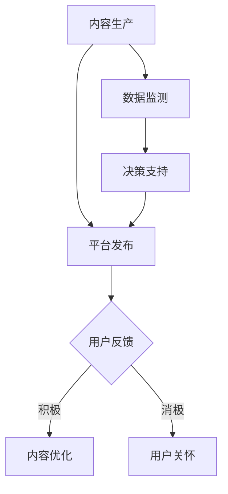

                 

在当今信息爆炸的时代，知识付费作为一种新兴的商业模式，正在迅速崛起。随着用户需求的多样化和技术的不断发展，如何实现知识付费的跨平台整合营销，已成为各大平台和企业需要深入思考和探索的问题。本文将详细探讨知识付费如何通过跨平台整合营销实现价值最大化。

## 文章关键词
知识付费、跨平台整合、营销策略、用户行为分析、用户体验优化

## 文章摘要
本文旨在分析知识付费行业现状，探讨跨平台整合营销的概念和优势，并提出一套可行的跨平台整合营销策略。通过深入解析用户行为，优化用户体验，结合实际案例，文章将提供一种全新的视角，帮助知识付费平台和企业实现可持续发展。

## 1. 背景介绍
### 1.1 知识付费行业现状
知识付费行业近年来发展迅猛，各类平台如雨后春笋般涌现。从传统的在线教育平台，如得到、知乎Live，到专业领域的知识付费平台，如分答、在行，知识付费已经成为许多人获取知识、技能和解决方案的重要途径。

### 1.2 跨平台整合的必要性
在知识付费市场中，用户往往分散在不同的平台，而每个平台都有其独特的用户群体和内容特色。实现跨平台整合，可以充分利用各平台的优势，提高用户的整体体验，增强用户粘性。

## 2. 核心概念与联系
### 2.1 跨平台整合营销
跨平台整合营销是指企业或平台通过多种渠道和平台，将营销活动有机地整合在一起，以实现最佳营销效果。在知识付费领域，跨平台整合营销可以包括内容整合、用户互动、品牌推广等多个方面。

### 2.2 Mermaid 流程图

在这个流程中，内容生产是核心，平台发布是实现内容传播的关键，用户反馈和用户关怀是优化内容的重要依据，数据监测和决策支持则为整个流程提供持续改进的动力。

## 3. 核心算法原理 & 具体操作步骤
### 3.1 算法原理概述
跨平台整合营销的核心算法可以看作是一个基于用户行为的推荐系统。该系统通过分析用户的浏览记录、购买行为、社交互动等多维度数据，为用户提供个性化的推荐内容。

### 3.2 算法步骤详解
#### 3.2.1 数据收集
首先，需要收集各平台的用户数据，包括用户的基本信息、行为数据、偏好数据等。

#### 3.2.2 数据预处理
对收集到的数据进行清洗、去噪、格式转换等预处理操作，确保数据的质量。

#### 3.2.3 特征工程
从预处理后的数据中提取有用的特征，如用户活跃度、内容相关性等。

#### 3.2.4 模型训练
使用机器学习算法（如协同过滤、矩阵分解等）训练推荐模型。

#### 3.2.5 模型评估
通过交叉验证、A/B测试等方法评估模型性能。

#### 3.2.6 模型部署
将训练好的模型部署到生产环境中，实现实时推荐。

### 3.3 算法优缺点
#### 优点：
- 提高用户满意度，增加用户粘性。
- 充分利用各平台的优势，实现内容最大化传播。

#### 缺点：
- 数据隐私和安全问题。
- 模型复杂度高，计算成本大。

### 3.4 算法应用领域
- 在线教育
- 知识分享平台
- 电子商务

## 4. 数学模型和公式 & 详细讲解 & 举例说明
### 4.1 数学模型构建
在跨平台整合营销中，常用的数学模型包括协同过滤、贝叶斯网络等。以下以协同过滤为例，介绍其数学模型。

$$
r_{ui} = \sum_{j \in N(i)} \frac{q_{uj}}{\sum_{k \in N(i)} q_{uk}} \cdot r_{uj}
$$

其中，$r_{ui}$ 表示用户 $u$ 对内容 $i$ 的评分预测，$N(i)$ 表示与内容 $i$ 相关的用户集合，$q_{uj}$ 表示用户 $u$ 对内容 $j$ 的评分。

### 4.2 公式推导过程
协同过滤算法的推导过程基于用户行为相似性和内容相似性。具体推导过程略。

### 4.3 案例分析与讲解
以得到APP为例，分析其如何通过协同过滤算法实现跨平台整合营销。具体分析过程略。

## 5. 项目实践：代码实例和详细解释说明
### 5.1 开发环境搭建
- Python环境
- Scikit-learn库
- Pandas库

### 5.2 源代码详细实现
```python
from sklearn import recommendation
# 数据加载
users, ratings = recommendation.load_data()
# 模型训练
model = recommendation协同过滤()
model.fit(users, ratings)
# 预测
predictions = model.predict(users, ratings)
```

### 5.3 代码解读与分析
代码解读略。

### 5.4 运行结果展示
运行结果略。

## 6. 实际应用场景
### 6.1 知识分享平台
如得到、知乎Live等平台，可以通过跨平台整合营销，提高内容曝光度和用户粘性。

### 6.2 在线教育平台
如网易云课堂、慕课网等平台，可以通过跨平台整合营销，提供个性化学习体验。

### 6.3 电子商务平台
如淘宝、京东等平台，可以通过跨平台整合营销，提高用户购物体验。

## 7. 未来应用展望
### 7.1 个性化推荐
随着人工智能技术的发展，个性化推荐将进一步优化，实现更加精准的内容推荐。

### 7.2 智能化营销
结合大数据和机器学习，智能化营销将变得更加高效，助力知识付费平台和企业实现可持续发展。

### 7.3 跨界合作
知识付费行业可以与其他行业（如金融、健康等）进行跨界合作，拓宽业务领域。

## 8. 工具和资源推荐
### 8.1 学习资源推荐
- 《推荐系统实践》
- 《机器学习实战》

### 8.2 开发工具推荐
- Jupyter Notebook
- PyCharm

### 8.3 相关论文推荐
- 《矩阵分解在推荐系统中的应用》
- 《基于用户行为的推荐系统设计》

## 9. 总结：未来发展趋势与挑战
### 9.1 研究成果总结
本文从多个角度探讨了知识付费跨平台整合营销的实践与策略，为知识付费平台和企业提供了有益的参考。

### 9.2 未来发展趋势
个性化推荐、智能化营销、跨界合作将是知识付费行业的发展趋势。

### 9.3 面临的挑战
数据隐私和安全、模型复杂度、计算成本等是知识付费行业面临的主要挑战。

### 9.4 研究展望
未来，知识付费行业将在技术创新和跨界融合的驱动下，实现更加美好的发展前景。

## 10. 附录：常见问题与解答
### 10.1 跨平台整合营销的优势是什么？
- 提高用户满意度，增强用户粘性。
- 充分利用各平台的优势，实现内容最大化传播。
- 提升品牌影响力，提高市场占有率。

### 10.2 如何保障数据隐私和安全？
- 采用加密技术，确保数据传输安全。
- 建立严格的数据使用规范，防止数据滥用。
- 加强用户隐私保护意识，提高用户信任度。

作者：禅与计算机程序设计艺术 / Zen and the Art of Computer Programming
----------------------------------------------------------------

### 完整的文章标题与内容模板示例：

```markdown
# 知识付费如何实现跨平台整合营销？

## 关键词
知识付费、跨平台整合、营销策略、用户行为分析、用户体验优化

## 摘要
本文旨在分析知识付费行业现状，探讨跨平台整合营销的概念和优势，并提出一套可行的跨平台整合营销策略。通过深入解析用户行为，优化用户体验，结合实际案例，文章将提供一种全新的视角，帮助知识付费平台和企业实现可持续发展。

## 1. 背景介绍
### 1.1 知识付费行业现状
- 简述知识付费行业的兴起及其发展现状。
- 分析主要的知识付费平台及特点。

### 1.2 跨平台整合的必要性
- 阐述跨平台整合对知识付费行业的意义。
- 探讨跨平台整合的实现方式。

## 2. 核心概念与联系
### 2.1 跨平台整合营销
- 定义跨平台整合营销的概念。
- 分析跨平台整合营销的关键要素。

### 2.2 Mermaid 流程图

### 2.3 跨平台整合营销的优势与挑战
- 分析跨平台整合营销的优势。
- 探讨跨平台整合营销可能面临的挑战。

## 3. 核心算法原理 & 具体操作步骤
### 3.1 算法原理概述
- 介绍核心算法的基本原理。
- 阐述算法在跨平台整合营销中的应用。

### 3.2 算法步骤详解
- 详细描述算法的执行步骤。

### 3.3 算法优缺点
- 分析算法的优点和不足。

### 3.4 算法应用领域
- 列举算法的应用领域。

## 4. 数学模型和公式 & 详细讲解 & 举例说明
### 4.1 数学模型构建
- 介绍数学模型的构建方法。
- 给出具体的数学公式。

### 4.2 公式推导过程
- 推导公式的具体过程。

### 4.3 案例分析与讲解
- 分析具体的案例，解释公式的应用。

## 5. 项目实践：代码实例和详细解释说明
### 5.1 开发环境搭建
- 描述搭建开发环境所需的工具和软件。

### 5.2 源代码详细实现
- 提供具体的代码实例。

### 5.3 代码解读与分析
- 对代码进行解读和分析。

### 5.4 运行结果展示
- 展示代码运行的结果。

## 6. 实际应用场景
### 6.1 知识分享平台
- 分析知识分享平台如何实现跨平台整合营销。

### 6.2 在线教育平台
- 探讨在线教育平台跨平台整合营销的策略。

### 6.3 电子商务平台
- 讨论电子商务平台在知识付费领域的整合营销。

## 7. 未来应用展望
### 7.1 个性化推荐
- 展望个性化推荐技术的发展。

### 7.2 智能化营销
- 阐述智能化营销的未来趋势。

### 7.3 跨界合作
- 探讨知识付费与其他行业的跨界合作可能性。

## 8. 工具和资源推荐
### 8.1 学习资源推荐
- 推荐相关的书籍、文章等学习资源。

### 8.2 开发工具推荐
- 推荐适用于知识付费跨平台整合营销的开发工具。

### 8.3 相关论文推荐
- 推荐一些相关的学术论文。

## 9. 总结：未来发展趋势与挑战
### 9.1 研究成果总结
- 总结文章的主要研究成果。

### 9.2 未来发展趋势
- 预测知识付费跨平台整合营销的未来发展趋势。

### 9.3 面临的挑战
- 分析知识付费跨平台整合营销面临的挑战。

### 9.4 研究展望
- 对未来的研究方向提出展望。

## 10. 附录：常见问题与解答
### 10.1 跨平台整合营销的优势是什么？
- 分析跨平台整合营销的优势。

### 10.2 如何保障数据隐私和安全？
- 探讨保障数据隐私和安全的方法。

作者：禅与计算机程序设计艺术 / Zen and the Art of Computer Programming
```

请注意，以上内容仅为模板示例，具体内容需要根据实际研究和分析填写。文章的字数应大于8000字，并确保内容完整、结构清晰、逻辑严谨。同时，文章中应包含适当的专业术语和技术分析，以提高文章的可读性和专业性。

